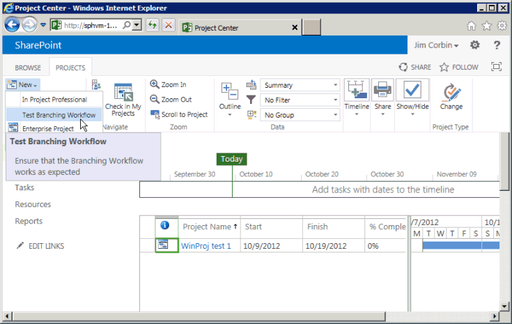

# 需要管理のために Project Server ワークフローを作成します。Create a Project Server workflow for demand management

この資料では、SharePoint Designer 2013 を使用して単純なワークフローを作成する方法について説明します。This article describes how to create a simple workflow by using SharePoint Designer 2013. Visio 2013 にビジュアル化し、編集のワークフローをエクスポートまたは Visio 2013 を使用して、ワークフローを Project Server 2013 を設計し、SharePoint Designer 2013 Project Web App にパブリケーションの設計にインポートできます。You can export the workflow to Visio 2013 for visualization and editing, or use Visio 2013 to design Project Server 2013 workflows and import the design into SharePoint Designer 2013 for publication to Project Web App. SharePoint ワークフローのプラットフォームと Visio 2013 および SharePoint Designer 2013 でワークフローを作成する方法の詳細については、SharePoint 2013 の開発者向けドキュメントでの[SharePoint 2013 のワークフロー](http://msdn.microsoft.com/ja-jp/library/jj163986%28office.15%29.aspx)の記事を参照してください。For more information about the SharePoint workflow platform and creating workflows with Visio 2013 and SharePoint Designer 2013, see the [Workflows in SharePoint 2013](http://msdn.microsoft.com/ja-jp/library/jj163986%28office.15%29.aspx) articles in the SharePoint 2013 developer documentation. 
  
ワークフローのプロジェクトのサーバーを準備する方法の詳細についてを参照してください[を開始: 設定セットアップおよび SharePoint 2013 ワークフロー マネージャーを構成する](http://msdn.microsoft.com/ja-jp/library/jj163276%28office.15%29.aspx)です。For information about preparing Project Server for workflows, see [Start: Set up and configure SharePoint 2013 Workflow Manager](http://msdn.microsoft.com/ja-jp/library/jj163276%28office.15%29.aspx).

## 一般的なワークフローを作成するCreating a general workflow

SharePoint Designer 2013 を使用して Project Server 2013 のワークフローを作成するのにには、次の手順を使用します。Use the following steps to create a Project Server 2013 workflow by using SharePoint Designer 2013. ワークフローはプロジェクト提案の需要管理のために設計されています。The workflow is designed for demand management of project proposals.
  
詳細な手順は、[分岐ワークフローを作成する](#pj15_CreateWorkflowSPD_Detailed)を参照してください。For detailed steps, see the [Creating a branching workflow](#pj15_CreateWorkflowSPD_Detailed) section. 
  
### Project Server ワークフローを作成するには (一般的な手順)To create a Project Server workflow (general procedure)

1. 要件を決定し、ワークフローを設計します。フェーズおよびステージとして整理し、ワークフローが使用するユーザー設定フィールドを決定します。Determine the requirements, and then design the workflow. Organize it into phases and stages, and determine the custom fields that the workflow will use.
    
2. Project Web App では、ワークフローを必要とするエンティティを作成します。In Project Web App, create the entities that the workflow requires:
    
    1. ワークフローの既存のフェーズを確認し、必要に応じてフェーズを作成します。Review the existing workflow phases; create phases as necessary.
        
    2. ワークフローが使用するエンタープライズ ユーザー設定フィールドを作成します。ワークフローのステージで使用できるようにするには、ユーザー設定フィールドをワークフローで制御する必要があります。Create the enterprise custom fields that the workflow will use. To be available in a workflow stage, a custom field must be controlled by a workflow.
        
    3. プロジェクトに関する情報を収集するためにワークフロー ステージが使用するプロジェクト詳細ページ (PDP) を編集または作成します。この例のステージでは、既定の PDP を編集して新しいユーザー設定フィールドを組み込みます。Edit or create the project detail pages (PDPs) that your workflow stages will use to collect information for the project. In this example, the stages use default PDPs that are edited to include a new custom field.
        
    4. 必要なワークフロー ステージを作成し、各ワークフロー ステージを正しいフェーズと関連付けます。Create the necessary workflow stages, and then associate each workflow stage with the correct phase.
    
3. SharePoint Designer 2013 のでは、**デザイナーのテキスト ベース**の宣言ステートメントを使用してワークフローを作成します。In SharePoint Designer 2013, construct the workflow by using declarative statements in the **Text-Based Designer**:
    
    > [!NOTE]
    > SharePoint Designer 2013 では、**ビジュアル デザイナー**に切り替えます。 または Visio 2013 の既存のワークフローのインポートもできます。You can also switch to the **Visual Designer** in SharePoint Designer 2013, or import an existing workflow from Visio 2013. **テキスト ベースのデザイナー**を使用してこれらの手順に従います。Follow these steps to use the **Text-Based Designer**: 
    > 
    > 1. Project Web App サイトを開き、 **SharePoint 2013 ワークフロー: Project Server**ワークフローのプラットフォームを使用するサイトのワークフローを作成します。Open the Project Web App site, and then create a site workflow that uses the **SharePoint 2013 Workflow - Project Server** workflow platform. 
    > 2. ワークフローが使用するステージを追加します。Add the stages that the workflow uses.
    > 3. 各ステージで必要なワークフローのステップ、条件、アクション、およびループを挿入します。Insert the workflow steps, conditions, actions, and loops that are required in each stage.
    > 4. ワークフローのエラーを調べて、ある場合は修正します。Check for any workflow errors and fix any that you find.
    > 5. (省略可能)**ビジュアル デザイナー**にビューを切り替えるか、ワークフローを Visio 2013 ファイルにエクスポートします。(Optional) Switch the view to the **Visual Designer**, or export the workflow to a Visio 2013 file. Visio のビューを変更し、現在のワークフローに変更を保存できます。You can modify the Visio view and save changes to the current workflow. Visio ファイルを編集し、他のワークフローを作成するのには、SharePoint Designer 2013 にインポートできます。You can edit the Visio file and import it in SharePoint Designer 2013 to create other workflows.
    > 6. ワークフローを発行します。Publish the workflow. パブリッシュされた後、Project Web App サイトのワークフローのリストにワークフローを示しています。After it is published, the workflow shows in the list of workflows for the Project Web App site.
    
4. Project Web App では、プロジェクト提案の需要管理のワークフローを使用します。In Project Web App, use the workflow for demand management of project proposals:
    
    1. ワークフローを使用するエンタープライズ プロジェクト テンプレート (EPT) を作成します。Create an enterprise project template (EPT) that uses the workflow.
        
    2. [プロジェクト センター] ページで、ワークフローの EPT を使用するプロジェクトを作成し、ワークフローのステージに従います。On the Project Center page, create a project that uses the EPT for the workflow, and then follow through the workflow stages.
        
    3. ワークフローを詳細にテストします。Test the workflow thoroughly.
        
    4. 運用サーバーにワークフローを展開します。Deploy the workflow to a production server.

## 分岐ワークフローを作成するCreating a branching workflow

SharePoint Designer 2013 を使用するには Project Server ワークフローを作成するのには、前に、Project Server 2013 のワークフロー アクティビティを使用するワークフロー マネージャーのクライアント 1.0 サービスを構成しなければなりません。Before you can use SharePoint Designer 2013 to create a Project Server workflow, the Workflow Manager Client 1.0 service must be configured to use the Project Server 2013 workflow activities. ワークフロー マネージャーのクライアント 1.0 を構成する方法の詳細については、SharePoint Server 2013 の開発者向けドキュメントでの[SharePoint 2013 のワークフロー](http://msdn.microsoft.com/ja-jp/library/jj163986%28office.15%29.aspx)の記事を参照してください。For information about how to configure Workflow Manager Client 1.0, see the [Workflows in SharePoint 2013](http://msdn.microsoft.com/ja-jp/library/jj163986%28office.15%29.aspx) articles in the SharePoint Server 2013 developer documentation. 
  
次の詳細な手順には、[一般的なワークフローを作成する](#pj15_CreateWorkflowSPD_General)セクションと同じ手順が含まれています。The following detailed procedure includes the same steps as in the [Creating a general workflow](#pj15_CreateWorkflowSPD_General) section. 
  
### Project Server 分岐ワークフローを作成するには (詳細な手順)To create a Project Server branching workflow (detailed procedure)

#### 1. 計画し、ワークフローを設計します。1. Plan and design the workflow.

複数の Project Server ワークフローを統合できるステージし、需要管理プロセスの段階です。A Project Server workflow can integrate with multiple stages and phases in a demand-management process. ワークフローは複雑になるためは、ビジネス要件を理解してワークフローを慎重に計画する必要があります。Because workflows can be complex, you must understand the business requirements and plan a workflow carefully. 単純な例については、提案が受け入れられるかどうかを決定するプロジェクトの提案の見積原価を使用する分岐ワークフローを設計します。For a simple example, design a branching workflow that uses the estimated cost of a project proposal to determine whether the proposal is accepted. 推定コストが大きい場合よりも $25,000 米ドル、拒絶します。それ以外の場合、提案を承諾し、プロジェクトを作成します。If the estimated cost is greater than $25,000 USD, reject the proposal; otherwise, accept the proposal and create the project.
    
Visio 2013 と SharePoint Designer 2013 を使用するには、設計を支援し、Project Server 2013 のワークフローを作成、ためするより簡単に試してみることがワークフローに Project Server 2010 では不可能な。Because you can use Visio 2013 and SharePoint Designer 2013 to help design and create workflows for Project Server 2013, you can more easily experiment with workflows than is possible with Project Server 2010. この資料のサンプル ワークフローの設計は、プロジェクト 2010 SDK 内の[分岐ワークフローを作成する](http://msdn.microsoft.com/library/a02cafdc-d881-4271-b446-d8b2cd456a52%28Office.15%29.aspx)資料と同じです。The sample workflow design in this article is the same as in the [Create a branching workflow](http://msdn.microsoft.com/library/a02cafdc-d881-4271-b446-d8b2cd456a52%28Office.15%29.aspx) article in the Project 2010 SDK. 設計および Project Web App のテスト インスタンスを使用してリモート コンピューター上のテストのワークフローを作成することができます: Project Server 2013 のコンピューター上で直接ワークフローを作成する必要はありません。You can design and create a test workflow on a remote computer using a test instance of Project Web App—you do not have to create workflows directly on a Project Server 2013 computer. 
    
#### 2. ワークフローを必要とするエンティティを作成します。2. Create the entities that your workflow requires.

Project Web App では、使用可能なワークフローのフェーズとステージ、および使用可能なエンタープライズ ユーザー設定フィールドを確認します。In Project Web App, review the available workflow phases and stages, and the enterprise custom fields that are available. 必要に応じて、次の手順に示すように、ワークフローで必要なエンティティを作成します。If necessary, create the entities that your workflow requires, as in the following steps:
    
1. **ワークフロー フェーズ**Project Web App の既定のインストールには、作成、選択、計画、管理、および終了フェーズが含まれています。**Workflow phases** The default installation of Project Web App includes the Create, Select, Plan, Manage, and Finished phases. 分岐ワークフロー例では、他のフェーズを作成する必要はありません。For the branching workflow example, you do not have to create other phases. 
        
2. **エンタープライズ ユーザー設定フィールド**分岐ワークフローには、ワークフロー管理の対象であるプロジェクトのコストのユーザー設定フィールドが必要です。**Enterprise custom fields** The branching workflow requires a project cost custom field that is workflow-controlled. ワークフローで制御されたユーザー設定フィールドの値は、前述のように、ワークフローを使用するに設定します。The value of a workflow-controlled custom field is set in a PDP that the workflow uses. たとえば、 **PWA の設定**] を選択し、**エンタープライズ ユーザー設定フィールドと参照テーブル**を選択し、Project Web App ページの上部右側の [**設定**] アイコンを選択します。For example, choose the **Settings** icon at the top-right of a Project Web App page, choose **PWA Settings**, and then choose **Enterprise Custom Fields and Lookup Tables**.
        
   **プロジェクト**エンティティの提案のコストをという名前のカスタム フィールドを作成し、**コスト**の種類を選択します。Create a custom field named Proposal Cost for the **Project** entity, and select the type **Cost**. 説明は、プロジェクトの提案の見積もりコストを入力します。For the description, type Estimated cost of a project proposal. **[動作**] セクションで、**ワークフローによって動作が制御**を選択します。In the **Behavior** section, choose **Behavior controlled by workflow**.
        
3. **プロジェクト詳細ページ**編集するか、ワークフロー ステージを使用する Pdp を作成します。**Project detail pages** Edit or create the PDPs that the workflow stages will use. たとえば、次の手順の操作を行います。For example, do the following steps: 
        
    1. [サーバー設定] ページで、**プロジェクト詳細ページ**を選択し、PDP、 **ProjectInformation**します。Choose **Project Detail Pages** on the Server Settings page, and then choose the **ProjectInformation** PDP. 
            
    2. [**編集**] で、リボンの [**ページ**] タブで、**ページの編集**を選択します。On the **PAGE** tab of the ribbon, in the **Edit** group, choose **Edit Page**.
            
    3. **基本情報**web パーツの右上の下向き矢印を選択し、 **web パーツを編集**します。Choose the down arrow at the top-right of the **Basic Info** web part, and then choose **Edit web part**. または、[ **WEB パーツ**] タブの [**プロパティ**] で、リボンのエディター パーツを表示する**web パーツのプロパティ**を選択します。Or, on the **WEB PART** tab of the ribbon, in the **Properties** group, choose **web part Properties** to show the editor part. 
            
    4. **プロジェクト フィールドの表示**にエディターのセクションは (図 1 を参照) の一部、**変更**を選択します。In the **Displayed Project Fields** section of the editor part (see Figure 1), choose **Modify**.
            
    5. **プロジェクト フィールドの選択**] ボックスの一覧で、[**所有者**] フィールドの上に移動ユーザー設定の**提案のコスト**フィールドを追加し、 **[ok]** を選択し (図 1 を参照してください)。Add the **Proposal Cost** custom field, move it above the **Owner** field in the **Selected Project Fields** list, and then choose **OK** (see Figure 1).
      
    6. エディターでは、 **[ok]** を選択し、[**編集**] で、リボンの [**ページ**] タブで [**編集の終了**」を選択します。In the editor part, choose **OK**, and then choose **Stop Editing** in the **Edit** group, on the **PAGE** tab of the ribbon. プロジェクト情報 PDP に追加される**提案のコスト**のユーザー設定フィールドを図 2 に示します。Figure 2 shows the **Proposal Cost** custom field that is added to the Project Information PDP. 

    **図 1 です。前述のようにプロジェクト フィールド web パーツを編集****Figure 1. Editing the Project Fields web part in a PDP**

    

    **図 2 になります。編集後の PDP には、提案のコストのカスタム フィールドが含まれています。****Figure 2. The edited PDP includes the Proposal Cost custom field**

    ![編集後の PDP には、提案のコスト] フィールドが含まれています。](media/pj15_CreateWorkflowSPD_EditedPDP.gif "編集後の PDP には、提案のコスト] フィールドが含まれています。")
  
4. **ワークフロー ステージ**ワークフローの各フェーズに必要な各段階を作成します。**Workflow stages** Create the stages that are required for each phase of the workflow. サーバーの設定] ページで、**ワークフロー ステージ**の選択をポイントし、**新しいワークフロー ステージ**です。On the Server Settings page, choose **Workflow Stages**, and then choose **NEW WORKFLOW STAGE**. ワークフロー ステージの追加] ページの一部を図 3 に示します。Figure 3 shows part of the Add Workflow Stage page.
    
    **図 3 です。Project Web App でのワークフロー ステージを追加します。****Figure 3. Adding a workflow stage in Project Web App**

    
  
    ワークフローの分岐の例では、表 1 に示されている 4 つの段階を使用します。The branching workflow example uses the four stages that are shown in Table 1. (図 3 では表示されません)、ワークフロー ステージの追加] ページの [**可視のプロジェクト詳細ページに追加の設定**] セクションでは値は省略可能です。[ワークフローの状態] ページの詳細を提供します。In the **Additional Settings for the Visible Project Detail Page** section of the Add Workflow Stage page (not shown in Figure 3), values are optional; they provide more information on the Workflow Status page. などの初期の提案の詳細の PDP は、ユーザー入力を必要とするため**のプロジェクト詳細ページに注意が必要です**] チェック ボックスを選択して、特定の説明は次のようにプロジェクト名を設定し、この PDP のコストを追加します。For example, because the Initial Proposal Details PDP requires user input, you can select the **The Project Detail Page requires attention** check box, and then add a specific description such as Set the project name and cost for this PDP.
    
    図 4 では、[ワークフロー ステージ] ページで完成した 4 つのステージを示します。Figure 4 shows the four stages completed on the Workflow Stages page.
    
    **表 1 です。分岐ワークフローの段階****Table 1. Stages for the branching workflow**

    |名前Name|説明Description|提出の説明Description for Submit|フェーズPhase|表示される PDPVisible PDPs|ユーザー設定フィールドCustom Fields|
    |:-----|:-----|:-----|:-----|:-----|:-----|
    |初期段階の提案の詳細Initial Proposal Details    |プロジェクト名とコストを設定します。Set the project name and cost.    |提案としてプロジェクトを提出します。Submit the project as a proposal.    |作成Create    |プロジェクト情報Project Information    プロジェクトの詳細Project Details    |提案のコスト (必須)Proposal Cost (required)    |
    |プロジェクトの詳細Project Details    |提案されるプロジェクトの詳細を提供します。Provide details of the proposed project.    |詳細を提出してプロジェクトを続行します。Submit details to continue with the project.    |作成Create    |プロジェクト情報Project Information    プロジェクトの詳細Project Details    |提案のコスト (読み取り専用)Proposal Cost (read-only)    |
    |自動的に却下Automated Rejection    |提供された情報に基づいて提案を拒否します。The proposal is rejected, based on the information that is provided.    |   |作成Create    |プロジェクト情報Project Information    |提案のコスト (読み取り専用)Proposal Cost (read-only)    |
    |実行Execution    |提案を受け入れ、プロジェクト管理できる状態にします。The proposal is accepted, and ready for project management.    |   |管理Manage    |プロジェクト情報Project Information    プロジェクトの詳細Project Details    |提案のコスト (読み取り専用)Proposal Cost (read-only)    |
   
    **図 4 です。Project Web App でのワークフロー ステージの一覧****Figure 4. List of the workflow stages in Project Web App**

    
  
#### 3. テキスト ベースのデザイナーでワークフローを構築します。3. Construct the workflow in the Text-Based Designer.

SharePoint Designer 2013 では、テキスト ベースのデザイナーの宣言ステートメントを使用してワークフローを構築します。In SharePoint Designer 2013, construct the workflow by using declarative statements in the Text-Based Designer. ワークフロー ロジックとこれまでの手順を実行すると、状況依存の自動補完のステートメントを取得するのにはオレンジ色の挿入行で入力を開始することができます。 またはリボンの [**ワークフロー** ] タブで [**挿入**] でコントロールを使用して、ロジックと手順を挿入することができます。You can start typing at the orange insertion line to get context-sensitive auto-completion statements for the workflow logic and steps, or you can insert the logic and steps by using controls in the **Insert** group on the **WORKFLOW** tab of the ribbon. 
    
1. SharePoint Designer 2013 の Backstage ビューでは、**サイトを開く**を選択します。In the Backstage view of SharePoint Designer 2013, choose **Open Site**. たとえば、 `http://ServerName/pwa`。For example, open  `http://ServerName/pwa`. **ナビゲーション**・ ペインでは、**ワークフロー**を選択します。In the **Navigation** pane, choose **Workflows**. 次に、リボンの [**新規**] グループの [**ワークフロー** ] タブでは、**サイトのワークフロー**を選択します。Then, on the **WORKFLOWS** tab of the ribbon, in the **New** group, choose **Site Workflow**. この例では、分岐ワークフローのワークフローの名前です。For this example, name the workflow Branching Workflow. **プラットフォームの種類**」ドロップ ダウン リストで**SharePoint 2013 ワークフロー ・ プロジェクトのサーバー**が選択されていることを確認 (図 5 を参照してください)。Ensure that **SharePoint 2013 Workflow - Project Server** is selected in the **Platform Type** drop-down list (see Figure 5). 
    
    **図 5。Project Server サイト ワークフローを作成します。****Figure 5. Creating a Project Server site workflow**

    
  
2. **分岐ワークフロー** ] タブを選択します。次に、[**管理**] グループの [**ビュー** ] ドロップダウン リストで、リボンの [**ワークフロー** ] タブでは、**テキスト ベースのデザイナー**を選択します。Select the **Branching Workflow** tab. Then, on the **WORKFLOW** tab of the ribbon, in the **Manage** group, in the **Views** drop-down list, choose **Text-Based Designer**. 点滅オレンジ色で表示するのにはカーソルの行ビュー (図 6 を参照) をクリック。To show the view with the blinking orange insertion line (see Figure 6), click within the view.
    
    **図 6 です。ワークフローのテキスト ベースのデザイナー ビューを使用します。****Figure 6. Using the Text-Based Designer view for the workflow**

    
  
3. **テキスト ベースのデザイナー**ビューで、ワークフローを使用するステージを追加します。In the **Text-Based Designer** view, add the stages that the workflow uses. [**挿入**] で、[**の作成**、**ステージ**のドロップ ダウン リストで、リボンの [**ワークフロー** ] タブでは、**最初の提案の詳細**を選択します。On the **WORKFLOW** tab of the ribbon, in the **Insert** group, in the **Stage** drop-down list under **Create**, choose **Initial Proposal Details**.
    
    同様に、下のオレンジ色の挿入位置に配置、**ステージ: 初期の提案の詳細**ボックス、およびワークフローを使用するその他のステージの追加:**プロジェクトの詳細**、**却下の自動化**、および**実行**(図 7 を参照してください)。Similarly, place the orange insertion line below the **Stage: Initial Proposal Details** box, and add the other stages that the workflow uses: **Project Details**, **Automated Rejection**, and **Execution** (see Figure 7). 
    
    **図 7 です。SharePoint デザイナーでワークフローにステージを追加します。****Figure 7. Adding a stage to a workflow in SharePoint Designer**

    
  
4. 各ステージにワークフローのステップとロジックを追加します。Add the workflow steps and logic within each stage: 
    
    1. **提案の詳細を初期**の段階では、ステージの本文の上部にあるオレンジ色の挿入位置を配置します。In the **Initial Proposal Details** stage, place the orange insertion line at the top of the stage body. リボンの [**挿入**] グループで**アクション**を選択して、 **Project Web App のアクション**では、下にスクロールし、**プロジェクトのイベントを待機**します。In the **Insert** group on the ribbon, choose **Action**, scroll down to **Project Web App Actions**, and then choose **Wait for Project Event**. **このプロジェクトのイベント**を選択し、選択**イベント: プロジェクトを送信するとき**」ドロップ ダウン リストにします。Choose **this project event**, and then select **Event: When a project is submitted** in the drop-down list. 
    
    2. **提案の詳細の最初**のステージの**ステージへの移行**] セクションで、**任意の値が等しい場合**を挿入します。In the **Transition to stage** section of the **Initial Proposal Details** stage, insert **If any value equals value**. **条件**のコントロールを使用して、リボンの [**挿入**] グループでまたはステートメントの入力を開始できます。You can start typing the statement or use the **Condition** control in the **Insert** group on the ribbon. 
    
    3. **値**の最初のコントロールを選択し、 **[ワークフロー参照の定義**] ダイアログを表示するのには、 **fx**を選択 (図 8 を参照してください)。Choose the first **value** control, and then choose **fx** to show the **Define Workflow Lookup** dialog box (see Figure 8). **データ ソース**ボックスの一覧で、**プロジェクト データ**を選択します。In the **Data source** drop-down list, select **Project Data**. **ソースのフィールド**のドロップダウン] ボックスの一覧では、**提案のコスト**を選択します。In the **Field from source** drop-down list, select **Proposal Cost**.
    
       **図 8 です。ワークフローでは、ルックアップ値を定義します。****Figure 8. Defining a lookup value in the workflow**

       
  
    4. 完了、`If`ステートメントを次に示しますので:**場合のプロジェクトのデータ: 提案のコストが 25000 を超えています。**Complete the  `If` statement so that it shows the following: **If Project Data:Proposal Cost is greater than 25000**
    
       > [!NOTE]
       > 代わりに、ワークフロー変数を作成するカスタム フィールドの値に変数を設定、および変数値とを比較し、でした。Alternately, you could create a workflow variable, set the variable to the custom field value, and then compare the variable with a value. たとえば、リボンの [**ローカル変数**」ドロップ ダウン リストから**合計**(スペースなし)**数**を入力するをという名前の変数を作成します。For example, from the **Local Variables** drop-down list on the ribbon, create a variable named **TotalCost** (no spaces) of type **Number**. **ワークフロー参照の定義**] ダイアログ ボックスで、データ ソースの**ワークフローの変数とパラメーター**を選択し、選択**変数: 合計**フィールドとします。In the **Define Workflow Lookup** dialog box, select **Workflow Variables and Parameters** for the data source, and then select **Variable: TotalCost** as the field. **If**ステートメントになりますし、:**場合は、変数: 合計が 25000 を超える**The **If** statement would then be: **If Variable: TotalCost is greater than 25000**
  
    5. 内のオレンジ色の挿入行に配置、 `If` 、分岐し、挿入し、コントロールを使用して、**アクション**リボンの [**挿入**] グループで**の段階に戻る**。Place the orange insertion line within the  `If` branch, and then insert **Go to a stage** by using the **Action** control, in the **Insert** group on the ribbon. **ステージ**のドロップダウン コントロールを選択し、**拒否の自動**ステージを選択します。Choose the **a stage** drop-down control and select the **Automated Rejection** stage. 
    
       同様で、`Else`分岐、**プロジェクトの詳細には、** ステートメントを挿入します。Similarly, in the  `Else` branch, insert the **Go to Project Details** statement. 図 9 は、完了した**最初の提案の詳細**の段階を示しています。Figure 9 shows the completed **Initial Proposal Details** stage. 
    
       **図 9 です。提案の詳細を初期の段階の完了のロジック****Figure 9. Completed logic for the Initial Proposal Details stage**

       
  
    6. ステージでは、**拒否の自動化**、ワークフローを一時停止し、前述のようにいくつかのデータを表示する場合を除き、空のまま最初のセクション。In the **Automated Rejection** stage, unless you want to pause the workflow and show some data in a PDP, leave the first section empty. **ステージへの移行**] セクションが必要になりますを含める必要があります。却下を次のステージがないため、型は、ステートメントの終了のワークフローに移動します。The **Transition to stage** section must contain a transition; because there is no other stage following a rejection, type Go to End of Workflow for the statement. 
    
    7. ステージでは、**プロジェクトの詳細****ステージへの移行**] セクションで実行する検索を追加します。In the **Project Details** stage, add Go to Execution in the **Transition to stage** section. 追加のデータを追加するには、ワークフローを一時停止する、しない限り、送信されたイベントを待機する必要はありません。Unless there is additional data to add, or you want to pause the workflow, it is not necessary to wait for a submitted event. 
    
    8. **実行**の段階で、ワークフローを一時停止する場合を除き、空のままにステージの [操作] セクション。In the **Execution** stage, unless you want to pause the workflow, leave the stage action section empty. **ステージへの移行**] セクションで、**ワークフローの最後に移動**を追加します。In the **Transition to stage** section, add **Go to End of Workflow**.
    
5. リボンの [**保存**] で (図 10 を参照してください) ワークフローのエラーをチェックする**エラー チェック**を選択します。In the **Save** group on the ribbon, choose **Check for Errors** to check for workflow errors (see Figure 10). エラーを修正し、**保存**します。Fix any errors, and then choose **Save**.
    
    **図 10 です。ワークフローの SharePoint デザイナーでのエラーをチェックします。****Figure 10. Checking the workflow for errors in SharePoint Designer**

    
  
6. (省略可能)[**表示**] ドロップダウン メニューで、リボンの [**管理**] グループには、**ビジュアル デザイナー**を選択します。(Optional) In the **Manage** group on the ribbon, in the **Views** drop-down menu, choose **Visual Designer**. 図 11 にビューが 50% に縮小します。In Figure 11, the view is zoomed out to 50%.
    
    ワークフロー内の項目を編集するには、ビジュアル デザイナーを使用します。You can edit items in the workflow by using the Visual Designer. やなど、**任意の値が値と等しいかどうか**の条件を選択条件の左下にある [ツール] アイコンを選択し、[**プロパティ**] ダイアログ ボックスで比較条件を表示する**値**を選択します。For example, select the **If any value equals value** condition, choose the tool icon at the bottom-left of the condition, and then select **Value** to show the comparison conditions in the **Properties** dialog box. 
    
    **図 11。ワークフローのビジュアル デザイナーを使用します。****Figure 11. Using the Visual Designer for a workflow**

    
  
    ワークフローは、ビジュアル デザイナーのビューでは、ときに Visio 2013 (.vsdx) ファイルにバックアップとして、ワークフローを保存または後で使用して、ことができます**Visio にエクスポート**します。When the workflow is in the Visual Designer view, to save the workflow in a Visio 2013 (.vsdx) file as a backup or for later use, you can choose **Export to Visio**.
    
7. ワークフローを発行します。Publish the workflow. SharePoint Designer 2013 を使用してワークフローを作業中の Project Web App サイトに発行すると、ワークフローは Azure または SharePoint サイトに登録され、新しい EPTs Project Web App 内で使用可能になります。When you use SharePoint Designer 2013 to publish the workflow to the active Project Web App site, the workflow is registered to the SharePoint site or in Azure and becomes available within Project Web App for new EPTs.

#### 4. ワークフローの、EPT を作成して、ワークフローをテストします。4. Create an EPT for the workflow, and then test the workflow.

Project Web App では、ワークフローの EPT を作成し、プロジェクトの提案を作成することによって、ワークフローをテストします。In Project Web App, create an EPT for the workflow, and then test the workflow by creating a project proposal:
    
1. PWA の設定] ページで、[**エンタープライズ プロジェクトの種類**の選択し、テスト分岐ワークフローの名前、EPT を作成し。On the PWA Settings page, choose **Enterprise Project Types**, and then create an EPT named Test Branching Workflow. プロジェクトのサーバーは、EPT を作成したプロジェクトの完全な制御を維持するためは、 **SharePoint タスク リスト プロジェクトとして新しいプロジェクトを作成する**] チェック ボックスをオフにします。Clear the **Create new projects as SharePoint Tasks List Projects** check box so that Project Server will maintain full control of projects that are created by the EPT. **サイト ワークフローの関連付け**」ドロップ ダウン リストで、[**ワークフローの分岐**を選択し、ワークフローを表示する最初のページに**新しいプロジェクト] ページ**のドロップダウン リストで、**プロジェクト情報**PDP を選択します。Select **Branching Workflow** in the **Site Workflow Association** drop-down list, and then select the **Project Information** PDP in the **New Project Page** drop-down list to be the first page that the workflow shows. 
    
    **図 12 です。ワークフローは、EPT を追加します。****Figure 12. Adding an EPT for the workflow**

    
  
    > [!NOTE]
    > エンタープライズ プロジェクトの種類のテーブルの [ **SharePoint タスク リスト プロジェクト**] 列で **[はい]** 値は、SharePoint タスク リスト、タスク リストは、Project Web App で表示されていますが、SharePoint プロジェクトの制御を維持するを作成する、EPT を参照します。.A **Yes** value in the **SharePoint Tasks List Project** column in the table of enterprise project types refers to an EPT that creates a SharePoint tasks list, where the tasks list is visible in Project Web App but SharePoint maintains control of the project. SharePoint タスク リストとプロジェクトの管理の詳細については、 [Project Server 2013 のアーキテクチャ](project-server-2013-architecture.md)を参照してください。For more information about managing projects as SharePoint tasks lists, see [Project Server 2013 architecture](project-server-2013-architecture.md). 
  
2. Project Web App の [プロジェクト] ページを開くし、新しい EPT を使用してプロジェクトを作成し、(図 13 を参照してください)。Open the Projects page in Project Web App, and then create a project by using the new EPT (see Figure 13). **テスト分岐ワークフロー**が**ワークフローの分岐**に関連付けられているため、ワークフローの制御下にあるプロジェクトの作成を開始します。Because **Test Branching Workflow** is associated with **Branching Workflow**, project creation starts under control of the workflow.
    
    **図 13。テスト分岐ワークフロー EPT でプロジェクトを作成します。****Figure 13. Creating a project with the Test Branching Workflow EPT**

    
  
3. ワークフローは、**プロジェクト情報**PDP を表示するときは、[プロジェクト] フィールドにデータを追加します。When the workflow displays the **Project Information** PDP, add data to the project fields. たとえば、30000 の**提案のコスト**値を入力します。For example, enter a **Proposal Cost** value of 30000. 英語版の Project Server に $30,000 を表示するフィールドを変更する (図 14 を参照してください)。The U.S. English version of Project Server changes the field to show $30,000 (see Figure 14).
    
    **図 14。編集済みのプロジェクト情報 PDP を使用します。****Figure 14. Using the edited Project Information PDP**

    
  
4. [**プロジェクト**] グループで、リボンの [**プロジェクト**] タブには、**保存**を選択します。On the **PROJECT** tab of the ribbon, in the **Project** group, choose **Save**. Project Server は PDP のデータをプロジェクトに追加し、ワークフローの状態ページを表示し、(図 15 を参照してください)。Project Server adds the data in the PDP to the project, and then shows the Workflow Status page (see Figure 15). ワークフローの状態の図で最初の提案の詳細はステージの完全な説明を表示するには、ワークフローの視覚エフェクト内のステージ上でポインターを置きます。To see the full description of the Initial Proposal Details stage in the workflow status diagram, hover the pointer over the stage in the workflow visualization diagram.
    
    **すべてのワークフロー ステージ**グリッドでは、緑色の矢印を使用して、提案の詳細を初期の段階が入力を待っていることを示します。The **All Workflow Stages** grid uses a green arrow to show that the Initial Proposal Details stage is waiting for input. 送信イベントの提案の詳細を初期の段階で、ワークフローを待っているためにです。This is because the workflow waits for a submit event in the Initial Proposal Details stage. ワークフローは、送信イベントを待たず場合、ことができます**次へ**次の PDP に進むには、**ページ**グループで。If the workflow did not wait for a submit event, you could choose **Next** in the **Page** group to advance to the next PDP. 
    
    **図 15 です。提案の詳細を初期の段階でワークフローの状態ページを使用します。****Figure 15. Using the Workflow Status page in the Initial Proposal Details stage**

    
  
    ワークフローの視覚エフェクトの図は、緑の色で、現在のステージを示しています。The workflow visualization diagram shows the current stage in a green color. **作成**段階では、提案の詳細を初期の段階で現在のステージです。In the **Create** phase, the Initial Proposal Details stage is the current stage. 
    
5. 、リボン上の [**ワークフロー** ] で、[**送信**] を選択します。On the ribbon, in the **Workflow** group, choose **Submit**.
    
    > [!TIP]
    > **送信**コントロールを無効にした場合は、ページを更新します。If the **Submit** control is disabled, refresh the page. 
  
    **提案のコスト**値が大きい場合よりも $25,000 米ドル、ワークフローを自動拒否のステージに移動します。If the **Proposal Cost** value is greater than $25,000 USD, the workflow moves to the Automated Rejection stage. 図 16 は、もう一度**送信**を選択すると、拒否の自動ステージの状態を示します。Figure 16 shows the Automated Rejection stage status when you choose **Submit** again. **提案のコスト**が $25,000 USD または以下の場合、ワークフローは、プロジェクトの詳細のステージに移動する場合 (図 17 を参照してください)。If the **Proposal Cost** is $25,000 USD or less, the workflow moves to the Project Details stage (see Figure 17). 
    
    **図 16。自動拒否の段階で、ワークフローの完了します。****Figure 16. The workflow is completed in the Automated Rejection stage**

    
  
    図 17 という名前のプロジェクトの提案で別のテストを表示する**テスト 2 - 分岐**がプロジェクトの詳細のステージを作成する段階では現在です。Figure 17 shows another test with a project proposal named **Test 2 - Branching**, where the Project Details stage is current in the Create phase. 管理段階ライトでは青色の色で、そのフェーズがまだアクティブでないことを示します。The Manage phase shows in a light blue color, which indicates that phase is not yet active.
    
    **図 17 です。コストが 25,000 ドル未満である場合、プロジェクトの詳細のステージにワークフローは続行します。****Figure 17. The workflow continues to the Project Details stage if the cost is less than $25,000**

    
  
6. 場合は、プロジェクトの詳細のステージに進むには、既定のページに追加するのには追加のデータはありません。If you advance to the Project Details stage, there is no additional data to add in the default page. 実行段階に進むには、もう一度 **[送信**] を選択 (図 18 を参照してください)。Choose **Submit** again to advance to the Execution stage (see Figure 18). 
    
    **図 18。ワークフローは、実行段階での管理に対応****Figure 18. The workflow is ready to manage in the Execution stage**

    
  
ステージでは、プロジェクトの詳細、ワークフローを待たず、送信イベントです。In the Project Details stage, the workflow does not wait for a submit event. プロジェクトの詳細の PDP には、追加の必須フィールドが含まれている場合、Project Server は実行段階に進む前に、フィールドにデータを追加するまで待機します。If the Project Details PDP includes additional required fields, Project Server waits until you add data to the fields before continuing to the Execution stage. 分岐ワークフローで定義された、実行段階でも待たない送信イベントです。As defined in the Branching Workflow, the Execution stage also does not wait for a submit event. ステージでは、実行、プロジェクト マネージャーとしてプロジェクトを編集したり、リボンの [**プロジェクト**] タブに「**閉じる**」を選択できます。In the Execution stage, you can edit the project as a project manager or choose **Close** in the **PROJECT** tab of the ribbon. **閉じる**を選択するとプロジェクトをチェックインし後で編集したり、プロジェクトをチェック アウトのままにできます。When you choose **Close**, you can check in the project and edit it later or leave the project checked out.

**分岐ワークフロー**プロジェクトは、1 つだけの比較テストをした単純な例です。The **Branching Workflow** project is a simple example that has only one comparison test. ワークフローには、需要管理の管理段階で作成フェーズおよび 1 つのステージの 3 つの段階が含まれます。The workflow involves three stages in the Create phase and one stage in the Manage phase of Demand Management. ワークフローを完全にテストするには、ワークフローのすべての分岐をテストし、動作が期待どおりかどうかを確認するのには極端なと一般的な値を使用してください。To thoroughly test a workflow, you should test all branches of the workflow and use extreme and typical values to see whether the behavior is as expected. 

## Visio からワークフローをインポートするImporting a workflow from Visio

ワークフローを変更するにするを作成またはワークフロー制御のユーザー設定フィールドを変更および作成したりワークフロー フェーズとステージを変更できます。To change the workflow, you can create or modify workflow-controlled custom fields and create or modify workflow phases and stages. 条件、アクション、ループ、およびステージを追加し、保存して、ワークフローを再発行する SharePoint Designer 2013 を使用することができます。You can use SharePoint Designer 2013 to add conditions, actions, loops, and stages, and then save and republish the workflow. 再利用したり、ワークフローのバックアップを保管、Visio 2013 ファイルにエクスポートできます。To reuse or keep a backup of a workflow, you can export it to a Visio 2013 file. 
  
作成または Visio 2013 でワークフローを編集して SharePoint Designer 2013 Project Web App で使用するファイルをインポートします。You can also create or edit the workflow in Visio 2013 and import the file into SharePoint Designer 2013 for use by Project Web App. Project Web App インスタンスは、変更されていないワークフローを使用するには、Project Web App インスタンスを元のものと同じワークフロー ステージのプロパティを含める必要があります。To use an unmodified workflow, the Project Web App instance must include workflow stage properties that are the same as those in the original Project Web App instance. Visio を使用してワークフローを作成するための詳細については、 [SharePoint Designer 2013 と Visio 2013 でワークフローの開発](http://msdn.microsoft.com/ja-jp/library/jj163272%28office.15%29.aspx)を参照してください。For more information about using Visio to help create workflows, see [Workflow development in SharePoint Designer 2013 and Visio 2013](http://msdn.microsoft.com/ja-jp/library/jj163272%28office.15%29.aspx).
  
> [!NOTE]
> Visio 2013 ファイルを Project Web App の別のインスタンスにインポートする場合は、ステージの名前が同じ場合でも異なるステージ Guid があるステージ。When you import a Visio 2013 file to a different instance of Project Web App, the stages have different stage GUIDs, even if the stage names are the same. ワークフローをインポートした後は、Project Web App インスタンスに固有の値を使用するステージとアクション プロパティを構成する必要があります。After you import the workflow, you must configure the stage and action properties to use values that are specific to the Project Web App instance. 
> 
> Visio 2013 年の段階でワークフローを作成するされ、アクションには、Project Web App で Visio が接続されないためには、Project Web App インスタンスに固有のプロパティがないです。If you create a workflow in Visio 2013, the stages and actions have no properties that are specific for a Project Web App instance because Visio does not connect with Project Web App. SharePoint Designer 2013 は、Project Web App で接続するとき、ワークフローを作成して VSDX ファイルをインポートして、アクティブなワークフローを上書きします。When you connect SharePoint Designer 2013 with Project Web App, create a workflow, and then import the VSDX file, you overwrite the active workflow. SharePoint Designer 2013 は、Project Web App から取得される値を一致するようにステージとアクションのプロパティを構成する必要がありますし。You must then configure the stage and action properties to match the values that SharePoint Designer 2013 gets from Project Web App. 
  
### Visio から SharePoint Designer にワークフローをインポートするにはTo import a workflow from Visio to SharePoint Designer

1. Visio 2013 では、単純なワークフローを作成します。In Visio 2013, create a simple workflow. たとえば、次の手順の操作を行います。For example, do the following steps:
    
   1. Visio を開くし、ワークフローを作成します。Open Visio, and then create a workflow. 新しいワークフローの [**カテゴリ**] ペインを選択し、[**フローチャート**を選択し、[**新規**ウィンドウで、 **Microsoft SharePoint 2013 ワークフロー**テンプレートを選択して**作成**」を選択し。Choose the **CATEGORIES** pane for a new workflow, choose **Flowchart**, choose the **Microsoft SharePoint 2013 Workflow** template in the **New** pane, and then choose **Create**. **ステージ 1**という名前のステージの形をしたワークフローが表示されます。The workflow opens with a Stage shape named **Stage 1**. ワークフローは、開始のコンポーネントと入力図形および終了図形をステージの図形の一部として含まれています。The workflow includes a Start component, and an Enter shape and Exit shape as part of the Stage shape.
    
      ステージ図形の上でマウス ポインターを移動して [**プロパティ**] アイコンを選択して、選択範囲が無効になります。When you hover over the Stage shape and choose the **Properties** icon, the selection is disabled. SharePoint Designer 2013 にワークフローの図をインポートした後は、ステージとアクションのプロパティを設定できます。You can set the stage and action properties after you import the workflow diagram to SharePoint Designer 2013. 
    
      > [!NOTE]
      >  使用すべき図形ステンシルは、フローチャート図形の一覧に含まれている次のものだけです。The only shape stencils you should use are the following in the list of Flowchart shapes: 
      > - **SharePoint 2013 ワークフローのアクション****Actions - SharePoint 2013 Workflow**
      > - **SharePoint 2013 ワークフローのコンポーネント****Components - SharePoint 2013 Workflow**
      > - **SharePoint 2013 ワークフローの条件****Conditions - SharePoint 2013 Workflow**
  
   2. **図形**ウィンドウで、**クイック図形**] を選択し、という名前の**任意の値が等しい場合**[ステージ] 図形の右側に条件図形をドラッグし、します。In the **Shapes** pane, choose **Quick Shapes**, and then drag the Condition shape named **If any value equals value** to the right of the Stage shape. 
    
   3. [**ホーム**] タブ、リボンの **[コネクタ**ツール] を選択し、条件図形を使用してステージ上で、[終了] 図形を接続 (図 19 を参照してください)。On the **HOME** tab of the ribbon, choose the **Connector** tool, and then connect the Exit shape on the stage with the Condition shape (see Figure 19). 
    
      **図 19 です。条件図形を Visio のワークフロー図でステージの図形を接続します。****Figure 19. Connecting a Stage shape with a Condition shape in a Visio workflow diagram**

      
  
   4. 条件図形の右側に 2 つのステージ図形をドラッグします。Drag two more Stage shapes to the right of the condition shape. **ステージ 2**および**ステージ 3**の図形と呼びます。The shapes are named **Stage 2** and **Stage 3**.
    
   5. **コネクタ**ツールを使用すると、**ステージ 2**の [Enter] 図形に、[状態] 図形の右側にあるを接続します。Using the **Connector** tool, connect the right side of the Condition shape to the Enter shape of **Stage 2**. **オブジェクト**選択ツールを選択し、[名] テキスト ボックスを表示する接続をダブルクリックして、名前を [はい] の接続です。Choose the **Pointer** tool, double-click the connection to show a textbox for the name, and then name the connection Yes.
    
   6. **ステージ 3**の [Enter] 図形に、[状態] 図形の下部を接続します。Connect the bottom of the Condition shape to the Enter shape of **Stage 3**. **ポインター**ツールを使用して、接続を右クリックし、[**いいえ**] を選択します。With the **Pointer** tool, right-click the connection, and then choose **No**. いずれかの方法は、 **Yes**または**No**のコネクタの名前付け機能します。Either method works for naming the connectors **Yes** or **No**.
    
   7. **図形**ウィンドウで、 **SharePoint 2013 のワークフローのアクション**] を選択し、**ステージ 1**の図形の中央に**プロジェクトのイベントの待機**操作をドラッグ (図 20 を参照してください)。In the **Shapes** pane, choose **Actions - SharePoint 2013 Workflow**, and then drag the **Wait for project event** action to the middle of the shape for **Stage 1** (see Figure 20). 
    
      **図 20。Visio でワークフローの完了****Figure 20. Completing the workflow in Visio**

      
  
   8. [**プロセス**] タブの [**ダイアグラムの検証**] で、リボンの **[図のチェック**を選択します。On the **PROCESS** tab of the ribbon, in the **Diagram Validation** group, choose **Check Diagram**. エラーを修正し、図面を保存します。Fix any errors, and then save the drawing. たとえば、Visio.vsdx からファイルのテストのワークフローの名前を付けます。For example, name the file Test workflow from Visio.vsdx.
    
      ワークフローのエラーを修正する方法の詳細については、 [Visio 2013 でワークフローの検証エラーを SharePoint Server 2013 のトラブルシューティング](http://msdn.microsoft.com/ja-jp/library/jj163971%28v=office.15%29.aspx)を参照してください。For information about fixing workflow errors, see [Troubleshooting SharePoint Server 2013 workflow validation errors in Visio 2013](http://msdn.microsoft.com/ja-jp/library/jj163971%28v=office.15%29.aspx).
    
2. SharePoint Designer 2013 を開き、Project Web App サイトと同じ**ワークフローの分岐**の例を使用して、開きます。Open SharePoint Designer 2013, and then open the same Project Web App site that you used for the **Branching Workflow** example. 
    
3. **ナビゲーション**・ ペインで**ワークフロー**を選択し、サイトのワークフローを作成し、(リボンの [**ワークフロー** ] タブで、**サイトのワークフロー**を選択します)。Choose **Workflows** in the **Navigation** pane, and then create a site workflow (choose **Site Workflow** on the **WORKFLOWS** tab of the ribbon). たとえば、Visio のワークフローの単純なワークフローの名前を付けます。For example, name the workflow Simple workflow from Visio.
    
   **サイト ワークフローの作成**] ダイアログ ボックスで、プラットフォームの種類が**SharePoint 2013 ワークフロー: Project Server**であることを確認します。In the **Create Site Workflow** dialog box, ensure that the platform type is **SharePoint 2013 Workflow - Project Server**. **の作成**] を選択し、SharePoint デザイナーは、新しいワークフローの**テキスト ベースのデザイナー**ウィンドウを開きます。Choose **Create**, and SharePoint Designer opens the **Text-Based Designer** pane for the new workflow. 
    
4. リボンの [**ワークフロー** ] タブの [**管理**]、[**ワークフローの設定**を選択します。In the **Manage** group on the **WORKFLOW** tab of the ribbon, choose **Workflow Settings**.
    
5. リボンの [**ワークフロー設定**] タブで**管理**グループは、 **Visio からインポート**するにはを選択し、以前に保存した**テストのワークフロー Visio.vsdx から**ファイルをインポートします。In the **Manage** group on the **WORKFLOW SETTINGS** tab of the ribbon, choose **Import from Visio**, and then import the **Test workflow from Visio.vsdx** file that you previously saved. **Microsoft SharePoint Designer**のダイアログ ボックスでは、インポートする図は、ワークフローのプロパティが含まれていないと、現在のワークフローを上書きするかどうか確認警告が表示されます。A **Microsoft SharePoint Designer** dialog box warns that the diagram you are importing contains no workflow properties, and asks whether to overwrite the current workflow. [**はい]** です。SharePoint デザイナーは、ワークフロー ダイアグラムをインポートする、図形のステンシルを生成し、インポートしたワークフローを含む**ビジュアル デザイナー**ウィンドウが表示されます。Choose **Yes**; SharePoint Designer imports the workflow diagram, generates stencils for the shapes, and displays the **Visual Designer** pane that contains the imported workflow. 
    
6. ワークフローの各ステージの図形のプロパティを設定します。Set the properties of each stage shape in the workflow. たとえば、ステージの最初の図形という**段階 1 (無効)**、接続されている Project Web App インスタンスで有効な段階を表していないためです。For example, the first stage shape is named **Stage 1 (Invalid)**, because it does not represent a valid stage in the connected Project Web App instance. ステージ上でマウス ポインターを移動または選択した場合は、左下に [**プロパティ**] アイコン、ステージに図形の**ステージのプロパティ**] ダイアログ ボックスを表示するボックス (図 21) を選択できます。When you select or hover over the stage, you can choose the **Properties** icon at the lower left of the stage shape to show the **Stage Properties** dialog box (see Figure 21). **プロジェクト ステージ**」ドロップ ダウン リストで、[**提案の詳細を初期**の段階を選択し、[ **ok]** します。Select the **Initial Proposal Details** stage in the **Project Stage** drop-down list, and then choose **OK**. SharePoint Designer では、ステージを変更します。SharePoint Designer renames the stage.
    
   **図 21 です。SharePoint Designer でステージのプロパティを設定します。****Figure 21. Setting the stage property in SharePoint Designer**

   
  
   2 番目のステージでは、**自動拒否**する**段階のプロジェクト**のプロパティを設定します。For the second stage, set the **Project Stage** property to **Automated Rejection**. 3 番目のステージでは、**実行**する**段階のプロジェクト**のプロパティを設定します。For the third stage, set the **Project Stage** property to **Execution**.
    
7. 同様に、**プロジェクト イベントを待機**アクションのプロパティを設定**イベント名****イベント: プロジェクトが送信されます**。Similarly, for the **Wait for project event** action, set the **Event Name** property to **Event: When a project is submitted**.
    
8. 同様に、**任意の値が等しい場合**の条件のプロパティを設定します。Similarly, set the properties of the **If any value equals value** condition. たとえば、**プロジェクトのデータ: 提案のコスト**に最初の**値**のプロパティを設定します。For example, set the first **Value** property to **Project Data:Proposal Cost**. **演算子**プロパティを設定します**より小さい**です。Set the **Operator** property to **is less than**. 2 番目のプロパティの**値**を 5000 に設定します。Set the second **Value** property to 5000.
    
9. エラーの場合、ワークフローを確認し、ワークフローを保存します。Check the workflow for errors, and then save the workflow. エラーがない場合は、**テキスト ベースのデザイナー**にビューを変更することができます (図 22 を参照してください)。If there are no errors, you can change the view to the **Text-Based Designer** (see Figure 22). 
    
   **図 22 です。テキスト ベースのデザイナーで、インポートしたワークフローを表示します。****Figure 22. Viewing the imported workflow in the Text-Based Designer**

   
  
10. ワークフローを発行します。ワークフローを保存しても発行しなければ、エンタープライズ プロジェクトの種類を作成するときに使用できません。Publish the workflow. If you save the workflow but do not publish it, the workflow will not be available when you create an enterprise project type.
    
11. Project Web App では、インポートされた**Visio からの単純なワークフロー**をテストするに、ワークフローを使用する、EPT を作成し、**ワークフローの分岐**の例の場合と同様に新しい EPT を使用するプロジェクトを作成し、します。To test the imported **Simple workflow from Visio** in Project Web App, create an EPT that uses the workflow, and then create projects that use the new EPT as you did for the **Branching Workflow** example. この場合、ただし、5,000 ドルのコストよりも小さい値であるプロジェクトは拒否されます。In this case, however, projects that are less than $5,000 cost are rejected. 
    
を使用して作業をこの資料で作成され、段階、条件、およびワークフローを使用するアクションを直接設定するのには SharePoint Designer 2013 を使用して単純な分岐ワークフローをテストします。In working through this article, you created and tested a simple branching workflow by using SharePoint Designer 2013 to directly set the stages, conditions, and actions that the workflow uses. さらに簡単な分岐ワークフローのダイアグラムを作成するには、Visio 2013 を使用しています。You also created a diagram for an even simpler branching workflow by using Visio 2013. SharePoint Designer 2013、各段階、条件、および Project Web App との接続からのアクションのプロパティを設定するには、Visio のワークフロー図をインポートします。You imported the Visio workflow diagram into SharePoint Designer 2013, where you set the properties of each stage, condition, and action from the connection with Project Web App.
  
Visio 2013」および「SharePoint デザイナー共同設計者、プロジェクト マネージャー、ワークフロー開発者は、およびテスト担当者が作成共有、および Project Server 2013 とオンライン プロジェクトのさまざまなインストール環境のワークフローのデザインをカスタマイズするための便利な方法を提供します。Visio 2013 and SharePoint Designer together provide convenient ways for designers, project managers, workflow developers, and testers to create, share, and customize workflow designs for different installations of Project Server 2013 and Project Online. SharePoint デザイナーが用意されていないプロジェクトのサーバーにプログラムによるアクセスを必要とするワークフローの場合は、Visual Studio 2012 のクライアント側オブジェクト モデル (CSOM) を使用できます。For workflows that require programmatic access to Project Server that SharePoint Designer does not provide, you can use Visual Studio 2012 with the client-side object model (CSOM).
  
## 関連項目See also

- [Project Server 2013 のアーキテクチャProject Server 2013 architecture](project-server-2013-architecture.md)
- [開始: のセットアップおよび SharePoint 2013 ワークフロー マネージャーを構成します。Start: Set up and configure SharePoint 2013 Workflow Manager](http://msdn.microsoft.com/ja-jp/library/jj163276%28office.15%29.aspx)
- [SharePoint 2013 でワークフローをパッケージ化して展開する方法の概要Understanding how to package and deploy workflow in SharePoint 2013](http://msdn.microsoft.com/ja-jp/library/jj819316%28office.15%29.aspx)
- [Microsoft SharePoint 2010 SDK へようこそWorkflows in SharePoint 2013](http://msdn.microsoft.com/ja-jp/library/jj163986%28office.15%29.aspx)
- [SharePoint Designer 2013 と Visio 2013 でワークフローの開発Workflow development in SharePoint Designer 2013 and Visio 2013](http://msdn.microsoft.com/ja-jp/library/jj163272%28office.15%29.aspx)
- [Visio 2013 で SharePoint Server 2013 のワークフローの検証エラーのトラブルシューティングTroubleshooting SharePoint Server 2013 workflow validation errors in Visio 2013](http://msdn.microsoft.com/ja-jp/library/jj163971%28v=office.15%29.aspx)
- [ワークフローおよび需要管理Workflow and Demand Management](http://msdn.microsoft.com/library/cf7433a3-a531-4467-ac0c-df0c5d6881ae%28Office.15%29.aspx)

