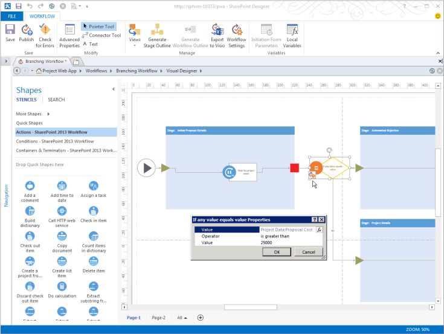

# 需要管理のために Project Server ワークフローを作成します。

この資料では、SharePoint Designer 2013 を使用して単純なワークフローを作成する方法について説明します。 Visio 2013 にビジュアル化し、編集のワークフローをエクスポートまたは Visio 2013 を使用して、ワークフローを Project Server 2013 を設計し、SharePoint Designer 2013 Project Web App にパブリケーションの設計にインポートできます。 SharePoint ワークフローのプラットフォームと Visio 2013 および SharePoint Designer 2013 でワークフローを作成する方法の詳細については、SharePoint 2013 の開発者向けドキュメントでの[SharePoint 2013 のワークフロー](https://msdn.microsoft.com/library/jj163986%28office.15%29.aspx)の記事を参照してください。 
  
ワークフローのプロジェクトのサーバーを準備する方法の詳細についてを参照してください[を開始: 設定セットアップおよび SharePoint 2013 ワークフロー マネージャーを構成する](https://msdn.microsoft.com/library/jj163276%28office.15%29.aspx)です。

## 一般的なワークフローを作成する

SharePoint Designer 2013 を使用して Project Server 2013 のワークフローを作成するのにには、次の手順を使用します。 ワークフローはプロジェクト提案の需要管理のために設計されています。
  
詳細な手順は、[分岐ワークフローを作成する](#pj15_CreateWorkflowSPD_Detailed)を参照してください。 
  
### Project Server ワークフローを作成するには (一般的な手順)

1. 要件を決定し、ワークフローを設計します。フェーズおよびステージとして整理し、ワークフローが使用するユーザー設定フィールドを決定します。
    
2. Project Web App では、ワークフローを必要とするエンティティを作成します。
    
    1. ワークフローの既存のフェーズを確認し、必要に応じてフェーズを作成します。
        
    2. ワークフローが使用するエンタープライズ ユーザー設定フィールドを作成します。ワークフローのステージで使用できるようにするには、ユーザー設定フィールドをワークフローで制御する必要があります。
        
    3. プロジェクトに関する情報を収集するためにワークフロー ステージが使用するプロジェクト詳細ページ (PDP) を編集または作成します。この例のステージでは、既定の PDP を編集して新しいユーザー設定フィールドを組み込みます。
        
    4. 必要なワークフロー ステージを作成し、各ワークフロー ステージを正しいフェーズと関連付けます。
    
3. SharePoint Designer 2013 のでは、**デザイナーのテキスト ベース**の宣言ステートメントを使用してワークフローを作成します。
    
    > [!NOTE]
    > SharePoint Designer 2013 では、**ビジュアル デザイナー**に切り替えます。 または Visio 2013 の既存のワークフローのインポートもできます。 **テキスト ベースのデザイナー**を使用してこれらの手順に従います。 
    > 
    > 1. Project Web App サイトを開き、 **SharePoint 2013 ワークフロー: Project Server**ワークフローのプラットフォームを使用するサイトのワークフローを作成します。 
    > 2. ワークフローが使用するステージを追加します。
    > 3. 各ステージで必要なワークフローのステップ、条件、アクション、およびループを挿入します。
    > 4. ワークフローのエラーを調べて、ある場合は修正します。
    > 5. (省略可能)**ビジュアル デザイナー**にビューを切り替えるか、ワークフローを Visio 2013 ファイルにエクスポートします。 Visio のビューを変更し、現在のワークフローに変更を保存できます。 Visio ファイルを編集し、他のワークフローを作成するのには、SharePoint Designer 2013 にインポートできます。
    > 6. ワークフローを発行します。 パブリッシュされた後、Project Web App サイトのワークフローのリストにワークフローを示しています。
    
4. Project Web App では、プロジェクト提案の需要管理のワークフローを使用します。
    
    1. ワークフローを使用するエンタープライズ プロジェクト テンプレート (EPT) を作成します。
        
    2. [プロジェクト センター] ページで、ワークフローの EPT を使用するプロジェクトを作成し、ワークフローのステージに従います。
        
    3. ワークフローを詳細にテストします。
        
    4. 運用サーバーにワークフローを展開します。

## 分岐ワークフローを作成する

SharePoint Designer 2013 を使用するには Project Server ワークフローを作成するのには、前に、Project Server 2013 のワークフロー アクティビティを使用するワークフロー マネージャーのクライアント 1.0 サービスを構成しなければなりません。 ワークフロー マネージャーのクライアント 1.0 を構成する方法の詳細については、SharePoint Server 2013 の開発者向けドキュメントでの[SharePoint 2013 のワークフロー](https://msdn.microsoft.com/library/jj163986%28office.15%29.aspx)の記事を参照してください。 
  
次の詳細な手順には、[一般的なワークフローを作成する](#pj15_CreateWorkflowSPD_General)セクションと同じ手順が含まれています。 
  
### Project Server 分岐ワークフローを作成するには (詳細な手順)

#### 1. 計画し、ワークフローを設計します。

複数の Project Server ワークフローを統合できるステージし、需要管理プロセスの段階です。 ワークフローは複雑になるためは、ビジネス要件を理解してワークフローを慎重に計画する必要があります。 単純な例については、提案が受け入れられるかどうかを決定するプロジェクトの提案の見積原価を使用する分岐ワークフローを設計します。 推定コストが大きい場合よりも $25,000 米ドル、拒絶します。それ以外の場合、提案を承諾し、プロジェクトを作成します。
    
Visio 2013 と SharePoint Designer 2013 を使用するには、設計を支援し、Project Server 2013 のワークフローを作成、ためするより簡単に試してみることがワークフローに Project Server 2010 では不可能な。 この資料のサンプル ワークフローの設計は、プロジェクト 2010 SDK 内の[分岐ワークフローを作成する](https://msdn.microsoft.com/library/a02cafdc-d881-4271-b446-d8b2cd456a52%28Office.15%29.aspx)資料と同じです。 設計および Project Web App のテスト インスタンスを使用してリモート コンピューター上のテストのワークフローを作成することができます: Project Server 2013 のコンピューター上で直接ワークフローを作成する必要はありません。 
    
#### 2. ワークフローを必要とするエンティティを作成します。

Project Web App では、使用可能なワークフローのフェーズとステージ、および使用可能なエンタープライズ ユーザー設定フィールドを確認します。 必要に応じて、次の手順に示すように、ワークフローで必要なエンティティを作成します。
    
1. **ワークフロー フェーズ**Project Web App の既定のインストールには、作成、選択、計画、管理、および終了フェーズが含まれています。 分岐ワークフロー例では、他のフェーズを作成する必要はありません。 
        
2. **エンタープライズ ユーザー設定フィールド**分岐ワークフローには、ワークフロー管理の対象であるプロジェクトのコストのユーザー設定フィールドが必要です。 ワークフローで制御されたユーザー設定フィールドの値は、前述のように、ワークフローを使用するに設定します。 たとえば、 **PWA の設定**] を選択し、**エンタープライズ ユーザー設定フィールドと参照テーブル**を選択し、Project Web App ページの上部右側の [**設定**] アイコンを選択します。
        
   **プロジェクト**エンティティの提案のコストをという名前のカスタム フィールドを作成し、**コスト**の種類を選択します。 説明は、プロジェクトの提案の見積もりコストを入力します。 **[動作**] セクションで、**ワークフローによって動作が制御**を選択します。
        
3. **プロジェクト詳細ページ**編集するか、ワークフロー ステージを使用する Pdp を作成します。 たとえば、次の手順の操作を行います。 
        
    1. [サーバー設定] ページで [**プロジェクト詳細ページ**] を選択し、PDP として [**ProjectInformation**] を選択します。 
            
    2. リボンの [**ページ**] タブで、[**編集**] グループの [**ページの編集**] を選択します。
            
    3. **基本情報**web パーツの右上の下向き矢印を選択し、 **web パーツを編集**します。 または、[ **WEB パーツ**] タブの [**プロパティ**] で、リボンのエディター パーツを表示する**web パーツのプロパティ**を選択します。 
            
    4. エディター パーツの [**表示されているプロジェクトのフィールド**] セクション (図 1 を参照) で、[**変更**] を選択します。
            
    5. **プロジェクト フィールドの選択**] ボックスの一覧で、[**所有者**] フィールドの上に移動ユーザー設定の**提案のコスト**フィールドを追加し、 **[ok]** を選択し (図 1 を参照してください)。
      
    6. エディター パーツで [**OK**] をクリックし、リボンの [**ページ**] タブで [**編集**] グループの [**編集の終了**] を選択します。図 2 では、プロジェクトの情報 PDP に追加された **Proposal Cost** ユーザー設定フィールドを示します。 

    **図 1 です。前述のようにプロジェクト フィールド web パーツを編集**

    

    **図 2. 提案のコスト ユーザー設定フィールドを含む編集後の PDP**

    ![編集後の PDP には、提案のコスト] フィールドが含まれています。](media/pj15_CreateWorkflowSPD_EditedPDP.gif "編集後の PDP には、提案のコスト] フィールドが含まれています。")
  
4. **ワークフロー ステージ**ワークフローの各フェーズに必要な各段階を作成します。 サーバーの設定] ページで、**ワークフロー ステージ**の選択をポイントし、**新しいワークフロー ステージ**です。 ワークフロー ステージの追加] ページの一部を図 3 に示します。
    
    **図 3. Project Web App でのワークフロー ステージの追加**

    
  
    ワークフローの分岐の例では、表 1 に示されている 4 つの段階を使用します。 (図 3 では表示されません)、ワークフロー ステージの追加] ページの [**可視のプロジェクト詳細ページに追加の設定**] セクションでは値は省略可能です。[ワークフローの状態] ページの詳細を提供します。 などの初期の提案の詳細の PDP は、ユーザー入力を必要とするため**のプロジェクト詳細ページに注意が必要です**] チェック ボックスを選択して、特定の説明は次のようにプロジェクト名を設定し、この PDP のコストを追加します。
    
    図 4 では、[ワークフロー ステージ] ページで完成した 4 つのステージを示します。
    
    **表 1. 分岐ワークフローのステージ**

    |名前|説明|提出の説明|フェーズ|表示される PDP|ユーザー設定フィールド|
    |:-----|:-----|:-----|:-----|:-----|:-----|
    |初期段階の提案の詳細    |プロジェクト名とコストを設定します。    |提案としてプロジェクトを提出します。    |作成    |プロジェクト情報    プロジェクトの詳細    |提案のコスト (必須)    |
    |プロジェクトの詳細    |提案されるプロジェクトの詳細を提供します。    |詳細を提出してプロジェクトを続行します。    |作成    |プロジェクト情報    プロジェクトの詳細    |提案のコスト (読み取り専用)    |
    |自動的に却下    |提供された情報に基づいて提案を拒否します。    |   |作成    |プロジェクト情報    |提案のコスト (読み取り専用)    |
    |実行    |提案を受け入れ、プロジェクト管理できる状態にします。    |   |管理    |プロジェクト情報    プロジェクトの詳細    |提案のコスト (読み取り専用)    |
   
    **図 4. Project Web App でのワークフロー ステージの一覧**

    
  
#### 3. テキスト ベースのデザイナーでワークフローを構築します。

SharePoint Designer 2013 では、テキスト ベースのデザイナーの宣言ステートメントを使用してワークフローを構築します。 ワークフロー ロジックとこれまでの手順を実行すると、状況依存の自動補完のステートメントを取得するのにはオレンジ色の挿入行で入力を開始することができます。 またはリボンの [**ワークフロー** ] タブで [**挿入**] でコントロールを使用して、ロジックと手順を挿入することができます。 
    
1. SharePoint Designer 2013 の Backstage ビューでは、**サイトを開く**を選択します。 たとえば、 `https://ServerName/pwa`。 **ナビゲーション**・ ペインでは、**ワークフロー**を選択します。 次に、リボンの [**新規**] グループの [**ワークフロー** ] タブでは、**サイトのワークフロー**を選択します。 この例では、分岐ワークフローのワークフローの名前です。 **プラットフォームの種類**」ドロップ ダウン リストで**SharePoint 2013 ワークフロー ・ プロジェクトのサーバー**が選択されていることを確認 (図 5 を参照してください)。 
    
    **図 5. Project Server サイト ワークフローの作成**

    
  
2. [**分岐ワークフロー**] タブを選択します。次に、リボンの [**ワークフロー**] タブで、[**管理**] グループの [**ビュー**] ドロップダウン リストの [**テキストベース デザイナー**] を選択します。点滅するオレンジ色の挿入行をビューに表示するには (図 6 を参照)、ビューの内部をクリックします。
    
    **図 6. ワークフロー用のテキストベース デザイナー ビューの使用**

    
  
3. **テキストベース デザイナー** ビューで、ワークフローが使用するステージを追加します。リボンの [**ワークフロー**] タブで、[**挿入**] グループの  [**ステージ**] ドロップダウン リストにある [**作成**] の [**初期段階の提案の詳細**] を選択します。
    
    同様に、[**ステージ: 初期段階の提案の詳細**] ボックスの下にオレンジ色の挿入行を配置し、ワークフローが使用する他のステージとして [**プロジェクトの詳細**]、[**自動的に却下**]、および [**実行**] を追加します (図 7 を参照)。 
    
    **図 7. SharePoint デザイナーでのワークフローへのステージの追加**

    
  
4. 各ステージにワークフローのステップとロジックを追加します。 
    
    1. [**初期段階の提案の詳細**] ステージで、ステージ本体の先頭にオレンジ色の挿入行を配置します。リボンの [**挿入**] グループで [**アクション**] を選択し、[**Project Web App のアクション**] までスクロール ダウンして、[**プロジェクト イベントを待機**] を選択します。[**このプロジェクト イベント**] を選択し、ドロップダウン リストで [**イベント: プロジェクトが提出されるとき**] を選択します。 
    
    2. [**初期段階の提案の詳細**] ステージの [**ステージに移動**] セクションで、[**ある値と値が等しいかどうか**] を挿入します。ステートメントを入力するか、またはリボンの [**挿入**] グループの [**条件**] コントロールを使用します。 
    
    3. 最初の [**値**] コントロールを選択してから、[**fx**] を選択して、[**ワークフロー参照の定義**] ダイアログ ボックスを表示します (図 8 を参照)。[**データ ソース**] ドロップダウン リストで [**プロジェクト データ**] を選択します。[**ソースのフィールド**] ドロップダウン リストで、[**提案のコスト**] を選択します。
    
       **図 8. ワークフローでの参照値の定義**

       
  
    4. 完了、`If`ステートメントを次に示しますので:**場合のプロジェクトのデータ: 提案のコストが 25000 を超えています。**
    
       > [!NOTE]
       > または、ワークフロー変数を作成して、その変数にユーザー設定フィールドの値を設定してから、変数と値を比較します。たとえば、リボンの [**ローカル変数**] ドロップダウン リストから、型が **Number** の **TotalCost** (スペースなし) という名前の変数を作成します。[**ワークフロー参照の定義**] ダイアログ ボックスで、データ ソースの [**ワークフローの変数とパラメーター**] を選択してから、フィールドとして [**Variable: TotalCost**] を選択します。**If** ステートメントが「**If Variable: TotalCost is greater than 25000**」になります。
  
    5. 内のオレンジ色の挿入行に配置、 `If` 、分岐し、挿入し、コントロールを使用して、**アクション**リボンの [**挿入**] グループで**の段階に戻る**。 **ステージ**のドロップダウン コントロールを選択し、**拒否の自動**ステージを選択します。 
    
       同様で、`Else`分岐、**プロジェクトの詳細には、** ステートメントを挿入します。 図 9 は、完了した**最初の提案の詳細**の段階を示しています。 
    
       **図 9. 初期段階の提案の詳細ステージの完成したロジック**

       
  
    6. **自動的に却下**ステージでは、ワークフローを一時停止して PDP に何らかのデータを表示するのでない限り、最初のセクションは空のままにします。[**ステージに移動**] セクションには遷移が含まれている必要があります。却下に続く他のステージはないため、ステートメントとして「Go to End of Workflow」と入力します。 
    
    7. **プロジェクトの詳細**ステージでは、[**ステージに移動**] セクションに「実行に進む」を追加します。データを追加したり、ワークフローを一時停止したりする必要がない限り、提出イベントを待つ必要はありません。 
    
    8. [**実行**] ステージでは、ワークフローを一時停止する必要がない限り、ステージのアクションのセクションは空のままにします。[**ステージに移動**] セクションで、[**ワークフローの末尾に進む**] を追加します。
    
5. リボンの [**保存**] グループで [**エラーの確認**] を選択して、ワークフローのエラーを調べます (図 10 を参照)。エラーを修正して [**保存**] を選択します。
    
    **図 10. SharePoint デザイナーでのワークフローのエラーの確認**

    
  
6. (オプション) リボンの [**管理**] グループで、[**ビュー**] ドロップダウン メニューの [**ビジュアル デザイナー**] を選択します。図 11 では、ビューを 50% に縮小表示しています。
    
    ビジュアル デザイナーを使用してワークフロー内のアイテムを編集できます。たとえば、[**ある値と値が等しいかどうか**] 条件を選択し、条件の左下にあるツール アイコンを選択して [**値**] を選択すると、[**プロパティ**] ダイアログ ボックスに比較条件が表示されます。 
    
    **図 11. ワークフロー用のビジュアル デザイナーの使用**

    
  
    ワークフローは、ビジュアル デザイナーのビューでは、ときに Visio 2013 (.vsdx) ファイルにバックアップとして、ワークフローを保存または後で使用して、ことができます**Visio にエクスポート**します。
    
7. ワークフローを発行します。 SharePoint Designer 2013 を使用してワークフローを作業中の Project Web App サイトに発行すると、ワークフローは Azure または SharePoint サイトに登録され、新しい EPTs Project Web App 内で使用可能になります。

#### 4. ワークフローの、EPT を作成して、ワークフローをテストします。

Project Web App では、ワークフローの EPT を作成し、プロジェクトの提案を作成することによって、ワークフローをテストします。
    
1. PWA の設定] ページで、[**エンタープライズ プロジェクトの種類**の選択し、テスト分岐ワークフローの名前、EPT を作成し。 プロジェクトのサーバーは、EPT を作成したプロジェクトの完全な制御を維持するためは、 **SharePoint タスク リスト プロジェクトとして新しいプロジェクトを作成する**] チェック ボックスをオフにします。 **サイト ワークフローの関連付け**」ドロップ ダウン リストで、[**ワークフローの分岐**を選択し、ワークフローを表示する最初のページに**新しいプロジェクト] ページ**のドロップダウン リストで、**プロジェクト情報**PDP を選択します。 
    
    **図 12. ワークフローへの EPT の追加**

    
  
    > [!NOTE]
    > エンタープライズ プロジェクトの種類のテーブルで、[**SharePoint タスク リスト プロジェクト**] 列の [**はい**] の値は、SharePoint タスク一覧を作成する EPT を参照しています。タスク一覧は Project Web App に表示されますが、SharePoint がプロジェクトの制御権を維持します。SharePoint タスクの一覧としてプロジェクトを管理する方法の詳細については、「[Project Server 2013 architecture](project-server-2013-architecture.md)」を参照してください。 
  
2. Project Web App の [プロジェクト] ページを開くし、新しい EPT を使用してプロジェクトを作成し、(図 13 を参照してください)。 **テスト分岐ワークフロー**が**ワークフローの分岐**に関連付けられているため、ワークフローの制御下にあるプロジェクトの作成を開始します。
    
    **図 13. 分岐ワークフローのテスト EPT でのプロジェクトの作成**

    
  
3. ワークフローは、**プロジェクト情報**PDP を表示するときは、[プロジェクト] フィールドにデータを追加します。 たとえば、30000 の**提案のコスト**値を入力します。 英語版の Project Server に $30,000 を表示するフィールドを変更する (図 14 を参照してください)。
    
    **図 14. 編集後のプロジェクトの情報 PDP の使用**

    
  
4. リボンの [**プロジェクト**] タブの [**プロジェクト**] グループで、[**保存**] を選択します。 Project Server は PDP 内のデータをプロジェクトに追加してから、[ワークフローの状態] ページを表示します (図 15 を参照)。ワークフローの状態図で初期段階の提案の詳細ステージの完全な説明を表示するには、ワークフロー ビジュアライゼーション ダイアグラム内のステージの上にポインターを移動します。
    
    [**すべてのワークフロー ステージ**] グリッドの緑色の矢印 は、初期段階の提案の詳細ステージが入力待ちであることを示しています。これは、初期段階の提案の詳細ステージでの提出イベントをワークフローが待っているためです。ワークフローが提出イベントを待っていない場合は、[**ページ**] グループの [**次へ**] を選択して次の PDP に進むことができます。 
    
    **図 15. 初期段階の提案の詳細ステージでの [ワークフローの状態] ページの使用**

    
  
    ワークフロー ビジュアライゼーション ダイアグラムに現在のステージが緑色で示されます。[**作成**] フェーズで、初期段階の提案の詳細ステージが現在のステージです。 
    
5. リボンで [**ワークフロー**] グループの [**提出**] を選択します。
    
    > [!TIP]
    > [**提出**] コントロールが無効な場合は、ページを最新表示に更新します。 
  
    [**提案のコスト**] の値が $25,000 USD より大きい場合、ワークフローは自動的に却下ステージに移動します。図 16 では、[**提出**] をもう一度選択したときの自動却下ステージの状態を示しています。[**提案のコスト**] が $25,000 USD 以下の場合は、ワークフローはプロジェクトの詳細ステージに移動します (図 17 を参照)。 
    
    **図 16. 自動却下ステージでワークフローが完了**

    
  
    図 17 という名前のプロジェクトの提案で別のテストを表示する**テスト 2 - 分岐**がプロジェクトの詳細のステージを作成する段階では現在です。 管理段階ライトでは青色の色で、そのフェーズがまだアクティブでないことを示します。
    
    **図 17. コストが $25,000 より少ない場合はワークフローはプロジェクトの詳細ステージへ続行**

    
  
6. プロジェクトの詳細ステージに進む場合、既定ページに追加する追加はありません。[**提出**] を再度選択して実行ステージに進みます (図 18 を参照)。 
    
    **図 18. ワークフローは実行ステージで管理の準備完了**

    
  
プロジェクトの詳細ステージではワークフローは提出イベントを待機しません。[プロジェクトの詳細] PDP に追加の必須フィールドがある場合は、Project Server はフィールドにデータが追加されるのを待ってから、実行ステージに進みます。分岐ワークフローで定義されているように、実行ステージも提出イベントを待機しません。実行ステージでは、プロジェクト マネージャーとしてプロジェクトを編集する、またはリボンの [**プロジェクト**] タブで [**閉じる**] を選択することができます。[**閉じる**] を選択した場合は、プロジェクトにチェックイン して、それを後で編集することも、プロジェクトをチェックアウトしたままにすることもできます。

[**分岐ワークフロー**] プロジェクトは比較テストが 1 つだけの簡単な例です。このワークフローには、需要管理の作成フェーズの 3 つのステージと、管理フェーズの 1 つのステージが含まれます。ワークフローを詳細にテストするには、ワークフローのすべての分岐をテストし、極端な値と標準的な値を使用して動作が意図したとおりかどうかを確認する必要があります。 

## Visio からワークフローをインポートする

ワークフローを変更するにするを作成またはワークフロー制御のユーザー設定フィールドを変更および作成したりワークフロー フェーズとステージを変更できます。 条件、アクション、ループ、およびステージを追加し、保存して、ワークフローを再発行する SharePoint Designer 2013 を使用することができます。 再利用したり、ワークフローのバックアップを保管、Visio 2013 ファイルにエクスポートできます。 
  
作成または Visio 2013 でワークフローを編集して SharePoint Designer 2013 Project Web App で使用するファイルをインポートします。 Project Web App インスタンスは、変更されていないワークフローを使用するには、Project Web App インスタンスを元のものと同じワークフロー ステージのプロパティを含める必要があります。 Visio を使用してワークフローを作成するための詳細については、 [SharePoint Designer 2013 と Visio 2013 でワークフローの開発](https://msdn.microsoft.com/library/jj163272%28office.15%29.aspx)を参照してください。
  
> [!NOTE]
> Visio 2013 ファイルを Project Web App の別のインスタンスにインポートする場合は、ステージの名前が同じ場合でも異なるステージ Guid があるステージ。 ワークフローをインポートした後は、Project Web App インスタンスに固有の値を使用するステージとアクション プロパティを構成する必要があります。 
> 
> Visio 2013 年の段階でワークフローを作成するされ、アクションには、Project Web App で Visio が接続されないためには、Project Web App インスタンスに固有のプロパティがないです。 SharePoint Designer 2013 は、Project Web App で接続するとき、ワークフローを作成して VSDX ファイルをインポートして、アクティブなワークフローを上書きします。 SharePoint Designer 2013 は、Project Web App から取得される値を一致するようにステージとアクションのプロパティを構成する必要がありますし。 
  
### Visio から SharePoint Designer にワークフローをインポートするには

1. Visio 2013 では、単純なワークフローを作成します。 たとえば、次の手順の操作を行います。
    
   1. Visio を開いてから、ワークフローを作成します。新しいワークフローの [**カテゴリ**] ウィンドウを選択して、[**フローチャート**] を選択し、[**新規作成** ] ウィンドウで [**Microsoft SharePoint 2013 ワークフロー**] テンプレートを選択してから、[**作成**] を選択します。ワークフローが **Stage 1** という名前のステージ図形と一緒に表示されます。ワークフローには、開始コンポーネントと、ステージ図形の一部として入口図形と出口図形が含まれています。
    
      ステージ図形の上でマウス ポインターを移動して [**プロパティ**] アイコンを選択して、選択範囲が無効になります。 SharePoint Designer 2013 にワークフローの図をインポートした後は、ステージとアクションのプロパティを設定できます。 
    
      > [!NOTE]
      >  使用すべき図形ステンシルは、フローチャート図形の一覧に含まれている次のものだけです。 
      > - **SharePoint 2013 ワークフローのアクション**
      > - **SharePoint 2013 ワークフローのコンポーネント**
      > - **SharePoint 2013 ワークフローの条件**
  
   2. [**図形**] ウィンドウで、[**クイック図形**] を選択してから、[**値の中に同じものがある場合**] という名前の条件図形をステージ図形の右側にドラッグします。 
    
   3. リボンの [**ホーム**] タブで、[**コネクタ**] ツールを選択してから、ステージ上の出口図形と条件図形を接続します (図 19 を参照)。 
    
      **図 19. Visio ワークフロー図でのステージ図形と条件図形の接続**

      
  
   4. 2 つのステージ図形をさらに条件図形の右側にドラッグします。これらの図形に **Stage 2** と **Stage 3** という名前が付けられます。
    
   5. **コネクタ**ツールを使用すると、**ステージ 2**の [Enter] 図形に、[状態] 図形の右側にあるを接続します。 **オブジェクト**選択ツールを選択し、[名] テキスト ボックスを表示する接続をダブルクリックして、名前を [はい] の接続です。
    
   6. 条件図形の下側と **Stage 3** の入口図形を接続します。[**ポインター**] ツールを使用して、接続を右クリックしてから、[**No**] を選択します。どちらの方法も接続に **Yes** または **No** という名前を付けるように機能します。
    
   7. **図形**ウィンドウで、 **SharePoint 2013 のワークフローのアクション**] を選択し、**ステージ 1**の図形の中央に**プロジェクトのイベントの待機**操作をドラッグ (図 20 を参照してください)。 
    
      **図 20. Visio でのワークフローの完了**

      
  
   8. [**プロセス**] タブの [**ダイアグラムの検証**] で、リボンの **[図のチェック**を選択します。 エラーを修正し、図面を保存します。 たとえば、Visio.vsdx からファイルのテストのワークフローの名前を付けます。
    
      ワークフローのエラーを修正する方法の詳細については、 [Visio 2013 でワークフローの検証エラーを SharePoint Server 2013 のトラブルシューティング](https://msdn.microsoft.com/library/jj163971%28v=office.15%29.aspx)を参照してください。
    
2. SharePoint Designer 2013 を開き、Project Web App サイトと同じ**ワークフローの分岐**の例を使用して、開きます。 
    
3. **ナビゲーション**・ ペインで**ワークフロー**を選択し、サイトのワークフローを作成し、(リボンの [**ワークフロー** ] タブで、**サイトのワークフロー**を選択します)。 たとえば、Visio のワークフローの単純なワークフローの名前を付けます。
    
   **サイト ワークフローの作成**] ダイアログ ボックスで、プラットフォームの種類が**SharePoint 2013 ワークフロー: Project Server**であることを確認します。 **の作成**] を選択し、SharePoint デザイナーは、新しいワークフローの**テキスト ベースのデザイナー**ウィンドウを開きます。 
    
4. リボンの [**ワークフロー**] タブの [**管理**] グループで、[**ワークフロー設定**] を選択します。
    
5. リボンの [**ワークフロー設定**] タブで**管理**グループは、 **Visio からインポート**するにはを選択し、以前に保存した**テストのワークフロー Visio.vsdx から**ファイルをインポートします。 **Microsoft SharePoint Designer**のダイアログ ボックスでは、インポートする図は、ワークフローのプロパティが含まれていないと、現在のワークフローを上書きするかどうか確認警告が表示されます。 [**はい]** です。SharePoint デザイナーは、ワークフロー ダイアグラムをインポートする、図形のステンシルを生成し、インポートしたワークフローを含む**ビジュアル デザイナー**ウィンドウが表示されます。 
    
6. ワークフローの各ステージの図形のプロパティを設定します。 たとえば、ステージの最初の図形という**段階 1 (無効)**、接続されている Project Web App インスタンスで有効な段階を表していないためです。 ステージ上でマウス ポインターを移動または選択した場合は、左下に [**プロパティ**] アイコン、ステージに図形の**ステージのプロパティ**] ダイアログ ボックスを表示するボックス (図 21) を選択できます。 **プロジェクト ステージ**」ドロップ ダウン リストで、[**提案の詳細を初期**の段階を選択し、[ **ok]** します。 SharePoint Designer では、ステージを変更します。
    
   **図 21. SharePoint Designer でのステージ プロパティの設定**

   
  
   2 つ目のステージに対して、[**プロジェクト ステージ**] プロパティを [**自動的に却下**] に設定します。3 つ目のステージに対して、[**プロジェクト ステージ**] プロパティを [**実行**] に設定します。
    
7. 同様に、[**プロジェクト イベントの待機**] アクションに対して、[**イベント名**] プロパティを [**イベント: プロジェクトの提出時**] に設定します。
    
8. 同様に、**任意の値が等しい場合**の条件のプロパティを設定します。 たとえば、**プロジェクトのデータ: 提案のコスト**に最初の**値**のプロパティを設定します。 **演算子**プロパティを設定します**より小さい**です。 2 番目のプロパティの**値**を 5000 に設定します。
    
9. ワークフローのエラーをチェックしてから、ワークフローを保存します。エラーがなければ、表示を [**テキストベース デザイナー**] に切り替えることができます (図 22 を参照)。 
    
   **図 22. テキストベース デザイナーでのインポートしたワークフローの表示**

   
  
10. ワークフローを発行します。ワークフローを保存しても発行しなければ、エンタープライズ プロジェクトの種類を作成するときに使用できません。
    
11. Project Web App では、インポートされた**Visio からの単純なワークフロー**をテストするに、ワークフローを使用する、EPT を作成し、**ワークフローの分岐**の例の場合と同様に新しい EPT を使用するプロジェクトを作成し、します。 この場合、ただし、5,000 ドルのコストよりも小さい値であるプロジェクトは拒否されます。 
    
を使用して作業をこの資料で作成され、段階、条件、およびワークフローを使用するアクションを直接設定するのには SharePoint Designer 2013 を使用して単純な分岐ワークフローをテストします。 さらに簡単な分岐ワークフローのダイアグラムを作成するには、Visio 2013 を使用しています。 SharePoint Designer 2013、各段階、条件、および Project Web App との接続からのアクションのプロパティを設定するには、Visio のワークフロー図をインポートします。
  
Visio 2013」および「SharePoint デザイナー共同設計者、プロジェクト マネージャー、ワークフロー開発者は、およびテスト担当者が作成共有、および Project Server 2013 とオンライン プロジェクトのさまざまなインストール環境のワークフローのデザインをカスタマイズするための便利な方法を提供します。 SharePoint デザイナーが用意されていないプロジェクトのサーバーにプログラムによるアクセスを必要とするワークフローの場合は、Visual Studio 2012 のクライアント側オブジェクト モデル (CSOM) を使用できます。
  
## 関連項目

- [Project Server 2013 のアーキテクチャ](project-server-2013-architecture.md)
- [[開始] SharePoint 2013 ワークフロー マネージャーをセットアップおよび構成する](https://msdn.microsoft.com/library/jj163276%28office.15%29.aspx)
- [SharePoint 2013 でワークフローをパッケージ化して展開する方法の概要](https://msdn.microsoft.com/library/jj819316%28office.15%29.aspx)
- [Microsoft SharePoint 2010 SDK へようこそ](https://msdn.microsoft.com/library/jj163986%28office.15%29.aspx)
- [Workflow development in SharePoint Designer 2013 and Visio 2013](https://msdn.microsoft.com/library/jj163272%28office.15%29.aspx)
- [Visio 2013 での SharePoint Server 2013 ワークフロー検証エラーのトラブルシューティング](https://msdn.microsoft.com/library/jj163971%28v=office.15%29.aspx)
- [ワークフローおよび需要管理](https://msdn.microsoft.com/library/cf7433a3-a531-4467-ac0c-df0c5d6881ae%28Office.15%29.aspx)

