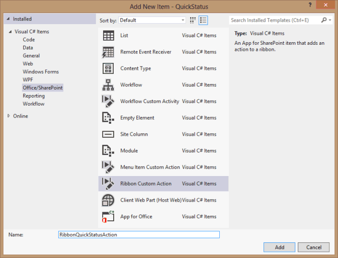
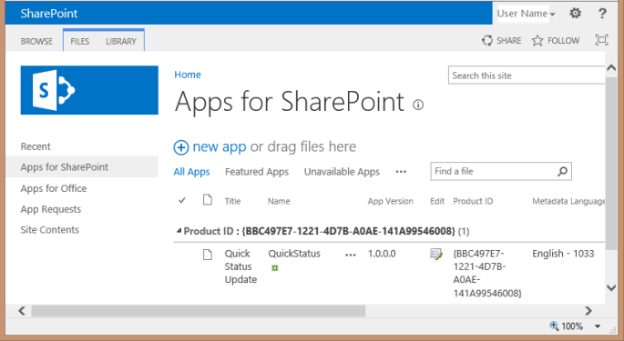

# <a name="create-a-sharepoint-hosted-project-server-add-in"></a><span data-ttu-id="ef042-103">SharePoint をホストとする Project Server アドインを作成する</span><span class="sxs-lookup"><span data-stu-id="ef042-103">Create a SharePoint-hosted Project Server add-in</span></span>

<span data-ttu-id="ef042-104">Project Online 用に作成できる 3 種類のアプリ (自動ホスト型アプリ、プロバイダー ホスト型アプリ、SharePoint ホスト型アプリ) の中で、SharePoint ホスト型アプリは最も簡単に作成および展開できます。</span><span class="sxs-lookup"><span data-stu-id="ef042-104">Of the three types of apps that you can create for Project Online (autohosted, provider-hosted, and SharePoint-hosted), the SharePoint-hosted app is the simplest to create and deploy.</span></span> <span data-ttu-id="ef042-105">ホストSharePointアプリは、OAuth 認証を必要としないし、Azure を使用しないか、プロバイダーホスト型リソースのローカル サイトのメンテナンスを必要とします。</span><span class="sxs-lookup"><span data-stu-id="ef042-105">A SharePoint-hosted app does not require OAuth authentication, and does not use Azure or require maintenance of a local site for the provider-hosted resources.</span></span> <span data-ttu-id="ef042-106">Visual Studio **の SharePoint 2013** 用アプリ テンプレートは、Office ストアで公開および販売したり、SharePoint のプライベート アプリ カタログに展開したりできるアプリを開発するための便利なフレームワークです。</span><span class="sxs-lookup"><span data-stu-id="ef042-106">The **App for SharePoint 2013** template in Visual Studio is a convenient framework for developing apps that can be published and sold in the Office Store or deployed to a private app catalog on SharePoint.</span></span> 
  
<span data-ttu-id="ef042-107">Project では、ステータスは、チーム メンバーが Project Web App の [タスク] ページを使用して、割り当てられたタスクの状態 (タスクの作業に費やされた 1 週間の毎日の作業時間数など) を送信できるプロセスです。</span><span class="sxs-lookup"><span data-stu-id="ef042-107">In Project, statusing is a process where a team member can use the Tasks page in Project Web App to submit the status of an assigned task, such as the number of hours worked each day of a week spent working on the task.</span></span> <span data-ttu-id="ef042-108">割り当ての所有者 (通常はプロジェクト マネージャー) は、状態を承認または拒否できます。</span><span class="sxs-lookup"><span data-stu-id="ef042-108">The assignment owner (usually the project manager) can approve or reject the status.</span></span> <span data-ttu-id="ef042-109">状態が承認されると、スケジュールProject再計算されます。</span><span class="sxs-lookup"><span data-stu-id="ef042-109">When the status is approved, Project recalculates the schedule.</span></span> <span data-ttu-id="ef042-110">**QuickStatus アプリには割** り当てられたタスクが表示され、ユーザーは選択した割り当ての完了率を迅速に更新し、承認のために状態を送信できます。</span><span class="sxs-lookup"><span data-stu-id="ef042-110">The **QuickStatus** app displays assigned tasks, where the user can quickly update percent complete and submit status of the selected assignments for approval.</span></span> <span data-ttu-id="ef042-111">[タスク] ページにはProject Web App機能が追加されましたが **、QuickStatus** アプリは簡略化されたインターフェイスを提供する例です。</span><span class="sxs-lookup"><span data-stu-id="ef042-111">Although the Tasks page in Project Web App has much more functionality, the **QuickStatus** app is an example that provides a simplified interface.</span></span> 
  
<span data-ttu-id="ef042-112">**QuickStatus アプリ** は、開発者向けのサンプルです。これは、実稼働環境での使用を目的としていない。</span><span class="sxs-lookup"><span data-stu-id="ef042-112">The **QuickStatus** app is a sample for developers; it is not intended for use in a production environment.</span></span> <span data-ttu-id="ef042-113">主な目的は、完全に機能する状態アプリを作成するのではなく、Project Onlineのアプリ開発の例を示す方法です。</span><span class="sxs-lookup"><span data-stu-id="ef042-113">The primary purpose is to show an example of app development for Project Online, not to create a fully functional statusing app.</span></span> <span data-ttu-id="ef042-114">ステータス設定の優れた方法については、「次の手順」の推奨事項 [を参照してください](#pj15_StatusingApp_NextSteps)。</span><span class="sxs-lookup"><span data-stu-id="ef042-114">For a better approach to statusing, see the recommendation in [Next steps](#pj15_StatusingApp_NextSteps).</span></span>
  
<span data-ttu-id="ef042-115">状態の一般的な情報については、「タスクの進行状況 [」を参照してください](https://support.office.com/article/Find-information-about-Project-Server-2013-8b08a414-15a7-4076-b2db-c90d0214ea7f?ui=en-US&rs=en-US&ad=US#BKMK_TaskProgress)。</span><span class="sxs-lookup"><span data-stu-id="ef042-115">For general information about statusing, see [Task progress](https://support.office.com/article/Find-information-about-Project-Server-2013-8b08a414-15a7-4076-b2db-c90d0214ea7f?ui=en-US&rs=en-US&ad=US#BKMK_TaskProgress).</span></span> <span data-ttu-id="ef042-116">SharePoint および Project サーバー用のアドインの開発の詳細については、「SharePoint[アドイン」を参照してください](https://msdn.microsoft.com/library/jj163230.aspx)。</span><span class="sxs-lookup"><span data-stu-id="ef042-116">For more information about developing add-ins for SharePoint and Project Server, see [SharePoint Add-ins](https://msdn.microsoft.com/library/jj163230.aspx).</span></span>

<span data-ttu-id="ef042-117"><a name="pj15_StatusingApp_Prerequisites"> </a></span><span class="sxs-lookup"><span data-stu-id="ef042-117"><a name="pj15_StatusingApp_Prerequisites"> </a></span></span>

## <a name="prerequisites-for-creating-an-app-for-project-server-2013"></a><span data-ttu-id="ef042-118">サーバー 2013 のアプリProject前提条件</span><span class="sxs-lookup"><span data-stu-id="ef042-118">Prerequisites for creating an app for Project Server 2013</span></span>

<span data-ttu-id="ef042-119">Project Online または Project Server 2013 のオンプレミス インストールに展開できる比較的単純なアプリを開発するには、オンラインの開発環境を提供する Napa を使用できます。</span><span class="sxs-lookup"><span data-stu-id="ef042-119">To develop relatively simple apps that can be deployed to Project Online or to an on-premises installation of Project Server 2013, you can use the Napa, which provide an online development environment.</span></span> <span data-ttu-id="ef042-120">より複雑なアプリ、Project Web App リボンの変更、開発中のデバッグの容易さについては、Visual Studio 2012 または Visual Studio 2013。</span><span class="sxs-lookup"><span data-stu-id="ef042-120">For more complex apps, modifying the Project Web App ribbon, and easier debugging during development, you can use Visual Studio 2012 or Visual Studio 2013.</span></span> <span data-ttu-id="ef042-121">たとえば、オンプレミスのインストールでは、サーバー データベースの変更について下書きデータテーブルを手動でProjectできます。</span><span class="sxs-lookup"><span data-stu-id="ef042-121">For example, with an on-premises installation, you can manually check the Drafts datatables for changes in the Project Server database.</span></span> <span data-ttu-id="ef042-122">この記事では、アプリを使用してアプリ開発を行う方法をVisual Studio。</span><span class="sxs-lookup"><span data-stu-id="ef042-122">This article shows how to do app development with Visual Studio.</span></span>
  
<span data-ttu-id="ef042-123">アプリケーションを使用Projectサーバー アプリの開発Visual Studio以下が必要です。</span><span class="sxs-lookup"><span data-stu-id="ef042-123">Development of Project Server apps with Visual Studio requires the following:</span></span>
  
- <span data-ttu-id="ef042-p106">使用するローカルの開発用コンピューターに最新のサービス パックと Windows 更新プログラムをインストールしてあることを確認します。オペレーティング システムは、Windows 7、Windows 8、Windows Server 2008、Windows Server 2012 のいずれでもかまいません。</span><span class="sxs-lookup"><span data-stu-id="ef042-p106">Ensure that you have installed the most recent service packs and Windows updates on your local development computer. The operating system can be Windows 7, Windows 8, Windows Server 2008, or Windows Server 2012.</span></span>
    
- <span data-ttu-id="ef042-126">SharePoint Server 2013 および Project Server 2013 がインストールされているコンピューターが必要です。このコンピューターはアプリの分離とサイドローディング用に構成されています。</span><span class="sxs-lookup"><span data-stu-id="ef042-126">You must have a computer that has SharePoint Server 2013 and Project Server 2013 installed, where the computer is configured for app isolation and sideloading of apps.</span></span> <span data-ttu-id="ef042-127">サイドローディングを使用するとVisual Studioアプリを一時的にインストールしてデバッグできます。</span><span class="sxs-lookup"><span data-stu-id="ef042-127">Sideloading enables Visual Studio to temporarily install the app for debugging.</span></span> <span data-ttu-id="ef042-128">サーバーとサーバーのオンプレミス インストールSharePoint使用Projectできます。</span><span class="sxs-lookup"><span data-stu-id="ef042-128">You can use an on-premises installation of SharePoint and Project Server.</span></span> <span data-ttu-id="ef042-129">詳細については、「アプリのオンプレミスの開発環境をセットアップする」[を](https://msdn.microsoft.com/library/fp179923%28Office.15%29.aspx)参照SharePoint。</span><span class="sxs-lookup"><span data-stu-id="ef042-129">For more information, see [Set up an on-premises development environment for apps for SharePoint](https://msdn.microsoft.com/library/fp179923%28Office.15%29.aspx).</span></span>
    
   > [!NOTE]
   > <span data-ttu-id="ef042-130">社内インストールの場合は、企業アプリ カタログを作成する前に、  *分離されたアプリ*  ドメインを構成します。</span><span class="sxs-lookup"><span data-stu-id="ef042-130">For an on-premises installation, configure an isolated app domain  *before*  you create a corporate app catalog.</span></span> 
  
- <span data-ttu-id="ef042-131">開発用コンピューターは、2012 年の開発者Officeインストールされているリモート Visual Studioできます。</span><span class="sxs-lookup"><span data-stu-id="ef042-131">The development computer can be a remote computer that has Office Developer Tools for Visual Studio 2012 installed.</span></span> <span data-ttu-id="ef042-132">最新バージョンがインストールされていることを確認します。ダウンロードの *詳細については*[、「Apps for the Apps for Office」をSharePointしてください](https://msdn.microsoft.com/office/apps/fp123627.aspx)。</span><span class="sxs-lookup"><span data-stu-id="ef042-132">Ensure that you have installed the most recent version; see the  *Tools*  section of the [Apps for Office and SharePoint downloads](https://msdn.microsoft.com/office/apps/fp123627.aspx).</span></span>
    
- <span data-ttu-id="ef042-133">開発およびテストProject Web App使用するインスタンスにブラウザーでアクセス可能なインスタンスを確認します。</span><span class="sxs-lookup"><span data-stu-id="ef042-133">Verify that the Project Web App instance you will be using for development and testing is accessible in the browser.</span></span>
    
<span data-ttu-id="ef042-134">オンライン ツールの使用の詳細については、「アプリを開発するための環境をセットアップする」を参照SharePoint[をOffice 365。](https://msdn.microsoft.com/library/fp161179.aspx)</span><span class="sxs-lookup"><span data-stu-id="ef042-134">For information about using the online tools, see [Set up an environment for developing apps for SharePoint on Office 365](https://msdn.microsoft.com/library/fp161179.aspx).</span></span> <span data-ttu-id="ef042-135">オンライン ツールを使用する Project Server 用の簡単なアプリを構築する方法のチュートリアルについては、「EPMSource ブログ シリーズ」「Building your first Project [Server app」を参照してください](https://epmsource.com/2012/11/20/building-your-first-project-server-app-part-zerothe-introduction/)。</span><span class="sxs-lookup"><span data-stu-id="ef042-135">For a walkthrough of building a simple app for Project Server that uses the online tools, see the EPMSource blog series, [Building your first Project Server app](https://epmsource.com/2012/11/20/building-your-first-project-server-app-part-zerothe-introduction/).</span></span>

<span data-ttu-id="ef042-136"><a name="pj15_StatusingApp_UsingVisualStudio"> </a></span><span class="sxs-lookup"><span data-stu-id="ef042-136"><a name="pj15_StatusingApp_UsingVisualStudio"> </a></span></span>

## <a name="using-visual-studio-to-create-a-project-server-app"></a><span data-ttu-id="ef042-137">サーバー Visual Studioを使用してサーバー アプリProject作成する</span><span class="sxs-lookup"><span data-stu-id="ef042-137">Using Visual Studio to create a Project Server app</span></span>

<span data-ttu-id="ef042-138">Office2012 Visual Studio開発者向けツールには、SharePoint Server 2013 で使用できるアプリProjectが含まれています。</span><span class="sxs-lookup"><span data-stu-id="ef042-138">Office Developer Tools for Visual Studio 2012 includes a template for SharePoint apps that can be used with Project Server 2013.</span></span> <span data-ttu-id="ef042-139">アプリ ソリューションを作成すると、カスタム コード用の次のファイルがソリューションに含まれます。</span><span class="sxs-lookup"><span data-stu-id="ef042-139">When you create an app solution, the solution includes the following files for your custom code:</span></span>
  
- <span data-ttu-id="ef042-140">**AppManifest.xml** には、アプリのタイトル、アクセス許可要求スコープ、その他のプロパティの設定が含まれます。</span><span class="sxs-lookup"><span data-stu-id="ef042-140">**AppManifest.xml** includes settings for the app title, permission request scope, and other properties.</span></span> <span data-ttu-id="ef042-141">手順 1 には、マニフェスト デザイナーを使用してプロパティを設定する手順が含まれています。</span><span class="sxs-lookup"><span data-stu-id="ef042-141">Procedure 1 includes steps to set the properties by using the Manifest Designer.</span></span> 
    
- <span data-ttu-id="ef042-142">**Pages フォルダーの Default.aspx** は、アプリのメイン ページです。</span><span class="sxs-lookup"><span data-stu-id="ef042-142">**Default.aspx** in the Pages folder is the main page of the app.</span></span> <span data-ttu-id="ef042-143">手順 2 は、QuickStatus アプリの HTML5 コンテンツを追加 **する方法を示** しています。</span><span class="sxs-lookup"><span data-stu-id="ef042-143">Procedure 2 shows how to add HTML5 content for the **QuickStatus** app.</span></span> 
    
- <span data-ttu-id="ef042-144">**App.js** フォルダー内のファイルは、カスタム JavaScript コードのプライマリ ファイルです。</span><span class="sxs-lookup"><span data-stu-id="ef042-144">**App.js** in the Scripts folder is the primary file for the custom JavaScript code.</span></span> <span data-ttu-id="ef042-145">手順 3 では、QuickStatus アプリの **JavaScript コードについて説明** します。</span><span class="sxs-lookup"><span data-stu-id="ef042-145">Procedure 3 explains the JavaScript code for the **QuickStatus** app.</span></span> 
    
   <span data-ttu-id="ef042-146">jQuery ベースのグリッドや日付ピッカーなどの商用コントロールを追加する場合は、Default.aspx ファイルで追加の JavaScript ファイルへの参照を追加できます。</span><span class="sxs-lookup"><span data-stu-id="ef042-146">If you add commercial controls such as a jQuery-based grid or date picker, you can add references to additional JavaScript files in the Default.aspx file.</span></span>
    
- <span data-ttu-id="ef042-147">**コンテンツ フォルダーの App.css** は、カスタム CSS3 スタイルのプライマリ ファイルです。</span><span class="sxs-lookup"><span data-stu-id="ef042-147">**App.css** in the Content folder is the primary file for custom CSS3 styles.</span></span> <span data-ttu-id="ef042-148">手順 2 と手順 3 には、QuickStatus アプリのカスケード スタイル シート (CSS) スタイル **に関する情報が含** まれています。</span><span class="sxs-lookup"><span data-stu-id="ef042-148">Procedure 2 and Procedure 3 include information about cascading style sheets (CSS) styles for the **QuickStatus** app.</span></span> <span data-ttu-id="ef042-149">Default.aspx ファイルで、追加の CSS ファイルへの参照を追加できます。</span><span class="sxs-lookup"><span data-stu-id="ef042-149">You can add references to additional CSS files in the Default.aspx file.</span></span> 
    
- <span data-ttu-id="ef042-150">**AppIcon.png** フォルダー内の 96 x 96 アイコンは、アプリが Office ストアまたはアプリ カタログに表示されます。</span><span class="sxs-lookup"><span data-stu-id="ef042-150">**AppIcon.png** in the Images folder is the 96 x 96 icon that the app displays in the Office Store or the app catalog.</span></span> 
    
<span data-ttu-id="ef042-151">リボンを変更Project Web App、リボン のカスタム アクションを追加できます。</span><span class="sxs-lookup"><span data-stu-id="ef042-151">To modify the Project Web App ribbon, you can add a ribbon custom action.</span></span> <span data-ttu-id="ef042-152">[[QuickStatus](#pj15_StatusingApp_Example)アプリのコード例] セクションには、変更された Default.aspx、App.js、App.css、Elements.xml、および AppManifest.xml ファイルの完全なコードが含まれています。</span><span class="sxs-lookup"><span data-stu-id="ef042-152">The [Example code for the QuickStatus app](#pj15_StatusingApp_Example) section includes the complete code for the modified Default.aspx, App.js, App.css, Elements.xml, and AppManifest.xml files.</span></span> 
  
### <a name="procedure-1-to-create-an-app-project-in-visual-studio"></a><span data-ttu-id="ef042-153">手順 1.</span><span class="sxs-lookup"><span data-stu-id="ef042-153">Procedure 1.</span></span> <span data-ttu-id="ef042-154">アプリ プロジェクトを作成するには、Visual Studio</span><span class="sxs-lookup"><span data-stu-id="ef042-154">To create an app project in Visual Studio</span></span>

1. <span data-ttu-id="ef042-155">管理者Visual Studio 2012 を実行し、[スタート] ページで **[Project]** を選択します。</span><span class="sxs-lookup"><span data-stu-id="ef042-155">Run Visual Studio 2012 as an administrator, and then select **New Project** on the Start page.</span></span> 
    
2. <span data-ttu-id="ef042-156">[新しい **Project]** ダイアログ ボックスで、[テンプレート] 、[Visual C#]、および **[Office/SharePoint]** ノードを展開し、[アプリ] を選択 **します**。 </span><span class="sxs-lookup"><span data-stu-id="ef042-156">In the **New Project** dialog box, expand the **Templates**, **Visual C#**, and **Office/SharePoint** nodes, and then select **Apps**.</span></span> <span data-ttu-id="ef042-157">中央ウィンドウの.NET Frameworkにあるターゲット フレームワーク ドロップダウン リストの既定の .NET Framework **4.5** を使用し、次に **[SharePoint 2013** のアプリ] を選択します (図 1 を参照)。</span><span class="sxs-lookup"><span data-stu-id="ef042-157">Use the default **.NET Framework 4.5** in the target framework drop-down list at the top of the center pane, and then select **App for SharePoint 2013** (see Figure 1).</span></span> 
    
3. <span data-ttu-id="ef042-158">[名前 **] フィールドに** 「QuickStatus」と入力し、アプリを保存する場所を参照し **、[OK] を選択します**。</span><span class="sxs-lookup"><span data-stu-id="ef042-158">In the **Name** field, type QuickStatus, browse to the location where you want to save the app, and then choose **OK**.</span></span>
    
   <span data-ttu-id="ef042-159">**図 1.サーバー 内Projectサーバー アプリを作成Visual Studio**</span><span class="sxs-lookup"><span data-stu-id="ef042-159">**Figure 1. Creating a Project Server app in Visual Studio**</span></span>

   <span data-ttu-id="ef042-160"></span><span class="sxs-lookup"><span data-stu-id="ef042-160"></span></span>
  
4. <span data-ttu-id="ef042-161">[アプリの **新しいSharePoint]** ダイアログ ボックスで、次の 3 つのフィールドに入力します。</span><span class="sxs-lookup"><span data-stu-id="ef042-161">In the **New app for SharePoint** dialog box, fill in the following three fields:</span></span> 
    
   - <span data-ttu-id="ef042-162">上部のテキスト ボックスに、アプリでアプリに表示する名前を入力Project Web App。</span><span class="sxs-lookup"><span data-stu-id="ef042-162">In the top text box, type the name that you want the app to display in Project Web App.</span></span> <span data-ttu-id="ef042-163">たとえば、「Quick Status Update」と入力します。</span><span class="sxs-lookup"><span data-stu-id="ef042-163">For example, type Quick Status Update.</span></span>
    
   - <span data-ttu-id="ef042-164">デバッグに使用するサイトの場合は、インスタンスの URL をProject Web Appします。</span><span class="sxs-lookup"><span data-stu-id="ef042-164">For the site to use for debugging, type the URL of the Project Web App instance.</span></span> <span data-ttu-id="ef042-165">たとえば  `https://ServerName/ProjectServerName`  _、(ServerName_ と  _ProjectServerName_ を独自の値に置き換える) と入力し、[検証] を **選択します**。</span><span class="sxs-lookup"><span data-stu-id="ef042-165">For example, type  `https://ServerName/ProjectServerName` (replacing  _ServerName_ and  _ProjectServerName_ with your own values), and then choose **Validate**.</span></span> <span data-ttu-id="ef042-166">すべてが正常に終了すると、接続Visual Studioが **表示されます**。</span><span class="sxs-lookup"><span data-stu-id="ef042-166">If all goes well, Visual Studio shows **Connection successful**.</span></span> <span data-ttu-id="ef042-167">エラー メッセージが表示された場合は、Project Web App URL が正しく、Project Server コンピューターがアプリの分離とサイドローディング用に構成されていることを確認します。</span><span class="sxs-lookup"><span data-stu-id="ef042-167">If you get an error message, ensure that the Project Web App URL is correct and that the Project Server computer is configured for app isolation and sideloading of apps.</span></span> <span data-ttu-id="ef042-168">詳細については、「サーバー [2013 のアプリを作成するためのProject」を参照](#pj15_StatusingApp_Prerequisites)してください。</span><span class="sxs-lookup"><span data-stu-id="ef042-168">For more information, see the [Prerequisites for creating an app for Project Server 2013](#pj15_StatusingApp_Prerequisites) section.</span></span> 
    
   - <span data-ttu-id="ef042-169">[アプリ **をホストする方法] ボックス** の一覧SharePoint、[ホストされているアプリSharePoint **選択します**。</span><span class="sxs-lookup"><span data-stu-id="ef042-169">In the **How do you want to host your app for SharePoint** drop-down list, choose **SharePoint-hosted**.</span></span>
    
   > [!CAUTION]
   > <span data-ttu-id="ef042-170">プロバイダーホスト型の既定のプロジェクトの種類を誤って選択した場合、Visual Studio はソリューションに QuickStatus プロジェクトと **QuickStatusWeb** プロジェクトの 2 つのプロジェクトを **作成** します。</span><span class="sxs-lookup"><span data-stu-id="ef042-170">If you choose the default **Provider-hosted** project type by mistake, Visual Studio creates two projects in the solution: a **QuickStatus** project and a **QuickStatusWeb** project.</span></span> <span data-ttu-id="ef042-171">2 つのプロジェクトが表示される場合は、そのソリューションを削除して、もう一度開始します。</span><span class="sxs-lookup"><span data-stu-id="ef042-171">If you see two projects, delete that solution and start again.</span></span> 
  
5. <span data-ttu-id="ef042-172">**[OK]** を選択して **、QuickStatus** ソリューション **、QuickStatus** プロジェクト、および既定のファイルを作成します。</span><span class="sxs-lookup"><span data-stu-id="ef042-172">Choose **OK** to create the **QuickStatus** solution, **QuickStatus** project, and default files.</span></span> 
    
6. <span data-ttu-id="ef042-173">マニフェスト デザイナー ビューを開きます (たとえば、ファイルをダブルクリックAppManifest.xmlします。</span><span class="sxs-lookup"><span data-stu-id="ef042-173">Open the Manifest Designer view (for example, double-click the AppManifest.xml file).</span></span> <span data-ttu-id="ef042-174">[全般 **] タブ** の **[タイトル] テキスト** ボックスに、手順 4 で入力したアプリ名が表示されます。</span><span class="sxs-lookup"><span data-stu-id="ef042-174">On the **General** tab, the **Title** text box should show the app name that you typed in step 4.</span></span> <span data-ttu-id="ef042-175">[アクセス許可 **] タブを** 選択して、アプリの次のアクセス許可要求を追加します (図 2 を参照)。</span><span class="sxs-lookup"><span data-stu-id="ef042-175">Choose the **Permissions** tab to add the following permission requests for the app (see Figure 2):</span></span> 
    
   - <span data-ttu-id="ef042-176">[アクセス許可要求]**リストの** 最初の行の [スコープ]**列で、** ドロップダウン リストの [状態] を選択します。</span><span class="sxs-lookup"><span data-stu-id="ef042-176">In the first row of the **Permission requests** list, in the **Scope** column, choose **Statusing** in the drop-down list.</span></span> <span data-ttu-id="ef042-177">[アクセス許可 **] 列で\*\*\*\*、[SubmitStatus] を選択します**。</span><span class="sxs-lookup"><span data-stu-id="ef042-177">In the **Permission** column, choose **SubmitStatus**.</span></span>
    
   - <span data-ttu-id="ef042-178">スコープが複数のプロジェクトで **、アクセス\*\*\*\*許可** が読み取 **りである行を** 追加 **します**。</span><span class="sxs-lookup"><span data-stu-id="ef042-178">Add a row where the **Scope** is **Multiple Projects** and the **Permission** is **Read**.</span></span>
    
   <span data-ttu-id="ef042-179">**図 2.状態アプリのアクセス許可スコープの設定**</span><span class="sxs-lookup"><span data-stu-id="ef042-179">**Figure 2. Setting the permission scope for a statusing app**</span></span>

   <span data-ttu-id="ef042-180"></span><span class="sxs-lookup"><span data-stu-id="ef042-180"></span></span>
  
<span data-ttu-id="ef042-181">**QuickStatus アプリを使用** すると、Project Web Appユーザーは、そのユーザーの割り当てを複数のプロジェクトから読み取り、割り当て率の完了率を変更し、更新プログラムを提出できます。</span><span class="sxs-lookup"><span data-stu-id="ef042-181">The **QuickStatus** app enables a Project Web App user to read assignments for that user from multiple projects, change the assignment percent complete, and submit the update.</span></span> <span data-ttu-id="ef042-182">図 2 のドロップダウン リストに示されている他のアクセス許可要求スコープは、このアプリでは必要ありません。</span><span class="sxs-lookup"><span data-stu-id="ef042-182">The other permission request scopes shown in the drop-down list in Figure 2 are not required for this app.</span></span> <span data-ttu-id="ef042-183">アクセス許可要求スコープは、アプリがユーザーに代わって要求するアクセス許可です。</span><span class="sxs-lookup"><span data-stu-id="ef042-183">The permission request scopes are the permissions that the app requests on behalf of the user.</span></span> <span data-ttu-id="ef042-184">ユーザーがこれらのアクセス許可を持Project Web App、アプリは実行されません。</span><span class="sxs-lookup"><span data-stu-id="ef042-184">If the user does not have those permissions in Project Web App, the app does not run.</span></span> <span data-ttu-id="ef042-185">アプリには、他のアクセス許可のアクセス許可を含む複数のアクセス許可要求スコープをSharePointできますが、アプリの機能に必要な最小限の権限のみを持つ必要があります。</span><span class="sxs-lookup"><span data-stu-id="ef042-185">An app can have multiple permission request scopes, including those for other SharePoint permissions, but should have only the minimum necessary for the app functionality.</span></span> <span data-ttu-id="ef042-186">サーバーに関連するアクセス許可要求スコープをProjectします。</span><span class="sxs-lookup"><span data-stu-id="ef042-186">Following are the permission request scopes that are related to Project Server:</span></span> 

- <span data-ttu-id="ef042-187">**Enterprise : リソース** マネージャーのアクセス許可、他のユーザーに関する情報の読み取りProject Web Appします。</span><span class="sxs-lookup"><span data-stu-id="ef042-187">**Enterprise Resources**: Resource manager permissions, to read or write information about other Project Web App users.</span></span>
    
- <span data-ttu-id="ef042-188">**複数のプロジェクト**: 複数のプロジェクトに対する読み取りまたは書き込み。ユーザーはアクセス許可を要求します。</span><span class="sxs-lookup"><span data-stu-id="ef042-188">**Multiple Projects**: Read or write to more than one project, where the user has the permissions requested.</span></span>
    
- <span data-ttu-id="ef042-189">**Project サーバー**: アプリ ユーザーに管理者のアクセス許可を付与する必要Project Web App。</span><span class="sxs-lookup"><span data-stu-id="ef042-189">**Project Server**: Requires the app user to have administrator permissions for Project Web App.</span></span>
    
- <span data-ttu-id="ef042-190">**レポート**: **ProjectData OData** サービスを読み取り、Project Web App (ユーザーのアクセス許可のみをログオンする必要Project Web App)。</span><span class="sxs-lookup"><span data-stu-id="ef042-190">**Reporting**: Read the **ProjectData** OData service for Project Web App (requires only log on permission for Project Web App).</span></span> 
    
- <span data-ttu-id="ef042-191">**単Project**: ユーザーが要求したアクセス許可を持つプロジェクトに対する読み取りまたは書き込み。</span><span class="sxs-lookup"><span data-stu-id="ef042-191">**Single Project**: Read or write to a project where the user has the permissions requested.</span></span>
    
- <span data-ttu-id="ef042-192">**Statusing**: 割り当ての状態 (作業時間、完了率、新しい割り当てなど) の更新プログラムを送信します。</span><span class="sxs-lookup"><span data-stu-id="ef042-192">**Statusing**: Submit updates for status of assignments, such as times worked, percent complete, and new assignments.</span></span>
    
- <span data-ttu-id="ef042-193">**ワークフロー**: ユーザーがサーバー ワークフローを実行Project場合、アプリはワークフローの管理者特権のアクセス許可を使用して実行されます。</span><span class="sxs-lookup"><span data-stu-id="ef042-193">**Workflow**: If the user has permission to run Project Server workflows, the app then runs with elevated permissions for the workflow.</span></span>
    
<span data-ttu-id="ef042-194">Project Server 2013 のアクセス許可要求スコープの詳細については、「Project 2013 の開発者向け更新プログラム」および[「SharePoint 2013](updates-for-developers-in-project-2013.md)のアプリのアクセス許可」の「Project アプリ」セクション[を参照](https://msdn.microsoft.com/library/fp142383.aspx)してください。 </span><span class="sxs-lookup"><span data-stu-id="ef042-194">For more information about permission request scopes for Project Server 2013, see the  *Project apps*  section in [Updates for developers in Project 2013](updates-for-developers-in-project-2013.md) and [App permissions in SharePoint 2013](https://msdn.microsoft.com/library/fp142383.aspx).</span></span>


<span data-ttu-id="ef042-195"><a name="pj15_StatusingApp_HTML"> </a></span><span class="sxs-lookup"><span data-stu-id="ef042-195"><a name="pj15_StatusingApp_HTML"> </a></span></span>

### <a name="creating-the-html-content-for-the-quickstatus-app"></a><span data-ttu-id="ef042-196">QuickStatus アプリの HTML コンテンツの作成</span><span class="sxs-lookup"><span data-stu-id="ef042-196">Creating the HTML content for the QuickStatus app</span></span>

<span data-ttu-id="ef042-197">HTML コンテンツのコーディングを開始する前に、QuickStatus アプリのユーザー インターフェイスとユーザー エクスペリエンスを設計します (図 3 は、完成したページの例を示しています)。</span><span class="sxs-lookup"><span data-stu-id="ef042-197">Before you start coding the HTML content, design the user interface and user experience for the QuickStatus app (Figure 3 shows an example of the completed page).</span></span> <span data-ttu-id="ef042-198">デザインには、HTML コードを操作する JavaScript 関数のアウトラインも含めできます。</span><span class="sxs-lookup"><span data-stu-id="ef042-198">A design can also include an outline of the JavaScript functions that interact with the HTML code.</span></span> <span data-ttu-id="ef042-199">一般的な情報については[、「2013](https://msdn.microsoft.com/library/fp179934.aspx)年のアプリの UX デザイン」をSharePointしてください。</span><span class="sxs-lookup"><span data-stu-id="ef042-199">For general information, see [UX design for apps in SharePoint 2013](https://msdn.microsoft.com/library/fp179934.aspx).</span></span>
  
<span data-ttu-id="ef042-200">**図 3.QuickStatus アプリ ページのデザイン**</span><span class="sxs-lookup"><span data-stu-id="ef042-200">**Figure 3. Design of the QuickStatus app page**</span></span>

<span data-ttu-id="ef042-201"></span><span class="sxs-lookup"><span data-stu-id="ef042-201"></span></span>
  
<span data-ttu-id="ef042-202">アプリの上部に表示名が表示されます。これは、アプリの **Title** 要素の値AppManifest.xml。</span><span class="sxs-lookup"><span data-stu-id="ef042-202">The app shows the display name at the top, which is the value of the **Title** element in AppManifest.xml.</span></span> 
  
<span data-ttu-id="ef042-203">既定では、ページは HTML5 を使用します。</span><span class="sxs-lookup"><span data-stu-id="ef042-203">By default, the page uses HTML5.</span></span> <span data-ttu-id="ef042-204">**QuickStatus** アプリがページの本文に含まれている主な UI オブジェクトの標準 HTML 要素を次に示します。</span><span class="sxs-lookup"><span data-stu-id="ef042-204">Following are the standard HTML elements for the main UI objects that the **QuickStatus** app contains in the body of the page:</span></span> 
  
- <span data-ttu-id="ef042-205">フォーム **要素** には、他のすべての UI 要素が含まれます。</span><span class="sxs-lookup"><span data-stu-id="ef042-205">A **form** element contains all of the other UI elements.</span></span> 
    
- <span data-ttu-id="ef042-206">fieldset **要素は** 、割り当てのテーブルのコンテナーと罫線を作成します。子凡例 **要素は** 、コンテナーのラベルを提供します。</span><span class="sxs-lookup"><span data-stu-id="ef042-206">A **fieldset** element creates a container and border for the table of assignments; the child **legend** element provides a label for the container.</span></span> 
    
- <span data-ttu-id="ef042-207">**table 要素には**、キャプションとテーブル ヘッダーだけが含まれます。</span><span class="sxs-lookup"><span data-stu-id="ef042-207">A **table** element includes a caption and only a table header.</span></span> <span data-ttu-id="ef042-208">JavaScript 関数は、テーブルのキャプションを変更し、割り当ての行を追加します。</span><span class="sxs-lookup"><span data-stu-id="ef042-208">JavaScript functions change the table caption and add rows for the assignments.</span></span> 
    
   > [!NOTE]
   > <span data-ttu-id="ef042-209">ページングと並べ替えを簡単に追加するには、実稼働アプリでテーブルの代わりに商用の jQuery ベースのグリッド コントロールを使用する可能性があります。</span><span class="sxs-lookup"><span data-stu-id="ef042-209">To easily add paging and sorting, a production app would probably use a commercial jQuery-based grid control instead of a table.</span></span> 
  
   <span data-ttu-id="ef042-210">このテーブルには、プロジェクト名の列、チェック ボックス付きタスク名、実績作業時間、完了率、残りの作業時間、および割り当ての終了日が含まれます。</span><span class="sxs-lookup"><span data-stu-id="ef042-210">The table includes columns for the project name, task name with a check box, actual work, percent complete, remaining work, and the assignment finish date.</span></span> <span data-ttu-id="ef042-211">JavaScript 関数は、各タスクの完了率のチェック ボックスとテキスト入力フィールドを作成します。</span><span class="sxs-lookup"><span data-stu-id="ef042-211">JavaScript functions create the check box and the text input field for the percent complete of each task.</span></span>
    
- <span data-ttu-id="ef042-212">テキスト **ボックスの** 入力要素は、選択した割り当てすべてについて、完了率を設定します。</span><span class="sxs-lookup"><span data-stu-id="ef042-212">An **input** element for a text box sets percent complete for all selected assignments.</span></span> 
    
- <span data-ttu-id="ef042-213">**button 要素は**、状態の変更を送信します。</span><span class="sxs-lookup"><span data-stu-id="ef042-213">A **button** element submits the status changes.</span></span> 
    
- <span data-ttu-id="ef042-214">**button 要素によって** ページが更新されます。</span><span class="sxs-lookup"><span data-stu-id="ef042-214">A **button** element refreshes the page.</span></span> 
    
- <span data-ttu-id="ef042-215">button **要素** はアプリを終了し、アプリの [タスク] ページにProject Web App。</span><span class="sxs-lookup"><span data-stu-id="ef042-215">A **button** element exits the app and returns to the Tasks page in Project Web App.</span></span> 
    
<span data-ttu-id="ef042-216">下部のテキスト ボックスとボタン要素は **div** 要素内にあるので、CSS は UI オブジェクトの位置と外観を簡単に管理できます。</span><span class="sxs-lookup"><span data-stu-id="ef042-216">The bottom text box and button elements are within **div** elements, so that CSS can easily manage the position and appearance of the UI objects.</span></span> <span data-ttu-id="ef042-217">JavaScript 関数は、ページの下部に、状態更新の成功または失敗の結果を含む段落を追加します。</span><span class="sxs-lookup"><span data-stu-id="ef042-217">A JavaScript function adds a paragraph at the bottom of the page that contains results for success or failure of the status update.</span></span> 
  
### <a name="procedure-2-to-create-the-html-content"></a><span data-ttu-id="ef042-218">手順 2.</span><span class="sxs-lookup"><span data-stu-id="ef042-218">Procedure 2.</span></span> <span data-ttu-id="ef042-219">HTML コンテンツを作成するには</span><span class="sxs-lookup"><span data-stu-id="ef042-219">To create the HTML content</span></span>

1. <span data-ttu-id="ef042-220">[Visual Studioで、Default.aspx ファイルを開きます。</span><span class="sxs-lookup"><span data-stu-id="ef042-220">In Visual Studio, open the Default.aspx file.</span></span>
    
   <span data-ttu-id="ef042-221">このファイルには **、2 つの asp:Content** 要素が含まれています。属性を持つ要素はページ ヘッダー内に追加され、属性を持つ要素はページ本文要素  `ContentPlaceHolderID="PlaceHolderAdditionalPageHead"`  `ContentPlaceHolderID="PlaceHolderMain"` 内 **に配置** されます。</span><span class="sxs-lookup"><span data-stu-id="ef042-221">The file includes two **asp:Content** elements: The element with the  `ContentPlaceHolderID="PlaceHolderAdditionalPageHead"` attribute is added within the page header, and the element with the  `ContentPlaceHolderID="PlaceHolderMain"` attribute is placed within the page **body** element.</span></span> 
    
2. <span data-ttu-id="ef042-222">ページ ヘッダーのコントロールで、サーバー コンピューター上の PS.js `<asp:Content ContentPlaceHolderID="PlaceHolderAdditionalPageHead" runat="server">` ファイルへの参照Projectします。</span><span class="sxs-lookup"><span data-stu-id="ef042-222">In the  `<asp:Content ContentPlaceHolderID="PlaceHolderAdditionalPageHead" runat="server">` control for the page header, add a reference to the PS.js file on the Project Server computer.</span></span> <span data-ttu-id="ef042-223">テストとデバッグでは、次のコマンドをPS.debug.js。</span><span class="sxs-lookup"><span data-stu-id="ef042-223">For testing and debugging, you can use PS.debug.js.</span></span> 
    
   ```HTML
     <script type="text/javascript" src="/_layouts/15/ps.debug.js"></script>
   ```

   <span data-ttu-id="ef042-224">アプリ インフラストラクチャは `/_layouts/15/` 、IIS のサイトの仮想ディレクトリSharePoint使用します。</span><span class="sxs-lookup"><span data-stu-id="ef042-224">The app infrastructure uses the `/_layouts/15/` virtual directory for the SharePoint site in IIS.</span></span> <span data-ttu-id="ef042-225">物理ファイルはです  `%ProgramFiles%\Common Files\Microsoft Shared\Web Server Extensions\15\TEMPLATE\LAYOUTS\PS.debug.js` 。</span><span class="sxs-lookup"><span data-stu-id="ef042-225">The physical file is  `%ProgramFiles%\Common Files\Microsoft Shared\Web Server Extensions\15\TEMPLATE\LAYOUTS\PS.debug.js`.</span></span>
    
   > [!NOTE]
   > <span data-ttu-id="ef042-226">実稼働用にアプリを展開する前に、スクリプト参照から削除  `.debug` してパフォーマンスを向上させます。</span><span class="sxs-lookup"><span data-stu-id="ef042-226">Before you deploy the app for production use, remove  `.debug` from the script references to improve performance.</span></span> 
  
3. <span data-ttu-id="ef042-227">ページ本文  `<asp:Content ContentPlaceHolderID="PlaceHolderMain" runat="server">` のコントロールで、生成された **div** 要素を削除し、UI オブジェクトの HTML コードを追加します。</span><span class="sxs-lookup"><span data-stu-id="ef042-227">In the  `<asp:Content ContentPlaceHolderID="PlaceHolderMain" runat="server">` control for the page body, delete the generated **div** element, and then add the HTML code for the UI objects.</span></span> <span data-ttu-id="ef042-228">table **要素** にはヘッダー行だけが含まれます。</span><span class="sxs-lookup"><span data-stu-id="ef042-228">The **table** element contains only a header row.</span></span> <span data-ttu-id="ef042-229">[ **タスク名] 列** には、チェック ボックス入力コントロールが含まれます。</span><span class="sxs-lookup"><span data-stu-id="ef042-229">The **Task name** column includes a check box input control.</span></span> <span data-ttu-id="ef042-230">caption 要素 **のテキスト** は、ファイル内の getUserInfo 関数の **onGetUserNameSuccess** コールバックに置き換App.jsされます。 </span><span class="sxs-lookup"><span data-stu-id="ef042-230">Text for the **caption** element is replaced by the **onGetUserNameSuccess** callback for the **getUserInfo** function in the App.js file.</span></span> 
    
    ```HTML
    <form>
        <fieldset>
        <legend>Select assigned tasks</legend>
        <table id="assignmentsTable">
            <caption id="tableCaption">Replace caption</caption>
            <thead>
            <tr id="headerRow">
                <th>Project name</th>
                <th><input type="checkbox" id="headercheckbox" checked="checked" />Task name</th>
                <th>Actual work</th>
                <th>% complete</th>
                <th>Remaining work</th>
                <th>Due date</th>
            </tr>
            </thead>
        </table>
        </fieldset>
        <div id="inputPercentComplete" >
        Set percent complete for all selected assignments, or leave this
        <br /> field blank and set percent complete for individual assignments: 
        <input type="text" name="percentComplete" id="pctComplete" size="4"  maxlength="4" />
        </div>
        <div id="submitResult">
        <p><button id="btnSubmitUpdate" type="button" class="bottomButtons" ></button></p>
        <p id="message"></p>
        </div>
        <div id="refreshPage">
        <p><button id="btnRefresh" type="button" class="bottomButtons" >Refresh</button></p>
        </div>
        <div id="exitPage">
        <p><button id="btnExit" type="button" class="bottomButtons" >Exit</button></p>
        </div>
    </form>
    ```

4. <span data-ttu-id="ef042-231">App.css ファイルで、UI 要素の位置と外観の CSS コードを追加します。</span><span class="sxs-lookup"><span data-stu-id="ef042-231">In the App.css file, add CSS code for the position and appearance of the UI elements.</span></span> <span data-ttu-id="ef042-232">QuickStatus アプリの完全な CSS コードについては **、「QuickStatus** アプリのサンプル [コード」セクションを参照](#pj15_StatusingApp_Example) してください。</span><span class="sxs-lookup"><span data-stu-id="ef042-232">For the complete CSS code of the **QuickStatus** app, see the [Example code for the QuickStatus app](#pj15_StatusingApp_Example) section.</span></span> 
    
<span data-ttu-id="ef042-233">手順 3 では、割り当てを読み取り、テーブル行を作成し、割り当ての完了率を変更および更新する JavaScript 関数を追加します。</span><span class="sxs-lookup"><span data-stu-id="ef042-233">Procedure 3 adds the JavaScript functions to read the assignments and create the table rows, and to change and update the assignment percent complete.</span></span> <span data-ttu-id="ef042-234">実際の手順は、HTML コードの一部を交互に作成し、関連するスタイルと JavaScript 関数を追加およびテストし、HTML コードを変更または追加してから、プロセスを繰り返す、アプリの開発におけるより反復的な手順です。</span><span class="sxs-lookup"><span data-stu-id="ef042-234">The actual steps are more iterative in developing an app, where you alternately create some of the HTML code, add and test related styles and JavaScript functions, modify or add more HTML code, and then repeat the process.</span></span>

<span data-ttu-id="ef042-235"><a name="pj15_StatusingApp_JavaScript"> </a></span><span class="sxs-lookup"><span data-stu-id="ef042-235"><a name="pj15_StatusingApp_JavaScript"> </a></span></span>

### <a name="creating-the-javascript-functions-for-the-quickstatus-app"></a><span data-ttu-id="ef042-236">QuickStatus アプリの JavaScript 関数の作成</span><span class="sxs-lookup"><span data-stu-id="ef042-236">Creating the JavaScript functions for the QuickStatus app</span></span>

<span data-ttu-id="ef042-237">SharePoint アプリの Visual Studio テンプレートには、SharePoint クライアント コンテキストを取得し、アプリ ページの基本的な取得および設定アクションを示す既定の初期化コードを含む App.js ファイルが含まれています。</span><span class="sxs-lookup"><span data-stu-id="ef042-237">The Visual Studio template for a SharePoint app includes the App.js file, which contains default initialization code that gets the SharePoint client context and demonstrates basic get and set actions for the app page.</span></span> <span data-ttu-id="ef042-238">クライアント側のライブラリライブラリSharePoint JavaScript 名前空間SP.js SP **です**。</span><span class="sxs-lookup"><span data-stu-id="ef042-238">The JavaScript namespace for the SharePoint client-side SP.js library is **SP**.</span></span> <span data-ttu-id="ef042-239">Project Server アプリは PS.js ライブラリを使用しますので、アプリは **PS** 名前空間を使用してクライアント コンテキストを取得し、Project Server の JSOM にアクセスします。</span><span class="sxs-lookup"><span data-stu-id="ef042-239">Because a Project Server app uses the PS.js library, the app uses the **PS** namespace to get the client context and access the JSOM for Project Server.</span></span> 
  
<span data-ttu-id="ef042-240">QuickStatus アプリの **JavaScript 関数には** 、次のものが含まれます。</span><span class="sxs-lookup"><span data-stu-id="ef042-240">JavaScript functions in the **QuickStatus** app include the following:</span></span> 
  
- <span data-ttu-id="ef042-241">ドキュメント オブジェクト **モデル** (DOM) がインスタンス化されると、ドキュメント準備完了イベント ハンドラーが実行されます。</span><span class="sxs-lookup"><span data-stu-id="ef042-241">The document **ready** event handler runs when the document object model (DOM) is instantiated.</span></span> <span data-ttu-id="ef042-242">ready **イベント ハンドラー** は、次の 4 つの手順を実行します。</span><span class="sxs-lookup"><span data-stu-id="ef042-242">The **ready** event handler does the following four steps:</span></span> 
    
    1. <span data-ttu-id="ef042-243">サーバー JSOM **と pwaWeb** グローバル変数のクライアント コンテキストProject **projContext** グローバル変数を初期化します。</span><span class="sxs-lookup"><span data-stu-id="ef042-243">Initializes the **projContext** global variable with the client context for the Project Server JSOM and the **pwaWeb** global variable.</span></span> 
        
    2. <span data-ttu-id="ef042-244">**getUserInfo 関数を呼び** 出して **、projUser グローバル変数を** 初期化します。</span><span class="sxs-lookup"><span data-stu-id="ef042-244">Calls the **getUserInfo** function to initialize the **projUser** global variable.</span></span> 
        
    3. <span data-ttu-id="ef042-245">**getAssignments 関数を呼び出** し、ユーザーの指定された割り当てデータを取得します。</span><span class="sxs-lookup"><span data-stu-id="ef042-245">Calls the **getAssignments** function, which gets specified assignment data for the user.</span></span> 
        
    4. <span data-ttu-id="ef042-246">クリック イベント ハンドラーをテーブル ヘッダー チェック ボックスにバインドし、テーブルの各行のチェック ボックスにバインドします。</span><span class="sxs-lookup"><span data-stu-id="ef042-246">Binds click event handlers to the table header check box, and to the check boxes in each row of the table.</span></span> <span data-ttu-id="ef042-247">Click イベント ハンドラーは、ユーザーがテーブル内のチェック ボックスをオンまたはオフにした場合に、チェック ボックスの check 属性を管理します。</span><span class="sxs-lookup"><span data-stu-id="ef042-247">The click event handlers manage the **checked** attribute of the check boxes when the user selects or clears any check box in the table.</span></span> 
    
- <span data-ttu-id="ef042-248">**getAssignments 関数** が成功すると **、onGetAssignmentsSuccess 関数が呼び出** されます。</span><span class="sxs-lookup"><span data-stu-id="ef042-248">If the **getAssignments** function is successful, it calls the **onGetAssignmentsSuccess** function.</span></span> <span data-ttu-id="ef042-249">この関数は、各割り当てのテーブルに行を挿入し、各行の HTML コントロールを初期化し、下ボタンのプロパティを初期化します。</span><span class="sxs-lookup"><span data-stu-id="ef042-249">That function inserts a row in the table for each assignment, initializes the HTML controls in each row, and then initializes the bottom button properties.</span></span> 
    
- <span data-ttu-id="ef042-250">[**更新] ボタンの onClick** イベント ハンドラー **は\*\*\*\*、updateAssignments 関数を呼び出** します。</span><span class="sxs-lookup"><span data-stu-id="ef042-250">The **onClick** event handler for the **Update** button calls the **updateAssignments** function.</span></span> <span data-ttu-id="ef042-251">この関数は、選択した各割り当てに適用される完全率の値を取得します。または、パーセントの完全なテキスト ボックスが空の場合、関数はテーブル内で選択した各割り当ての完了率を取得します。</span><span class="sxs-lookup"><span data-stu-id="ef042-251">That function gets the percent complete value that is applied to each selected assignment; or if the percent complete text box is empty, the function gets the percent complete of each selected assignment in the table.</span></span> <span data-ttu-id="ef042-252">**updateAssignments 関数** は、状態の更新を保存して送信し、結果に関するメッセージをページの下部に書き込みます。</span><span class="sxs-lookup"><span data-stu-id="ef042-252">The **updateAssignments** function then saves and submits the status updates and writes a message about the results to the bottom of the page.</span></span> 
    
### <a name="procedure-3-to-create-the-javascript-functions"></a><span data-ttu-id="ef042-253">手順 3.</span><span class="sxs-lookup"><span data-stu-id="ef042-253">Procedure 3.</span></span> <span data-ttu-id="ef042-254">JavaScript 関数を作成するには</span><span class="sxs-lookup"><span data-stu-id="ef042-254">To create the JavaScript functions</span></span>

1. <span data-ttu-id="ef042-255">[Visual Studio] で、App.jsファイルを開き、ファイル内のすべてのコンテンツを削除します。</span><span class="sxs-lookup"><span data-stu-id="ef042-255">In Visual Studio, open the App.js file, and then delete all the content in the file.</span></span>
    
2. <span data-ttu-id="ef042-256">グローバル変数とドキュメント準備完了イベント **ハンドラーを** 追加します。</span><span class="sxs-lookup"><span data-stu-id="ef042-256">Add the global variables and the document **ready** event handler.</span></span> <span data-ttu-id="ef042-257">ドキュメント **オブジェクト** にアクセスするには、jQuery 関数を使用します。</span><span class="sxs-lookup"><span data-stu-id="ef042-257">The **document** object is accessed by using a jQuery function.</span></span> 
    
   <span data-ttu-id="ef042-258">[テーブル ヘッダーのクリック イベント ハンドラー] チェック ボックスは、行チェック ボックスのチェック状態を設定します。</span><span class="sxs-lookup"><span data-stu-id="ef042-258">The click event handler for the table header check box sets the checked state of the row check boxes.</span></span> <span data-ttu-id="ef042-259">すべての行チェック ボックスがオンまたはすべてクリアされている場合、行チェック ボックスの click イベント ハンドラーは、ヘッダー チェック ボックスのチェック状態を設定します。</span><span class="sxs-lookup"><span data-stu-id="ef042-259">If all of the row check boxes are selected or all are clear, the click event handler for the row check boxes sets the checked state of the header check box.</span></span> <span data-ttu-id="ef042-260">click イベント ハンドラーは、ページの下部にある結果メッセージを空の文字列に設定します。</span><span class="sxs-lookup"><span data-stu-id="ef042-260">The click event handlers also set the results message at the bottom of the page to an empty string.</span></span>
    
   ```js
    var projContext;
    var pwaWeb;
    var projUser;
    // This code runs when the DOM is ready and creates a ProjectContext object.
    // The ProjectContext object is required to use the JSOM for Project Server.
    $(document).ready(function () {
        projContext = PS.ProjectContext.get_current();
        pwaWeb = projContext.get_web();
        getUserInfo();
        getAssignments();
        // Bind a click event handler to the table header check box, which sets the row check boxes
        // to the checked state of the header check box, and sets the results message to an empty string.
        $('#headercheckbox').live('click', function (event) {
            $('input:checkbox:not(#headercheckbox)').attr('checked', this.checked);
            $get("message").innerText = "";
        });
        // Bind a click event handler to the row check boxes. If any row check box is cleared, clear
        // the header check box. If all of the row check boxes are selected, select the header check box.
        $('input:checkbox:not(#headercheckbox)').live('click', function (event) {
            var isChecked = true;
            $('input:checkbox:not(#headercheckbox)').each(function () {
                if (this.checked == false) isChecked = false;
                $get("message").innerText = "";
            });
            $("#headercheckbox").attr('checked', isChecked);
        });
    });
   ```

3. <span data-ttu-id="ef042-261">クエリが **成功した場合** に **GetUserNameSuccess** を呼び出す getUserInfo 関数を追加します。</span><span class="sxs-lookup"><span data-stu-id="ef042-261">Add the **getUserInfo** function, which calls **onGetUserNameSuccess** if the query is successful.</span></span> <span data-ttu-id="ef042-262">**onGetUserNameSuccess 関数** は、キャプション段落の内容を、ユーザー名を含む表のキャプションに置き換える。</span><span class="sxs-lookup"><span data-stu-id="ef042-262">The **onGetUserNameSuccess** function replaces the contents of the **caption** paragraph with a table caption that includes the user name.</span></span> 
    
   ```js
        // Get information about the current user.
        function getUserInfo() {
            projUser = pwaWeb.get_currentUser();
            projContext.load(projUser);
            projContext.executeQueryAsync(onGetUserNameSuccess,
                // Anonymous function to execute if getUserInfo fails.
                function (sender, args) {
                    alert('Failed to get user name. Error: ' + args.get_message());
            });
        } 
        // This function is executed if the getUserInfo call is successful.
        function onGetUserNameSuccess() {
            var prefaceInfo = 'Assignments for ' + projUser.get_title();
            $('#tableCaption').text(prefaceInfo);
        }
   ```

4. <span data-ttu-id="ef042-263">**getAssignments** 関数を追加します。この関数は、割り当てクエリが成功した場合に **、onGetAssignmentsSuccess** (手順 5 を参照) を呼び出します。</span><span class="sxs-lookup"><span data-stu-id="ef042-263">Add the **getAssignments** function, which calls **onGetAssignmentsSuccess** (see step 5) if the assignment query is successful.</span></span> <span data-ttu-id="ef042-264">[ **含める** ] オプションは、指定したフィールドのみを返すクエリを制限します。</span><span class="sxs-lookup"><span data-stu-id="ef042-264">The **Include** option limits the query to return only the fields specified.</span></span> 
    
   ```js
    // Get the collection of assignments for the current user.
    function getAssignments() {
        assignments = PS.EnterpriseResource.getSelf(projContext).get_assignments();
        // Register the request that you want to run on the server. The optional "Include" parameter 
        // requests only the specified properties for each assignment in the collection.
        projContext.load(assignments,
            'Include(Project, Name, ActualWork, ActualWorkMilliseconds, PercentComplete, RemainingWork, Finish, Task)');
        // Run the request on the server.
        projContext.executeQueryAsync(onGetAssignmentsSuccess,
            // Anonymous function to execute if getAssignments fails.
            function (sender, args) {
                alert('Failed to get assignments. Error: ' + args.get_message());
            });
    }
   ```

5. <span data-ttu-id="ef042-265">表に **各割り当ての行を追加する onGetAssignmentsSuccess** 関数を追加します。</span><span class="sxs-lookup"><span data-stu-id="ef042-265">Add the **onGetAssignmentsSuccess** function, which adds a row for each assignment to the table.</span></span> <span data-ttu-id="ef042-266">**prevProjName** 変数を使用して、行が別のプロジェクト用であるかどうかを判断します。</span><span class="sxs-lookup"><span data-stu-id="ef042-266">The **prevProjName** variable is used to determine whether a row is for a different project.</span></span> <span data-ttu-id="ef042-267">その場合、プロジェクト名は太字で表示されます。指定しない場合、プロジェクト名は空の文字列に設定されます。</span><span class="sxs-lookup"><span data-stu-id="ef042-267">If so, the project name is shown in a bold font; if not, the project name is set to an empty string.</span></span> 
    
   > [!NOTE]
   > <span data-ttu-id="ef042-268">JSOM には **、CSOM** に含まれる TimeSpan プロパティ **(ActualWorkTimeSpan** など) は含まれています。</span><span class="sxs-lookup"><span data-stu-id="ef042-268">The JSOM does not include **TimeSpan** properties that the CSOM includes, such as **ActualWorkTimeSpan**.</span></span> <span data-ttu-id="ef042-269">代わりに、JSOM は PS などのミリ秒単位のプロパティを使用 [します。StatusAssignment.actualWorkMilliseconds](https://msdn.microsoft.com/library/736bce1e-f734-0efe-6c5f-e0e891ab00ef%28Office.15%29.aspx) プロパティ。</span><span class="sxs-lookup"><span data-stu-id="ef042-269">Instead, the JSOM uses properties for the number of milliseconds, such as the [PS.StatusAssignment.actualWorkMilliseconds](https://msdn.microsoft.com/library/736bce1e-f734-0efe-6c5f-e0e891ab00ef%28Office.15%29.aspx) property.</span></span> <span data-ttu-id="ef042-270">そのプロパティを取得するメソッドは **、整数値を返す \_ actualWorkMilliseconds** を取得します。</span><span class="sxs-lookup"><span data-stu-id="ef042-270">The method to get that property is **get\_actualWorkMilliseconds**, which returns an integer value.</span></span> <span data-ttu-id="ef042-271">> メソッドget_actualWork"3h" などの文字列を返します。 </span><span class="sxs-lookup"><span data-stu-id="ef042-271">> The **get_actualWork** method returns a string such as "3h".</span></span> <span data-ttu-id="ef042-272">どちらの値も **QuickStatus アプリで使用** できますが、表示方法は異なります。</span><span class="sxs-lookup"><span data-stu-id="ef042-272">You could use either value in the **QuickStatus** app, but display it differently.</span></span> <span data-ttu-id="ef042-273">割り当てクエリには両方のプロパティが含まれるので、デバッグ中に値をテストできます。</span><span class="sxs-lookup"><span data-stu-id="ef042-273">The assignments query includes both properties, so you can test the value during debugging.</span></span> <span data-ttu-id="ef042-274">actualWork 変数 **を削除した** 場合は、割り当てクエリ **で ActualWork** プロパティを削除することもできます。</span><span class="sxs-lookup"><span data-stu-id="ef042-274">If you remove the **actualWork** variable, you can also remove the **ActualWork** property in the assignments query.</span></span> 
  
   <span data-ttu-id="ef042-275">最後に **、onGetAssignmentsSuccess** 関数は、[更新] ボタンと[更新] ボタンをクリック イベント ハンドラーで初期化します。</span><span class="sxs-lookup"><span data-stu-id="ef042-275">Finally, the **onGetAssignmentsSuccess** function initializes the **Update** button and the **Refresh** button with click event handlers.</span></span> <span data-ttu-id="ef042-276">[更新] ボタンの **テキスト値** は、HTML コードでも設定できます。</span><span class="sxs-lookup"><span data-stu-id="ef042-276">The text value of the **Update** button could also be set in the HTML code.</span></span> 
    
   ```js
        // Get the enumerator, iterate through the assignment collection, 
        // and add each assignment to the table.
        function onGetAssignmentsSuccess(sender, args) {
            if (assignments.get_count() > 0) {
                var assignmentsEnumerator = assignments.getEnumerator();
                var projName = "";
                var prevProjName = "3D2A8045-4920-4B31-B3E7-9D0C5195FC70"; // Any unique name.
                var taskNum = 0;
                var chkTask = "";
                var txtPctComplete = "";
                // Constants for creating input controls in the table.
                var INPUTCHK = '<input type="checkbox" class="chkTask" checked="checked" id="chk';
                var LBLCHK = '<label for="chk';
                var INPUTTXT = '<input type="text" size="4"  maxlength="4" class="txtPctComplete" id="txt';
                while (assignmentsEnumerator.moveNext()) {
                    var statusAssignment = assignmentsEnumerator.get_current();
                    projName = statusAssignment.get_project().get_name();
                    // Get an integer, such as 3600000.
                    var actualWorkMilliseconds = statusAssignment.get_actualWorkMilliseconds(); 
                    // Get a string, such as "1h". Not used here.
                    var actualWork = statusAssignment.get_actualWork();
                    if (projName === prevProjName) {
                        projName = "";
                    }
                    prevProjName = statusAssignment.get_project().get_name();
                    // Create a row for the assignment information.
                    var row = assignmentsTable.insertRow();
                    taskNum++;
                    // Create an HTML string with a check box and task name label, for example:
                    // <input type="checkbox" class="chkTask" checked="checked" id="chk1" /> <label for="chk1">Task 1</label>
                    chkTask = INPUTCHK + taskNum + '" /> ' + LBLCHK + taskNum + '">' 
                        + statusAssignment.get_name() + '</label>';
                    txtPctComplete = INPUTTXT + taskNum + '" />';
                    // Insert cells for the assignment properties.
                    row.insertCell().innerHTML = '<strong>' + projName + '</strong>';
                    row.insertCell().innerHTML = chkTask;
                    row.insertCell().innerText = actualWorkMilliseconds / 3600000 + 'h';
                    row.insertCell().innerHTML = txtPctComplete;
                    row.insertCell().innerText = statusAssignment.get_remainingWork();
                    row.insertCell().innerText = statusAssignment.get_finish();
                    // Initialize the percent complete cell.
                    $get("txt" + taskNum).innerText = statusAssignment.get_percentComplete() + '%'
                }
            }
            else {
                $('p#message').attr('style', 'color: #0f3fdb');     // Blue text.
                $get("message").innerText = projUser.get_title() + ' has no assignments'
            }
            // Initialize the button properties.
            $get("btnSubmitUpdate").onclick = function() { updateAssignments(); };
            $get("btnSubmitUpdate").innerText = 'Update';
            $get('btnRefresh').onclick = function () { window.location.reload(true); };
            $get('btnExit').onclick = function () { exitToPwa(); };
        }
   ```

6. <span data-ttu-id="ef042-277">Update ボタン **の updateAssignments** click イベント ハンドラーを **追加** します。</span><span class="sxs-lookup"><span data-stu-id="ef042-277">Add the **updateAssignments** click event handler for the **Update** button.</span></span> <span data-ttu-id="ef042-278">ユーザーがタスクの完了率の値を変更したり **、percentComplete** テキスト ボックスに値を追加したりすると、値は "60"、"60%"、"60%" などの複数の形式で入力できます。</span><span class="sxs-lookup"><span data-stu-id="ef042-278">When the user changes a value for percent complete of a task, or adds a value in the **percentComplete** text box, the value could be entered in several formats such as "60", "60%", or "60 %".</span></span> <span data-ttu-id="ef042-279">**getNumericValue** メソッドは、入力テキストの数値を返します。</span><span class="sxs-lookup"><span data-stu-id="ef042-279">The **getNumericValue** method returns the numeric value of the input text.</span></span> 
    
   > [!NOTE]
   > <span data-ttu-id="ef042-280">実稼働用に設計されたアプリでは、数値情報の入力値には、フィールドの検証と追加のエラー チェックが含まれる必要があります。</span><span class="sxs-lookup"><span data-stu-id="ef042-280">In an app that is designed for production use, input values for numeric information should include field validation and additional error checking.</span></span> 
  
   <span data-ttu-id="ef042-281">**updateAssignments** の例には、基本的なエラー チェックが含まれています。ページの下部にあるメッセージ段落に情報が表示されます。更新クエリが成功した場合は緑、入力エラーが発生した場合や更新クエリが失敗した場合は赤を表示します。</span><span class="sxs-lookup"><span data-stu-id="ef042-281">The **updateAssignments** example includes some basic error checking, and displays information in the **message** paragraph at the bottom of the page—green if the update query is successful and red if there is an input error or the update query is unsuccessful.</span></span> 
    
   <span data-ttu-id="ef042-282">**submitAllStatusUpdates** メソッドを使用する前に、アプリは PS を使用して更新プログラムをサーバーに保存する必要 **があります。StatusAssignmentCollection.update** メソッド。</span><span class="sxs-lookup"><span data-stu-id="ef042-282">Before using the **submitAllStatusUpdates** method, the app must save the updates to the server by using the **PS.StatusAssignmentCollection.update** method.</span></span> 
    
   ```js
        // Update all checked assignments. If the bottom percent complete field is blank,
        // use the value in the % complete field of each selected row in the table.
        function updateAssignments() {
            // Get percent complete from the bottom text box.
            var pctCompleteMain = getNumericValue($('#pctComplete').val()).trim();
            var pctComplete = pctCompleteMain;
            var assignmentsEnumerator = assignments.getEnumerator();
            var taskNum = 0;
            var taskRow = "";
            var indexPercent = "";
            var doSubmit = true;
            while (assignmentsEnumerator.moveNext()) {
                var pctCompleteRow = "";
                taskRow = "chk" + ++taskNum;
                if ($get(taskRow).checked) {
                    var statusAssignment = assignmentsEnumerator.get_current();
                    if (pctCompleteMain === "") {
                        // Get percent complete from the text box field in the table row.
                        pctCompleteRow = getNumericValue($('#txt' + taskNum).val());
                        pctComplete = pctCompleteRow;
                    }
                    // If both percent complete fields are empty, show an error.
                    if (pctCompleteMain === "" && pctCompleteRow === "") {
                        $('p#message').attr('style', 'color: #e11500');     // Red text.
                        $get("message").innerHTML =
                            '<b>Error:</b> Both <i>Percent complete</i> fields are empty, in row '
                            + taskNum
                            + ' and in the bottom textbox.<br/>One of those fields must have a valid percent.'
                            + '<p>Please refresh the page and try again.</p>';
                        doSubmit = false;
                        taskNum = 0;
                        break;
                    }
                    if (doSubmit) statusAssignment.set_percentComplete(pctComplete);
                }
            } 
            // Save and submit the assignment updates.
            if (doSubmit) {
                assignments.update();
                assignments.submitAllStatusUpdates();
                projContext.executeQueryAsync(function (source, args) {
                    $('p#message').attr('style', 'color: #0faa0d');     // Green text.
                    $get("message").innerText = 'Assignments have been updated.';
                }, function (source, args) {
                    $('p#message').attr('style', 'color: #e11500');     // Red text.
                    $get("message").innerText = 'Error updating assignments: ' + args.get_message();
                });
            }
        }
        // Get the numeric part for percent complete, from a string. For example, with "20 %", return "20".
        function getNumericValue(pctComplete) {
            pctComplete = pctComplete.trim();
            pctComplete = pctComplete.replace(/ /g, "");    // Remove interior spaces.
            indexPercent = pctComplete.indexOf('%', 0);
            if (indexPercent > -1) pctComplete = pctComplete.substring(0, indexPercent);
            return pctComplete;
        }
   ```

7. <span data-ttu-id="ef042-283">サイトのホストの URL に **SPHostUrl** クエリ文字列パラメーターを使用する **exitToPwa** 関数をProject Web Appします。</span><span class="sxs-lookup"><span data-stu-id="ef042-283">Add the **exitToPwa** function, which uses the **SPHostUrl** query string parameter for the URL of the host Project Web App site.</span></span> <span data-ttu-id="ef042-284">[タスク] ページに戻る場合は  `"/Tasks.aspx"` 、URL に追加します。</span><span class="sxs-lookup"><span data-stu-id="ef042-284">To navigate back to the Tasks page, append  `"/Tasks.aspx"` to the URL.</span></span> <span data-ttu-id="ef042-285">たとえば **、spHostUrl** 変数はに設定されます  `https://ServerName/ProjectServerName/Tasks.aspx` 。</span><span class="sxs-lookup"><span data-stu-id="ef042-285">For example, the **spHostUrl** variable would be set to  `https://ServerName/ProjectServerName/Tasks.aspx`.</span></span>
    
   <span data-ttu-id="ef042-286">**getQueryStringParameter** 関数は **、QuickStatus** ページの URL を分割して、URL オプションで指定されたパラメーターを抽出して返します。</span><span class="sxs-lookup"><span data-stu-id="ef042-286">The **getQueryStringParameter** function splits the URL of the **QuickStatus** page to extract and return the specified parameter in the URL options.</span></span> <span data-ttu-id="ef042-287">ドキュメントの例を次に示 **します。QuickStatus** ドキュメント **の URL 値** (すべて 1 行目):</span><span class="sxs-lookup"><span data-stu-id="ef042-287">Following is an example of the **document.URL** value for the **QuickStatus** document (all on one line):</span></span> 
    
   ```HTML
    https://app-ef98082fa37e3c.servername.officeapps.selfhost.corp.microsoft.com/pwa/
        QuickStatus/Pages/Default.aspx
        ?SPHostUrl=https%3A%2F%2Fsphvm%2D85178%2Fpwa
        &SPLanguage=en%2DUS
        &SPClientTag=1
        &SPProductNumber=15%2E0%2E4420%2E1022
        &SPAppWebUrl=https%3A%2F%2Fapp%2Def98082fa37e3c%2Eservername
            %2Eofficeapps%2Eselfhost%2Ecorp%2Emicrosoft%2Ecom%2Fpwa%2FQuickStatus
   ```

   <span data-ttu-id="ef042-288">前の URL では **、getQueryStringParameter** 関数は **SPHostUrl** クエリ文字列値を返します  `https://ServerName/pwa` 。</span><span class="sxs-lookup"><span data-stu-id="ef042-288">For the previous URL, the **getQueryStringParameter** function returns the **SPHostUrl** query string value,  `https://ServerName/pwa`.</span></span> 
    
   ```js
        // Exit the QuickStatus page and go back to the Tasks page in Project Web App.
        function exitToPwa() {
            // Get the SharePoint host URL, which is the top page of PWA, and add the Tasks page.
            var spHostUrl = decodeURIComponent(getQueryStringParameter('SPHostUrl'))
                            + "/Tasks.aspx";
            // Set the top window for the QuickStatus IFrame to the Tasks page.
            window.top.location.href = spHostUrl;
        }
        // Get a specified query string parameter from the {StandardTokens} URL option string.
        function getQueryStringParameter(urlParameterKey) {
            var docUrl = document.URL;
            var params = docUrl.split('?')[1].split('&');
            for (var i = 0; i < params.length; i++) {
                var theParam = params[i].split('=');
                if (theParam[0] == urlParameterKey)
                    return decodeURIComponent(theParam[1]);
            }
        }
   ```

<span data-ttu-id="ef042-289">この時点で **QuickStatus** アプリを発行し、Project Web App に追加した場合、アプリは [サイト コンテンツ] ページから実行できますが、ユーザーが簡単に使用できません。</span><span class="sxs-lookup"><span data-stu-id="ef042-289">If you publish the **QuickStatus** app at this point and add it to Project Web App, the app can be run from the Site Contents page, but it is not easily available to users.</span></span> <span data-ttu-id="ef042-290">ユーザーがアプリを見つけて実行するために、[タスク] ページのリボンにボタンを追加できます。</span><span class="sxs-lookup"><span data-stu-id="ef042-290">To help users find and run the app, you can add a button for it to the ribbon on the Tasks page.</span></span> <span data-ttu-id="ef042-291">手順 4 は、リボン のカスタム アクションを追加する方法を示しています。</span><span class="sxs-lookup"><span data-stu-id="ef042-291">Procedure 4 shows how to add a ribbon custom action.</span></span> 

<span data-ttu-id="ef042-292"><a name="pj15_StatusingApp_ribbon"> </a></span><span class="sxs-lookup"><span data-stu-id="ef042-292"><a name="pj15_StatusingApp_ribbon"> </a></span></span>

### <a name="adding-a-ribbon-custom-action"></a><span data-ttu-id="ef042-293">リボンのカスタム操作の追加</span><span class="sxs-lookup"><span data-stu-id="ef042-293">Adding a ribbon custom action</span></span>

<span data-ttu-id="ef042-294">リボン タブ、グループ、およびコントロールは、Project Web App Server を実行しているコンピューターのディレクトリにインストールされている pwaribbon.xml ファイル `[Program Files]\Common Files\Microsoft Shared\Web Server Extensions\15\TEMPLATE\FEATURES\PWARibbon\listtemplates` でProjectされます。</span><span class="sxs-lookup"><span data-stu-id="ef042-294">Ribbon tabs, groups, and controls for Project Web App are specified in the pwaribbon.xml file, which is installed in the  `[Program Files]\Common Files\Microsoft Shared\Web Server Extensions\15\TEMPLATE\FEATURES\PWARibbon\listtemplates` directory on the computer running Project Server.</span></span> <span data-ttu-id="ef042-295">2013 SDK のダウンロードには、Project Web Appリボンのカスタム アクションを設計Project 2013 SDK のダウンロードには、pwaribbon.xml。</span><span class="sxs-lookup"><span data-stu-id="ef042-295">To help design custom actions for the Project Web App ribbon, the Project 2013 SDK download includes a copy of pwaribbon.xml.</span></span> 
  
<span data-ttu-id="ef042-296">Project Web Appは、Project Web App インスタンスでタイムシートとタスクの状態の両方の値を入力できる単一入力モードを使用するかどうかに応じて、[タスク] ページで異なるリボン定義を使用します。</span><span class="sxs-lookup"><span data-stu-id="ef042-296">Project Web App uses different ribbon definitions for the Tasks page, depending on whether the Project Web App instance uses single entry mode that enables users to enter values for both the timesheet and task status.</span></span> <span data-ttu-id="ef042-297">Project Web App の管理アクセス許可がある場合は、エントリ モードを決定するには、ページの右上隅にあるドロップダウン設定メニューで **[PWA 設定]** を選択します。</span><span class="sxs-lookup"><span data-stu-id="ef042-297">If you have administrative permissions for Project Web App, to determine the entry mode, choose **PWA Settings** in the drop-down settings menu at the top-right corner of the page.</span></span> <span data-ttu-id="ef042-298">[PWA 設定] ページで、[タイムシート] 設定 **と [** 既定値] を選択し、ページの下部にある [単一エントリ モード] チェック ボックスをオンにします。</span><span class="sxs-lookup"><span data-stu-id="ef042-298">On the PWA Settings page, choose **Timesheet Settings and Defaults**, and then look at the **Single Entry Mode** check box at the bottom of the page.</span></span> 
  
<span data-ttu-id="ef042-299">単一入力モードがオフの場合、[タスク] ページのリボンは、[タスク] ページの [自分の作業] 領域pwaribbon.xml。</span><span class="sxs-lookup"><span data-stu-id="ef042-299">When single entry mode is off, the ribbon on the Tasks page is defined by the My Work region in pwaribbon.xml:</span></span> 
  
```XML
   <!-- REGION My Work Ribbon-->
   <CustomAction
      Id="Ribbon.ContextualTabs.MyWork"
      . . .
```

<span data-ttu-id="ef042-300">単一エントリ モードがオンの場合、[タスク] ページリボンは、次の項目の [タイド モード] 領域pwaribbon.xml。</span><span class="sxs-lookup"><span data-stu-id="ef042-300">When single entry mode is on, the Tasks page ribbon is defined by the Tied Mode region in pwaribbon.xml:</span></span> 
  
```XML
   <!-- REGION Tied Mode Ribbon-->
   <CustomAction
      Id="Ribbon.ContextualTabs.TiedMode"
      . . .
```

<span data-ttu-id="ef042-301">各領域のグループとコントロールは似ていますが、タイド モードのコントロールは、非タイド モードの同じコントロールとは異なる関数を呼び出す場合があります。</span><span class="sxs-lookup"><span data-stu-id="ef042-301">Although the groups and controls in each region look similar, a control for the tied mode can call a different function than the same control for the non-tied mode.</span></span> <span data-ttu-id="ef042-302">手順 4 は、シングル エントリ モードがオフのときに **QuickStatus** アプリのボタン コントロールを追加する方法を示しています ([単一エントリ **モード]** チェック ボックスはオフです)。</span><span class="sxs-lookup"><span data-stu-id="ef042-302">Procedure 4 shows how to add a button control for the **QuickStatus** app when single entry mode is off (the **Single Entry Mode** check box is clear).</span></span> 
  
> [!NOTE]
> <span data-ttu-id="ef042-303">リボンまたは SharePoint アプリケーションのメニューにカスタム アクションを追加する方法の一般的な情報については、「カスタム アクションを作成して、SharePoint 用アプリを使用して展開[する」を参照してください](https://msdn.microsoft.com/library/jj163954.aspx)。</span><span class="sxs-lookup"><span data-stu-id="ef042-303">For general information about adding custom actions to a ribbon or to a menu in a SharePoint application, see [Create custom actions to deploy with apps for SharePoint](https://msdn.microsoft.com/library/jj163954.aspx).</span></span> 
  
### <a name="procedure-4-to-add-a-ribbon-custom-action-to-the-tasks-page"></a><span data-ttu-id="ef042-304">手順 4.</span><span class="sxs-lookup"><span data-stu-id="ef042-304">Procedure 4.</span></span> <span data-ttu-id="ef042-305">リボン のカスタム アクションを [タスク] ページに追加するには</span><span class="sxs-lookup"><span data-stu-id="ef042-305">To add a ribbon custom action to the Tasks page</span></span>

1. <span data-ttu-id="ef042-306">[タスク] ページのリボンを確認Project Web App。</span><span class="sxs-lookup"><span data-stu-id="ef042-306">Examine the ribbon on the Tasks page in Project Web App.</span></span> <span data-ttu-id="ef042-307">リボンの **[タスク]** タブを選択し、変更方法を計画します。</span><span class="sxs-lookup"><span data-stu-id="ef042-307">Select the **TASKS** tab on the ribbon and plan how to modify it.</span></span> <span data-ttu-id="ef042-308">Submit、Tasks、Period など、7 **つのグループ\*\*\*\*があります**。</span><span class="sxs-lookup"><span data-stu-id="ef042-308">There are seven groups, such as **Submit**, **Tasks**, and **Period**.</span></span> <span data-ttu-id="ef042-309">送信 **グループには** 、[保存] ボタンと **[** 状態の送信] ドロップダウン メニューの **2** つのコントロールがあります。</span><span class="sxs-lookup"><span data-stu-id="ef042-309">The **Submit** group has two controls, a **Save** button and a **Send Status** drop-down menu.</span></span> <span data-ttu-id="ef042-310">グループ内の任意の場所にコントロールを追加したり、[ **タスク** ] タブの任意の場所に新しいコントロールを含むグループを追加したり、カスタム グループとコントロールを持つ別のリボン タブを追加することができます。</span><span class="sxs-lookup"><span data-stu-id="ef042-310">You can add a control at any location in a group, add a group with a new control at any location in the **TASKS** tab, or add another ribbon tab that has custom groups and controls.</span></span> <span data-ttu-id="ef042-311">この例では、Submit グループに 3番目のボタンを追加します。このボタンは QuickStatus アプリの URL **を呼び出** します。</span><span class="sxs-lookup"><span data-stu-id="ef042-311">In this example, we add a third button to the **Submit** group, where the button invokes the URL of the **QuickStatus** app.</span></span> 
    
2. <span data-ttu-id="ef042-312">[ソリューション **エクスプローラー] ウィンドウ** Visual Studio **QuickStatus** プロジェクトを右クリックし、新しいアイテムを追加します。</span><span class="sxs-lookup"><span data-stu-id="ef042-312">In the **Solution Explorer** pane in Visual Studio, right-click the **QuickStatus** project, and then add a new item.</span></span> <span data-ttu-id="ef042-313">[新しい **アイテムの追加] ダイアログ** ボックスで、[リボン カスタム アクション] を **選択します** (図 4 を参照)。</span><span class="sxs-lookup"><span data-stu-id="ef042-313">In the **Add New Item** dialog box, choose **Ribbon Custom Action** (see Figure 4).</span></span> <span data-ttu-id="ef042-314">たとえば、カスタム アクションに RibbonQuickStatusAction という名前を付け、[追加] を **選択します**。</span><span class="sxs-lookup"><span data-stu-id="ef042-314">For example, name the custom action RibbonQuickStatusAction, and then choose **Add**.</span></span>
    
   <span data-ttu-id="ef042-315">**図 4.リボン のカスタム アクションの追加**</span><span class="sxs-lookup"><span data-stu-id="ef042-315">**Figure 4. Adding a ribbon custom action**</span></span>

   <span data-ttu-id="ef042-316"></span><span class="sxs-lookup"><span data-stu-id="ef042-316"></span></span>
  
3. <span data-ttu-id="ef042-317">リボンのカスタム アクションの作成ウィザードの最初のページで、[**ホスト Web]** オプションを選択したままにし、カスタム アクション スコープのドロップダウン リストで [なし] を選択し、[次へ] を選択します **(図** 5 を参照)。</span><span class="sxs-lookup"><span data-stu-id="ef042-317">On the first page of the **Create Custom Action for Ribbon** wizard, leave the **Host Web** option selected, choose **None** in the drop-down list for the custom action scope, and then choose **Next** (see Figure 5).</span></span> <span data-ttu-id="ef042-318">ドロップダウン リスト内のアイテムは、サーバーのSharePointにProjectされます。</span><span class="sxs-lookup"><span data-stu-id="ef042-318">The items in the drop-down lists are relevant to SharePoint, not to Project Server.</span></span> <span data-ttu-id="ef042-319">カスタム アクションに対して生成された XML のほとんどを置き換え、その XML がサーバーに適用Projectします。</span><span class="sxs-lookup"><span data-stu-id="ef042-319">We will replace most of the generated XML for the custom action so that it applies to Project Server.</span></span> 
    
   <span data-ttu-id="ef042-320">**図 5.リボン のカスタム アクションのプロパティを指定する**</span><span class="sxs-lookup"><span data-stu-id="ef042-320">**Figure 5. Specifying properties for the ribbon custom action**</span></span>

   <span data-ttu-id="ef042-321"></span><span class="sxs-lookup"><span data-stu-id="ef042-321"></span></span>
  
4. <span data-ttu-id="ef042-322">[リボン用カスタム アクションの作成] ウィザードの次のページで、設定のすべての既定値を残し、[完了] を選択します **(図** 6 を参照)。</span><span class="sxs-lookup"><span data-stu-id="ef042-322">On the next page of the **Create Custom Action for Ribbon** wizard, leave all the default values for the settings, and then choose **Finish** (see Figure 6).</span></span> <span data-ttu-id="ef042-323">Visual Studioを含む **RibbonQuickStatusAction** フォルダーをElements.xmlします。</span><span class="sxs-lookup"><span data-stu-id="ef042-323">Visual Studio creates the **RibbonQuickStatusAction** folder, which contains an Elements.xml file.</span></span> 
    
   <span data-ttu-id="ef042-324">**図 6.ボタン コントロールの設定を指定する**</span><span class="sxs-lookup"><span data-stu-id="ef042-324">**Figure 6. Specifying the settings for a button control**</span></span>

   <span data-ttu-id="ef042-325"></span><span class="sxs-lookup"><span data-stu-id="ef042-325"></span></span>
  
5. <span data-ttu-id="ef042-326">リボン カスタム アクションの既定Elements.xmlコードを変更します。</span><span class="sxs-lookup"><span data-stu-id="ef042-326">Modify the default generated code in the Elements.xml file for the ribbon custom action.</span></span> <span data-ttu-id="ef042-327">既定の XML コードを次に示します。</span><span class="sxs-lookup"><span data-stu-id="ef042-327">Following is the default XML code:</span></span>
    
   ```XML
    <?xml version="1.0" encoding="utf-8"?>
    <Elements xmlns="http://schemas.microsoft.com/sharepoint/">
        <CustomAction Id="21ea3aaf-79e5-4aac-9479-8eef14b4d9df.RibbonQuickStatusAction"
                    Location="CommandUI.Ribbon"
                    Sequence="10001"
                    Title="Invoke &apos;RibbonQuickStatusAction&apos; action">
        <CommandUIExtension>
            <!-- 
            Update the UI definitions below with the controls and the command actions
            that you want to enable for the custom action.
            -->
            <CommandUIDefinitions>
            <CommandUIDefinition Location="Ribbon.ListItem.Actions.Controls._children">
                <Button Id="Ribbon.ListItem.Actions.RibbonQuickStatusActionButton"
                        Alt="Request RibbonQuickStatusAction"
                        Sequence="100"
                        Command="Invoke_RibbonQuickStatusActionButtonRequest"
                        LabelText="Request RibbonQuickStatusAction"
                        TemplateAlias="o1"
                        Image32by32="_layouts/15/images/placeholder32x32.png"
                        Image16by16="_layouts/15/images/placeholder16x16.png" />
            </CommandUIDefinition>
            </CommandUIDefinitions>
            <CommandUIHandlers>
            <CommandUIHandler Command="Invoke_RibbonQuickStatusActionButtonRequest"
                                CommandAction="~appWebUrl/Pages/Default.aspx"/>
            </CommandUIHandlers>
        </CommandUIExtension >
        </CustomAction>
    </Elements>
   ```

   1. <span data-ttu-id="ef042-328">**CustomAction 要素で\*\*\*\*、Sequence** 属性と Title 属性を **削除** します。</span><span class="sxs-lookup"><span data-stu-id="ef042-328">In the **CustomAction** element, delete the **Sequence** attribute and the **Title** attribute.</span></span> 
    
   2. <span data-ttu-id="ef042-329">Submit グループにコントロールを追加するには、コレクション内の最初のグループを pwaribbon.xml ファイル (開始する要素) `Ribbon.ContextualTabs.MyWork.Home.Groups` で検索します `<Group Id="Ribbon.ContextualTabs.MyWork.Home.Page" Command="PageGroup" Sequence="10" Title="$Resources:pwafeatures,PAGE_PDP_CM_SUBMIT"` 。</span><span class="sxs-lookup"><span data-stu-id="ef042-329">To add a control to the **Submit** group, find the first group in the  `Ribbon.ContextualTabs.MyWork.Home.Groups` collection in the pwaribbon.xml file, which is the element that begins,  `<Group Id="Ribbon.ContextualTabs.MyWork.Home.Page" Command="PageGroup" Sequence="10" Title="$Resources:pwafeatures,PAGE_PDP_CM_SUBMIT"`.</span></span> <span data-ttu-id="ef042-330">子コントロールを **Submit** グループに追加するには、次のコードは、コマンド ファイル内の **CommandUIDefinition** 要素の正しい Location 属性Elements.xmlします。</span><span class="sxs-lookup"><span data-stu-id="ef042-330">To add a child control to the **Submit** group, the following code shows the correct **Location** attribute of the **CommandUIDefinition** element in the Elements.xml file:</span></span> 
    
      ```XML
        <CommandUIDefinitions>
          <CommandUIDefinition Location="Ribbon.ContextualTabs.MyWork.Home.Page.Controls._children">
             . . .
          </CommandUIDefinition>
        </CommandUIDefinitions>
      ```

   3. <span data-ttu-id="ef042-331">子 Button 要素の属性値を次 **のように** 変更します。</span><span class="sxs-lookup"><span data-stu-id="ef042-331">Change the attribute values of the child **Button** element as follows:</span></span> 
    
       ```XML
            <Button Id="Ribbon.ContextualTabs.MyWork.Home.Page.QuickStatus"
                    Alt="Quick Status app"
                    Sequence="30"
                    Command="Invoke_QuickStatus"
                    LabelText="Quick Status"
                    TemplateAlias="o1"
                    Image16by16="_layouts/15/1033/images/ps16x16.png" 
                    Image16by16Left="-80"
                    Image16by16Top="-144"
                    Image32by32="_layouts/15/1033/images/ps32x32.png" 
                    Image32by32Left="-32"
                    Image32by32Top="-288" 
                    ToolTipTitle="QuickStatus"
                    ToolTipDescription="Run the QuickStatus app" />
       ```

       - <span data-ttu-id="ef042-332">グループ内の 3 番目のコントロールをボタンに設定するには **、Sequence** 属性を既存の [状態の送信] コントロールの値 (pwaribbon.xml の `Sequence="20"` **FlyoutAnchor** 要素) よりも任意の数値にできます。 </span><span class="sxs-lookup"><span data-stu-id="ef042-332">To make the button the third control in the group, the **Sequence** attribute can be any number higher than the  `Sequence="20"` value of the existing **Send Status** control (which is a **FlyoutAnchor** element in pwaribbon.xml).</span></span> <span data-ttu-id="ef042-333">規則により、グループとコントロールのシーケンス番号は、中間位置に要素を  `10, 20, 30, …` 挿入することができます。</span><span class="sxs-lookup"><span data-stu-id="ef042-333">By convention, the sequence numbers of groups and controls are  `10, 20, 30, …`, which enables elements to be inserted in intermediate positions.</span></span>
    
       - <span data-ttu-id="ef042-334">**Command 属性** は **、CommandUIHandler** 要素で実行するコマンドを指定します (次の手順 5.d を参照)。</span><span class="sxs-lookup"><span data-stu-id="ef042-334">The **Command** attribute specifies the command to run in the **CommandUIHandler** element (see the following step 5.d).</span></span> <span data-ttu-id="ef042-335">コマンド名を簡略化して、次の開発者が簡単に実行できます。</span><span class="sxs-lookup"><span data-stu-id="ef042-335">You can simplify the command name to make it easier for the next developer.</span></span> <span data-ttu-id="ef042-336">たとえば、  `Command="Invoke_QuickStatus"` より簡単に読み取りが可能です  `Command="Invoke_RibbonQuickStatusActionButtonRequest"` 。</span><span class="sxs-lookup"><span data-stu-id="ef042-336">For example  `Command="Invoke_QuickStatus"` is easier to read than  `Command="Invoke_RibbonQuickStatusActionButtonRequest"`.</span></span>
    
       - <span data-ttu-id="ef042-337">画像属性は、ボタン コントロールの 16 x 16 ピクセル アイコンと 32 x 32 ピクセル のアイコンを指定します。</span><span class="sxs-lookup"><span data-stu-id="ef042-337">The image attributes specify the 16 x 16-pixel icon and the 32 x 32-pixel icon for the button control.</span></span> <span data-ttu-id="ef042-338">既定の既定のElements.xml、  `Image32by32="_layouts/15/images/placeholder32x32.png"` オレンジ色のドットを指定します。</span><span class="sxs-lookup"><span data-stu-id="ef042-338">In the default Elements.xml file,  `Image32by32="_layouts/15/images/placeholder32x32.png"` specifies an orange dot.</span></span> <span data-ttu-id="ef042-339">サーバーを実行しているコンピューターのディレクトリにインストールされているイメージ マップ ファイル (ps16x16.png および ps32x32.png) からアイコンを `[Program Files]\Common Files\Microsoft Shared\Web Server Extensions\15\TEMPLATE\LAYOUTS\1033\IMAGES` Projectできます。</span><span class="sxs-lookup"><span data-stu-id="ef042-339">You can extract icons from the image map files (ps16x16.png and ps32x32.png) that are installed in the  `[Program Files]\Common Files\Microsoft Shared\Web Server Extensions\15\TEMPLATE\LAYOUTS\1033\IMAGES` directory on the computer running Project Server.</span></span> <span data-ttu-id="ef042-340">たとえば、32 x 32 ピクセルのアイコンは、ps32x32.png イメージ マップの上端から左から 10 行目のアイコンの 2 列目に表示されます (アイコンの上部は 9 行目の終わりの後、9 行 x 32 ピクセル/行 = 288 ピクセル)。</span><span class="sxs-lookup"><span data-stu-id="ef042-340">For example, the 32 x 32-pixel icon is in the second column of icons from the left and the tenth row down from the top of the ps32x32.png image map (the top of the icon is after the end of the ninth row; 9 rows x 32 pixels/row = 288 pixels).</span></span> 
    
       - <span data-ttu-id="ef042-341">ボタン コントロールのツール ヒントを表示するには **、ToolTipTitle** 属性と **ToolTipDescription 属性を追加** します。</span><span class="sxs-lookup"><span data-stu-id="ef042-341">To show a tool tip for the button control, add the **ToolTipTitle** attribute and the **ToolTipDescription** attribute.</span></span> 
    
    4. <span data-ttu-id="ef042-342">**CommandUIHandler 要素の属性を変更** します。</span><span class="sxs-lookup"><span data-stu-id="ef042-342">Change the attributes of the **CommandUIHandler** element.</span></span> <span data-ttu-id="ef042-343">たとえば **、Command** 属性が **Button** 要素の **Command** 属性値と一致する必要があります。</span><span class="sxs-lookup"><span data-stu-id="ef042-343">For example, ensure that the **Command** attribute matches the **Command** attribute value for the **Button** element.</span></span> <span data-ttu-id="ef042-344">**CommandAction 属性** の場合 `~appWebUrl` は **、QuickStatus** Web ページの URL のプレースホルダーです。</span><span class="sxs-lookup"><span data-stu-id="ef042-344">For the **CommandAction** attribute,  `~appWebUrl` is a placeholder for the URL of the **QuickStatus** webpage.</span></span> <span data-ttu-id="ef042-345">リボン ボタンが **QuickStatus** アプリを呼び出すと **、{StandardTokens}** トークンが SPHostUrl、SPLanguage、SPClientTag、SPProductNumber、および **SPAppWebUrl** を含む URL オプションに置き換えられる。    </span><span class="sxs-lookup"><span data-stu-id="ef042-345">When the ribbon button invokes the **QuickStatus** app, the **{StandardTokens}** token is replaced by URL options that include **SPHostUrl**, **SPLanguage**, **SPClientTag**, **SPProductNumber**, and **SPAppWebUrl**.</span></span>
    
        ```XML
            <CommandUIHandlers>
                <CommandUIHandler Command="Invoke_QuickStatus"
                                  CommandAction="~appWebUrl/Pages/Default.aspx?{StandardTokens}"/>
            </CommandUIHandlers>
        ```

6. <span data-ttu-id="ef042-346">ソリューション **エクスプローラーで\*\*\*\*、Feature1.feature** デザイナーを開き **、RibbonQuickStatusAction** アイテムを[ソリューション] ウィンドウの [アイテム] から [機能] ウィンドウの [アイテム]**に移動** します。</span><span class="sxs-lookup"><span data-stu-id="ef042-346">In **Solution Explorer**, open the **Feature1.feature** designer, and move the **RibbonQuickStatusAction** item from the **Items in the Solution** pane to the **Items in the Feature** pane.</span></span> <span data-ttu-id="ef042-347">その後 **、Package.package** デザイナーを開いた場合 **、RibbonQuickStatusAction** アイテムが [パッケージ] ウィンドウの **[アイテム] に表示** されます。</span><span class="sxs-lookup"><span data-stu-id="ef042-347">If you then open the **Package.package** designer, the **RibbonQuickStatusAction** item will be in the **Items in the Package** pane.</span></span> 
    
<span data-ttu-id="ef042-348">アプリを開発し、リボン ボタンを追加すると、通常はアプリをテストし、デバッグ用の JavaScript コードにブレークポイントを設定します。</span><span class="sxs-lookup"><span data-stu-id="ef042-348">As you develop the app and add a ribbon button, you normally test the app and set breakpoints in the JavaScript code for debugging.</span></span> <span data-ttu-id="ef042-349">**F5** キーを押してデバッグを開始すると、Visual Studio はアプリをコンパイルし **、QuickStatus** プロジェクトの **Site URL** プロパティで指定されたサイトに展開し、アプリを信頼するかどうかを確認するページを表示します。</span><span class="sxs-lookup"><span data-stu-id="ef042-349">When you press **F5** to start debugging, Visual Studio compiles the app, deploys it to the site that is specified in the **Site URL** property of the **QuickStatus** project, and displays a page that asks whether you trust the app.</span></span> <span data-ttu-id="ef042-350">**QuickStatus** アプリを続行して終了すると、アプリの [タスク] ページにProject Web App。</span><span class="sxs-lookup"><span data-stu-id="ef042-350">When you proceed and then exit the **QuickStatus** app, it returns to the Tasks page in Project Web App.</span></span> 

> [!NOTE]
> <span data-ttu-id="ef042-351">図 7 は、リボン **の [タスク** ] タブの [ **クイック** 状態] ボタンが無効になっている状態を示しています。</span><span class="sxs-lookup"><span data-stu-id="ef042-351">Figure 7 shows that the **Quick Status** button on the **TASKS** tab of the ribbon is disabled.</span></span> <span data-ttu-id="ef042-352">Visual Studioを使用して多くのデバッグ展開を行った後、発行済みアプリを同じテスト サーバーでデバッグまたは展開し続ける場合、カスタム リボン コントロールをブロックできます。</span><span class="sxs-lookup"><span data-stu-id="ef042-352">After many debug deployments with Visual Studio, custom ribbon controls can be blocked when you continue to debug or deploy the published app on the same test server.</span></span> <span data-ttu-id="ef042-353">ボタンを有効にするには、Visual Studio で **RibbonQuickStatusAction** アイテムを削除し、別の名前と ID を持つ新しいリボン アクションを作成します。</span><span class="sxs-lookup"><span data-stu-id="ef042-353">To enable the button, delete the **RibbonQuickStatusAction** item in Visual Studio, and then create a new ribbon action that has a different name and ID.</span></span> <span data-ttu-id="ef042-354">それでも問題が解決しない場合は、Project Web App テスト インスタンスからアプリを削除し、別のアプリ ID でアプリを再作成してください。</span><span class="sxs-lookup"><span data-stu-id="ef042-354">If that doesn't solve the problem, try removing the app from the Project Web App test instance, and then recreate the app with a different app ID.</span></span> 
  
<span data-ttu-id="ef042-355">**図 7.無効にした [クイック状態] ボタンのヒントを表示する**</span><span class="sxs-lookup"><span data-stu-id="ef042-355">**Figure 7. Viewing the tooltip of the disabled Quick Status button**</span></span>

<span data-ttu-id="ef042-356"></span><span class="sxs-lookup"><span data-stu-id="ef042-356"></span></span>
  
<span data-ttu-id="ef042-357">手順 5 は、QuickStatus アプリを展開して **インストールする方法を示** しています。</span><span class="sxs-lookup"><span data-stu-id="ef042-357">Procedure 5 shows how to deploy and install the **QuickStatus** app.</span></span> <span data-ttu-id="ef042-358">手順 6 では、アプリをインストールした後にアプリをテストする手順を示します。</span><span class="sxs-lookup"><span data-stu-id="ef042-358">Procedure 6 shows some additional steps in testing the app after you have installed it.</span></span> 

<span data-ttu-id="ef042-359"><a name="pj15_StatusingApp_Deploying"> </a></span><span class="sxs-lookup"><span data-stu-id="ef042-359"><a name="pj15_StatusingApp_Deploying"> </a></span></span>

## <a name="deploying-the-quickstatus-app"></a><span data-ttu-id="ef042-360">QuickStatus アプリの展開</span><span class="sxs-lookup"><span data-stu-id="ef042-360">Deploying the QuickStatus app</span></span>

<span data-ttu-id="ef042-361">アプリを web アプリケーションに展開する方法は、SharePointなど、いくつかの方法Project Web App。</span><span class="sxs-lookup"><span data-stu-id="ef042-361">There are several ways to deploy an app to a SharePoint web application such as Project Web App.</span></span> <span data-ttu-id="ef042-362">使用する展開は、アプリをプライベート SharePoint カタログに発行するか、パブリック Office ストアに発行するか、SharePoint がオンプレミスにインストールされているのか、オンライン テナンシーなのかによって異なっています。</span><span class="sxs-lookup"><span data-stu-id="ef042-362">Which deployment you use will depend on whether you want to publish the app to a private SharePoint catalog or to the public Office Store, and whether SharePoint is installed on-premises or is an online tenancy.</span></span> <span data-ttu-id="ef042-363">手順 5 は、プライベート アプリ カタログ内のオンプレミス インストールに **QuickStatus** アプリを展開する方法を示しています。</span><span class="sxs-lookup"><span data-stu-id="ef042-363">Procedure 5 shows how to deploy the **QuickStatus** app to an on-premises installation in a private app catalog.</span></span> <span data-ttu-id="ef042-364">詳細については、「Install [and manage apps for SharePoint 2013」](https://technet.microsoft.com/library/fp161232.aspx)および[「Publish apps for SharePoint](https://msdn.microsoft.com/library/jj164070.aspx)</span><span class="sxs-lookup"><span data-stu-id="ef042-364">For more information, see [Install and manage apps for SharePoint 2013](https://technet.microsoft.com/library/fp161232.aspx) and [Publish apps for SharePoint](https://msdn.microsoft.com/library/jj164070.aspx)</span></span>
  
> [!NOTE]
> <span data-ttu-id="ef042-365">アプリをカタログに追加するには、SharePointアクセスSharePoint必要があります。</span><span class="sxs-lookup"><span data-stu-id="ef042-365">Adding an app to a SharePoint catalog requires SharePoint administrator permissions.</span></span> 
  
### <a name="procedure-5-to-deploy-the-quickstatus-app"></a><span data-ttu-id="ef042-366">手順 5.</span><span class="sxs-lookup"><span data-stu-id="ef042-366">Procedure 5.</span></span> <span data-ttu-id="ef042-367">QuickStatus アプリを展開するには</span><span class="sxs-lookup"><span data-stu-id="ef042-367">To deploy the QuickStatus app</span></span>

1. <span data-ttu-id="ef042-368">[Visual Studio、すべてのファイルを保存し、ソリューション エクスプローラーで **QuickStatus** プロジェクトを右クリックし、[**発行]** を **選択します**。</span><span class="sxs-lookup"><span data-stu-id="ef042-368">In Visual Studio, save all of the files, and then right-click the **QuickStatus** project in the **Solution Explorer** and choose **Publish**.</span></span>
    
2. <span data-ttu-id="ef042-369">**QuickStatus アプリは** ホストSharePointので、発行のオプションは非常に少ない (図 8 を参照)。</span><span class="sxs-lookup"><span data-stu-id="ef042-369">Because the **QuickStatus** app is SharePoint-hosted, there are very few options for publishing (see Figure 8).</span></span> <span data-ttu-id="ef042-370">[アプリの **公開とOfficeとSharePoint]** ダイアログ ボックスで、[完了] を **選択します**。</span><span class="sxs-lookup"><span data-stu-id="ef042-370">In the **Publish apps for Office and SharePoint** dialog box, choose **Finish**.</span></span>
    
   <span data-ttu-id="ef042-371">**図 8.QuickStatus アプリの発行**</span><span class="sxs-lookup"><span data-stu-id="ef042-371">**Figure 8. Publishing the QuickStatus app**</span></span>

   <span data-ttu-id="ef042-372"></span><span class="sxs-lookup"><span data-stu-id="ef042-372"></span></span>
  
3. <span data-ttu-id="ef042-373">ディレクトリから QuickStatus.app ファイルをローカル コンピューターの便利なディレクトリ (またはオンプレミス インストール用SharePointコンピューターに `~\QuickStatus\bin\Debug\app.publish\1.0.0.0` コピーします。</span><span class="sxs-lookup"><span data-stu-id="ef042-373">Copy the QuickStatus.app file from the  `~\QuickStatus\bin\Debug\app.publish\1.0.0.0` directory to a convenient directory on the local computer (or to the SharePoint computer for an on-premises installation).</span></span> 
    
4. <span data-ttu-id="ef042-374">[SharePoint管理] で、[クイック 起動 **]** で [アプリ] を選択し、[アプリ カタログの管理 **] を選択します**。</span><span class="sxs-lookup"><span data-stu-id="ef042-374">In SharePoint Central Administration, choose **Apps** in the Quick Launch, and then choose **Manage App Catalog**.</span></span>
    
5. <span data-ttu-id="ef042-375">アプリ カタログが存在しない場合は、「SharePoint [2013](https://technet.microsoft.com/library/fp161234.aspx)でアプリ カタログを管理する」の *「Web* アプリケーションのアプリ カタログ サイトを構成する」セクションに従って、アプリ カタログのサイト コレクションを作成します。</span><span class="sxs-lookup"><span data-stu-id="ef042-375">If an app catalog does not exist, create a site collection for the app catalog, by following the  *Configure the App Catalog site for a web application*  section in [Manage the App Catalog in SharePoint 2013](https://technet.microsoft.com/library/fp161234.aspx).</span></span>
    
   <span data-ttu-id="ef042-376">アプリ カタログが存在する場合は、[アプリ カタログの管理] ページのサイト URL に移動します。</span><span class="sxs-lookup"><span data-stu-id="ef042-376">If an app catalog exists, navigate to the site URL on the Manage App Catalog page.</span></span> <span data-ttu-id="ef042-377">たとえば、次の手順では、アプリ カタログ サイトは  `https://ServerName/sites/TestApps` です。</span><span class="sxs-lookup"><span data-stu-id="ef042-377">For example, in the following steps, the app catalog site is  `https://ServerName/sites/TestApps`.</span></span>
    
6. <span data-ttu-id="ef042-378">アプリ カタログ ページで、[クイック起動] で [アプリ **SharePoint** を選択します。</span><span class="sxs-lookup"><span data-stu-id="ef042-378">On the app catalog page, choose **Apps for SharePoint** in the Quick Launch.</span></span> <span data-ttu-id="ef042-379">[アプリの作成SharePoint] ページで、リボンの **[FILES]** タブで、[ドキュメント]**アップロードします**。</span><span class="sxs-lookup"><span data-stu-id="ef042-379">On the Apps for SharePoint page, on the **FILES** tab of the ribbon, choose **Upload Document**.</span></span>
    
7. <span data-ttu-id="ef042-380">[ドキュメント **の追加] ダイアログ** ボックスで、QuickStatus.app ファイルを参照し、バージョンのコメントを追加し **、[OK] を選択します**。</span><span class="sxs-lookup"><span data-stu-id="ef042-380">In the **Add a document** dialog box, browse for the QuickStatus.app file, add comments for the version, and then choose **OK**.</span></span>
    
8. <span data-ttu-id="ef042-381">アプリを追加するときに、アプリの説明、アイコン、その他の情報のローカル情報を追加することもできます。</span><span class="sxs-lookup"><span data-stu-id="ef042-381">When you add an app, you can also add local information for the app description, icon, and other information.</span></span> <span data-ttu-id="ef042-382">[アプリ **のSharePoint -** QuickStatus.app] ダイアログ ボックスで、アプリに表示する情報をサイト コレクションのSharePointします。</span><span class="sxs-lookup"><span data-stu-id="ef042-382">In the **Apps for SharePoint - QuickStatus.app** dialog box, add the information that you want to show for the app in the SharePoint site collection.</span></span> <span data-ttu-id="ef042-383">たとえば、次の情報を追加します。</span><span class="sxs-lookup"><span data-stu-id="ef042-383">For example, add the following information:</span></span> 
    
   1. <span data-ttu-id="ef042-384">**[短い説明** ] フィールド: 「クイック 状態テスト アプリ」と入力します。</span><span class="sxs-lookup"><span data-stu-id="ef042-384">**Short Description** field: Type Quick Status test app.</span></span>
    
   2. <span data-ttu-id="ef042-385">**[説明** ] フィールド: 複数のプロジェクトのタスクの完了率を更新するテスト アプリと入力します。</span><span class="sxs-lookup"><span data-stu-id="ef042-385">**Description** field: Type Test app to update percent complete for tasks in multiple projects.</span></span>
    
   3. <span data-ttu-id="ef042-386">**アイコン URL** フィールド: アプリ カタログのサイト アセットにアプリ アイコンの 96 x 96 ピクセルの画像を追加します。</span><span class="sxs-lookup"><span data-stu-id="ef042-386">**Icon URL** fields: Add a 96 x 96-pixel image for the app icon to the site assets for the app catalog.</span></span> <span data-ttu-id="ef042-387">たとえば、[サイトのコンテンツ] ドロップダウン メニューで [サイトコンテンツ] 設定を選択し、[サイトアセット] を選択し、次にquickStatusApp.png `https://ServerName/sites/TestApps` します。   </span><span class="sxs-lookup"><span data-stu-id="ef042-387">For example, navigate to  `https://ServerName/sites/TestApps`, choose **Site contents** in the **Settings** drop-down menu, choose **Site Assets**, and then add the quickStatusApp.png image.</span></span> <span data-ttu-id="ef042-388">**quickStatusApp アイテムを右クリック** し、[プロパティ]**を選択し**、[プロパティ] ダイアログ ボックスでアドレス **(URL)** の値 **を** コピーします。</span><span class="sxs-lookup"><span data-stu-id="ef042-388">Right-click the **quickStatusApp** item, choose **Properties**, and then copy the **Address (URL)** value in the **Properties** dialog box.</span></span> <span data-ttu-id="ef042-389">たとえば、アイコンの URL Web アドレス フィールドに値を `https://ServerName/sites/TestApps/SiteAssets/QuickStatusApp.png` コピーして貼り付けます。 </span><span class="sxs-lookup"><span data-stu-id="ef042-389">For example, copy  `https://ServerName/sites/TestApps/SiteAssets/QuickStatusApp.png`, and then paste the value in the **Icon URL** web address field.</span></span> <span data-ttu-id="ef042-390">アイコンの説明 (図 9 のように) を入力し、「QuickStatus アプリ アイコン」と入力します。</span><span class="sxs-lookup"><span data-stu-id="ef042-390">Type a description for the icon, for example (as in Figure 9), type QuickStatus app icon.</span></span> <span data-ttu-id="ef042-391">URL が有効なテストを行います。</span><span class="sxs-lookup"><span data-stu-id="ef042-391">Test that the URL is valid.</span></span>
    
      <span data-ttu-id="ef042-392">**図 9.QuickStatus アプリのアイコン URL の追加**</span><span class="sxs-lookup"><span data-stu-id="ef042-392">**Figure 9. Adding an icon URL for the QuickStatus app**</span></span>

      <span data-ttu-id="ef042-393"></span><span class="sxs-lookup"><span data-stu-id="ef042-393"></span></span>
  
   4. <span data-ttu-id="ef042-394">**[カテゴリ** ] フィールド: 既存のカテゴリを選択するか、独自の値を指定します。</span><span class="sxs-lookup"><span data-stu-id="ef042-394">**Category** field: Choose an existing category, or specify your own value.</span></span> <span data-ttu-id="ef042-395">たとえば、「Statusing」と入力します。</span><span class="sxs-lookup"><span data-stu-id="ef042-395">For example, type Statusing.</span></span>
    
      > [!NOTE]
      > <span data-ttu-id="ef042-396">Statusing という **名前のカテゴリ** は、テスト目的のためだけのカテゴリです。</span><span class="sxs-lookup"><span data-stu-id="ef042-396">A category named **Statusing** is just for testing purposes.</span></span> <span data-ttu-id="ef042-397">サーバー アプリの一般的なProjectは、[管理 **Projectです**。</span><span class="sxs-lookup"><span data-stu-id="ef042-397">A typical category for Project Server apps is **Project Management**.</span></span> 
  
   5. <span data-ttu-id="ef042-398">**Publisher名フィールド**: 発行元の名前を入力します。</span><span class="sxs-lookup"><span data-stu-id="ef042-398">**Publisher name** field: Type the name of the publisher.</span></span> <span data-ttu-id="ef042-399">この例では、「SDK」とProjectします。</span><span class="sxs-lookup"><span data-stu-id="ef042-399">In this example, type Project SDK.</span></span>
    
   6. <span data-ttu-id="ef042-400">**[有効**] フィールド: アプリをサイト管理者がインストールProject Web App表示するには、[有効] チェック **ボックスを** オンにします。</span><span class="sxs-lookup"><span data-stu-id="ef042-400">**Enabled** field: To make the app visible to Project Web App site administrators for installation, select the **Enabled** check box.</span></span> 
    
   7. <span data-ttu-id="ef042-401">追加のフィールドはオプションです。</span><span class="sxs-lookup"><span data-stu-id="ef042-401">Additional fields are optional.</span></span> <span data-ttu-id="ef042-402">たとえば、アプリの詳細ページにサポート URL と複数のヘルプ イメージを追加できます。</span><span class="sxs-lookup"><span data-stu-id="ef042-402">For example, you can add a support URL and multiple help images for the app details page.</span></span> <span data-ttu-id="ef042-403">図 9 では、[ **画像 URL 1]** フィールドには、アプリのスクリーンショットの URL とスクリーンショットの説明が含まれています。</span><span class="sxs-lookup"><span data-stu-id="ef042-403">In Figure 9, the **Image URL 1** fields include the URL for a screenshot of the app and a description of the screenshot.</span></span> 
    
   8. <span data-ttu-id="ef042-404">[アプリの **保存SharePoint - QuickStatus.app]** ダイアログ ボックスで、[保存] を **選択します**。</span><span class="sxs-lookup"><span data-stu-id="ef042-404">In the **Apps for SharePoint - QuickStatus.app** dialog box, choose **Save**.</span></span> <span data-ttu-id="ef042-405">図 9 では、[SharePoint 用アプリ] ライブラリの [クイック状態更新] アイテムが編集用にチェックアウトされているので、ダイアログ ボックス リボンの[**編集**] タブで [チェックイン] を選択してプロセスを完了します (図 10 を参照)。</span><span class="sxs-lookup"><span data-stu-id="ef042-405">In Figure 9, the **Quick Status Update** item in the Apps for SharePoint library is checked out for editing, so on the **EDIT** tab of the dialog box ribbon, you would choose **Check In** to complete the process (see Figure 10).</span></span> 
    
      <span data-ttu-id="ef042-406">**図 10.QuickStatus アプリは、アプリ ライブラリ用アプリにSharePointされます。**</span><span class="sxs-lookup"><span data-stu-id="ef042-406">**Figure 10. The QuickStatus app is added to the Apps for SharePoint library.**</span></span>

      <span data-ttu-id="ef042-407"></span><span class="sxs-lookup"><span data-stu-id="ef042-407"></span></span>
  
9. <span data-ttu-id="ef042-408">[Project Web App] ドロップダウン **設定で**、[アプリの追加 **] を選択します**。</span><span class="sxs-lookup"><span data-stu-id="ef042-408">In Project Web App, in the **Settings** drop-down menu, choose **Add an app**.</span></span> <span data-ttu-id="ef042-409">[アプリ] ページの [クイック起動]で、[組織から] を選択し、[クイック状態更新] アプリの [アプリの詳細 **] を選択** します。</span><span class="sxs-lookup"><span data-stu-id="ef042-409">On the Your Apps page, in the Quick Launch, choose **From Your Organization**, and then choose **App Details** for the **Quick Status Update** app.</span></span> <span data-ttu-id="ef042-410">図 11 は、前の手順で追加したアプリ アイコン、スクリーンショット、その他の情報を含む詳細ページを示しています。</span><span class="sxs-lookup"><span data-stu-id="ef042-410">Figure 11 shows the details page with the app icon, screenshot, and other information that you added in the previous step.</span></span> 
    
   <span data-ttu-id="ef042-411">**図 11.クイック ステータス更新の詳細ページを使用Project Web App**</span><span class="sxs-lookup"><span data-stu-id="ef042-411">**Figure 11. Using the Quick Status Update details page in Project Web App**</span></span>

   <span data-ttu-id="ef042-412"></span><span class="sxs-lookup"><span data-stu-id="ef042-412"></span></span>
  
10. <span data-ttu-id="ef042-413">[クイック 状態の更新] 詳細ページで、[IT の追加 **] を選択します**。</span><span class="sxs-lookup"><span data-stu-id="ef042-413">On the Quick Status Update details page, choose **ADD IT**.</span></span> <span data-ttu-id="ef042-414">Project Web App QuickStatus アプリで実行できる操作を一覧表示するダイアログ ボックスが表示されます (図 12 を参照)。</span><span class="sxs-lookup"><span data-stu-id="ef042-414">Project Web App displays a dialog box that lists the operations that the QuickStatus app can perform (see Figure 12).</span></span> <span data-ttu-id="ef042-415">操作の一覧は、アプリケーション ファイル内の **AppPermissionRequest** 要素からAppManifest.xmlされます。</span><span class="sxs-lookup"><span data-stu-id="ef042-415">The list of operations is derived from the **AppPermissionRequest** elements in the AppManifest.xml file.</span></span> 
    
    <span data-ttu-id="ef042-416">**図 12.クイック 状態アプリを信頼する確認**</span><span class="sxs-lookup"><span data-stu-id="ef042-416">**Figure 12. Verifying that you trust the Quick Status app**</span></span>

    <span data-ttu-id="ef042-417"></span><span class="sxs-lookup"><span data-stu-id="ef042-417"></span></span>
  
11. <span data-ttu-id="ef042-418">[クイック 状態 **の更新を信頼する** ] ダイアログ ボックスで、[信頼する] **を選択します**。</span><span class="sxs-lookup"><span data-stu-id="ef042-418">In the **Do you trust Quick Status Update** dialog box, choose **Trust It**.</span></span> <span data-ttu-id="ef042-419">アプリが [サイト コンテンツ] ページProject Web App追加されます (図 13 を参照)。</span><span class="sxs-lookup"><span data-stu-id="ef042-419">The app is added to the Project Web App Site Contents page (see Figure 13).</span></span>
    
    <span data-ttu-id="ef042-420">**図 13.[サイト コンテンツ] ページでクイック 状態アプリを表示する**</span><span class="sxs-lookup"><span data-stu-id="ef042-420">**Figure 13. Viewing the Quick Status app on the Site Contents page**</span></span>

    <span data-ttu-id="ef042-421">![[サイト コンテンツ] に表示される QuickStatus アプリ](media/pj15_CreateStatusingApp_AddAppToPWA3.gif "[サイト コンテンツ] に表示される QuickStatus アプリ")</span><span class="sxs-lookup"><span data-stu-id="ef042-421"></span></span>
  
<span data-ttu-id="ef042-422">[サイト コンテンツ] ページで、[クイック状態更新] アイコンを **選択して** アプリを実行できます。</span><span class="sxs-lookup"><span data-stu-id="ef042-422">On the Site Contents page, you can select the **Quick Status Update** icon to run the app.</span></span>

> [!NOTE]
> <span data-ttu-id="ef042-423">アプリに関する情報を提供する追加のコマンドについては、[サイト コンテンツ] ページで、クイック状態更新名と省略記号 (...) を含む領域を選択します。アプリの [概要] ページを確認したり、アプリのエラーに関する情報を含む [アプリの詳細] ページを表示したり、アプリのアクセス許可ページを確認したり、アプリをアプリから削除Project Web App。</span><span class="sxs-lookup"><span data-stu-id="ef042-423">For additional commands that provide information about the app, on the Site Contents page, choose the region that contains the **Quick Status Update** name and the ellipsis (...). You can review the About page for the app, view the App Details page that contains information about app errors, review the app permissions page, or remove the app from Project Web App.</span></span> 
  
<span data-ttu-id="ef042-424">[タスク] ページProject Web App (図 14 を参照)、リボンで **[QuickStatus]** ボタンを有効にする必要があります。</span><span class="sxs-lookup"><span data-stu-id="ef042-424">On the Tasks page in Project Web App (see Figure 14), the **QuickStatus** button should be enabled on the ribbon.</span></span> <span data-ttu-id="ef042-425">[クイック **状態] ボタンが** 無効になっている場合は、図 7 のメモに記載されている操作を試してください。</span><span class="sxs-lookup"><span data-stu-id="ef042-425">If the **Quick Status** button is disabled, try the actions described in the note for Figure 7.</span></span> 

<span data-ttu-id="ef042-426">**図 14.[タスク] タブから QuickStatus アプリを起動する**</span><span class="sxs-lookup"><span data-stu-id="ef042-426">**Figure 14. Starting the QuickStatus app from the TASKS tab**</span></span>

<span data-ttu-id="ef042-427">![[タスク] タブから QuickStatus アプリを起動](media/pj15_CreateStatusingApp_TasksRibbon.gif "[タスク] タブから QuickStatus アプリを起動")</span><span class="sxs-lookup"><span data-stu-id="ef042-427"></span></span>
  
<span data-ttu-id="ef042-428">手順 6 は、QuickStatus アプリで行うテストを示しています。</span><span class="sxs-lookup"><span data-stu-id="ef042-428">Procedure 6 shows some tests to make with the QuickStatus app.</span></span>

<span data-ttu-id="ef042-429"><a name="pj15_StatusingApp_Testing"> </a></span><span class="sxs-lookup"><span data-stu-id="ef042-429"><a name="pj15_StatusingApp_Testing"> </a></span></span>

## <a name="testing-the-quickstatus-app"></a><span data-ttu-id="ef042-430">QuickStatus アプリのテスト</span><span class="sxs-lookup"><span data-stu-id="ef042-430">Testing the QuickStatus app</span></span>

<span data-ttu-id="ef042-431">ユーザーが **QuickStatus** アプリで試す可能性があるすべての操作は、運用サーバーまたは Project Online の運用テナントにアプリを展開する前に、Project Server のテスト インストールでテストする必要があります。</span><span class="sxs-lookup"><span data-stu-id="ef042-431">Every operation that a user might try in the **QuickStatus** app should be tested on a test installation of Project Server before deploying the app to a production server or to a production tenant of Project Online.</span></span> <span data-ttu-id="ef042-432">テスト インストールを使用すると、実際のプロジェクトに影響を与えることなく、ユーザーの割り当てを変更および削除できます。</span><span class="sxs-lookup"><span data-stu-id="ef042-432">A test installation enables you to change and delete assignments for users without affecting actual projects.</span></span> <span data-ttu-id="ef042-433">テストには、管理者、プロジェクト マネージャー、チーム メンバーなど、さまざまなアクセス許可セットを持つ複数のユーザーも含まれる必要があります。</span><span class="sxs-lookup"><span data-stu-id="ef042-433">Testing should also involve several users who have different sets of permissions, such as administrator, project manager, and team member.</span></span> <span data-ttu-id="ef042-434">完全なテストでは、開発中のテストでは明らかではない、アプリで行う必要がある変更を明らかにできます。</span><span class="sxs-lookup"><span data-stu-id="ef042-434">Thorough testing can uncover changes that should be made in the app, which were not apparent in testing during development.</span></span> <span data-ttu-id="ef042-435">手順 6 では **、QuickStatus** アプリのいくつかのテストを示しますが、網羅的な一連のテストは含めではありません。</span><span class="sxs-lookup"><span data-stu-id="ef042-435">Procedure 6 lists several tests for the **QuickStatus** app, but does not include an exhaustive series of tests.</span></span> 
  
### <a name="procedure-6-to-test-the-quickstatus-app"></a><span data-ttu-id="ef042-436">手順 6.</span><span class="sxs-lookup"><span data-stu-id="ef042-436">Procedure 6.</span></span> <span data-ttu-id="ef042-437">QuickStatus アプリをテストするには</span><span class="sxs-lookup"><span data-stu-id="ef042-437">To test the QuickStatus app</span></span>

1. <span data-ttu-id="ef042-438">ユーザーに **割り当てがない QuickStatus** アプリを実行します。</span><span class="sxs-lookup"><span data-stu-id="ef042-438">Run the **QuickStatus** app where the user has no assignments.</span></span> <span data-ttu-id="ef042-439">アプリは、ページの下部に青いメッセージを表示する必要があります 。たとえば、ユーザー名には割り当 **てはありません**。</span><span class="sxs-lookup"><span data-stu-id="ef042-439">The app should show a blue message at the bottom of the page, for example, **User Name has no assignments**.</span></span>
    
   <span data-ttu-id="ef042-440">[ **更新] を** 選択し、緑色の割り当てに対する **メッセージの変更が更新されました**。</span><span class="sxs-lookup"><span data-stu-id="ef042-440">Choose **Update**, and the message changes to a green **Assignments have been updated**.</span></span>
    
   > [!NOTE]
   > <span data-ttu-id="ef042-441">割り当てがない場合は、[ **更新** ] ボタンが無効になっていない場合は、アプリの動作を変更する必要があります。</span><span class="sxs-lookup"><span data-stu-id="ef042-441">The app behavior should be changed so that the **Update** button is disabled when there are no assignments.</span></span> 
  
2. <span data-ttu-id="ef042-442">ユーザーが複数の異なるプロジェクトに複数の割り当てを持ち、一部の割り当てが完了していないアプリを実行します。</span><span class="sxs-lookup"><span data-stu-id="ef042-442">Run the app where the user has multiple assignments in several different projects and some assignments are not complete.</span></span> <span data-ttu-id="ef042-443">アプリの外観に注意し、次のようにアクションを実行します (図 15 を参照)。</span><span class="sxs-lookup"><span data-stu-id="ef042-443">Notice the appearance of the app and perform actions as follows (see Figure 15):</span></span>
    
   1. <span data-ttu-id="ef042-444">**onGetAssignmentsSuccess 関数** は、現在のユーザーの割り当てごとにテーブル内に行を作成します。</span><span class="sxs-lookup"><span data-stu-id="ef042-444">The **onGetAssignmentsSuccess** function creates a row in the table for each assignment for the current user.</span></span> <span data-ttu-id="ef042-445">プロジェクト名は、各プロジェクトの最初の割り当てに対して、太字のフォントで 1 回だけ表示されます。</span><span class="sxs-lookup"><span data-stu-id="ef042-445">The project name shows only once, in a bold font, for the first assignment in each project.</span></span> 
    
   2. <span data-ttu-id="ef042-446">[タスク名] 列ヘッダーの **チェック ボックスを** オフにします。</span><span class="sxs-lookup"><span data-stu-id="ef042-446">Clear the check box in the **Task name** column header.</span></span> <span data-ttu-id="ef042-447">テーブル ヘッダークリック イベント ハンドラーは、タスク行の他のすべてのチェック ボックスをクリアします。</span><span class="sxs-lookup"><span data-stu-id="ef042-447">The table header click event handler clears all of the other check boxes in the task rows.</span></span> 
    
   3. <span data-ttu-id="ef042-448">すべてのタスクを選択します。</span><span class="sxs-lookup"><span data-stu-id="ef042-448">Select all of the tasks.</span></span> <span data-ttu-id="ef042-449">各行の click イベント ハンドラーは、すべての行を選択するかどうかを決定し、選択した場合は[タスク名] 列ヘッダー **を** 選択します。</span><span class="sxs-lookup"><span data-stu-id="ef042-449">The click event handler for each row determines whether all rows are selected, and if so, selects the **Task name** column header.</span></span> 
    
   4. <span data-ttu-id="ef042-450">もう一度すべてのチェック ボックスをオフにし、残りの作業時間がある割り当てを 1 つ選択します。</span><span class="sxs-lookup"><span data-stu-id="ef042-450">Clear all of the check boxes again, and then select one assignment that has some remaining work.</span></span> <span data-ttu-id="ef042-451">たとえば、図 15 は、完了する残りの作業時間が 20% のトップ タスク T1 を示しています。</span><span class="sxs-lookup"><span data-stu-id="ef042-451">For example, Figure 15 shows the top task T1 has 20% remaining work to complete.</span></span>
    
   5. <span data-ttu-id="ef042-452">[完了 **率の設定] テキスト** ボックスに「80」と入力し、[更新] を **選択します**。</span><span class="sxs-lookup"><span data-stu-id="ef042-452">In the **Set percent complete** text box, type 80, and then choose **Update**.</span></span> <span data-ttu-id="ef042-453">ページの下部に緑色のメッセージが表示されます。 **割り当てが更新されています**。</span><span class="sxs-lookup"><span data-stu-id="ef042-453">The bottom of the page should show a green message, **Assignments have been updated**.</span></span>
    
      <span data-ttu-id="ef042-454">**図 15.QuickStatus アプリでの割り当ての更新**</span><span class="sxs-lookup"><span data-stu-id="ef042-454">**Figure 15. Updating an assignment in the QuickStatus app**</span></span>

      <span data-ttu-id="ef042-455"></span><span class="sxs-lookup"><span data-stu-id="ef042-455"></span></span>
  
3. <span data-ttu-id="ef042-456">[ **更新] を** 選択します (図 16 を参照)。</span><span class="sxs-lookup"><span data-stu-id="ef042-456">Choose **Refresh** (see Figure 16).</span></span> <span data-ttu-id="ef042-457">すべてのタスクが再度選択され、トップ タスクに 80% 完了が表示されます。</span><span class="sxs-lookup"><span data-stu-id="ef042-457">All of the tasks are selected again, and the top task shows 80% complete.</span></span> 
    
      <span data-ttu-id="ef042-458">**図 16.[クイック 状態の更新] ページの更新**</span><span class="sxs-lookup"><span data-stu-id="ef042-458">**Figure 16. Refreshing the Quick Status Update page**</span></span>

      <span data-ttu-id="ef042-459"></span><span class="sxs-lookup"><span data-stu-id="ef042-459"></span></span>
  
4. <span data-ttu-id="ef042-460">すべてのチェック ボックスをオフにし、別のタスクを選択します。</span><span class="sxs-lookup"><span data-stu-id="ef042-460">Clear all of the check boxes, and then select another task.</span></span> <span data-ttu-id="ef042-461">たとえば、[タスク] から **[新しいタスク] をPWA。**</span><span class="sxs-lookup"><span data-stu-id="ef042-461">For example, select **New task from PWA**.</span></span> <span data-ttu-id="ef042-462">[ **完了率の設定] テキスト** ボックスを空のままにし、選択したタスクの **[** 完了率] 列のすべてのテキストを削除し、[更新] を **選択します**。</span><span class="sxs-lookup"><span data-stu-id="ef042-462">Leave the **Set percent complete** text box empty, delete all text in the **% complete** column for the selected task, and then choose **Update**.</span></span> <span data-ttu-id="ef042-463">両方のテキスト ボックスが空なので、アプリには赤いエラー メッセージが表示されます (図 17 を参照)。</span><span class="sxs-lookup"><span data-stu-id="ef042-463">Because both text boxes are empty, the app shows a red error message (see Figure 17).</span></span>
    
      <span data-ttu-id="ef042-464">**図 17.エラー メッセージのテスト**</span><span class="sxs-lookup"><span data-stu-id="ef042-464">**Figure 17. Testing the error message**</span></span>

      <span data-ttu-id="ef042-465"></span><span class="sxs-lookup"><span data-stu-id="ef042-465"></span></span>
  
5. <span data-ttu-id="ef042-466">前のタスクを 80% 完了に更新し、[終了] を **選択します**。</span><span class="sxs-lookup"><span data-stu-id="ef042-466">Update the previous task to 80% complete, and then choose **Exit**.</span></span> <span data-ttu-id="ef042-467">**exitToPwa** 関数は、ブラウザー ウィンドウの場所を、SharePoint ホスト アプリケーションの [タスク] ページに変更します (つまり、URL はに変更されます https://ServerName/pwa/Tasks.aspx) )。</span><span class="sxs-lookup"><span data-stu-id="ef042-467">The **exitToPwa** function changes the browser window location to the Tasks page in the SharePoint host application (that is, the URL changes to https://ServerName/pwa/Tasks.aspx).</span></span> <span data-ttu-id="ef042-468">図 18 は **、T1** タスクと新しいタスクがそれぞれ 80%**完了** PWA示しています。</span><span class="sxs-lookup"><span data-stu-id="ef042-468">Figure 18 shows that the **T1** task and the **New task from PWA** task each show 80% complete.</span></span> 
    
      <span data-ttu-id="ef042-469">**図 18.タスクが更新されるのを確認するには、Project Web App**</span><span class="sxs-lookup"><span data-stu-id="ef042-469">**Figure 18. Verifying the tasks are updated in Project Web App**</span></span>

      <span data-ttu-id="ef042-470"></span><span class="sxs-lookup"><span data-stu-id="ef042-470"></span></span>
  
6. <span data-ttu-id="ef042-471">更新された状態が 2013 年 2013 年Project Professionalに表示される前に、変更を承認のために提出し、プロジェクト マネージャーによって承認する必要があります。</span><span class="sxs-lookup"><span data-stu-id="ef042-471">Before the updated status shows in Project Professional 2013, the changes must be submitted for approval, and then approved by the project manager.</span></span>
    
<span data-ttu-id="ef042-472">テストでは、使いやすさを向上させる目的で **QuickStatus** アプリで行う必要がある他のいくつかの変更が明らかです。</span><span class="sxs-lookup"><span data-stu-id="ef042-472">Testing reveals several other changes that should be made in the **QuickStatus** app for improved usability.</span></span> <span data-ttu-id="ef042-473">以下に例を示します。</span><span class="sxs-lookup"><span data-stu-id="ef042-473">For example:</span></span>

- <span data-ttu-id="ef042-474">テキスト ボックス値の追加のエラー チェックと検証が必要です。</span><span class="sxs-lookup"><span data-stu-id="ef042-474">There should be additional error checks and validation of text box values.</span></span> <span data-ttu-id="ef042-475">現在、ユーザーは完全率に対して数値以外の値または負の値を入力できます。その結果、エラー メッセージが表示されます。</span><span class="sxs-lookup"><span data-stu-id="ef042-475">Currently, a user can enter a non-numeric value or a negative value for percent complete, which results in an unfriendly error message.</span></span> <span data-ttu-id="ef042-476">たとえば、負の値を指定すると、エラー メッセージはエラー更新の割り当て **: PJClientCallableException: StatusingSetDataValueInvalid です**。</span><span class="sxs-lookup"><span data-stu-id="ef042-476">For example, with a negative value, the error message is **Error updating assignments: PJClientCallableException: StatusingSetDataValueInvalid**.</span></span>
    
- <span data-ttu-id="ef042-477">空白のテキスト ボックスのエラー メッセージには、行番号に加えて、プロジェクトとタスクが一覧表示される可能性があります。</span><span class="sxs-lookup"><span data-stu-id="ef042-477">The error message for blank text boxes could list the project and task, in addition to the row number.</span></span>
    
- <span data-ttu-id="ef042-478">成功メッセージには、更新されたタスクの一覧が含まれる場合があります。 **updateAssignments** 関数が成功した場合は、ページの自動更新を実行し、更新されたタスクまたはパーセンテージを別の色と太字のフォントで表示できます。</span><span class="sxs-lookup"><span data-stu-id="ef042-478">The success message could include a list of the tasks updated; or if the **updateAssignments** function is successful, it could perform an automatic page refresh and show updated tasks or percentages in a different color and bold font.</span></span> 
    
- <span data-ttu-id="ef042-479">非常に大きなテーブルを回避するには、割り当てのテーブルを 100% 未満のタスクに制限する必要があります。</span><span class="sxs-lookup"><span data-stu-id="ef042-479">To avoid a very large table, the table of assignments should be limited to tasks that are less than 100% complete.</span></span> <span data-ttu-id="ef042-480">または、すべてのタスクを表示するオプションを追加します。</span><span class="sxs-lookup"><span data-stu-id="ef042-480">Or, add an option to show all tasks.</span></span> <span data-ttu-id="ef042-481">この問題は、テーブルの代わりに jQuery ベースのグリッドを使用して解決することもできます。これにより、フィルター処理とグリッド ページングを簡単に実装できます。</span><span class="sxs-lookup"><span data-stu-id="ef042-481">This problem could also be solved by using a jQuery-based grid instead of a table, where you can easily implement filtering and grid paging.</span></span>
    
- <span data-ttu-id="ef042-482">**QuickStatus** アプリは状態を送信しないので、リボンの [**タスク**] タブの [クイック状態] アイコンは、送信グループの最後のアイコンではなく、タスク グループの最初のアイコンになります。</span><span class="sxs-lookup"><span data-stu-id="ef042-482">Because the **QuickStatus** app does not submit status, the **Quick Status** icon on the **TASKS** tab of the ribbon would more logically be the first icon in the **Tasks** group, rather than the last icon in the **Submit** group.</span></span> 
    
- <span data-ttu-id="ef042-483">**onGetAssignmentsSuccess** 関数は **btnSubmitUpdate** ボタン テキストを初期化しますが、他のボタンテキスト値は HTML で初期化されます **。getAssignments** 関数の実行中、ページは部分的に初期化された状態で残ります。</span><span class="sxs-lookup"><span data-stu-id="ef042-483">Because the **onGetAssignmentsSuccess** function initializes the **btnSubmitUpdate** button text, but the other button text values are initialized in HTML, the page is left in a partially initialized state while the **getAssignments** function runs.</span></span> <span data-ttu-id="ef042-484">テキスト値がすべて HTML で初期化されている場合、ページ上のボタンの一貫性が高く表示されます。</span><span class="sxs-lookup"><span data-stu-id="ef042-484">Buttons on the page would appear more consistent if the text values were all initialized in HTML.</span></span> 
    
<span data-ttu-id="ef042-485">最も重要なのは **、QuickStatus** アプリが使用するアプローチであり、割り当ての完了率が変更される場合は、実稼働アプリで修正する必要があります。</span><span class="sxs-lookup"><span data-stu-id="ef042-485">Most importantly, the approach that the **QuickStatus** app uses, where it changes percent complete for assignments, should be revised in a production app.</span></span> <span data-ttu-id="ef042-486">詳細については、「次の手順 [」セクションを参照](#pj15_StatusingApp_NextSteps) してください。</span><span class="sxs-lookup"><span data-stu-id="ef042-486">For more information, see the [Next steps](#pj15_StatusingApp_NextSteps) section.</span></span> 

<span data-ttu-id="ef042-487"><a name="pj15_StatusingApp_Example"> </a></span><span class="sxs-lookup"><span data-stu-id="ef042-487"><a name="pj15_StatusingApp_Example"> </a></span></span>

## <a name="example-code-for-the-quickstatus-app"></a><span data-ttu-id="ef042-488">QuickStatus アプリのコード例</span><span class="sxs-lookup"><span data-stu-id="ef042-488">Example code for the QuickStatus app</span></span>

### <a name="defaultaspx-file"></a><span data-ttu-id="ef042-489">Default.aspx ファイル</span><span class="sxs-lookup"><span data-stu-id="ef042-489">Default.aspx file</span></span>

<span data-ttu-id="ef042-490">次のコードは  `Pages\Default.aspx` **、QuickStatus プロジェクトのファイルに含** まれます。</span><span class="sxs-lookup"><span data-stu-id="ef042-490">The following code is in the  `Pages\Default.aspx` file of the **QuickStatus** project:</span></span> 
  
```HTML
    <%-- The following lines are ASP.NET directives needed when using SharePoint components --%>
    <%@ Page Inherits="Microsoft.SharePoint.WebPartPages.WebPartPage, Microsoft.SharePoint, Version=15.0.0.0, 
    Culture=neutral, PublicKeyToken=71e9bce111e9429c" MasterPageFile="~masterurl/default.master" Language="C#" %>
    <%@ Register TagPrefix="Utilities" Namespace="Microsoft.SharePoint.Utilities" Assembly="Microsoft.SharePoint, Version=15.0.0.0, 
    Culture=neutral, PublicKeyToken=71e9bce111e9429c" %>
    <%@ Register TagPrefix="WebPartPages" Namespace="Microsoft.SharePoint.WebPartPages" Assembly="Microsoft.SharePoint, Version=15.0.0.0, 
    Culture=neutral, PublicKeyToken=71e9bce111e9429c" %>
    <%@ Register TagPrefix="SharePoint" Namespace="Microsoft.SharePoint.WebControls" Assembly="Microsoft.SharePoint, Version=15.0.0.0, 
    Culture=neutral, PublicKeyToken=71e9bce111e9429c" %>
    <%-- The markup and script in the following Content element will be placed in the <head> of the page.
        For production deployment, change the .debug.js JavaScript references to .js. --%>
    <asp:Content ContentPlaceHolderID="PlaceHolderAdditionalPageHead" runat="server">
    <script type="text/javascript" src="../Scripts/jquery-1.7.1.min.js"></script>
    <script type="text/javascript" src="/_layouts/15/sp.runtime.debug.js"></script>
    <script type="text/javascript" src="/_layouts/15/sp.debug.js"></script>
    <script type="text/javascript" src="/_layouts/15/ps.debug.js"></script>
    <!-- CSS styles -->
    <link rel="Stylesheet" type="text/css" href="../Content/App.css" />
    <!-- Add your JavaScript to the following file -->
    <script type="text/javascript" src="../Scripts/App.js"></script>
    </asp:Content>
    <%-- The markup and script in the following Content element will be placed in the <body> of the page --%>
    <asp:Content ContentPlaceHolderID="PlaceHolderMain" runat="server">
    <form>
        <fieldset>
        <legend>Select assigned tasks</legend>
        <table id="assignmentsTable">
            <caption id="tableCaption">Replace caption</caption>
            <thead>
            <tr id="headerRow">
                <th>Project name</th>
                <th><input type="checkbox" id="headercheckbox" checked="checked" />Task name</th>
                <th>Actual work</th>
                <th>% complete</th>
                <th>Remaining work</th>
                <th>Due date</th>
            </tr>
            </thead>
        </table>
        </fieldset>
        <div id="inputPercentComplete" >
        Set percent complete for all selected assignments, or leave this
        <br /> field blank and set percent complete for individual assignments: 
        <input type="text" name="percentComplete" id="pctComplete" size="4"  maxlength="4" />
        </div>
        <div id="submitResult">
        <p><button id="btnSubmitUpdate" type="button" class="bottomButtons" ></button></p>
        <p id="message"></p>
        </div>
        <div id="refreshPage">
        <p><button id="btnRefresh" type="button" class="bottomButtons" >Refresh</button></p>
        </div>
    <div id="exitPage">
        <p><button id="btnExit" type="button" class="bottomButtons" >Exit</button></p>
    </div>
    </form>
    </asp:Content>
```

<br/>

### <a name="appjs-file"></a><span data-ttu-id="ef042-491">App.js ファイル</span><span class="sxs-lookup"><span data-stu-id="ef042-491">App.js file</span></span>

<span data-ttu-id="ef042-492">次のコードは  `Scripts\App.js` **、QuickStatus プロジェクトのファイルに含** まれます。</span><span class="sxs-lookup"><span data-stu-id="ef042-492">The following code is in the  `Scripts\App.js` file of the **QuickStatus** project:</span></span> 
  
```js
    var projContext;
    var pwaWeb;
    var projUser;
    // This code runs when the DOM is ready and creates a ProjectContext object.
    // The ProjectContext object is required to use the JSOM for Project Server.
    $(document).ready(function () {
        projContext = PS.ProjectContext.get_current();
        pwaWeb = projContext.get_web();
        getUserInfo();
        getAssignments();
        // Bind a click event handler to the table header check box, which sets the row check boxes
        // to the selected state of the header check box, and sets the results message to an empty string.
        $('#headercheckbox').live('click', function (event) {
            $('input:checkbox:not(#headercheckbox)').attr('checked', this.checked);
            $get("message").innerText = "";
        });
        // Bind a click event handler to the row check boxes. If any row check box is cleared, clear
        // the header check box. If all of the row check boxes are selected, select the header check box.
        $('input:checkbox:not(#headercheckbox)').live('click', function (event) {
            var isChecked = true;
            $('input:checkbox:not(#headercheckbox)').each(function () {
                if (this.checked == false) isChecked = false;
                $get("message").innerText = "";
            });
            $("#headercheckbox").attr('checked', isChecked);
        });
    });
    // Get information about the current user.
    function getUserInfo() {
        projUser = pwaWeb.get_currentUser();
        projContext.load(projUser);
        projContext.executeQueryAsync(onGetUserNameSuccess,
            // Anonymous function to execute if getUserInfo fails.
            function (sender, args) {
                alert('Failed to get user name. Error: ' + args.get_message());
        });
    }
    // This function is executed if the getUserInfo call is successful.
    // Replace the contents of the 'caption' paragraph with the project user name.
    function onGetUserNameSuccess() {
        var prefaceInfo = 'Assignments for ' + projUser.get_title();
        $('#tableCaption').text(prefaceInfo);
    }
    // Get the collection of assignments for the current user.
    function getAssignments() {
        assignments = PS.EnterpriseResource.getSelf(projContext).get_assignments();
        // Register the request that you want to run on the server. The optional "Include" parameter 
        // requests only the specified properties for each assignment in the collection.
        projContext.load(assignments,
            'Include(Project, Name, ActualWork, ActualWorkMilliseconds, PercentComplete, RemainingWork, Finish, Task)');
        // Run the request on the server.
        projContext.executeQueryAsync(onGetAssignmentsSuccess,
            // Anonymous function to execute if getAssignments fails.
            function (sender, args) {
                alert('Failed to get assignments. Error: ' + args.get_message());
            });
    }
    // Get the enumerator, iterate through the assignment collection, 
    // and add each assignment to the table.
    function onGetAssignmentsSuccess(sender, args) {
        if (assignments.get_count() > 0) {
            var assignmentsEnumerator = assignments.getEnumerator();
            var projName = "";
            var prevProjName = "3D2A8045-4920-4B31-B3E7-9D0C5195FC70"; // Any unique name.
            var taskNum = 0;
            var chkTask = "";
            var txtPctComplete = "";
            // Constants for creating input controls in the table.
            var INPUTCHK = '<input type="checkbox" class="chkTask" checked="checked" id="chk';
            var LBLCHK = '<label for="chk';
            var INPUTTXT = '<input type="text" size="4"  maxlength="4" class="txtPctComplete" id="txt';
            while (assignmentsEnumerator.moveNext()) {
                var statusAssignment = assignmentsEnumerator.get_current();
                projName = statusAssignment.get_project().get_name();
                // Get an integer value for the number of milliseconds of actual work, such as 3600000.
                var actualWorkMilliseconds = statusAssignment.get_actualWorkMilliseconds();
                // Get a string value for the assignment actual work, such as "1h". Not used here.
                var actualWork = statusAssignment.get_actualWork();                         
                if (projName === prevProjName) {
                    projName = "";
                }
                prevProjName = statusAssignment.get_project().get_name();
                // Create a row for the assignment information.
                var row = assignmentsTable.insertRow();
                taskNum++;
                // Create an HTML string with a check box and task name label, for example:
                //     <input type="checkbox" class="chkTask" checked="checked" id="chk1" /> 
                //     <label for="chk1">Task 1</label>
                chkTask = INPUTCHK + taskNum + '" /> ' + LBLCHK + taskNum + '">'
                    + statusAssignment.get_name() + '</label>';
                txtPctComplete = INPUTTXT + taskNum + '" />';
                // Insert cells for the assignment properties.
                row.insertCell().innerHTML = '<strong>' + projName + '</strong>';
                row.insertCell().innerHTML = chkTask;
                row.insertCell().innerText = actualWorkMilliseconds / 3600000 + 'h';
                row.insertCell().innerHTML = txtPctComplete;
                row.insertCell().innerText = statusAssignment.get_remainingWork();
                row.insertCell().innerText = statusAssignment.get_finish();
                // Initialize the percent complete cell.
                $get("txt" + taskNum).innerText = statusAssignment.get_percentComplete() + '%'
            }
        }
        else {
            $('p#message').attr('style', 'color: #0f3fdb');     // Blue text.
            $get("message").innerText = projUser.get_title() + ' has no assignments'
        }
        // Initialize the button properties.
        $get("btnSubmitUpdate").onclick = function() { updateAssignments(); };
        $get("btnSubmitUpdate").innerText = 'Update';
        $get('btnRefresh').onclick = function () { window.location.reload(true); };
        $get('btnExit').onclick = function () { exitToPwa(); };
    }
    // Update all selected assignments. If the bottom percent complete field is blank,
    // use the value in the % complete field of each selected row in the table.
    function updateAssignments() {
        // Get percent complete from the bottom text box.
        var pctCompleteMain = getNumericValue($('#pctComplete').val()).trim();
        var pctComplete = pctCompleteMain;
        var assignmentsEnumerator = assignments.getEnumerator();
        var taskNum = 0;
        var taskRow = "";
        var indexPercent = "";
        var doSubmit = true;
        while (assignmentsEnumerator.moveNext()) {
            var pctCompleteRow = "";
            taskRow = "chk" + ++taskNum;
            if ($get(taskRow).checked) {
                var statusAssignment = assignmentsEnumerator.get_current();
                if (pctCompleteMain === "") {
                    // Get percent complete from the text box field in the table row.
                    pctCompleteRow = getNumericValue($('#txt' + taskNum).val());
                    pctComplete = pctCompleteRow;
                }
                // If both percent complete fields are empty, show an error.
                if (pctCompleteMain === "" && pctCompleteRow === "") {
                    $('p#message').attr('style', 'color: #e11500');     // Red text.
                    $get("message").innerHTML =
                        '<b>Error:</b> Both <i>Percent complete</i> fields are empty, in row '
                        + taskNum
                        + ' and in the bottom textbox.<br/>One of those fields must have a valid percent.'
                        + '<p>Please refresh the page and try again.</p>';
                    doSubmit = false;
                    taskNum = 0;
                    break;
                }
                if (doSubmit) statusAssignment.set_percentComplete(pctComplete);
            }
        } 
        // Save and submit the assignment updates.
        if (doSubmit) {
            assignments.update();
            assignments.submitAllStatusUpdates();
            projContext.executeQueryAsync(function (source, args) {
                $('p#message').attr('style', 'color: #0faa0d');     // Green text.
                $get("message").innerText = 'Assignments have been updated.';
            }, function (source, args) {
                $('p#message').attr('style', 'color: #e11500');     // Red text.
                $get("message").innerText = 'Error updating assignments: ' + args.get_message();
            });
        }
    }
    // Get the numeric part for percent complete, from a string. 
    // For example, with "20 %", return "20".
    function getNumericValue(pctComplete) {
        pctComplete = pctComplete.trim();
        pctComplete = pctComplete.replace(/ /g, "");    // Remove interior spaces.
        indexPercent = pctComplete.indexOf('%', 0);
        if (indexPercent > -1) pctComplete = pctComplete.substring(0, indexPercent);
        return pctComplete;
    }
    // Exit the QuickStatus page and go back to the Tasks page in Project Web App.
    function exitToPwa() {
        // Get the SharePoint host URL, which is the top page of PWA, and add the Tasks page.
        var spHostUrl = decodeURIComponent(getQueryStringParameter('SPHostUrl'))
                        + "/Tasks.aspx";
        // Set the top window for the QuickStatus IFrame to the Tasks page.
        window.top.location.href = spHostUrl;
    }
    // Get a specified query string parameter from the {StandardTokens} URL option string.
    function getQueryStringParameter(urlParameterKey) {
        var docUrl = document.URL;
        var params = docUrl.split('?')[1].split('&');
        for (var i = 0; i < params.length; i++) {
            var theParam = params[i].split('=');
            if (theParam[0] == urlParameterKey)
                return decodeURIComponent(theParam[1]);
        }
    }
```

<br/>

### <a name="appcss-file"></a><span data-ttu-id="ef042-493">App.css ファイル</span><span class="sxs-lookup"><span data-stu-id="ef042-493">App.css file</span></span>

<span data-ttu-id="ef042-494">次の CSS コードは  `Content\App.css` **、QuickStatus プロジェクトのファイルに含** まれます。</span><span class="sxs-lookup"><span data-stu-id="ef042-494">The following CSS code is in the  `Content\App.css` file of the **QuickStatus** project:</span></span> 
  
```css
    /* Custom styles for the QuickStatus app. */
    /*============= Table elements ========================================*/
    table {
        width: 90%;
    }
    caption {
        font-size: 16px;
        padding-bottom: 5px;
        font-weight: bold;
        color: gray;
    }
    table th {
        background-color: gray;
        color: white;
    }
    table td, th {
        width: auto;
        text-align: left;
        padding: 2px;
        border: solid 1px whitesmoke;
        color: gray;
    }
    /*=== Class for check boxes added to rows 
    */
    .chkTask {
        width: 12px;
        height: 12px;
        color: gray;
    }
    /*========== DIV id for the Percent Complete text box ================*/
    #inputPercentComplete {
        position: fixed;
        top: auto;
        height: auto;
        padding-top: 20px;
        margin-left: 30px;
    }
    /*========== DIV id for the Submit Result button ====================*/
    #submitResult {
        position: fixed;
        top: auto;
        height: auto;
        padding-top: 60px;
    }
    /*========== DIV id for the Refresh Page button ====================*/
    #refreshPage {
        position: fixed;
        top: auto;
        height: auto;
        padding-top: 60px;
        margin-left: 120px;
    }
    /*========== DIV id for the Exit Page button ====================*/
    #exitPage {
        position: fixed;
        top: auto;
        height: auto;
        padding-top: 60px;
        margin-left: 240px;
    }
    /*========== Class for the buttons at the bottom of the page =======*/
    .bottomButtons {
        color: gray;
        font-weight: bold; 
        font-size: 12px; 
        border-color: darkgreen;
        border-width: thin;
    }
```

<br/>

### <a name="elementsxml-file-for-the-ribbon"></a><span data-ttu-id="ef042-495">Elements.xmlのファイル</span><span class="sxs-lookup"><span data-stu-id="ef042-495">Elements.xml file for the ribbon</span></span>

<span data-ttu-id="ef042-496">リボンの [タスク] タブの追加されたボタンの次の XML 定義は `RibbonQuickStatusAction\Elements.xml` **、QuickStatus プロジェクトのファイルにあります**。</span><span class="sxs-lookup"><span data-stu-id="ef042-496">The following XML definition, for the added button on the **TASKS** tab on the ribbon, is in the  `RibbonQuickStatusAction\Elements.xml` file of the **QuickStatus** project:</span></span> 
  
```XML
    <?xml version="1.0" encoding="utf-8"?>
    <Elements xmlns="http://schemas.microsoft.com/sharepoint/">
    <CustomAction Id="21ea3aaf-79e5-4aac-9479-8eef14b4d9df.RibbonQuickStatusAction"
                    Location="CommandUI.Ribbon">
        <CommandUIExtension>
        <!-- 
        Add a button that invokes the QuickStatus app. The Quick Status button is displayed as  
        the third control in the Page group (the group title is "Submit").
        -->
        <CommandUIDefinitions>
            <CommandUIDefinition Location="Ribbon.ContextualTabs.MyWork.Home.Page.Controls._children">
            <Button Id="Ribbon.ContextualTabs.MyWork.Home.Page.QuickStatus"
                    Alt="Quick Status app"
                    Sequence="30"
                    Command="Invokae_QuickStatus"
                    LabelText="Quick Status"
                    TemplateAlias="o1"
                    Image16by16="_layouts/15/1033/images/ps16x16.png" 
                    Image16by16Left="-80"
                    Image16by16Top="-144"
                    Image32by32="_layouts/15/1033/images/ps32x32.png" 
                    Image32by32Left="-32"
                    Image32by32Top="-288" 
                    ToolTipTitle="Quick Status"
                    ToolTipDescription="Run the QuickStatus app" />
            </CommandUIDefinition>
        </CommandUIDefinitions>
        <CommandUIHandlers>
            <CommandUIHandler Command="Invoke_QuickStatus"
                            CommandAction="~appWebUrl/Pages/Default.aspx?{StandardTokens}"/>
        </CommandUIHandlers>
        </CommandUIExtension >
    </CustomAction>
    </Elements>
```

<br/>

### <a name="appmanifestxml-file"></a><span data-ttu-id="ef042-497">AppManifest.xml ファイル</span><span class="sxs-lookup"><span data-stu-id="ef042-497">AppManifest.xml file</span></span>

<span data-ttu-id="ef042-498">**QuickStatus** プロジェクトのアプリ マニフェストの XML を次に示します。これには、複数のプロジェクトでアプリ ユーザーの割り当て状態を更新するために必要な 2 つのアクセス許可要求スコープが含まれます。</span><span class="sxs-lookup"><span data-stu-id="ef042-498">Following is the XML for the app manifest of the **QuickStatus** project, which includes the two permission request scopes that are necessary for updating the app user's assignment status in multiple projects:</span></span> 
  
```XML
    <?xml version="1.0" encoding="utf-8" ?>
    <!--Created:cb85b80c-f585-40ff-8bfc-12ff4d0e34a9-->
    <App xmlns="http://schemas.microsoft.com/sharepoint/2012/app/manifest"
        Name="QuickStatus"
        ProductID="{bbc497e7-1221-4d7b-a0ae-141a99546008}"
        Version="1.0.0.0"
        SharePointMinVersion="15.0.0.0"
    >
    <Properties>
        <Title>Quick Status Update</Title>
        <StartPage>~appWebUrl/Pages/Default.aspx?{StandardTokens}</StartPage>
    </Properties>
    <AppPrincipal>
        <Internal />
    </AppPrincipal>
    <AppPermissionRequests>
        <AppPermissionRequest Scope="https://sharepoint/projectserver/statusing" Right="SubmitStatus" />
        <AppPermissionRequest Scope="https://sharepoint/projectserver/projects" Right="Read" />
    </AppPermissionRequests>
    </App>
```

<br/>

### <a name="appiconpng-file"></a><span data-ttu-id="ef042-499">AppIcon.png ファイル</span><span class="sxs-lookup"><span data-stu-id="ef042-499">AppIcon.png file</span></span>

<span data-ttu-id="ef042-500">**QuickStatus** Visual Studioの完全なソリューションには、カスタム ファイルAppIcon.pngがあります。</span><span class="sxs-lookup"><span data-stu-id="ef042-500">The complete Visual Studio solution for the **QuickStatus** app includes a custom AppIcon.png file.</span></span> <span data-ttu-id="ef042-501">ソリューションは、2013 SDK Projectに含まれます。</span><span class="sxs-lookup"><span data-stu-id="ef042-501">The solution will be included in the Project 2013 SDK download.</span></span> 

<span data-ttu-id="ef042-502"><a name="pj15_StatusingApp_NextSteps"> </a></span><span class="sxs-lookup"><span data-stu-id="ef042-502"><a name="pj15_StatusingApp_NextSteps"> </a></span></span>

## <a name="next-steps"></a><span data-ttu-id="ef042-503">次の手順</span><span class="sxs-lookup"><span data-stu-id="ef042-503">Next steps</span></span>

<span data-ttu-id="ef042-504">**QuickStatus アプリは**、サーバー 2013 およびサーバー 2013 にインストールできるアプリを作成する方法の比較的簡単なProject例Project Online。</span><span class="sxs-lookup"><span data-stu-id="ef042-504">The **QuickStatus** app is a relatively simple example of how to write apps that can be installed on Project Server 2013 and Project Online.</span></span> <span data-ttu-id="ef042-505">[[QuickStatus アプリのテスト] セクション](#pj15_StatusingApp_Testing)には、使いやすさを向上できるいくつかの改善点が示されています。</span><span class="sxs-lookup"><span data-stu-id="ef042-505">The [Testing the QuickStatus app](#pj15_StatusingApp_Testing) section lists several improvements that can be made for better usability.</span></span> <span data-ttu-id="ef042-506">**QuickStatus アプリは** JavaScript 関数を使用して、ユーザーの割り当て状態を更新Project Web App。</span><span class="sxs-lookup"><span data-stu-id="ef042-506">The **QuickStatus** app uses JavaScript functions to update assignment status for Project Web App.</span></span> <span data-ttu-id="ef042-507">ただし、割り当ての完了率を変更する方法は、推奨されるプロジェクト管理プラクティスではありません。</span><span class="sxs-lookup"><span data-stu-id="ef042-507">But, changing the assignment percent complete is not a recommended project management practice.</span></span> <span data-ttu-id="ef042-508">もう 1 つの方法は、割り当てられたタスクの実際の開始日と残りの期間を更新する方法です。</span><span class="sxs-lookup"><span data-stu-id="ef042-508">Another approach would be to update the actual start date and remaining duration of assigned tasks.</span></span> <span data-ttu-id="ef042-509">問題の詳細については、MPUG ニュースレターの [「Update Better」](https://www.mpug.com/articles/update-better) を参照してください。</span><span class="sxs-lookup"><span data-stu-id="ef042-509">For a discussion of the issues, see [Update Better](https://www.mpug.com/articles/update-better) in the MPUG newsletter.</span></span> 

<span data-ttu-id="ef042-510"><a name="pj15_StatusingApp_AdditionalResources"> </a></span><span class="sxs-lookup"><span data-stu-id="ef042-510"><a name="pj15_StatusingApp_AdditionalResources"> </a></span></span>

## <a name="see-also"></a><span data-ttu-id="ef042-511">関連項目</span><span class="sxs-lookup"><span data-stu-id="ef042-511">See also</span></span>

- [<span data-ttu-id="ef042-512">Project Server のプログラミング タスク</span><span class="sxs-lookup"><span data-stu-id="ef042-512">Project Server programming tasks</span></span>](project-programming-tasks.md)
- [<span data-ttu-id="ef042-513">SharePoint アドイン</span><span class="sxs-lookup"><span data-stu-id="ef042-513">SharePoint Add-ins</span></span>](https://msdn.microsoft.com/library/jj163230.aspx)
- [<span data-ttu-id="ef042-514">Project Web App でタスク更新を管理する</span><span class="sxs-lookup"><span data-stu-id="ef042-514">Managing task updates in Project Web App</span></span>](https://technet.microsoft.com/library/hh767481%28v=office.14%29.aspx)
- [<span data-ttu-id="ef042-515">カスタム アクションを作成して、SharePoint アドインで展開する</span><span class="sxs-lookup"><span data-stu-id="ef042-515">Create custom actions to deploy with SharePoint Add-ins</span></span>](https://msdn.microsoft.com/library/jj163954.aspx)
    

