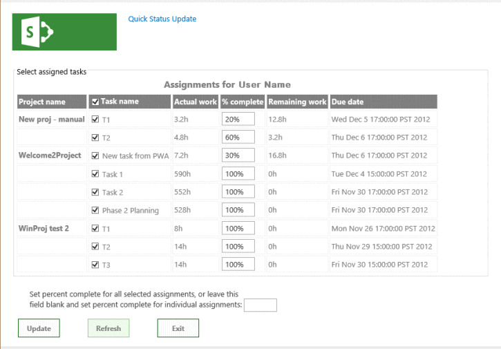
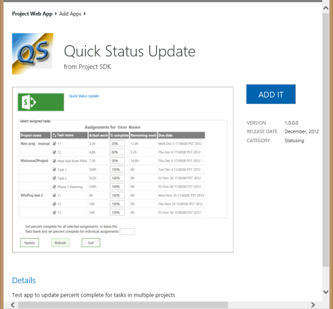
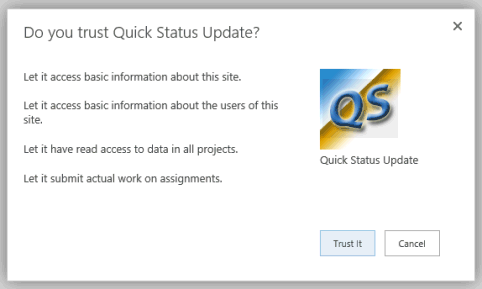
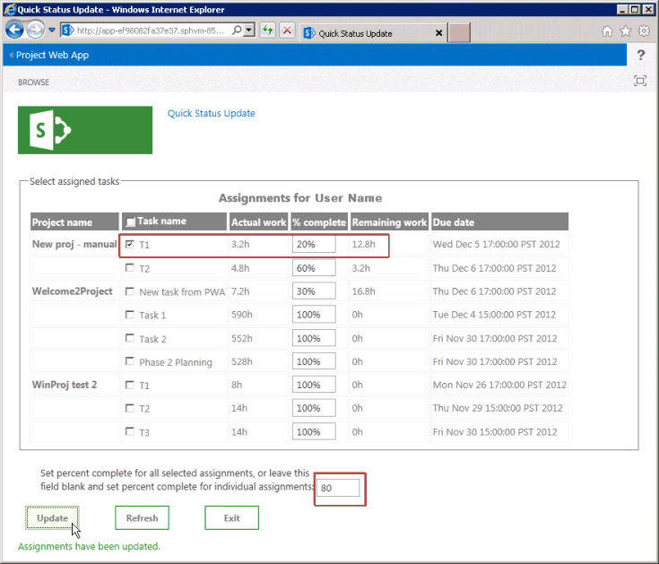
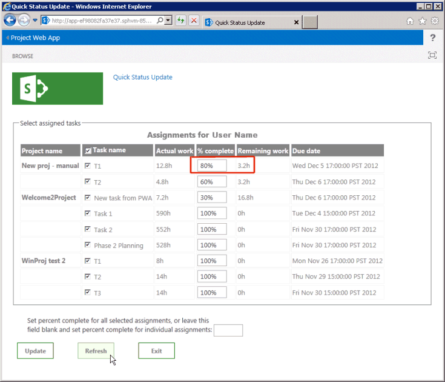
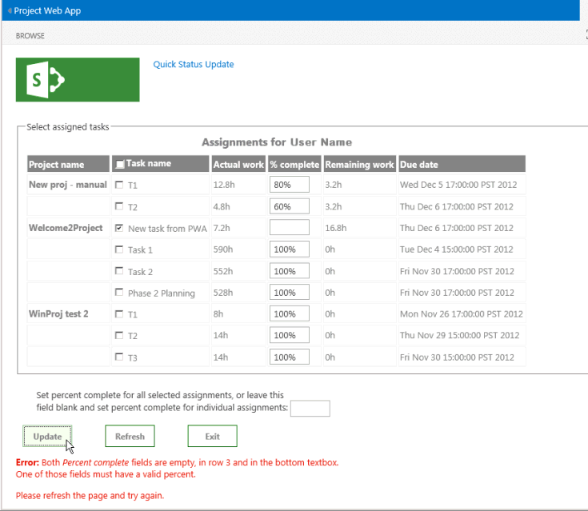
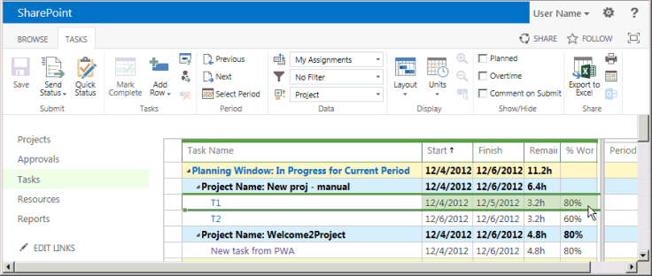

# <a name="create-a-sharepoint-hosted-project-server-add-in"></a>SharePoint をホストとする Project Server アドインを作成する

Project Online (自動ホスト型、プロバイダーホスト型、および SharePoint ホスト型) 用に作成できる3種類のアプリの中から、SharePoint でホストされるアプリを作成して展開するのが最も簡単です。 SharePoint ホスト型アプリは、OAuth 認証を必要とせず、プロバイダーでホストされているリソースのために、Azure を使用したり、ローカルサイトのメンテナンスを必要としたりしません。 Visual Studio の [2013 sharepoint 用アプリ] テンプレートは、Office ストアで発行および販売できるアプリを開発したり、sharepoint のプライベートアプリカタログに展開したりするための便利なフレームワークです。 
  
Project では、statusing は、チームメンバーが Project Web App の [タスク] ページを使用して、割り当てられたタスクの状態 (タスクの作業に費やした1週間の毎日の勤務時間数など) を送信するプロセスです。 割り当て所有者 (通常はプロジェクトマネージャー) は、状態を承認または拒否することができます。 ステータスが [承認済み] の場合、Project はスケジュールを再計算します。 **Quickstatus**アプリには、割り当てられたタスクが表示され、ユーザーは、完了率をすばやく更新し、選択された割り当ての進捗状況を提出して承認を求めることができます。 Project Web App の [タスク] ページには多くの機能がありますが、 **Quickstatus** App は簡単なインターフェイスを提供する例です。 
  
**Quickstatus**アプリは開発者のためのサンプルです。これは、運用環境での使用を目的としたものではありません。 主な目的は、完全に機能する statusing アプリを作成することではなく、Project Online のアプリ開発の例を示すことです。 Statusing のより良いアプローチについては、[次の手順](#pj15_StatusingApp_NextSteps)の推奨事項を参照してください。
  
Statusing の一般的な情報については、「[タスクの進行状況](https://support.office.com/article/Find-information-about-Project-Server-2013-8b08a414-15a7-4076-b2db-c90d0214ea7f?ui=en-US&rs=en-US&ad=US#BKMK_TaskProgress)」を参照してください。 SharePoint および Project Server 用のアドインの開発の詳細については、「 [Sharepoint アドイン](https://msdn.microsoft.com/library/jj163230.aspx)」を参照してください。

<a name="pj15_StatusingApp_Prerequisites"> </a>

## <a name="prerequisites-for-creating-an-app-for-project-server-2013"></a>Project Server 2013 用アプリを作成するための前提条件

Project Online またはオンプレミスの Project Server 2013 に展開できる比較的簡単なアプリを開発する場合は、オンライン開発環境を提供する Napa を使用できます。 より複雑なアプリ、Project Web App のリボンの変更、および開発時の簡単なデバッグには、Visual Studio 2012 または Visual Studio 2013 を使用できます。 たとえば、オンプレミスのインストールでは、Project Server データベースの変更について下書き datatable を手動で確認できます。 この記事では、Visual Studio でアプリを開発する方法について説明します。
  
Visual Studio を使用して Project Server アプリを開発するには、次のものが必要です。
  
- 使用するローカルの開発用コンピューターに最新のサービス パックと Windows 更新プログラムをインストールしてあることを確認します。オペレーティング システムは、Windows 7、Windows 8、Windows Server 2008、Windows Server 2012 のいずれでもかまいません。
    
- SharePoint Server 2013 および Project Server 2013 がインストールされているコンピューターに、アプリの分離とアプリケーションのサイドロードが構成されている必要があります。 サイドロードを使用すると、Visual Studio が一時的にアプリをデバッグ用にインストールできるようになります。 SharePoint および Project Server のオンプレミスインストールを使用できます。 詳細については、「 [SharePoint 用アプリのオンプレミスの開発環境をセットアップする](https://msdn.microsoft.com/library/fp179923%28Office.15%29.aspx)」を参照してください。
    
   > [!NOTE]
   > オンプレミスのインストールの場合は、企業のアプリカタログを作成する*前に*分離アプリドメインを構成します。 
  
- 開発用コンピューターは、Office Developer Tools for Visual Studio 2012 がインストールされているリモートコンピューターの場合があります。 最新のバージョンがインストールされていることを確認します。[Office 用アプリおよび SharePoint 用アプリのダウンロード](https://msdn.microsoft.com/office/apps/fp123627.aspx)の [*ツール*] セクションを参照してください。
    
- 開発およびテストに使用する Project Web App インスタンスがブラウザーでアクセスできることを確認します。
    
オンラインツールの使用方法については、「 [Office 365 で SharePoint 用アプリを開発するための環境を設定する](https://msdn.microsoft.com/library/fp161179.aspx)」を参照してください。 オンラインツールを使用する Project Server 用の単純なアプリを構築する方法のチュートリアルについては、「EPMSource ブログシリーズ」を参照して、[最初の Project server アプリを作成](https://epmsource.com/2012/11/20/building-your-first-project-server-app-part-zerothe-introduction/)してください。

<a name="pj15_StatusingApp_UsingVisualStudio"> </a>

## <a name="using-visual-studio-to-create-a-project-server-app"></a>Visual Studio を使用して Project Server アプリを作成する

Office Developer Tools for Visual Studio 2012 には、Project Server 2013 で使用できる SharePoint アプリのテンプレートが含まれています。 アプリソリューションを作成すると、ソリューションには、カスタムコードに次のファイルが含まれます。
  
- **Appmanifest.xml**には、アプリタイトル、アクセス許可要求スコープ、およびその他のプロパティの設定が含まれています。 手順1では、マニフェストデザイナーを使用してプロパティを設定する手順について説明します。 
    
- Pages フォルダーの**default.aspx**は、アプリのメインページです。 手順2は、 **Quickstatus**アプリに HTML5 コンテンツを追加する方法を示しています。 
    
- Scripts フォルダー内の**app.config**は、カスタム JavaScript コードのプライマリファイルです。 手順3では、 **Quickstatus**アプリの JavaScript コードについて説明します。 
    
   JQuery ベースのグリッドまたは日付選択などの市販のコントロールを追加する場合は、default.aspx ファイルに追加の JavaScript ファイルへの参照を追加することができます。
    
- コンテンツフォルダー内の**app.xaml**は、カスタム CSS3 スタイルのプライマリファイルです。 手順2と手順3には、 **Quickstatus**アプリのカスケードスタイルシート (CSS) のスタイルに関する情報が記載されています。 Default.aspx ファイルには、追加の CSS ファイルへの参照を追加できます。 
    
- Images フォルダーの**AppIcon**は、アプリが Office ストアまたはアプリカタログに表示する 96 x 96 アイコンです。 
    
Project Web App のリボンを変更するには、リボンのカスタムアクションを追加します。 [QuickStatus app セクションのコード例](#pj15_StatusingApp_Example)には、変更された Default.aspx、App.config、app.xaml、および appmanifest.xml ファイルの完全なコードが含まれています。 
  
### <a name="procedure-1-to-create-an-app-project-in-visual-studio"></a>手順 1. Visual Studio でアプリプロジェクトを作成するには

1. 管理者として Visual Studio 2012 を実行し、スタートページで [**新しいプロジェクト**] を選択します。 
    
2. [**新しいプロジェクト**] ダイアログボックスで、[**テンプレート**]、[ **Visual C#**]、[ **Office/SharePoint** ] ノードを展開し、[**アプリ**] を選択します。 中央のウィンドウの上部にある [ターゲットフレームワーク] ドロップダウンリストで、既定の **.Net framework 4.5**を使用し、[ **SharePoint 用アプリ 2013** ] を選択します (図1を参照)。 
    
3. [**名前**] フィールドに「quickstatus」と入力し、アプリを保存する場所を参照して、[ **OK]** を選択します。
    
   **図1。Visual Studio で Project Server アプリを作成する**

   ![Visual Studio で Project Server アプリを作成]する(media/pj15_CreateStatusingApp_NewProject.gif "Visual Studio で Project Server アプリを作成")する
  
4. [**新しい SharePoint 用アプリ**] ダイアログボックスで、次の3つのフィールドに入力します。 
    
   - 上部のテキストボックスに、Project Web App に表示するアプリの名前を入力します。 たとえば、「クイック状態の更新」と入力します。
    
   - デバッグに使用するサイトには、Project Web App インスタンスの URL を入力します。 たとえば、「」 `https://ServerName/ProjectServerName`と入力して ( _Servername_と_projectservername_を独自の値に置き換え)、[**検証**] を選択します。 すべてが正常に実行されると、Visual Studio は**接続が成功**したことを示します。 エラーメッセージが表示された場合は、Project Web App の URL が正しいことと、Project Server コンピュータがアプリの分離とアプリケーションのサイドロード用に構成されていることを確認してください。 詳細については、「 [Project Server 2013 用アプリを作成するための前提条件](#pj15_StatusingApp_Prerequisites)」セクションを参照してください。 
    
   - [ **Sharepoint 用アプリをホストする方法**] ドロップダウンリストで、[ **sharepoint ホスト型**] を選択します。
    
   > [!CAUTION]
   > **プロバイダーでホスト**される既定のプロジェクトの種類を誤って選択すると、Visual Studio によって、 **quickstatus**プロジェクトと**quickstatusweb**プロジェクトという2つのプロジェクトが作成されます。 2つのプロジェクトが表示された場合は、そのソリューションを削除し、もう一度開始します。 
  
5. **[OK]** を選択して、 **Quickstatus**ソリューション、 **quickstatus**プロジェクト、および既定のファイルを作成します。 
    
6. [マニフェストデザイナー] ビューを開きます (たとえば、Appmanifest.xml ファイルをダブルクリックします)。 [**全般**] タブの [**タイトル**] テキストボックスに、手順4で入力したアプリ名が表示されます。 [**アクセス許可**] タブを選択して、アプリに対して次のアクセス許可要求を追加します (図2を参照)。 
    
   - [**アクセス許可要求**] リストの最初の行で、[**範囲**] 列のドロップダウンリストから [ **Statusing** ] を選択します。 [**アクセス許可**] 列で、[ **submitstatus**] を選択します。
    
   - **範囲**が**複数のプロジェクト**であり、**アクセス許可**が**読み取ら**れる行を追加します。
    
   **図2Statusing アプリのアクセス許可のスコープの設定**

   
  
**Quickstatus**アプリを使用すると、Project Web app のユーザーは、複数のプロジェクトからそのユーザーの割り当てを読み取り、割り当ての達成率を変更し、更新を送信することができます。 図2のドロップダウンリストに表示されるその他のアクセス許可要求スコープは、このアプリでは必要ありません。 アクセス許可要求スコープとは、アプリがユーザーに代わって要求するアクセス許可のことです。 ユーザーが Project Web App でこれらの権限を持っていない場合、アプリは実行されません。 アプリには、他の SharePoint アクセス許可の場合を含む複数のアクセス許可要求スコープを含めることができますが、アプリの機能に必要な最低限の要件のみを含める必要があります。 Project Server に関連付けられているアクセス許可要求の範囲を次に示します。 

- **エンタープライズリソース**: 他の Project Web App ユーザーに関する情報を読み取りまたは書き込みを行うためのリソース管理者のアクセス許可。
    
- **複数のプロジェクト**: ユーザーがアクセス許可を要求した複数のプロジェクトに対して読み取りまたは書き込みを行います。
    
- **Project Server**: アプリユーザーが Project Web app の管理者権限を持っている必要があります。
    
- **レポート**: Project web App の**projectdata** OData サービスを確認します (project web app に対するログオン権限のみが必要です)。 
    
- **単一プロジェクト**: ユーザーがアクセス許可を要求したプロジェクトに対して、読み取りまたは書き込みを行います。
    
- **Statusing**: 作業時間、達成率、新しい割り当てなどの、割り当ての進捗状況の更新を提出します。
    
- **ワークフロー**: ユーザーが Project Server ワークフローを実行する権限を持っている場合、アプリはワークフローの引き上げられた権限で実行されます。
    
Project Server 2013 のアクセス許可要求範囲の詳細については、「project [2013 の開発者向けの更新プログラム](updates-for-developers-in-project-2013.md)」および「 [SharePoint 2013 のアプリのアクセス許可](https://msdn.microsoft.com/library/fp142383.aspx)」の「*プロジェクトアプリ*」セクションを参照してください。


<a name="pj15_StatusingApp_HTML"> </a>

### <a name="creating-the-html-content-for-the-quickstatus-app"></a>QuickStatus アプリの HTML コンテンツを作成する

HTML コンテンツのコーディングを開始する前に、QuickStatus アプリのユーザーインターフェイスとユーザーの利便性を設計します (図3は、完成したページの例を示しています)。 デザインには、HTML コードを操作する JavaScript 関数のアウトラインを含めることもできます。 一般的な情報については、「 [SharePoint 2013 のアプリの UX 設計](https://msdn.microsoft.com/library/fp179934.aspx)」を参照してください。
  
**図3QuickStatus app ページの設計**


  
アプリでは、表示名が上部に表示されます。これは、Appmanifest.xml の**Title**要素の値です。 
  
既定では、ページは HTML5 を使用します。 次に示すのは、 **Quickstatus**アプリによってページの本文に含まれるメイン UI オブジェクトの標準の HTML 要素です。 
  
- **Form**要素には、その他すべての UI 要素が含まれています。 
    
- **Fieldset**要素は、割り当てのテーブルのコンテナーと枠線を作成します。子の**legend**要素は、コンテナーのラベルを提供します。 
    
- **Table**要素には、キャプションとテーブルヘッダーのみが含まれています。 JavaScript 関数は、テーブルの標題を変更し、割り当ての行を追加します。 
    
   > [!NOTE]
   > ページングと並べ替えを簡単に追加するために、運用アプリでは、テーブルではなく、商用の jQuery ベースのグリッドコントロールを使用する可能性があります。 
  
   この表には、プロジェクト名、チェックボックスのあるタスク名、実績作業時間、達成率、残存作業時間、割り当て終了日の列が含まれています。 JavaScript 関数は、チェックボックスと、各タスクの達成率のテキスト入力フィールドを作成します。
    
- テキストボックスの**input**要素は、選択したすべての割り当てに対して達成率を設定します。 
    
- **Button**要素は、状態の変更を送信します。 
    
- **Button**要素は、ページを更新します。 
    
- **Button**要素は、アプリを終了し、Project Web app の [タスク] ページに戻ります。 
    
下部のテキストボックス要素と button 要素は**div**要素内にあるので、CSS は UI オブジェクトの位置と外観を簡単に管理できます。 JavaScript 関数は、ステータス更新の成功または失敗の結果が含まれるページの下部に段落を追加します。 
  
### <a name="procedure-2-to-create-the-html-content"></a>手順 2. HTML コンテンツを作成するには

1. Visual Studio で、default.aspx ファイルを開きます。
    
   このファイルには、2つの**asp: Content**要素が`ContentPlaceHolderID="PlaceHolderAdditionalPageHead"`含まれています。属性を持つ要素がページヘッダー `ContentPlaceHolderID="PlaceHolderMain"`内に追加され、その属性を持つ要素が page **body**要素内に配置されます。 
    
2. ページヘッダー `<asp:Content ContentPlaceHolderID="PlaceHolderAdditionalPageHead" runat="server">`のコントロールで、Project Server コンピュータ上のファイルへの参照を追加します。 テストおよびデバッグの場合は、.PS を使用できます。 
    
   ```HTML
     <script type="text/javascript" src="/_layouts/15/ps.debug.js"></script>
   ```

   アプリインフラストラクチャは、IIS `/_layouts/15/`の SharePoint サイトの仮想ディレクトリを使用します。 物理ファイルは`%ProgramFiles%\Common Files\Microsoft Shared\Web Server Extensions\15\TEMPLATE\LAYOUTS\PS.debug.js`です。
    
   > [!NOTE]
   > 運用のためにアプリを展開する前に`.debug` 、パフォーマンスを向上させるために、スクリプト参照からを削除してください。 
  
3. ページの`<asp:Content ContentPlaceHolderID="PlaceHolderMain" runat="server">`本文のコントロールで、生成された**div**要素を削除してから、UI オブジェクトの HTML コードを追加します。 **Table**要素には、ヘッダー行のみが含まれています。 [**タスク名**] 列には、チェックボックス入力コントロールが含まれています。 **Caption**要素のテキストは、app.config ファイル内の**Getuserinfo**関数の**onGetUserNameSuccess**コールバックに置き換えられます。 
    
    ```HTML
    <form>
        <fieldset>
        <legend>Select assigned tasks</legend>
        <table id="assignmentsTable">
            <caption id="tableCaption">Replace caption</caption>
            <thead>
            <tr id="headerRow">
                <th>Project name</th>
                <th><input type="checkbox" id="headercheckbox" checked="checked" />Task name</th>
                <th>Actual work</th>
                <th>% complete</th>
                <th>Remaining work</th>
                <th>Due date</th>
            </tr>
            </thead>
        </table>
        </fieldset>
        <div id="inputPercentComplete" >
        Set percent complete for all selected assignments, or leave this
        <br /> field blank and set percent complete for individual assignments: 
        <input type="text" name="percentComplete" id="pctComplete" size="4"  maxlength="4" />
        </div>
        <div id="submitResult">
        <p><button id="btnSubmitUpdate" type="button" class="bottomButtons" ></button></p>
        <p id="message"></p>
        </div>
        <div id="refreshPage">
        <p><button id="btnRefresh" type="button" class="bottomButtons" >Refresh</button></p>
        </div>
        <div id="exitPage">
        <p><button id="btnExit" type="button" class="bottomButtons" >Exit</button></p>
        </div>
    </form>
    ```

4. App.xaml ファイルに、UI 要素の位置と外観の CSS コードを追加します。 **Quickstatus**アプリの完全な CSS コードについては、「 [quickstatus app」セクションのコード例](#pj15_StatusingApp_Example)を参照してください。 
    
手順 3 JavaScript 関数を追加して、割り当てを読み取り、テーブルの行を作成し、割り当ての達成率を変更して更新します。 実際の手順は、さらに多くの場合、HTML コードを作成し、関連するスタイルと JavaScript 関数を追加してテストし、HTML コードを変更または追加し、そのプロセスを繰り返すことによって、アプリの開発において反復処理を行います。

<a name="pj15_StatusingApp_JavaScript"> </a>

### <a name="creating-the-javascript-functions-for-the-quickstatus-app"></a>QuickStatus アプリ用の JavaScript 関数の作成

SharePoint アプリの Visual Studio テンプレートには、SharePoint クライアントコンテキストを取得する既定の初期化コードを含む App.config ファイルが含まれています。このファイルには、アプリページの基本的な get アクションおよび set アクションのデモが示されています。 SharePoint クライアント側の SP .js ライブラリの JavaScript 名前空間は**sp**です。 Project Server アプリは、.PS ライブラリを使用するため、アプリは**ps**名前空間を使用してクライアントコンテキストを取得し、Project SERVER の jsom にアクセスします。 
  
**Quickstatus**アプリの JavaScript 関数には、次のようなものがあります。 
  
- Document **ready**イベントハンドラーは、ドキュメントオブジェクトモデル (DOM) のインスタンスが生成されたときに実行されます。 **準備完了**イベントハンドラーは、次の4つの手順を実行します。 
    
    1. プロジェクトサーバー JSOM および**Pwaweb**グローバル変数のクライアントコンテキストで**projcontext**グローバル変数を初期化します。 
        
    2. **Getuserinfo**関数を呼び出して、 **projuser**グローバル変数を初期化します。 
        
    3. ユーザーに対して指定された割り当てデータを取得する**getAssignments**関数を呼び出します。 
        
    4. [イベントハンドラー] を [テーブルヘッダー] チェックボックスに、[テーブルの各行のチェックボックスにバインドします。 Click イベントハンドラーは、ユーザーがテーブルのチェックボックスをオンまたはオフにしたときにチェックボックスのチェック**マークが付い**ている属性を管理します。 
    
- **GetAssignments**関数が正常に実行された場合は、 **onGetAssignmentsSuccess**関数を呼び出します。 この関数は、各割り当てのテーブルに行を挿入し、各行の HTML コントロールを初期化してから、下部のボタンのプロパティを初期化します。 
    
- [**更新**] ボタンの**onClick**イベントハンドラーは、 **updateassignments**関数を呼び出します。 この関数は、選択された各割り当てに適用される達成率の値を取得します。または、[達成率] テキストボックスが空の場合、この関数は、テーブル内の選択された各割り当ての達成率を取得します。 **Updateassignments**関数は、状態の更新を保存して送信し、結果についてのメッセージをページの下部に書き込みます。 
    
### <a name="procedure-3-to-create-the-javascript-functions"></a>手順 3. JavaScript 関数を作成するには

1. Visual Studio で、App.config ファイルを開き、ファイル内のすべてのコンテンツを削除します。
    
2. グローバル変数とドキュメント**準備**イベントハンドラーを追加します。 **Document**オブジェクトは、jQuery 関数を使用してアクセスされます。 
    
   [テーブルヘッダー] チェックボックスの click イベントハンドラーは、チェックボックスのオン/オフ状態を設定します。 すべての行のチェックボックスが選択されている場合、またはすべてオフになっている場合は、[行のクリックイベントハンドラー] チェックボックスをオンにして、ヘッダーのチェックボックスの状態を設定します。 Click イベントハンドラーは、ページの下部にある結果メッセージも空の文字列に設定します。
    
   ```js
    var projContext;
    var pwaWeb;
    var projUser;
    // This code runs when the DOM is ready and creates a ProjectContext object.
    // The ProjectContext object is required to use the JSOM for Project Server.
    $(document).ready(function () {
        projContext = PS.ProjectContext.get_current();
        pwaWeb = projContext.get_web();
        getUserInfo();
        getAssignments();
        // Bind a click event handler to the table header check box, which sets the row check boxes
        // to the checked state of the header check box, and sets the results message to an empty string.
        $('#headercheckbox').live('click', function (event) {
            $('input:checkbox:not(#headercheckbox)').attr('checked', this.checked);
            $get("message").innerText = "";
        });
        // Bind a click event handler to the row check boxes. If any row check box is cleared, clear
        // the header check box. If all of the row check boxes are selected, select the header check box.
        $('input:checkbox:not(#headercheckbox)').live('click', function (event) {
            var isChecked = true;
            $('input:checkbox:not(#headercheckbox)').each(function () {
                if (this.checked == false) isChecked = false;
                $get("message").innerText = "";
            });
            $("#headercheckbox").attr('checked', isChecked);
        });
    });
   ```

3. クエリが成功した場合は**onGetUserNameSuccess**を呼び出す**getuserinfo**関数を追加します。 **OnGetUserNameSuccess**関数は、**キャプション**の段落の内容を、ユーザー名を含む表のキャプションに置き換えます。 
    
   ```js
        // Get information about the current user.
        function getUserInfo() {
            projUser = pwaWeb.get_currentUser();
            projContext.load(projUser);
            projContext.executeQueryAsync(onGetUserNameSuccess,
                // Anonymous function to execute if getUserInfo fails.
                function (sender, args) {
                    alert('Failed to get user name. Error: ' + args.get_message());
            });
        } 
        // This function is executed if the getUserInfo call is successful.
        function onGetUserNameSuccess() {
            var prefaceInfo = 'Assignments for ' + projUser.get_title();
            $('#tableCaption').text(prefaceInfo);
        }
   ```

4. 割り当てクエリが成功した場合は、 **onGetAssignmentsSuccess**を呼び出す**getAssignments**関数を追加します (手順5を参照)。 **Include**オプションは、指定されたフィールドのみを返すようにクエリを制限します。 
    
   ```js
    // Get the collection of assignments for the current user.
    function getAssignments() {
        assignments = PS.EnterpriseResource.getSelf(projContext).get_assignments();
        // Register the request that you want to run on the server. The optional "Include" parameter 
        // requests only the specified properties for each assignment in the collection.
        projContext.load(assignments,
            'Include(Project, Name, ActualWork, ActualWorkMilliseconds, PercentComplete, RemainingWork, Finish, Task)');
        // Run the request on the server.
        projContext.executeQueryAsync(onGetAssignmentsSuccess,
            // Anonymous function to execute if getAssignments fails.
            function (sender, args) {
                alert('Failed to get assignments. Error: ' + args.get_message());
            });
    }
   ```

5. **OnGetAssignmentsSuccess**関数を追加します。この関数は、テーブルに割り当てごとに行を追加します。 **Prevprojname**変数は、ある行が別のプロジェクトに対してかどうかを判断するために使用されます。 その場合は、プロジェクト名が太字のフォントで表示されます。指定しない場合、プロジェクト名は空の文字列に設定されます。 
    
   > [!NOTE]
   > JSOM には、 **Actualwork timespan**など、csom に含まれる**TimeSpan**プロパティは含まれていません。 代わりに、JSOM は、PS などのミリ秒数のプロパティを使用し[ます。StatusAssignment プロパティ (Actualwork milliseconds)](https://msdn.microsoft.com/library/736bce1e-f734-0efe-6c5f-e0e891ab00ef%28Office.15%29.aspx) 。 このプロパティを取得するメソッドは **、\_actualwork ミリ秒を取得**します。これは、整数値を返します。 > **get_actualWork**メソッドは、"3h" などの文字列を返します。 **Quickstatus**アプリではいずれの値も使用できますが、表示方法が異なります。 割り当てのクエリには両方のプロパティが含まれているため、デバッグ時に値をテストできます。 **Actualwork**変数を削除した場合は、割り当てクエリで**actualwork**プロパティを削除することもできます。 
  
   最後に、 **onGetAssignmentsSuccess**関数は、[**更新**] ボタン**** と [更新] ボタンをクリックして、click イベントハンドラーを初期化します。 [**更新**] ボタンのテキスト値は、HTML コードで設定することもできます。 
    
   ```js
        // Get the enumerator, iterate through the assignment collection, 
        // and add each assignment to the table.
        function onGetAssignmentsSuccess(sender, args) {
            if (assignments.get_count() > 0) {
                var assignmentsEnumerator = assignments.getEnumerator();
                var projName = "";
                var prevProjName = "3D2A8045-4920-4B31-B3E7-9D0C5195FC70"; // Any unique name.
                var taskNum = 0;
                var chkTask = "";
                var txtPctComplete = "";
                // Constants for creating input controls in the table.
                var INPUTCHK = '<input type="checkbox" class="chkTask" checked="checked" id="chk';
                var LBLCHK = '<label for="chk';
                var INPUTTXT = '<input type="text" size="4"  maxlength="4" class="txtPctComplete" id="txt';
                while (assignmentsEnumerator.moveNext()) {
                    var statusAssignment = assignmentsEnumerator.get_current();
                    projName = statusAssignment.get_project().get_name();
                    // Get an integer, such as 3600000.
                    var actualWorkMilliseconds = statusAssignment.get_actualWorkMilliseconds(); 
                    // Get a string, such as "1h". Not used here.
                    var actualWork = statusAssignment.get_actualWork();
                    if (projName === prevProjName) {
                        projName = "";
                    }
                    prevProjName = statusAssignment.get_project().get_name();
                    // Create a row for the assignment information.
                    var row = assignmentsTable.insertRow();
                    taskNum++;
                    // Create an HTML string with a check box and task name label, for example:
                    // <input type="checkbox" class="chkTask" checked="checked" id="chk1" /> <label for="chk1">Task 1</label>
                    chkTask = INPUTCHK + taskNum + '" /> ' + LBLCHK + taskNum + '">' 
                        + statusAssignment.get_name() + '</label>';
                    txtPctComplete = INPUTTXT + taskNum + '" />';
                    // Insert cells for the assignment properties.
                    row.insertCell().innerHTML = '<strong>' + projName + '</strong>';
                    row.insertCell().innerHTML = chkTask;
                    row.insertCell().innerText = actualWorkMilliseconds / 3600000 + 'h';
                    row.insertCell().innerHTML = txtPctComplete;
                    row.insertCell().innerText = statusAssignment.get_remainingWork();
                    row.insertCell().innerText = statusAssignment.get_finish();
                    // Initialize the percent complete cell.
                    $get("txt" + taskNum).innerText = statusAssignment.get_percentComplete() + '%'
                }
            }
            else {
                $('p#message').attr('style', 'color: #0f3fdb');     // Blue text.
                $get("message").innerText = projUser.get_title() + ' has no assignments'
            }
            // Initialize the button properties.
            $get("btnSubmitUpdate").onclick = function() { updateAssignments(); };
            $get("btnSubmitUpdate").innerText = 'Update';
            $get('btnRefresh').onclick = function () { window.location.reload(true); };
            $get('btnExit').onclick = function () { exitToPwa(); };
        }
   ```

6. [**更新**] ボタンの**updateassignments**クリックイベントハンドラーを追加します。 ユーザーがタスクの達成率の値を変更したり、[**達成**率] テキストボックスに値を追加したりすると、"60"、"60%"、"60%" などのさまざまな形式で値を入力することができます。 **Getnumericvalue**メソッドは、入力テキストの数値を返します。 
    
   > [!NOTE]
   > 運用環境で使用するように設計されているアプリでは、数値情報の入力値にフィールドの入力規則と追加のエラーチェックを含める必要があります。 
  
   **Updateassignments**の例には、基本的なエラーチェックが含まれており、ページの下部にある**メッセージ**の段落に情報が表示されます。更新クエリが成功した場合は緑色、入力エラーが発生した場合は赤、または更新クエリがいか. 
    
   **Submitallstatusupdates**メソッドを使用する前に、アプリは PS を使用してサーバーに更新を保存する必要があり**ます。Status割り当てコレクション. update**メソッド。 
    
   ```js
        // Update all checked assignments. If the bottom percent complete field is blank,
        // use the value in the % complete field of each selected row in the table.
        function updateAssignments() {
            // Get percent complete from the bottom text box.
            var pctCompleteMain = getNumericValue($('#pctComplete').val()).trim();
            var pctComplete = pctCompleteMain;
            var assignmentsEnumerator = assignments.getEnumerator();
            var taskNum = 0;
            var taskRow = "";
            var indexPercent = "";
            var doSubmit = true;
            while (assignmentsEnumerator.moveNext()) {
                var pctCompleteRow = "";
                taskRow = "chk" + ++taskNum;
                if ($get(taskRow).checked) {
                    var statusAssignment = assignmentsEnumerator.get_current();
                    if (pctCompleteMain === "") {
                        // Get percent complete from the text box field in the table row.
                        pctCompleteRow = getNumericValue($('#txt' + taskNum).val());
                        pctComplete = pctCompleteRow;
                    }
                    // If both percent complete fields are empty, show an error.
                    if (pctCompleteMain === "" && pctCompleteRow === "") {
                        $('p#message').attr('style', 'color: #e11500');     // Red text.
                        $get("message").innerHTML =
                            '<b>Error:</b> Both <i>Percent complete</i> fields are empty, in row '
                            + taskNum
                            + ' and in the bottom textbox.<br/>One of those fields must have a valid percent.'
                            + '<p>Please refresh the page and try again.</p>';
                        doSubmit = false;
                        taskNum = 0;
                        break;
                    }
                    if (doSubmit) statusAssignment.set_percentComplete(pctComplete);
                }
            } 
            // Save and submit the assignment updates.
            if (doSubmit) {
                assignments.update();
                assignments.submitAllStatusUpdates();
                projContext.executeQueryAsync(function (source, args) {
                    $('p#message').attr('style', 'color: #0faa0d');     // Green text.
                    $get("message").innerText = 'Assignments have been updated.';
                }, function (source, args) {
                    $('p#message').attr('style', 'color: #e11500');     // Red text.
                    $get("message").innerText = 'Error updating assignments: ' + args.get_message();
                });
            }
        }
        // Get the numeric part for percent complete, from a string. For example, with "20 %", return "20".
        function getNumericValue(pctComplete) {
            pctComplete = pctComplete.trim();
            pctComplete = pctComplete.replace(/ /g, "");    // Remove interior spaces.
            indexPercent = pctComplete.indexOf('%', 0);
            if (indexPercent > -1) pctComplete = pctComplete.substring(0, indexPercent);
            return pctComplete;
        }
   ```

7. ホストプロジェクト Web App サイトの URL に**Sphosturl**クエリ文字列パラメーターを使用する**exittopwa**関数を追加します。 [タスク] ページに戻るには、 `"/Tasks.aspx"` URL にを追加します。 たとえば、 **Sphosturl**変数はに`https://ServerName/ProjectServerName/Tasks.aspx`設定します。
    
   **Getquerystringparameter**関数は、 **quickstatus**ページの url を分割して、url オプションで指定されたパラメーターを抽出して返します。 ドキュメントの例を次に示し**ます。** **Quickstatus**ドキュメントの URL 値 (すべて1行)。 
    
   ```HTML
    https://app-ef98082fa37e3c.servername.officeapps.selfhost.corp.microsoft.com/pwa/
        QuickStatus/Pages/Default.aspx
        ?SPHostUrl=https%3A%2F%2Fsphvm%2D85178%2Fpwa
        &SPLanguage=en%2DUS
        &SPClientTag=1
        &SPProductNumber=15%2E0%2E4420%2E1022
        &SPAppWebUrl=https%3A%2F%2Fapp%2Def98082fa37e3c%2Eservername
            %2Eofficeapps%2Eselfhost%2Ecorp%2Emicrosoft%2Ecom%2Fpwa%2FQuickStatus
   ```

   前の URL の場合、 **Getquerystringparameter**関数は**sphosturl**クエリ文字列値を`https://ServerName/pwa`返します。 
    
   ```js
        // Exit the QuickStatus page and go back to the Tasks page in Project Web App.
        function exitToPwa() {
            // Get the SharePoint host URL, which is the top page of PWA, and add the Tasks page.
            var spHostUrl = decodeURIComponent(getQueryStringParameter('SPHostUrl'))
                            + "/Tasks.aspx";
            // Set the top window for the QuickStatus IFrame to the Tasks page.
            window.top.location.href = spHostUrl;
        }
        // Get a specified query string parameter from the {StandardTokens} URL option string.
        function getQueryStringParameter(urlParameterKey) {
            var docUrl = document.URL;
            var params = docUrl.split('?')[1].split('&');
            for (var i = 0; i < params.length; i++) {
                var theParam = params[i].split('=');
                if (theParam[0] == urlParameterKey)
                    return decodeURIComponent(theParam[1]);
            }
        }
   ```

この時点で**Quickstatus**アプリを発行して Project Web app に追加すると、アプリは [サイトコンテンツ] ページから実行できるようになりますが、ユーザーが簡単に使用できるわけではありません。 ユーザーがアプリを見つけて実行できるようにするには、[タスク] ページのリボンにボタンを追加します。 手順4は、リボンのカスタムアクションを追加する方法を示しています。 

<a name="pj15_StatusingApp_ribbon"> </a>

### <a name="adding-a-ribbon-custom-action"></a>リボンのカスタム操作の追加

Project Web App のリボンタブ、グループ、コントロールは、pwaribbon.xml ファイルで指定されています。このファイルは`[Program Files]\Common Files\Microsoft Shared\Web Server Extensions\15\TEMPLATE\FEATURES\PWARibbon\listtemplates` 、project Server を実行しているコンピュータ上のディレクトリにインストールされます。 Project Web App のリボンのカスタムアクションを設計するために、Project 2013 SDK のダウンロードには pwaribbon.xml のコピーが含まれています。 
  
Project Web App では、[タスク] ページにさまざまなリボン定義が使用されています。これは、Project Web App インスタンスが、タイムシートとタスクの状態の両方の値を入力できるようにする単一入力モードを使用するかどうかによって異なります。 Project Web App の管理アクセス許可を持っている場合は、エントリモードを確認するには、ページの右上隅にあるドロップダウン設定メニューで [ **PWA 設定**] を選択します。 [PWA 設定] ページで、[**タイムシートの設定および既定値**] を選択し、ページの下部にある [**単一入力モード**] チェックボックスを確認します。 
  
単一入力モードがオフの場合、[タスク] ページのリボンは pwaribbon.xml の [自分の作業] 領域で定義されます。 
  
```XML
   <!-- REGION My Work Ribbon-->
   <CustomAction
      Id="Ribbon.ContextualTabs.MyWork"
      . . .
```

単一入力モードがオンの場合、[タスク] ページのリボンは pwaribbon.xml の [結び付けられたモード] 領域で定義されます。 
  
```XML
   <!-- REGION Tied Mode Ribbon-->
   <CustomAction
      Id="Ribbon.ContextualTabs.TiedMode"
      . . .
```

各地域のグループとコントロールは似ていますが、結合されたモードのコントロールは、非連結モードの同じコントロールとは別の関数を呼び出すことができます。 手順4は、単一入力モードがオフのときに**Quickstatus**アプリにボタンコントロールを追加する方法を示しています ([**単一入力モード**] チェックボックスをオフにします)。 
  
> [!NOTE]
> SharePoint アプリケーションのリボンまたはメニューにカスタムアクションを追加する方法の概要については、「 [sharepoint 用アプリを使用して展開するカスタムアクションを作成する](https://msdn.microsoft.com/library/jj163954.aspx)」を参照してください。 
  
### <a name="procedure-4-to-add-a-ribbon-custom-action-to-the-tasks-page"></a>手順 4. [タスク] ページにリボンカスタムアクションを追加するには

1. Project Web App の [タスク] ページでリボンを調べます。 リボンの [**タスク**] タブを選択し、その変更方法を計画します。 **提出**、**タスク**、**期間**など、7つのグループがあります。 **Submit**グループには、[**保存**] ボタンと [**送信の状態**] ドロップダウンメニューという2つのコントロールがあります。 グループ内の任意の場所にコントロールを追加したり、[**タスク**] タブの任意の場所に新しいコントロールを含むグループを追加したり、ユーザー設定のグループとコントロールを持つ別のリボンタブを追加したりできます。 この例では、3番目のボタンを**Submit**グループに追加します。ここでは、ボタンが**QUICKSTATUS**アプリの URL を呼び出します。 
    
2. Visual Studio の [**ソリューションエクスプローラー** ] ウィンドウで、 **quickstatus**プロジェクトを右クリックして、新しいアイテムを追加します。 [**新しいアイテムの追加**] ダイアログボックスで、[**リボンのカスタムアクション**] を選択します (図4を参照)。 たとえば、ユーザー設定アクションの "Ribbonquick" アクションに名前を指定し、[**追加**] を選択します。
    
   **図4リボンのカスタムアクションを追加する**

   ![リボンのカスタムアクションを追加]する(media/pj15_CreateStatusingApp_AddRibbonCustomAction.gif "リボンのカスタムアクションを追加")する
  
3. [**リボンのカスタムアクションの作成**] ウィザードの最初のページで、 **[ホスト Web** ] オプションが選択されたままにして、カスタムアクションのスコープのドロップダウンリストで [**なし**] を選択し、[**次へ**] を選択します (図5を参照)。 ドロップダウンリスト内の項目は、Project Server ではなく、SharePoint に関連しています。 カスタムアクションの生成された XML の大部分は、Project Server に適用されるように置き換えられます。 
    
   **図5リボンのカスタムアクションのプロパティを指定する**

   
  
4. [**リボンのカスタムアクションの作成**] ウィザードの次のページで、設定のすべての既定値をそのまま使用し、[**完了**] を選択します (図6を参照)。 Visual Studio は、要素 .xml ファイルを含む**Ribbonquickstatusaction**フォルダーを作成します。 
    
   **図6ボタンコントロールの設定を指定する**

   
  
5. リボンカスタムアクションの要素 .xml ファイルで、既定で生成されたコードを変更します。 既定の XML コードは次のとおりです。
    
   ```XML
    <?xml version="1.0" encoding="utf-8"?>
    <Elements xmlns="http://schemas.microsoft.com/sharepoint/">
        <CustomAction Id="21ea3aaf-79e5-4aac-9479-8eef14b4d9df.RibbonQuickStatusAction"
                    Location="CommandUI.Ribbon"
                    Sequence="10001"
                    Title="Invoke &apos;RibbonQuickStatusAction&apos; action">
        <CommandUIExtension>
            <!-- 
            Update the UI definitions below with the controls and the command actions
            that you want to enable for the custom action.
            -->
            <CommandUIDefinitions>
            <CommandUIDefinition Location="Ribbon.ListItem.Actions.Controls._children">
                <Button Id="Ribbon.ListItem.Actions.RibbonQuickStatusActionButton"
                        Alt="Request RibbonQuickStatusAction"
                        Sequence="100"
                        Command="Invoke_RibbonQuickStatusActionButtonRequest"
                        LabelText="Request RibbonQuickStatusAction"
                        TemplateAlias="o1"
                        Image32by32="_layouts/15/images/placeholder32x32.png"
                        Image16by16="_layouts/15/images/placeholder16x16.png" />
            </CommandUIDefinition>
            </CommandUIDefinitions>
            <CommandUIHandlers>
            <CommandUIHandler Command="Invoke_RibbonQuickStatusActionButtonRequest"
                                CommandAction="~appWebUrl/Pages/Default.aspx"/>
            </CommandUIHandlers>
        </CommandUIExtension >
        </CustomAction>
    </Elements>
   ```

   1. **CustomAction**要素で、 **Sequence**属性と**Title**属性を削除します。 
    
   2. **送信**グループにコントロールを追加するには、pwaribbon.xml ファイル内の`Ribbon.ContextualTabs.MyWork.Home.Groups`コレクションの最初のグループ (を開始する要素) を検索`<Group Id="Ribbon.ContextualTabs.MyWork.Home.Page" Command="PageGroup" Sequence="10" Title="$Resources:pwafeatures,PAGE_PDP_CM_SUBMIT"`します。 子コントロールを**送信**グループに追加するために、次のコードは、Elements ファイル内の**** /////////////////の正しい**場所**の属性を示しています。 
    
      ```XML
        <CommandUIDefinitions>
          <CommandUIDefinition Location="Ribbon.ContextualTabs.MyWork.Home.Page.Controls._children">
             . . .
          </CommandUIDefinition>
        </CommandUIDefinitions>
      ```

   3. 子**Button**要素の属性値を次のように変更します。 
    
       ```XML
            <Button Id="Ribbon.ContextualTabs.MyWork.Home.Page.QuickStatus"
                    Alt="Quick Status app"
                    Sequence="30"
                    Command="Invoke_QuickStatus"
                    LabelText="Quick Status"
                    TemplateAlias="o1"
                    Image16by16="_layouts/15/1033/images/ps16x16.png" 
                    Image16by16Left="-80"
                    Image16by16Top="-144"
                    Image32by32="_layouts/15/1033/images/ps32x32.png" 
                    Image32by32Left="-32"
                    Image32by32Top="-288" 
                    ToolTipTitle="QuickStatus"
                    ToolTipDescription="Run the QuickStatus app" />
       ```

       - このボタンをグループ内の3番目のコントロールにするには、 **Sequence**属性に既存の`Sequence="20"` **送信状態**コントロール (pwaribbon.xml の**FlyoutAnchor**要素) の値よりも大きい数値を指定します。 規則によって、グループとコントロールのシーケンス番号`10, 20, 30, …`がで、要素を中間位置に挿入できるようになります。
    
       - **Command**属性には、コマンドを指定します**** 。このコマンドは、コマンドを指定します (次の手順5を参照)。 次の開発者にとって簡単になるように、コマンド名を簡略化することができます。 たとえば`Command="Invoke_QuickStatus"` 、より`Command="Invoke_RibbonQuickStatusActionButtonRequest"`読みやすくなります。
    
       - イメージ属性は、16 x 16 ピクセルアイコンと、ボタンコントロールの 32 x 32 ピクセルアイコンを指定します。 既定の要素 .xml ファイルで、 `Image32by32="_layouts/15/images/placeholder32x32.png"`オレンジ色のドットを指定します。 Project Server を実行しているコンピューターの`[Program Files]\Common Files\Microsoft Shared\Web Server Extensions\15\TEMPLATE\LAYOUTS\1033\IMAGES`ディレクトリにインストールされているイメージマップファイル (ps16x16 および ps32x32) からアイコンを抽出することができます。 たとえば、32 x 32 ピクセルのアイコンは、左から10番目のアイコン、ps32x32 イメージマップの上部から10行下にスクロールされます (アイコンの上部は9行目の末尾の後、9行は32ピクセル/行 = 288 ピクセルです)。 
    
       - [ボタン] コントロールのツールヒントを表示するには、 **ToolTipTitle**属性と**ToolTipDescription**属性を追加します。 
    
    4. //または**Ihandler**要素の属性を変更します。 たとえば、 **command**属性が**Button**要素の**コマンド**属性値と一致することを確認します。 **Commandaction**属性に`~appWebUrl`は、 **QUICKSTATUS** web ページの URL のプレースホルダーがあります。 リボンボタンが**Quickstatus**アプリを起動すると、 **{standardtokens}** トークンは、 **sphosturl**、 **SPLanguage**、 **Sphosturl**、 **sphosturl**、および SPAppWebUrl を含む URL オプションに置き換えられます。 ****.
    
        ```XML
            <CommandUIHandlers>
                <CommandUIHandler Command="Invoke_QuickStatus"
                                  CommandAction="~appWebUrl/Pages/Default.aspx?{StandardTokens}"/>
            </CommandUIHandlers>
        ```

6. **ソリューションエクスプローラー**で、 **Feature1**デザイナーを開き、[ソリューション] ウィンドウ**内の項目**から [機能] ウィンドウ内の**項目**に [ **ribbonquickstatusaction** ] アイテムを移動します。 その後、パッケージデザイナー **** を開くと、[パッケージ] ウィンドウの**項目**に [ **ribbonquickstatusaction** ] アイテムが表示されます。 
    
アプリの開発とリボンボタンの追加では、通常、アプリをテストし、デバッグのために JavaScript コードでブレークポイントを設定します。 **F5**キーを押してデバッグを開始すると、Visual Studio によってアプリがコンパイルされ、 **quickstatus**プロジェクトの [**サイト URL** ] プロパティで指定されたサイトに展開され、アプリを信頼するかどうかを確認するページが表示されます。 作業を続行して**Quickstatus**アプリを終了すると、Project Web app の [タスク] ページに戻ります。 

> [!NOTE]
> 図7は、リボンの [**タスク**] タブの [**クイック状態**] ボタンが無効になっていることを示しています。 Visual Studio を使用して多数のデバッグを展開した後、同じテストサーバーで発行済みアプリのデバッグまたは展開を続行するときに、カスタムリボンコントロールをブロックすることができます。 このボタンを有効にするには、Visual Studio の [ **Ribbonquickstatusaction アクション**アイテムを削除してから、名前と ID が異なる新しいリボンアクションを作成します。 それでも問題が解決しない場合は、Project Web App テストインスタンスからアプリを削除してから、別のアプリ ID を使用してアプリを再作成してみてください。 
  
**図7無効になっているクイック状態ボタンのツールヒントの表示**


  
手順5は、 **Quickstatus**アプリを展開してインストールする方法を示しています。 手順6は、アプリをインストールした後にテストするための追加の手順を示しています。 

<a name="pj15_StatusingApp_Deploying"> </a>

## <a name="deploying-the-quickstatus-app"></a>QuickStatus アプリの展開

SharePoint web アプリケーション (Project Web App など) にアプリを展開するには、いくつかの方法があります。 どの展開を使用するかは、アプリをプライベート SharePoint カタログに発行するか、パブリック Office ストアに発行するか、または SharePoint がオンプレミスでインストールされるか、またはオンラインテナントであるかによって決まります。 手順5は、 **Quickstatus**アプリをプライベートアプリカタログの社内インストールに展開する方法を示しています。 詳細については、「 [Install and manage apps For sharepoint 2013](https://technet.microsoft.com/library/fp161232.aspx) 」および「 [sharepoint 用アプリを発行](https://msdn.microsoft.com/library/jj164070.aspx)する」を参照してください。
  
> [!NOTE]
> SharePoint カタログにアプリを追加するには、SharePoint 管理者権限が必要です。 
  
### <a name="procedure-5-to-deploy-the-quickstatus-app"></a>手順 5. QuickStatus アプリを展開するには

1. Visual Studio で、すべてのファイルを保存し、**ソリューションエクスプローラー**で**quickstatus**プロジェクトを右クリックして、[**発行**] を選択します。
    
2. **Quickstatus**アプリは SharePoint ホストされているため、発行に関するオプションはほとんどありません (図8を参照)。 [ **Office 用アプリと SharePoint 用アプリの発行**] ダイアログボックスで、[**完了**] を選択します。
    
   **図8QuickStatus アプリの発行**

   
  
3. QuickStatus. app ファイルを、 `~\QuickStatus\bin\Debug\app.publish\1.0.0.0`ディレクトリからローカルコンピューター上の便利なディレクトリ (またはオンプレミスのインストールの場合は SharePoint コンピューター) にコピーします。 
    
4. SharePoint サーバーの全体管理で、サイドリンクバーの [**アプリ**] を選択し、[**アプリカタログの管理**] を選択します。
    
5. アプリカタログが存在しない場合は、「 [SharePoint 2013 でアプリカタログを管理](https://technet.microsoft.com/library/fp161234.aspx)する」の「 *Web アプリケーションのアプリカタログサイトを構成*する」セクションに従って、アプリカタログのサイトコレクションを作成します。
    
   アプリカタログが存在する場合は、[アプリカタログの管理] ページでサイトの URL に移動します。 たとえば、次の手順では、アプリカタログサイトは`https://ServerName/sites/TestApps`です。
    
6. [アプリカタログ] ページで、サイドリンクバーの [ **SharePoint 用アプリ**] を選択します。 [SharePoint 用アプリ] ページのリボンの [**ファイル**] タブで、[**ドキュメントのアップロード**] を選択します。
    
7. [**ドキュメントの追加**] ダイアログボックスで、quickstatus. app ファイルを参照し、そのバージョンのコメントを追加して、[ **OK]** を選択します。
    
8. アプリを追加するときに、アプリの説明、アイコン、およびその他の情報のローカル情報を追加することもできます。 [ **Sharepoint 用アプリ-QuickStatus. app** ] ダイアログボックスで、アプリに対して表示する情報を sharepoint サイトコレクションに追加します。 たとえば、次の情報を追加します。 
    
   1. **簡単な説明**フィールド: 「Quick Status test app」と入力します。
    
   2. **説明**フィールド: 複数のプロジェクトのタスクの達成率を更新するには、「テストアプリ」と入力します。
    
   3. **アイコンの URL**フィールド: アプリカタログのサイトアセットにアプリアイコン用の 96 x 96 ピクセルのイメージを追加します。 たとえば、に`https://ServerName/sites/TestApps`移動して、[**設定**] ドロップダウンメニューの [**サイトコンテンツ**] を選択し、[**サイトアセット**] を選択してから、quickstatusapp イメージを追加します。 **Quickstatusapp**アイテムを右クリックし、[**プロパティ**] を選択して、[**プロパティ**] ダイアログボックスで**アドレス (URL)** 値をコピーします。 たとえば、[アイコン`https://ServerName/sites/TestApps/SiteAssets/QuickStatusApp.png`の**URL**の web アドレス] フィールドに値をコピーして貼り付けます。 アイコンの説明を入力します (図9のように)、「簡易状態 app アイコン」と入力します。 URL が有効であることをテストします。
    
      **図9QuickStatus アプリのアイコン URL を追加する**

      
  
   4. **Category**フィールド: 既存のカテゴリを選択するか、独自の値を指定します。 たとえば、「Statusing」と入力します。
    
      > [!NOTE]
      > **Statusing**という名前のカテゴリは、テスト目的でのみ使用されます。 Project Server アプリの一般的なカテゴリは**プロジェクト管理**です。 
  
   5. [**発行元の名前**] フィールド: 発行元の名前を入力します。 この例では、「Project SDK」と入力します。
    
   6. **有効になっている**フィールド: アプリを Project Web app サイト管理者がインストールできるようにするには、[**有効**] チェックボックスをオンにします。 
    
   7. その他のフィールドは省略可能です。 たとえば、[アプリの詳細] ページのサポート URL と複数のヘルプイメージを追加できます。 図9では、**画像 url 1**フィールドには、アプリのスクリーンショットの url とスクリーンショットの説明が含まれています。 
    
   8. [ **SharePoint 用アプリ-quickstatus** ] ダイアログボックスで、[**保存**] を選択します。 図9では、SharePoint 用アプリライブラリの**クイックステータス更新**アイテムが編集用にチェックアウトされているので、ダイアログボックスのリボンの [**編集**] タブで、[**チェックイン**] を選択してプロセスを完了します (図10を参照)。 
    
      **図10QuickStatus アプリが SharePoint 用アプリライブラリに追加されます。**

      ![QuickStatus アプリが SharePoint に追加されます]。(media/pj15_CreateStatusingApp_AddAppToSharePoint.gif "QuickStatus アプリが SharePoint に追加されます")。
  
9. Project Web App の [**設定**] ドロップダウンメニューで、[**アプリの追加**] を選択します。 [自分のアプリ] ページのサイドリンクバーで、[**組織から**] を選択し、**クイック進捗更新**アプリの [**アプリの詳細**] を選択します。 図11は、前の手順で追加したアプリアイコン、スクリーンショット、およびその他の情報を含む詳細ページを示しています。 
    
   **図11Project Web App の [クイック進捗の更新の詳細] ページを使用する**

   
  
10. [クイック進捗状況の更新の詳細] ページで、[**追加**] を選択します。 [Project Web App] QuickStatus アプリが実行できる操作の一覧を示すダイアログボックスが表示されます (図12を参照)。 操作の一覧は、Appmanifest.xml ファイルの**Apppermissionrequest**要素から派生します。 
    
    **図12クイック進捗アプリを信頼するかどうかを確認する**

    
  
11. [**実行するクイック状態の更新**] ダイアログボックスで、[**信頼**する] を選択します。 [Project Web App サイトコンテンツ] ページにアプリが追加されます (図13を参照)。
    
    **図13[サイトコンテンツ] ページでクイック進捗アプリを表示する**

    
  
[サイトコンテンツ] ページで、[**クイック進捗状況の更新**] アイコンを選択してアプリを実行できます。

> [!NOTE]
> アプリに関する情報を提供するその他のコマンドについては、[サイトコンテンツ] ページで、**クイック進捗の更新**名と省略記号 (...) を含む地域を選択します。アプリの [概要] ページで、アプリのエラーに関する情報が含まれているアプリの詳細ページを表示したり、[アプリの権限] ページを確認したり、Project Web App からアプリを削除したりできます。 
  
Project Web App の [タスク] ページ (図14を参照) で、リボンの [**クイック状態**] ボタンを有効にする必要があります。 [**クイック状態**] ボタンが無効になっている場合は、図7のメモに記載されている操作を試してみてください。 

**図14[タスク] タブから QuickStatus アプリを開始する**

![[タスク] タブから QuickStatus アプリを開始]する(media/pj15_CreateStatusingApp_TasksRibbon.gif "[タスク] タブから QuickStatus アプリを開始")する
  
手順6は、QuickStatus アプリで実行するいくつかのテストを示しています。

<a name="pj15_StatusingApp_Testing"> </a>

## <a name="testing-the-quickstatus-app"></a>QuickStatus アプリのテスト

ユーザーが**Quickstatus**アプリで試行するすべての操作は、アプリケーションを運用サーバーに展開する前に、または project Online の運用テナントにテストする前に、project Server のテストインストールでテストする必要があります。 テストインストールでは、実際のプロジェクトに影響を与えずに、ユーザーの割り当てを変更および削除できます。 また、テストには、管理者、プロジェクトマネージャー、チームメンバーなど、さまざまなアクセス許可のセットを持つ複数のユーザーが関与する必要があります。 完全なテストでは、アプリで行わなければならない変更を確認することができます。これは、開発中にテストされていませんでした。 手順6では、 **Quickstatus**アプリのいくつかのテストを示していますが、一連のテストは含まれていません。 
  
### <a name="procedure-6-to-test-the-quickstatus-app"></a>手順 6. QuickStatus アプリをテストするには

1. ユーザーに割り当てられていない**Quickstatus**アプリを実行します。 アプリは、ページの下部に青色のメッセージを表示する必要があります。たとえば、**ユーザー名には割り当て**られていません。
    
   [**更新**] を選択すると、緑色の割り当てに対するメッセージの変更**が更新されまし**た。
    
   > [!NOTE]
   > 割り当てがない場合に [**更新**] ボタンが無効になるように、アプリの動作を変更する必要があります。 
  
2. 複数の異なるプロジェクトにユーザーが複数の割り当てを行っていて、一部の割り当てが完了していない場合は、アプリを実行します。 アプリの外観を確認し、次のようにアクションを実行します (図15を参照)。
    
   1. **OnGetAssignmentsSuccess**関数は、現在のユーザーの割り当てごとに、テーブルに行を作成します。 プロジェクト名には、各プロジェクトの最初の割り当てに対して1回だけ、太字のフォントで表示されます。 
    
   2. [**タスク名**] 列の見出しのチェックボックスをオフにします。 [テーブルヘッダー] click イベントハンドラーは、タスク行の他のすべてのチェックボックスをオフにします。 
    
   3. すべてのタスクを選択します。 各行の click イベントハンドラーは、すべての行が選択されているかどうかを判断し、その場合は、[**タスク名**] 列見出しを選択します。 
    
   4. 再びすべてのチェックボックスをオフにし、残りの作業を行う1つの割り当てを選択します。 たとえば、図15は、T1 が 20% の残りの作業を完了したことを示しています。
    
   5. [**達成率の設定**] テキストボックスに「80」と入力し、[**更新**] を選択します。 ページの下部に緑色のメッセージが表示され、**割り当てが更新されて**います。
    
      **図15QuickStatus アプリの割り当てを更新する**

      
  
3. [**更新**] を選択します (図16を参照)。 すべてのタスクが再度選択され、上部のタスクは 80% の完了を示します。 
    
      **図16[クイック進捗状況の更新] ページの更新**

      
  
4. すべてのチェックボックスをオフにしてから、別のタスクを選択します。 たとえば、[新しいタスク] を [ **PWA から**] を選択します。 [達成**率の設定**] テキストボックスは空のままにし**** 、選択したタスクの [達成率] 列のすべてのテキストを削除して、[**更新**] を選択します。 両方のテキストボックスが空であるため、アプリでは赤いエラーメッセージが表示されます (図17を参照)。
    
      **図17エラーメッセージのテスト**

      
  
5. 前のタスクを 80% 完了に更新してから、[**終了**] を選択します。 **Exittopwa**関数は、ブラウザーウィンドウの場所を SharePoint ホストアプリケーションの [タスク] ページに変更します (つまり、URL https://ServerName/pwa/Tasks.aspx)はに変更されます)。 図18は、[ **T1**タスク] と [PWA タスク] の**新しいタスク**がそれぞれ 80% 完了したことを示しています。 
    
      **図18Project Web App でタスクが更新されたことを確認する**

      
  
6. 更新された状態が Project Professional 2013 に表示される前に、変更を承認のために提出し、プロジェクトマネージャーが承認する必要があります。
    
テストでは、使いやすさを向上させるために**Quickstatus**アプリで行うべきその他のいくつかの変更が明らかになります。 次に例を示します。

- エラーチェックとテキストボックス値の検証が追加されている必要があります。 現時点では、ユーザーは、達成率に数値以外の値または負の値を入力することができます。これにより、問題のないエラーメッセージが表示されます。 たとえば、負の値を指定すると、エラーメッセージは割り当ての更新時にエラーになります。 **PJClientCallableException: StatusingSetDataValueInvalid**。
    
- 空白のテキストボックスに対するエラーメッセージには、行番号に加えて、プロジェクトとタスクを一覧表示することができます。
    
- 成功メッセージには、更新されたタスクのリストを含めることができます。または、 **Updateassignments**関数が成功した場合は、自動ページ更新を実行し、更新されたタスクまたはパーセンテージを別の色と太字のフォントで表示することができます。 
    
- 非常に大きなテーブルを使用しないようにするには、割り当てのテーブルを、達成率が 100% 未満のタスクに制限する必要があります。 または、すべてのタスクを表示するオプションを追加します。 この問題は、テーブルではなく、jQuery ベースのグリッドを使用して解決することができます。この場合、フィルター処理とグリッドページングを簡単に実装できます。
    
- **Quickstatus**アプリは状態を送信しないため、リボンの [**タスク**] タブの [**クイック状態**] アイコンは、**送信**グループの最後のアイコンではなく、**タスク**グループの最初のアイコンになります。 
    
- **OnGetAssignmentsSuccess**関数は**btnsubmitupdate**ボタンのテキストを初期化しますが、その他のボタンテキスト値は HTML で初期化されるので、 **getAssignments**の場合、ページは部分的に初期化された状態のままになります。関数が実行されます。 HTML でテキスト値がすべて初期化されている場合、ページ上のボタンの一貫性が向上します。 
    
最も重要なことは、 **Quickstatus**アプリが使用するアプローチで、割り当ての達成率が変更された場合は、運用アプリで修正する必要があることです。 詳細については、「[次の手順](#pj15_StatusingApp_NextSteps)」セクションを参照してください。 

<a name="pj15_StatusingApp_Example"> </a>

## <a name="example-code-for-the-quickstatus-app"></a>QuickStatus アプリのコード例

### <a name="defaultaspx-file"></a>Default.aspx ファイルの既定値

次のコードは、 `Pages\Default.aspx` **quickstatus**プロジェクトのファイルにあります。 
  
```HTML
    <%-- The following lines are ASP.NET directives needed when using SharePoint components --%>
    <%@ Page Inherits="Microsoft.SharePoint.WebPartPages.WebPartPage, Microsoft.SharePoint, Version=15.0.0.0, 
    Culture=neutral, PublicKeyToken=71e9bce111e9429c" MasterPageFile="~masterurl/default.master" Language="C#" %>
    <%@ Register TagPrefix="Utilities" Namespace="Microsoft.SharePoint.Utilities" Assembly="Microsoft.SharePoint, Version=15.0.0.0, 
    Culture=neutral, PublicKeyToken=71e9bce111e9429c" %>
    <%@ Register TagPrefix="WebPartPages" Namespace="Microsoft.SharePoint.WebPartPages" Assembly="Microsoft.SharePoint, Version=15.0.0.0, 
    Culture=neutral, PublicKeyToken=71e9bce111e9429c" %>
    <%@ Register TagPrefix="SharePoint" Namespace="Microsoft.SharePoint.WebControls" Assembly="Microsoft.SharePoint, Version=15.0.0.0, 
    Culture=neutral, PublicKeyToken=71e9bce111e9429c" %>
    <%-- The markup and script in the following Content element will be placed in the <head> of the page.
        For production deployment, change the .debug.js JavaScript references to .js. --%>
    <asp:Content ContentPlaceHolderID="PlaceHolderAdditionalPageHead" runat="server">
    <script type="text/javascript" src="../Scripts/jquery-1.7.1.min.js"></script>
    <script type="text/javascript" src="/_layouts/15/sp.runtime.debug.js"></script>
    <script type="text/javascript" src="/_layouts/15/sp.debug.js"></script>
    <script type="text/javascript" src="/_layouts/15/ps.debug.js"></script>
    <!-- CSS styles -->
    <link rel="Stylesheet" type="text/css" href="../Content/App.css" />
    <!-- Add your JavaScript to the following file -->
    <script type="text/javascript" src="../Scripts/App.js"></script>
    </asp:Content>
    <%-- The markup and script in the following Content element will be placed in the <body> of the page --%>
    <asp:Content ContentPlaceHolderID="PlaceHolderMain" runat="server">
    <form>
        <fieldset>
        <legend>Select assigned tasks</legend>
        <table id="assignmentsTable">
            <caption id="tableCaption">Replace caption</caption>
            <thead>
            <tr id="headerRow">
                <th>Project name</th>
                <th><input type="checkbox" id="headercheckbox" checked="checked" />Task name</th>
                <th>Actual work</th>
                <th>% complete</th>
                <th>Remaining work</th>
                <th>Due date</th>
            </tr>
            </thead>
        </table>
        </fieldset>
        <div id="inputPercentComplete" >
        Set percent complete for all selected assignments, or leave this
        <br /> field blank and set percent complete for individual assignments: 
        <input type="text" name="percentComplete" id="pctComplete" size="4"  maxlength="4" />
        </div>
        <div id="submitResult">
        <p><button id="btnSubmitUpdate" type="button" class="bottomButtons" ></button></p>
        <p id="message"></p>
        </div>
        <div id="refreshPage">
        <p><button id="btnRefresh" type="button" class="bottomButtons" >Refresh</button></p>
        </div>
    <div id="exitPage">
        <p><button id="btnExit" type="button" class="bottomButtons" >Exit</button></p>
    </div>
    </form>
    </asp:Content>
```

<br/>

### <a name="appjs-file"></a>アプリケーション .js ファイル

次のコードは、 `Scripts\App.js` **quickstatus**プロジェクトのファイルにあります。 
  
```js
    var projContext;
    var pwaWeb;
    var projUser;
    // This code runs when the DOM is ready and creates a ProjectContext object.
    // The ProjectContext object is required to use the JSOM for Project Server.
    $(document).ready(function () {
        projContext = PS.ProjectContext.get_current();
        pwaWeb = projContext.get_web();
        getUserInfo();
        getAssignments();
        // Bind a click event handler to the table header check box, which sets the row check boxes
        // to the selected state of the header check box, and sets the results message to an empty string.
        $('#headercheckbox').live('click', function (event) {
            $('input:checkbox:not(#headercheckbox)').attr('checked', this.checked);
            $get("message").innerText = "";
        });
        // Bind a click event handler to the row check boxes. If any row check box is cleared, clear
        // the header check box. If all of the row check boxes are selected, select the header check box.
        $('input:checkbox:not(#headercheckbox)').live('click', function (event) {
            var isChecked = true;
            $('input:checkbox:not(#headercheckbox)').each(function () {
                if (this.checked == false) isChecked = false;
                $get("message").innerText = "";
            });
            $("#headercheckbox").attr('checked', isChecked);
        });
    });
    // Get information about the current user.
    function getUserInfo() {
        projUser = pwaWeb.get_currentUser();
        projContext.load(projUser);
        projContext.executeQueryAsync(onGetUserNameSuccess,
            // Anonymous function to execute if getUserInfo fails.
            function (sender, args) {
                alert('Failed to get user name. Error: ' + args.get_message());
        });
    }
    // This function is executed if the getUserInfo call is successful.
    // Replace the contents of the 'caption' paragraph with the project user name.
    function onGetUserNameSuccess() {
        var prefaceInfo = 'Assignments for ' + projUser.get_title();
        $('#tableCaption').text(prefaceInfo);
    }
    // Get the collection of assignments for the current user.
    function getAssignments() {
        assignments = PS.EnterpriseResource.getSelf(projContext).get_assignments();
        // Register the request that you want to run on the server. The optional "Include" parameter 
        // requests only the specified properties for each assignment in the collection.
        projContext.load(assignments,
            'Include(Project, Name, ActualWork, ActualWorkMilliseconds, PercentComplete, RemainingWork, Finish, Task)');
        // Run the request on the server.
        projContext.executeQueryAsync(onGetAssignmentsSuccess,
            // Anonymous function to execute if getAssignments fails.
            function (sender, args) {
                alert('Failed to get assignments. Error: ' + args.get_message());
            });
    }
    // Get the enumerator, iterate through the assignment collection, 
    // and add each assignment to the table.
    function onGetAssignmentsSuccess(sender, args) {
        if (assignments.get_count() > 0) {
            var assignmentsEnumerator = assignments.getEnumerator();
            var projName = "";
            var prevProjName = "3D2A8045-4920-4B31-B3E7-9D0C5195FC70"; // Any unique name.
            var taskNum = 0;
            var chkTask = "";
            var txtPctComplete = "";
            // Constants for creating input controls in the table.
            var INPUTCHK = '<input type="checkbox" class="chkTask" checked="checked" id="chk';
            var LBLCHK = '<label for="chk';
            var INPUTTXT = '<input type="text" size="4"  maxlength="4" class="txtPctComplete" id="txt';
            while (assignmentsEnumerator.moveNext()) {
                var statusAssignment = assignmentsEnumerator.get_current();
                projName = statusAssignment.get_project().get_name();
                // Get an integer value for the number of milliseconds of actual work, such as 3600000.
                var actualWorkMilliseconds = statusAssignment.get_actualWorkMilliseconds();
                // Get a string value for the assignment actual work, such as "1h". Not used here.
                var actualWork = statusAssignment.get_actualWork();                         
                if (projName === prevProjName) {
                    projName = "";
                }
                prevProjName = statusAssignment.get_project().get_name();
                // Create a row for the assignment information.
                var row = assignmentsTable.insertRow();
                taskNum++;
                // Create an HTML string with a check box and task name label, for example:
                //     <input type="checkbox" class="chkTask" checked="checked" id="chk1" /> 
                //     <label for="chk1">Task 1</label>
                chkTask = INPUTCHK + taskNum + '" /> ' + LBLCHK + taskNum + '">'
                    + statusAssignment.get_name() + '</label>';
                txtPctComplete = INPUTTXT + taskNum + '" />';
                // Insert cells for the assignment properties.
                row.insertCell().innerHTML = '<strong>' + projName + '</strong>';
                row.insertCell().innerHTML = chkTask;
                row.insertCell().innerText = actualWorkMilliseconds / 3600000 + 'h';
                row.insertCell().innerHTML = txtPctComplete;
                row.insertCell().innerText = statusAssignment.get_remainingWork();
                row.insertCell().innerText = statusAssignment.get_finish();
                // Initialize the percent complete cell.
                $get("txt" + taskNum).innerText = statusAssignment.get_percentComplete() + '%'
            }
        }
        else {
            $('p#message').attr('style', 'color: #0f3fdb');     // Blue text.
            $get("message").innerText = projUser.get_title() + ' has no assignments'
        }
        // Initialize the button properties.
        $get("btnSubmitUpdate").onclick = function() { updateAssignments(); };
        $get("btnSubmitUpdate").innerText = 'Update';
        $get('btnRefresh').onclick = function () { window.location.reload(true); };
        $get('btnExit').onclick = function () { exitToPwa(); };
    }
    // Update all selected assignments. If the bottom percent complete field is blank,
    // use the value in the % complete field of each selected row in the table.
    function updateAssignments() {
        // Get percent complete from the bottom text box.
        var pctCompleteMain = getNumericValue($('#pctComplete').val()).trim();
        var pctComplete = pctCompleteMain;
        var assignmentsEnumerator = assignments.getEnumerator();
        var taskNum = 0;
        var taskRow = "";
        var indexPercent = "";
        var doSubmit = true;
        while (assignmentsEnumerator.moveNext()) {
            var pctCompleteRow = "";
            taskRow = "chk" + ++taskNum;
            if ($get(taskRow).checked) {
                var statusAssignment = assignmentsEnumerator.get_current();
                if (pctCompleteMain === "") {
                    // Get percent complete from the text box field in the table row.
                    pctCompleteRow = getNumericValue($('#txt' + taskNum).val());
                    pctComplete = pctCompleteRow;
                }
                // If both percent complete fields are empty, show an error.
                if (pctCompleteMain === "" && pctCompleteRow === "") {
                    $('p#message').attr('style', 'color: #e11500');     // Red text.
                    $get("message").innerHTML =
                        '<b>Error:</b> Both <i>Percent complete</i> fields are empty, in row '
                        + taskNum
                        + ' and in the bottom textbox.<br/>One of those fields must have a valid percent.'
                        + '<p>Please refresh the page and try again.</p>';
                    doSubmit = false;
                    taskNum = 0;
                    break;
                }
                if (doSubmit) statusAssignment.set_percentComplete(pctComplete);
            }
        } 
        // Save and submit the assignment updates.
        if (doSubmit) {
            assignments.update();
            assignments.submitAllStatusUpdates();
            projContext.executeQueryAsync(function (source, args) {
                $('p#message').attr('style', 'color: #0faa0d');     // Green text.
                $get("message").innerText = 'Assignments have been updated.';
            }, function (source, args) {
                $('p#message').attr('style', 'color: #e11500');     // Red text.
                $get("message").innerText = 'Error updating assignments: ' + args.get_message();
            });
        }
    }
    // Get the numeric part for percent complete, from a string. 
    // For example, with "20 %", return "20".
    function getNumericValue(pctComplete) {
        pctComplete = pctComplete.trim();
        pctComplete = pctComplete.replace(/ /g, "");    // Remove interior spaces.
        indexPercent = pctComplete.indexOf('%', 0);
        if (indexPercent > -1) pctComplete = pctComplete.substring(0, indexPercent);
        return pctComplete;
    }
    // Exit the QuickStatus page and go back to the Tasks page in Project Web App.
    function exitToPwa() {
        // Get the SharePoint host URL, which is the top page of PWA, and add the Tasks page.
        var spHostUrl = decodeURIComponent(getQueryStringParameter('SPHostUrl'))
                        + "/Tasks.aspx";
        // Set the top window for the QuickStatus IFrame to the Tasks page.
        window.top.location.href = spHostUrl;
    }
    // Get a specified query string parameter from the {StandardTokens} URL option string.
    function getQueryStringParameter(urlParameterKey) {
        var docUrl = document.URL;
        var params = docUrl.split('?')[1].split('&');
        for (var i = 0; i < params.length; i++) {
            var theParam = params[i].split('=');
            if (theParam[0] == urlParameterKey)
                return decodeURIComponent(theParam[1]);
        }
    }
```

<br/>

### <a name="appcss-file"></a>App.css ファイル

次の CSS コードは、 `Content\App.css` **quickstatus**プロジェクトのファイルにあります。 
  
```css
    /* Custom styles for the QuickStatus app. */
    /*============= Table elements ========================================*/
    table {
        width: 90%;
    }
    caption {
        font-size: 16px;
        padding-bottom: 5px;
        font-weight: bold;
        color: gray;
    }
    table th {
        background-color: gray;
        color: white;
    }
    table td, th {
        width: auto;
        text-align: left;
        padding: 2px;
        border: solid 1px whitesmoke;
        color: gray;
    }
    /*=== Class for check boxes added to rows 
    */
    .chkTask {
        width: 12px;
        height: 12px;
        color: gray;
    }
    /*========== DIV id for the Percent Complete text box ================*/
    #inputPercentComplete {
        position: fixed;
        top: auto;
        height: auto;
        padding-top: 20px;
        margin-left: 30px;
    }
    /*========== DIV id for the Submit Result button ====================*/
    #submitResult {
        position: fixed;
        top: auto;
        height: auto;
        padding-top: 60px;
    }
    /*========== DIV id for the Refresh Page button ====================*/
    #refreshPage {
        position: fixed;
        top: auto;
        height: auto;
        padding-top: 60px;
        margin-left: 120px;
    }
    /*========== DIV id for the Exit Page button ====================*/
    #exitPage {
        position: fixed;
        top: auto;
        height: auto;
        padding-top: 60px;
        margin-left: 240px;
    }
    /*========== Class for the buttons at the bottom of the page =======*/
    .bottomButtons {
        color: gray;
        font-weight: bold; 
        font-size: 12px; 
        border-color: darkgreen;
        border-width: thin;
    }
```

<br/>

### <a name="elementsxml-file-for-the-ribbon"></a>リボンの要素 .xml ファイル

次の XML 定義は、リボンの [**タスク**] タブの [追加] ボタンに対して`RibbonQuickStatusAction\Elements.xml` 、 **quickstatus**プロジェクトのファイル内にあります。 
  
```XML
    <?xml version="1.0" encoding="utf-8"?>
    <Elements xmlns="http://schemas.microsoft.com/sharepoint/">
    <CustomAction Id="21ea3aaf-79e5-4aac-9479-8eef14b4d9df.RibbonQuickStatusAction"
                    Location="CommandUI.Ribbon">
        <CommandUIExtension>
        <!-- 
        Add a button that invokes the QuickStatus app. The Quick Status button is displayed as  
        the third control in the Page group (the group title is "Submit").
        -->
        <CommandUIDefinitions>
            <CommandUIDefinition Location="Ribbon.ContextualTabs.MyWork.Home.Page.Controls._children">
            <Button Id="Ribbon.ContextualTabs.MyWork.Home.Page.QuickStatus"
                    Alt="Quick Status app"
                    Sequence="30"
                    Command="Invokae_QuickStatus"
                    LabelText="Quick Status"
                    TemplateAlias="o1"
                    Image16by16="_layouts/15/1033/images/ps16x16.png" 
                    Image16by16Left="-80"
                    Image16by16Top="-144"
                    Image32by32="_layouts/15/1033/images/ps32x32.png" 
                    Image32by32Left="-32"
                    Image32by32Top="-288" 
                    ToolTipTitle="Quick Status"
                    ToolTipDescription="Run the QuickStatus app" />
            </CommandUIDefinition>
        </CommandUIDefinitions>
        <CommandUIHandlers>
            <CommandUIHandler Command="Invoke_QuickStatus"
                            CommandAction="~appWebUrl/Pages/Default.aspx?{StandardTokens}"/>
        </CommandUIHandlers>
        </CommandUIExtension >
    </CustomAction>
    </Elements>
```

<br/>

### <a name="appmanifestxml-file"></a>AppManifest.xml ファイル

次に示すのは、 **Quickstatus**プロジェクトのアプリマニフェスト用の XML で、これには、アプリユーザーの割り当て状態を複数のプロジェクトで更新するために必要な2つのアクセス許可要求スコープが含まれています。 
  
```XML
    <?xml version="1.0" encoding="utf-8" ?>
    <!--Created:cb85b80c-f585-40ff-8bfc-12ff4d0e34a9-->
    <App xmlns="http://schemas.microsoft.com/sharepoint/2012/app/manifest"
        Name="QuickStatus"
        ProductID="{bbc497e7-1221-4d7b-a0ae-141a99546008}"
        Version="1.0.0.0"
        SharePointMinVersion="15.0.0.0"
    >
    <Properties>
        <Title>Quick Status Update</Title>
        <StartPage>~appWebUrl/Pages/Default.aspx?{StandardTokens}</StartPage>
    </Properties>
    <AppPrincipal>
        <Internal />
    </AppPrincipal>
    <AppPermissionRequests>
        <AppPermissionRequest Scope="https://sharepoint/projectserver/statusing" Right="SubmitStatus" />
        <AppPermissionRequest Scope="https://sharepoint/projectserver/projects" Right="Read" />
    </AppPermissionRequests>
    </App>
```

<br/>

### <a name="appiconpng-file"></a>AppIcon ファイル

**Quickstatus**アプリの完全な Visual Studio ソリューションには、カスタムの AppIcon ファイルが含まれています。 ソリューションは、Project 2013 SDK のダウンロードに含まれます。 

<a name="pj15_StatusingApp_NextSteps"> </a>

## <a name="next-steps"></a>次の手順

**Quickstatus**アプリは、project Server 2013 および project Online にインストールできるアプリの作成方法を示す比較的簡単な例です。 「 [QuickStatus app のテスト](#pj15_StatusingApp_Testing)」セクションでは、利便性向上のために行うことができるいくつかの改良点を示します。 **Quickstatus**アプリは、JavaScript 関数を使用して Project Web app の割り当て状態を更新します。 しかし、割り当ての達成率を変更することは、推奨されるプロジェクト管理手法ではありません。 別の方法として、割り当てられたタスクの実績開始日と残存期間を更新することもできます。 この問題の詳細については、「MPUG ニュースレターの[更新プログラムの向上](https://www.mpug.com/articles/update-better)」を参照してください。 

<a name="pj15_StatusingApp_AdditionalResources"> </a>

## <a name="see-also"></a>関連項目

- [Project Server のプログラミング タスク](project-programming-tasks.md)
- [SharePoint アドイン](https://msdn.microsoft.com/library/jj163230.aspx)
- [Project Web App でタスク更新を管理する](https://technet.microsoft.com/en-us/library/hh767481%28v=office.14%29.aspx)
- [カスタム アクションを作成して、SharePoint アドインで展開する](https://msdn.microsoft.com/library/jj163954.aspx)
    

