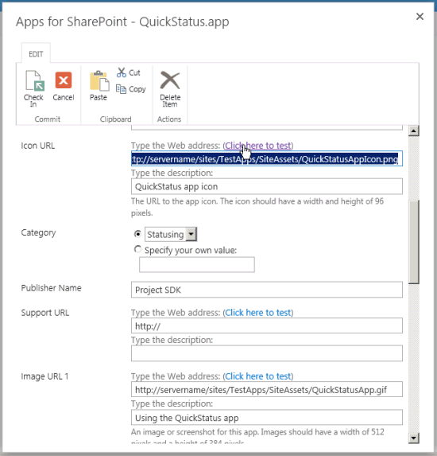
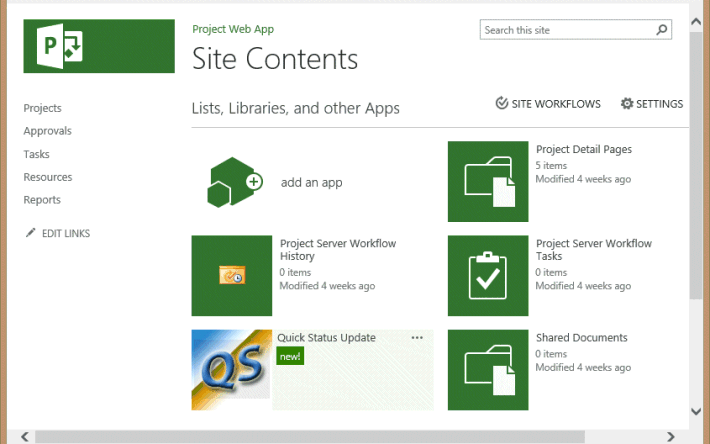

# <a name="create-a-sharepoint-hosted-project-server-add-in"></a><span data-ttu-id="7398c-103">Project Server の SharePoint でホストされているアドインの作成します。</span><span class="sxs-lookup"><span data-stu-id="7398c-103">Create a SharePoint-hosted Project Server add-in</span></span>

<span data-ttu-id="7398c-104">3 種類のアプリケーションのオンライン プロジェクト (autohosted、プロバイダーによってホストされ、SharePoint でホストされている) を作成することができる SharePoint によってホストされるアプリケーションの作成および展開する最も簡単です。</span><span class="sxs-lookup"><span data-stu-id="7398c-104">Of the three types of apps that you can create for Project Online (autohosted, provider-hosted, and SharePoint-hosted), the SharePoint-hosted app is the simplest to create and deploy.</span></span> <span data-ttu-id="7398c-105">SharePoint によってホストされるアプリケーションは、OAuth 認証を必要とは Azure を使用して、やではなくプロバイダーでホストされているリソースのローカル サイトのメンテナンスを必要とします。</span><span class="sxs-lookup"><span data-stu-id="7398c-105">A SharePoint-hosted app does not require OAuth authentication, and does not use Azure or require maintenance of a local site for the provider-hosted resources.</span></span> <span data-ttu-id="7398c-106">Visual Studio で**SharePoint 2013 のアプリケーション**テンプレートは、発行し、Office ストアで販売または SharePoint 上のプライベート アプリケーション カタログに配置できるアプリケーションを開発するための便利なフレームワークです。</span><span class="sxs-lookup"><span data-stu-id="7398c-106">The **App for SharePoint 2013** template in Visual Studio is a convenient framework for developing apps that can be published and sold in the Office Store or deployed to a private app catalog on SharePoint.</span></span> 
  
<span data-ttu-id="7398c-107">プロジェクトでは、状態管理とは、チーム メンバーことができますを使用してタスク] ページで、Project Web App で費やされたタスクの作業週の各曜日の就業時間の数など、割り当てられたタスクのステータスを送信するプロセス。</span><span class="sxs-lookup"><span data-stu-id="7398c-107">In Project, statusing is a process where a team member can use the Tasks page in Project Web App to submit the status of an assigned task, such as the number of hours worked each day of a week spent working on the task.</span></span> <span data-ttu-id="7398c-108">割り当て所有者 (通常はプロジェクト マネージャー) では、承認したり、ステータスを拒否することができます。</span><span class="sxs-lookup"><span data-stu-id="7398c-108">The assignment owner (usually the project manager) can approve or reject the status.</span></span> <span data-ttu-id="7398c-109">ステータスが承認されると、プロジェクトには、スケジュールが再計算されます。</span><span class="sxs-lookup"><span data-stu-id="7398c-109">When the status is approved, Project recalculates the schedule.</span></span> <span data-ttu-id="7398c-110">**QuickStatus**アプリケーションでは、割り当てられたタスク、ユーザーは迅速に達成率を更新、承認のための選択した割り当ての状態を送信する場所を表示します。</span><span class="sxs-lookup"><span data-stu-id="7398c-110">The **QuickStatus** app displays assigned tasks, where the user can quickly update percent complete and submit status of the selected assignments for approval.</span></span> <span data-ttu-id="7398c-111">Project Web App の [タスク] ページには、多くの機能が、 **QuickStatus**アプリケーションは、シンプルなインターフェイスを提供する例です。</span><span class="sxs-lookup"><span data-stu-id="7398c-111">Although the Tasks page in Project Web App has much more functionality, the **QuickStatus** app is an example that provides a simplified interface.</span></span> 
  
<span data-ttu-id="7398c-112">**QuickStatus**アプリケーションは、開発者のためのサンプル実稼働環境で使用するためのものではありません。</span><span class="sxs-lookup"><span data-stu-id="7398c-112">The **QuickStatus** app is a sample for developers; it is not intended for use in a production environment.</span></span> <span data-ttu-id="7398c-113">主な目的では、プロジェクト オンライン、完全に機能の状態を管理アプリケーションを作成しないようにアプリケーション開発の例を示します。</span><span class="sxs-lookup"><span data-stu-id="7398c-113">The primary purpose is to show an example of app development for Project Online, not to create a fully functional statusing app.</span></span> <span data-ttu-id="7398c-114">状態管理により、[次のステップ](#pj15_StatusingApp_NextSteps)の推奨事項を参照してください。</span><span class="sxs-lookup"><span data-stu-id="7398c-114">For a better approach to statusing, see the recommendation in [Next steps](#pj15_StatusingApp_NextSteps).</span></span>
  
<span data-ttu-id="7398c-115">状態管理に関する一般的な情報は、[タスクの進捗状況](https://support.office.com/article/Find-information-about-Project-Server-2013-8b08a414-15a7-4076-b2db-c90d0214ea7f?ui=en-US&rs=en-US&ad=US#BKMK_TaskProgress)を参照してください。</span><span class="sxs-lookup"><span data-stu-id="7398c-115">For general information about statusing, see [Task progress](https://support.office.com/article/Find-information-about-Project-Server-2013-8b08a414-15a7-4076-b2db-c90d0214ea7f?ui=en-US&rs=en-US&ad=US#BKMK_TaskProgress).</span></span> <span data-ttu-id="7398c-116">Project Server の SharePoint 用のアドインを開発する方法の詳細については、 [SharePoint のアドイン](http://msdn.microsoft.com/ja-jp/library/jj163230.aspx)を参照してください。</span><span class="sxs-lookup"><span data-stu-id="7398c-116">For more information about developing add-ins for SharePoint and Project Server, see [SharePoint Add-ins](http://msdn.microsoft.com/ja-jp/library/jj163230.aspx).</span></span>

<span data-ttu-id="7398c-117"><a name="pj15_StatusingApp_Prerequisites"> </a></span><span class="sxs-lookup"><span data-stu-id="7398c-117"></span></span>

## <a name="prerequisites-for-creating-an-app-for-project-server-2013"></a><span data-ttu-id="7398c-118">Project Server 2013 のアプリケーションを作成するための前提条件</span><span class="sxs-lookup"><span data-stu-id="7398c-118">Prerequisites for creating an app for Project Server 2013</span></span>

<span data-ttu-id="7398c-119">オンライン プロジェクトを Project Server 2013 の設置型インストールに展開できる比較的単純なアプリケーションを開発するには、オンラインの開発環境を提供する、Napa 使用できます。</span><span class="sxs-lookup"><span data-stu-id="7398c-119">To develop relatively simple apps that can be deployed to Project Online or to an on-premises installation of Project Server 2013, you can use the Napa, which provide an online development environment.</span></span> <span data-ttu-id="7398c-120">Project Web App のリボンと、開発時のデバッグを容易に変更することのより複雑なアプリケーションは、Visual Studio 2012 のまたは Visual Studio の 2013 を使用することができます。</span><span class="sxs-lookup"><span data-stu-id="7398c-120">For more complex apps, modifying the Project Web App ribbon, and easier debugging during development, you can use Visual Studio 2012 or Visual Studio 2013.</span></span> <span data-ttu-id="7398c-121">たとえば、オンプレミスのインストールは、下書きデータ テーブルの変更を Project Server データベース内を手動で確認できます。</span><span class="sxs-lookup"><span data-stu-id="7398c-121">For example, with an on-premises installation, you can manually check the Drafts datatables for changes in the Project Server database.</span></span> <span data-ttu-id="7398c-122">この資料では、Visual Studio でアプリケーション開発を行う方法を説明します。</span><span class="sxs-lookup"><span data-stu-id="7398c-122">This article shows how to do app development with Visual Studio.</span></span>
  
<span data-ttu-id="7398c-123">Visual Studio でプロジェクトのサーバー アプリケーションの開発には、次の必要があります。</span><span class="sxs-lookup"><span data-stu-id="7398c-123">Development of Project Server apps with Visual Studio requires the following:</span></span>
  
- <span data-ttu-id="7398c-p106">使用するローカルの開発用コンピューターに最新のサービス パックと Windows 更新プログラムをインストールしてあることを確認します。オペレーティング システムは、Windows 7、Windows 8、Windows Server 2008、Windows Server 2012 のいずれでもかまいません。</span><span class="sxs-lookup"><span data-stu-id="7398c-p106">Ensure that you have installed the most recent service packs and Windows updates on your local development computer. The operating system can be Windows 7, Windows 8, Windows Server 2008, or Windows Server 2012.</span></span>
    
- <span data-ttu-id="7398c-126">SharePoint Server 2013 と Project Server 2013 をインストールすると、アプリケーションの分離とアプリケーションの sideloading のコンピューターに構成されているコンピューターが必要です。</span><span class="sxs-lookup"><span data-stu-id="7398c-126">You must have a computer that has SharePoint Server 2013 and Project Server 2013 installed, where the computer is configured for app isolation and sideloading of apps.</span></span> <span data-ttu-id="7398c-127">Sideloading は、一時的にデバッグするようにアプリケーションをインストールするのには Visual Studio を使用できます。</span><span class="sxs-lookup"><span data-stu-id="7398c-127">Sideloading enables Visual Studio to temporarily install the app for debugging.</span></span> <span data-ttu-id="7398c-128">Project Server の SharePoint の設置型インストールを使用することができます。</span><span class="sxs-lookup"><span data-stu-id="7398c-128">You can use an on-premises installation of SharePoint and Project Server.</span></span> <span data-ttu-id="7398c-129">詳細については、 [SharePoint のアプリケーションの設置型開発環境のセットアップ](http://msdn.microsoft.com/ja-jp/library/fp179923%28Office.15%29.aspx)を参照してください。</span><span class="sxs-lookup"><span data-stu-id="7398c-129">For more information, see [Set up an on-premises development environment for apps for SharePoint](http://msdn.microsoft.com/ja-jp/library/fp179923%28Office.15%29.aspx).</span></span>
    
   > [!NOTE]
   > <span data-ttu-id="7398c-130">設置型インストールを分離されたアプリケーション ドメイン*の前に*企業アプリケーションのカタログを作成するを構成します。</span><span class="sxs-lookup"><span data-stu-id="7398c-130">For an on-premises installation, configure an isolated app domain  *before*  you create a corporate app catalog.</span></span> 
  
- <span data-ttu-id="7398c-131">開発用コンピューターにインストールされている Visual Studio 2012 の Office 開発ツールにはリモート コンピューターができます。</span><span class="sxs-lookup"><span data-stu-id="7398c-131">The development computer can be a remote computer that has Office Developer Tools for Visual Studio 2012 installed.</span></span> <span data-ttu-id="7398c-132">最新のバージョンがインストールされていることを確認します。[Office および SharePoint 用アプリをダウンロード](http://msdn.microsoft.com/ja-jp/office/apps/fp123627.aspx)するは、"*ツール*"を参照してください。</span><span class="sxs-lookup"><span data-stu-id="7398c-132">Ensure that you have installed the most recent version; see the  *Tools*  section of the [Apps for Office and SharePoint downloads](http://msdn.microsoft.com/ja-jp/office/apps/fp123627.aspx).</span></span>
    
- <span data-ttu-id="7398c-133">Project Web App インスタンスを使用する開発用のテストは、ブラウザーでアクセスできることを確認します。</span><span class="sxs-lookup"><span data-stu-id="7398c-133">Verify that the Project Web App instance you will be using for development and testing is accessible in the browser.</span></span>
    
<span data-ttu-id="7398c-134">オンライン ツールを使用する方法の詳細については、 [Office 365 で SharePoint 用アプリの開発環境の設定](http://msdn.microsoft.com/ja-jp/library/fp161179.aspx)を参照してください。</span><span class="sxs-lookup"><span data-stu-id="7398c-134">For information about using the online tools, see [Set up an environment for developing apps for SharePoint on Office 365](http://msdn.microsoft.com/ja-jp/library/fp161179.aspx).</span></span> <span data-ttu-id="7398c-135">オンライン ツールを使用する Project Server の単純なアプリケーションの構築のチュートリアルは、EPMSource のブログ シリーズは、[最初、プロジェクトのサーバー アプリケーションを構築する](http://epmsource.com/2012/11/20/building-your-first-project-server-app-part-zerothe-introduction/)を参照してください。</span><span class="sxs-lookup"><span data-stu-id="7398c-135">For a walkthrough of building a simple app for Project Server that uses the online tools, see the EPMSource blog series, [Building your first Project Server app](http://epmsource.com/2012/11/20/building-your-first-project-server-app-part-zerothe-introduction/).</span></span>

<span data-ttu-id="7398c-136"><a name="pj15_StatusingApp_UsingVisualStudio"> </a></span><span class="sxs-lookup"><span data-stu-id="7398c-136"></span></span>

## <a name="using-visual-studio-to-create-a-project-server-app"></a><span data-ttu-id="7398c-137">Visual Studio を使用して Project Server アプリケーションを作成するには</span><span class="sxs-lookup"><span data-stu-id="7398c-137">Using Visual Studio to create a Project Server app</span></span>

<span data-ttu-id="7398c-138">Visual Studio 2012 ののための Office 開発ツールには、Project Server 2013 で使用できる SharePoint アプリケーションのテンプレートが含まれています。</span><span class="sxs-lookup"><span data-stu-id="7398c-138">Office Developer Tools for Visual Studio 2012 includes a template for SharePoint apps that can be used with Project Server 2013.</span></span> <span data-ttu-id="7398c-139">アプリケーション ソリューションを作成するときに、ソリューションには、カスタム コードに次のファイルが含まれています。</span><span class="sxs-lookup"><span data-stu-id="7398c-139">When you create an app solution, the solution includes the following files for your custom code:</span></span>
  
- <span data-ttu-id="7398c-140">**AppManifest.xml**には、アプリケーションのタイトル、アクセス許可要求のスコープ、およびその他のプロパティの設定が含まれています。</span><span class="sxs-lookup"><span data-stu-id="7398c-140">**AppManifest.xml** includes settings for the app title, permission request scope, and other properties.</span></span> <span data-ttu-id="7398c-141">手順 1 では、マニフェスト デザイナーを使用してプロパティを設定する手順が含まれています。</span><span class="sxs-lookup"><span data-stu-id="7398c-141">Procedure 1 includes steps to set the properties by using the Manifest Designer.</span></span> 
    
- <span data-ttu-id="7398c-142">ページのフォルダーには、 **Default.aspx**は、アプリケーションのメイン ページです。</span><span class="sxs-lookup"><span data-stu-id="7398c-142">**Default.aspx** in the Pages folder is the main page of the app.</span></span> <span data-ttu-id="7398c-143">手順 2 では、 **QuickStatus**アプリケーションに HTML5 のコンテンツを追加する方法を説明します。</span><span class="sxs-lookup"><span data-stu-id="7398c-143">Procedure 2 shows how to add HTML5 content for the **QuickStatus** app.</span></span> 
    
- <span data-ttu-id="7398c-144">**App.js**を [スクリプト] フォルダーは、カスタムの JavaScript コードのプライマリ ファイルです。</span><span class="sxs-lookup"><span data-stu-id="7398c-144">**App.js** in the Scripts folder is the primary file for the custom JavaScript code.</span></span> <span data-ttu-id="7398c-145">手順 3 では、 **QuickStatus**アプリケーションの JavaScript コードについて説明します。</span><span class="sxs-lookup"><span data-stu-id="7398c-145">Procedure 3 explains the JavaScript code for the **QuickStatus** app.</span></span> 
    
   <span data-ttu-id="7398c-146">JQuery ベースのグリッドまたは日付の選択などの商用のコントロールを追加する場合は、Default.aspx ファイルに追加の JavaScript ファイルへの参照を追加できます。</span><span class="sxs-lookup"><span data-stu-id="7398c-146">If you add commercial controls such as a jQuery-based grid or date picker, you can add references to additional JavaScript files in the Default.aspx file.</span></span>
    
- <span data-ttu-id="7398c-147">コンテンツ フォルダー内の**App.css**は、CSS3 のユーザー設定のスタイルの主要なファイルです。</span><span class="sxs-lookup"><span data-stu-id="7398c-147">**App.css** in the Content folder is the primary file for custom CSS3 styles.</span></span> <span data-ttu-id="7398c-148">手順 2 と手順 3 には、 **QuickStatus**アプリケーション用のカスケード スタイル シート (CSS) スタイルに関する情報が含まれます。</span><span class="sxs-lookup"><span data-stu-id="7398c-148">Procedure 2 and Procedure 3 include information about cascading style sheets (CSS) styles for the **QuickStatus** app.</span></span> <span data-ttu-id="7398c-149">Default.aspx ファイルに追加の CSS ファイルへの参照を追加できます。</span><span class="sxs-lookup"><span data-stu-id="7398c-149">You can add references to additional CSS files in the Default.aspx file.</span></span> 
    
- <span data-ttu-id="7398c-150">[Images] フォルダー内の**AppIcon.png**は、アプリを Office ストアまたはアプリケーションのカタログに表示する 96 x 96 のアイコンです。</span><span class="sxs-lookup"><span data-stu-id="7398c-150">**AppIcon.png** in the Images folder is the 96 x 96 icon that the app displays in the Office Store or the app catalog.</span></span> 
    
<span data-ttu-id="7398c-151">Project Web App のリボンを変更するには、リボンのカスタム アクションを追加できます。</span><span class="sxs-lookup"><span data-stu-id="7398c-151">To modify the Project Web App ribbon, you can add a ribbon custom action.</span></span> <span data-ttu-id="7398c-152">[QuickStatus アプリケーションのサンプル コード](#pj15_StatusingApp_Example)のセクションには、更新の Default.aspx、App.js、App.css、Elements.xml を AppManifest.xml ファイルの完全なコードが含まれています。</span><span class="sxs-lookup"><span data-stu-id="7398c-152">The [Example code for the QuickStatus app](#pj15_StatusingApp_Example) section includes the complete code for the modified Default.aspx, App.js, App.css, Elements.xml, and AppManifest.xml files.</span></span> 
  
### <a name="procedure-1-to-create-an-app-project-in-visual-studio"></a><span data-ttu-id="7398c-153">手順 1.</span><span class="sxs-lookup"><span data-stu-id="7398c-153">Procedure 1.</span></span> <span data-ttu-id="7398c-154">Visual Studio でアプリケーション プロジェクトを作成するには</span><span class="sxs-lookup"><span data-stu-id="7398c-154">To create an app project in Visual Studio</span></span>

1. <span data-ttu-id="7398c-155">管理者は、Visual Studio 2012 を実行し、[開始] ページで、**新しいプロジェクト**を選択します。</span><span class="sxs-lookup"><span data-stu-id="7398c-155">Run Visual Studio 2012 as an administrator, and then select **New Project** on the Start page.</span></span> 
    
2. <span data-ttu-id="7398c-156">**新しいプロジェクト**ダイアログ ボックスで、**テンプレート**、 **Visual C#**、および**Office または SharePoint**ノードを展開し、**アプリケーション**します。</span><span class="sxs-lookup"><span data-stu-id="7398c-156">In the **New Project** dialog box, expand the **Templates**, **Visual C#**, and **Office/SharePoint** nodes, and then select **Apps**.</span></span> <span data-ttu-id="7398c-157">上部 (図 1 を参照してください)、中央のウィンドウと [ **SharePoint 2013 のアプリケーション**のターゲット フレームワーク ドロップダウン リストで既定の **.NET Framework 4.5**を使用します。</span><span class="sxs-lookup"><span data-stu-id="7398c-157">Use the default **.NET Framework 4.5** in the target framework drop-down list at the top of the center pane, and then select **App for SharePoint 2013** (see Figure 1).</span></span> 
    
3. <span data-ttu-id="7398c-158">[**名**] フィールドで、QuickStatus を入力するアプリケーションを保存し、 **[ok]** を選択し、場所を参照します。</span><span class="sxs-lookup"><span data-stu-id="7398c-158">In the **Name** field, type QuickStatus, browse to the location where you want to save the app, and then choose **OK**.</span></span>
    
   <span data-ttu-id="7398c-159">**図 1 です。プロジェクトを作成する Visual Studio のサーバー アプリケーション**</span><span class="sxs-lookup"><span data-stu-id="7398c-159">**Figure 1. Creating a Project Server app in Visual Studio**</span></span>

   <span data-ttu-id="7398c-160"></span><span class="sxs-lookup"><span data-stu-id="7398c-160"></span></span>
  
4. <span data-ttu-id="7398c-161">**SharePoint の新しいアプリケーション**] ダイアログ ボックスで、次の 3 つのフィールドに入力します。</span><span class="sxs-lookup"><span data-stu-id="7398c-161">In the **New app for SharePoint** dialog box, fill in the following three fields:</span></span> 
    
   - <span data-ttu-id="7398c-162">上部のテキスト ボックスで、Project Web App で表示するアプリケーションの名前を入力します。</span><span class="sxs-lookup"><span data-stu-id="7398c-162">In the top text box, type the name that you want the app to display in Project Web App.</span></span> <span data-ttu-id="7398c-163">簡易ステータスの更新を入力します。</span><span class="sxs-lookup"><span data-stu-id="7398c-163">For example, type Quick Status Update.</span></span>
    
   - <span data-ttu-id="7398c-164">デバッグに使用するサイトでは、Project Web App インスタンスの URL を入力します。</span><span class="sxs-lookup"><span data-stu-id="7398c-164">For the site to use for debugging, type the URL of the Project Web App instance.</span></span> <span data-ttu-id="7398c-165">たとえば、 `https://ServerName/ProjectServerName` (_サーバー名_と置き換える_ProjectServerName_独自の値)、[**検証**] を選択します。</span><span class="sxs-lookup"><span data-stu-id="7398c-165">For example, type  `https://ServerName/ProjectServerName` (replacing  _ServerName_ and  _ProjectServerName_ with your own values), and then choose **Validate**.</span></span> <span data-ttu-id="7398c-166">すべてがうまくいけば、Visual Studio では**正常に接続**が表示されます。</span><span class="sxs-lookup"><span data-stu-id="7398c-166">If all goes well, Visual Studio shows **Connection successful**.</span></span> <span data-ttu-id="7398c-167">エラー メッセージが表示される場合は、Project Web App の URL が正しいことと、アプリケーションの分離とアプリケーションの sideloading のプロジェクトのサーバー コンピューターが構成されているを確認します。</span><span class="sxs-lookup"><span data-stu-id="7398c-167">If you get an error message, ensure that the Project Web App URL is correct and that the Project Server computer is configured for app isolation and sideloading of apps.</span></span> <span data-ttu-id="7398c-168">詳細については、 [Project Server 2013 のアプリケーションを作成するための前提条件](#pj15_StatusingApp_Prerequisites)」を参照してください。</span><span class="sxs-lookup"><span data-stu-id="7398c-168">For more information, see the [Prerequisites for creating an app for Project Server 2013](#pj15_StatusingApp_Prerequisites) section.</span></span> 
    
   - <span data-ttu-id="7398c-169">**SharePoint にアプリケーションをホストする方法**」ドロップ ダウン リスト、 **SharePoint でホストされている**を選択します。</span><span class="sxs-lookup"><span data-stu-id="7398c-169">In the **How do you want to host your app for SharePoint** drop-down list, choose **SharePoint-hosted**.</span></span>
    
   > [!CAUTION]
   > <span data-ttu-id="7398c-170">Visual Studio がソリューションの 2 つのプロジェクトを作成する**プロバイダーによってホストされる**既定のプロジェクトの種類を誤って選択した場合: **QuickStatus**プロジェクトと**QuickStatusWeb**プロジェクト。</span><span class="sxs-lookup"><span data-stu-id="7398c-170">If you choose the default **Provider-hosted** project type by mistake, Visual Studio creates two projects in the solution: a **QuickStatus** project and a **QuickStatusWeb** project.</span></span> <span data-ttu-id="7398c-171">2 つのプロジェクトを表示する場合は、そのソリューションの削除をやり直します。</span><span class="sxs-lookup"><span data-stu-id="7398c-171">If you see two projects, delete that solution and start again.</span></span> 
  
5. <span data-ttu-id="7398c-172">**QuickStatus**ソリューション、プロジェクトの**QuickStatus** 、および既定のファイルを作成するのには **[ok]** を選択します。</span><span class="sxs-lookup"><span data-stu-id="7398c-172">Choose **OK** to create the **QuickStatus** solution, **QuickStatus** project, and default files.</span></span> 
    
6. <span data-ttu-id="7398c-173">マニフェストのデザイナー ビューを開きます (たとえば、AppManifest.xml ファイルをダブルクリックします)。</span><span class="sxs-lookup"><span data-stu-id="7398c-173">Open the Manifest Designer view (for example, double-click the AppManifest.xml file).</span></span> <span data-ttu-id="7398c-174">[**全般**] タブで、**タイトル**] テキスト ボックスは、手順 4 で入力したアプリケーション名を表示する必要があります。</span><span class="sxs-lookup"><span data-stu-id="7398c-174">On the **General** tab, the **Title** text box should show the app name that you typed in step 4.</span></span> <span data-ttu-id="7398c-175">アプリケーションの次のアクセス許可要求を追加するのには [**アクセス許可**] タブを選択 (図 2 を参照してください)。</span><span class="sxs-lookup"><span data-stu-id="7398c-175">Choose the **Permissions** tab to add the following permission requests for the app (see Figure 2):</span></span> 
    
   - <span data-ttu-id="7398c-176">**アクセス許可の要求**] ボックスの一覧で、[**スコープ**] 列の最初の行では、ドロップ ダウン リストで**状態管理**を選択します。</span><span class="sxs-lookup"><span data-stu-id="7398c-176">In the first row of the **Permission requests** list, in the **Scope** column, choose **Statusing** in the drop-down list.</span></span> <span data-ttu-id="7398c-177">[**アクセス許可**] 列には、 **SubmitStatus**を選択します。</span><span class="sxs-lookup"><span data-stu-id="7398c-177">In the **Permission** column, choose **SubmitStatus**.</span></span>
    
   - <span data-ttu-id="7398c-178">**スコープ**は、**複数のプロジェクト****アクセス許可**は、**読み取り**の行を追加します。</span><span class="sxs-lookup"><span data-stu-id="7398c-178">Add a row where the **Scope** is **Multiple Projects** and the **Permission** is **Read**.</span></span>
    
   <span data-ttu-id="7398c-179">**図 2 になります。状態管理アプリケーションのアクセス許可のスコープを設定します。**</span><span class="sxs-lookup"><span data-stu-id="7398c-179">**Figure 2. Setting the permission scope for a statusing app**</span></span>

   <span data-ttu-id="7398c-180"></span><span class="sxs-lookup"><span data-stu-id="7398c-180"></span></span>
  
<span data-ttu-id="7398c-181">**QuickStatus**アプリケーションは、複数のプロジェクトからそのユーザーの割り当てを読み取り、割り当ての達成率を変更および更新プログラムを送信する Project Web App のユーザーを有効にします。</span><span class="sxs-lookup"><span data-stu-id="7398c-181">The **QuickStatus** app enables a Project Web App user to read assignments for that user from multiple projects, change the assignment percent complete, and submit the update.</span></span> <span data-ttu-id="7398c-182">その他のアクセス許可要求スコープ ボックスの一覧を図 2 に示すようには、このアプリケーションに必要ではありません。</span><span class="sxs-lookup"><span data-stu-id="7398c-182">The other permission request scopes shown in the drop-down list in Figure 2 are not required for this app.</span></span> <span data-ttu-id="7398c-183">アクセス許可要求のスコープは、アプリケーションがユーザーの代わりに要求されるアクセス許可です。</span><span class="sxs-lookup"><span data-stu-id="7398c-183">The permission request scopes are the permissions that the app requests on behalf of the user.</span></span> <span data-ttu-id="7398c-184">ユーザーは、Project Web App でこれらのアクセス許可があるない、アプリケーションは実行されません。</span><span class="sxs-lookup"><span data-stu-id="7398c-184">If the user does not have those permissions in Project Web App, the app does not run.</span></span> <span data-ttu-id="7398c-185">アプリケーションなどその他の SharePoint アクセス許可レベルのアクセス許可要求の複数のスコープを持つことができますが、のみ、最低限必要なアプリケーション機能の必要があります。</span><span class="sxs-lookup"><span data-stu-id="7398c-185">An app can have multiple permission request scopes, including those for other SharePoint permissions, but should have only the minimum necessary for the app functionality.</span></span> <span data-ttu-id="7398c-186">Project Server に関連付けられているアクセス許可要求の範囲を以下に示します。</span><span class="sxs-lookup"><span data-stu-id="7398c-186">Following are the permission request scopes that are related to Project Server:</span></span> 

- <span data-ttu-id="7398c-187">**エンタープライズ リソース**: リソース マネージャー アクセス許可の [その他の Project Web App のユーザーについての情報を読み書きします。</span><span class="sxs-lookup"><span data-stu-id="7398c-187">**Enterprise Resources**: Resource manager permissions, to read or write information about other Project Web App users.</span></span>
    
- <span data-ttu-id="7398c-188">**複数のプロジェクト**: 読み取りまたは書き込みを複数のプロジェクト、ユーザーが要求するアクセス許可を持っています。</span><span class="sxs-lookup"><span data-stu-id="7398c-188">**Multiple Projects**: Read or write to more than one project, where the user has the permissions requested.</span></span>
    
- <span data-ttu-id="7398c-189">**Project Server**: アプリケーションのユーザーが Project Web App の管理者権限を持っている必要があります。</span><span class="sxs-lookup"><span data-stu-id="7398c-189">**Project Server**: Requires the app user to have administrator permissions for Project Web App.</span></span>
    
- <span data-ttu-id="7398c-190">**レポート**: (Project Web App にのみログオンのアクセス許可が必要です)、Project Web App の**ProjectData**の OData サービスを参照します。</span><span class="sxs-lookup"><span data-stu-id="7398c-190">**Reporting**: Read the **ProjectData** OData service for Project Web App (requires only log on permission for Project Web App).</span></span> 
    
- <span data-ttu-id="7398c-191">**1 つのプロジェクト**: 読み取りまたは書き込みをユーザーが要求するアクセス許可を持っているプロジェクト。</span><span class="sxs-lookup"><span data-stu-id="7398c-191">**Single Project**: Read or write to a project where the user has the permissions requested.</span></span>
    
- <span data-ttu-id="7398c-192">**状態管理**: 勤務時間、パーセント完了、および新規の割り当て、割り当ての状態の更新を送信します。</span><span class="sxs-lookup"><span data-stu-id="7398c-192">**Statusing**: Submit updates for status of assignments, such as times worked, percent complete, and new assignments.</span></span>
    
- <span data-ttu-id="7398c-193">**ワークフロー**: ワークフローのアクセス許可を引き上げてアプリケーションが実行されますユーザーが Project Server のワークフローを実行する権限を持っている場合。</span><span class="sxs-lookup"><span data-stu-id="7398c-193">**Workflow**: If the user has permission to run Project Server workflows, the app then runs with elevated permissions for the workflow.</span></span>
    
<span data-ttu-id="7398c-194">Project Server 2013 のためのアクセス許可要求のスコープの詳細については、 [Project 2013 の開発者用の更新プログラム](updates-for-developers-in-project-2013.md)と[SharePoint 2013 でのアプリケーションのアクセス許可](http://msdn.microsoft.com/library/fp142383.aspx)で*アプリケーションのプロジェクト*を参照してください。</span><span class="sxs-lookup"><span data-stu-id="7398c-194">For more information about permission request scopes for Project Server 2013, see the  *Project apps*  section in [Updates for developers in Project 2013](updates-for-developers-in-project-2013.md) and [App permissions in SharePoint 2013](http://msdn.microsoft.com/library/fp142383.aspx).</span></span>


<span data-ttu-id="7398c-195"><a name="pj15_StatusingApp_HTML"> </a></span><span class="sxs-lookup"><span data-stu-id="7398c-195"></span></span>

### <a name="creating-the-html-content-for-the-quickstatus-app"></a><span data-ttu-id="7398c-196">QuickStatus アプリケーションのコンテンツの HTML を作成します。</span><span class="sxs-lookup"><span data-stu-id="7398c-196">Creating the HTML content for the QuickStatus app</span></span>

<span data-ttu-id="7398c-197">HTML コンテンツのコーディングを開始する前に、ユーザー インターフェイスと (図 3 では、完成したページの例を示しています)、QuickStatus アプリケーションのユーザー エクスペリエンスをデザインします。</span><span class="sxs-lookup"><span data-stu-id="7398c-197">Before you start coding the HTML content, design the user interface and user experience for the QuickStatus app (Figure 3 shows an example of the completed page).</span></span> <span data-ttu-id="7398c-198">設計では、HTML コードと対話する JavaScript 関数の概要を含めることも。</span><span class="sxs-lookup"><span data-stu-id="7398c-198">A design can also include an outline of the JavaScript functions that interact with the HTML code.</span></span> <span data-ttu-id="7398c-199">全般については、 [SharePoint 2013 でのアプリケーションのユーザー エクスペリエンスのデザイン](http://msdn.microsoft.com/library/fp179934.aspx)を参照してください。</span><span class="sxs-lookup"><span data-stu-id="7398c-199">For general information, see [UX design for apps in SharePoint 2013](http://msdn.microsoft.com/library/fp179934.aspx).</span></span>
  
<span data-ttu-id="7398c-200">**図 3 です。QuickStatus アプリケーション ページのデザイン**</span><span class="sxs-lookup"><span data-stu-id="7398c-200">**Figure 3. Design of the QuickStatus app page**</span></span>

<span data-ttu-id="7398c-201"></span><span class="sxs-lookup"><span data-stu-id="7398c-201"></span></span>
  
<span data-ttu-id="7398c-202">アプリケーションでは、AppManifest.xml に**Title**要素の値は、一番上に表示名を示しています。</span><span class="sxs-lookup"><span data-stu-id="7398c-202">The app shows the display name at the top, which is the value of the **Title** element in AppManifest.xml.</span></span> 
  
<span data-ttu-id="7398c-203">既定では、ページは、HTML5 を使用します。</span><span class="sxs-lookup"><span data-stu-id="7398c-203">By default, the page uses HTML5.</span></span> <span data-ttu-id="7398c-204">以下は、 **QuickStatus**アプリケーションがページの本文に含まれているメインの UI オブジェクトの標準的な HTML 要素です。</span><span class="sxs-lookup"><span data-stu-id="7398c-204">Following are the standard HTML elements for the main UI objects that the **QuickStatus** app contains in the body of the page:</span></span> 
  
- <span data-ttu-id="7398c-205">**フォーム**要素には、すべての他の UI 要素が含まれています。</span><span class="sxs-lookup"><span data-stu-id="7398c-205">A **form** element contains all of the other UI elements.</span></span> 
    
- <span data-ttu-id="7398c-206">**Fieldset**要素のコンテナーとの割り当てのテーブルの枠線を作成します。**凡例**の子要素では、コンテナーのラベルを提供します。</span><span class="sxs-lookup"><span data-stu-id="7398c-206">A **fieldset** element creates a container and border for the table of assignments; the child **legend** element provides a label for the container.</span></span> 
    
- <span data-ttu-id="7398c-207">**Table**要素には、キャプションとテーブル ヘッダーのみが含まれています。</span><span class="sxs-lookup"><span data-stu-id="7398c-207">A **table** element includes a caption and only a table header.</span></span> <span data-ttu-id="7398c-208">JavaScript 関数は、テーブルのキャプションを変更し、割り当ての行を追加します。</span><span class="sxs-lookup"><span data-stu-id="7398c-208">JavaScript functions change the table caption and add rows for the assignments.</span></span> 
    
   > [!NOTE]
   > <span data-ttu-id="7398c-209">ページングと並べ替えを簡単に追加するに本番アプリケーションが可能性がありますを使用して、jQuery ベースの商用グリッド コントロール テーブルの代わりにします。</span><span class="sxs-lookup"><span data-stu-id="7398c-209">To easily add paging and sorting, a production app would probably use a commercial jQuery-based grid control instead of a table.</span></span> 
  
   <span data-ttu-id="7398c-210">テーブルには、プロジェクト名、チェック ボックスをオン、実績作業時間、達成完了、残存作業時間のタスク名の列が含まれていて、割り当ての終了日。</span><span class="sxs-lookup"><span data-stu-id="7398c-210">The table includes columns for the project name, task name with a check box, actual work, percent complete, remaining work, and the assignment finish date.</span></span> <span data-ttu-id="7398c-211">JavaScript 関数を作成します] チェック ボックスとテキスト入力フィールド、% の各タスクの完了します。</span><span class="sxs-lookup"><span data-stu-id="7398c-211">JavaScript functions create the check box and the text input field for the percent complete of each task.</span></span>
    
- <span data-ttu-id="7398c-212">テキスト ボックスの**入力**要素は、選択されているすべての割り当ての完了率を設定します。</span><span class="sxs-lookup"><span data-stu-id="7398c-212">An **input** element for a text box sets percent complete for all selected assignments.</span></span> 
    
- <span data-ttu-id="7398c-213">**ボタン**要素は、状態の変更を送信します。</span><span class="sxs-lookup"><span data-stu-id="7398c-213">A **button** element submits the status changes.</span></span> 
    
- <span data-ttu-id="7398c-214">**ボタン**要素は、ページを更新します。</span><span class="sxs-lookup"><span data-stu-id="7398c-214">A **button** element refreshes the page.</span></span> 
    
- <span data-ttu-id="7398c-215">**ボタン**要素は、アプリケーションを終了して、Project Web App の [タスク] ページに戻ります。</span><span class="sxs-lookup"><span data-stu-id="7398c-215">A **button** element exits the app and returns to the Tasks page in Project Web App.</span></span> 
    
<span data-ttu-id="7398c-216">下部のテキスト ボックスとボタン要素は、 **div**要素内では CSS 位置と、UI オブジェクトの外観を容易に管理できるようにします。</span><span class="sxs-lookup"><span data-stu-id="7398c-216">The bottom text box and button elements are within **div** elements, so that CSS can easily manage the position and appearance of the UI objects.</span></span> <span data-ttu-id="7398c-217">JavaScript 関数は、成功の結果が含まれるページの下部または状態の更新の失敗時に段落を追加します。</span><span class="sxs-lookup"><span data-stu-id="7398c-217">A JavaScript function adds a paragraph at the bottom of the page that contains results for success or failure of the status update.</span></span> 
  
### <a name="procedure-2-to-create-the-html-content"></a><span data-ttu-id="7398c-218">手順 2.</span><span class="sxs-lookup"><span data-stu-id="7398c-218">Procedure 2.</span></span> <span data-ttu-id="7398c-219">HTML のコンテンツを作成するには</span><span class="sxs-lookup"><span data-stu-id="7398c-219">To create the HTML content</span></span>

1. <span data-ttu-id="7398c-220">Visual Studio は、Default.aspx ファイルを開きます。</span><span class="sxs-lookup"><span data-stu-id="7398c-220">In Visual Studio, open the Default.aspx file.</span></span>
    
   <span data-ttu-id="7398c-221">ファイルには、2 つの**asp: コンテンツ**要素が含まれています。: 要素を、 `ContentPlaceHolderID="PlaceHolderAdditionalPageHead"` 、ページ ヘッダー、および要素内で属性を追加、`ContentPlaceHolderID="PlaceHolderMain"`属性がページの**body**要素内に配置されます。</span><span class="sxs-lookup"><span data-stu-id="7398c-221">The file includes two **asp:Content** elements: The element with the  `ContentPlaceHolderID="PlaceHolderAdditionalPageHead"` attribute is added within the page header, and the element with the  `ContentPlaceHolderID="PlaceHolderMain"` attribute is placed within the page **body** element.</span></span> 
    
2. <span data-ttu-id="7398c-222">`<asp:Content ContentPlaceHolderID="PlaceHolderAdditionalPageHead" runat="server">` 、ページ ヘッダーの制御、Project Server コンピューター上の PS.js ファイルへの参照を追加します。</span><span class="sxs-lookup"><span data-stu-id="7398c-222">In the  `<asp:Content ContentPlaceHolderID="PlaceHolderAdditionalPageHead" runat="server">` control for the page header, add a reference to the PS.js file on the Project Server computer.</span></span> <span data-ttu-id="7398c-223">テストとデバッグ、PS.debug.js を使用できます。</span><span class="sxs-lookup"><span data-stu-id="7398c-223">For testing and debugging, you can use PS.debug.js.</span></span> 
    
   ```HTML
     <script type="text/javascript" src="/_layouts/15/ps.debug.js"></script>
   ```

   <span data-ttu-id="7398c-224">アプリケーション インフラストラクチャを使用して、`/_layouts/15/`仮想ディレクトリを IIS 内の SharePoint サイトです。</span><span class="sxs-lookup"><span data-stu-id="7398c-224">The app infrastructure uses the `/_layouts/15/` virtual directory for the SharePoint site in IIS.</span></span> <span data-ttu-id="7398c-225">物理ファイルは、 `%ProgramFiles%\Common Files\Microsoft Shared\Web Server Extensions\15\TEMPLATE\LAYOUTS\PS.debug.js`。</span><span class="sxs-lookup"><span data-stu-id="7398c-225">The physical file is  `%ProgramFiles%\Common Files\Microsoft Shared\Web Server Extensions\15\TEMPLATE\LAYOUTS\PS.debug.js`.</span></span>
    
   > [!NOTE]
   > <span data-ttu-id="7398c-226">運用環境で使用するようにアプリケーションを展開する前に削除`.debug`のパフォーマンスを向上させるためにスクリプト参照とします。</span><span class="sxs-lookup"><span data-stu-id="7398c-226">Before you deploy the app for production use, remove  `.debug` from the script references to improve performance.</span></span> 
  
3. <span data-ttu-id="7398c-227">`<asp:Content ContentPlaceHolderID="PlaceHolderMain" runat="server">`ページ本体の制御、生成された**div**要素を削除して、UI オブジェクトの HTML コードを追加します。</span><span class="sxs-lookup"><span data-stu-id="7398c-227">In the  `<asp:Content ContentPlaceHolderID="PlaceHolderMain" runat="server">` control for the page body, delete the generated **div** element, and then add the HTML code for the UI objects.</span></span> <span data-ttu-id="7398c-228">**Table**要素には、ヘッダー行のみが含まれています。</span><span class="sxs-lookup"><span data-stu-id="7398c-228">The **table** element contains only a header row.</span></span> <span data-ttu-id="7398c-229">**タスク名**] 列には、チェック ボックスの入力コントロールが含まれています。</span><span class="sxs-lookup"><span data-stu-id="7398c-229">The **Task name** column includes a check box input control.</span></span> <span data-ttu-id="7398c-230">**キャプション**要素のテキストは、 **onGetUserNameSuccess**コールバックに**getUserInfo**関数に置き換えられます。</span><span class="sxs-lookup"><span data-stu-id="7398c-230">Text for the **caption** element is replaced by the **onGetUserNameSuccess** callback for the **getUserInfo** function in the App.js file.</span></span> 
    
    ```HTML
    <form>
        <fieldset>
        <legend>Select assigned tasks</legend>
        <table id="assignmentsTable">
            <caption id="tableCaption">Replace caption</caption>
            <thead>
            <tr id="headerRow">
                <th>Project name</th>
                <th><input type="checkbox" id="headercheckbox" checked="checked" />Task name</th>
                <th>Actual work</th>
                <th>% complete</th>
                <th>Remaining work</th>
                <th>Due date</th>
            </tr>
            </thead>
        </table>
        </fieldset>
        <div id="inputPercentComplete" >
        Set percent complete for all selected assignments, or leave this
        <br /> field blank and set percent complete for individual assignments: 
        <input type="text" name="percentComplete" id="pctComplete" size="4"  maxlength="4" />
        </div>
        <div id="submitResult">
        <p><button id="btnSubmitUpdate" type="button" class="bottomButtons" ></button></p>
        <p id="message"></p>
        </div>
        <div id="refreshPage">
        <p><button id="btnRefresh" type="button" class="bottomButtons" >Refresh</button></p>
        </div>
        <div id="exitPage">
        <p><button id="btnExit" type="button" class="bottomButtons" >Exit</button></p>
        </div>
    </form>
    ```

4. <span data-ttu-id="7398c-231">App.css ファイル内の位置と UI 要素の外観の CSS コードを追加します。</span><span class="sxs-lookup"><span data-stu-id="7398c-231">In the App.css file, add CSS code for the position and appearance of the UI elements.</span></span> <span data-ttu-id="7398c-232">**QuickStatus**アプリケーションの完全な CSS コードは、 [QuickStatus アプリケーションのサンプル コード](#pj15_StatusingApp_Example)を参照してください。</span><span class="sxs-lookup"><span data-stu-id="7398c-232">For the complete CSS code of the **QuickStatus** app, see the [Example code for the QuickStatus app](#pj15_StatusingApp_Example) section.</span></span> 
    
<span data-ttu-id="7398c-233">手順 3 では、割り当ての読み取り、およびテーブルの行を作成するを変更して、割り当ての達成率を更新して、JavaScript 関数を追加します。</span><span class="sxs-lookup"><span data-stu-id="7398c-233">Procedure 3 adds the JavaScript functions to read the assignments and create the table rows, and to change and update the assignment percent complete.</span></span> <span data-ttu-id="7398c-234">実際の手順は、アプリケーションの開発により反復的、またはいくつかの HTML コードを作成、追加して関連するスタイルと、JavaScript の関数をテストを変更または、HTML コードを追加、この処理を繰り返します。</span><span class="sxs-lookup"><span data-stu-id="7398c-234">The actual steps are more iterative in developing an app, where you alternately create some of the HTML code, add and test related styles and JavaScript functions, modify or add more HTML code, and then repeat the process.</span></span>

<span data-ttu-id="7398c-235"><a name="pj15_StatusingApp_JavaScript"> </a></span><span class="sxs-lookup"><span data-stu-id="7398c-235"></span></span>

### <a name="creating-the-javascript-functions-for-the-quickstatus-app"></a><span data-ttu-id="7398c-236">QuickStatus アプリケーションの JavaScript 関数を作成します。</span><span class="sxs-lookup"><span data-stu-id="7398c-236">Creating the JavaScript functions for the QuickStatus app</span></span>

<span data-ttu-id="7398c-237">SharePoint アプリケーションの Visual Studio のテンプレートには、SharePoint クライアント コンテキストを取得し、基本を説明する既定の初期化コードを含むファイルを取得し、アプリケーション ページのアクションを設定します App.js が含まれています。</span><span class="sxs-lookup"><span data-stu-id="7398c-237">The Visual Studio template for a SharePoint app includes the App.js file, which contains default initialization code that gets the SharePoint client context and demonstrates basic get and set actions for the app page.</span></span> <span data-ttu-id="7398c-238">SharePoint クライアント側 SP.js ライブラリの JavaScript の名前空間は、 **SP**です。</span><span class="sxs-lookup"><span data-stu-id="7398c-238">The JavaScript namespace for the SharePoint client-side SP.js library is **SP**.</span></span> <span data-ttu-id="7398c-239">Project Server アプリケーションは、PS.js ライブラリを使用するためアプリケーションは、クライアント コンテキストを取得し、JSOM を Project Server にアクセスするのには**PS**の名前空間を使用します。</span><span class="sxs-lookup"><span data-stu-id="7398c-239">Because a Project Server app uses the PS.js library, the app uses the **PS** namespace to get the client context and access the JSOM for Project Server.</span></span> 
  
<span data-ttu-id="7398c-240">**QuickStatus**アプリケーションでは、JavaScript 関数を以下に示します。</span><span class="sxs-lookup"><span data-stu-id="7398c-240">JavaScript functions in the **QuickStatus** app include the following:</span></span> 
  
- <span data-ttu-id="7398c-241">ドキュメントの**準備完了**イベント ハンドラーは、ドキュメント オブジェクト モデル (DOM) がインスタンス化されるときに実行されます。</span><span class="sxs-lookup"><span data-stu-id="7398c-241">The document **ready** event handler runs when the document object model (DOM) is instantiated.</span></span> <span data-ttu-id="7398c-242">**準備完了**イベント ハンドラーでは、次の 4 つの手順が行われます。</span><span class="sxs-lookup"><span data-stu-id="7398c-242">The **ready** event handler does the following four steps:</span></span> 
    
    1. <span data-ttu-id="7398c-243">プロジェクトのサーバー JSOM および**pwaWeb**のグローバル変数をクライアント ・ コンテキストを使用して**projContext**のグローバル変数を初期化します。</span><span class="sxs-lookup"><span data-stu-id="7398c-243">Initializes the **projContext** global variable with the client context for the Project Server JSOM and the **pwaWeb** global variable.</span></span> 
        
    2. <span data-ttu-id="7398c-244">**ProjUser**のグローバル変数を初期化するために**getUserInfo**関数を呼び出します。</span><span class="sxs-lookup"><span data-stu-id="7398c-244">Calls the **getUserInfo** function to initialize the **projUser** global variable.</span></span> 
        
    3. <span data-ttu-id="7398c-245">どの取得には、ユーザーの割り当てデータが指定されている、 **getAssignments**関数を呼び出します。</span><span class="sxs-lookup"><span data-stu-id="7398c-245">Calls the **getAssignments** function, which gets specified assignment data for the user.</span></span> 
        
    4. <span data-ttu-id="7398c-246">バインドでは、イベント ハンドラーのテーブル ヘッダー] チェック ボックスをオンにし、テーブルの各行のチェック ボックスをクリックします。</span><span class="sxs-lookup"><span data-stu-id="7398c-246">Binds click event handlers to the table header check box, and to the check boxes in each row of the table.</span></span> <span data-ttu-id="7398c-247">Click イベント ハンドラーは、ユーザーを選択するか、テーブル内のすべてのチェック ボックスをオフのチェック ボックスを**オンになって**属性を管理します。</span><span class="sxs-lookup"><span data-stu-id="7398c-247">The click event handlers manage the **checked** attribute of the check boxes when the user selects or clears any check box in the table.</span></span> 
    
- <span data-ttu-id="7398c-248">**GetAssignments**関数が成功した場合は、 **onGetAssignmentsSuccess**関数を呼び出します。</span><span class="sxs-lookup"><span data-stu-id="7398c-248">If the **getAssignments** function is successful, it calls the **onGetAssignmentsSuccess** function.</span></span> <span data-ttu-id="7398c-249">関数は、割り当てごとに、テーブルに行を挿入、各行の HTML コントロールを初期化し、下のボタンのプロパティを初期化し、します。</span><span class="sxs-lookup"><span data-stu-id="7398c-249">That function inserts a row in the table for each assignment, initializes the HTML controls in each row, and then initializes the bottom button properties.</span></span> 
    
- <span data-ttu-id="7398c-250">**[更新**] ボタンの**onClick**イベント ハンドラーでは、 **updateAssignments**関数を呼び出します。</span><span class="sxs-lookup"><span data-stu-id="7398c-250">The **onClick** event handler for the **Update** button calls the **updateAssignments** function.</span></span> <span data-ttu-id="7398c-251">選択した各割り当てに適用する関数を取得完了率の値またはパーセントの完全なテキスト ボックスが空の場合は、関数、% 選択した各割り当ての完全なテーブルの取得します。</span><span class="sxs-lookup"><span data-stu-id="7398c-251">That function gets the percent complete value that is applied to each selected assignment; or if the percent complete text box is empty, the function gets the percent complete of each selected assignment in the table.</span></span> <span data-ttu-id="7398c-252">**UpdateAssignments**関数を保存しステータスの更新を送信し、結果について、ページの下部にメッセージを書き込みます。</span><span class="sxs-lookup"><span data-stu-id="7398c-252">The **updateAssignments** function then saves and submits the status updates and writes a message about the results to the bottom of the page.</span></span> 
    
### <a name="procedure-3-to-create-the-javascript-functions"></a><span data-ttu-id="7398c-253">手順 3。</span><span class="sxs-lookup"><span data-stu-id="7398c-253">Procedure 3.</span></span> <span data-ttu-id="7398c-254">JavaScript 関数を作成するには</span><span class="sxs-lookup"><span data-stu-id="7398c-254">To create the JavaScript functions</span></span>

1. <span data-ttu-id="7398c-255">Visual Studio で App.js ファイルを開き、ファイル内のすべてのコンテンツを削除し、</span><span class="sxs-lookup"><span data-stu-id="7398c-255">In Visual Studio, open the App.js file, and then delete all the content in the file.</span></span>
    
2. <span data-ttu-id="7398c-256">グローバル変数とドキュメントの**準備完了**イベント ハンドラーを追加します。</span><span class="sxs-lookup"><span data-stu-id="7398c-256">Add the global variables and the document **ready** event handler.</span></span> <span data-ttu-id="7398c-257">**ドキュメント**オブジェクトをアクセスするには、jQuery の機能を使用します。</span><span class="sxs-lookup"><span data-stu-id="7398c-257">The **document** object is accessed by using a jQuery function.</span></span> 
    
   <span data-ttu-id="7398c-258">テーブル ヘッダーのチェック ボックスの click イベント ハンドラーは、行のチェック ボックスのチェック状態を設定します。</span><span class="sxs-lookup"><span data-stu-id="7398c-258">The click event handler for the table header check box sets the checked state of the row check boxes.</span></span> <span data-ttu-id="7398c-259">すべての行のチェック ボックスが選択されている、またはすべてがオフ、行のチェック ボックスの click イベント ハンドラーは、[ヘッダー] チェック ボックスのチェック状態を設定します。</span><span class="sxs-lookup"><span data-stu-id="7398c-259">If all of the row check boxes are selected or all are clear, the click event handler for the row check boxes sets the checked state of the header check box.</span></span> <span data-ttu-id="7398c-260">Click イベント ハンドラーは、空の文字列をページの下部に結果のメッセージを設定します。</span><span class="sxs-lookup"><span data-stu-id="7398c-260">The click event handlers also set the results message at the bottom of the page to an empty string.</span></span>
    
   ```js
    var projContext;
    var pwaWeb;
    var projUser;
    // This code runs when the DOM is ready and creates a ProjectContext object.
    // The ProjectContext object is required to use the JSOM for Project Server.
    $(document).ready(function () {
        projContext = PS.ProjectContext.get_current();
        pwaWeb = projContext.get_web();
        getUserInfo();
        getAssignments();
        // Bind a click event handler to the table header check box, which sets the row check boxes
        // to the checked state of the header check box, and sets the results message to an empty string.
        $('#headercheckbox').live('click', function (event) {
            $('input:checkbox:not(#headercheckbox)').attr('checked', this.checked);
            $get("message").innerText = "";
        });
        // Bind a click event handler to the row check boxes. If any row check box is cleared, clear
        // the header check box. If all of the row check boxes are selected, select the header check box.
        $('input:checkbox:not(#headercheckbox)').live('click', function (event) {
            var isChecked = true;
            $('input:checkbox:not(#headercheckbox)').each(function () {
                if (this.checked == false) isChecked = false;
                $get("message").innerText = "";
            });
            $("#headercheckbox").attr('checked', isChecked);
        });
    });
   ```

3. <span data-ttu-id="7398c-261">**OnGetUserNameSuccess**を呼び出して、クエリが成功した場合、 **getUserInfo**関数を追加します。</span><span class="sxs-lookup"><span data-stu-id="7398c-261">Add the **getUserInfo** function, which calls **onGetUserNameSuccess** if the query is successful.</span></span> <span data-ttu-id="7398c-262">**OnGetUserNameSuccess**関数では、ユーザー名を含む表のタイトルに**キャプション**段落の内容を置き換えます。</span><span class="sxs-lookup"><span data-stu-id="7398c-262">The **onGetUserNameSuccess** function replaces the contents of the **caption** paragraph with a table caption that includes the user name.</span></span> 
    
   ```js
        // Get information about the current user.
        function getUserInfo() {
            projUser = pwaWeb.get_currentUser();
            projContext.load(projUser);
            projContext.executeQueryAsync(onGetUserNameSuccess,
                // Anonymous function to execute if getUserInfo fails.
                function (sender, args) {
                    alert('Failed to get user name. Error: ' + args.get_message());
            });
        } 
        // This function is executed if the getUserInfo call is successful.
        function onGetUserNameSuccess() {
            var prefaceInfo = 'Assignments for ' + projUser.get_title();
            $('#tableCaption').text(prefaceInfo);
        }
   ```

4. <span data-ttu-id="7398c-263">**GetAssignments**関数を呼び出す**onGetAssignmentsSuccess**の追加 (手順 5 を参照してください) 割り当てクエリが成功した場合。</span><span class="sxs-lookup"><span data-stu-id="7398c-263">Add the **getAssignments** function, which calls **onGetAssignmentsSuccess** (see step 5) if the assignment query is successful.</span></span> <span data-ttu-id="7398c-264">[**含める**] オプションは、指定されたフィールドだけを返すクエリを制限します。</span><span class="sxs-lookup"><span data-stu-id="7398c-264">The **Include** option limits the query to return only the fields specified.</span></span> 
    
   ```js
    // Get the collection of assignments for the current user.
    function getAssignments() {
        assignments = PS.EnterpriseResource.getSelf(projContext).get_assignments();
        // Register the request that you want to run on the server. The optional "Include" parameter 
        // requests only the specified properties for each assignment in the collection.
        projContext.load(assignments,
            'Include(Project, Name, ActualWork, ActualWorkMilliseconds, PercentComplete, RemainingWork, Finish, Task)');
        // Run the request on the server.
        projContext.executeQueryAsync(onGetAssignmentsSuccess,
            // Anonymous function to execute if getAssignments fails.
            function (sender, args) {
                alert('Failed to get assignments. Error: ' + args.get_message());
            });
    }
   ```

5. <span data-ttu-id="7398c-265">割り当てごとに行をテーブルに追加する、 **onGetAssignmentsSuccess**関数を追加します。</span><span class="sxs-lookup"><span data-stu-id="7398c-265">Add the **onGetAssignmentsSuccess** function, which adds a row for each assignment to the table.</span></span> <span data-ttu-id="7398c-266">**PrevProjName**変数を使用すると、別のプロジェクトの行は、かどうかを決定します。</span><span class="sxs-lookup"><span data-stu-id="7398c-266">The **prevProjName** variable is used to determine whether a row is for a different project.</span></span> <span data-ttu-id="7398c-267">プロジェクト名が太字のフォントで表示されている場合は、ない場合は、プロジェクト名が空の文字列に設定します。</span><span class="sxs-lookup"><span data-stu-id="7398c-267">If so, the project name is shown in a bold font; if not, the project name is set to an empty string.</span></span> 
    
   > [!NOTE]
   > <span data-ttu-id="7398c-268">JSOM では、 **ActualWorkTimeSpan**など、CSOM に含まれている**TimeSpan**プロパティは含まれません。</span><span class="sxs-lookup"><span data-stu-id="7398c-268">The JSOM does not include **TimeSpan** properties that the CSOM includes, such as **ActualWorkTimeSpan**.</span></span> <span data-ttu-id="7398c-269">JSOM が[PS. など、時間をミリ秒単位のプロパティを使用する代わりに、StatusAssignment.actualWorkMilliseconds](http://msdn.microsoft.com/library/736bce1e-f734-0efe-6c5f-e0e891ab00ef%28Office.15%29.aspx)プロパティ。</span><span class="sxs-lookup"><span data-stu-id="7398c-269">Instead, the JSOM uses properties for the number of milliseconds, such as the [PS.StatusAssignment.actualWorkMilliseconds](http://msdn.microsoft.com/library/736bce1e-f734-0efe-6c5f-e0e891ab00ef%28Office.15%29.aspx) property.</span></span> <span data-ttu-id="7398c-270">そのプロパティを取得するメソッドは、**を取得\_actualWorkMilliseconds**、整数値が返されます。</span><span class="sxs-lookup"><span data-stu-id="7398c-270">The method to get that property is **get\_actualWorkMilliseconds**, which returns an integer value.</span></span> <span data-ttu-id="7398c-271">> **Get_actualWork**メソッドでは、"3 h"などの文字列を返します。</span><span class="sxs-lookup"><span data-stu-id="7398c-271">> The **get_actualWork** method returns a string such as "3h".</span></span> <span data-ttu-id="7398c-272">**QuickStatus**アプリケーションでは、いずれかの値を使用していますが、表示を変える可能性があります。</span><span class="sxs-lookup"><span data-stu-id="7398c-272">You could use either value in the **QuickStatus** app, but display it differently.</span></span> <span data-ttu-id="7398c-273">割り当てクエリには、デバッグ時に値をテストすることができますので、両方のプロパティが含まれます。</span><span class="sxs-lookup"><span data-stu-id="7398c-273">The assignments query includes both properties, so you can test the value during debugging.</span></span> <span data-ttu-id="7398c-274">**ActualWork**変数を削除する場合は、割り当てクエリで**ActualWork**プロパティを削除することもできます。</span><span class="sxs-lookup"><span data-stu-id="7398c-274">If you remove the **actualWork** variable, you can also remove the **ActualWork** property in the assignments query.</span></span> 
  
   <span data-ttu-id="7398c-275">最後に、 **onGetAssignmentsSuccess**関数は、 **[更新**] ボタンを初期化し、 **[更新**] ボタンのクリックしてイベント ハンドラーです。</span><span class="sxs-lookup"><span data-stu-id="7398c-275">Finally, the **onGetAssignmentsSuccess** function initializes the **Update** button and the **Refresh** button with click event handlers.</span></span> <span data-ttu-id="7398c-276">**[更新**] ボタンのテキスト値は、HTML コードの設定もできました。</span><span class="sxs-lookup"><span data-stu-id="7398c-276">The text value of the **Update** button could also be set in the HTML code.</span></span> 
    
   ```js
        // Get the enumerator, iterate through the assignment collection, 
        // and add each assignment to the table.
        function onGetAssignmentsSuccess(sender, args) {
            if (assignments.get_count() > 0) {
                var assignmentsEnumerator = assignments.getEnumerator();
                var projName = "";
                var prevProjName = "3D2A8045-4920-4B31-B3E7-9D0C5195FC70"; // Any unique name.
                var taskNum = 0;
                var chkTask = "";
                var txtPctComplete = "";
                // Constants for creating input controls in the table.
                var INPUTCHK = '<input type="checkbox" class="chkTask" checked="checked" id="chk';
                var LBLCHK = '<label for="chk';
                var INPUTTXT = '<input type="text" size="4"  maxlength="4" class="txtPctComplete" id="txt';
                while (assignmentsEnumerator.moveNext()) {
                    var statusAssignment = assignmentsEnumerator.get_current();
                    projName = statusAssignment.get_project().get_name();
                    // Get an integer, such as 3600000.
                    var actualWorkMilliseconds = statusAssignment.get_actualWorkMilliseconds(); 
                    // Get a string, such as "1h". Not used here.
                    var actualWork = statusAssignment.get_actualWork();
                    if (projName === prevProjName) {
                        projName = "";
                    }
                    prevProjName = statusAssignment.get_project().get_name();
                    // Create a row for the assignment information.
                    var row = assignmentsTable.insertRow();
                    taskNum++;
                    // Create an HTML string with a check box and task name label, for example:
                    // <input type="checkbox" class="chkTask" checked="checked" id="chk1" /> <label for="chk1">Task 1</label>
                    chkTask = INPUTCHK + taskNum + '" /> ' + LBLCHK + taskNum + '">' 
                        + statusAssignment.get_name() + '</label>';
                    txtPctComplete = INPUTTXT + taskNum + '" />';
                    // Insert cells for the assignment properties.
                    row.insertCell().innerHTML = '<strong>' + projName + '</strong>';
                    row.insertCell().innerHTML = chkTask;
                    row.insertCell().innerText = actualWorkMilliseconds / 3600000 + 'h';
                    row.insertCell().innerHTML = txtPctComplete;
                    row.insertCell().innerText = statusAssignment.get_remainingWork();
                    row.insertCell().innerText = statusAssignment.get_finish();
                    // Initialize the percent complete cell.
                    $get("txt" + taskNum).innerText = statusAssignment.get_percentComplete() + '%'
                }
            }
            else {
                $('p#message').attr('style', 'color: #0f3fdb');     // Blue text.
                $get("message").innerText = projUser.get_title() + ' has no assignments'
            }
            // Initialize the button properties.
            $get("btnSubmitUpdate").onclick = function() { updateAssignments(); };
            $get("btnSubmitUpdate").innerText = 'Update';
            $get('btnRefresh').onclick = function () { window.location.reload(true); };
            $get('btnExit').onclick = function () { exitToPwa(); };
        }
   ```

6. <span data-ttu-id="7398c-277">**UpdateAssignments**を追加する [**更新**] ボタンのイベント ハンドラー] をクリックします。</span><span class="sxs-lookup"><span data-stu-id="7398c-277">Add the **updateAssignments** click event handler for the **Update** button.</span></span> <span data-ttu-id="7398c-278">タスクの達成率の値を変更するか、[**達成率**] テキスト ボックスに値を追加、ときに、「60」、「60%」または「60%」などのいくつかの形式で、値を入力する可能性があります。</span><span class="sxs-lookup"><span data-stu-id="7398c-278">When the user changes a value for percent complete of a task, or adds a value in the **percentComplete** text box, the value could be entered in several formats such as "60", "60%", or "60 %".</span></span> <span data-ttu-id="7398c-279">**GetNumericValue**メソッドは、入力テキストの数値を返します。</span><span class="sxs-lookup"><span data-stu-id="7398c-279">The **getNumericValue** method returns the numeric value of the input text.</span></span> 
    
   > [!NOTE]
   > <span data-ttu-id="7398c-280">生産用に設計されたアプリケーションで使用して、数値情報の入力値は、フィールドの入力規則およびその他のエラー チェックを含める必要があります。</span><span class="sxs-lookup"><span data-stu-id="7398c-280">In an app that is designed for production use, input values for numeric information should include field validation and additional error checking.</span></span> 
  
   <span data-ttu-id="7398c-281">**UpdateAssignments**の使用例は、いくつか基本的なエラーのチェックが含まれていて、ページの下部にある**メッセージ**の段落で情報が表示されます: 更新クエリが成功し、入力エラーまたは更新クエリがある場合は赤、緑失敗しました。</span><span class="sxs-lookup"><span data-stu-id="7398c-281">The **updateAssignments** example includes some basic error checking, and displays information in the **message** paragraph at the bottom of the page—green if the update query is successful and red if there is an input error or the update query is unsuccessful.</span></span> 
    
   <span data-ttu-id="7398c-282">**SubmitAllStatusUpdates**メソッドを使用する前に、アプリケーション必要があります更新をサーバーに保存 PS. の**を使用してStatusAssignmentCollection.update**メソッドです。</span><span class="sxs-lookup"><span data-stu-id="7398c-282">Before using the **submitAllStatusUpdates** method, the app must save the updates to the server by using the **PS.StatusAssignmentCollection.update** method.</span></span> 
    
   ```js
        // Update all checked assignments. If the bottom percent complete field is blank,
        // use the value in the % complete field of each selected row in the table.
        function updateAssignments() {
            // Get percent complete from the bottom text box.
            var pctCompleteMain = getNumericValue($('#pctComplete').val()).trim();
            var pctComplete = pctCompleteMain;
            var assignmentsEnumerator = assignments.getEnumerator();
            var taskNum = 0;
            var taskRow = "";
            var indexPercent = "";
            var doSubmit = true;
            while (assignmentsEnumerator.moveNext()) {
                var pctCompleteRow = "";
                taskRow = "chk" + ++taskNum;
                if ($get(taskRow).checked) {
                    var statusAssignment = assignmentsEnumerator.get_current();
                    if (pctCompleteMain === "") {
                        // Get percent complete from the text box field in the table row.
                        pctCompleteRow = getNumericValue($('#txt' + taskNum).val());
                        pctComplete = pctCompleteRow;
                    }
                    // If both percent complete fields are empty, show an error.
                    if (pctCompleteMain === "" && pctCompleteRow === "") {
                        $('p#message').attr('style', 'color: #e11500');     // Red text.
                        $get("message").innerHTML =
                            '<b>Error:</b> Both <i>Percent complete</i> fields are empty, in row '
                            + taskNum
                            + ' and in the bottom textbox.<br/>One of those fields must have a valid percent.'
                            + '<p>Please refresh the page and try again.</p>';
                        doSubmit = false;
                        taskNum = 0;
                        break;
                    }
                    if (doSubmit) statusAssignment.set_percentComplete(pctComplete);
                }
            } 
            // Save and submit the assignment updates.
            if (doSubmit) {
                assignments.update();
                assignments.submitAllStatusUpdates();
                projContext.executeQueryAsync(function (source, args) {
                    $('p#message').attr('style', 'color: #0faa0d');     // Green text.
                    $get("message").innerText = 'Assignments have been updated.';
                }, function (source, args) {
                    $('p#message').attr('style', 'color: #e11500');     // Red text.
                    $get("message").innerText = 'Error updating assignments: ' + args.get_message();
                });
            }
        }
        // Get the numeric part for percent complete, from a string. For example, with "20 %", return "20".
        function getNumericValue(pctComplete) {
            pctComplete = pctComplete.trim();
            pctComplete = pctComplete.replace(/ /g, "");    // Remove interior spaces.
            indexPercent = pctComplete.indexOf('%', 0);
            if (indexPercent > -1) pctComplete = pctComplete.substring(0, indexPercent);
            return pctComplete;
        }
   ```

7. <span data-ttu-id="7398c-283">ホストの Project Web App サイトの URL の**SPHostUrl**のクエリ文字列パラメーターを使用して、 **exitToPwa**関数を追加します。</span><span class="sxs-lookup"><span data-stu-id="7398c-283">Add the **exitToPwa** function, which uses the **SPHostUrl** query string parameter for the URL of the host Project Web App site.</span></span> <span data-ttu-id="7398c-284">[タスク] ページに移動するには、追加`"/Tasks.aspx"`の URL にします。</span><span class="sxs-lookup"><span data-stu-id="7398c-284">To navigate back to the Tasks page, append  `"/Tasks.aspx"` to the URL.</span></span> <span data-ttu-id="7398c-285">**SpHostUrl**変数を設定するとたとえば、 `https://ServerName/ProjectServerName/Tasks.aspx`。</span><span class="sxs-lookup"><span data-stu-id="7398c-285">For example, the **spHostUrl** variable would be set to  `https://ServerName/ProjectServerName/Tasks.aspx`.</span></span>
    
   <span data-ttu-id="7398c-286">**GetQueryStringParameter**関数は、 **QuickStatus**ページの URL を抽出し、URL のオプションで指定されたパラメーターを返すを分割します。</span><span class="sxs-lookup"><span data-stu-id="7398c-286">The **getQueryStringParameter** function splits the URL of the **QuickStatus** page to extract and return the specified parameter in the URL options.</span></span> <span data-ttu-id="7398c-287">**文書の例を次に示します。URL** **QuickStatus**ドキュメント (すべて 1 行) の値。</span><span class="sxs-lookup"><span data-stu-id="7398c-287">Following is an example of the **document.URL** value for the **QuickStatus** document (all on one line):</span></span> 
    
   ```HTML
    https://app-ef98082fa37e3c.servername.officeapps.selfhost.corp.microsoft.com/pwa/
        QuickStatus/Pages/Default.aspx
        ?SPHostUrl=https%3A%2F%2Fsphvm%2D85178%2Fpwa
        &SPLanguage=en%2DUS
        &SPClientTag=1
        &SPProductNumber=15%2E0%2E4420%2E1022
        &SPAppWebUrl=https%3A%2F%2Fapp%2Def98082fa37e3c%2Eservername
            %2Eofficeapps%2Eselfhost%2Ecorp%2Emicrosoft%2Ecom%2Fpwa%2FQuickStatus
   ```

   <span data-ttu-id="7398c-288">前の URL では、 **getQueryStringParameter**関数を返します**SPHostUrl**クエリ文字列値、 `https://ServerName/pwa`。</span><span class="sxs-lookup"><span data-stu-id="7398c-288">For the previous URL, the **getQueryStringParameter** function returns the **SPHostUrl** query string value,  `https://ServerName/pwa`.</span></span> 
    
   ```js
        // Exit the QuickStatus page and go back to the Tasks page in Project Web App.
        function exitToPwa() {
            // Get the SharePoint host URL, which is the top page of PWA, and add the Tasks page.
            var spHostUrl = decodeURIComponent(getQueryStringParameter('SPHostUrl'))
                            + "/Tasks.aspx";
            // Set the top window for the QuickStatus IFrame to the Tasks page.
            window.top.location.href = spHostUrl;
        }
        // Get a specified query string parameter from the {StandardTokens} URL option string.
        function getQueryStringParameter(urlParameterKey) {
            var docUrl = document.URL;
            var params = docUrl.split('?')[1].split('&');
            for (var i = 0; i < params.length; i++) {
                var theParam = params[i].split('=');
                if (theParam[0] == urlParameterKey)
                    return decodeURIComponent(theParam[1]);
            }
        }
   ```

<span data-ttu-id="7398c-289">**QuickStatus**アプリケーションをこの時点で発行すると、Project Web App を追加するからサイト コンテンツ] ページで、アプリケーションを実行することができますが、ないユーザーが簡単に利用できます。</span><span class="sxs-lookup"><span data-stu-id="7398c-289">If you publish the **QuickStatus** app at this point and add it to Project Web App, the app can be run from the Site Contents page, but it is not easily available to users.</span></span> <span data-ttu-id="7398c-290">ユーザーを検索してアプリケーションを実行するために、[タスク] ページで、リボンのボタンを追加できます。</span><span class="sxs-lookup"><span data-stu-id="7398c-290">To help users find and run the app, you can add a button for it to the ribbon on the Tasks page.</span></span> <span data-ttu-id="7398c-291">手順 4 では、リボンのカスタム アクションを追加する方法を説明します。</span><span class="sxs-lookup"><span data-stu-id="7398c-291">Procedure 4 shows how to add a ribbon custom action.</span></span> 

<span data-ttu-id="7398c-292"><a name="pj15_StatusingApp_ribbon"> </a></span><span class="sxs-lookup"><span data-stu-id="7398c-292"></span></span>

### <a name="adding-a-ribbon-custom-action"></a><span data-ttu-id="7398c-293">リボンのカスタム操作の追加</span><span class="sxs-lookup"><span data-stu-id="7398c-293">Adding a ribbon custom action</span></span>

<span data-ttu-id="7398c-294">リボンのタブ、グループ、および Project Web App ののためのコントロールにインストールされている pwaribbon.xml ファイル内で指定されている、 `[Program Files]\Common Files\Microsoft Shared\Web Server Extensions\15\TEMPLATE\FEATURES\PWARibbon\listtemplates` Project Server を実行しているコンピューター上のディレクトリです。</span><span class="sxs-lookup"><span data-stu-id="7398c-294">Ribbon tabs, groups, and controls for Project Web App are specified in the pwaribbon.xml file, which is installed in the  `[Program Files]\Common Files\Microsoft Shared\Web Server Extensions\15\TEMPLATE\FEATURES\PWARibbon\listtemplates` directory on the computer running Project Server.</span></span> <span data-ttu-id="7398c-295">Project Web App のリボンのカスタム アクションを設計するために、Project 2013 SDK ダウンロードには、pwaribbon.xml のコピーが含まれています。</span><span class="sxs-lookup"><span data-stu-id="7398c-295">To help design custom actions for the Project Web App ribbon, the Project 2013 SDK download includes a copy of pwaribbon.xml.</span></span> 
  
<span data-ttu-id="7398c-296">Project Web App のタスク] ページの [Project Web App インスタンスが、タイムシートとタスクのステータスの値を入力するユーザーを有効にする 1 つのエントリのモードを使用するかどうかによって、異なるリボン定義を使用します。</span><span class="sxs-lookup"><span data-stu-id="7398c-296">Project Web App uses different ribbon definitions for the Tasks page, depending on whether the Project Web App instance uses single entry mode that enables users to enter values for both the timesheet and task status.</span></span> <span data-ttu-id="7398c-297">Project Web App に対して管理者権限があれば、入力モードの状態を判断するに、ページの右上隅にあるボックスの [設定] メニューで**PWA の設定**を選択します。</span><span class="sxs-lookup"><span data-stu-id="7398c-297">If you have administrative permissions for Project Web App, to determine the entry mode, choose **PWA Settings** in the drop-down settings menu at the top-right corner of the page.</span></span> <span data-ttu-id="7398c-298">PWA の設定] ページで、[**タイムシートの設定と既定の設定**を選択し、ページの下部にある**単一入力モード**] チェック ボックス。</span><span class="sxs-lookup"><span data-stu-id="7398c-298">On the PWA Settings page, choose **Timesheet Settings and Defaults**, and then look at the **Single Entry Mode** check box at the bottom of the page.</span></span> 
  
<span data-ttu-id="7398c-299">単一入力モードがオフのときは、pwaribbon.xml で自分の作業領域で [タスク] ページで、リボンが定義されています。</span><span class="sxs-lookup"><span data-stu-id="7398c-299">When single entry mode is off, the ribbon on the Tasks page is defined by the My Work region in pwaribbon.xml:</span></span> 
  
```XML
   <!-- REGION My Work Ribbon-->
   <CustomAction
      Id="Ribbon.ContextualTabs.MyWork"
      . . .
```

<span data-ttu-id="7398c-300">単一入力モードがオンのときは、pwaribbon.xml に関連付けられているモード領域でのタスク] ページのリボンが定義されています。</span><span class="sxs-lookup"><span data-stu-id="7398c-300">When single entry mode is on, the Tasks page ribbon is defined by the Tied Mode region in pwaribbon.xml:</span></span> 
  
```XML
   <!-- REGION Tied Mode Ribbon-->
   <CustomAction
      Id="Ribbon.ContextualTabs.TiedMode"
      . . .
```

<span data-ttu-id="7398c-301">グループとそれぞれの領域内のコントロールのようながリンク付けされているモードの場合、コントロールの単独モードでは、同じコントロールの別の関数を呼び出すことができます。</span><span class="sxs-lookup"><span data-stu-id="7398c-301">Although the groups and controls in each region look similar, a control for the tied mode can call a different function than the same control for the non-tied mode.</span></span> <span data-ttu-id="7398c-302">手順 4 は、1 つのエントリのモードがオフの場合は、 **QuickStatus**アプリケーションのボタン コントロールを追加する方法を示しています (**単一入力モード**] チェック ボックスがオフ) します。</span><span class="sxs-lookup"><span data-stu-id="7398c-302">Procedure 4 shows how to add a button control for the **QuickStatus** app when single entry mode is off (the **Single Entry Mode** check box is clear).</span></span> 
  
> [!NOTE]
> <span data-ttu-id="7398c-303">リボンまたは SharePoint アプリケーションのメニューにカスタム アクションを追加することに関する一般的な情報は、 [SharePoint のアプリケーションと共に配置するカスタム アクションの作成](http://msdn.microsoft.com/ja-jp/library/jj163954.aspx)を参照してください。</span><span class="sxs-lookup"><span data-stu-id="7398c-303">For general information about adding custom actions to a ribbon or to a menu in a SharePoint application, see [Create custom actions to deploy with apps for SharePoint](http://msdn.microsoft.com/ja-jp/library/jj163954.aspx).</span></span> 
  
### <a name="procedure-4-to-add-a-ribbon-custom-action-to-the-tasks-page"></a><span data-ttu-id="7398c-304">手順 4 します。</span><span class="sxs-lookup"><span data-stu-id="7398c-304">Procedure 4.</span></span> <span data-ttu-id="7398c-305">リボンのカスタム アクションを [タスク] ページに追加するのには</span><span class="sxs-lookup"><span data-stu-id="7398c-305">To add a ribbon custom action to the Tasks page</span></span>

1. <span data-ttu-id="7398c-306">Project Web App の [タスク] ページのリボンを確認します。</span><span class="sxs-lookup"><span data-stu-id="7398c-306">Examine the ribbon on the Tasks page in Project Web App.</span></span> <span data-ttu-id="7398c-307">リボンの [**タスク**] タブを選択し、それを変更する方法を計画します。</span><span class="sxs-lookup"><span data-stu-id="7398c-307">Select the **TASKS** tab on the ribbon and plan how to modify it.</span></span> <span data-ttu-id="7398c-308">**送信**、**タスク**の**期間**など、7 つのグループがあります。</span><span class="sxs-lookup"><span data-stu-id="7398c-308">There are seven groups, such as **Submit**, **Tasks**, and **Period**.</span></span> <span data-ttu-id="7398c-309">**送信**グループは、2 つのコントロール、[**保存**] ボタン、および**送信の状態**」ドロップ ダウン メニューを持っています。</span><span class="sxs-lookup"><span data-stu-id="7398c-309">The **Submit** group has two controls, a **Save** button and a **Send Status** drop-down menu.</span></span> <span data-ttu-id="7398c-310">グループ内の任意の場所にコントロールを追加、 **[タスク**] タブで任意の場所に新しいコントロールを持つグループを追加したり、カスタムのグループとコントロールを持つ別のリボン タブを追加できます。</span><span class="sxs-lookup"><span data-stu-id="7398c-310">You can add a control at any location in a group, add a group with a new control at any location in the **TASKS** tab, or add another ribbon tab that has custom groups and controls.</span></span> <span data-ttu-id="7398c-311">この例では、ボタンが**QuickStatus**アプリケーションの URL を呼び出して、**送信**グループに 3 番目のボタンを追加します。</span><span class="sxs-lookup"><span data-stu-id="7398c-311">In this example, we add a third button to the **Submit** group, where the button invokes the URL of the **QuickStatus** app.</span></span> 
    
2. <span data-ttu-id="7398c-312">Visual Studio で**ソリューション エクスプ ローラー**ウィンドウで、 **QuickStatus**プロジェクトを右クリックしし、新しい項目を追加します。</span><span class="sxs-lookup"><span data-stu-id="7398c-312">In the **Solution Explorer** pane in Visual Studio, right-click the **QuickStatus** project, and then add a new item.</span></span> <span data-ttu-id="7398c-313">**新しい項目の追加**] ダイアログ ボックスで、**リボンのカスタム アクション**を選択します (図 4 を参照してください)。</span><span class="sxs-lookup"><span data-stu-id="7398c-313">In the **Add New Item** dialog box, choose **Ribbon Custom Action** (see Figure 4).</span></span> <span data-ttu-id="7398c-314">たとえば、RibbonQuickStatusAction、カスタム アクションの名前を指定し、[**追加**します。</span><span class="sxs-lookup"><span data-stu-id="7398c-314">For example, name the custom action RibbonQuickStatusAction, and then choose **Add**.</span></span>
    
   <span data-ttu-id="7398c-315">**図 4 です。リボンのカスタム アクションを追加します。**</span><span class="sxs-lookup"><span data-stu-id="7398c-315">**Figure 4. Adding a ribbon custom action**</span></span>

   <span data-ttu-id="7398c-316"></span><span class="sxs-lookup"><span data-stu-id="7398c-316"></span></span>
  
3. <span data-ttu-id="7398c-317">**リボンのカスタム アクションの作成**ウィザードの最初のページで選択した**ホストの Web**オプションのままに、カスタム動作のスコープのドロップ ダウン リストで **[なし]** を選択し、[**次**] を選択 (図 5 を参照してください)。</span><span class="sxs-lookup"><span data-stu-id="7398c-317">On the first page of the **Create Custom Action for Ribbon** wizard, leave the **Host Web** option selected, choose **None** in the drop-down list for the custom action scope, and then choose **Next** (see Figure 5).</span></span> <span data-ttu-id="7398c-318">ドロップ ダウン リスト内の項目は、Project Server ではなく、SharePoint に関連します。</span><span class="sxs-lookup"><span data-stu-id="7398c-318">The items in the drop-down lists are relevant to SharePoint, not to Project Server.</span></span> <span data-ttu-id="7398c-319">Project Server に適用されるため、カスタム動作の生成された XML のほとんどを交換します。</span><span class="sxs-lookup"><span data-stu-id="7398c-319">We will replace most of the generated XML for the custom action so that it applies to Project Server.</span></span> 
    
   <span data-ttu-id="7398c-320">**図 5。リボンのカスタム アクションのプロパティを指定します。**</span><span class="sxs-lookup"><span data-stu-id="7398c-320">**Figure 5. Specifying properties for the ribbon custom action**</span></span>

   <span data-ttu-id="7398c-321"></span><span class="sxs-lookup"><span data-stu-id="7398c-321"></span></span>
  
4. <span data-ttu-id="7398c-322">**リボンのカスタム アクションの作成**ウィザードの次のページで、設定のすべての既定値のままにし、[**完了**] を選択 (図 6 を参照してください)。</span><span class="sxs-lookup"><span data-stu-id="7398c-322">On the next page of the **Create Custom Action for Ribbon** wizard, leave all the default values for the settings, and then choose **Finish** (see Figure 6).</span></span> <span data-ttu-id="7398c-323">Visual Studio は、Elements.xml ファイルが含まれる [ **RibbonQuickStatusAction** ] フォルダーを作成します。</span><span class="sxs-lookup"><span data-stu-id="7398c-323">Visual Studio creates the **RibbonQuickStatusAction** folder, which contains an Elements.xml file.</span></span> 
    
   <span data-ttu-id="7398c-324">**図 6 です。ボタン コントロールの設定を指定します。**</span><span class="sxs-lookup"><span data-stu-id="7398c-324">**Figure 6. Specifying the settings for a button control**</span></span>

   <span data-ttu-id="7398c-325"></span><span class="sxs-lookup"><span data-stu-id="7398c-325"></span></span>
  
5. <span data-ttu-id="7398c-326">リボンのカスタム アクションの Elements.xml ファイルで生成された既定のコードを変更します。</span><span class="sxs-lookup"><span data-stu-id="7398c-326">Modify the default generated code in the Elements.xml file for the ribbon custom action.</span></span> <span data-ttu-id="7398c-327">以下は、既定の XML コードです。</span><span class="sxs-lookup"><span data-stu-id="7398c-327">Following is the default XML code:</span></span>
    
   ```XML
    <?xml version="1.0" encoding="utf-8"?>
    <Elements xmlns="http://schemas.microsoft.com/sharepoint/">
        <CustomAction Id="21ea3aaf-79e5-4aac-9479-8eef14b4d9df.RibbonQuickStatusAction"
                    Location="CommandUI.Ribbon"
                    Sequence="10001"
                    Title="Invoke &apos;RibbonQuickStatusAction&apos; action">
        <CommandUIExtension>
            <!-- 
            Update the UI definitions below with the controls and the command actions
            that you want to enable for the custom action.
            -->
            <CommandUIDefinitions>
            <CommandUIDefinition Location="Ribbon.ListItem.Actions.Controls._children">
                <Button Id="Ribbon.ListItem.Actions.RibbonQuickStatusActionButton"
                        Alt="Request RibbonQuickStatusAction"
                        Sequence="100"
                        Command="Invoke_RibbonQuickStatusActionButtonRequest"
                        LabelText="Request RibbonQuickStatusAction"
                        TemplateAlias="o1"
                        Image32by32="_layouts/15/images/placeholder32x32.png"
                        Image16by16="_layouts/15/images/placeholder16x16.png" />
            </CommandUIDefinition>
            </CommandUIDefinitions>
            <CommandUIHandlers>
            <CommandUIHandler Command="Invoke_RibbonQuickStatusActionButtonRequest"
                                CommandAction="~appWebUrl/Pages/Default.aspx"/>
            </CommandUIHandlers>
        </CommandUIExtension >
        </CustomAction>
    </Elements>
   ```

   1. <span data-ttu-id="7398c-328">**CustomAction**要素、**シーケンス**属性と**Title**属性を削除します。</span><span class="sxs-lookup"><span data-stu-id="7398c-328">In the **CustomAction** element, delete the **Sequence** attribute and the **Title** attribute.</span></span> 
    
   2. <span data-ttu-id="7398c-329">**送信**グループにコントロールを追加するのには検索の最初のグループで、`Ribbon.ContextualTabs.MyWork.Home.Groups`を開始する要素では、pwaribbon.xml ファイル内のコレクション`<Group Id="Ribbon.ContextualTabs.MyWork.Home.Page" Command="PageGroup" Sequence="10" Title="$Resources:pwafeatures,PAGE_PDP_CM_SUBMIT"`。</span><span class="sxs-lookup"><span data-stu-id="7398c-329">To add a control to the **Submit** group, find the first group in the  `Ribbon.ContextualTabs.MyWork.Home.Groups` collection in the pwaribbon.xml file, which is the element that begins,  `<Group Id="Ribbon.ContextualTabs.MyWork.Home.Page" Command="PageGroup" Sequence="10" Title="$Resources:pwafeatures,PAGE_PDP_CM_SUBMIT"`.</span></span> <span data-ttu-id="7398c-330">**送信**グループには、子コントロールを追加するには、次のコードは、Elements.xml ファイルに**CommandUIDefinition**要素の適切な**場所**の属性を示します。</span><span class="sxs-lookup"><span data-stu-id="7398c-330">To add a child control to the **Submit** group, the following code shows the correct **Location** attribute of the **CommandUIDefinition** element in the Elements.xml file:</span></span> 
    
      ```XML
        <CommandUIDefinitions>
          <CommandUIDefinition Location="Ribbon.ContextualTabs.MyWork.Home.Page.Controls._children">
             . . .
          </CommandUIDefinition>
        </CommandUIDefinitions>
      ```

   3. <span data-ttu-id="7398c-331">**ボタン**の子要素の属性値を次のように変更します。</span><span class="sxs-lookup"><span data-stu-id="7398c-331">Change the attribute values of the child **Button** element as follows:</span></span> 
    
       ```XML
            <Button Id="Ribbon.ContextualTabs.MyWork.Home.Page.QuickStatus"
                    Alt="Quick Status app"
                    Sequence="30"
                    Command="Invoke_QuickStatus"
                    LabelText="Quick Status"
                    TemplateAlias="o1"
                    Image16by16="_layouts/15/1033/images/ps16x16.png" 
                    Image16by16Left="-80"
                    Image16by16Top="-144"
                    Image32by32="_layouts/15/1033/images/ps32x32.png" 
                    Image32by32Left="-32"
                    Image32by32Top="-288" 
                    ToolTipTitle="QuickStatus"
                    ToolTipDescription="Run the QuickStatus app" />
       ```

       - <span data-ttu-id="7398c-332">**シーケンス**属性は任意の数よりも高い、ボタンを作成する 3 番目のコントロール、グループ内に、 `Sequence="20"` (要素である**FlyoutAnchor** pwaribbon.xml で) 既存の**ステータスの送信**コントロールの値。</span><span class="sxs-lookup"><span data-stu-id="7398c-332">To make the button the third control in the group, the **Sequence** attribute can be any number higher than the  `Sequence="20"` value of the existing **Send Status** control (which is a **FlyoutAnchor** element in pwaribbon.xml).</span></span> <span data-ttu-id="7398c-333">規則により、グループ、およびコントロールのシーケンス番号は、 `10, 20, 30, …`、中間の位置に挿入する要素を使用します。</span><span class="sxs-lookup"><span data-stu-id="7398c-333">By convention, the sequence numbers of groups and controls are  `10, 20, 30, …`, which enables elements to be inserted in intermediate positions.</span></span>
    
       - <span data-ttu-id="7398c-334">**コマンド**] 属性には、 **CommandUIHandler**要素で実行するコマンドを指定する (を参照してください次のステップ 5.d)。</span><span class="sxs-lookup"><span data-stu-id="7398c-334">The **Command** attribute specifies the command to run in the **CommandUIHandler** element (see the following step 5.d).</span></span> <span data-ttu-id="7398c-335">次の開発者が容易にできるようにするのにはコマンド名を簡略化できます。</span><span class="sxs-lookup"><span data-stu-id="7398c-335">You can simplify the command name to make it easier for the next developer.</span></span> <span data-ttu-id="7398c-336">たとえば`Command="Invoke_QuickStatus"`よりも読みやすくするには`Command="Invoke_RibbonQuickStatusActionButtonRequest"`です。</span><span class="sxs-lookup"><span data-stu-id="7398c-336">For example  `Command="Invoke_QuickStatus"` is easier to read than  `Command="Invoke_RibbonQuickStatusActionButtonRequest"`.</span></span>
    
       - <span data-ttu-id="7398c-337">イメージの属性では、16 x 16 ピクセルのアイコンと、32 x 32 ピクセルのアイコン ボタン コントロールを指定します。</span><span class="sxs-lookup"><span data-stu-id="7398c-337">The image attributes specify the 16 x 16-pixel icon and the 32 x 32-pixel icon for the button control.</span></span> <span data-ttu-id="7398c-338">デフォルトの Elements.xml ファイルに`Image32by32="_layouts/15/images/placeholder32x32.png"`オレンジ色の点を指定します。</span><span class="sxs-lookup"><span data-stu-id="7398c-338">In the default Elements.xml file,  `Image32by32="_layouts/15/images/placeholder32x32.png"` specifies an orange dot.</span></span> <span data-ttu-id="7398c-339">アイコンを抽出するには、イメージ マップ ファイル (ps16x16.png と ps32x32.png) にインストールされているから、 `[Program Files]\Common Files\Microsoft Shared\Web Server Extensions\15\TEMPLATE\LAYOUTS\1033\IMAGES` Project Server を実行しているコンピューター上のディレクトリです。</span><span class="sxs-lookup"><span data-stu-id="7398c-339">You can extract icons from the image map files (ps16x16.png and ps32x32.png) that are installed in the  `[Program Files]\Common Files\Microsoft Shared\Web Server Extensions\15\TEMPLATE\LAYOUTS\1033\IMAGES` directory on the computer running Project Server.</span></span> <span data-ttu-id="7398c-340">32 x 32 ピクセルのアイコンはアイコン、左 10 番目の行からの 2 列目を ps32x32.png のイメージ マップの上から (9 回終了後は、アイコンの上行; 9 行 x 32 ピクセル/行 = 288 ピクセル) です。</span><span class="sxs-lookup"><span data-stu-id="7398c-340">For example, the 32 x 32-pixel icon is in the second column of icons from the left and the tenth row down from the top of the ps32x32.png image map (the top of the icon is after the end of the ninth row; 9 rows x 32 pixels/row = 288 pixels).</span></span> 
    
       - <span data-ttu-id="7398c-341">ボタン コントロールのツール ヒントを表示するには、 **ToolTipTitle**属性と**ToolTipDescription**属性を追加します。</span><span class="sxs-lookup"><span data-stu-id="7398c-341">To show a tool tip for the button control, add the **ToolTipTitle** attribute and the **ToolTipDescription** attribute.</span></span> 
    
    4. <span data-ttu-id="7398c-342">**CommandUIHandler**要素の属性を変更します。</span><span class="sxs-lookup"><span data-stu-id="7398c-342">Change the attributes of the **CommandUIHandler** element.</span></span> <span data-ttu-id="7398c-343">たとえば、**コマンド**の属性が**Button**要素の**コマンド**の属性の値と一致しているを確認します。</span><span class="sxs-lookup"><span data-stu-id="7398c-343">For example, ensure that the **Command** attribute matches the **Command** attribute value for the **Button** element.</span></span> <span data-ttu-id="7398c-344">**CommandAction**属性では、 `~appWebUrl` **QuickStatus** web ページの URL のプレース ホルダーです。</span><span class="sxs-lookup"><span data-stu-id="7398c-344">For the **CommandAction** attribute,  `~appWebUrl` is a placeholder for the URL of the **QuickStatus** webpage.</span></span> <span data-ttu-id="7398c-345">リボン ボタンは、 **QuickStatus**アプリケーションを起動と、 **SPHostUrl**、 **SPLanguage**、 **SPClientTag**、 **SPProductNumber**、および**SPAppWebUrl は、URL オプションを使用して、 **{StandardTokens}** トークンが置き換えられます。**.</span><span class="sxs-lookup"><span data-stu-id="7398c-345">When the ribbon button invokes the **QuickStatus** app, the **{StandardTokens}** token is replaced by URL options that include **SPHostUrl**, **SPLanguage**, **SPClientTag**, **SPProductNumber**, and **SPAppWebUrl**.</span></span>
    
        ```XML
            <CommandUIHandlers>
                <CommandUIHandler Command="Invoke_QuickStatus"
                                  CommandAction="~appWebUrl/Pages/Default.aspx?{StandardTokens}"/>
            </CommandUIHandlers>
        ```

6. <span data-ttu-id="7398c-346">**ソリューション エクスプ ローラー**で**Feature1.feature**デザイナー、開き、**フィーチャー内の項目**] ウィンドウに、**ソリューション内の項目**] ウィンドウから**RibbonQuickStatusAction**項目を移動します。</span><span class="sxs-lookup"><span data-stu-id="7398c-346">In **Solution Explorer**, open the **Feature1.feature** designer, and move the **RibbonQuickStatusAction** item from the **Items in the Solution** pane to the **Items in the Feature** pane.</span></span> <span data-ttu-id="7398c-347">**Package.package**デザイナーを開く、する場合、**パッケージ内の項目**] ウィンドウで**RibbonQuickStatusAction**項目になります。</span><span class="sxs-lookup"><span data-stu-id="7398c-347">If you then open the **Package.package** designer, the **RibbonQuickStatusAction** item will be in the **Items in the Package** pane.</span></span> 
    
<span data-ttu-id="7398c-348">アプリケーションを開発するリボン ボタンを追加すると、通常、アプリケーションをテストしてデバッグするための JavaScript コードにブレークポイントを設定します。、</span><span class="sxs-lookup"><span data-stu-id="7398c-348">As you develop the app and add a ribbon button, you normally test the app and set breakpoints in the JavaScript code for debugging.</span></span> <span data-ttu-id="7398c-349">デバッグを開始するのには**f5 キー**を押すと、Visual Studio は、アプリケーションをコンパイル、 **QuickStatus**プロジェクトの [**サイト URL** ] プロパティで指定し、アプリケーションを信頼するかどうかを確認するページが表示されるサイトに配置します。</span><span class="sxs-lookup"><span data-stu-id="7398c-349">When you press **F5** to start debugging, Visual Studio compiles the app, deploys it to the site that is specified in the **Site URL** property of the **QuickStatus** project, and displays a page that asks whether you trust the app.</span></span> <span data-ttu-id="7398c-350">続行し、 **QuickStatus**アプリケーションを終了すると、Project Web App の [タスク] ページに戻ります。</span><span class="sxs-lookup"><span data-stu-id="7398c-350">When you proceed and then exit the **QuickStatus** app, it returns to the Tasks page in Project Web App.</span></span> 

> [!NOTE]
> <span data-ttu-id="7398c-351">図 7 は、リボンの [**タスク**] タブで [**クイックのステータス**] ボタンが無効になっているかを示しています。</span><span class="sxs-lookup"><span data-stu-id="7398c-351">Figure 7 shows that the **Quick Status** button on the **TASKS** tab of the ribbon is disabled.</span></span> <span data-ttu-id="7398c-352">多くデバッグ、Visual Studio での展開後は、同じテスト サーバーに発行したアプリケーションをデバッグまたは続行すると、カスタム リボンのコントロールをブロックできます。</span><span class="sxs-lookup"><span data-stu-id="7398c-352">After many debug deployments with Visual Studio, custom ribbon controls can be blocked when you continue to debug or deploy the published app on the same test server.</span></span> <span data-ttu-id="7398c-353">ボタンを有効にするには、Visual Studio は、 **RibbonQuickStatusAction**アイテムを削除し、作成を別の名前と ID を持つ新しいリボンの操作</span><span class="sxs-lookup"><span data-stu-id="7398c-353">To enable the button, delete the **RibbonQuickStatusAction** item in Visual Studio, and then create a new ribbon action that has a different name and ID.</span></span> <span data-ttu-id="7398c-354">Project Web App のテストのインスタンスからアプリケーションを削除してくださいし、別のアプリケーション ID を持つアプリケーションを再作成し、問題が解決しない場合</span><span class="sxs-lookup"><span data-stu-id="7398c-354">If that doesn't solve the problem, try removing the app from the Project Web App test instance, and then recreate the app with a different app ID.</span></span> 
  
<span data-ttu-id="7398c-355">**図 7 です。無効状態のボタンのツールヒントを表示します。**</span><span class="sxs-lookup"><span data-stu-id="7398c-355">**Figure 7. Viewing the tooltip of the disabled Quick Status button**</span></span>

<span data-ttu-id="7398c-356"></span><span class="sxs-lookup"><span data-stu-id="7398c-356"></span></span>
  
<span data-ttu-id="7398c-357">手順 5 では、展開して、 **QuickStatus**アプリケーションをインストールする方法を説明します。</span><span class="sxs-lookup"><span data-stu-id="7398c-357">Procedure 5 shows how to deploy and install the **QuickStatus** app.</span></span> <span data-ttu-id="7398c-358">手順 6 では、それをインストールした後、アプリケーションのテストでいくつか追加の手順を示しています。</span><span class="sxs-lookup"><span data-stu-id="7398c-358">Procedure 6 shows some additional steps in testing the app after you have installed it.</span></span> 

<span data-ttu-id="7398c-359"><a name="pj15_StatusingApp_Deploying"> </a></span><span class="sxs-lookup"><span data-stu-id="7398c-359"></span></span>

## <a name="deploying-the-quickstatus-app"></a><span data-ttu-id="7398c-360">QuickStatus アプリケーションを展開します。</span><span class="sxs-lookup"><span data-stu-id="7398c-360">Deploying the QuickStatus app</span></span>

<span data-ttu-id="7398c-361">Project Web App などの SharePoint web アプリケーションにアプリケーションを配置するのにはいくつかの方法があります。</span><span class="sxs-lookup"><span data-stu-id="7398c-361">There are several ways to deploy an app to a SharePoint web application such as Project Web App.</span></span> <span data-ttu-id="7398c-362">SharePoint がインストールされているかどうか、オンプレミスまたはオンラインのテナント機能は、および配置を使用するがプライベートの SharePoint カタログまたは Office のパブリック ストア、アプリケーションを発行するかどうかによって異なります。</span><span class="sxs-lookup"><span data-stu-id="7398c-362">Which deployment you use will depend on whether you want to publish the app to a private SharePoint catalog or to the public Office Store, and whether SharePoint is installed on-premises or is an online tenancy.</span></span> <span data-ttu-id="7398c-363">手順 5 では、プライベートなアプリ カタログで設置型インストールに**QuickStatus**アプリケーションを配置する方法を示します。</span><span class="sxs-lookup"><span data-stu-id="7398c-363">Procedure 5 shows how to deploy the **QuickStatus** app to an on-premises installation in a private app catalog.</span></span> <span data-ttu-id="7398c-364">詳細についてを参照してください[をインストールおよび SharePoint 2013 のアプリケーションを管理する](http://technet.microsoft.com/library/fp161232.aspx)と[SharePoint の発行アプリケーション](http://msdn.microsoft.com/library/jj164070.aspx)</span><span class="sxs-lookup"><span data-stu-id="7398c-364">For more information, see [Install and manage apps for SharePoint 2013](http://technet.microsoft.com/library/fp161232.aspx) and [Publish apps for SharePoint](http://msdn.microsoft.com/library/jj164070.aspx)</span></span>
  
> [!NOTE]
> <span data-ttu-id="7398c-365">SharePoint カタログにアプリケーションを追加するには、SharePoint 管理者のアクセス許可が必要です。</span><span class="sxs-lookup"><span data-stu-id="7398c-365">Adding an app to a SharePoint catalog requires SharePoint administrator permissions.</span></span> 
  
### <a name="procedure-5-to-deploy-the-quickstatus-app"></a><span data-ttu-id="7398c-366">手順 5 です。</span><span class="sxs-lookup"><span data-stu-id="7398c-366">Procedure 5.</span></span> <span data-ttu-id="7398c-367">QuickStatus アプリケーションを展開するには</span><span class="sxs-lookup"><span data-stu-id="7398c-367">To deploy the QuickStatus app</span></span>

1. <span data-ttu-id="7398c-368">Visual Studio は、すべてのファイルを保存**ソリューション エクスプ ローラー**で**QuickStatus**プロジェクトを右クリックし、**公開**] をクリックします。</span><span class="sxs-lookup"><span data-stu-id="7398c-368">In Visual Studio, save all of the files, and then right-click the **QuickStatus** project in the **Solution Explorer** and choose **Publish**.</span></span>
    
2. <span data-ttu-id="7398c-369">**QuickStatus**アプリケーションが SharePoint でホストされているため (図 8 を参照) を発行するための非常にいくつかのオプションがあります。</span><span class="sxs-lookup"><span data-stu-id="7398c-369">Because the **QuickStatus** app is SharePoint-hosted, there are very few options for publishing (see Figure 8).</span></span> <span data-ttu-id="7398c-370">**Office および SharePoint 用のアプリケーションの発行**] ダイアログ ボックスで [**完了**] を選択します。</span><span class="sxs-lookup"><span data-stu-id="7398c-370">In the **Publish apps for Office and SharePoint** dialog box, choose **Finish**.</span></span>
    
   <span data-ttu-id="7398c-371">**図 8 です。QuickStatus アプリケーションを発行します。**</span><span class="sxs-lookup"><span data-stu-id="7398c-371">**Figure 8. Publishing the QuickStatus app**</span></span>

   <span data-ttu-id="7398c-372"></span><span class="sxs-lookup"><span data-stu-id="7398c-372"></span></span>
  
3. <span data-ttu-id="7398c-373">QuickStatus.app ファイルのコピー、`~\QuickStatus\bin\Debug\app.publish\1.0.0.0`ディレクトリのローカル コンピューター上の適当なディレクトリ (または、設置には、SharePoint コンピューター)。</span><span class="sxs-lookup"><span data-stu-id="7398c-373">Copy the QuickStatus.app file from the  `~\QuickStatus\bin\Debug\app.publish\1.0.0.0` directory to a convenient directory on the local computer (or to the SharePoint computer for an on-premises installation).</span></span> 
    
4. <span data-ttu-id="7398c-374">SharePoint サーバーの全体管理で、サイド リンク バーで、**アプリケーション**を選択し、**アプリケーション カタログの管理**します。</span><span class="sxs-lookup"><span data-stu-id="7398c-374">In SharePoint Central Administration, choose **Apps** in the Quick Launch, and then choose **Manage App Catalog**.</span></span>
    
5. <span data-ttu-id="7398c-375">アプリケーションのカタログが存在しない場合は、 [SharePoint 2013 のアプリケーション カタログを管理](http://technet.microsoft.com/library/fp161234.aspx)する*web アプリケーションのアプリケーションのカタログ サイトを構成する*」に従ってアプリケーション カタログのサイト コレクションを作成します。</span><span class="sxs-lookup"><span data-stu-id="7398c-375">If an app catalog does not exist, create a site collection for the app catalog, by following the  *Configure the App Catalog site for a web application*  section in [Manage the App Catalog in SharePoint 2013](http://technet.microsoft.com/library/fp161234.aspx).</span></span>
    
   <span data-ttu-id="7398c-376">アプリケーションのカタログが存在する場合は、[アプリケーション カタログの管理] ページで、サイトの URL に移動します。</span><span class="sxs-lookup"><span data-stu-id="7398c-376">If an app catalog exists, navigate to the site URL on the Manage App Catalog page.</span></span> <span data-ttu-id="7398c-377">次の手順でアプリケーションのカタログ サイトは`http://ServerName/sites/TestApps`です。</span><span class="sxs-lookup"><span data-stu-id="7398c-377">For example, in the following steps, the app catalog site is  `http://ServerName/sites/TestApps`.</span></span>
    
6. <span data-ttu-id="7398c-378">アプリケーション カタログ ページで、サイド リンク バーで **、SharePoint のアプリケーション**を選択します。</span><span class="sxs-lookup"><span data-stu-id="7398c-378">On the app catalog page, choose **Apps for SharePoint** in the Quick Launch.</span></span> <span data-ttu-id="7398c-379">リボンの [**ファイル**] タブで、SharePoint ページのアプリでは、**ドキュメントのアップロード**を選択します。</span><span class="sxs-lookup"><span data-stu-id="7398c-379">On the Apps for SharePoint page, on the **FILES** tab of the ribbon, choose **Upload Document**.</span></span>
    
7. <span data-ttu-id="7398c-380">**ドキュメントの追加**] ダイアログ ボックスで QuickStatus.app ファイルを参照する、バージョンについては、コメントを追加し、[ **ok]**。</span><span class="sxs-lookup"><span data-stu-id="7398c-380">In the **Add a document** dialog box, browse for the QuickStatus.app file, add comments for the version, and then choose **OK**.</span></span>
    
8. <span data-ttu-id="7398c-381">アプリケーションを追加すると、アプリケーションの説明、アイコン、およびその他の情報のローカル情報を追加することもできます。</span><span class="sxs-lookup"><span data-stu-id="7398c-381">When you add an app, you can also add local information for the app description, icon, and other information.</span></span> <span data-ttu-id="7398c-382">**SharePoint の QuickStatus.app のアプリケーション**] ダイアログ ボックスで、SharePoint サイト コレクション内のアプリケーションに表示する情報を追加します。</span><span class="sxs-lookup"><span data-stu-id="7398c-382">In the **Apps for SharePoint - QuickStatus.app** dialog box, add the information that you want to show for the app in the SharePoint site collection.</span></span> <span data-ttu-id="7398c-383">たとえば、次の情報を追加します。</span><span class="sxs-lookup"><span data-stu-id="7398c-383">For example, add the following information:</span></span> 
    
   1. <span data-ttu-id="7398c-384">フィールドの**簡単な説明**: テスト アプリケーションの状態を入力します。</span><span class="sxs-lookup"><span data-stu-id="7398c-384">**Short Description** field: Type Quick Status test app.</span></span>
    
   2. <span data-ttu-id="7398c-385">**[説明**] フィールド: 複数のプロジェクトでタスクの達成率を更新するアプリケーションを Test と入力します。</span><span class="sxs-lookup"><span data-stu-id="7398c-385">**Description** field: Type Test app to update percent complete for tasks in multiple projects.</span></span>
    
   3. <span data-ttu-id="7398c-386">**アイコンの URL**フィールド: アプリ カタログのサイトのアセットをアプリケーション アイコンに 96 x 96 ピクセルのイメージを追加します。</span><span class="sxs-lookup"><span data-stu-id="7398c-386">**Icon URL** fields: Add a 96 x 96-pixel image for the app icon to the site assets for the app catalog.</span></span> <span data-ttu-id="7398c-387">移動して、 `http://ServerName/sites/TestApps`、**サイトの内容**を選択して、[**設定**] ドロップ ダウン メニューで、**サイトのアセット**を選択、quickStatusApp.png 画像を追加します。</span><span class="sxs-lookup"><span data-stu-id="7398c-387">For example, navigate to  `http://ServerName/sites/TestApps`, choose **Site contents** in the **Settings** drop-down menu, choose **Site Assets**, and then add the quickStatusApp.png image.</span></span> <span data-ttu-id="7398c-388">**QuickStatusApp**の項目を右クリックし、**プロパティ**を選択し、**プロパティ**] ダイアログ ボックスの**アドレス (URL)** の値をコピーします。</span><span class="sxs-lookup"><span data-stu-id="7398c-388">Right-click the **quickStatusApp** item, choose **Properties**, and then copy the **Address (URL)** value in the **Properties** dialog box.</span></span> <span data-ttu-id="7398c-389">たとえば、 `http://ServerName/sites/TestApps/SiteAssets/QuickStatusApp.png`、**アイコンの URL**の web アドレス] フィールドに値を貼り付けるとします。</span><span class="sxs-lookup"><span data-stu-id="7398c-389">For example, copy  `http://ServerName/sites/TestApps/SiteAssets/QuickStatusApp.png`, and then paste the value in the **Icon URL** web address field.</span></span> <span data-ttu-id="7398c-390">タイプの例 (図 9) と、アイコンの説明は、QuickStatus アプリケーションのアイコンを入力します。</span><span class="sxs-lookup"><span data-stu-id="7398c-390">Type a description for the icon, for example (as in Figure 9), type QuickStatus app icon.</span></span> <span data-ttu-id="7398c-391">URL が有効であるかをテストします。</span><span class="sxs-lookup"><span data-stu-id="7398c-391">Test that the URL is valid.</span></span>
    
      <span data-ttu-id="7398c-392">**図 9 です。QuickStatus アプリケーションのアイコンの URL を追加します。**</span><span class="sxs-lookup"><span data-stu-id="7398c-392">**Figure 9. Adding an icon URL for the QuickStatus app**</span></span>

      <span data-ttu-id="7398c-393"></span><span class="sxs-lookup"><span data-stu-id="7398c-393"></span></span>
  
   4. <span data-ttu-id="7398c-394">**カテゴリ**フィールド: 既存のカテゴリを選択するか、独自の値を指定します。</span><span class="sxs-lookup"><span data-stu-id="7398c-394">**Category** field: Choose an existing category, or specify your own value.</span></span> <span data-ttu-id="7398c-395">たとえば、状態管理を入力します。</span><span class="sxs-lookup"><span data-stu-id="7398c-395">For example, type Statusing.</span></span>
    
      > [!NOTE]
      > <span data-ttu-id="7398c-396">**状態管理**をという名前のカテゴリは、テストのためだけにします。</span><span class="sxs-lookup"><span data-stu-id="7398c-396">A category named **Statusing** is just for testing purposes.</span></span> <span data-ttu-id="7398c-397">Project Server アプリケーションの一般的なカテゴリは、**プロジェクトの管理**です。</span><span class="sxs-lookup"><span data-stu-id="7398c-397">A typical category for Project Server apps is **Project Management**.</span></span> 
  
   5. <span data-ttu-id="7398c-398">**発行元の名前**フィールド: パブリッシャーの名前を入力します。</span><span class="sxs-lookup"><span data-stu-id="7398c-398">**Publisher name** field: Type the name of the publisher.</span></span> <span data-ttu-id="7398c-399">この例では、プロジェクトの SDK を入力します。</span><span class="sxs-lookup"><span data-stu-id="7398c-399">In this example, type Project SDK.</span></span>
    
   6. <span data-ttu-id="7398c-400">**Enabled**フィールド: にアプリをインストールするための Project Web App サイトの管理者に表示するには、 **[有効**] チェック ボックスを選択します。</span><span class="sxs-lookup"><span data-stu-id="7398c-400">**Enabled** field: To make the app visible to Project Web App site administrators for installation, select the **Enabled** check box.</span></span> 
    
   7. <span data-ttu-id="7398c-401">追加のフィールドはオプションです。</span><span class="sxs-lookup"><span data-stu-id="7398c-401">Additional fields are optional.</span></span> <span data-ttu-id="7398c-402">たとえば、サポート URL とアプリケーションの詳細] ページの複数のヘルプの画像を追加できます。</span><span class="sxs-lookup"><span data-stu-id="7398c-402">For example, you can add a support URL and multiple help images for the app details page.</span></span> <span data-ttu-id="7398c-403">図 9 は、**イメージの URL の 1**フィールドには、アプリのスクリーン ショットとスクリーン ショットの説明の URL が含まれます。</span><span class="sxs-lookup"><span data-stu-id="7398c-403">In Figure 9, the **Image URL 1** fields include the URL for a screenshot of the app and a description of the screenshot.</span></span> 
    
   8. <span data-ttu-id="7398c-404">**SharePoint の QuickStatus.app のアプリケーション**] ダイアログ ボックスで**保存**を選択します。</span><span class="sxs-lookup"><span data-stu-id="7398c-404">In the **Apps for SharePoint - QuickStatus.app** dialog box, choose **Save**.</span></span> <span data-ttu-id="7398c-405">図 9 アプリケーションで**状態の更新をすばやく**アイテム SharePoint ライブラリをチェック アウト、編集のためのようにダイアログ ボックスのリボンの [**編集**] タブ**チェックインの**プロセスを完了するを選択 (図 10 を参照してください)。</span><span class="sxs-lookup"><span data-stu-id="7398c-405">In Figure 9, the **Quick Status Update** item in the Apps for SharePoint library is checked out for editing, so on the **EDIT** tab of the dialog box ribbon, you would choose **Check In** to complete the process (see Figure 10).</span></span> 
    
      <span data-ttu-id="7398c-406">**図 10 です。QuickStatus アプリケーションは、SharePoint ライブラリをアプリケーションに追加されます。**</span><span class="sxs-lookup"><span data-stu-id="7398c-406">**Figure 10. The QuickStatus app is added to the Apps for SharePoint library.**</span></span>

      <span data-ttu-id="7398c-407"></span><span class="sxs-lookup"><span data-stu-id="7398c-407"></span></span>
  
9. <span data-ttu-id="7398c-408">Project Web App では、[**設定**] ドロップ ダウン メニューで、**アプリケーションの追加**を選択します。</span><span class="sxs-lookup"><span data-stu-id="7398c-408">In Project Web App, in the **Settings** drop-down menu, choose **Add an app**.</span></span> <span data-ttu-id="7398c-409">[アプリ] ページの [サイド リンク バーで、[は**の組織**を選択し、**クイックのステータスの更新プログラム**のアプリケーションの**アプリケーションの詳細**を選択します。</span><span class="sxs-lookup"><span data-stu-id="7398c-409">On the Your Apps page, in the Quick Launch, choose **From Your Organization**, and then choose **App Details** for the **Quick Status Update** app.</span></span> <span data-ttu-id="7398c-410">図 11 は、アプリケーションのアイコン、スクリーン ショットは、前の手順で追加したその他の情報と詳細のページを示しています。</span><span class="sxs-lookup"><span data-stu-id="7398c-410">Figure 11 shows the details page with the app icon, screenshot, and other information that you added in the previous step.</span></span> 
    
   <span data-ttu-id="7398c-411">**図 11。Project Web App でクイックのステータスの更新プログラムの詳細] ページを使用します。**</span><span class="sxs-lookup"><span data-stu-id="7398c-411">**Figure 11. Using the Quick Status Update details page in Project Web App**</span></span>

   <span data-ttu-id="7398c-412"></span><span class="sxs-lookup"><span data-stu-id="7398c-412"></span></span>
  
10. <span data-ttu-id="7398c-413">簡易ステータスの更新プログラムの詳細ページで、 **IT の追加**を選択します。</span><span class="sxs-lookup"><span data-stu-id="7398c-413">On the Quick Status Update details page, choose **ADD IT**.</span></span> <span data-ttu-id="7398c-414">Project Web App には、(図 12 を参照してください)、QuickStatus アプリケーションを実行できる操作の一覧が表示されるダイアログ ボックスが表示されます。</span><span class="sxs-lookup"><span data-stu-id="7398c-414">Project Web App displays a dialog box that lists the operations that the QuickStatus app can perform (see Figure 12).</span></span> <span data-ttu-id="7398c-415">操作の一覧は、AppManifest.xml ファイル内の**AppPermissionRequest**要素から取得されます。</span><span class="sxs-lookup"><span data-stu-id="7398c-415">The list of operations is derived from the **AppPermissionRequest** elements in the AppManifest.xml file.</span></span> 
    
    <span data-ttu-id="7398c-416">**図 12 です。状態をアプリケーションが信頼できることを確認します。**</span><span class="sxs-lookup"><span data-stu-id="7398c-416">**Figure 12. Verifying that you trust the Quick Status app**</span></span>

    <span data-ttu-id="7398c-417"></span><span class="sxs-lookup"><span data-stu-id="7398c-417"></span></span>
  
11. <span data-ttu-id="7398c-418">**簡易ステータスの更新プログラムを信頼する**] ダイアログ ボックスで、**信頼する**を選択します。</span><span class="sxs-lookup"><span data-stu-id="7398c-418">In the **Do you trust Quick Status Update** dialog box, choose **Trust It**.</span></span> <span data-ttu-id="7398c-419">アプリケーションは、Project Web App サイトのコンテンツ ページに追加されます (図 13 を参照してください)。</span><span class="sxs-lookup"><span data-stu-id="7398c-419">The app is added to the Project Web App Site Contents page (see Figure 13).</span></span>
    
    <span data-ttu-id="7398c-420">**図 13。[サイト コンテンツ] ページで、状態のアプリケーションを表示します。**</span><span class="sxs-lookup"><span data-stu-id="7398c-420">**Figure 13. Viewing the Quick Status app on the Site Contents page**</span></span>

    <span data-ttu-id="7398c-421"></span><span class="sxs-lookup"><span data-stu-id="7398c-421"></span></span>
  
<span data-ttu-id="7398c-422">[サイト コンテンツ] ページで、アプリケーションを実行するのには**クイックのステータスの更新**] アイコンを選択します。</span><span class="sxs-lookup"><span data-stu-id="7398c-422">On the Site Contents page, you can select the **Quick Status Update** icon to run the app.</span></span>

> [!NOTE]
> <span data-ttu-id="7398c-423">サイト コンテンツ] ページで、アプリケーションに関する情報を提供するその他のコマンドでは、**簡易ステータスの更新プログラム**の名前と、省略記号 (...) を含む領域を選択します。アプリケーションの [バージョン情報] ページを確認してアプリケーション エラーに関する情報を含むアプリケーションの詳細ページを表示、アプリケーションのアクセス許可] ページを確認するか、または Project Web App からアプリケーションを削除することができます。</span><span class="sxs-lookup"><span data-stu-id="7398c-423">For additional commands that provide information about the app, on the Site Contents page, choose the region that contains the **Quick Status Update** name and the ellipsis (...). You can review the About page for the app, view the App Details page that contains information about app errors, review the app permissions page, or remove the app from Project Web App.</span></span> 
  
<span data-ttu-id="7398c-424">[Project Web App の [タスク] ページ (図 14 を参照)、 **QuickStatus**ボタンは、リボンで有効にする必要があります。</span><span class="sxs-lookup"><span data-stu-id="7398c-424">On the Tasks page in Project Web App (see Figure 14), the **QuickStatus** button should be enabled on the ribbon.</span></span> <span data-ttu-id="7398c-425">**クイック ステータス**] ボタンが無効の場合は、図 7 では、ノートに記載されている操作をしてみてください。</span><span class="sxs-lookup"><span data-stu-id="7398c-425">If the **Quick Status** button is disabled, try the actions described in the note for Figure 7.</span></span> 

<span data-ttu-id="7398c-426">**図 14。[タスク] タブから QuickStatus アプリケーションを起動します。**</span><span class="sxs-lookup"><span data-stu-id="7398c-426">**Figure 14. Starting the QuickStatus app from the TASKS tab**</span></span>

<span data-ttu-id="7398c-427">![[タスク] タブから QuickStatus アプリケーションを起動します。](media/pj15_CreateStatusingApp_TasksRibbon.gif "[タスク] タブから QuickStatus アプリケーションを起動します。")</span><span class="sxs-lookup"><span data-stu-id="7398c-427"></span></span>
  
<span data-ttu-id="7398c-428">手順 6 では、QuickStatus アプリケーションのテストをいくつか示しています。</span><span class="sxs-lookup"><span data-stu-id="7398c-428">Procedure 6 shows some tests to make with the QuickStatus app.</span></span>

<span data-ttu-id="7398c-429"><a name="pj15_StatusingApp_Testing"> </a></span><span class="sxs-lookup"><span data-stu-id="7398c-429"></span></span>

## <a name="testing-the-quickstatus-app"></a><span data-ttu-id="7398c-430">QuickStatus アプリケーションのテスト</span><span class="sxs-lookup"><span data-stu-id="7398c-430">Testing the QuickStatus app</span></span>

<span data-ttu-id="7398c-431">**QuickStatus**アプリケーションでは、ユーザーが試みる場合がありますすべての操作は、運用サーバーに、またはオンラインのプロジェクトの生産のテナントには、アプリケーションを展開する前に Project Server のテスト環境でテストしてください。</span><span class="sxs-lookup"><span data-stu-id="7398c-431">Every operation that a user might try in the **QuickStatus** app should be tested on a test installation of Project Server before deploying the app to a production server or to a production tenant of Project Online.</span></span> <span data-ttu-id="7398c-432">テスト インストールを使用すると、変更して、実際のプロジェクトに影響を与えずに、ユーザーの割り当てを削除できます。</span><span class="sxs-lookup"><span data-stu-id="7398c-432">A test installation enables you to change and delete assignments for users without affecting actual projects.</span></span> <span data-ttu-id="7398c-433">テストすると、管理者、プロジェクト マネージャー、チーム メンバーなど、アクセス許可セットを持つユーザーは、いくつか必要がありますもあります。</span><span class="sxs-lookup"><span data-stu-id="7398c-433">Testing should also involve several users who have different sets of permissions, such as administrator, project manager, and team member.</span></span> <span data-ttu-id="7398c-434">徹底的なテストの開発時にテストでは検出されなかったアプリケーションで行う必要のある変更を明らかにできます。</span><span class="sxs-lookup"><span data-stu-id="7398c-434">Thorough testing can uncover changes that should be made in the app, which were not apparent in testing during development.</span></span> <span data-ttu-id="7398c-435">手順 6 は、 **QuickStatus**アプリケーションのいくつかのテストを一覧表示が、すべてを網羅した、一連テストにはが含まれていません。</span><span class="sxs-lookup"><span data-stu-id="7398c-435">Procedure 6 lists several tests for the **QuickStatus** app, but does not include an exhaustive series of tests.</span></span> 
  
### <a name="procedure-6-to-test-the-quickstatus-app"></a><span data-ttu-id="7398c-436">手順 6。</span><span class="sxs-lookup"><span data-stu-id="7398c-436">Procedure 6.</span></span> <span data-ttu-id="7398c-437">QuickStatus アプリケーションをテストするのには</span><span class="sxs-lookup"><span data-stu-id="7398c-437">To test the QuickStatus app</span></span>

1. <span data-ttu-id="7398c-438">ユーザーに割り当てがない**QuickStatus**アプリケーションを実行します。</span><span class="sxs-lookup"><span data-stu-id="7398c-438">Run the **QuickStatus** app where the user has no assignments.</span></span> <span data-ttu-id="7398c-439">アプリケーションは、たとえば、**ユーザー名には、割り当て**、ページの下部にある青色のメッセージに表示されます。</span><span class="sxs-lookup"><span data-stu-id="7398c-439">The app should show a blue message at the bottom of the page, for example, **User Name has no assignments**.</span></span>
    
   <span data-ttu-id="7398c-440">**更新プログラム**、および**割り当てが更新されて**の緑のメッセージの変更を選択します。</span><span class="sxs-lookup"><span data-stu-id="7398c-440">Choose **Update**, and the message changes to a green **Assignments have been updated**.</span></span>
    
   > [!NOTE]
   > <span data-ttu-id="7398c-441">割り当てがない場合、 **[更新**] ボタンが無効になっているように、アプリケーションの動作を変更してください。</span><span class="sxs-lookup"><span data-stu-id="7398c-441">The app behavior should be changed so that the **Update** button is disabled when there are no assignments.</span></span> 
  
2. <span data-ttu-id="7398c-442">ユーザーが複数の異なるプロジェクトで複数の割り当てを持っているアプリケーションを実行し、一部の割り当ては完全ではありません。</span><span class="sxs-lookup"><span data-stu-id="7398c-442">Run the app where the user has multiple assignments in several different projects and some assignments are not complete.</span></span> <span data-ttu-id="7398c-443">アプリケーションの外観と操作を次のように実行 (されています図 15 を参照してください)。</span><span class="sxs-lookup"><span data-stu-id="7398c-443">Notice the appearance of the app and perform actions as follows (see Figure 15):</span></span>
    
   1. <span data-ttu-id="7398c-444">**OnGetAssignmentsSuccess**関数は、現在のユーザーの割り当てごとにテーブルに行を作成します。</span><span class="sxs-lookup"><span data-stu-id="7398c-444">The **onGetAssignmentsSuccess** function creates a row in the table for each assignment for the current user.</span></span> <span data-ttu-id="7398c-445">プロジェクト名は、各プロジェクトの最初の割り当てのための太字のフォントで、1 回だけ表示されます。</span><span class="sxs-lookup"><span data-stu-id="7398c-445">The project name shows only once, in a bold font, for the first assignment in each project.</span></span> 
    
   2. <span data-ttu-id="7398c-446">[**タスク名**] 列のヘッダーのチェック ボックスをオフにします。</span><span class="sxs-lookup"><span data-stu-id="7398c-446">Clear the check box in the **Task name** column header.</span></span> <span data-ttu-id="7398c-447">テーブルのヘッダーでは、イベント ハンドラーは、タスクの行のすべての他のチェック ボックスをクリア] をクリックします。</span><span class="sxs-lookup"><span data-stu-id="7398c-447">The table header click event handler clears all of the other check boxes in the task rows.</span></span> 
    
   3. <span data-ttu-id="7398c-448">すべてのタスクを選択します。</span><span class="sxs-lookup"><span data-stu-id="7398c-448">Select all of the tasks.</span></span> <span data-ttu-id="7398c-449">Click イベント ハンドラーとそれぞれの行のすべての行を選択したかどうかを決定する場合は、 **[タスク名**] 列のヘッダーを選択します。</span><span class="sxs-lookup"><span data-stu-id="7398c-449">The click event handler for each row determines whether all rows are selected, and if so, selects the **Task name** column header.</span></span> 
    
   4. <span data-ttu-id="7398c-450">すべてのチェック ボックスをオフにもう一度とをいくつかの残存作業時間を持つ 1 つの割り当てを選択します。</span><span class="sxs-lookup"><span data-stu-id="7398c-450">Clear all of the check boxes again, and then select one assignment that has some remaining work.</span></span> <span data-ttu-id="7398c-451">たとえば、図 15 を示しています上のタスク T1 20% の残存作業を完了するには。</span><span class="sxs-lookup"><span data-stu-id="7398c-451">For example, Figure 15 shows the top task T1 has 20% remaining work to complete.</span></span>
    
   5. <span data-ttu-id="7398c-452">**達成率を設定する**テキスト ボックスで、80 と入力し、**更新プログラム**を選択します。</span><span class="sxs-lookup"><span data-stu-id="7398c-452">In the **Set percent complete** text box, type 80, and then choose **Update**.</span></span> <span data-ttu-id="7398c-453">ページの一番下**の割り当てが更新されて**、緑色のメッセージが表示されます。</span><span class="sxs-lookup"><span data-stu-id="7398c-453">The bottom of the page should show a green message, **Assignments have been updated**.</span></span>
    
      <span data-ttu-id="7398c-454">**図 15 です。QuickStatus アプリケーションでは、割り当ての更新**</span><span class="sxs-lookup"><span data-stu-id="7398c-454">**Figure 15. Updating an assignment in the QuickStatus app**</span></span>

      <span data-ttu-id="7398c-455"></span><span class="sxs-lookup"><span data-stu-id="7398c-455"></span></span>
  
3. <span data-ttu-id="7398c-456">**更新**を選択 (図 16 参照)。</span><span class="sxs-lookup"><span data-stu-id="7398c-456">Choose **Refresh** (see Figure 16).</span></span> <span data-ttu-id="7398c-457">、もう一度すべてのタスクの選択し、最上位のタスクは 80% が完了します。</span><span class="sxs-lookup"><span data-stu-id="7398c-457">All of the tasks are selected again, and the top task shows 80% complete.</span></span> 
    
      <span data-ttu-id="7398c-458">**図 16。簡易ステータスの更新ページを更新します。**</span><span class="sxs-lookup"><span data-stu-id="7398c-458">**Figure 16. Refreshing the Quick Status Update page**</span></span>

      <span data-ttu-id="7398c-459"></span><span class="sxs-lookup"><span data-stu-id="7398c-459"></span></span>
  
4. <span data-ttu-id="7398c-460">すべてのチェック ボックスをオフにし、別のタスクを選択します。</span><span class="sxs-lookup"><span data-stu-id="7398c-460">Clear all of the check boxes, and then select another task.</span></span> <span data-ttu-id="7398c-461">たとえば、 **PWA から新しいタスク**を選択します。</span><span class="sxs-lookup"><span data-stu-id="7398c-461">For example, select **New task from PWA**.</span></span> <span data-ttu-id="7398c-462">**達成率を設定する**テキスト ボックスを空のままにして、選択したタスクの**達成率**の列のすべてのテキストを削除し、**更新**します。</span><span class="sxs-lookup"><span data-stu-id="7398c-462">Leave the **Set percent complete** text box empty, delete all text in the **% complete** column for the selected task, and then choose **Update**.</span></span> <span data-ttu-id="7398c-463">両方のテキスト ボックスは空であるため、アプリケーションは、赤のエラーを示しています (図 17 を参照してください) のメッセージです。</span><span class="sxs-lookup"><span data-stu-id="7398c-463">Because both text boxes are empty, the app shows a red error message (see Figure 17).</span></span>
    
      <span data-ttu-id="7398c-464">**図 17 です。エラー メッセージをテストします。**</span><span class="sxs-lookup"><span data-stu-id="7398c-464">**Figure 17. Testing the error message**</span></span>

      <span data-ttu-id="7398c-465"></span><span class="sxs-lookup"><span data-stu-id="7398c-465"></span></span>
  
5. <span data-ttu-id="7398c-466">80% が完了すると、前のタスクを更新して**終了**] をクリックします。</span><span class="sxs-lookup"><span data-stu-id="7398c-466">Update the previous task to 80% complete, and then choose **Exit**.</span></span> <span data-ttu-id="7398c-467">**ExitToPwa**関数は、SharePoint のホスト アプリケーションの [タスク] ページにブラウザー ウィンドウの位置を変更 (つまり、URL に変更https://ServerName/pwa/Tasks.aspx)。</span><span class="sxs-lookup"><span data-stu-id="7398c-467">The **exitToPwa** function changes the browser window location to the Tasks page in the SharePoint host application (that is, the URL changes to https://ServerName/pwa/Tasks.aspx).</span></span> <span data-ttu-id="7398c-468">図 18 は、 **T1**のタスクと、**新しい PWA から**タスクを表示する 80% 完了を示します。</span><span class="sxs-lookup"><span data-stu-id="7398c-468">Figure 18 shows that the **T1** task and the **New task from PWA** task each show 80% complete.</span></span> 
    
      <span data-ttu-id="7398c-469">**図 18。Project Web App の更新タスクを確認します。**</span><span class="sxs-lookup"><span data-stu-id="7398c-469">**Figure 18. Verifying the tasks are updated in Project Web App**</span></span>

      <span data-ttu-id="7398c-470"></span><span class="sxs-lookup"><span data-stu-id="7398c-470"></span></span>
  
6. <span data-ttu-id="7398c-471">評価のためのプロジェクトで、最新の状態が表示されている前に、変更を承認のため送信し、プロジェクト管理者によって承認する必要があります。</span><span class="sxs-lookup"><span data-stu-id="7398c-471">Before the updated status shows in Project Professional 2013, the changes must be submitted for approval, and then approved by the project manager.</span></span>
    
<span data-ttu-id="7398c-472">テストには、利便性が向上するように**QuickStatus**アプリケーションで行う必要のある他のいくつかの変更が表示されます。</span><span class="sxs-lookup"><span data-stu-id="7398c-472">Testing reveals several other changes that should be made in the **QuickStatus** app for improved usability.</span></span> <span data-ttu-id="7398c-473">次に例を示します。</span><span class="sxs-lookup"><span data-stu-id="7398c-473">For example:</span></span>

- <span data-ttu-id="7398c-474">追加のエラー チェックやテキスト ボックスの値の検証の必要があります。</span><span class="sxs-lookup"><span data-stu-id="7398c-474">There should be additional error checks and validation of text box values.</span></span> <span data-ttu-id="7398c-475">現時点では、ユーザーには、数値以外の値または悪意のあるエラー メッセージの結果の達成率は、負の値を入力できます。</span><span class="sxs-lookup"><span data-stu-id="7398c-475">Currently, a user can enter a non-numeric value or a negative value for percent complete, which results in an unfriendly error message.</span></span> <span data-ttu-id="7398c-476">たとえば、負の値、エラー メッセージは、**の割り当てを更新中のエラー: PJClientCallableException: StatusingSetDataValueInvalid**。</span><span class="sxs-lookup"><span data-stu-id="7398c-476">For example, with a negative value, the error message is **Error updating assignments: PJClientCallableException: StatusingSetDataValueInvalid**.</span></span>
    
- <span data-ttu-id="7398c-477">プロジェクトとタスクの行番号だけでなく、空のテキスト ボックスは、エラー メッセージを一覧表示でした。</span><span class="sxs-lookup"><span data-stu-id="7398c-477">The error message for blank text boxes could list the project and task, in addition to the row number.</span></span>
    
- <span data-ttu-id="7398c-478">成功時のメッセージは、更新するタスクの一覧を含めることがまたは**updateAssignments**関数が成功した場合は、可能性があります、ページの自動更新を実行して更新されたタスクまたはパーセンテージを表示する別の色とフォントを太字にします。</span><span class="sxs-lookup"><span data-stu-id="7398c-478">The success message could include a list of the tasks updated; or if the **updateAssignments** function is successful, it could perform an automatic page refresh and show updated tasks or percentages in a different color and bold font.</span></span> 
    
- <span data-ttu-id="7398c-479">非常に大きなテーブルを避けるためには、割り当てのテーブルという制限があります 100% 未満が完了するタスクにします。</span><span class="sxs-lookup"><span data-stu-id="7398c-479">To avoid a very large table, the table of assignments should be limited to tasks that are less than 100% complete.</span></span> <span data-ttu-id="7398c-480">または、すべてのタスクを表示するオプションを追加します。</span><span class="sxs-lookup"><span data-stu-id="7398c-480">Or, add an option to show all tasks.</span></span> <span data-ttu-id="7398c-481">簡単に実装できるフィルタ リングし、グリッド、テーブルの代わりに jQuery ベースのグリッドを使用して、この問題を解決も可能性がありますページングします。</span><span class="sxs-lookup"><span data-stu-id="7398c-481">This problem could also be solved by using a jQuery-based grid instead of a table, where you can easily implement filtering and grid paging.</span></span>
    
- <span data-ttu-id="7398c-482">**QuickStatus**アプリケーションは、ステータスを送信していない、ため、リボンの [**タスク**] タブの**状態**をアイコンより論理的になります**送信**グループ内の最後のアイコンではなく、[**タスク**] で、最初のアイコン。</span><span class="sxs-lookup"><span data-stu-id="7398c-482">Because the **QuickStatus** app does not submit status, the **Quick Status** icon on the **TASKS** tab of the ribbon would more logically be the first icon in the **Tasks** group, rather than the last icon in the **Submit** group.</span></span> 
    
- <span data-ttu-id="7398c-483">ページは、の**getAssignments**の中に部分的に初期化された状態のままに**onGetAssignmentsSuccess**関数が、[ **btnSubmitUpdate** ] ボタンのテキストを初期化しますが、他のボタンのテキスト値は、html 形式で初期化されます、ため関数を実行します。</span><span class="sxs-lookup"><span data-stu-id="7398c-483">Because the **onGetAssignmentsSuccess** function initializes the **btnSubmitUpdate** button text, but the other button text values are initialized in HTML, the page is left in a partially initialized state while the **getAssignments** function runs.</span></span> <span data-ttu-id="7398c-484">Html 形式でテキストの値すべて初期化された場合より一貫性のあるページ上のボタンが表示されます。</span><span class="sxs-lookup"><span data-stu-id="7398c-484">Buttons on the page would appear more consistent if the text values were all initialized in HTML.</span></span> 
    
<span data-ttu-id="7398c-485">最も重要なは、運用アプリケーションでは、割り当ての割合を変更して、 **QuickStatus**アプリケーションの使用を完了する方法を改訂する必要があります。</span><span class="sxs-lookup"><span data-stu-id="7398c-485">Most importantly, the approach that the **QuickStatus** app uses, where it changes percent complete for assignments, should be revised in a production app.</span></span> <span data-ttu-id="7398c-486">詳細については、[次の手順](#pj15_StatusingApp_NextSteps)を参照してください。</span><span class="sxs-lookup"><span data-stu-id="7398c-486">For more information, see the [Next steps](#pj15_StatusingApp_NextSteps) section.</span></span> 

<span data-ttu-id="7398c-487"><a name="pj15_StatusingApp_Example"> </a></span><span class="sxs-lookup"><span data-stu-id="7398c-487"></span></span>

## <a name="example-code-for-the-quickstatus-app"></a><span data-ttu-id="7398c-488">QuickStatus アプリケーションのコードの例</span><span class="sxs-lookup"><span data-stu-id="7398c-488">Example code for the QuickStatus app</span></span>

### <a name="defaultaspx-file"></a><span data-ttu-id="7398c-489">Default.aspx ファイル</span><span class="sxs-lookup"><span data-stu-id="7398c-489">Default.aspx file</span></span>

<span data-ttu-id="7398c-490">次のコードに、 `Pages\Default.aspx` 、 **QuickStatus**プロジェクトのファイル。</span><span class="sxs-lookup"><span data-stu-id="7398c-490">The following code is in the  `Pages\Default.aspx` file of the **QuickStatus** project:</span></span> 
  
```HTML
    <%-- The following lines are ASP.NET directives needed when using SharePoint components --%>
    <%@ Page Inherits="Microsoft.SharePoint.WebPartPages.WebPartPage, Microsoft.SharePoint, Version=15.0.0.0, 
    Culture=neutral, PublicKeyToken=71e9bce111e9429c" MasterPageFile="~masterurl/default.master" Language="C#" %>
    <%@ Register TagPrefix="Utilities" Namespace="Microsoft.SharePoint.Utilities" Assembly="Microsoft.SharePoint, Version=15.0.0.0, 
    Culture=neutral, PublicKeyToken=71e9bce111e9429c" %>
    <%@ Register TagPrefix="WebPartPages" Namespace="Microsoft.SharePoint.WebPartPages" Assembly="Microsoft.SharePoint, Version=15.0.0.0, 
    Culture=neutral, PublicKeyToken=71e9bce111e9429c" %>
    <%@ Register TagPrefix="SharePoint" Namespace="Microsoft.SharePoint.WebControls" Assembly="Microsoft.SharePoint, Version=15.0.0.0, 
    Culture=neutral, PublicKeyToken=71e9bce111e9429c" %>
    <%-- The markup and script in the following Content element will be placed in the <head> of the page.
        For production deployment, change the .debug.js JavaScript references to .js. --%>
    <asp:Content ContentPlaceHolderID="PlaceHolderAdditionalPageHead" runat="server">
    <script type="text/javascript" src="../Scripts/jquery-1.7.1.min.js"></script>
    <script type="text/javascript" src="/_layouts/15/sp.runtime.debug.js"></script>
    <script type="text/javascript" src="/_layouts/15/sp.debug.js"></script>
    <script type="text/javascript" src="/_layouts/15/ps.debug.js"></script>
    <!-- CSS styles -->
    <link rel="Stylesheet" type="text/css" href="../Content/App.css" />
    <!-- Add your JavaScript to the following file -->
    <script type="text/javascript" src="../Scripts/App.js"></script>
    </asp:Content>
    <%-- The markup and script in the following Content element will be placed in the <body> of the page --%>
    <asp:Content ContentPlaceHolderID="PlaceHolderMain" runat="server">
    <form>
        <fieldset>
        <legend>Select assigned tasks</legend>
        <table id="assignmentsTable">
            <caption id="tableCaption">Replace caption</caption>
            <thead>
            <tr id="headerRow">
                <th>Project name</th>
                <th><input type="checkbox" id="headercheckbox" checked="checked" />Task name</th>
                <th>Actual work</th>
                <th>% complete</th>
                <th>Remaining work</th>
                <th>Due date</th>
            </tr>
            </thead>
        </table>
        </fieldset>
        <div id="inputPercentComplete" >
        Set percent complete for all selected assignments, or leave this
        <br /> field blank and set percent complete for individual assignments: 
        <input type="text" name="percentComplete" id="pctComplete" size="4"  maxlength="4" />
        </div>
        <div id="submitResult">
        <p><button id="btnSubmitUpdate" type="button" class="bottomButtons" ></button></p>
        <p id="message"></p>
        </div>
        <div id="refreshPage">
        <p><button id="btnRefresh" type="button" class="bottomButtons" >Refresh</button></p>
        </div>
    <div id="exitPage">
        <p><button id="btnExit" type="button" class="bottomButtons" >Exit</button></p>
    </div>
    </form>
    </asp:Content>
```

<br/>

### <a name="appjs-file"></a><span data-ttu-id="7398c-491">App.js ファイル</span><span class="sxs-lookup"><span data-stu-id="7398c-491">App.js file</span></span>

<span data-ttu-id="7398c-492">次のコードに、 `Scripts\App.js` 、 **QuickStatus**プロジェクトのファイル。</span><span class="sxs-lookup"><span data-stu-id="7398c-492">The following code is in the  `Scripts\App.js` file of the **QuickStatus** project:</span></span> 
  
```js
    var projContext;
    var pwaWeb;
    var projUser;
    // This code runs when the DOM is ready and creates a ProjectContext object.
    // The ProjectContext object is required to use the JSOM for Project Server.
    $(document).ready(function () {
        projContext = PS.ProjectContext.get_current();
        pwaWeb = projContext.get_web();
        getUserInfo();
        getAssignments();
        // Bind a click event handler to the table header check box, which sets the row check boxes
        // to the selected state of the header check box, and sets the results message to an empty string.
        $('#headercheckbox').live('click', function (event) {
            $('input:checkbox:not(#headercheckbox)').attr('checked', this.checked);
            $get("message").innerText = "";
        });
        // Bind a click event handler to the row check boxes. If any row check box is cleared, clear
        // the header check box. If all of the row check boxes are selected, select the header check box.
        $('input:checkbox:not(#headercheckbox)').live('click', function (event) {
            var isChecked = true;
            $('input:checkbox:not(#headercheckbox)').each(function () {
                if (this.checked == false) isChecked = false;
                $get("message").innerText = "";
            });
            $("#headercheckbox").attr('checked', isChecked);
        });
    });
    // Get information about the current user.
    function getUserInfo() {
        projUser = pwaWeb.get_currentUser();
        projContext.load(projUser);
        projContext.executeQueryAsync(onGetUserNameSuccess,
            // Anonymous function to execute if getUserInfo fails.
            function (sender, args) {
                alert('Failed to get user name. Error: ' + args.get_message());
        });
    }
    // This function is executed if the getUserInfo call is successful.
    // Replace the contents of the 'caption' paragraph with the project user name.
    function onGetUserNameSuccess() {
        var prefaceInfo = 'Assignments for ' + projUser.get_title();
        $('#tableCaption').text(prefaceInfo);
    }
    // Get the collection of assignments for the current user.
    function getAssignments() {
        assignments = PS.EnterpriseResource.getSelf(projContext).get_assignments();
        // Register the request that you want to run on the server. The optional "Include" parameter 
        // requests only the specified properties for each assignment in the collection.
        projContext.load(assignments,
            'Include(Project, Name, ActualWork, ActualWorkMilliseconds, PercentComplete, RemainingWork, Finish, Task)');
        // Run the request on the server.
        projContext.executeQueryAsync(onGetAssignmentsSuccess,
            // Anonymous function to execute if getAssignments fails.
            function (sender, args) {
                alert('Failed to get assignments. Error: ' + args.get_message());
            });
    }
    // Get the enumerator, iterate through the assignment collection, 
    // and add each assignment to the table.
    function onGetAssignmentsSuccess(sender, args) {
        if (assignments.get_count() > 0) {
            var assignmentsEnumerator = assignments.getEnumerator();
            var projName = "";
            var prevProjName = "3D2A8045-4920-4B31-B3E7-9D0C5195FC70"; // Any unique name.
            var taskNum = 0;
            var chkTask = "";
            var txtPctComplete = "";
            // Constants for creating input controls in the table.
            var INPUTCHK = '<input type="checkbox" class="chkTask" checked="checked" id="chk';
            var LBLCHK = '<label for="chk';
            var INPUTTXT = '<input type="text" size="4"  maxlength="4" class="txtPctComplete" id="txt';
            while (assignmentsEnumerator.moveNext()) {
                var statusAssignment = assignmentsEnumerator.get_current();
                projName = statusAssignment.get_project().get_name();
                // Get an integer value for the number of milliseconds of actual work, such as 3600000.
                var actualWorkMilliseconds = statusAssignment.get_actualWorkMilliseconds();
                // Get a string value for the assignment actual work, such as "1h". Not used here.
                var actualWork = statusAssignment.get_actualWork();                         
                if (projName === prevProjName) {
                    projName = "";
                }
                prevProjName = statusAssignment.get_project().get_name();
                // Create a row for the assignment information.
                var row = assignmentsTable.insertRow();
                taskNum++;
                // Create an HTML string with a check box and task name label, for example:
                //     <input type="checkbox" class="chkTask" checked="checked" id="chk1" /> 
                //     <label for="chk1">Task 1</label>
                chkTask = INPUTCHK + taskNum + '" /> ' + LBLCHK + taskNum + '">'
                    + statusAssignment.get_name() + '</label>';
                txtPctComplete = INPUTTXT + taskNum + '" />';
                // Insert cells for the assignment properties.
                row.insertCell().innerHTML = '<strong>' + projName + '</strong>';
                row.insertCell().innerHTML = chkTask;
                row.insertCell().innerText = actualWorkMilliseconds / 3600000 + 'h';
                row.insertCell().innerHTML = txtPctComplete;
                row.insertCell().innerText = statusAssignment.get_remainingWork();
                row.insertCell().innerText = statusAssignment.get_finish();
                // Initialize the percent complete cell.
                $get("txt" + taskNum).innerText = statusAssignment.get_percentComplete() + '%'
            }
        }
        else {
            $('p#message').attr('style', 'color: #0f3fdb');     // Blue text.
            $get("message").innerText = projUser.get_title() + ' has no assignments'
        }
        // Initialize the button properties.
        $get("btnSubmitUpdate").onclick = function() { updateAssignments(); };
        $get("btnSubmitUpdate").innerText = 'Update';
        $get('btnRefresh').onclick = function () { window.location.reload(true); };
        $get('btnExit').onclick = function () { exitToPwa(); };
    }
    // Update all selected assignments. If the bottom percent complete field is blank,
    // use the value in the % complete field of each selected row in the table.
    function updateAssignments() {
        // Get percent complete from the bottom text box.
        var pctCompleteMain = getNumericValue($('#pctComplete').val()).trim();
        var pctComplete = pctCompleteMain;
        var assignmentsEnumerator = assignments.getEnumerator();
        var taskNum = 0;
        var taskRow = "";
        var indexPercent = "";
        var doSubmit = true;
        while (assignmentsEnumerator.moveNext()) {
            var pctCompleteRow = "";
            taskRow = "chk" + ++taskNum;
            if ($get(taskRow).checked) {
                var statusAssignment = assignmentsEnumerator.get_current();
                if (pctCompleteMain === "") {
                    // Get percent complete from the text box field in the table row.
                    pctCompleteRow = getNumericValue($('#txt' + taskNum).val());
                    pctComplete = pctCompleteRow;
                }
                // If both percent complete fields are empty, show an error.
                if (pctCompleteMain === "" && pctCompleteRow === "") {
                    $('p#message').attr('style', 'color: #e11500');     // Red text.
                    $get("message").innerHTML =
                        '<b>Error:</b> Both <i>Percent complete</i> fields are empty, in row '
                        + taskNum
                        + ' and in the bottom textbox.<br/>One of those fields must have a valid percent.'
                        + '<p>Please refresh the page and try again.</p>';
                    doSubmit = false;
                    taskNum = 0;
                    break;
                }
                if (doSubmit) statusAssignment.set_percentComplete(pctComplete);
            }
        } 
        // Save and submit the assignment updates.
        if (doSubmit) {
            assignments.update();
            assignments.submitAllStatusUpdates();
            projContext.executeQueryAsync(function (source, args) {
                $('p#message').attr('style', 'color: #0faa0d');     // Green text.
                $get("message").innerText = 'Assignments have been updated.';
            }, function (source, args) {
                $('p#message').attr('style', 'color: #e11500');     // Red text.
                $get("message").innerText = 'Error updating assignments: ' + args.get_message();
            });
        }
    }
    // Get the numeric part for percent complete, from a string. 
    // For example, with "20 %", return "20".
    function getNumericValue(pctComplete) {
        pctComplete = pctComplete.trim();
        pctComplete = pctComplete.replace(/ /g, "");    // Remove interior spaces.
        indexPercent = pctComplete.indexOf('%', 0);
        if (indexPercent > -1) pctComplete = pctComplete.substring(0, indexPercent);
        return pctComplete;
    }
    // Exit the QuickStatus page and go back to the Tasks page in Project Web App.
    function exitToPwa() {
        // Get the SharePoint host URL, which is the top page of PWA, and add the Tasks page.
        var spHostUrl = decodeURIComponent(getQueryStringParameter('SPHostUrl'))
                        + "/Tasks.aspx";
        // Set the top window for the QuickStatus IFrame to the Tasks page.
        window.top.location.href = spHostUrl;
    }
    // Get a specified query string parameter from the {StandardTokens} URL option string.
    function getQueryStringParameter(urlParameterKey) {
        var docUrl = document.URL;
        var params = docUrl.split('?')[1].split('&');
        for (var i = 0; i < params.length; i++) {
            var theParam = params[i].split('=');
            if (theParam[0] == urlParameterKey)
                return decodeURIComponent(theParam[1]);
        }
    }
```

<br/>

### <a name="appcss-file"></a><span data-ttu-id="7398c-493">App.css ファイル</span><span class="sxs-lookup"><span data-stu-id="7398c-493">App.css file</span></span>

<span data-ttu-id="7398c-494">次の CSS コードに、 `Content\App.css` 、 **QuickStatus**プロジェクトのファイル。</span><span class="sxs-lookup"><span data-stu-id="7398c-494">The following CSS code is in the  `Content\App.css` file of the **QuickStatus** project:</span></span> 
  
```css
    /* Custom styles for the QuickStatus app. */
    /*============= Table elements ========================================*/
    table {
        width: 90%;
    }
    caption {
        font-size: 16px;
        padding-bottom: 5px;
        font-weight: bold;
        color: gray;
    }
    table th {
        background-color: gray;
        color: white;
    }
    table td, th {
        width: auto;
        text-align: left;
        padding: 2px;
        border: solid 1px whitesmoke;
        color: gray;
    }
    /*=== Class for check boxes added to rows 
    */
    .chkTask {
        width: 12px;
        height: 12px;
        color: gray;
    }
    /*========== DIV id for the Percent Complete text box ================*/
    #inputPercentComplete {
        position: fixed;
        top: auto;
        height: auto;
        padding-top: 20px;
        margin-left: 30px;
    }
    /*========== DIV id for the Submit Result button ====================*/
    #submitResult {
        position: fixed;
        top: auto;
        height: auto;
        padding-top: 60px;
    }
    /*========== DIV id for the Refresh Page button ====================*/
    #refreshPage {
        position: fixed;
        top: auto;
        height: auto;
        padding-top: 60px;
        margin-left: 120px;
    }
    /*========== DIV id for the Exit Page button ====================*/
    #exitPage {
        position: fixed;
        top: auto;
        height: auto;
        padding-top: 60px;
        margin-left: 240px;
    }
    /*========== Class for the buttons at the bottom of the page =======*/
    .bottomButtons {
        color: gray;
        font-weight: bold; 
        font-size: 12px; 
        border-color: darkgreen;
        border-width: thin;
    }
```

<br/>

### <a name="elementsxml-file-for-the-ribbon"></a><span data-ttu-id="7398c-495">リボンの Elements.xml ファイル</span><span class="sxs-lookup"><span data-stu-id="7398c-495">Elements.xml file for the ribbon</span></span>

<span data-ttu-id="7398c-496">リボンの [**タスク**] タブで追加したボタンを次の XML 定義では、 `RibbonQuickStatusAction\Elements.xml` 、 **QuickStatus**プロジェクトのファイル。</span><span class="sxs-lookup"><span data-stu-id="7398c-496">The following XML definition, for the added button on the **TASKS** tab on the ribbon, is in the  `RibbonQuickStatusAction\Elements.xml` file of the **QuickStatus** project:</span></span> 
  
```XML
    <?xml version="1.0" encoding="utf-8"?>
    <Elements xmlns="http://schemas.microsoft.com/sharepoint/">
    <CustomAction Id="21ea3aaf-79e5-4aac-9479-8eef14b4d9df.RibbonQuickStatusAction"
                    Location="CommandUI.Ribbon">
        <CommandUIExtension>
        <!-- 
        Add a button that invokes the QuickStatus app. The Quick Status button is displayed as  
        the third control in the Page group (the group title is "Submit").
        -->
        <CommandUIDefinitions>
            <CommandUIDefinition Location="Ribbon.ContextualTabs.MyWork.Home.Page.Controls._children">
            <Button Id="Ribbon.ContextualTabs.MyWork.Home.Page.QuickStatus"
                    Alt="Quick Status app"
                    Sequence="30"
                    Command="Invokae_QuickStatus"
                    LabelText="Quick Status"
                    TemplateAlias="o1"
                    Image16by16="_layouts/15/1033/images/ps16x16.png" 
                    Image16by16Left="-80"
                    Image16by16Top="-144"
                    Image32by32="_layouts/15/1033/images/ps32x32.png" 
                    Image32by32Left="-32"
                    Image32by32Top="-288" 
                    ToolTipTitle="Quick Status"
                    ToolTipDescription="Run the QuickStatus app" />
            </CommandUIDefinition>
        </CommandUIDefinitions>
        <CommandUIHandlers>
            <CommandUIHandler Command="Invoke_QuickStatus"
                            CommandAction="~appWebUrl/Pages/Default.aspx?{StandardTokens}"/>
        </CommandUIHandlers>
        </CommandUIExtension >
    </CustomAction>
    </Elements>
```

<br/>

### <a name="appmanifestxml-file"></a><span data-ttu-id="7398c-497">AppManifest.xml ファイル</span><span class="sxs-lookup"><span data-stu-id="7398c-497">AppManifest.xml file</span></span>

<span data-ttu-id="7398c-498">以下は、複数のプロジェクトで、アプリケーションのユーザーの割り当ての状態を更新するために必要な 2 つのアクセス許可要求のスコープが含まれている**QuickStatus**プロジェクトのアプリケーション マニフェストの XML です。</span><span class="sxs-lookup"><span data-stu-id="7398c-498">Following is the XML for the app manifest of the **QuickStatus** project, which includes the two permission request scopes that are necessary for updating the app user's assignment status in multiple projects:</span></span> 
  
```XML
    <?xml version="1.0" encoding="utf-8" ?>
    <!--Created:cb85b80c-f585-40ff-8bfc-12ff4d0e34a9-->
    <App xmlns="http://schemas.microsoft.com/sharepoint/2012/app/manifest"
        Name="QuickStatus"
        ProductID="{bbc497e7-1221-4d7b-a0ae-141a99546008}"
        Version="1.0.0.0"
        SharePointMinVersion="15.0.0.0"
    >
    <Properties>
        <Title>Quick Status Update</Title>
        <StartPage>~appWebUrl/Pages/Default.aspx?{StandardTokens}</StartPage>
    </Properties>
    <AppPrincipal>
        <Internal />
    </AppPrincipal>
    <AppPermissionRequests>
        <AppPermissionRequest Scope="http://sharepoint/projectserver/statusing" Right="SubmitStatus" />
        <AppPermissionRequest Scope="http://sharepoint/projectserver/projects" Right="Read" />
    </AppPermissionRequests>
    </App>
```

<br/>

### <a name="appiconpng-file"></a><span data-ttu-id="7398c-499">AppIcon.png ファイル</span><span class="sxs-lookup"><span data-stu-id="7398c-499">AppIcon.png file</span></span>

<span data-ttu-id="7398c-500">**QuickStatus**アプリケーションの完全な Visual Studio のソリューションには、独自の AppIcon.png ファイルが含まれています。</span><span class="sxs-lookup"><span data-stu-id="7398c-500">The complete Visual Studio solution for the **QuickStatus** app includes a custom AppIcon.png file.</span></span> <span data-ttu-id="7398c-501">ソリューションが含まれます。 Project 2013 SDK ダウンロードにします。</span><span class="sxs-lookup"><span data-stu-id="7398c-501">The solution will be included in the Project 2013 SDK download.</span></span> 

<span data-ttu-id="7398c-502"><a name="pj15_StatusingApp_NextSteps"> </a></span><span class="sxs-lookup"><span data-stu-id="7398c-502"></span></span>

## <a name="next-steps"></a><span data-ttu-id="7398c-503">次の手順</span><span class="sxs-lookup"><span data-stu-id="7398c-503">Next steps</span></span>

<span data-ttu-id="7398c-504">**QuickStatus**アプリケーションは、Project Server 2013 とプロジェクトをオンラインでインストールできるアプリケーションを記述する方法の比較的単純な例です。</span><span class="sxs-lookup"><span data-stu-id="7398c-504">The **QuickStatus** app is a relatively simple example of how to write apps that can be installed on Project Server 2013 and Project Online.</span></span> <span data-ttu-id="7398c-505">[QuickStatus アプリケーションをテストする](#pj15_StatusingApp_Testing)セクションには、可能な使いやすさのいくつかの機能強化が一覧表示されます。</span><span class="sxs-lookup"><span data-stu-id="7398c-505">The [Testing the QuickStatus app](#pj15_StatusingApp_Testing) section lists several improvements that can be made for better usability.</span></span> <span data-ttu-id="7398c-506">**QuickStatus**アプリケーションは、Project Web App の割り当ての状態を更新するのに JavaScript 関数を使用します。</span><span class="sxs-lookup"><span data-stu-id="7398c-506">The **QuickStatus** app uses JavaScript functions to update assignment status for Project Web App.</span></span> <span data-ttu-id="7398c-507">割り当ての達成率を変更することは推奨されるプロジェクト管理手法ではありません。</span><span class="sxs-lookup"><span data-stu-id="7398c-507">But, changing the assignment percent complete is not a recommended project management practice.</span></span> <span data-ttu-id="7398c-508">実績開始日と割り当てられているタスクの残存期間を更新する別の方法があります。</span><span class="sxs-lookup"><span data-stu-id="7398c-508">Another approach would be to update the actual start date and remaining duration of assigned tasks.</span></span> <span data-ttu-id="7398c-509">問題についてを参照してください[更新プログラムより優れた](http://www.mpug.com/articles/update-better)MPUG ニュースレターです。</span><span class="sxs-lookup"><span data-stu-id="7398c-509">For a discussion of the issues, see [Update Better](http://www.mpug.com/articles/update-better) in the MPUG newsletter.</span></span> 

<span data-ttu-id="7398c-510"><a name="pj15_StatusingApp_AdditionalResources"> </a></span><span class="sxs-lookup"><span data-stu-id="7398c-510"></span></span>

## <a name="see-also"></a><span data-ttu-id="7398c-511">関連項目</span><span class="sxs-lookup"><span data-stu-id="7398c-511">See also</span></span>

- [<span data-ttu-id="7398c-512">プロジェクト サーバー プログラミング タスク</span><span class="sxs-lookup"><span data-stu-id="7398c-512">Project Server programming tasks</span></span>](project-programming-tasks.md)
- [<span data-ttu-id="7398c-513">SharePoint アドイン</span><span class="sxs-lookup"><span data-stu-id="7398c-513">SharePoint Add-ins</span></span>](http://msdn.microsoft.com/library/jj163230.aspx)
- <span data-ttu-id="7398c-514">[Project Web App の [タスクの更新を管理します。](https://technet.microsoft.com/ja-jp/library/hh767481%28v=office.14%29.aspx)</span><span class="sxs-lookup"><span data-stu-id="7398c-514">[Managing task updates in Project Web App](https://technet.microsoft.com/ja-jp/library/hh767481%28v=office.14%29.aspx)</span></span>
- [<span data-ttu-id="7398c-515">カスタム アクションを作成して SharePoint アドインで展開する</span><span class="sxs-lookup"><span data-stu-id="7398c-515">Create custom actions to deploy with SharePoint Add-ins</span></span>](http://msdn.microsoft.com/library/jj163954.aspx)
    

