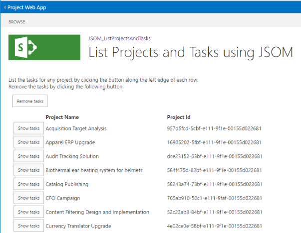
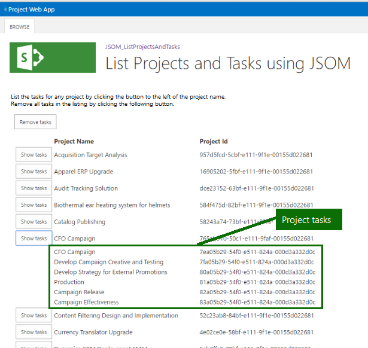

# <a name="developing-a-project-online-add-in-using-the-javascript-object-model-jsom"></a>プロジェクトのオンライン追加の JavaScript オブジェクト モデル (JSOM) を使用して開発

プロジェクト オンラインと、利便性を強化するためにプロジェクトをオンラインでマイクロソフトのアドインの開発について説明します。 開発プロジェクトは、チュートリアルとして実装されます。 アドインをこの資料の使用しプロジェクト名とプロジェクトのオンライン アカウントから発行されたプロジェクトの Id が表示されますを読み込んで使用すると、個々 のプロジェクトに関連付けられている取得タスクへのドリル ダウンします。
  
実行時に、アドインの一覧は次の次の図に似ています。
  

  
この例の目的は、プロジェクト オンラインでクエリを実行して、サービスからの各要求のコンテキストを設定するとの相互作用です。 ユーザー インターフェイス (UI) 要素には、最低限の注意が表示されます。 代わりに、ソースの一覧では、UI に関するコメントを提供します。
  
> [!NOTE]
> 例のアドインで、Visual Studio プロジェクトのソース ファイルがある: https://github.com/OfficeDev/Project-JSOM-List-Projects-Tasks....。 手元ソース ファイルの参照として、資料を参照するときにそれぞれを補完するもの、もう一方に。 Visual Studio 内のファイルがプロジェクトのビルドとは、最小限の変更を実行可能: PWA のフォルダーに、プロジェクトのオンラインのテナントの代わりに、URL です。 
  
## <a name="background"></a>背景

オンラインのプロジェクトは、プロジェクト ポートフォリオ管理 (PPM) と調整し、ポートフォリオ、プログラム、およびプロジェクトを管理するプロジェクト管理オフィス (PMO) のソリューションを企業に提供している Office 365 サービスです。 オンラインのプロジェクトは、プロジェクトのデスクトップ エディションによりさまざまな製品まだ、オンライン プロジェクトも含まれていますを維持し、プロジェクトのライフ サイクル全体にわたってプロジェクトの詳細を追跡する機能。 SharePoint Online のオンラインのプロジェクトがビルドされます。
  
プロジェクト オンライン ホストされている追加のクライアント側オブジェクト モデル API とやり取りする JavaScript とリソース ・ ファイルで構成されます。 アドインをユーザーが訪問した、JavaScript とリソースがダウンロードされ、ブラウザー内で実行されます。 アドイン プロジェクトをオンラインにする非同期の呼び出しは、サービスとの対話の作成、取得、更新、またはデータを削除するかどうかは、します。 
  
オンラインのプロジェクトは、アドインから他のテナントに属する情報を保護するために複数のアクションを 1 つを実行します。つまり、アドインからの要求と対話する、独立したサイトの作成はプロジェクトのオンラインのようにします。 オンライン プロジェクトのホストでは、カスタム コードが実行されません。 
  
オンライン プロジェクトのアドインの開発のセットアップでは、Visual Studio SharePoint アドイン プロジェクトの種類を使用します。 アドインが、JavaScript で記述され、プロジェクトの JavaScript オブジェクト モデル (JSOM) を使用して、プロジェクトのオンライン サービスと対話します。 JSOM では、SharePoint の JSOM からの機能の多くを継承します。
  
> [!NOTE]
> アドインの発行し Office ストアで販売または SharePoint 上のプライベート アプリケーション カタログに配置できます。 詳細についてを参照してください[の展開、Office アドインを発行し、](https://docs.microsoft.com/office/dev/add-ins/publish/publish)。
> 
> この資料で使用されているアドインの開発者用のサンプルは、します。実稼働環境で使用するためのものではありません。 主な目的では、オンラインのプロジェクトのアプリケーション開発の例を示します。 
  
## <a name="prerequisites"></a>前提条件

サポートされている Windows 環境には、次の項目を追加します。
  
- **4.0 またはそれ以降の.NET Framework**: バージョン 4.0 フレームワークの完全なバージョンに互換性がします。 ダウンロード サイトは、 https://msdn.microsoft.com/vstudio/aa496123.aspx。
    
- **2013 またはそれ以降の Visual Studio の**。  
    
   - Visual Studio 2015 のプロフェッショナル ・ エディションはアウト - 標準の準備が、使用にhttps://www.visualstudio.com/en-us/products/visual-studio-professional-with-msdn-vs.aspx。
    
   - Visual Studio 2015 の community edition は、 https://www.visualstudio.com/en-us/products/visual-studio-community-vs.aspx。 このエディションには、Visual Studio の Microsoft Office の開発ツールを手動でインストールが必要です。
    
   Visual Studio 用の Microsoft Office 開発ツールは、 https://www.visualstudio.com/en-us/features/office-tools-vs.aspx。
    
- **A プロジェクト オンライン アカウント**: これは、ホスティング サービスへのアクセスを提供します。 プロジェクトのオンライン アカウントを取得する方法についてを参照してくださいhttps://products.office.com/en-us/Project/project-online-portfolio-management。
    
   アドインのユーザーがプロジェクトのオンラインのテナントのいくつかのプロジェクトにアクセスするための十分な権限を持っていることを確認します。 
    
- **ホスト サイト上のプロジェクト**情報が挿入されます。
    
> [!NOTE]
> 標準の.NET Framework は、使用する正しいフレームワークです。 [.NET Framework 4 クライアント プロファイル] を使用することはしません。 
  
### <a name="set-up-the-visual-studio-project"></a>Visual Studio プロジェクトを設定します

アプリケーションのセットアップは、新しいプロジェクトを作成する、適切なライブラリとリンク、および必要な名前空間を宣言することで構成されます。 Visual Studio には、いくつかの種類の開発プロジェクトが表示されます。 セクションとは、簡単な非常に基本的なです。 値の情報がある 1 つの場所に統合します。
  
#### <a name="select-a-visual-studio-project"></a>Visual Studio プロジェクトを選択します。

アドインの適切な種類のプロジェクトを作成するには、次の手順を行う必要があります。 画面上で発生するキーワードは、**太字**属性を持ちます。 
  
1. [ファイル] メニューから**ファイル**を選択して > **新規** > **プロジェクト**。 
    
2. 左側のウィンドウでインストールされたテンプレート] から選択して**C#** > **Office**SharePoint/ > **Web アドイン**です。 
    
3. 中央のウィンドウの上部には、 **.NET Framework 4**を選択またはそれ以降です。4.6 を現在のバージョンには。 
    
4. 中央のウィンドウでアプリケーションの種類を**SharePoint のアドインを**選択します。 
    
5. 下部のセクションで、プロジェクトとソリューション名の場所と名前を指定します。 
    
6. 下部のセクションで、**ソリューションのディレクトリを作成**チェック ボックスをオンします。 
    
7. 初期プロジェクトを作成するのには **[ok]** をクリックします。 
    
Visual Studio のウィザードは、以下のダイアログのいくつかのオンライン プロジェクトの設定サイト (と呼ばれる SharePoint 設定ダイアログ ボックス内) に関するフォロー アップの質問をいくつかを要求します。 質問を以下に示します。
  
1. SharePoint サイトはどのようなアドインをデバッグに使用しますか。 PWA サイトの URL を指定して次のようにhttps://contoso.sharepoint.com/sites/pwa。
    
2. SharePoint で、アドインをホストする方法を指定しますか。 [X] を選択して**SharePoint でホストされています**。
    
   SharePoint アドインに関する詳細については、ホスティングなどのオプションでは、 [SharePoint のアドイン](https://docs.microsoft.com/sharepoint/dev/sp-add-ins/sharepoint-add-ins)を参照してください。
    
3. [ **次へ**] をクリックします。 
    
アドインの SharePoint のオンライン バージョンを指定する 2 つ目の追加のダイアログが表示されたら。 
  
1. 対象とするように追加する SharePoint の最も古いバージョンとは何ですか。 [X] を選択して S **harePoint オンライン**。 
    
2. [ **完了**] をクリックします。 
    
Visual Studio は、プロジェクトが作成され、プロジェクトのオンライン サイトにアクセスします。 
  
### <a name="enable-sideloading-on-the-project-online-site"></a>プロジェクトのオンライン サイト上の sideloading を有効にします。

Sideloading は、テストとオンライン プロジェクトのアドインをデバッグするための機構です。Sideloading の 2 つのスクリプトが必要があります: テストおよびアドインのデバッグが完了したら、sideloading を無効にする別のプロジェクトのオンライン サイトで sideloading を有効にする 1 つ。
  
Sideloading を設定する方法の詳細については、[アプリケーション開発者以外のサイト コレクション内の SideLoading を有効にする](https://blogs.msdn.microsoft.com/officeapps/2013/12/10/enable-app-sideloading-in-your-non-developer-site-collection/)を参照してください。
  
> [!NOTE]
> Sideloading アプリケーションは、開発者とテスト機能です。 **運用環境で使用しない目的**があります。 Sideload アプリケーションではありませんを定期的に行うか、機能を使用してアクティブにするよりも長時間の有効なアプリケーションの sideloading を維持します。 
  
## <a name="add-content-to-the-add-in-project"></a>アドイン プロジェクトにコンテンツを追加します。

プロジェクトを作成すると、デバッグの機構を設定する、アプリケーションにコンテンツを追加する次のタスクが含まれます。
  
- アプリケーション スコープの設定
    
- JSOM ライブラリをリンク
    
- アドインに UI 要素を追加します。
    
- 初期化し、プロジェクトのオンライン サービスに接続します。
    
- プロジェクトとの詳細とプロパティを取得します。
    
- プロジェクトを表示します。
    
- プロジェクトのタスクを表示します。
    
アドイン プロジェクトでは、多数のファイルで構成されます。 この例では、以下のファイルを編集する必要があります。 
  
- AppManifest.xml
    
- Default.aspx
    
- App.js
    
- App.css - 省略可能です。アドイン用に開発されたスタイルの定義が含まれています
    
移動など試用版からサブスクリプションのサイトでは、サーバー間の接続およびサイトの URL を含む、プロジェクトのプロパティを更新することができます、プロジェクトのオンラインのテナントが変更された場合は、[プロパティ] ウィンドウ**のビュー**で利用可能なを使用して > **のプロパティウィンドウ**コマンドです。 
  
プロジェクトにファイルを追加することもできます。 その場合は、(コンテンツ、イメージ、ページ、またはスクリプト) を新しいファイルを含めるには、同じグループ内にある、Elements.xml ファイルを更新する必要があります。 プロジェクト ファイルの詳細については、 [SharePoint アドインのパッケージとアプリケーション マニフェストの構造を表示する](https://docs.microsoft.com/sharepoint/dev/sp-add-ins/explore-the-app-manifest-structure-and-the-package-of-a-sharepoint-add-in)を参照してください。
  
### <a name="set-application-scope"></a>アプリケーション スコープの設定

追加のサービス情報をクエリ結果に返される前に定義されたスコープまたはアクセス許可のレベルが必要です。 このアドインの場合、Visual Studio プロジェクトに次のスコープを使用します。 この変更は、AppManifest.xml ファイルを [アクセス許可] タブで使用します。

|スコープ|アクセス許可|
|:-----|:-----|
|複数のプロジェクト (Project Server)  <br/> |Read  <br/> |
   
アプリケーションのスコープを設定した後、ファイルを保存します。 それ以外の場合、データは返されません、サービスから。 
  
### <a name="link-the-jsom-library"></a>JSOM ライブラリをリンクします。

ランタイム プロジェクト オンライン ライブラリ、PS.js、PS.debug.js は、プロジェクトをオンラインで提供されており、最新のバージョンは、常に。 JavaScript 追加のプラグインを使用して、JSOM は、これらのライブラリのいずれかにリンクしなければなりません。 Default.aspx ファイルには、リンクの定義が追加されます。 PS.js または PS.debug.js を使用するコマンドにあるコードの一部です。
  
PS.js または PS.debug.js の定義については、次のコマンドを追加、 `<asp:Content ContentPlaceHolderID="PlaceHolderAdditionalPageHead"` sp.js の「SharePoint:ScriptLink」次の要素です。 
  
```js
<SharePoint:ScriptLink name="PS.js" runat="server" OnDemand="false" LoadAfterUI="true" Localizable="false" />
```

> [!NOTE]
> PS.js または PS.debug.js の**オンデマンド ・** 属性が**false**に設定します。 
  
### <a name="add-ui-elements-to-the-add-in"></a>アドインに UI 要素を追加します。

使用例を追加でいくつかのコンポーネントで構成されます。 Default.aspx ファイルには、静的な要素の説明があります。 動的な要素の説明とすべてのコンポーネントのコードがあります。 コンポーネントに関するコメントは、ソース コードの一覧を参照してください。 アドインの UI コンポーネントの一覧を以下に示します。
  
- Title
    
- 紹介文言
    
- 表からタスクを削除するボタン
    
- プロジェクト ID、名前、およびタスクの情報を一覧表示するテーブルです。
    
- タスクのタスクのデータをテーブルにインポートする (プロジェクトごとに 1 回クローン作成) ボタン。
    
タイトル、プロジェクトのテーブルのヘッダー部分など、ユーザー インターフェイスの詳細は、Default.aspx のプロジェクト ファイルを参照してください。
  
### <a name="initialize-and-connect-to-the-host-system"></a>初期化し、ホスト システムへの接続

App.js ファイルには、JavaScript コードが含まれています。 アドインの PS.js が、ブラウザーにロードし、initializePage 関数を呼び出します。 InitializePage は、オンライン プロジェクトのエンドポイントへのコンテキストを取得し、loadProjects 関数を開始します。
  
```js
    'use strict';
    SP.SOD.executeOrDelayUntilScriptLoaded(initializePage, "PS.js");
    //Project PWA Context and published projects in PWA
    var projContext;
    var projects;
    function initializePage() {
        //Get the Project context for this web
        projContext = PS.ProjectContext.get_current();
        loadProjects();
    }
    //General CSOM failure event handler
    //Invoked when ExecuteQueryAsync returns unsuccessfully
    function onRequestFailed(sender, args) {
        alert("Failed to execute: " + args.get_message());
        return;
    };

```

### <a name="retrieve-the-projects"></a>プロジェクトを取得します。

LoadProjects 関数は、プロジェクトの名前と Id のサービスを照会します。 
  
アプリケーションの取得、プロジェクト名とプロジェクト id。プロジェクトに関するその他の情報は、利用可能なを取得するプロパティを明示的に識別するのには load メソッドを変更することによってアクセスできます。 例は、コメントとしてコード内に提供されます。 
  
クエリが成功すると、追加で displayProjects を呼び出すことで続行されます。 
  
```js
    //Query CSOM and get the list of projects in PWA
    function loadProjects() {
        projects = projContext.get_projects();
    //Request to server - identifies what to retrieve
        projContext.load(projects, 'Include(Name, Id)');
        //Notice to server to execute query
        projContext.executeQueryAsync(displayProjects, onRequestFailed);
        // Syntax for requesting more fields to pull down from server
        // projContext.load(projects, 'Include(Name, Description, StartDate, 
        // Id, IsCheckedOut)');
    }

```

### <a name="display-the-projects"></a>プロジェクトを表示します。

DisplayProjects 関数は、テーブル、プロジェクトごとに 1 行と、特定のプロジェクトのタスクを表示するボタンを作成します。 
  
```js
    //Display the projects with names and ids in a table
    function displayProjects() {
        //Current published project and ID
        var p, projId;
        //Project table rows to publish collectively
        var pTable = []; 
        var pEnum = projects.getEnumerator();
        //Build a 3-column table, with one project per row.
        while (pEnum.moveNext()) {
            p = pEnum.get_current();
        
            //Items used in getting information for table rows:
            //Current published project object, and ID and name
            // var project = p;
            // var projId = p.get_id();
            // var projName = p.get_name();
        
            //Continue processing/working with project object as needed.
        }
    }

```

> [!NOTE]
> While は、アクセス ID および名前のプロパティをループします。 これは、次に、同じプロパティにアクセスする関数を呼び出すソース コード プロジェクトと少し異なります。 
  
### <a name="display-the-tasks-for-a-project"></a>プロジェクトのタスクを表示します。

、アドインの一部の中に、タスクは、最初の読み込みの一部ではありません。 ユーザーがプロジェクトに関連付けられているタスクに関心を持っていない場合は、btnLoadTasks イベント ハンドラーを使用してリストに表示するタスクと、"タスクの表示] ボタンをクリックすると。 
  
BtnLoadTasks イベント ハンドラーの適切なプロジェクトの ID を持つサーバーから、指定されたプロジェクトのタスクを要求します。 取得した後 btnLoadTasks は、画面上のタスクを表示するのには displayTasks に、[タスク] ボックスの一覧を渡します。
  
```js
    //Query CSOM and get the list of tasks for a specific project
    function btnLoadTasks(pid) {
        //Event handler for the "Show tasks" buttons. 
        //
        //The project ID is the sole argument and is used to get the appropriate task 
        //info from the service.
        //The project ID is also the button name, and is used to identify where to place
        //the task information in the table.
        //
        //Project ID to pass to the event handler
        var projId = pid;
        //
        //Get the project reference
        var pProj = projects.getById(projId);
        //
        //Get the tasks collection reference associated with the project.
        var tasks = pProj.get_tasks();
        //
        projContext.load(tasks, 'Include(Id, Name, Start, ScheduledStart, Completion)');
        //
        //If the query succeeds, displayTasks presents the tasks to the user.
        projContext.executeQueryAsync(function () { displayTasks(tasks, projId) }, onRequestFailed);
    }

```

DisplayTasks 関数には、プロジェクト項目のすぐ下にある指定されたプロジェクトに関連付けられているタスクが表示されます。
  
```js
    //Insert tasks for the specified project immediately underneath the project entry 
    //in the table.
    function displayTasks(tasks, projId) {
        //selected project ID
        var pId = projId;
        //individual task
        var t;
        //Task table rows to publish collectively
        var tTable = [];
        var tEnum = tasks.getEnumerator();
        //Build table one task per row.
        while (tEnum.moveNext()) {
            t = tEnum.get_current();
            //
            //Items used in getting information for table rows:
            //Current task object, and ID and name
            // var task = t;
            // var taskId = t.get_id();
            // var taskName = t.get_name();
            
            //Continue processing/working with task object as needed.
        }
    }

```

> [!NOTE]
> While は、タスク ID にアクセスし、名前のプロパティをループします。 これは、次に、同じプロパティにアクセスする関数を呼び出すソース コード プロジェクトと少し異なります。 
  
1 つのプロジェクトのタスクの出力の例に従います。
  

  
## <a name="see-also"></a>関連項目

ドキュメントとオンライン プロジェクトと CSOM を使用したアプリケーション開発に関連するサンプルでは、[プロジェクト開発のポータル](https://developer.microsoft.com/en-us/project)を参照してください。
    


