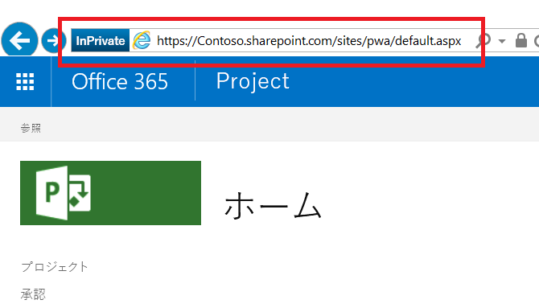

# <a name="developing-a-project-online-application-using-the-client-side-object-model-csom"></a><span data-ttu-id="4801e-103">クライアント側オブジェクト モデル (CSOM) を使用した Project Online アプリケーションの開発</span><span class="sxs-lookup"><span data-stu-id="4801e-103">Developing a Project Online application using the client-side object model (CSOM)</span></span>

>[!NOTE] 
><span data-ttu-id="4801e-104">この記事では、CSOM を使用した Microsoft Project Online アプリケーションの開発について説明します。</span><span class="sxs-lookup"><span data-stu-id="4801e-104">This article describes Microsoft Project Online application development for using CSOM.</span></span> <span data-ttu-id="4801e-105">[新しい Web 用 Project](https://developer.microsoft.com/ja-JP/office/blogs/developing-applications-and-reports-using-the-new-project/) を使用してアプリケーションを開発する方法の検討をお勧めします。</span><span class="sxs-lookup"><span data-stu-id="4801e-105">We recommend you explore how to develop applications using the [new Project for the web](https://developer.microsoft.com/ja-JP/office/blogs/developing-applications-and-reports-using-the-new-project/).</span></span>
  
## <a name="background"></a><span data-ttu-id="4801e-106">背景</span><span class="sxs-lookup"><span data-stu-id="4801e-106">Background</span></span>

<span data-ttu-id="4801e-107">Microsoft Project は、1990 年代初期にデスクトップ アプリケーションとして始まりました。</span><span class="sxs-lookup"><span data-stu-id="4801e-107">Microsoft Project started as desktop application in the early 1990's.</span></span> <span data-ttu-id="4801e-108">現在、Project には次のような種類があります。</span><span class="sxs-lookup"><span data-stu-id="4801e-108">Today, Project is much more, as its several varieties attest:</span></span>
  
- <span data-ttu-id="4801e-109">Project Standard エディションは、単体のアプリケーションとして実行されるデスクトップ アプリケーションです。</span><span class="sxs-lookup"><span data-stu-id="4801e-109">Project standard edition is a desktop application that runs as a stand-alone application.</span></span>
    
- <span data-ttu-id="4801e-110">Project Professional エディションは、大きなスケールでサーバーと対話したりデータを共有したりできるデスクトップ アプリケーションであり、Project Standard エディションの機能も実行できます。</span><span class="sxs-lookup"><span data-stu-id="4801e-110">Project professional edition is a desktop application that can interact and share data with a server on a larger scale, as well as perform the functionality found in Project standard edition.</span></span>
    
- <span data-ttu-id="4801e-111">Project Online は、Microsoft でホストされるサービスであり、プロジェクト、プログラム、ポートフォリオを調整および管理するための PMO レベルのソリューションを企業に提供します。</span><span class="sxs-lookup"><span data-stu-id="4801e-111">Project Online is a Microsoft-hosted service that provides companies with a PMO-level solution to coordinate and manage projects, programs, and portfolios.</span></span> <span data-ttu-id="4801e-112">デスクトップ エディションとは異なる製品である Project Online は、プロジェクトの期間全体を通してプロジェクトの詳細を管理および追跡できます。</span><span class="sxs-lookup"><span data-stu-id="4801e-112">A different offering than the desktop editions, Project Online can maintain and track project details throughout the life of a project.</span></span> 
    
- <span data-ttu-id="4801e-113">Project Server は企業でホストされるサービスであり、プロジェクト、プログラム、ポートフォリオに関する情報が含まれるサーバーの管理とセキュリティ保護は企業において行われます。</span><span class="sxs-lookup"><span data-stu-id="4801e-113">Project Server is an enterprise-hosted service in which the enterprise manages and secures the server containing project, program, and portfolio information.</span></span> <span data-ttu-id="4801e-114">社内でサーバーのセキュリティ保護を行うことにより、Project Server では、外部でホストされる Project Online のプロジェクト、プログラム、ポートフォリオ指向の機能と一緒に、優れたカスタマイズ機能も提供されます。</span><span class="sxs-lookup"><span data-stu-id="4801e-114">Project Server, by virtue of securing the server in-house, offers the project, program, and portfolio oriented features of externally-hosted Project Online with a greater capacity for customization.</span></span>
    
<span data-ttu-id="4801e-115">Project Online には、クライアント側オブジェクト モデル (CSOM)、JavaScript オブジェクト モデル (JSOM)、Representational State Transfer (REST) という 3 種類のオンライン API セットがあります。</span><span class="sxs-lookup"><span data-stu-id="4801e-115">Project Online has three online API sets: Client-side Object Model (CSOM), JavaScript Object Model (JSOM), and Representational State Transfer (REST).</span></span> 
  
- <span data-ttu-id="4801e-116">Project Online テナントとやり取りする Windows アプリケーションを開発するときは、.NET CSOM の実装が推奨されるインターフェイスです。</span><span class="sxs-lookup"><span data-stu-id="4801e-116">The .NET CSOM implementation is the preferred interface when developing Windows applications that interact with Project Online tenants.</span></span> <span data-ttu-id="4801e-117">ユーザー中心アプリケーションの典型的な環境には、Windows デスクトップと Microsoft Surface デバイスが含まれます。</span><span class="sxs-lookup"><span data-stu-id="4801e-117">Typical environments for user-centric applications include Windows desktops and Microsoft Surface devices.</span></span> <span data-ttu-id="4801e-118">.NET CSOM で記述されたバックエンド アプリケーションは、Project Online の外部にある、ビジネス ロジックおよびデータ ソース用の他のサーバーに接続できます。</span><span class="sxs-lookup"><span data-stu-id="4801e-118">Back-end applications written with .NET CSOM can connect to other servers for business logic and data sources that are external to Project Online.</span></span> <span data-ttu-id="4801e-119">Project Online に対する取得要求では、基本的な取得機能よりいくつかの点で強化されている、LINQ に似たクエリ システムを使用します。</span><span class="sxs-lookup"><span data-stu-id="4801e-119">Retrieval requests to Project Online use a LINQ-like query system that offers several enhancements over basic retrieval functions.</span></span>
    
- <span data-ttu-id="4801e-120">JavaScript オブジェクト モデル (JSOM) インターフェイスでは、Project Online アドインに対するクロスブラウザーのサポートが提供されます。アドインは、Project Online テナントに格納されている Web アプリケーションです。</span><span class="sxs-lookup"><span data-stu-id="4801e-120">The JavaScript Object Model (JSOM) interface provides cross-browser support for Project Online Add-ins. An add-in is a web application that is stored in the Project Online tenant.</span></span> <span data-ttu-id="4801e-121">ユーザーがアドインを実行しようとすると、アドインのコードがダウンロードされて、ユーザーのコンピューターのブラウザーで実行されます。</span><span class="sxs-lookup"><span data-stu-id="4801e-121">When a user wants to run an add-in, the code for the add-in downloads and runs in the browser on the user machine.</span></span> 
    
- <span data-ttu-id="4801e-122">REST/Odata モデルでは、HTTP ベースの通信が提供されます。このインターフェイスは、Windows 以外の環境でのアプリケーションの場合に推奨されます。</span><span class="sxs-lookup"><span data-stu-id="4801e-122">The REST/Odata model provides HTTP-based communication, This interface is recommended for applications in non-Windows environments.</span></span> <span data-ttu-id="4801e-123">通信エンドポイントは、Project Web アプリケーション (PWA) サイト内のオブジェクトです。</span><span class="sxs-lookup"><span data-stu-id="4801e-123">Communication endpoints are the objects in the Project Web Application (PWA) site.</span></span> <span data-ttu-id="4801e-124">結果では、標準の HTTP 状態コードが提供されます。</span><span class="sxs-lookup"><span data-stu-id="4801e-124">Results provide normal HTTP status codes.</span></span>
    
<span data-ttu-id="4801e-125">この記事では、.NET CSOM インターフェイスを使用するアプリケーションについて説明します。</span><span class="sxs-lookup"><span data-stu-id="4801e-125">This article focuses on an application that uses the .NET CSOM interface.</span></span>
  
## <a name="prerequisites"></a><span data-ttu-id="4801e-126">前提条件</span><span class="sxs-lookup"><span data-stu-id="4801e-126">Prerequisites</span></span>

<span data-ttu-id="4801e-127">Windows 10 を実行するベース システムから始めて、次の項目を追加します。</span><span class="sxs-lookup"><span data-stu-id="4801e-127">Start with a base system running Windows 10, and add the following items:</span></span>
  
- <span data-ttu-id="4801e-128">.Net framework 4.0 以降 -- 完全なフレームワークを使用します。</span><span class="sxs-lookup"><span data-stu-id="4801e-128">.Net Framework 4.0 or later -- Use the complete framework.</span></span> <span data-ttu-id="4801e-129">ダウンロード サイトは https://msdn.microsoft.com/vstudio/aa496123.aspx です。</span><span class="sxs-lookup"><span data-stu-id="4801e-129">The download site is https://msdn.microsoft.com/vstudio/aa496123.aspx.</span></span>
    
- <span data-ttu-id="4801e-130">Visual Studio 2013 以降 -- どのエディションでもかまいません。</span><span class="sxs-lookup"><span data-stu-id="4801e-130">Visual Studio 2013 or later -- Any edition is acceptable.</span></span> <span data-ttu-id="4801e-131">サンプル アプリケーションの開発には、Visual Studio 2015 の Community エディションを使用しました。</span><span class="sxs-lookup"><span data-stu-id="4801e-131">The community edition of Visual Studio 2015 was used to develop the sample application.</span></span> <span data-ttu-id="4801e-132">Community エディションは https://www.visualstudio.com/en-us/products/visual-studio-community-vs.aspx で入手できます。</span><span class="sxs-lookup"><span data-stu-id="4801e-132">The community edition is available at https://www.visualstudio.com/en-us/products/visual-studio-community-vs.aspx.</span></span>
    
- <span data-ttu-id="4801e-133">SharePoint クライアント コンポーネント SDK -- Project Online と Project Server は、SharePoint および SharePoint アセンブリの上にあります。</span><span class="sxs-lookup"><span data-stu-id="4801e-133">SharePoint Client Components SDK -- Project Online and Project Server sit on top of SharePoint, and SharePoint assemblies.</span></span> <span data-ttu-id="4801e-134">SharePoint クライアント コンポーネントは、Visual Studio の Professional エディションと Enterprise エディションに含まれています。</span><span class="sxs-lookup"><span data-stu-id="4801e-134">The SharePoint Client Components are included in Visual Studio Professional and Enterprise editions.</span></span> <span data-ttu-id="4801e-135">Visual Studio Community エディションを使用する場合は、最新バージョンの Office Developer Tools SDK を https://www.microsoft.com/en-us/download/details.aspx?id=35585 で入手できます。</span><span class="sxs-lookup"><span data-stu-id="4801e-135">If you use Visual Studio Community edition, the latest version of the Office Developer Tools SDK is available at the following site: https://www.microsoft.com/en-us/download/details.aspx?id=35585.</span></span>
    
- <span data-ttu-id="4801e-136">Project Online アカウント -- ホスティング サイトにアクセスできるようになります。</span><span class="sxs-lookup"><span data-stu-id="4801e-136">A Project Online account -- This provides access to the hosting site.</span></span> <span data-ttu-id="4801e-137">Project Online アカウントの入手の詳細については、https://products.office.com/en-gb/project/project-portfolio-management をご覧ください。</span><span class="sxs-lookup"><span data-stu-id="4801e-137">For more information about obtaining a Project Online account, see https://products.office.com/en-gb/project/project-portfolio-management.</span></span>
    
- <span data-ttu-id="4801e-138">ホスティング サイト上の情報設定済みプロジェクト</span><span class="sxs-lookup"><span data-stu-id="4801e-138">Projects on the hosting site that are populated with information</span></span>
    
> [!NOTE]
> <span data-ttu-id="4801e-139">標準の .NET Framework (4.0 以降) が、使用するのに適切なフレームワークです。</span><span class="sxs-lookup"><span data-stu-id="4801e-139">The standard .NET Framework (4.0 or later) is the correct framework to use.</span></span> <span data-ttu-id="4801e-140">.NET Framework 4 Client Profile は使用しないでください。</span><span class="sxs-lookup"><span data-stu-id="4801e-140">Do not use the .NET Framework 4 Client Profile.</span></span> 
  
## <a name="develop-the-application"></a><span data-ttu-id="4801e-141">アプリケーションを開発する</span><span class="sxs-lookup"><span data-stu-id="4801e-141">Develop the application</span></span>

<span data-ttu-id="4801e-142">SharePoint 向けデスクトップ アプリケーションの開発で推奨されるインターフェイスは、Project クライアント側オブジェクト モデル (CSOM) です。</span><span class="sxs-lookup"><span data-stu-id="4801e-142">In developing a desktop application for SharePoint, the preferred interface is the Project client side object model (CSOM).</span></span> 
  
<span data-ttu-id="4801e-143">[Project CSOM サンプル](https://developer.microsoft.com/project/gallery/?filterBy=Samples,Project)は、Office デベロッパー センターの Project 開発者向けリソース ギャラリーからダウンロードできます。</span><span class="sxs-lookup"><span data-stu-id="4801e-143">You can download the [Project CSOM samples](https://developer.microsoft.com/project/gallery/?filterBy=Samples,Project) from the Project Developer resource gallery on the Office Dev Center.</span></span>
  
<span data-ttu-id="4801e-144">最初の 2 つのトピックでは、基本的な事項、つまり適切な名前空間とアセンブリを使用した Visual Studio プロジェクトの作成と、ホスティング サーバーへのアクセスについて説明します。</span><span class="sxs-lookup"><span data-stu-id="4801e-144">The first two topics cover basic issues: creating a Visual Studio project with appropriate namespaces and assemblies, and accessing the hosting server.</span></span> <span data-ttu-id="4801e-145">残りのトピックでは、1 つのオブジェクトおよび多数のオブジェクトからの、CSOM 経由での情報の取得について説明します。</span><span class="sxs-lookup"><span data-stu-id="4801e-145">The remaining topics deal with retrieving information through the CSOM, from one and many objects.</span></span> 
  
<span data-ttu-id="4801e-146">ホストからの情報の取得は、クライアント アプリケーションからの 2 アクション プロセスです。</span><span class="sxs-lookup"><span data-stu-id="4801e-146">Retrieving information from the host is a two-action process from client applications.</span></span> <span data-ttu-id="4801e-147">最初に、アプリケーションで 1 つまたは複数の取得要求を指定してサーバーに送信します。</span><span class="sxs-lookup"><span data-stu-id="4801e-147">First, the application specifies and sends one or more retrieval requests to the server.</span></span> <span data-ttu-id="4801e-148">次に、アプリケーションでサーバーに通知を発行して、送信されたクエリを実行します。</span><span class="sxs-lookup"><span data-stu-id="4801e-148">Second, the application issues a notification to the server to execute the submitted queries.</span></span> <span data-ttu-id="4801e-149">サーバーは、クエリの結果をクライアントに送信することで応答します。</span><span class="sxs-lookup"><span data-stu-id="4801e-149">The server responds by sending the query results to the client.</span></span>
  
### <a name="set-up-the-visual-studio-project"></a><span data-ttu-id="4801e-150">Visual Studio プロジェクトを設定する</span><span class="sxs-lookup"><span data-stu-id="4801e-150">Set up the Visual Studio project</span></span>

<span data-ttu-id="4801e-151">アプリケーションのセットアップは、新しいプロジェクトの作成、適切なアセンブリのリンク、必要な名前空間の宣言で構成されます。</span><span class="sxs-lookup"><span data-stu-id="4801e-151">The application setup consists of creating a new project, linking the appropriate assemblies and declaring the needed namespaces.</span></span> <span data-ttu-id="4801e-152">Visual Studio では、複数の種類の開発プロジェクトが提供されています。</span><span class="sxs-lookup"><span data-stu-id="4801e-152">Visual Studio presents several types of development projects.</span></span> 
  
#### <a name="select-a-visual-studio-project"></a><span data-ttu-id="4801e-153">Visual Studio プロジェクトを選択する</span><span class="sxs-lookup"><span data-stu-id="4801e-153">Select a Visual Studio project</span></span>

1. <span data-ttu-id="4801e-154">Visual Studio を起動し、開始ページで [**新しいプロジェクトの開始**] を選択します。</span><span class="sxs-lookup"><span data-stu-id="4801e-154">Launch Visual Studio and select **Start A New Project** on the Start Page.</span></span> 
    
   <span data-ttu-id="4801e-155">[新しいプロジェクト] ダイアログ ボックスでは、使用可能なアプリケーション テンプレートと、選択したテンプレートのデータ フィールドが表示されます。</span><span class="sxs-lookup"><span data-stu-id="4801e-155">The New Project dialog displays available application templates, and data fields for any selected template.</span></span> 
    
2. <span data-ttu-id="4801e-156">このアプリケーションでは、次の項目を指定します。</span><span class="sxs-lookup"><span data-stu-id="4801e-156">For this application, specify the following items.</span></span> <span data-ttu-id="4801e-157">画面に表示されるキーワードは太字です。</span><span class="sxs-lookup"><span data-stu-id="4801e-157">Keywords encountered on the screen have a bold attribute:</span></span>
    
   1. <span data-ttu-id="4801e-158">左側のウィンドウのインストール済みテンプレートから、[**C#**]、[**Windows**]、[**従来のデスクトップ**] の順に選択します。</span><span class="sxs-lookup"><span data-stu-id="4801e-158">From the Installed templates in the left pane, select **C#** => **Windows** => **Classic desktop**.</span></span> 
    
   2. <span data-ttu-id="4801e-159">中央のウィンドウの上部で、[**.NET Framework 4**] を選択します。</span><span class="sxs-lookup"><span data-stu-id="4801e-159">At the top of the central pane, select **.NET Framework 4**.</span></span> 
    
   3. <span data-ttu-id="4801e-160">中央のウィンドウのアプリケーションの種類から、[**コンソール アプリケーション**] を選択します。</span><span class="sxs-lookup"><span data-stu-id="4801e-160">From the application types in the central pane, choose **Console Application**.</span></span> 
    
   4. <span data-ttu-id="4801e-161">下部のセクションで、プロジェクトの名前と場所、ソリューション名を指定します。</span><span class="sxs-lookup"><span data-stu-id="4801e-161">In the bottom section, specify a name and location for the project, and a solution name.</span></span> 
    
   5. <span data-ttu-id="4801e-162">また、下部のセクションで、[**ソリューションのディレクトリを作成**] ボックスがオンになっていることを確認します。</span><span class="sxs-lookup"><span data-stu-id="4801e-162">Also in the bottom section, check the **Create directory for solution** box.</span></span> 
    
3. <span data-ttu-id="4801e-163">[**OK**] をクリックして、初期プロジェクトを作成します。</span><span class="sxs-lookup"><span data-stu-id="4801e-163">Click **OK** to create the initial project.</span></span> 
    
#### <a name="add-assemblies"></a><span data-ttu-id="4801e-164">アセンブリを追加する</span><span class="sxs-lookup"><span data-stu-id="4801e-164">Add assemblies</span></span>

<span data-ttu-id="4801e-165">VS ソリューションには、Project 2103 SDK の ProjectServerClient アセンブリ、SharePoint SDK のいくつかのアセンブリ、および .NET Framework System.Security アセンブリが必要です。</span><span class="sxs-lookup"><span data-stu-id="4801e-165">The VS solution needs the ProjectServerClient assembly from the Project 2103 SDK, a couple of assemblies from the SharePoint SDK, and the .NET Framework System.Security assembly.</span></span>
  
1. <span data-ttu-id="4801e-166">VS のソリューション エクスプローラーで、[参照] エントリを右クリックして、[**参照の追加**] を</span><span class="sxs-lookup"><span data-stu-id="4801e-166">In the VS Solution Explorer, right-click the References entry, and select **Add Reference…**</span></span> <span data-ttu-id="4801e-167">ショートカット メニューから選択します。</span><span class="sxs-lookup"><span data-stu-id="4801e-167">from the shortcut menu.</span></span> 
    
2. <span data-ttu-id="4801e-168">**Microsoft.ProjectServer.Client.dll** をクリックします。</span><span class="sxs-lookup"><span data-stu-id="4801e-168">Check the **Microsoft.ProjectServer.Client.dll**.</span></span> 
    
   <span data-ttu-id="4801e-169">必要な場合は、[**参照**]</span><span class="sxs-lookup"><span data-stu-id="4801e-169">If needed, click the **Browse…**</span></span> <span data-ttu-id="4801e-170">ボタン (ダイアログの下部) をクリックし、Project 2013 SDK のインストール ディレクトリに移動してアセンブリを見つけます。</span><span class="sxs-lookup"><span data-stu-id="4801e-170">button at the bottom of the dialog and navigate to the Project 2013 SDK installation directory to locate the assembly.</span></span> 
    
3. <span data-ttu-id="4801e-171">[**OK**] をクリックします。</span><span class="sxs-lookup"><span data-stu-id="4801e-171">Click **OK**.</span></span> 
    
4. <span data-ttu-id="4801e-172">PrjoctServer クライアント名前空間を .cs ファイルに追加します。</span><span class="sxs-lookup"><span data-stu-id="4801e-172">Add the PrjoctServer Client namespace to the .cs file.</span></span>
    
   ```cs
    using Microsoft.ProjectServer.Client;
   ```

<span data-ttu-id="4801e-173">NuGet パッケージ マネージャー コンソールを使用して、SharePoint 2013 SDK アセンブリを追加します。</span><span class="sxs-lookup"><span data-stu-id="4801e-173">Add the SharePoint 2013 SDK assemblies using the NuGet Package Manager Console.</span></span> 
  
1. <span data-ttu-id="4801e-174">VS の [ツール] メニューから、**[ツール] =\> [NuGet パッケージ マネージャー] =\> [パッケージ マネージャー コンソール]** の順にクリックします。</span><span class="sxs-lookup"><span data-stu-id="4801e-174">From the VS Tools menu, click the following menus: **Tools =\> NuGet Package Manager =\> Package Manager Console**.</span></span> 
    
2. <span data-ttu-id="4801e-175">パッケージ マネージャー コンソールで、次のコマンドを入力して \<Enter\> キーを押します。</span><span class="sxs-lookup"><span data-stu-id="4801e-175">In the Package Manager Console, enter the following command and press \<ENTER\>:</span></span>
    
   ```cs
    Install-Package Microsoft.SharePointOnline.CSOM
   ```

   <span data-ttu-id="4801e-176">**パッケージ マネージャー コンソール**ではコマンドの結果の説明が提供され、VS ソリューション エクスプローラーではプロジェクト参照内の SharePoint アセンブリが表示されます。</span><span class="sxs-lookup"><span data-stu-id="4801e-176">The **Package Manager Console** provides a description of the command results; and, the VS Solution Explorer displays the SharePoint assemblies in the project references.</span></span> 
    
3. <span data-ttu-id="4801e-177">.cs ファイルに名前空間を追加します。</span><span class="sxs-lookup"><span data-stu-id="4801e-177">Add the namespaces to the .cs file:</span></span>
    
   ```cs
    using Microsoft.SharePoint.Client;
   ```

<span data-ttu-id="4801e-178">System.Security アセンブリは .NET Framework の一部で、フレームワークと共にインストールされています。</span><span class="sxs-lookup"><span data-stu-id="4801e-178">The System.Security assembly is part of .NET Framework and was installed with the framework.</span></span> <span data-ttu-id="4801e-179">サンプル アプリケーションには、認証のため、ホスティング システムに暗号化された文字列を提供する名前空間が 1 つ以上必要です。</span><span class="sxs-lookup"><span data-stu-id="4801e-179">The sample application needs one more namespace that provides an encrypted string to the hosting system for authentication.</span></span> <span data-ttu-id="4801e-180">認証が済むと、アプリケーションはホスティング システム上のプロジェクトにアクセスできます。</span><span class="sxs-lookup"><span data-stu-id="4801e-180">Once authenticated, the application can access projects on the hosting system.</span></span> <span data-ttu-id="4801e-181">次の方法で、.cs ファイルに System.Security 名前空間を追加します。</span><span class="sxs-lookup"><span data-stu-id="4801e-181">Add the System.Security namespace to the .cs file in this way:</span></span>
  
1. <span data-ttu-id="4801e-182">VS のソリューション エクスプローラーで、[参照] エントリを右クリックして、[**参照の追加**] を</span><span class="sxs-lookup"><span data-stu-id="4801e-182">In the VS Solution Explorer, right-click the References entry, and select **Add Reference…**</span></span> <span data-ttu-id="4801e-183">ショートカット メニューから選択します。</span><span class="sxs-lookup"><span data-stu-id="4801e-183">from the shortcut menu.</span></span> 
    
2. <span data-ttu-id="4801e-184">[参照マネージャー] ダイアログの左側のウィンドウで **[アセンブリ] =\> [Framework]** を選択し、**System.Security** をオンにします。</span><span class="sxs-lookup"><span data-stu-id="4801e-184">Select **Assemblies =\> Framework** in the left pane of the References Manager dialog, then check **System.Security**.</span></span> 
    
3. <span data-ttu-id="4801e-185">[**OK**] をクリックします。</span><span class="sxs-lookup"><span data-stu-id="4801e-185">Click **OK**.</span></span> 
    
4. <span data-ttu-id="4801e-186">.cs ファイルに System.Security 名前空間を追加します。</span><span class="sxs-lookup"><span data-stu-id="4801e-186">Add the System.Security namespace to the .cs file:</span></span>
    
   ```cs
    using System.Security;
   ```

<span data-ttu-id="4801e-187">.cs ファイルの先頭に、次の名前空間が含まれている必要があります。</span><span class="sxs-lookup"><span data-stu-id="4801e-187">The start of the .cs file should contain the following namespaces:</span></span>
  
- <span data-ttu-id="4801e-188">System</span><span class="sxs-lookup"><span data-stu-id="4801e-188">System</span></span>
    
- <span data-ttu-id="4801e-189">System.Collections.Generic</span><span class="sxs-lookup"><span data-stu-id="4801e-189">System.Collections.Generic</span></span>
    
- <span data-ttu-id="4801e-190">System.Linq</span><span class="sxs-lookup"><span data-stu-id="4801e-190">System.Linq</span></span>
    
- <span data-ttu-id="4801e-191">System.Test</span><span class="sxs-lookup"><span data-stu-id="4801e-191">System.Test</span></span>
    
- <span data-ttu-id="4801e-192">Microsoft.ProjectServer.Client</span><span class="sxs-lookup"><span data-stu-id="4801e-192">Microsoft.ProjectServer.Client</span></span>
    
- <span data-ttu-id="4801e-193">Microsoft.SharePoint.Client</span><span class="sxs-lookup"><span data-stu-id="4801e-193">Microsoft.SharePoint.Client</span></span>
    
- <span data-ttu-id="4801e-194">System.Security</span><span class="sxs-lookup"><span data-stu-id="4801e-194">System.Security</span></span>
    
### <a name="connect-to-the-host-system"></a><span data-ttu-id="4801e-195">ホスト システムに接続する</span><span class="sxs-lookup"><span data-stu-id="4801e-195">Connect to the host system</span></span>

<span data-ttu-id="4801e-196">Project Online は SharePoint アプリケーションなので、SharePoint 認証を使用するのが適切なアプローチです。</span><span class="sxs-lookup"><span data-stu-id="4801e-196">Project Online is a SharePoint application, so using SharePoint authentication is the correct approach.</span></span> <span data-ttu-id="4801e-197">次のコード フラグメントでは、ホストされている環境へのアクセスの準備をします。</span><span class="sxs-lookup"><span data-stu-id="4801e-197">The following code fragment prepares to access the hosted environment.</span></span>
  
```cs
    class Program
    {
        private static ProjectContext projContext;
        static void Main (string[] args)
        {
            using (ProjectContext projContext = new ProjectContext("https://Contoso.sharepoint.com/sites/pwa"))
            {
                SecureString password - new SecureString();
                foreach (char c in "password".ToCharArray()) password.AppendChar(c);
                //Using SharePoint method to load Credentials
                projContext.Credentials = new SharePointOnlineCredentials("sarad@Contoso.onmicrosoft.com", password);

```

<span data-ttu-id="4801e-198">ホストされている環境へのアクセスの準備には、次の項目が含まれます。</span><span class="sxs-lookup"><span data-stu-id="4801e-198">Preparations to access the hosted environment include the following items:</span></span>
  
1. <span data-ttu-id="4801e-199">プロジェクト用のコンテキスト オブジェクトを作成する -- これは、上で示したコード フラグメントの次のコードに含まれます。</span><span class="sxs-lookup"><span data-stu-id="4801e-199">Create a context object for the projects -- this is contained in the following code of the preceding code fragment.</span></span> 
    
   ```cs
    private static ProjectContext projContext;
    
   ```

   <span data-ttu-id="4801e-200">コンテキストは他のコンポーネントによって継承されるので、システムで Project オブジェクト モデルのコンテキストを管理できます。</span><span class="sxs-lookup"><span data-stu-id="4801e-200">The context is inherited by other components, allowing the system to manage the context of the Project object model.</span></span>
    
2. <span data-ttu-id="4801e-201">ホスト サイトを識別する -- これは、上で示したコード フラグメントの次のコードで行われます。</span><span class="sxs-lookup"><span data-stu-id="4801e-201">Identify the host site -- this is done in the following code from the preceding code fragment.</span></span>
    
   ```cs
    using (ProjectContext projContext = new ProjectContext("https://Contoso.sharepoint.com/sites/pwa"))
   ```

   <span data-ttu-id="4801e-202">プロジェクトのコンテキストをインスタンス化する場合、アプリケーションでは Projects サイト コレクションのルートを提供する必要があります。</span><span class="sxs-lookup"><span data-stu-id="4801e-202">When instantiating the projects context, the application needs to provide the root of the Projects site collection.</span></span> <span data-ttu-id="4801e-203">アプリケーションでは、Projects のルートの URL の部分文字列を使用します。</span><span class="sxs-lookup"><span data-stu-id="4801e-203">The application uses a substring of the URL of the root of the Projects.</span></span> <span data-ttu-id="4801e-204">次の図では、この場所のスナップショットが赤い四角形で強調表示されています。</span><span class="sxs-lookup"><span data-stu-id="4801e-204">A snapshot of this location is highlighted with a red rectangle in the following illustration.</span></span> <span data-ttu-id="4801e-205">認証には、文字列の先頭から部分文字列 "pwa" までの部分が必要です。</span><span class="sxs-lookup"><span data-stu-id="4801e-205">The authentication needs the string from its start through the substring "pwa".</span></span> <span data-ttu-id="4801e-206">コードのリストでは、"https://XXXXXXXX.sharepoint.com/sites/pwa" という文字列が使用されています。</span><span class="sxs-lookup"><span data-stu-id="4801e-206">In the code listing, the application uses the string "https://XXXXXXXX.sharepoint.com/sites/pwa".</span></span>
        
   <span data-ttu-id="4801e-207"></span><span class="sxs-lookup"><span data-stu-id="4801e-207"></span></span>
  
3. <span data-ttu-id="4801e-208">セキュリティ保護された文字列にパスワードを配置する -- これは、上で示したコード フラグメントの次のコードで行われます。</span><span class="sxs-lookup"><span data-stu-id="4801e-208">Place the password in a secure string -- this is done in the following code from the preceding code fragment.</span></span>
    
   ```cs
    SecureString password - new SecureString();
    foreach (char c in "password".ToCharArray()) password.AppendChar(c);
    
   ```

   <span data-ttu-id="4801e-209">パスワードとユーザー アカウントは、ホスト サイトにアクセスするための資格情報です。</span><span class="sxs-lookup"><span data-stu-id="4801e-209">The password and user account are the credentials to access the host site.</span></span> 
    
4. <span data-ttu-id="4801e-210">コンテキスト オブジェクトの資格情報の部分にユーザー アカウントとパスワードを追加する -- これは、上で示したコード フラグメントの次のコードで行われます。</span><span class="sxs-lookup"><span data-stu-id="4801e-210">Add the user account and password to the credentials portion of the context object -- this is done in the following code from the preceding code fragment.</span></span>
    
   ```cs
    projContext.Credentials = new SharePointOnlineCredentials("sarad@Contoso.onmicrosoft.com", password);
   ```

<span data-ttu-id="4801e-211">インスタンス化されたプロジェクト コンテキストを使用する準備ができました。</span><span class="sxs-lookup"><span data-stu-id="4801e-211">The instantiated project context is ready to use.</span></span>
  
### <a name="list-all-published-projects"></a><span data-ttu-id="4801e-212">すべての発行済みプロジェクトの一覧を表示する</span><span class="sxs-lookup"><span data-stu-id="4801e-212">List all published projects</span></span>

<span data-ttu-id="4801e-213">Project Online と Project Server は、作成、レポート、更新、削除 (CRUD) の操作のために、プロキシを使用してサーバーと通信します。</span><span class="sxs-lookup"><span data-stu-id="4801e-213">Project Online and ProjectServer use proxies to communicate with the server for create, report, update, and delete (CRUD) operations.</span></span> <span data-ttu-id="4801e-214">ホストとサーバーでは効率的な方法で要求が処理され、クライアントはサーバーとの通信で次の操作を実行します。</span><span class="sxs-lookup"><span data-stu-id="4801e-214">The host/server handles requests in an efficient manner and has the client perform the following actions in communicating with the server:</span></span>
  
1. <span data-ttu-id="4801e-215">通信のためのコンテキストを確立します。</span><span class="sxs-lookup"><span data-stu-id="4801e-215">Establish a context for communication.</span></span> 
    
   <span data-ttu-id="4801e-216">コンテキストは、プロジェクト コレクションによって使用されるだけでなく、継承によってタスク コレクション、割り当てコレクション、ステージ オブジェクト、カスタム フィールドなどの他のオブジェクトとコレクションでも使用されます。</span><span class="sxs-lookup"><span data-stu-id="4801e-216">The context is used by the projects collection, as well as other objects and collections through inheritance, including the tasks collection, assignments collection, the stage object, and custom fields.</span></span> 
    
2. <span data-ttu-id="4801e-217">オブジェクト モデルを使用して、取得するオブジェクト、コレクション、またはデータを指定します。</span><span class="sxs-lookup"><span data-stu-id="4801e-217">Use the object model to specify an object, collection, or data to retrieve.</span></span>
    
   <span data-ttu-id="4801e-218">このステップでは、クエリまたはメソッドとして LINQ を使用します。</span><span class="sxs-lookup"><span data-stu-id="4801e-218">This step uses LINQ as a query or as a method.</span></span> <span data-ttu-id="4801e-219">指定によって受け取るものを制御します。</span><span class="sxs-lookup"><span data-stu-id="4801e-219">The specification controls what you receive.</span></span> <span data-ttu-id="4801e-220">多くの場合、このステップは Load メソッド (ステップ 3) の本文に埋め込まれます。</span><span class="sxs-lookup"><span data-stu-id="4801e-220">Often, this step is embedded as the body of the Load method (step 3).</span></span> 
    
3. <span data-ttu-id="4801e-221">Load() または LoadQuery() メソッドを使用して、前のステップから取得の指定を読み込みます。</span><span class="sxs-lookup"><span data-stu-id="4801e-221">Load the retrieval specification from the previous step using the Load() or LoadQuery() method.</span></span>
    
   <span data-ttu-id="4801e-222">コレクションとオブジェクトを読み込むには、Load() を使用します。</span><span class="sxs-lookup"><span data-stu-id="4801e-222">For loading collections and objects, use Load().</span></span> <span data-ttu-id="4801e-223">"where" や "group" などの句を含むクエリの場合は、LoadQuery() を使用します。</span><span class="sxs-lookup"><span data-stu-id="4801e-223">For queries with clauses such as "where" and "group", use LoadQuery().</span></span> 
    
4. <span data-ttu-id="4801e-224">ExecuteQuery() メソッドを使用して、要求を実行します。</span><span class="sxs-lookup"><span data-stu-id="4801e-224">Execute the request using the ExecuteQuery() method.</span></span>
    
   <span data-ttu-id="4801e-225">ExecuteQuery() メソッドにより、クエリを実行する準備ができたことがホストに通知されます。</span><span class="sxs-lookup"><span data-stu-id="4801e-225">The ExecuteQuery() method notifies the host that the query or queries are ready to execute.</span></span> <span data-ttu-id="4801e-226">ホストは、通知を受け取ると、クエリを実行して、結果をクライアントに送信します。</span><span class="sxs-lookup"><span data-stu-id="4801e-226">Once the host receives notification, it executes the queries and sends the results to the client.</span></span> 
    
<span data-ttu-id="4801e-227">情報がクライアントに届いたら、アプリケーションでそれを使用できます。</span><span class="sxs-lookup"><span data-stu-id="4801e-227">With the information at the client, the application can use it.</span></span> <span data-ttu-id="4801e-228">次のコード フラグメントでは、発行済みのプロジェクトを反復処理して、ホスト上の各発行済みプロジェクトの ID と名前を出力します。</span><span class="sxs-lookup"><span data-stu-id="4801e-228">The following code fragment cycles through the published projects and prints the Id and Name for each published project on the host.</span></span>
  
```cs
// Get the list of projects in Project Web App.
var projects = projContext.Projects;
projContext.Load(projects);
projcontext.ExecuteQuery();
foreach (PublishedProject pubProj in projContext.Projects)
{
    Console.WriteLine("\n{0}. {1}   {2} \t{3} \n", j++, pubProj.Id, pubProj.Name, pubProj.CreatedDate);
}

```

<span data-ttu-id="4801e-229">出力:</span><span class="sxs-lookup"><span data-stu-id="4801e-229">Output:</span></span>
  
```cs
Published Project count:2
1. be80a848-b2ef-e511-80f4-00155dc84e01   A second Project     3/21/2016 10:14:40 PM
2. 9d730a1a-60ed-e511-80f6-00155dc87d01   Ent_Proj_1   3/18/2016 11:21:14 PM

```

### <a name="make-a-request"></a><span data-ttu-id="4801e-230">要求を行う</span><span class="sxs-lookup"><span data-stu-id="4801e-230">Make a request</span></span>

<span data-ttu-id="4801e-231">アプリケーションで、前記のコード フラグメントのアクションを使用して、ホスティング サイト上の指定したアカウントに含まれるプロジェクトの一覧を取得します。</span><span class="sxs-lookup"><span data-stu-id="4801e-231">Using the actions from the previous code fragment, the application retrieves the list of projects in the specified account on the hosting site.</span></span> 
  
1. <span data-ttu-id="4801e-232">プロジェクトで一覧表示する ProjectContext を指定します。</span><span class="sxs-lookup"><span data-stu-id="4801e-232">The ProjectContext is specified for the projects to list.</span></span> 
    
   ```cs
    var projects = projContext.Projects;
   ```

2. <span data-ttu-id="4801e-233">取得する項目を指定します。</span><span class="sxs-lookup"><span data-stu-id="4801e-233">Specify the item to retrieve.</span></span> 
    
   ```cs
    projContext.Load(projects);
   ```

   <span data-ttu-id="4801e-234">コレクションのみを指定することで、サーバーではプロジェクトのコレクションが取得されて、既定のプロパティのセットの値が各プロジェクトに設定されます。</span><span class="sxs-lookup"><span data-stu-id="4801e-234">By only stating the collection, the server retrieves the project collection, populating each project with values for the default set of properties.</span></span> <span data-ttu-id="4801e-235">既定のプロパティ セットに含まれているプロパティにアクセスすると、正常な結果が得られます。</span><span class="sxs-lookup"><span data-stu-id="4801e-235">Accessing properties that are part of the default property set gives successful results.</span></span> <span data-ttu-id="4801e-236">既定のプロパティ セットに含まれていないプロパティにアクセスすると、結果は "初期化されていません" 例外になります。</span><span class="sxs-lookup"><span data-stu-id="4801e-236">Accessing properties that are not part of the default set results in a "Not initialized" exception.</span></span>
    
3. <span data-ttu-id="4801e-237">要求を読み込みます (projContext.Load)。</span><span class="sxs-lookup"><span data-stu-id="4801e-237">Load the request (projContext.Load).</span></span>
    
   <span data-ttu-id="4801e-238">これは、前のステップの一部です。</span><span class="sxs-lookup"><span data-stu-id="4801e-238">This is part of the previous step.</span></span>
    
4. <span data-ttu-id="4801e-239">クエリを実行します (ExecuteQuery)。</span><span class="sxs-lookup"><span data-stu-id="4801e-239">Execute the query (ExecuteQuery).</span></span> 
    
   ```cs
    projContext.ExecuteQuery();
   ```

### <a name="retrieve-high-level-project-information"></a><span data-ttu-id="4801e-240">上位レベルのプロジェクト情報を取得する</span><span class="sxs-lookup"><span data-stu-id="4801e-240">Retrieve high-level project information</span></span>

<span data-ttu-id="4801e-241">既定のプロパティではないプロパティは、サーバーへの要求で指定する必要があります。</span><span class="sxs-lookup"><span data-stu-id="4801e-241">Properties that are not default properties must be specified in the request to the server.</span></span> <span data-ttu-id="4801e-242">次のコード フラグメントでは、前の例のようにプロジェクト コレクションのコンテキストを読み込みます。</span><span class="sxs-lookup"><span data-stu-id="4801e-242">The next code fragment loads the projects collection context as in the previous example.</span></span> <span data-ttu-id="4801e-243">次に、結果に含める既定以外の追加プロパティを要求します。</span><span class="sxs-lookup"><span data-stu-id="4801e-243">Then, the specification requests additional non-default properties to include in the result.</span></span> 
  
```cs
var projects = projContext.Projects;
projContext.Load(projects,
    ps => ps.IncludeWithDefaultProperties(
        p => p.StartDate, p => p.Phase, p => p.Stage));
projContext.ExecuteQuery();

```

<span data-ttu-id="4801e-244">Load ステートメントでプロジェクト コレクション コンテキストを指定し、StartDate、Phase、Stage をクエリ結果に追加します。</span><span class="sxs-lookup"><span data-stu-id="4801e-244">The load statement specifies the projects collection context, and adds the StartDate, Phase, and Stage to the query result.</span></span> <span data-ttu-id="4801e-245">スカラー、オブジェクト、またはコレクションのプロパティを追加できます。</span><span class="sxs-lookup"><span data-stu-id="4801e-245">The additional properties can be scalar, objects, or collections.</span></span> <span data-ttu-id="4801e-246">スカラー項目には直接アクセスできます。</span><span class="sxs-lookup"><span data-stu-id="4801e-246">Scalar items can be accessed directly.</span></span> <span data-ttu-id="4801e-247">オブジェクトとコレクションについては、次のコード フラグメントのように、追加の処理が必要です。</span><span class="sxs-lookup"><span data-stu-id="4801e-247">Objects and collections require additional processing, as in the following code fragment.</span></span>
  
```cs
// Using the previous definition and Load statement …
projContext.ExecuteQuery();
foreach (PublishedProject pubProj in projContext.Projects)
{
Console.WriteLine("\n\t{0}. \t{1} \n\t{2} \n\t{3} \n", j++, pubProj.Id, pubProj.Name,
    pubProj.CreatedDate);
             // The following statement generates an exception about the object 
             // reference not being set to an instance on the server. 
             // Console.WriteLine("\tCurrent Phase:\t{0}", pubProj.Phase.Name);
             // Phase and Stage are not published with the rest of the data. Need to pull these objects from the server.
             Phase oPhase = pubProj.Phase;
             projContext.Load(oPhase);
             projContext.ExecuteQuery();
             //if-else fails because the else case fails with "Microsoft.SharePoint.Client.ServerObjectNullReferenceException".
             //if (oPhase.ServerObjectIsNull != null)
             //Using try-catch instead
             try
             {
                  Console.WriteLine("\tCurrent Phase:\t{0}", oPhase.Name);
             }
             
             catch
             {
                  Console.WriteLine("\tCurrent Phase:\t Not available");
             }
             
             Stage oStage = pubProj.Stage;
             projContext.Load(oStage);
             projContext.ExecuteQuery();
             //Again, not using if-else combination for the same reason as above.
             try
             {
                  Console.WriteLine("\tCurrent Stage:\t{0}", oStage.Name);
             }
             
             catch
             {
                  Console.WriteLine("\tCurrent Stage:\t Not available");
    }

```

<span data-ttu-id="4801e-248">最初の 3 つのプロジェクトの出力:</span><span class="sxs-lookup"><span data-stu-id="4801e-248">Output of the first three projects:</span></span>
  
```cs
Project counts:31
1. Project ID:  957d5fcd-5cbf-e111-9f1e-00155d022681
        Name:           Acquisition Target Analysis
        CreatedDate:            3/22/2016 5:14:34 PM
        Current Phase:  3. Plan
        Current Stage:  6. Plan
2. Project ID:  16905202-5fbf-e111-9f1e-00155d022681
        Name:           Apparel ERP Upgrade
        CreatedDate:            3/22/2016 5:36:40 PM
        Current Phase:  3. Plan
        Current Stage:  6. Plan
3. Project ID:  dce23152-63bf-e111-9f1e-00155d022681
        Name:           Audit Tracking Solution
        CreatedDate:            3/22/2016 5:02:24 PM
        Current Phase:  2. Select
        Current Stage:  4. Select Gate

```

### <a name="retrieve-all-tasks-in-a-project"></a><span data-ttu-id="4801e-249">プロジェクト内のすべてのタスクを取得する</span><span class="sxs-lookup"><span data-stu-id="4801e-249">Retrieve all tasks in a project</span></span>

<span data-ttu-id="4801e-250">各プロジェクトには多くのタスクが含まれます。</span><span class="sxs-lookup"><span data-stu-id="4801e-250">Each project has many tasks.</span></span> <span data-ttu-id="4801e-251">そのため、1 つのプロジェクトのタスクを取得する手順は次のとおりです。</span><span class="sxs-lookup"><span data-stu-id="4801e-251">So, pulling the tasks for a single project consists of the following:</span></span>
  
1. <span data-ttu-id="4801e-252">プロジェクト コレクションのコンテキストを確立します。</span><span class="sxs-lookup"><span data-stu-id="4801e-252">Establish the context of the projects collection.</span></span>
    
   ```cs
    var projects = projContext.Projects;
   ```

2. <span data-ttu-id="4801e-253">タスクのプロパティを含む、プロジェクトの情報を取得します。</span><span class="sxs-lookup"><span data-stu-id="4801e-253">Retrieve the project information, including the Task properties.</span></span>
    
   ```cs
    projContext.Load(projects);
    ProjContext.ExecuteQuery();
    foreach (PublishedProject pubProj in projContext.Projects){
    
   ```

    <span data-ttu-id="4801e-254">アプリケーションで発行済みプロジェクトをアドレス指定していることに注意してください。</span><span class="sxs-lookup"><span data-stu-id="4801e-254">Note that the application is addressing published projects.</span></span> <span data-ttu-id="4801e-255">現在の発行済みプロジェクトのコンテキストは pubProj です。</span><span class="sxs-lookup"><span data-stu-id="4801e-255">The context for the current published project is pubProj.</span></span> 
    
3. <span data-ttu-id="4801e-256">Tasks コレクションのコンテキストを確立します。</span><span class="sxs-lookup"><span data-stu-id="4801e-256">Establish the context for the Tasks collection.</span></span>
    
   ```cs
    PublishedTaskCollection collTask = pubProj.Tasks;
   ```

   <span data-ttu-id="4801e-257">`pubProj.Tasks` プロパティでは、現在の発行済みプロジェクトのタスクが参照されています。</span><span class="sxs-lookup"><span data-stu-id="4801e-257">The `pubProj.Tasks` property references the tasks of the current published project.</span></span> 
    
4. <span data-ttu-id="4801e-258">既定以外の適切なプロパティを含む、Task コレクションを取得するための指定を読み込みます。</span><span class="sxs-lookup"><span data-stu-id="4801e-258">Load the specification to retrieve Task collection, including the appropriate non-default properties.</span></span>
    
   ```cs
    projContext.Load(collTask,
        tsk => tsk.IncludeWithDefaultProperties(
            t => t.Id, t => t.Name, t => t.Start,
            t => t.ScheduledStart, t => t.Completion));
    
   ```

5. <span data-ttu-id="4801e-259">クエリを実行して、適切なプロパティを含む Task コレクションを取得します。</span><span class="sxs-lookup"><span data-stu-id="4801e-259">Execute the query to retrieve the Task collection with the appropriate properties.</span></span>
    
   ```cs
    projContext.ExecuteQuery();
   ```

<span data-ttu-id="4801e-260">情報がローカルに格納されます。</span><span class="sxs-lookup"><span data-stu-id="4801e-260">The information is now local.</span></span> <span data-ttu-id="4801e-261">次のコード フラグメントでは、コンソールに情報を出力することによって、発行済みタスクのコレクションを処理します。</span><span class="sxs-lookup"><span data-stu-id="4801e-261">The following code fragment processes the published tasks collection by writing the information to the console.</span></span>
  
```cs
    Console.WriteLine("Task collection count: {0}", collTask.Count.ToString());
    if (collTask.Count > 0)
    {
        int k = 1;    //Task counter.
        foreach (PublishedTask t in collTask)
        {
            Console.WriteLine("{0}. Id:{1} \tName:{2}", k++, t.Id, t.Name);
            Console.WriteLine("\t ScheduledStart:{0} \tStart:{1} \tCompletion:{2}", k, t.ScheduledStart, t.Start, t.Completion);
        }
    }

```

<span data-ttu-id="4801e-262">1 つのプロジェクトのタスクの出力:</span><span class="sxs-lookup"><span data-stu-id="4801e-262">Output of tasks for one project:</span></span>
  
```cs
Task collection count: 5
1. Id:256fa850-b2ef-e511-80f6-00155dc87d01      Name:Load software onto computer
         ScheduledStart:2       Start:4/4/2016 8:00:00 AM       Completion:4/4/2016 8:00:00 AM
2. Id:266fa850-b2ef-e511-80f6-00155dc87d01      Name:Locate and load Project Online SDK
         ScheduledStart:3       Start:4/5/2016 8:00:00 AM       Completion:4/5/2016 8:00:00 AM
3. Id:276fa850-b2ef-e511-80f6-00155dc87d01      Name:Locate and load SP SDK
         ScheduledStart:4       Start:4/5/2016 1:00:00 PM       Completion:4/5/2016 1:00:00 PM
4. Id:286fa850-b2ef-e511-80f6-00155dc87d01      Name:Build app that accesses Proj Online
         ScheduledStart:5       Start:4/6/2016 8:00:00 AM       Completion:4/6/2016 8:00:00 AM
5. Id:296fa850-b2ef-e511-80f6-00155dc87d01      Name:Build app that accesses task assignments
         ScheduledStart:6       Start:4/7/2016 8:00:00 AM       Completion:4/7/2016 8:00:00 AM

```

### <a name="access-information-at-multiple-levels"></a><span data-ttu-id="4801e-263">複数のレベルで情報にアクセスする</span><span class="sxs-lookup"><span data-stu-id="4801e-263">Access information at multiple levels</span></span>

<span data-ttu-id="4801e-264">各タスクには複数の担当者 (通称</span><span class="sxs-lookup"><span data-stu-id="4801e-264">Each task can have one or more persons (a.k.a.</span></span> <span data-ttu-id="4801e-265">リソース) が関わっていることがあります。</span><span class="sxs-lookup"><span data-stu-id="4801e-265">resource) contributing toward its completion.</span></span> <span data-ttu-id="4801e-266">Assignments および Resources コレクションには、各タスクについてのこの情報が含まれます。</span><span class="sxs-lookup"><span data-stu-id="4801e-266">The Assignments and Resources collections contain this information for each task.</span></span> 
  
<span data-ttu-id="4801e-267">処理の手順は次のとおりです。</span><span class="sxs-lookup"><span data-stu-id="4801e-267">The processing consists of the following:</span></span>
  
1. <span data-ttu-id="4801e-268">プロジェクトのタスクのコンテキストを取得します。</span><span class="sxs-lookup"><span data-stu-id="4801e-268">Obtaining a context for the project task.</span></span>
    
2. <span data-ttu-id="4801e-269">タスクに関連付けられている割り当ての要求を作成して読み込みます。</span><span class="sxs-lookup"><span data-stu-id="4801e-269">Build a request and load the request for the assignments tied to the task.</span></span> 
    
3. <span data-ttu-id="4801e-270">割り当てに対するクエリを実行します。</span><span class="sxs-lookup"><span data-stu-id="4801e-270">Execute the query for the assignments.</span></span>
    
4. <span data-ttu-id="4801e-271">個々の割り当てに関連付けられているリソースの要求を作成して読み込みます。</span><span class="sxs-lookup"><span data-stu-id="4801e-271">Build a request and load the request for the resource associated with an individual assignment.</span></span> 
    
5. <span data-ttu-id="4801e-272">リソースに対するクエリを実行します。</span><span class="sxs-lookup"><span data-stu-id="4801e-272">Execute the query for the resource.</span></span>
    
> [!NOTE] 
> - <span data-ttu-id="4801e-273">Assignments コレクションは、Tasks コレクションの既定のプロパティではないため、サーバーからの情報で明示的に要求されます。</span><span class="sxs-lookup"><span data-stu-id="4801e-273">The Assignments collection is explicitly requested in the information from the server because it is not a default property of the Tasks collection.</span></span> <span data-ttu-id="4801e-274">コレクションであるため、以降のクエリを実行し、サーバーからコレクションを取得します。</span><span class="sxs-lookup"><span data-stu-id="4801e-274">As a collection, a subsequent query is made to pull the collection from the server.</span></span> 
> - <span data-ttu-id="4801e-275">Resource はオブジェクトです。</span><span class="sxs-lookup"><span data-stu-id="4801e-275">The Resource is an object.</span></span> <span data-ttu-id="4801e-276">割り当てのクエリには、割り当てに関連付けられているリソース名が含まれます。</span><span class="sxs-lookup"><span data-stu-id="4801e-276">The query for an assignment includes the resource name associated with the assignment.</span></span>
    
```cs
PublishedTaskCollection collTask = pubProj.Tasks;
    projContext.Load(collTask,
        tsk => tsk.IncludeWithDefaultProperties(
            t => t.Id, t => t.Name, 
            t => t.Assignments));
    projContext.Load(collTask);
    projContext.ExecuteQuery();
    Console.WriteLine("Task collection count: {0}", collTask.Count.ToString());
    if (collTask.Count > 0)
    {
        int k = 1;    //Task counter.
        //Processing task list for current project
        foreach (PublishedTask t in collTask)
        {
            Console.WriteLine("{0}. Id:{1} \tName:{2}", k, t.Id, t.Name);
            k++;
            //Define and retrieve Assignments for current task
            PublishedAssignmentCollection collAssgns = t.Assignments;
            projContext.Load(collAssgns);
            projContext.ExecuteQuery();
            Console.WriteLine("    Assignment collection count: {0}", collAssgns.Count);
            if (collAssgns.Count > 0)
            {
                //Output string for resources assigned to task
                StringBuilder output = new StringBuilder();
                output.AppendFormat("\t Assignments: ");
                foreach (PublishedAssignment a in collAssgns)
                {
                    //Define and retrieve resource name for current assignment 
                    //(an object)
                    projContext.Load(a,
                        b => b.Resource.Name);
                    projContext.ExecuteQuery();
                    output.AppendFormat("{0}, ", a.Resource.Name);
                }
                Console.WriteLine(output);
            }
            else
            {
                Console.WriteLine("\t Assignments: None");
            }
        }
    }   // endif

```

<span data-ttu-id="4801e-277">プロジェクトのタスク 52、75、76 に対する出力:</span><span class="sxs-lookup"><span data-stu-id="4801e-277">Output for tasks 52, 75, and 76 of a project:</span></span>
  
```cs
52. Id:2c729e96-54f0-e511-80c6-000d3a33235f     Name:Develop training materials
    Assignment collection count: 1
         Assignments: Robert Lyon,
75. Id:43729e96-54f0-e511-80c6-000d3a33235f     Name:Determine final deployment strategy
    Assignment collection count: 0
         Assignments: None
76. Id:44729e96-54f0-e511-80c6-000d3a33235f     Name:Develop deployment methodology
    Assignment collection count: 4
         Assignments: Molly Dempsey, Sara Davis, Shammi Mohamed, Zainal Arifin, 

```

### <a name="access-custom-enterprise-level-fields"></a><span data-ttu-id="4801e-278">エンタープライズ レベルのカスタム フィールドにアクセスする</span><span class="sxs-lookup"><span data-stu-id="4801e-278">Access custom enterprise-level fields</span></span>

<span data-ttu-id="4801e-279">Project Online にはカスタム フィールドが存在します。</span><span class="sxs-lookup"><span data-stu-id="4801e-279">Custom fields exist for Project Online.</span></span> <span data-ttu-id="4801e-280">これらはエンタープライズ レベルのフィールドであり、個々のプロジェクトと関連付けることができます。</span><span class="sxs-lookup"><span data-stu-id="4801e-280">These are enterprise-level fields that can be associated with individual project.</span></span> <span data-ttu-id="4801e-281">このセクションでは、これらのフィールドにアクセスする方法について説明します。</span><span class="sxs-lookup"><span data-stu-id="4801e-281">This section describes how to access these fields.</span></span> 
  
<span data-ttu-id="4801e-282">カスタム フィールドは、プロジェクトに関連付けられている既定のプロパティ セットには含まれません。</span><span class="sxs-lookup"><span data-stu-id="4801e-282">Custom fields are not included in the default set of properties associated with a project.</span></span> <span data-ttu-id="4801e-283">そのため、取得の指定で明示的に示す必要があります。</span><span class="sxs-lookup"><span data-stu-id="4801e-283">So, they need explicit identification in the retrieval specification.</span></span> <span data-ttu-id="4801e-284">プロセスの上位レベルのビューは、次の項目で構成されます。</span><span class="sxs-lookup"><span data-stu-id="4801e-284">The high-level view of the process consists of the following items:</span></span>
  
1. <span data-ttu-id="4801e-285">共通名を使用してカスタム フィールドへのトンネル接続を確立します。</span><span class="sxs-lookup"><span data-stu-id="4801e-285">Tunnel to the custom field using its common name.</span></span>
    
2. <span data-ttu-id="4801e-286">カスタム フィールドの内部名を取得します。</span><span class="sxs-lookup"><span data-stu-id="4801e-286">Retrieve the internal name of the custom field.</span></span>
    
3. <span data-ttu-id="4801e-287">グローバル コンテキストに戻り、カスタム フィールドの内部名を使用して、システムのクエリを実行します。</span><span class="sxs-lookup"><span data-stu-id="4801e-287">Return to the global context and query the system using the internal name of the custom field.</span></span>
    
#### <a name="tunnel-to-the-custom-field-retrieve-its-internal-name-and-used-it-to-query-the-system"></a><span data-ttu-id="4801e-288">カスタム フィールドにトンネル接続して、その内部名を取得し、それを使用してシステムのクエリを実行する</span><span class="sxs-lookup"><span data-stu-id="4801e-288">Tunnel to the custom field, retrieve its internal name, and used it to query the system</span></span>

<span data-ttu-id="4801e-289">このタスクでは、詳細を 1 つ追加した既定以外のプロパティを使用して取得を指定します。</span><span class="sxs-lookup"><span data-stu-id="4801e-289">This task specifies a retrieval that uses a non-default property with one added detail.</span></span>
  
1. <span data-ttu-id="4801e-290">この記事の冒頭で説明したように、プロジェクト コンテキストを使用して開始します。</span><span class="sxs-lookup"><span data-stu-id="4801e-290">Begin by using the projects context, as described at the beginning of this article.</span></span>
    
   ```cs
    // Get the list of published projects in Project Web App.
    var projects = projContext.Projects;
    
   ```

2. <span data-ttu-id="4801e-291">取得する他の既定以外のプロパティに加えて、2 つの項目をプロジェクト コレクション取得要求に追加します。</span><span class="sxs-lookup"><span data-stu-id="4801e-291">Add two items to the projects collection retrieval request in addition to any other non-default properties to retrieve:</span></span>
    
   ```cs
    projContext.Load(projects,
        ps => ps.IncludeWithDefaultProperties(
            p => p.Phase, p => p.Stage,                  // Other nondefault properties
            p => p.IncludeCustomFields,                  // Gets PublishedProject object 
                                                        // that contains custom fields
            p => p.IncludeCustomFields.CustomFields));   // Populates the custom fields
                    projContext.ExecuteQuery();
    
   ```

   <span data-ttu-id="4801e-292">`p => p.IncludeCustomFields` 句は、カスタム フィールドをサポートしているプロジェクト オブジェクトを使用する必要があるかどうかを識別します。</span><span class="sxs-lookup"><span data-stu-id="4801e-292">The  `p => p.IncludeCustomFields` clause identifies the need to use a project object that supports custom fields.</span></span> 
    
   <span data-ttu-id="4801e-293">`p => p.IncludeCustomFields.CustomFields` 句は、クエリ結果にカスタム フィールドのデータを含めることを要求します。</span><span class="sxs-lookup"><span data-stu-id="4801e-293">The  `p => p.IncludeCustomFields.CustomFields` clause requests the inclusion of custom field data in the query result.</span></span> <span data-ttu-id="4801e-294">カスタム フィールドの内部名を取得した後で、この情報を使用します。</span><span class="sxs-lookup"><span data-stu-id="4801e-294">This information is used after the custom field internal name is retrieved.</span></span> 
    
3. <span data-ttu-id="4801e-295">要求を読み込みます。</span><span class="sxs-lookup"><span data-stu-id="4801e-295">Load the request.</span></span>
    
   <span data-ttu-id="4801e-296">これは、前のステップの一部です。</span><span class="sxs-lookup"><span data-stu-id="4801e-296">This is part of the previous step.</span></span>
    
4. <span data-ttu-id="4801e-297">クエリを実行します。</span><span class="sxs-lookup"><span data-stu-id="4801e-297">Execute the Query.</span></span>
    
   ```cs
    projContext.ExecuteQuery()
   ```

5. <span data-ttu-id="4801e-298">クライアント上のこの情報を使用して、現在のプロジェクトに関連付けられているカスタム フィールドを取得する要求を作成します。</span><span class="sxs-lookup"><span data-stu-id="4801e-298">With this information on the client, build a request to retrieve the custom fields associated with the current project.</span></span>
    
   ```cs
    foreach (PublishedProject pubProj in projContext.Projects)
    {
        //Console.WriteLine("\n\t{0}. \t{1} \n\t\t{2} \n\t\t{3} \n", 
                j++, pubProj.Id, pubProj.Name, pubProj.CreatedDate);
        CustomFieldCollection collCustF = pubProj.CustomFields;
                        
        projContext.Load(collCustF);
        projContext.ExecuteQuery();
    
   ```

6. <span data-ttu-id="4801e-299">適切なカスタム フィールドを見つけて、フィールドの内部名を取得します。</span><span class="sxs-lookup"><span data-stu-id="4801e-299">Locate the appropriate custom field and retrieve the internal name of the field.</span></span> 
    
   ```cs
        foreach (CustomField oCF in collCustF)
        {
            if (oCF.Name == "Project Health")
            {
                Console.WriteLine("Name: {0}", oCF.Name);
                Console.WriteLine("InternalName: {0}", oCF.InternalName);
    
   ```

   <span data-ttu-id="4801e-300">カスタム フィールドの内部名が取得されます。</span><span class="sxs-lookup"><span data-stu-id="4801e-300">The internal name of the custom field is retrieved.</span></span> <span data-ttu-id="4801e-301">上位レベルの項目 1 と 2 が完了しました。</span><span class="sxs-lookup"><span data-stu-id="4801e-301">High-level items 1 and 2 are now complete.</span></span>
    
7. <span data-ttu-id="4801e-302">プロジェクトのコンテキストに戻り、カスタム フィールドの値を取得します。</span><span class="sxs-lookup"><span data-stu-id="4801e-302">Return to the project context and retrieve the value of the custom field.</span></span>
    
   ```cs
    Console.WriteLine("Value: {0}", 
        pubProj.IncludeCustomFields.FieldValues[oCF.InternalName]);
    
   ```

   > [!NOTE]
   > <span data-ttu-id="4801e-303">内部名をインデックスとして使用して、カスタム フィールドの値が取得されます。</span><span class="sxs-lookup"><span data-stu-id="4801e-303">The value of the custom field is retrieved using the internal name as an index.</span></span> 
  
<span data-ttu-id="4801e-304">プロジェクト ID、プロジェクト名、カスタム フィールド名、カスタム フィールドの内部名、およびカスタム フィールドの値で構成される、3 つのプロジェクトの出力。</span><span class="sxs-lookup"><span data-stu-id="4801e-304">Output of three projects consisting of project ID, project Name, custom field name, custom field internal name, and custom field value.</span></span>
  
```cs
Project counts:31
1. Project ID:  957d5fcd-5cbf-e111-9f1e-00155d022681
        Name:           Acquisition Target Analysis
Name: Project Health
InternalName: Custom_745de6dfcfb4e11195dc00155d02c97f
Value: Green
2. Project ID:  16905202-5fbf-e111-9f1e-00155d022681
        Name:           Apparel ERP Upgrade
Name: Project Health
InternalName: Custom_745de6dfcfb4e11195dc00155d02c97f
Value: Green
3. Project ID:  dce23152-63bf-e111-9f1e-00155d022681
        Name:           Audit Tracking Solution
Name: Project Health
InternalName: Custom_745de6dfcfb4e11195dc00155d02c97f
Value: Red

```

## <a name="see-also"></a><span data-ttu-id="4801e-305">関連項目</span><span class="sxs-lookup"><span data-stu-id="4801e-305">See also</span></span>

<span data-ttu-id="4801e-306">Project Online および CSOM を使用したアプリケーション開発に関するドキュメントとサンプルについては、Office デベロッパー センターの [Project 開発ポータル](https://developer.microsoft.com/project)をご覧ください。</span><span class="sxs-lookup"><span data-stu-id="4801e-306">For documentation and samples related to Project Online and application development using CSOM, see the [Project development Portal](https://developer.microsoft.com/project) on the Office Dev Center.</span></span>
    

