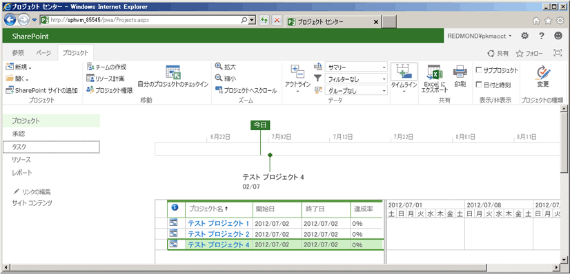

# <a name="getting-started-with-the-project-server-csom-and-net"></a><span data-ttu-id="631cb-105">Project Server CSOM と .NET の使用を開始する</span><span class="sxs-lookup"><span data-stu-id="631cb-105">Getting started with the Project Server CSOM and .NET</span></span>

<span data-ttu-id="631cb-106">Project Server 2013 のクライアント側オブジェクト モデル (CSOM) を使用して、.NET Framework 4 を使用した Project Online およびオンプレミスのソリューションを開発することができます。</span><span class="sxs-lookup"><span data-stu-id="631cb-106">You can use the Project Server 2013 client-side object model (CSOM) to develop Project Online and on-premises solutions with the .NET Framework 4.</span></span> <span data-ttu-id="631cb-107">この記事では、CSOM を使用するコンソール アプリケーションを作成して、プロジェクトを作成および発行する方法について説明します。</span><span class="sxs-lookup"><span data-stu-id="631cb-107">This article describes how to create a console application that uses the CSOM to create and publish projects.</span></span> <span data-ttu-id="631cb-108">プロジェクトの発行後、このアプリケーションは Project Server Queue Service による発行操作の終了を待機してから、発行されたプロジェクトのリストを示します。</span><span class="sxs-lookup"><span data-stu-id="631cb-108">After publishing a project, the application waits for the Project Server Queue Service to finish with the publish action, and then lists the published projects.</span></span>
  
<span data-ttu-id="631cb-109">Project Server CSOM の一般的な概要については、「[Project 2013 の開発者向け更新プログラム](updates-for-developers-in-project-2013.md)」を参照してください。</span><span class="sxs-lookup"><span data-stu-id="631cb-109">For a general introduction to the Project Server CSOM, see What's new for developers in Project 2013. For reference topics in the CSOM namespace, see N:Microsoft.ProjectServer.Client.</span></span> <span data-ttu-id="631cb-110">CSOM 名前空間のリファレンス トピックについては、[Microsoft.ProjectServer.Client](https://msdn.microsoft.com/library/Microsoft.ProjectServer.Client.aspx) を参照してください。</span><span class="sxs-lookup"><span data-stu-id="631cb-110">For reference topics in the CSOM namespace, see [Microsoft.ProjectServer.Client](https://msdn.microsoft.com/library/Microsoft.ProjectServer.Client.aspx) .</span></span> 
  
## <a name="creating-a-csom-project-in-visual-studio"></a><span data-ttu-id="631cb-111">Visual Studio で CSOM プロジェクトを作成する</span><span class="sxs-lookup"><span data-stu-id="631cb-111">Creating a CSOM project in Visual Studio</span></span>
<span data-ttu-id="631cb-112"><a name="pj15_GettingStartedCSOM_CreatingVSProject"> </a></span><span class="sxs-lookup"><span data-stu-id="631cb-112"></span></span>

<span data-ttu-id="631cb-113">Project Server CSOM を使用するソリューションの開発には、Visual Studio 2010 または Visual Studio 2012 を使用できます。</span><span class="sxs-lookup"><span data-stu-id="631cb-113">You can use Visual Studio 2010 or Visual Studio 2012 to develop solutions that use the Project Server CSOM.</span></span> <span data-ttu-id="631cb-114">Project Server CSOM には、.NET Framework 4 を使用してクライアント アプリケーション、Microsoft Silverlight アプリケーション、および Windows Phone 8 アプリケーションを開発するための 3 つのアセンブリが含まれています。</span><span class="sxs-lookup"><span data-stu-id="631cb-114">The Project Server CSOM includes three assemblies for development of client applications, Microsoft Silverlight applications, and Windows Phone 8 applications by using the .NET Framework 4.</span></span> <span data-ttu-id="631cb-115">また、CSOM には Web アプリケーション開発のための JavaScript ファイルも含まれています ([Microsoft.ProjectServer.Client](https://msdn.microsoft.com/library/Microsoft.ProjectServer.Client.aspx) を参照)。</span><span class="sxs-lookup"><span data-stu-id="631cb-115">The CSOM also includes a JavaScript file for development of web applications, as described in [Microsoft.ProjectServer.Client](https://msdn.microsoft.com/library/Microsoft.ProjectServer.Client.aspx) .</span></span> 
  
<span data-ttu-id="631cb-116">Project Server コンピューターまたは Project 2013 SDK ダウンロード ファイルからリモートの開発用コンピューターに必要な CSOM アセンブリをコピーできます。</span><span class="sxs-lookup"><span data-stu-id="631cb-116">You can copy the CSOM assembly that you need from the Project Server computer or from the Project 2013 SDK download to a remote development computer.</span></span> <span data-ttu-id="631cb-117">このトピックで説明する **QueueCreateProject** コンソール アプリケーションは、Silverlight アプリケーションまたは Windows Phone 8 アプリケーションのどちらでもないため、Microsoft.ProjectServer.Client.dll アセンブリが必要になります。</span><span class="sxs-lookup"><span data-stu-id="631cb-117">The **QueueCreateProject** console application that is described in this topic is not a Silverlight application or a Windows Phone 8 application, so you need the Microsoft.ProjectServer.Client.dll assembly.</span></span> <span data-ttu-id="631cb-118">CSOM は WCF ベースまたは ASMX ベースの Project Server Interface (PSI) とは無関係なため、PSI のサービス参照を設定する必要も、**Microsoft.Office.Project.Server.Library** 名前空間を使用する必要もありません。</span><span class="sxs-lookup"><span data-stu-id="631cb-118">Because the CSOM is independent of the WCF-based or ASMX-based Project Server Interface (PSI), you do not have to set service references for the PSI or use the **Microsoft.Office.Project.Server.Library** namespace.</span></span> 
  
<span data-ttu-id="631cb-p106">**QueueCreateProject** アプリケーションでは、作成するプロジェクトの名前とキューのタイムアウト制限をコマンド ライン引数で指定します。手順 1 では、基本的なコンソール アプリケーションを作成し、コマンド ラインを解析するルーチンを追加し、コマンド ラインでエラーが発生した場合に使用方法を説明するメッセージを追加します。</span><span class="sxs-lookup"><span data-stu-id="631cb-p106">The **QueueCreateProject** application uses command-line arguments for the name of the project to create and for the queue timeout limit. In Procedure 1, you create the basic console application, add a routine to parse the command line, and add a usage message if there are errors in the command line.</span></span> 
  
### <a name="procedure-1-to-create-a-csom-project-in-visual-studio"></a><span data-ttu-id="631cb-p107">手順 1. Visual Studio で CSOM プロジェクトを作成するには</span><span class="sxs-lookup"><span data-stu-id="631cb-p107">Procedure 1. To create a CSOM project in Visual Studio</span></span>

1. <span data-ttu-id="631cb-123">`%ProgramFiles%\Common Files\Microsoft Shared\Web Server Extensions\15\ISAPI\` フォルダーから開発用コンピューターに、Microsoft.ProjectServer.Client.dll アセンブリをコピーします。</span><span class="sxs-lookup"><span data-stu-id="631cb-123">Copy the Microsoft.ProjectServer.Client.dll assembly from the  `%ProgramFiles%\Common Files\Microsoft Shared\Web Server Extensions\15\ISAPI\` folder to your development computer.</span></span> <span data-ttu-id="631cb-124">別の Project Server および SharePoint 参照アセンブリで使用する際に便利なフォルダー (`C:\Project\Assemblies`) にアセンブリをコピーします。</span><span class="sxs-lookup"><span data-stu-id="631cb-124">Copy the Microsoft.ProjectServer.Client.dll assembly from the %ProgramFiles%\Common Files\Microsoft Shared\Web Server Extensions\15\ISAPI\ `C:\Project\Assemblies` folder to your development computer. Copy the assembly to a convenient folder for other Project Server and SharePoint reference assemblies that you will use, such as C:\Project\Assemblies.</span></span>
    
2. <span data-ttu-id="631cb-p109">Microsoft.SharePoint.Client.dll アセンブリと Microsoft.SharePoint.Client.Runtime.dll アセンブリを同じソース フォルダーから開発コンピューターにコピーします。Microsoft.ProjectServer.Client.dll アセンブリは関連する SharePoint アセンブリに依存します。</span><span class="sxs-lookup"><span data-stu-id="631cb-p109">Copy the Microsoft.SharePoint.Client.dll assembly and the Microsoft.SharePoint.Client.Runtime.dll assembly from the same source folder to your development computer. The Microsoft.ProjectServer.Client.dll assembly has dependencies on the related SharePoint assemblies.</span></span>
    
3. <span data-ttu-id="631cb-127">Visual Studio で、Windows コンソール アプリケーションを作成して、ターゲット フレームワークを .NET Framework 4 に設定します。</span><span class="sxs-lookup"><span data-stu-id="631cb-127">In Visual Studio, create a Windows console application, and set the target framework to .NET Framework 4.</span></span> <span data-ttu-id="631cb-128">例として、アプリケーションの名前を「QueueCreateProject」にします。</span><span class="sxs-lookup"><span data-stu-id="631cb-128">For example, name the application QueueCreateProject.</span></span>
    
   > [!NOTE]
   > <span data-ttu-id="631cb-p111">適切なターゲットの設定を忘れた場合、Visual Studio でプロジェクトを作成した後で、[**プロジェクト**] メニューの [**QueueCreateProject のプロパティ**] を開きます。[**アプリケーション**] タブの [**対象のフレームワーク**] ドロップダウン リストで、[**.NET Framework 4**] を選択します。[**.NET Framework 4 Client Profile**] は使用しないでください。</span><span class="sxs-lookup"><span data-stu-id="631cb-p111">If you forget to set the correct target, after Visual Studio creates the project, open **QueueCreateProject Properties** in the **Project** menu. On the **Application** tab, in the **Target framework** drop-down list, choose **.NET Framework 4**. Do not use the **.NET Framework 4 Client Profile**.</span></span> 
  
4. <span data-ttu-id="631cb-132">ソリューション エクスプローラーで、次のアセンブリへの参照を設定します。</span><span class="sxs-lookup"><span data-stu-id="631cb-132">In Solution Explorer, set references to the following assemblies:</span></span>
    
   - <span data-ttu-id="631cb-133">Microsoft.ProjectServer.Client.dll</span><span class="sxs-lookup"><span data-stu-id="631cb-133">Microsoft.ProjectServer.Client.dll</span></span>
   - <span data-ttu-id="631cb-134">Microsoft.SharePoint.Client.dll</span><span class="sxs-lookup"><span data-stu-id="631cb-134">Microsoft.SharePoint.Client.dll</span></span>
   - <span data-ttu-id="631cb-135">Microsoft.SharePoint.Client.Runtime.dll</span><span class="sxs-lookup"><span data-stu-id="631cb-135">Microsoft.SharePoint.Client.Runtime.dll</span></span>
    
5. <span data-ttu-id="631cb-136">Program.cs ファイルで、`using` ステートメントを次のように編集します。</span><span class="sxs-lookup"><span data-stu-id="631cb-136">In the Program.cs file, edit the using`using` statements, as follows.</span></span> 
    
   ```cs
    using System;
    using System.Collections.Generic;
    using System.Linq;
    using System.Text;
    using Microsoft.ProjectServer.Client;
   ```

6. <span data-ttu-id="631cb-p112">プロジェクト名とキューのタイムアウト秒数を示すコマンド ライン引数を解析するメソッドを追加し、使用法の情報を表示して、アプリケーションを終了します。Program.cs ファイルのコードの本文を次のコードに置き換えます。</span><span class="sxs-lookup"><span data-stu-id="631cb-p112">Add methods to parse the command-line arguments for the project name and the number of seconds for queue timeout, show usage information, and exit the application. Replace the main body of code in the Program.cs file with the following code.</span></span>
    
   ```cs
    namespace QueueCreateProject
    {
        class Program
        {
            static void Main(string[] args)
            {
                if (!ParseCommandLine(args))
                {
                    Usage();
                    ExitApp();
                }
                /* Add calls to methods here to get the project context and create a project. */
                ExitApp();
            }
            // Parse the command line. Return true if there are no errors.
            private static bool ParseCommandLine(string[] args)
            {
                bool error = false;
                int argsLen = args.Length;
                try
                {
                    for (int i = 0; i < argsLen; i++)
                    {
                        if (error) break;
                        if (args[i].StartsWith("-") || args[i].StartsWith("/"))
                            args[i] = "*" + args[i].Substring(1).ToLower();
                        switch (args[i])
                        {
                            case "*projname":
                            case "*n":
                                if (++i >= argsLen) return false;
                                projName = args[i];
                                break;
                            case "*timeout":
                            case "*t":
                                if (++i >= argsLen) return false;
                                timeoutSeconds = Convert.ToInt32(args[i]);
                                break;
                            case "*?":
                            default:
                                error = true;
                                break;
                        }
                    }
                }
                catch (FormatException)
                {
                    error = true;
                }
                if (string.IsNullOrEmpty(projName)) error = true;
                return !error;
            }
            private static void Usage()
            {
                string example = "Usage: QueueCreateProject -projName | -n \"New project name\" [-timeout | -t sec]";
                example += "\nExample: QueueCreateProject -n \"My new project\"";
                example += "\nDefault timeout seconds = " + timeoutSeconds.ToString();
                Console.WriteLine(example);
            }
            private static void ExitApp()
            {
                Console.Write("\nPress any key to exit... ");
                Console.ReadKey(true);
                Environment.Exit(0);
            }
        }
    }
   ```

## <a name="getting-the-project-context"></a><span data-ttu-id="631cb-139">プロジェクトのコンテキストを取得する</span><span class="sxs-lookup"><span data-stu-id="631cb-139">Getting the project context</span></span>
<span data-ttu-id="631cb-140"><a name="pj15_GettingStartedCSOM_GettingContext"> </a></span><span class="sxs-lookup"><span data-stu-id="631cb-140"></span></span>

<span data-ttu-id="631cb-141">CSOM の開発には、Project Web App の URL で初期化することになる **ProjectContext** オブジェクトが必要になります。</span><span class="sxs-lookup"><span data-stu-id="631cb-141">CSOM development requires the **ProjectContext** object to be initialized with the Project Web App URL.</span></span> <span data-ttu-id="631cb-142">「手順 2」のコードでは、**pwaPath** を使用します。</span><span class="sxs-lookup"><span data-stu-id="631cb-142">The code in Procedure 2 uses the **pwaPath** constant.</span></span> <span data-ttu-id="631cb-143">Project Web App の複数のインスタンスにアプリケーションを使用する場合は、**pwaPath** を変数にして、もう 1 つのコマンドライン引数を追加します。</span><span class="sxs-lookup"><span data-stu-id="631cb-143">If you plan to use the application for multiple instances of Project Web App, you could make **pwaPath** a variable and add another command-line argument.</span></span> 
  
### <a name="procedure-2-to-get-the-project-context"></a><span data-ttu-id="631cb-p114">手順 2. プロジェクト コンテキストを取得するには</span><span class="sxs-lookup"><span data-stu-id="631cb-p114">Procedure 2. To get the project context</span></span>

1. <span data-ttu-id="631cb-146">**QueueCreateProject** アプリケーションで使用する、**Program** クラスの定数と変数を追加します。</span><span class="sxs-lookup"><span data-stu-id="631cb-146">Add **Program** class constants and variables that the **QueueCreateProject** application will use.</span></span> <span data-ttu-id="631cb-147">Project Web App の URL に加えて、このアプリケーションでは、既定のエンタープライズ プロジェクトの種類 (EPT) の名前、作成するプロジェクトの名前、およびキューの最大タイムアウト (秒数) を使用します。</span><span class="sxs-lookup"><span data-stu-id="631cb-147">In addition to the Project Web App URL, the application uses the name of the default enterprise project type (EPT), the name of the project to create, and a maximum queue timeout in seconds.</span></span> <span data-ttu-id="631cb-148">この場合、**timeoutSeconds** 変数を使用することで、さまざまなタイムアウトの値によるアプリケーションへの影響をテストできます。</span><span class="sxs-lookup"><span data-stu-id="631cb-148">In this case, the **timeoutSeconds** variable enables you to test how various values for the timeout affect the application.</span></span> <span data-ttu-id="631cb-149">**ProjectContext** オブジェクトは、CSOM にアクセスするためのプライマリ オブジェクトです。</span><span class="sxs-lookup"><span data-stu-id="631cb-149">The **ProjectContext** object is the primary object for access to the CSOM.</span></span> 
    
   ```cs
    private const string pwaPath = "https://ServerName /pwa/"; // Change the path to your Project Web App instance.
    private static string basicEpt = "Enterprise Project";   // Basic enterprise project type.
    private static string projName = string.Empty;
    private static int timeoutSeconds = 10;  // The maximum wait time for a queue job, in seconds.
    private static ProjectContext projContext;
   ```

2. <span data-ttu-id="631cb-150">`/* Add calls to methods here to get the project context and create a project. */` コメントを次のコードに置き換えます。</span><span class="sxs-lookup"><span data-stu-id="631cb-150">Replace the `/* Add calls to methods here to get the project context and create a project. */` with the following code.</span></span> <span data-ttu-id="631cb-151">**Microsoft.ProjectServer.Client.ProjectContext** オブジェクトは、Project Web App の URL で初期化します。</span><span class="sxs-lookup"><span data-stu-id="631cb-151">The **Microsoft.ProjectServer.Client.ProjectContext** object is initialized with the Project Web App URL.</span></span> <span data-ttu-id="631cb-152">**CreateTestProject** メソッドと **ListPublishedProjects** メソッドは、「手順 4」と「手順 5」で示します。</span><span class="sxs-lookup"><span data-stu-id="631cb-152">The **CreateTestProject** method and the **ListPublishedProjects** method are shown in Procedure 4 and Procedure 5.</span></span> 
    
   ```cs
    projContext = new ProjectContext(pwaPath);
    if (CreateTestProject())
        ListPublishedProjects();
    else
        Console.WriteLine("\nProject creation failed: {0}", projName);
   ```

## <a name="getting-an-enterprise-project-type"></a><span data-ttu-id="631cb-153">エンタープライズ プロジェクトの種類を取得する</span><span class="sxs-lookup"><span data-stu-id="631cb-153">Getting an enterprise project type</span></span>
<span data-ttu-id="631cb-154"><a name="pj15_GettingStartedCSOM_GettingEPT"> </a></span><span class="sxs-lookup"><span data-stu-id="631cb-154"></span></span>

<span data-ttu-id="631cb-p117">**QueueCreateProject** サンプル アプリケーションでは、エンタープライズ プロジェクト テンプレート (EPT) を明示的に選択して、アプリケーションでのプロジェクトの EPT の選択方法を示しています。プロジェクトの作成情報に EPT の GUID が指定されていない場合、アプリケーションは既定の EPT を使用します。**GetEptUid** メソッドは、手順 4 で説明されている **CreateTestProject** メソッドで使用されます。</span><span class="sxs-lookup"><span data-stu-id="631cb-p117">The **QueueCreateProject** sample application explicitly selects the Enterprise Project EPT, to show how an application can select the EPT for a project. If the project creation information does not specify the EPT GUID, an application would use the default EPT. The **GetEptUid** method is used by the **CreateTestProject** method that is described in Procedure 4.</span></span> 
  
<span data-ttu-id="631cb-p118">**GetEptUid** メソッドは、**EnterpriseProjectTypes** のコレクションに対し、EPT 名が指定した名前と等しい **ProjectContext** オブジェクトに対してクエリを実行します。クエリの実行後、**eptUid** 変数は **eptList** コレクションの最初の **EnterpriseProjectType** オブジェクトの GUID に設定されます。EPT 名は一意であるため、指定した名前を持つ **EnterpriseProjectType** オブジェクトは 1 つのみ存在します。</span><span class="sxs-lookup"><span data-stu-id="631cb-p118">The **GetEptUid** method queries the **ProjectContext** object for the collection of **EnterpriseProjectTypes** where the EPT name equals the specified name. After executing the query, the **eptUid** variable is set to the GUID of the first **EnterpriseProjectType** object in the **eptList** collection. Because EPT names are unique, there is only one **EnterpriseProjectType** object that has the specified name.</span></span> 
  
### <a name="procedure-3-to-get-the-guid-of-an-ept-for-a-new-project"></a><span data-ttu-id="631cb-p119">手順 3. 新しいプロジェクトの EPT の GUID を取得するには</span><span class="sxs-lookup"><span data-stu-id="631cb-p119">Procedure 3. To get the GUID of an EPT for a new project</span></span>

- <span data-ttu-id="631cb-163">**Program** クラスに **GetEptUid** メソッドを追加します。</span><span class="sxs-lookup"><span data-stu-id="631cb-163">Add the **GetEptUid** method to the **Program** class.</span></span> 
    
   ```cs
    // Get the GUID of the specified enterprise project type.
    private static Guid GetEptUid(string eptName)
    {
        Guid eptUid = Guid.Empty;
        try
        {
            // Get the list of EPTs that have the specified name. 
            // If the EPT name exists, the list will contain only one EPT.
            var eptList = projContext.LoadQuery(
                projContext.EnterpriseProjectTypes.Where(
                    ept => ept.Name == eptName));
            projContext.ExecuteQuery();
            eptUid = eptList.First().Id;
        }
        catch (Exception ex)
        {
            string msg = string.Format("GetEptUid: eptName = \"{0}\"\n\n{1}",
                eptName, ex.GetBaseException().ToString());
            throw new ArgumentException(msg);
        }
        return eptUid;
    }
   ```

<span data-ttu-id="631cb-p120">EPT の GUID の検索方法はいくつかあります。**GetEptUid** メソッドで示されているクエリは、EPT 名と一致する **EnterpriseProjectType** オブジェクトを 1 つだけダウンロードするため、効率的です。次に示す代替ルーチンは、EPT のリスト全体をクライアント アプリケーションにダウンロードしてリストを反復処理するため、効率が低くなります。</span><span class="sxs-lookup"><span data-stu-id="631cb-p120">There are several ways to find the EPT GUID. The query shown in the **GetEptUid** method is efficient because it downloads only the one **EnterpriseProjectType** object that matches the EPT name. The following alternate routine is less efficient, because it downloads the complete list of EPTs to the client application and iterates through the list.</span></span> 

```cs
foreach (EnterpriseProjectType ept in projSvr.EnterpriseProjectTypes)
{
    if (ept.Name == eptName)
    {
        eptUid = ept.Id;
        break;
    }
}
```

<span data-ttu-id="631cb-167">次のルーチンでは、LINQ クエリとラムダ式を使用して EPT オブジェクト選択していますが、依然として **EnterpriseProjectType** オブジェクトのすべてをダウンロードしています。</span><span class="sxs-lookup"><span data-stu-id="631cb-167">The following routine uses a LINQ query and lambda expression to select the EPT object, but still downloads all of the **EnterpriseProjectType** objects.</span></span> 

```cs
var eptList = projContext.LoadQuery(projContext.EnterpriseProjectTypes);
projContext.ExecuteQuery();
eptUid = eptList.First(ept => ept.Name == eptName).Id;
```

## <a name="setting-the-creation-information-and-publishing-the-project"></a><span data-ttu-id="631cb-168">作成情報を設定してプロジェクトを発行する</span><span class="sxs-lookup"><span data-stu-id="631cb-168">Setting the creation information and publishing the project</span></span>
<span data-ttu-id="631cb-169"><a name="pj15_GettingStartedCSOM_ProjectCreation"> </a></span><span class="sxs-lookup"><span data-stu-id="631cb-169"></span></span>

<span data-ttu-id="631cb-p121">**CreateTestProject** メソッドは **ProjectCreationInformation** オブジェクトを作成し、プロジェクトの作成に必要な情報を指定します。プロジェクトの GUID と名前は必須であり、開始日、プロジェクトの説明、EPT の GUID は省略可能です。</span><span class="sxs-lookup"><span data-stu-id="631cb-p121">The **CreateTestProject** method creates a **ProjectCreationInformation** object and specifies the information that is required to create a project. The project GUID and name are required; the start date, project description, and EPT GUID are optional.</span></span> 
  
<span data-ttu-id="631cb-p122">新しいプロジェクトのプロパティを設定した後、**Projects.Add** メソッドでプロジェクトを **Projects** コレクションに追加します。プロジェクトを保存して発行するには、**Projects.Update** メソッドを呼び出して Project Server キューにメッセージを送信し、プロジェクトを作成します。</span><span class="sxs-lookup"><span data-stu-id="631cb-p122">After setting the new project properties, the **Projects.Add** method adds the project to the **Projects** collection. To save and publish the project, you must call the **Projects.Update** method to send a message to the Project Server queue and create the project.</span></span> 
  
### <a name="procedure-4-to-set-the-new-project-properties-create-the-project-and-publish-the-project"></a><span data-ttu-id="631cb-p123">手順 4. 新しいプロジェクトのプロパティを設定し、プロジェクトを作成して、プロジェクトを発行するには</span><span class="sxs-lookup"><span data-stu-id="631cb-p123">Procedure 4. To set the new project properties, create the project, and publish the project</span></span>

1. <span data-ttu-id="631cb-p124">**CreateTestProject** メソッドを **Program** クラスに追加します。次のコードではプロジェクトを作成して発行しますが、キューのジョブが完了するまで待機しません。</span><span class="sxs-lookup"><span data-stu-id="631cb-p124">Add the **CreateTestProject** method to the **Program** class. The following code creates and publishes a project, but does not wait for the queue job to complete.</span></span> 
    
   ```cs
    // Create a project.
    private static bool CreateTestProject()
    {
        bool projCreated = false;
        try
        {
            Console.Write("\nCreating project: {0} ...", projName);
            ProjectCreationInformation newProj = new ProjectCreationInformation();
            newProj.Id = Guid.NewGuid();
            newProj.Name = projName;
            newProj.Description = "Test creating a project with CSOM";
            newProj.Start = DateTime.Today.Date;
            // Setting the EPT GUID is optional. If no EPT is specified, Project Server  
            // uses the default EPT. 
            newProj.EnterpriseProjectTypeId = GetEptUid(basicEpt);
            PublishedProject newPublishedProj = projContext.Projects.Add(newProj);
            QueueJob qJob = projContext.Projects.Update();
            /* Add code here to wait for the queue. */
        }
        catch(Exception ex)
        {
            Console.ForegroundColor = ConsoleColor.Red;
            Console.WriteLine("\nError: {0}", ex.Message);
            Console.ResetColor();
        }
        return projCreated;
    }
   ```

2. <span data-ttu-id="631cb-178">`/* Add code here to wait for the queue. */` コメントを次のコードに置き換えて、キュー ジョブを待機するようにします。</span><span class="sxs-lookup"><span data-stu-id="631cb-178">Replace the  `/* Add code here to wait for the queue. */` comment with the following code to wait for the queue job.</span></span> <span data-ttu-id="631cb-179">このルーチンは、指定した **timeoutSeconds** の秒数まで待機します。タイムアウトの前にキュー ジョブが完了した場合は処理を進めます。</span><span class="sxs-lookup"><span data-stu-id="631cb-179">The routine waits a maximum of the specified **timeoutSeconds** number of seconds, or proceeds if the queue job completes before the timeout.</span></span> <span data-ttu-id="631cb-180">考えられるキュー ジョブの状態については、[Microsoft.ProjectServer.Client.JobState](https://msdn.microsoft.com/library/Microsoft.ProjectServer.Client.JobState.aspx) を参照してください。</span><span class="sxs-lookup"><span data-stu-id="631cb-180">For possible queue job states, see [Microsoft.ProjectServer.Client.JobState](https://msdn.microsoft.com/library/Microsoft.ProjectServer.Client.JobState.aspx) .</span></span> 
    
   <span data-ttu-id="631cb-p126">**QueueJob** オブジェクトの **Load** メソッドおよび **ExecuteQuery** メソッドの呼び出しは省略可能です。**WaitForQueue** メソッドの呼び出し時に **QueueJob** オブジェクトが未初期化の場合、Project Server で初期化されます。</span><span class="sxs-lookup"><span data-stu-id="631cb-p126">Calling the **Load** method and the **ExecuteQuery** method for the **QueueJob** object is optional. If the **QueueJob** object is not initialized when you call the **WaitForQueue** method, Project Server initializes it.</span></span> 
    
   ```cs
    // Calling Load and ExecuteQuery for the queue job is optional.
    // projContext.Load(qJob);
    // projContext.ExecuteQuery();
    JobState jobState = projContext.WaitForQueue(qJob, timeoutSeconds);
    if (jobState == JobState.Success)
    {
        projCreated = true;
    }
    else
    {
        Console.ForegroundColor = ConsoleColor.Yellow;
        Console.WriteLine("\nThere is a problem in the queue. Timeout is {0} seconds.", 
            timeoutSeconds);
        Console.WriteLine("\tQueue JobState: {0}", jobState.ToString());
        Console.ResetColor();
    }
    Console.WriteLine();
   ```

## <a name="listing-the-published-projects"></a><span data-ttu-id="631cb-183">発行したプロジェクトをリスト表示する</span><span class="sxs-lookup"><span data-stu-id="631cb-183">Listing the published projects</span></span>
<span data-ttu-id="631cb-184"><a name="pj15_GettingStartedCSOM_ListingPublished"> </a></span><span class="sxs-lookup"><span data-stu-id="631cb-184"></span></span>

<span data-ttu-id="631cb-185">**ListPublishedProjects** メソッドは、Project Web App で発行されたすべてのプロジェクトのコレクションを取得します。</span><span class="sxs-lookup"><span data-stu-id="631cb-185">The **ListPublishedProjects** method gets the collection of all projects that are published in Project Web App.</span></span> <span data-ttu-id="631cb-186">「手順 4」のプロジェクトを作成するキュー ジョブが正常に終了しなかった場合やタイムアウトになった場合は、新しいプロジェクトが **Projects** コレクションに含まれなくなります。</span><span class="sxs-lookup"><span data-stu-id="631cb-186">The **ListPublishedProjects** method gets the collection of all projects that are published in pwa. If the queue job that creates a project in Procedure 4 does not complete successfully or times out, the new project is not included in the Projects collection.</span></span> 
  
### <a name="procedure-5-to-list-the-published-projects"></a><span data-ttu-id="631cb-p128">手順 5. 発行したプロジェクトをリスト表示するには</span><span class="sxs-lookup"><span data-stu-id="631cb-p128">Procedure 5. To list the published projects</span></span>

1. <span data-ttu-id="631cb-189">**Program** クラスに **ListPublishedProjects** メソッドを追加します。</span><span class="sxs-lookup"><span data-stu-id="631cb-189">Add the **ListPublishedProjects** method to the **Program** class.</span></span> 
    
   ```cs
    // List the published projects.
    private static void ListPublishedProjects()
    {
        // Get the list of projects on the server.
        projContext.Load(projContext.Projects);
        projContext.ExecuteQuery();
        Console.WriteLine("\nProject ID : Project name : Created date");
        foreach (PublishedProject pubProj in projContext.Projects)
        {
            Console.WriteLine("\n\t{0} :\n\t{1} : {2}", pubProj.Id.ToString(), pubProj.Name,
                pubProj.CreatedDate.ToString());
        }
    }
   ```

2. <span data-ttu-id="631cb-190">Project Web App の URL に適切な値を設定し、**QueueCreateProject** アプリケーションをコンパイルして、「手順 6」に示すようにアプリケーションをテストします。</span><span class="sxs-lookup"><span data-stu-id="631cb-190">Set the correct value for your pwa URL, compile the QueueCreateProject application, and then test the application as in Procedure 6.</span></span> 
    
## <a name="testing-the-queuecreateproject-application"></a><span data-ttu-id="631cb-191">QueueCreateProject アプリケーションをテストする</span><span class="sxs-lookup"><span data-stu-id="631cb-191">Testing the QueueCreateProject application</span></span>
<span data-ttu-id="631cb-192"><a name="pj15_GettingStartedCSOM_Testing"> </a></span><span class="sxs-lookup"><span data-stu-id="631cb-192"></span></span>

<span data-ttu-id="631cb-193">Project Web App のテスト インスタンスで最初に **QueueCreateProject** アプリケーションを実行する場合、特に Project Server が仮想マシンにインストールされているときには、アプリケーションの実行に既定のキューのタイムアウトである 10 秒より長い時間がかかることがあります。</span><span class="sxs-lookup"><span data-stu-id="631cb-193">When you first run the QueueCreateProject application on a test instance of pwa, especially if Project Server is installed on a virtual machine, the application may require more time to run than the default queue timeout of ten seconds.</span></span> 
  
### <a name="procedure-6-to-test-the-queuecreateproject-application"></a><span data-ttu-id="631cb-p129">手順 6. QueueCreateProject アプリケーションをテストするには</span><span class="sxs-lookup"><span data-stu-id="631cb-p129">Procedure 6. To test the QueueCreateProject application</span></span>

1. <span data-ttu-id="631cb-196">**[QueueCreateProject Properties]** ウィンドウを開いて、**[Debug]** タブを選択し、**[Start Options]** セクションでコマンドライン引数の `-n "Test proj 1" -t 20` を追加します。</span><span class="sxs-lookup"><span data-stu-id="631cb-196">Open the **QueueCreateProject Properties** window, select the **Debug** tab, and then add the following command-line arguments in the **Start Options** section: -n "Test proj 1" -t 20`-n "Test proj 1" -t 20`</span></span>
    
   <span data-ttu-id="631cb-197">アプリケーションを実行します (たとえば、**F5** キーを押します)。</span><span class="sxs-lookup"><span data-stu-id="631cb-197">Run the application (for example, press **F5**).</span></span> <span data-ttu-id="631cb-198">タイムアウト値の長さが十分であれば、アプリケーションは次の結果を示します (その他の発行済みプロジェクトが Project Web App インスタンスに存在する場合は、そのプロジェクトも表示されます)。</span><span class="sxs-lookup"><span data-stu-id="631cb-198">Run the application (for example, press F5). If the timeout value is long enough, the application shows the following output (if other published projects exist in your pwa instance, they will also be shown):</span></span>
    
   ```MS-DOS
    Creating project: Test proj 1 ...
    Project ID : Project name : Created date
            b34d7009-753f-4abb-9191-f4b15a82aac3 :
            Test proj 1 : 9/22/2011 11:27:57 AM
    Press any key to exit...
   ```

2. <span data-ttu-id="631cb-199">キューのタイムアウトに既定の 10 秒を使用するには、コマンドライン引数 `-n "Test proj 1"` で再度テストを実行します。</span><span class="sxs-lookup"><span data-stu-id="631cb-199">Run another test with the following command-line arguments, to use the default 10-second queue timeout: -n "Test proj 1" `-n "Test proj 1"`</span></span>
    
   <span data-ttu-id="631cb-200">Test proj 1 は既に存在しているため、アプリケーションの出力は次のようになります。</span><span class="sxs-lookup"><span data-stu-id="631cb-200">Because Test proj 1 already exists, the application shows the following output.</span></span>
    
   ```MS-DOS
    Creating project: Test proj 1 ...
    Error: PJClientCallableException: ProjectNameAlreadyExists
    ProjectNameAlreadyExists
    projName = Test proj 1
    Project creation failed: Test proj 1
    Press any key to exit...
   ```

3. <span data-ttu-id="631cb-201">キューのタイムアウトに既定の 10 秒を使用するには、コマンドライン引数 `-n "Test proj 2"` で再度テストを実行します。</span><span class="sxs-lookup"><span data-stu-id="631cb-201">Run another test with the following command-line arguments, to use the default 10-second queue timeout: -n "Test proj 2" `-n "Test proj 2"`</span></span>
    
   <span data-ttu-id="631cb-202">**QueueCreateProject** アプリケーションは、Test proj 2 という名前のプロジェクトを作成して発行します。</span><span class="sxs-lookup"><span data-stu-id="631cb-202">The **QueueCreateProject** application creates and publishes the project named Test proj 2.</span></span> 
    
4. <span data-ttu-id="631cb-203">コマンドライン引数 `-n "Test proj 3" -t 1` で再度テストを実行しますが、キュー ジョブの完了には短すぎるタイムアウトを設定します。</span><span class="sxs-lookup"><span data-stu-id="631cb-203">Run another test with the following command-line arguments, and set the timeout to be too short for the queue job to finish: -n "Test proj 3" –t 1`-n "Test proj 3" -t 1`</span></span>
    
   <span data-ttu-id="631cb-p131">キューのタイムアウトが短すぎるため、プロジェクトは作成されません。アプリケーションの出力は次のようになります。</span><span class="sxs-lookup"><span data-stu-id="631cb-p131">Because the queue timeout is too short, the project is not created. The application shows the following output.</span></span>
    
   ```MS-DOS
    Creating project: Test proj 3 ...
    There is a problem in the queue. Timeout is 1 seconds.
            Queue JobState: Unknown
    Project creation failed: Test proj 3
    Press any key to exit...
   ```

5. <span data-ttu-id="631cb-206">アプリケーションがキュー ジョブを待機しないようにコードを変更します。</span><span class="sxs-lookup"><span data-stu-id="631cb-206">Modify the code so that the application does not wait for the queue job.</span></span> <span data-ttu-id="631cb-207">たとえば、次に示すように、`projCreated = true` の行以外のキューを待機するコードをコメント アウトします。</span><span class="sxs-lookup"><span data-stu-id="631cb-207">Modify the code so that the application does not wait for the queue job. For example, comment out the code that waits for the queue, except for the projCreated = true`projCreated = true` line, as follows.</span></span> 
    
   ```cs
    //JobState jobState = projContext.WaitForQueue(qJob, timeoutSeconds);
    //if (jobState == JobState.Success)
    //{
    projCreated = true;
    //}
    //else
    //{
    //    Console.ForegroundColor = ConsoleColor.Yellow;
    //    Console.WriteLine("\nThere is a problem in the queue. Timeout is {0} seconds.",
    //        timeoutSeconds);
    //    Console.WriteLine("\tQueue JobState: {0}", jobState.ToString());
    //    Console.ResetColor();
    //}
    
   ```

6. <span data-ttu-id="631cb-208">アプリケーションを再コンパイルして、コマンドライン引数 `-n "Test proj 4"` で再度テストを実行します。</span><span class="sxs-lookup"><span data-stu-id="631cb-208">Recompile the application and run another test with the following command-line arguments: -n "Test proj 4" `-n "Test proj 4"`</span></span>
    
   <span data-ttu-id="631cb-p133">**WaitForQueue** ルーチンがコメント アウトされているため、アプリケーションでは既定のタイムアウト値は使用されません。アプリケーションはキューを待機しませんが、Project Server の発行処理が十分に高速であれば、Test proj 4 が表示される可能性があります。</span><span class="sxs-lookup"><span data-stu-id="631cb-p133">Because the **WaitForQueue** routine is commented out, the application does not use the default timeout value. Even though the application does not wait for the queue, it may show Test proj 4, if the publish action in Project Server is fast enough.</span></span> 
    
   ```MS-DOS
    Creating project: Test proj 4 ...
    Project ID : Project name : Created date
            cdd54103-082f-425c-b075-9ff52ac7d4e6 :
            Test proj 2 : 9/25/2011 4:28:55 PM
            b34d7009-753f-4abb-9191-f4b15a82aac3 :
            Test proj 1 : 9/22/2011 11:27:57 AM
            5c0c73f2-f5dd-499b-8bd8-ebb74bf8c122 :
            Test proj 4 : 9/25/2011 4:39:21 PM
    Press any key to exit...
   ```

<span data-ttu-id="631cb-211">Project Web App の [プロジェクト センター] ページ (`https://ServerName/ProjectServerName/Projects.aspx`) を最新の情報に更新して、発行されたプロジェクトを表示します。</span><span class="sxs-lookup"><span data-stu-id="631cb-211">Refresh the Project Center page in Project Web App (`https://ServerName/ProjectServerName/Projects.aspx`), to show the published projects.</span></span> <span data-ttu-id="631cb-212">次の図はテスト プロジェクトが発行されていることを示しています。</span><span class="sxs-lookup"><span data-stu-id="631cb-212">The following figure shows that the test projects are published.</span></span>

<span data-ttu-id="631cb-213">**Project Web App で発行済みのプロジェクトを確認する**</span><span class="sxs-lookup"><span data-stu-id="631cb-213">**Checking the published projects in Project Web App**</span></span>

<span data-ttu-id="631cb-214"></span><span class="sxs-lookup"><span data-stu-id="631cb-214"></span></span>
  
<span data-ttu-id="631cb-215">**QueueCreateProject** サンプル アプリケーションは、**ProjectCreationInformation** クラスを使用して CSOM でプロジェクト エンティティを作成する方法、発行済みコレクションにプロジェクトを追加する方法、**WaitForQueue** メソッドを使用してキュー ジョブを待機する方法、発行済みプロジェクトのコレクションを列挙する方法の一般的な例を示しています。</span><span class="sxs-lookup"><span data-stu-id="631cb-215">The **QueueCreateProject** sample application shows a typical example of how to create a project entity with the CSOM by using the **ProjectCreationInformation** class, how to add the project to the published Projects collection, how to wait for a queue job by using the **WaitForQueue** method, and how to enumerate the collection of published projects.</span></span> 
  
## <a name="complete-code-example"></a><span data-ttu-id="631cb-216">完全なコード例</span><span class="sxs-lookup"><span data-stu-id="631cb-216">Complete code example</span></span>
<span data-ttu-id="631cb-217"><a name="pj15_GettingStartedCSOM_CompleteCode"> </a></span><span class="sxs-lookup"><span data-stu-id="631cb-217"></span></span>

<span data-ttu-id="631cb-218">**QueueCreateProject** サンプル アプリケーションの完全なコードを次に示します。</span><span class="sxs-lookup"><span data-stu-id="631cb-218">Following is the complete code for the sample console application.</span></span> <span data-ttu-id="631cb-219">このトピックのコードは、[Microsoft.ProjectServer.Client.ProjectCreationInformation](https://msdn.microsoft.com/library/Microsoft.ProjectServer.Client.ProjectCreationInformation.aspx) クラス リファレンスにも含まれています。</span><span class="sxs-lookup"><span data-stu-id="631cb-219">The following is the complete code for the QueueCreateProject sample application. The [T:Microsoft.ProjectServer.Client.ProjectCreationInformation](https://msdn.microsoft.com/library/Microsoft.ProjectServer.Client.ProjectCreationInformation.aspx) class reference also includes the code in this topic.</span></span> 
  
```cs
using System;
using System.Collections.Generic;
using System.Linq;
using System.Text;
using Microsoft.ProjectServer.Client;
namespace QueueCreateProject
{
    class Program
    {
        private const string pwaPath = "https://ServerName /pwa/"; // Change the path to your Project Web App instance.
        private static string basicEpt = "Enterprise Project";   // Basic enterprise project type.
        private static string projName = string.Empty;
        private static int timeoutSeconds = 10;  // The maximum wait time for a queue job, in seconds.
        private static ProjectContext projContext;
        static void Main(string[] args)
        {
            if (!ParseCommandLine(args))
            {
                Usage();
                ExitApp();
            }
            projContext = new ProjectContext(pwaPath);
            if (CreateTestProject())
                ListPublishedProjects();
            else
                Console.WriteLine("\nProject creation failed: {0}", projName);
            ExitApp();
        }
        // Create a project.
        private static bool CreateTestProject()
        {
            bool projCreated = false;
            try
            {
                Console.Write("\nCreating project: {0} ...", projName);
                ProjectCreationInformation newProj = new ProjectCreationInformation();
                newProj.Id = Guid.NewGuid();
                newProj.Name = projName;
                newProj.Description = "Test creating a project with CSOM";
                newProj.Start = DateTime.Today.Date;
                // Setting the EPT GUID is optional. If no EPT is specified, Project Server uses 
                // the default EPT. 
                newProj.EnterpriseProjectTypeId = GetEptUid(basicEpt);
                PublishedProject newPublishedProj = projContext.Projects.Add(newProj);
                QueueJob qJob = projContext.Projects.Update();
                // Calling Load and ExecuteQuery for the queue job is optional. If qJob is 
                // not initialized when you call WaitForQueue, Project Server initializes it.
                // projContext.Load(qJob);
                // projContext.ExecuteQuery();
                JobState jobState = projContext.WaitForQueue(qJob, timeoutSeconds);
                if (jobState == JobState.Success)
                {
                    projCreated = true;
                }
                else
                {
                    Console.ForegroundColor = ConsoleColor.Yellow;
                    Console.WriteLine("\nThere is a problem in the queue. Timeout is {0} seconds.", 
                        timeoutSeconds);
                    Console.WriteLine("\tQueue JobState: {0}", jobState.ToString());
                    Console.ResetColor();
                }
                Console.WriteLine();
            }
            catch(Exception ex)
            {
                Console.ForegroundColor = ConsoleColor.Red;
                Console.WriteLine("\nError: {0}", ex.Message);
                Console.ResetColor();
            }
            return projCreated;
        }
        // Get the GUID of the specified enterprise project type.
        private static Guid GetEptUid(string eptName)
        {
            Guid eptUid = Guid.Empty;
            try
            {
                // Get the list of EPTs that have the specified name. 
                // If the EPT name exists, the list will contain only one EPT.
                var eptList = projContext.LoadQuery(
                    projContext.EnterpriseProjectTypes.Where(
                        ept => ept.Name == eptName));
                projContext.ExecuteQuery();
                eptUid = eptList.First().Id;
                // Alternate routines to find the EPT GUID. Both (a) and (b) download the entire list of EPTs.
                // (a) Using a foreach block:
                //foreach (EnterpriseProjectType ept in projSvr.EnterpriseProjectTypes)
                //{
                //    if (ept.Name == eptName)
                //    {
                //        eptUid = ept.Id;
                //        break;
                //    }
                //}
                // (b) Querying for the EPT list, and then using a lambda expression to select the EPT:
                //var eptList = projContext.LoadQuery(projContext.EnterpriseProjectTypes);
                //projContext.ExecuteQuery();
                //eptUid = eptList.First(ept => ept.Name == eptName).Id;
            }
            catch (Exception ex)
            {
                string msg = string.Format("GetEptUid: eptName = \"{0}\"\n\n{1}",
                    eptName, ex.GetBaseException().ToString());
                throw new ArgumentException(msg);
            }
            return eptUid;
        }
        // List the published projects.
        private static void ListPublishedProjects()
        {
            // Get the list of projects on the server.
            projContext.Load(projContext.Projects);
            projContext.ExecuteQuery();
            Console.WriteLine("\nProject ID : Project name : Created date");
            foreach (PublishedProject pubProj in projContext.Projects)
            {
                Console.WriteLine("\n\t{0} :\n\t{1} : {2}", pubProj.Id.ToString(), pubProj.Name,
                    pubProj.CreatedDate.ToString());
            }
        }
        // Parse the command line. Return true if there are no errors.
        private static bool ParseCommandLine(string[] args)
        {
            bool error = false;
            int argsLen = args.Length;
            try
            {
                for (int i = 0; i < argsLen; i++)
                {
                    if (error) break;
                    if (args[i].StartsWith("-") || args[i].StartsWith("/"))
                        args[i] = "*" + args[i].Substring(1).ToLower();
                    switch (args[i])
                    {
                        case "*projname":
                        case "*n":
                            if (++i >= argsLen) return false;
                            projName = args[i];
                            break;
                        case "*timeout":
                        case "*t":
                            if (++i >= argsLen) return false;
                            timeoutSeconds = Convert.ToInt32(args[i]);
                            break;
                        case "*?":
                        default:
                            error = true;
                            break;
                    }
                }
            }
            catch (FormatException)
            {
                error = true;
            }
            if (string.IsNullOrEmpty(projName)) error = true;
            return !error;
        }
        private static void Usage()
        {
            string example = "Usage: QueueCreateProject -projName | -n \"New project name\" [-timeout | -t sec]";
            example += "\nExample: QueueCreateProject -n \"My new project\"";
            example += "\nDefault timeout seconds = " + timeoutSeconds.ToString();
            Console.WriteLine(example);
        }
        private static void ExitApp()
        {
            Console.Write("\nPress any key to exit... ");
            Console.ReadKey(true);
            Environment.Exit(0);
        }
    }
}
```

## <a name="see-also"></a><span data-ttu-id="631cb-220">関連項目</span><span class="sxs-lookup"><span data-stu-id="631cb-220">See also</span></span>

- [<span data-ttu-id="631cb-221">Project 2013 における開発者向けの更新内容</span><span class="sxs-lookup"><span data-stu-id="631cb-221">Updates for developers in Project 2013</span></span>](updates-for-developers-in-project-2013.md) 
- [<span data-ttu-id="631cb-222">Project 2013 のクライアント側オブジェクト モデル (CSOM)</span><span class="sxs-lookup"><span data-stu-id="631cb-222">Client-side object model (CSOM) for Project 2013</span></span>](client-side-object-model-csom-for-project-2013.md)
    

