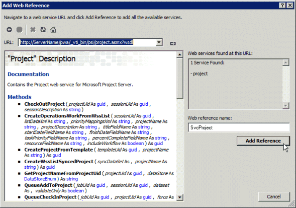

# <a name="prerequisites-for-asmx-based-code-samples-in-project"></a><span data-ttu-id="d7ebf-104">プロジェクトの ASMX ベースのコードサンプルの前提条件</span><span class="sxs-lookup"><span data-stu-id="d7ebf-104">Prerequisites for ASMX-based code samples in Project</span></span>

<span data-ttu-id="d7ebf-105">Project Server Interface (PSI) リファレンストピックに記載されている ASMX ベースのコードサンプルを使用して、Visual Studio でプロジェクトを作成するのに役立つ情報について説明します。</span><span class="sxs-lookup"><span data-stu-id="d7ebf-105">Learn information to help you create projects in Visual Studio by using the ASMX-based code samples that are included in the Project Server Interface (PSI) reference topics.</span></span>
  
<span data-ttu-id="d7ebf-106">[Project Server 2013 のクラスライブラリと web サービス参照](https://msdn.microsoft.com/library/ef1830e0-3c9a-4f98-aa0a-5556c298e7d1%28Office.15%29.aspx)の多くは、Office project 2007 SDK 用に作成されており、ASMX web サービスの標準形式を使用しています。</span><span class="sxs-lookup"><span data-stu-id="d7ebf-106">Many of the code samples included in the [Project Server 2013 class library and web service reference](https://msdn.microsoft.com/library/ef1830e0-3c9a-4f98-aa0a-5556c298e7d1%28Office.15%29.aspx) were originally created for the Office Project 2007 SDK, and use a standard format for ASMX web services.</span></span> <span data-ttu-id="d7ebf-107">サンプルは Project Server 2013 でも動作し、コンソールアプリケーションにコピーして完全なユニットとして実行するように設計されています。</span><span class="sxs-lookup"><span data-stu-id="d7ebf-107">The samples still work in Project Server 2013 and are designed to be copied into a console application and run as a complete unit.</span></span> <span data-ttu-id="d7ebf-108">例外はサンプルに記載されています。</span><span class="sxs-lookup"><span data-stu-id="d7ebf-108">Exceptions are noted in the sample.</span></span> 
  
<span data-ttu-id="d7ebf-109">Project 2013 SDK の新しい PSI サンプルは、Windows Communication Foundation (WCF) サービスを使用する形式に準拠しています。</span><span class="sxs-lookup"><span data-stu-id="d7ebf-109">New PSI samples in the Project 2013 SDK conform to a format that uses Windows Communication Foundation (WCF) services.</span></span> <span data-ttu-id="d7ebf-110">この ASMX ベースのサンプルは、WCF サービスを使用するように調整することもできます。</span><span class="sxs-lookup"><span data-stu-id="d7ebf-110">The ASMX-based samples can also be adapted to use WCF services.</span></span> <span data-ttu-id="d7ebf-111">この記事では、ASMX web サービスでサンプルを使用する方法について説明します。</span><span class="sxs-lookup"><span data-stu-id="d7ebf-111">This article shows how to use the samples with ASMX web services.</span></span> <span data-ttu-id="d7ebf-112">wcf サービスでサンプルを使用する方法については、「 [Project での wcf ベースのコードサンプルの前提条件](prerequisites-for-wcf-based-code-samples-in-project.md)」を参照してください。</span><span class="sxs-lookup"><span data-stu-id="d7ebf-112">For information about using the samples with WCF services, see [Prerequisites for WCF-based code samples in Project](prerequisites-for-wcf-based-code-samples-in-project.md).</span></span>
  
> [!NOTE]
> <span data-ttu-id="d7ebf-113">PSI の ASMX web サービスインターフェイスは、Project Server 2013 では廃止されましたが、まだサポートされています。</span><span class="sxs-lookup"><span data-stu-id="d7ebf-113">The ASMX web service interface of the PSI is deprecated in Project Server 2013, but is still supported.</span></span> <span data-ttu-id="d7ebf-114">クライアント側オブジェクトモデル (csom) にアプリケーションで必要なメソッドが含まれている場合は、csom を使用して新しいアプリケーションを開発する必要があります。</span><span class="sxs-lookup"><span data-stu-id="d7ebf-114">If the client-side object model (CSOM) includes the methods that your application requires, new applications should be developed with the CSOM.</span></span> <span data-ttu-id="d7ebf-115">csom を使用すると、アプリケーションは project Online またはオンプレミスの project Server 2013 を使用して動作します。</span><span class="sxs-lookup"><span data-stu-id="d7ebf-115">The CSOM enables applications to work with Project Online or an on-premises installation of Project Server 2013.</span></span> <span data-ttu-id="d7ebf-116">または、アプリケーションで PSI を使用する場合は、ネットワーク通信に推奨されるテクノロジである WCF インターフェイスを使用する必要があります。</span><span class="sxs-lookup"><span data-stu-id="d7ebf-116">Otherwise, if your application uses the PSI, it should use the WCF interface, which is the technology that we recommend for network communications.</span></span> <span data-ttu-id="d7ebf-117">ASMX インターフェイスまたは WCF インターフェイスを使用するアプリケーションは、Project Server 2013 の社内インストールに対してのみ機能します。</span><span class="sxs-lookup"><span data-stu-id="d7ebf-117">Applications that use the ASMX interface or the WCF interface can work only for on-premises installations of Project Server 2013.</span></span> <span data-ttu-id="d7ebf-118">csom の詳細については、「project [Server 2013 のアーキテクチャ](project-server-2013-architecture.md)および[クライアント側オブジェクトモデル (csom) for project 2013](client-side-object-model-csom-for-project-2013.md)」を参照してください。</span><span class="sxs-lookup"><span data-stu-id="d7ebf-118">For more information about the CSOM, see [Project Server 2013 architecture](project-server-2013-architecture.md) and [Client-side object model (CSOM) for Project 2013](client-side-object-model-csom-for-project-2013.md).</span></span> 
  
<span data-ttu-id="d7ebf-119">コード サンプルを実行する前には、開発環境を設定し、アプリケーションを構成し、環境に一致するように一般的な定数の値を変更する必要があります。</span><span class="sxs-lookup"><span data-stu-id="d7ebf-119">Before running the code samples, you must set up the development environment, configure the application, and change generic constant values to match your environment.</span></span>
  
## <a name="setting-up-the-development-environment"></a><span data-ttu-id="d7ebf-120">開発環境を設定する</span><span class="sxs-lookup"><span data-stu-id="d7ebf-120">Setting up the development environment</span></span>
<span data-ttu-id="d7ebf-121"><a name="pj15_PrerequisitesASMX_Setup"> </a></span><span class="sxs-lookup"><span data-stu-id="d7ebf-121"></span></span>

1. <span data-ttu-id="d7ebf-122">**テスト Project Server システムを設定する**。</span><span class="sxs-lookup"><span data-stu-id="d7ebf-122">**Set up a test Project Server system**.</span></span>
    
   <span data-ttu-id="d7ebf-p104">開発やテストを行う際には常にテスト Project Server システムを使用します。たとえコードが完全に動作しても、プロジェクト間の依存関係、レポート、またはその他の環境要因が意図しない結果を引き起こす可能性があります。</span><span class="sxs-lookup"><span data-stu-id="d7ebf-p104">Use a test Project Server system whenever you are developing or testing. Even when your code works perfectly, interproject dependencies, reporting, or other environmental factors can cause unintended consequences.</span></span> 
    
   > [!NOTE]
   > <span data-ttu-id="d7ebf-125">サーバーの有効なユーザーであり、アプリケーションで使用する PSI 呼び出しのための十分な権限を持っていることを確認します。</span><span class="sxs-lookup"><span data-stu-id="d7ebf-125">Ensure that you are a valid user on the server, and check that you have sufficient permissions for the PSI calls that your application uses.</span></span> <span data-ttu-id="d7ebf-126">各 PSI メソッドのリファレンス トピックに、Project Server 権限の表があります。</span><span class="sxs-lookup"><span data-stu-id="d7ebf-126">The reference topic for each PSI method includes a Project Server Permissions table.</span></span> <span data-ttu-id="d7ebf-127">たとえば、 [QueueCreateProject](https://msdn.microsoft.com/library/WebSvcProject.Project.QueueCreateProject.aspx)メソッドには、グローバル**NewProject**アクセス許可と**saveprojecttemplate**アクセス許可が必要です。</span><span class="sxs-lookup"><span data-stu-id="d7ebf-127">For example, the [Project.QueueCreateProject](https://msdn.microsoft.com/library/WebSvcProject.Project.QueueCreateProject.aspx) method requires the global **NewProject** permission and the **SaveProjectTemplate** permission.</span></span> 
  
   <span data-ttu-id="d7ebf-128">場合によっては、サーバーでのリモート デバッグが必要になることがあります。</span><span class="sxs-lookup"><span data-stu-id="d7ebf-128">In some cases, you may have to do remote debugging on the server.</span></span> <span data-ttu-id="d7ebf-129">また、SharePoint ファーム内の各 project server コンピュータにイベントハンドラアセンブリをインストールしてから、[project server の設定] ページを使用して project Web App インスタンスのイベントハンドラを構成することによって、イベントハンドラーを設定する必要があります。SharePoint サーバーの全体管理のアプリケーション設定。</span><span class="sxs-lookup"><span data-stu-id="d7ebf-129">You may also have to set up an event handler by installing an event handler assembly on each Project Server computer in the SharePoint farm, and then configuring the event handler for the Project Web App instance by using the Project Server Settings page in the General Application Settings of SharePoint Central Administration.</span></span>
    
2. <span data-ttu-id="d7ebf-130">**開発用コンピューターをセットアップする。**</span><span class="sxs-lookup"><span data-stu-id="d7ebf-130">**Set up a development computer.**</span></span>
    
   <span data-ttu-id="d7ebf-p107">通常、PSI にはネットワーク経由でアクセスします。コード サンプルは、記載されている場合を除き、サーバーから分離されたクライアントで動作するように作られています。</span><span class="sxs-lookup"><span data-stu-id="d7ebf-p107">You usually access the PSI through a network. The code samples are designed to be run on a client that is separate from the server, except where noted.</span></span>
    
   1. <span data-ttu-id="d7ebf-133">**適切なバージョンの Visual Studio をインストールする。**</span><span class="sxs-lookup"><span data-stu-id="d7ebf-133">**Install the correct version of Visual Studio.**</span></span> <span data-ttu-id="d7ebf-134">記載されている場合を除き、コード サンプルは Visual C# で記述されています。</span><span class="sxs-lookup"><span data-stu-id="d7ebf-134">Except where noted, the code samples are written in Visual C#.</span></span> <span data-ttu-id="d7ebf-135">これらは、visual studio 2010 または visual studio 2012 で使用できます。</span><span class="sxs-lookup"><span data-stu-id="d7ebf-135">They can be used with Visual Studio 2010 or Visual Studio 2012.</span></span> <span data-ttu-id="d7ebf-136">最新のサービス パックがインストールされていることを確認してください。</span><span class="sxs-lookup"><span data-stu-id="d7ebf-136">Ensure that you have the most recent service pack installed.</span></span> 
        
   2. <span data-ttu-id="d7ebf-137">**Project Server の DLL を開発用コンピューターにコピーする。**</span><span class="sxs-lookup"><span data-stu-id="d7ebf-137">**Copy Project Server DLLs to the development computer.**</span></span> <span data-ttu-id="d7ebf-138">Project Server コンピュータの次`[Program Files]\Microsoft Office Servers\15.0\Bin`のアセンブリを開発用コンピューターにコピーします。</span><span class="sxs-lookup"><span data-stu-id="d7ebf-138">Copy the following assemblies from  `[Program Files]\Microsoft Office Servers\15.0\Bin` on the Project Server computer to the development computer:</span></span> 
        
      - <span data-ttu-id="d7ebf-139">Microsoft Office Project Server のサービスを経由する</span><span class="sxs-lookup"><span data-stu-id="d7ebf-139">Microsoft.Office.Project.Server.Events.Receivers.dll</span></span>
      - <span data-ttu-id="d7ebf-140">Microsoft Office...-.dll</span><span class="sxs-lookup"><span data-stu-id="d7ebf-140">Microsoft.Office.Project.Server.Library.dll</span></span>
        
   3. <span data-ttu-id="d7ebf-141">PSI で ASMX Web サービスの ProjectServerServices.dll プロキシ アセンブリをコンパイルして使用する方法については、「[IntelliSense の説明を備えた PSI プロキシ アセンブリを使用する](#pj15_PrerequisitesASMX_BuildingProxy)」を参照してください。</span><span class="sxs-lookup"><span data-stu-id="d7ebf-141">For information about how to compile and use the ProjectServerServices.dll proxy assembly for the ASMX web services in the PSI, see [Using a PSI proxy assembly and IntelliSense descriptions](#pj15_PrerequisitesASMX_BuildingProxy).</span></span>
    
3. <span data-ttu-id="d7ebf-142">**IntelliSense ファイルをインストールする。**</span><span class="sxs-lookup"><span data-stu-id="d7ebf-142">**Install the IntelliSense files.**</span></span>
    
    <span data-ttu-id="d7ebf-143">project server アセンブリのクラスとメンバーに対して intellisense の説明を使用するには、project 2013 SDK のダウンロードから、更新された intellisense XML ファイルを、project server アセンブリが配置されているのと同じディレクトリにコピーします。</span><span class="sxs-lookup"><span data-stu-id="d7ebf-143">To use IntelliSense descriptions for classes and members in Project Server assemblies, copy the updated IntelliSense XML files from the Project 2013 SDK download to the same directory where the Project Server assemblies are located.</span></span> <span data-ttu-id="d7ebf-144">たとえば、アプリケーションで Microsoft.Office.Project.Server.Library.dll アセンブリへの参照を設定するディレクトリに、Microsoft.Office.Project.Server.Library.xml ファイルをコピーします。</span><span class="sxs-lookup"><span data-stu-id="d7ebf-144">For example, copy the Microsoft.Office.Project.Server.Library.xml file to the directory where your application will set a reference to the Microsoft.Office.Project.Server.Library.dll assembly.</span></span>
    
    <span data-ttu-id="d7ebf-145">psi web サービスの IntelliSense の説明では、Project 2013 SDK のダウンロードの`Documentation\IntelliSense\WSDL`サブディレクトリにある CompileASMXProxyAssembly スクリプトを使用して psi プロキシアセンブリを作成する必要があります。</span><span class="sxs-lookup"><span data-stu-id="d7ebf-145">IntelliSense descriptions for the PSI web services require that you create a PSI proxy assembly by using the CompileASMXProxyAssembly.cmd script in the  `Documentation\IntelliSense\WSDL` subdirectory in the Project 2013 SDK download.</span></span> <span data-ttu-id="d7ebf-146">このスクリプトを実行すると、ASMX ベースの ProjectServerServices.dll プロキシ アセンブリが作成されます。</span><span class="sxs-lookup"><span data-stu-id="d7ebf-146">The script creates the ASMX-based ProjectServerServices.dll proxy assembly.</span></span> <span data-ttu-id="d7ebf-147">詳細については、SDK ダウンロードの [ReadMe_IntelliSense] ファイルを参照してください。</span><span class="sxs-lookup"><span data-stu-id="d7ebf-147">For more information, see the [ReadMe_IntelliSense] file in the SDK download.</span></span> 
    
## <a name="creating-the-application-and-adding-a-web-service-reference"></a><span data-ttu-id="d7ebf-148">アプリケーションを作成して Web サービス参照を追加する</span><span class="sxs-lookup"><span data-stu-id="d7ebf-148">Creating the application and adding a web service reference</span></span>
<span data-ttu-id="d7ebf-149"><a name="pj15_PrerequisitesASMX_Configure"> </a></span><span class="sxs-lookup"><span data-stu-id="d7ebf-149"></span></span>

1. <span data-ttu-id="d7ebf-150">**コンソール アプリケーションを作成する**。</span><span class="sxs-lookup"><span data-stu-id="d7ebf-150">**Create a console application**.</span></span>
    
   <span data-ttu-id="d7ebf-p112">コンソール アプリケーションを作成するには、[**新しいプロジェクト**] ダイアログ ボックスのドロップダウン リストから [**.NET Framework 4**] を選択します。この新しいアプリケーションに PSI サンプル コードをコピーできます。</span><span class="sxs-lookup"><span data-stu-id="d7ebf-p112">When you create a console application, in the drop-down list of the **New Project** dialog box, select **.NET Framework 4**. You can copy the PSI example code into the new application.</span></span>
    
2. <span data-ttu-id="d7ebf-153">**ASMX に必要な参照を追加する。**</span><span class="sxs-lookup"><span data-stu-id="d7ebf-153">**Add the reference required for ASMX.**</span></span>
    
   <span data-ttu-id="d7ebf-154">ソリューション エクスプローラーで、**System.Web.Services** への参照を追加します (図 1 を参照)。</span><span class="sxs-lookup"><span data-stu-id="d7ebf-154">In Solution Explorer, add a reference to **System.Web.Services** (see Figure 1).</span></span> 
    
   <span data-ttu-id="d7ebf-155">**図 1. Visual Studio での参照の追加**</span><span class="sxs-lookup"><span data-stu-id="d7ebf-155">**Figure 1. Adding a reference in Visual Studio**</span></span>

   <span data-ttu-id="d7ebf-156"></span><span class="sxs-lookup"><span data-stu-id="d7ebf-156"></span></span>
  
3. <span data-ttu-id="d7ebf-157">**コードをコピーする。**</span><span class="sxs-lookup"><span data-stu-id="d7ebf-157">**Copy the code**.</span></span>
    
   <span data-ttu-id="d7ebf-158">コード サンプル全体をコンソール アプリケーションの Program.cs ファイルにコピーします。</span><span class="sxs-lookup"><span data-stu-id="d7ebf-158">Copy the complete code example into the Program.cs file of the console application.</span></span>
    
4. <span data-ttu-id="d7ebf-159">**サンプル アプリケーションの名前空間を設定する**。</span><span class="sxs-lookup"><span data-stu-id="d7ebf-159">**Set the namespace for the sample application**.</span></span>
    
   <span data-ttu-id="d7ebf-p113">サンプルの上部に記されている名前空間をアプリケーションの既定の名前空間に変更するか、アプリケーションの既定の名前空間をサンプルに合わせて変更することができます。アプリケーションの既定の名前空間は、アプリケーションのプロパティを変更することによって変更できます。</span><span class="sxs-lookup"><span data-stu-id="d7ebf-p113">You can either change the namespace listed at the top of the sample to the application default namespace, or change the default application namespace to match the sample. You can change the default application namespace by changing the application properties.</span></span>
    
   <span data-ttu-id="d7ebf-162">たとえば、QueueRenameProject のコードサンプルには名前空間の[](https://msdn.microsoft.com/library/WebSvcProject.Project.QueueRenameProject.aspx) **プロジェクト**があります。</span><span class="sxs-lookup"><span data-stu-id="d7ebf-162">For example, the code sample for [QueueRenameProject](https://msdn.microsoft.com/library/WebSvcProject.Project.QueueRenameProject.aspx) has the namespace **Microsoft.SDK.Project.Samples.RenameProject**.</span></span> <span data-ttu-id="d7ebf-163">Visual Studio プロジェクトの名前が **RenameProject** の場合、Program.cs ファイルから名前空間をコピーし、プロジェクトの [**プロパティ**] ウィンドウを表示します ([**プロジェクト**] メニューの [**RenameProject のプロパティ**] を選択)。</span><span class="sxs-lookup"><span data-stu-id="d7ebf-163">If the name of the Visual Studio project is **RenameProject**, copy the namespace from the Program.cs file, and then open the project **Properties** pane (on the **Project** menu, choose **RenameProject Properties**).</span></span> <span data-ttu-id="d7ebf-164">[**アプリケーション**] タブで、名前空間を [**既定の名前空間**] ボックスにコピーします。</span><span class="sxs-lookup"><span data-stu-id="d7ebf-164">On the **Application** tab, copy the namespace into the **Default namespace** text box.</span></span> 
    
5. <span data-ttu-id="d7ebf-165">**Web 参照を設定する。**</span><span class="sxs-lookup"><span data-stu-id="d7ebf-165">**Set the web references**.</span></span>
    
   <span data-ttu-id="d7ebf-p115">多くの例では、1 つ以上の PSI Web サービスへの参照が必要です。これらは、サンプル自体、またはサンプルの前にあるコメントに示されています。Web 参照の適切な名前空間を取得するには、最初にアプリケーションの既定の名前空間を設定する必要があります。</span><span class="sxs-lookup"><span data-stu-id="d7ebf-p115">Most examples require a reference to one or more of the PSI web services. These are listed in the sample itself or in comments that precede the sample. To get the correct namespace of the web references, ensure that you first set the default application namespace.</span></span>
    
   <span data-ttu-id="d7ebf-169">PSI の ASMX Web サービス参照を追加する方法として次の 3 つがあります。</span><span class="sxs-lookup"><span data-stu-id="d7ebf-169">There are three ways to add an ASMX web service reference for the PSI:</span></span>
    
   - <span data-ttu-id="d7ebf-170">ProjectServerServices.dll という名前の PSI プロキシ アセンブリを作成してから、このアセンブリへの参照を設定します。</span><span class="sxs-lookup"><span data-stu-id="d7ebf-170">Build a PSI proxy assembly named ProjectServerServices.dll, and then set a reference to the assembly.</span></span> <span data-ttu-id="d7ebf-171">IntelliSense を取得するには、これが PSI 参照を追加する方法として推奨される方法です。</span><span class="sxs-lookup"><span data-stu-id="d7ebf-171">To get IntelliSense, this is the recommended way to add a PSI reference.</span></span> <span data-ttu-id="d7ebf-172">詳細については「[Intellisense の説明を備えた PSI プロキシ アセンブリを使用する](#pj15_PrerequisitesASMX_BuildingProxy)」を参照してください。</span><span class="sxs-lookup"><span data-stu-id="d7ebf-172">See [Using a PSI proxy assembly and IntelliSense descriptions](#pj15_PrerequisitesASMX_BuildingProxy).</span></span>
    
   - <span data-ttu-id="d7ebf-173">wsdl.exe から出力されるプロキシ ファイルを Visual Studio ソリューションに追加します。</span><span class="sxs-lookup"><span data-stu-id="d7ebf-173">Add a proxy file from the wsdl.exe output to the Visual Studio solution.</span></span> <span data-ttu-id="d7ebf-174">「[PSI プロキシ ファイルを追加する](#pj15_PrerequisitesASMX_AddingProxyFile)」を参照してください。</span><span class="sxs-lookup"><span data-stu-id="d7ebf-174">See [Adding a PSI proxy file](#pj15_PrerequisitesASMX_AddingProxyFile).</span></span>
    
   - <span data-ttu-id="d7ebf-175">Visual Studio を使用して Web サービス参照を追加します。</span><span class="sxs-lookup"><span data-stu-id="d7ebf-175">Add a web service reference by using Visual Studio.</span></span> <span data-ttu-id="d7ebf-176">「[Web サービス参照を追加する](#pj15_PrerequisitesASMX_AddingServiceReference)」を参照してください。</span><span class="sxs-lookup"><span data-stu-id="d7ebf-176">See [Adding a web service reference](#pj15_PrerequisitesASMX_AddingServiceReference).</span></span>

<span data-ttu-id="d7ebf-177"><a name="pj15_PrerequisitesASMX_BuildingProxy"> </a></span><span class="sxs-lookup"><span data-stu-id="d7ebf-177"></span></span>

### <a name="using-a-psi-proxy-assembly-and-intellisense-descriptions"></a><span data-ttu-id="d7ebf-178">Intellisense の説明を備えた PSI プロキシ アセンブリを使用する</span><span class="sxs-lookup"><span data-stu-id="d7ebf-178">Using a PSI proxy assembly and IntelliSense descriptions</span></span>

<span data-ttu-id="d7ebf-179">プロジェクト 2013 SDK のダウンロードの`Documentation\IntelliSense\WSDL`フォルダーにある CompileASMXProxyAssembly スクリプトを使用して、PSI に含まれるすべての ASMX ベースの web サービスに対して projectserverservices .dll プロキシアセンブリを構築して使用できます。</span><span class="sxs-lookup"><span data-stu-id="d7ebf-179">You can build and use the ProjectServerServices.dll proxy assembly for all ASMX-based web services in the PSI, by using the CompileASMXProxyAssembly.cmd script in the  `Documentation\IntelliSense\WSDL` folder of the Project 2013 SDK download.</span></span> <span data-ttu-id="d7ebf-180">ダウンロードへのリンクについては、「 [Project 2013 developer documentation](project-2013-developer-documentation.md)」を参照してください。</span><span class="sxs-lookup"><span data-stu-id="d7ebf-180">For a link to the download, see [Project 2013 developer documentation](project-2013-developer-documentation.md).</span></span>
  
> [!NOTE]
> <span data-ttu-id="d7ebf-181">ソース .zip ファイルからプロキシソースファイルを抽出すると、 `Documentation\IntelliSense\WSDL\Source`フォルダー内のファイルは、Project 2013 SDK のダウンロードの発行日の時点で最新の状態になります。</span><span class="sxs-lookup"><span data-stu-id="d7ebf-181">When you extract the proxy source files from the Source.zip file, the files in the  `Documentation\IntelliSense\WSDL\Source` folder are current as of the publication date of the Project 2013 SDK download.</span></span> <span data-ttu-id="d7ebf-182">更新された PSI プロキシ ソース ファイルを生成するには、Project Server コンピューターで GenASMXProxyAssembly.cmd スクリプトを実行します。</span><span class="sxs-lookup"><span data-stu-id="d7ebf-182">To generate updated PSI proxy source files, run the GenASMXProxyAssembly.cmd script on the Project Server computer.</span></span> <span data-ttu-id="d7ebf-183">`Documentation\IntelliSense\WCF`フォルダー内のスクリプトは、ASMX ベースのアプリケーションでは機能しません。</span><span class="sxs-lookup"><span data-stu-id="d7ebf-183">The scripts in the  `Documentation\IntelliSense\WCF` folder do not work for ASMX-based applications.</span></span> <span data-ttu-id="d7ebf-184">GenWCFProxyAssembly.cmd スクリプトは SvcUtil.exe を呼び出し、それによって WCF サービス用のソース コード ファイルが生成されます。</span><span class="sxs-lookup"><span data-stu-id="d7ebf-184">The GenWCFProxyAssembly.cmd script calls SvcUtil.exe, which generates source code files for the WCF services.</span></span> <span data-ttu-id="d7ebf-185">WCF プロキシ ファイルには、各 PSI サービス用の別の複数の属性、チャネル インターフェイス、およびクライアント クラスが含まれます。</span><span class="sxs-lookup"><span data-stu-id="d7ebf-185">The WCF proxy files include different attributes, the channel interface, and a client class for each PSI service.</span></span> <span data-ttu-id="d7ebf-186">たとえば、WCF ベースの Resource サービスには **ResourceChannel** インターフェイス、**Resource** インターフェイス、および **ResourceClient** クラスが含まれています。</span><span class="sxs-lookup"><span data-stu-id="d7ebf-186">For example, the WCF-based Resource service includes the **ResourceChannel** interface, the **Resource** interface, and the **ResourceClient** class.</span></span> <span data-ttu-id="d7ebf-187">ASMX ベースの Resource Web には **Resource** クラスといくつかの異なるプロパティが含まれています。</span><span class="sxs-lookup"><span data-stu-id="d7ebf-187">The ASMX-based Resource web includes the **Resource** class with some different properties.</span></span> 
  
<span data-ttu-id="d7ebf-188">次に、GenASMXProxyAssembly.cmd スクリプトを示します。このスクリプトは、PSI Web サービスの WSDL 出力ファイルを生成した後、アセンブリをコンパイルします。</span><span class="sxs-lookup"><span data-stu-id="d7ebf-188">Following is the GenASMXProxyAssembly.cmd script that generates WSDL output files for the PSI web services, and then compiles the assembly.</span></span>
  
```MS-DOS
@echo off
@ECHO ---------------------------------------------------
@ECHO Creating C# files for the ASMX-based proxy assembly
@ECHO ---------------------------------------------------
REM Replace ServerName with the name of the server and 
REM the instance name of Project Web App. Do not use localhost.
(set VDIR=https://ServerName/pwa/_vti_bin/psi)
(set OUTDIR=.\Source)
REM ** Wsdl.exe is the same version in the v6.0A and v7.0A subdirectories. 
(set WSDL="C:\Program Files (x86)\Microsoft SDKs\Windows\v7.0A\Bin\x64\wsdl.exe")
if not exist %OUTDIR% (
md %OUTDIR%
)
for /F %%i in (Classlist_asmx.txt) do %WSDL% /nologo /l:CS /namespace:Svc%%i /out:%OUTDIR%\wsdl.%%i.cs %VDIR%/%%i.asmx?wsdl 
@ECHO ----------------------------
@ECHO Compiling the proxy assembly
@ECHO ----------------------------
(set SOURCE=%OUTDIR%\wsdl)
(set CSC=%WINDIR%\Microsoft.NET\Framework64\v4.0.30319\csc.exe)
(set ASSEMBLY_NAME=ProjectServerServices.dll)
%CSC% /t:library /out:%ASSEMBLY_NAME% %SOURCE%*.cs
```

<span data-ttu-id="d7ebf-189">スクリプトは ClassList_asmx.txt ファイルを使用します。このファイルには、サードパーティのデベロッパーが使用できる Web サービスのリストが含まれています。</span><span class="sxs-lookup"><span data-stu-id="d7ebf-189">The script uses the ClassList_asmx.txt file, which contains the list of web services that are available for third-party developers.</span></span>
  
```text
Admin
Archive
Calendar
CubeAdmin
CustomFields
Driver
Events
LoginForms
LoginWindows
LookupTable
Notifications
ObjectLinkProvider
PortfolioAnalyses
Project
QueueSystem
ResourcePlan
Resource
Security
Statusing
TimeSheet
Workflow
WssInterop
```

<span data-ttu-id="d7ebf-p121">このスクリプトは ProjectServerServices.dll という名前のアセンブリを作成します。WCF ベースのアセンブリ用の ProjectServerServices.dll と混同しないようにしてください。ProjectServerServices.xml IntelliSense ファイルを使用していずれかのアセンブリの使用を有効にする場合、アセンブリ名は同じです。</span><span class="sxs-lookup"><span data-stu-id="d7ebf-p121">The scripts create an assembly named ProjectServerServices.dll. Avoid confusing it with ProjectServerServices.dll for the WCF-based assembly. The assembly names are the same, to enable using either assembly with the ProjectServerServices.xml IntelliSense file.</span></span>
  
<span data-ttu-id="d7ebf-193">ASMX web サービスと WCF サービスの両方に対してスクリプトによって作成された任意の名前空間は同じであるため、projectserverservices xml IntelliSense ファイルはどちらのアセンブリでも動作します。</span><span class="sxs-lookup"><span data-stu-id="d7ebf-193">The arbitrary namespace created by the scripts for both the ASMX web services and the WCF services is the same, so that the ProjectServerServices.xml IntelliSense file works with either assembly.</span></span> <span data-ttu-id="d7ebf-194">たとえば、WCF ベースのプロキシアセンブリおよび ASMX ベースのプロキシアセンブリのリソースサービスの名前空間は**SvcResource**です。</span><span class="sxs-lookup"><span data-stu-id="d7ebf-194">For example, the namespace of the Resource service in the WCF-based proxy assembly and in the ASMX-based proxy assembly is **SvcResource**.</span></span> <span data-ttu-id="d7ebf-195">必要に応じて、プロキシアセンブリと projectserverservices の xml IntelliSense ファイルで名前空間名が一致していることを確認することができます。</span><span class="sxs-lookup"><span data-stu-id="d7ebf-195">You can, of course, change the namespace names—if you ensure that they match in the proxy assembly and in the ProjectServerServices.xml IntelliSense file.</span></span>
  
<span data-ttu-id="d7ebf-196">コード サンプルで PSI Web サービス名前空間の異なる名前を使用する場合 (たとえば **ProjectWebSvc**)、IntelliSense が機能するためには、**SvcProject** を使用するようにサンプルを変更し、名前空間がプロキシ アセンブリと一致するようにします。</span><span class="sxs-lookup"><span data-stu-id="d7ebf-196">If a code sample uses a different name for a PSI web service namespace, for example **ProjectWebSvc**, for IntelliSense to work you must change the sample to use **SvcProject** so that the namespace matches the proxy assembly.</span></span> 
  
<span data-ttu-id="d7ebf-197">ASMX ベースのプロキシアセンブリを使用する利点は、すべての PSI web サービスの名前空間が含まれていることです。複数の web 参照を作成する必要はありません。</span><span class="sxs-lookup"><span data-stu-id="d7ebf-197">An advantage to using the ASMX-based proxy assembly is that it includes all PSI web service namespaces; you do not have to create multiple web references.</span></span> <span data-ttu-id="d7ebf-198">もう1つの利点として、projectserverservices の xml ファイルを projectserverservices .dll プロキシアセンブリへの参照を設定したディレクトリに追加すると、PSI クラスとメンバーの IntelliSense の説明を取得できます。</span><span class="sxs-lookup"><span data-stu-id="d7ebf-198">Another advantage is that, if you add the ProjectServerServices.xml file to the same directory where you set a reference to the ProjectServerServices.dll proxy assembly, you can get IntelliSense descriptions for the PSI classes and members.</span></span> <span data-ttu-id="d7ebf-199">図2は、 **QueueCreateProject**メソッドの IntelliSense テキストを示しています。</span><span class="sxs-lookup"><span data-stu-id="d7ebf-199">Figure 2 shows the IntelliSense text for the **Project.QueueCreateProject** method.</span></span> <span data-ttu-id="d7ebf-200">詳細については、Project 2013 SDK のダウンロードの IntelliSense フォルダーにある [ReadMe_IntelliSense] ファイルを参照してください。</span><span class="sxs-lookup"><span data-stu-id="d7ebf-200">For more information, see the [ReadMe_IntelliSense] file in the IntelliSense folder of the Project 2013 SDK download.</span></span> 
  
<span data-ttu-id="d7ebf-201">**図 2. Project Web サービスのメソッドでの IntelliSense の使用**</span><span class="sxs-lookup"><span data-stu-id="d7ebf-201">**Figure 2. Using IntelliSense for a method in the Project web service**</span></span>

<span data-ttu-id="d7ebf-202">![PSI サービスのメソッドに Intellisense を使用]する(media/pj15_PrerequisitesASMX_Intellisense.gif "PSI サービスのメソッドに Intellisense を使用")する</span><span class="sxs-lookup"><span data-stu-id="d7ebf-202"></span></span>
  
<span data-ttu-id="d7ebf-p124">このプロキシ アセンブリを使用する場合の欠点は、ソリューションが大規模になることと、ソリューションと共にプロキシ アセンブリの配布とインストールが必要になることです。また、プロキシ アセンブリ内と IntelliSense ファイル内で同じ名前空間を使用する必要があります (ただし、スクリプトと ProjectServerServices.xml IntelliSense ファイルを変更して、別々の名前空間を使用するようにした場合は例外です)。</span><span class="sxs-lookup"><span data-stu-id="d7ebf-p124">Disadvantages to using the proxy assembly are that the solution is larger and you must distribute and install the proxy assembly with the solution. You must also use the same namespaces that are in the proxy assembly and IntelliSense files, unless you change the script and ProjectServerServices.xml IntelliSense file to use different namespaces.</span></span>
  
### <a name="adding-a-psi-proxy-file"></a><span data-ttu-id="d7ebf-205">PSI プロキシ ファイルを追加する</span><span class="sxs-lookup"><span data-stu-id="d7ebf-205">Adding a PSI proxy file</span></span>
<span data-ttu-id="d7ebf-206"><a name="pj15_PrerequisitesASMX_AddingProxyFile"> </a></span><span class="sxs-lookup"><span data-stu-id="d7ebf-206"></span></span>

<span data-ttu-id="d7ebf-207">Project 2013 SDK のダウンロードには、プロキシアセンブリの wsdl.exe コマンドによって生成されるソースファイルが含まれています。</span><span class="sxs-lookup"><span data-stu-id="d7ebf-207">The Project 2013 SDK download includes the source files generated by the Wsdl.exe command for the proxy assembly.</span></span> <span data-ttu-id="d7ebf-208">ソースファイルは、 `Documentation\IntelliSense\ASMX`サブディレクトリの .zip にあります。</span><span class="sxs-lookup"><span data-stu-id="d7ebf-208">The source files are in Source.zip in the  `Documentation\IntelliSense\ASMX` subdirectory.</span></span> <span data-ttu-id="d7ebf-209">プロキシアセンブリへの参照を設定する代わりに、1つ以上のソースファイルを Visual Studio ソリューションに追加することができます。</span><span class="sxs-lookup"><span data-stu-id="d7ebf-209">Instead of setting a reference to the proxy assembly, you can add one or more of the source files to a Visual Studio solution.</span></span> <span data-ttu-id="d7ebf-210">たとえば、genasmxproxyassembly というスクリプトを実行した後、wsdl を追加します。Project.cs ファイルを解決します。</span><span class="sxs-lookup"><span data-stu-id="d7ebf-210">For example, after running the GenASMXProxyAssembly.cmd script, add the wsdl.Project.cs file to the solution.</span></span> <span data-ttu-id="d7ebf-211">スクリプトを実行する代わりに、次のコマンドを実行して1つのソースファイルを生成することもできます。次に例を示します。</span><span class="sxs-lookup"><span data-stu-id="d7ebf-211">Instead of running the script, you can run the following commands to generate a single source file, for example:</span></span> 
  
```MS-DOS
set VDIR=https://ServerName/ProjectServerName/_vti_bin/psi
set WSDL="C:\Program Files (x86)\Microsoft SDKs\Windows\v7.0A\Bin\x64\wsdl.exe"
%WSDL% /nologo /l:cs /namespace:SvcProject /out:wsdl.Project.cs %VDIR%/Project.asmx?wsdl
```

<span data-ttu-id="d7ebf-212">**Project** オブジェクトを **project** という名前のクラス変数として定義するには、以下のコードを使用します。</span><span class="sxs-lookup"><span data-stu-id="d7ebf-212">To define a **Project** object as a class variable named **project**, use the following code.</span></span> <span data-ttu-id="d7ebf-213">**AddContextInfo** メソッドによって、Windows 認証およびフォームベース認証を使用するためのコンテキスト情報が **project** オブジェクトに追加されます。</span><span class="sxs-lookup"><span data-stu-id="d7ebf-213">The **AddContextInfo** method adds the context information to the **project** object for Windows authentication and Forms-based authentication.</span></span> 
  
```cs
private static SvcProject.Project project;
private static SvcLoginForms.LoginForms loginForms =
            new SvcLoginForms.LoginForms();
. . .
public void AddContextInfo()
{
    // Add the Url property.
    project.Url = "https://ServerName /ProjectServerName /_vti_bin/psi/project.asmx";
    // Add Windows credentials.
    project.Credentials = CredentialCache.DefaultCredentials;
    // If Forms authentication is used, add the Project Server cookie.
    project.CookieContainer = loginForms.CookieContainer;
}
```

> [!NOTE]
> <span data-ttu-id="d7ebf-214">PSI プロキシ アセンブリを使用する場合も、プロキシ ファイルを追加して **SvcProject** という名前の Project サービス参照を追加する場合も、同じコードを使用して **project** オブジェクトを使用します。</span><span class="sxs-lookup"><span data-stu-id="d7ebf-214">Whether you use a PSI proxy assembly or add a proxy file for a Project service reference named **SvcProject**, you would use the same code to create a **project** object.</span></span> 
  
### <a name="adding-a-web-service-reference"></a><span data-ttu-id="d7ebf-215">Web サービス参照を追加する</span><span class="sxs-lookup"><span data-stu-id="d7ebf-215">Adding a web service reference</span></span>
<span data-ttu-id="d7ebf-216"><a name="pj15_PrerequisitesASMX_AddingServiceReference"> </a></span><span class="sxs-lookup"><span data-stu-id="d7ebf-216"></span></span>

<span data-ttu-id="d7ebf-217">ASMX ベースのプロキシ アセンブリを使用したり、WSDL 出力ファイルを追加したりしない場合は、1 つ以上の個別 Web 参照を設定できます。</span><span class="sxs-lookup"><span data-stu-id="d7ebf-217">If you do not use the ASMX-based proxy assembly or add a WSDL output file, you can set one or more individual web references.</span></span> <span data-ttu-id="d7ebf-218">次の手順は、Visual Studio 2012 を使用して web 参照を設定する方法を示しています。</span><span class="sxs-lookup"><span data-stu-id="d7ebf-218">The following steps show how to set a web reference by using Visual Studio 2012.</span></span>
  
1. <span data-ttu-id="d7ebf-219">**ソリューション エクスプローラー**で、[**参照設定**] フォルダーを右クリックし、[**サービス参照の追加**] をクリックします。</span><span class="sxs-lookup"><span data-stu-id="d7ebf-219">In **Solution Explorer**, right-click the **References** folder, and then choose **Add Service Reference**.</span></span> 
    
2. <span data-ttu-id="d7ebf-220">[**サービス参照の追加**] ダイアログ ボックスで、[**詳細設定**] を選択します。</span><span class="sxs-lookup"><span data-stu-id="d7ebf-220">In the **Add Service Reference** dialog box, choose **Advanced**.</span></span>
    
3. <span data-ttu-id="d7ebf-221">[**サービス参照の設定**] ダイアログ ボックスで、[**Web 参照の追加**] を選択します。</span><span class="sxs-lookup"><span data-stu-id="d7ebf-221">In the **Service Reference Settings** dialog box, choose **Add Web Reference**.</span></span>
    
4. <span data-ttu-id="d7ebf-222">[ **URL** ] テキストボックスに「 `https:// _ServerName_/ _ProjectServerName_/_vti_bin/psi/ _ServiceName_.asmx?wsdl`」と入力し、 **enter**キーを押すか、[**移動**] アイコンを選択します。</span><span class="sxs-lookup"><span data-stu-id="d7ebf-222">In the **URL** text box, type `https:// _ServerName_/ _ProjectServerName_/_vti_bin/psi/ _ServiceName_.asmx?wsdl`, and then press **Enter** or choose the **Go** icon.</span></span> <span data-ttu-id="d7ebf-223">SSL (Secure Sockets layer) がインストールされている場合は、HTTP プロトコルの代わりに HTTPS プロトコルを使用する必要があります。</span><span class="sxs-lookup"><span data-stu-id="d7ebf-223">If you have Secure Sockets Layer (SSL) installed, you should use the HTTPS protocol instead of the HTTP protocol.</span></span> 

   <span data-ttu-id="d7ebf-224">たとえば、project Web App `https://MyServer/pwa`サイトの project service では、次の URL を使用します。`https://MyServer/pwa/_vti_bin/psi/project.asmx?wsdl`</span><span class="sxs-lookup"><span data-stu-id="d7ebf-224">For example, use the following URL for the Project service on the  `https://MyServer/pwa` site for Project Web App: `https://MyServer/pwa/_vti_bin/psi/project.asmx?wsdl`</span></span>
    
   <span data-ttu-id="d7ebf-225">または、web ブラウザーを開き、に`https://ServerName/ProjectServerName/_vti_bin/psi/ServiceName.asmx?wsdl`移動します。</span><span class="sxs-lookup"><span data-stu-id="d7ebf-225">Or, open your web browser, and navigate to `https://ServerName/ProjectServerName/_vti_bin/psi/ServiceName.asmx?wsdl`.</span></span> <span data-ttu-id="d7ebf-226">ファイルをローカルディレクトリ (など) に保存し`C:\Project\WebServices\ServiceName.wsdl`ます。</span><span class="sxs-lookup"><span data-stu-id="d7ebf-226">Save the file to a local directory, such as `C:\Project\WebServices\ServiceName.wsdl`.</span></span> <span data-ttu-id="d7ebf-227">[**Web 参照の追加**] ダイアログ ボックスの [**URL**] にファイル プロトコルとファイルへのパスを入力します。</span><span class="sxs-lookup"><span data-stu-id="d7ebf-227">In the **Add Web Reference** dialog box, for **URL**, type the file protocol and the path to the file.</span></span> <span data-ttu-id="d7ebf-228">たとえば、「」 `file://C:\Project\WebServices\Project.wsdl`と入力します。</span><span class="sxs-lookup"><span data-stu-id="d7ebf-228">For example, type `file://C:\Project\WebServices\Project.wsdl`.</span></span> 
    
5. <span data-ttu-id="d7ebf-229">参照が解決した後、[**Web 参照名**] ボックスに参照名を入力します。</span><span class="sxs-lookup"><span data-stu-id="d7ebf-229">After the reference resolves, type the reference name in the **Web reference name** text box.</span></span> <span data-ttu-id="d7ebf-230">プロジェクト2013のコード例開発者向けドキュメントでは、任意の標準の参照名**Svc _ServiceName_** を使用しています。</span><span class="sxs-lookup"><span data-stu-id="d7ebf-230">Code examples in the Project 2013 developer documentation use the arbitrary standard reference name **Svc _ServiceName_**.</span></span> <span data-ttu-id="d7ebf-231">たとえば、Project Web サービスは **SvcProject** という名前になっています (図 3 を参照)。</span><span class="sxs-lookup"><span data-stu-id="d7ebf-231">For example, the Project web service is named **SvcProject** (see Figure 3).</span></span> 
    
   <span data-ttu-id="d7ebf-232">**図 3. ASMX Web サービス参照の追加**</span><span class="sxs-lookup"><span data-stu-id="d7ebf-232">**Figure 3. Adding an ASMX web service reference**</span></span>

   <span data-ttu-id="d7ebf-233"></span><span class="sxs-lookup"><span data-stu-id="d7ebf-233"></span></span>
  
<span data-ttu-id="d7ebf-234">Project Server コンピューター上で実行する必要があるアプリケーション コンポーネントについては、偽装を使用するか、または引き上げられたアクセス許可を使用して、ASMX Web 参照の代わりに WCF サービス参照を使用します。</span><span class="sxs-lookup"><span data-stu-id="d7ebf-234">For application components that must run on the Project Server computer, use impersonation, or have elevated permissions, use a WCF service reference instead of an ASMX web reference.</span></span> <span data-ttu-id="d7ebf-235">詳細については、「 [Project での WCF ベースのコードサンプルの前提条件](prerequisites-for-wcf-based-code-samples-in-project.md)」を参照してください。</span><span class="sxs-lookup"><span data-stu-id="d7ebf-235">For more information, see [Prerequisites for WCF-based code samples in Project](prerequisites-for-wcf-based-code-samples-in-project.md).</span></span>
  
## <a name="setting-other-references"></a><span data-ttu-id="d7ebf-236">その他の参照を設定する</span><span class="sxs-lookup"><span data-stu-id="d7ebf-236">Setting other references</span></span>
<span data-ttu-id="d7ebf-237"><a name="pj15_PrerequisitesASMX_OtherReferences"> </a></span><span class="sxs-lookup"><span data-stu-id="d7ebf-237"></span></span>

<span data-ttu-id="d7ebf-238">Project server アプリケーションは、SharePoint server 2013 web サービスなどの他のサービスを使用することがよくあります。</span><span class="sxs-lookup"><span data-stu-id="d7ebf-238">Project Server applications often use other services, such as SharePoint Server 2013 web services.</span></span> <span data-ttu-id="d7ebf-239">その他のサービスが必要である場合、サービスはサンプルに記載されています。</span><span class="sxs-lookup"><span data-stu-id="d7ebf-239">If other services are required, they are noted in the example.</span></span>
  
<span data-ttu-id="d7ebf-240">コード サンプルのローカル参照は、サンプルの上部の **using** ステートメントに一覧表示されています。</span><span class="sxs-lookup"><span data-stu-id="d7ebf-240">Local references for the code sample are listed in **using** statements at the top of the sample:</span></span> 
  
1. <span data-ttu-id="d7ebf-241">**ソリューション エクスプローラー**で、[**参照設定**] フォルダーを右クリックし、[**参照の追加**] をクリックします。</span><span class="sxs-lookup"><span data-stu-id="d7ebf-241">In **Solution Explorer**, right-click the **References** folder, and then choose **Add Reference**.</span></span>
    
2. <span data-ttu-id="d7ebf-p133">[**参照**] をクリックして、以前にコピーした Project Server の DLL を格納した場所を参照します。必要な DLL を選択して、[**OK**] を選択します。</span><span class="sxs-lookup"><span data-stu-id="d7ebf-p133">Choose **Browse**, and then browse to the location where you stored the Project Server DLLs that you copied previously. Choose the DLLs you need, and then choose **OK**.</span></span>
    
> [!NOTE]
> <span data-ttu-id="d7ebf-244">開発用コンピューター上のアセンブリのバージョンがターゲット Project Server コンピューターのものと厳密に一致していることを確認します。</span><span class="sxs-lookup"><span data-stu-id="d7ebf-244">Ensure that the assembly versions on your development computer exactly match those on the target Project Server computer.</span></span> 
  
## <a name="using-multiple-authentication"></a><span data-ttu-id="d7ebf-245">複数の認証を使用する</span><span class="sxs-lookup"><span data-stu-id="d7ebf-245">Using multiple authentication</span></span>
<span data-ttu-id="d7ebf-246"><a name="pj15_PrerequisitesASMX_ClaimsMultiAuth"> </a></span><span class="sxs-lookup"><span data-stu-id="d7ebf-246"></span></span>

<span data-ttu-id="d7ebf-247">オンプレミスの Project server ユーザーの認証は、Windows 認証またはフォーム認証のどちらを使用しても、SharePoint Server 2013 のクレーム処理によって実行されます。</span><span class="sxs-lookup"><span data-stu-id="d7ebf-247">Authentication of on-premises Project Server users, whether by Windows authentication or Forms authentication, is done through claims processing in SharePoint Server 2013.</span></span> <span data-ttu-id="d7ebf-248">[複数認証] は、Project web App がプロビジョニングされている web アプリケーションが Windows 認証とフォームベース認証の両方をサポートしていることを意味します。</span><span class="sxs-lookup"><span data-stu-id="d7ebf-248">Multiple authentication means that the web application on which Project Web App is provisioned supports both Windows authentication and Forms-based authentication.</span></span> <span data-ttu-id="d7ebf-249">その場合は、Windows 認証を使用する ASMX web サービスへの呼び出しは、次のエラーで失敗します。これは、クレーム処理で認証するユーザーの種類を特定できないためです。</span><span class="sxs-lookup"><span data-stu-id="d7ebf-249">If that is the case, a call to an ASMX web service that uses Windows authentication will fail with the following error, because the claims process cannot determine which type of user to authenticate:</span></span>
  
`The server was unable to process the request due to an internal error. . . .`

<span data-ttu-id="d7ebf-250">ASMX のこの問題を修正するには、PSI メソッドのすべての呼び出しをそれぞれの PSI Web サービスに対して定義される派生クラスに対して実行する必要があります。</span><span class="sxs-lookup"><span data-stu-id="d7ebf-250">To fix the problem for ASMX, all calls to PSI methods should be to a derived class that is defined for each PSI web service.</span></span> <span data-ttu-id="d7ebf-251">また、派生クラスは **SvcLoginWindows.LoginWindows** クラスを使用して派生 PSI サービス クラスの Cookie を取得する必要があります。</span><span class="sxs-lookup"><span data-stu-id="d7ebf-251">The derived class must also use the **SvcLoginWindows.LoginWindows** class to get a cookie for the derived PSI service class.</span></span> <span data-ttu-id="d7ebf-252">以下の例で、**ProjectDerived** クラスは **SvcProject.Project** クラスから派生します。</span><span class="sxs-lookup"><span data-stu-id="d7ebf-252">In the following example, the **ProjectDerived** class derives from the **SvcProject.Project** class.</span></span> <span data-ttu-id="d7ebf-253">派生したクラスによって **EnforceWindowsAuth** プロパティが追加され、**Project** クラスのメソッドに対するすべての呼び出しの Web 要求ヘッダーが上書きされます。</span><span class="sxs-lookup"><span data-stu-id="d7ebf-253">The derived class adds the **EnforceWindowsAuth** property and overrides the web request header for every call to a method in the **Project** class.</span></span> <span data-ttu-id="d7ebf-254">**EnforceWindowsAuth** プロパティが **true** の場合、**GetWebRequest** メソッドによって、フォーム認証を無効にするヘッダーが追加されます。</span><span class="sxs-lookup"><span data-stu-id="d7ebf-254">If the **EnforceWindowsAuth** property is **true**, the **GetWebRequest** method adds a header that disables Forms authentication.</span></span> <span data-ttu-id="d7ebf-255">**EnforceWindowsAuth** が **false** の場合、フォーム認証を続行できます。</span><span class="sxs-lookup"><span data-stu-id="d7ebf-255">If **EnforceWindowsAuth** is **false**, Forms authentication can proceed.</span></span>
  
<span data-ttu-id="d7ebf-256">次の**ASMXLogon_MultiAuth**サンプルを使用するには、コンソールアプリケーションを作成し、「[アプリケーションを作成して web サービス参照を追加](#pj15_PrerequisitesASMX_Configure)する」の手順に従って、wsdl を追加します。LoginWindows.cs プロキシファイルと wsdl。Project.cs プロキシファイル。</span><span class="sxs-lookup"><span data-stu-id="d7ebf-256">To use the following **ASMXLogon_MultiAuth** sample, create a console application, follow the steps in [Creating the application and adding a web service reference](#pj15_PrerequisitesASMX_Configure), and then add the wsdl.LoginWindows.cs proxy file and the wsdl.Project.cs proxy file.</span></span> <span data-ttu-id="d7ebf-257">**Main**メソッドは、 **projectderived**クラスの**プロジェクト**インスタンスを作成します。</span><span class="sxs-lookup"><span data-stu-id="d7ebf-257">The **Main** method creates the **project** instance of the **ProjectDerived** class.</span></span> <span data-ttu-id="d7ebf-258">このサンプルでは、派生**loginwindowsderived**クラスを使用して、プロジェクトの**CookieContainer**オブジェクトを取得する必要があり**ます。CookieContainer**プロパティ。フォーム認証を Windows 認証と区別します。</span><span class="sxs-lookup"><span data-stu-id="d7ebf-258">The sample must use the derived **LoginWindowsDerived** class to get a **CookieContainer** object for the **project.CookieContainer** property, which distinguishes Forms authentication from Windows authentication.</span></span> <span data-ttu-id="d7ebf-259">その後、 **project**オブジェクトを使用して、 **SvcProject**クラスの任意のメソッドを呼び出すことができます。</span><span class="sxs-lookup"><span data-stu-id="d7ebf-259">The **project** object can then be used to make calls to any method in the **SvcProject.Project** class.</span></span> 
  
> [!NOTE]
> <span data-ttu-id="d7ebf-260">**LoginWindows** サービスは、複数認証環境の ASMX アプリケーションでのみ必要です。</span><span class="sxs-lookup"><span data-stu-id="d7ebf-260">The **LoginWindows** service is required only for ASMX applications in a multiple authentication environment.</span></span> <span data-ttu-id="d7ebf-261">**ASMXLogon_MultiAuth** サンプルでは、**GetLogonCookie** メソッドによって **loginWindows** オブジェクトの Cookie が取得されます。</span><span class="sxs-lookup"><span data-stu-id="d7ebf-261">In the **ASMXLogon_MultiAuth** sample, the **GetLogonCookie** method gets a cookie for the **loginWindows** object.</span></span> <span data-ttu-id="d7ebf-262">**project.CookieContainer** プロパティは **loginWindows.CookieContainer** 値に設定されます。</span><span class="sxs-lookup"><span data-stu-id="d7ebf-262">The **project.CookieContainer** property is set to the **loginWindows.CookieContainer** value.</span></span> 
  
```cs
using System;
using System.Net;
using PSLibrary = Microsoft.Office.Project.Server.Library;
namespace ASMXLogon_MultiAuth
{
    class Program
    {
        private const string PROJECT_SERVER_URL = 
            "https://ServerName/ProjectServerName/_vti_bin/psi/";
        static void Main(string[] args)
        {
            bool isWindowsUser = true;
            // Create an instance of the project object.
            ProjectDerived project = new ProjectDerived();
            project.Url = PROJECT_SERVER_URL + "Project.asmx";
            project.Credentials = CredentialCache.DefaultCredentials;
            try
            {
                // The program works on a Windows-auth-only computer if you comment-out the
                // following line. The line is required for multiple authentication.
                project.CookieContainer = GetLogonCookie();
                project.EnforceWindowsAuth = isWindowsUser;
                // Get a list of all published projects. 
                // Use ReadProjectStatus instead of ReadProjectList,
                // because the permission requirements are lower.
                SvcProject.ProjectDataSet projectDs =
                    project.ReadProjectStatus(Guid.Empty,
                        SvcProject.DataStoreEnum.PublishedStore,
                        string.Empty,
                        (int)PSLibrary.Project.ProjectType.Project);
                Console.WriteLine(string.Format(
                    "There are {0} published projects.", 
                    projectDs.Project.Rows.Count));
            }
            catch (UnauthorizedAccessException ex)
            {
                Console.WriteLine(ex.Message);
            }
            catch (WebException ex)
            {
                Console.WriteLine(ex.Message);
            }
            finally
            {
                Console.Write("Press any key to continue...");
                Console.ReadKey(false);
            }
        }
        private static CookieContainer GetLogonCookie()
        {
            // Create an instance of the loginWindows object.
            LoginWindowsDerived loginWindows = new LoginWindowsDerived();
            loginWindows.EnforceWindowsAuth = true;
            loginWindows.Url = PROJECT_SERVER_URL + "LoginWindows.asmx";
            loginWindows.Credentials = CredentialCache.DefaultCredentials;
            loginWindows.CookieContainer = new CookieContainer();
            if (!loginWindows.Login())
            {
                // Login failed; throw an exception.
                throw new UnauthorizedAccessException("Login failed.");
            }
            return loginWindows.CookieContainer;
        }
    }
    // Derive from LoginWindows class; include additional property and 
    // override the web request header.
    class LoginWindowsDerived : SvcLoginWindows.LoginWindows
    {
        public bool EnforceWindowsAuth { get; set; }
        protected override WebRequest GetWebRequest(Uri uri)
        {
            WebRequest request = base.GetWebRequest(uri);
            if (this.EnforceWindowsAuth)
            {
                request.Headers.Add("X-FORMS_BASED_AUTH_ACCEPTED", "f");
            }
            return request;
        }
    }
    // Derive from Project class; include additional property and 
    // override the web request header.
    class ProjectDerived : SvcProject.Project
    {
        public bool EnforceWindowsAuth { get; set; }
        protected override WebRequest GetWebRequest(Uri uri)
        {
            WebRequest request = base.GetWebRequest(uri);
            if (this.EnforceWindowsAuth)
            {
                request.Headers.Add("X-FORMS_BASED_AUTH_ACCEPTED", "f");
            }
            return request;
        }
    }
}
```

<span data-ttu-id="d7ebf-263">派生した **LoginWindows** クラスを使用して、フォーム認証を無効化する Web 要求ヘッダーを持つ PSI 呼び出しを行うことは、複数認証環境で実行されるアプリケーションでは必須です。</span><span class="sxs-lookup"><span data-stu-id="d7ebf-263">Using the derived **LoginWindows** class, and making PSI calls with a web request header that disables Forms authentication, is required for applications that run in a multiple authentication environment.</span></span> <span data-ttu-id="d7ebf-264">Project Server がクレーム認証のみを使用している場合は、Web 要求ヘッダーを追加するクラスを派生させる必要はありません。</span><span class="sxs-lookup"><span data-stu-id="d7ebf-264">If Project Server uses only claims authentication, it is not necessary to derive a class that adds a web request header.</span></span> <span data-ttu-id="d7ebf-265">前に示した例は両方の環境で動作します。</span><span class="sxs-lookup"><span data-stu-id="d7ebf-265">The previous example runs in both environments.</span></span> 
  
<span data-ttu-id="d7ebf-266">WCF ベース アプリケーションについては、別の方法で対処します。</span><span class="sxs-lookup"><span data-stu-id="d7ebf-266">The fix for a WCF-based application is different.</span></span> <span data-ttu-id="d7ebf-267">詳細については、「 [Project の WCF ベースのコードサンプルの前提条件](prerequisites-for-wcf-based-code-samples-in-project.md)」の「*複数の認証を使用する*」セクションを参照してください。</span><span class="sxs-lookup"><span data-stu-id="d7ebf-267">For more information, see the  *Using multiple authentication*  section in [Prerequisites for WCF-based code samples in Project](prerequisites-for-wcf-based-code-samples-in-project.md).</span></span>
  
## <a name="changing-the-values-of-generic-constants"></a><span data-ttu-id="d7ebf-268">一般的な定数の値を変更する</span><span class="sxs-lookup"><span data-stu-id="d7ebf-268">Changing the values of generic constants</span></span>
<span data-ttu-id="d7ebf-269"><a name="pj15_PrerequisitesASMX_ChangeValues"> </a></span><span class="sxs-lookup"><span data-stu-id="d7ebf-269"></span></span>

<span data-ttu-id="d7ebf-270">大部分のサンプルには、サンプルが環境で正しく動作するために更新する必要がある 1 つ以上の変数があります。</span><span class="sxs-lookup"><span data-stu-id="d7ebf-270">Most samples have one or more variables that you must update for the sample to work properly in your environment.</span></span> <span data-ttu-id="d7ebf-271">次の例では、SSL がインストールされている場合に HTTP プロトコルではなく HTTPS プロトコルを使用します。</span><span class="sxs-lookup"><span data-stu-id="d7ebf-271">In the following example, if you have SSL installed, use the HTTPS protocol instead of the HTTP protocol.</span></span> <span data-ttu-id="d7ebf-272">_ServerName_を使用しているサーバーの名前に置き換えます。</span><span class="sxs-lookup"><span data-stu-id="d7ebf-272">Replace  _ServerName_ with the name of the server that you are using.</span></span> <span data-ttu-id="d7ebf-273">_projectservername_を、PWA などの Project Server サイトの仮想ディレクトリ名に置き換えます。</span><span class="sxs-lookup"><span data-stu-id="d7ebf-273">Replace  _ProjectServerName_ with the virtual directory name of your Project Server site, such as PWA.</span></span> 
  
```cs
const string PROJECT_SERVER_URI = "https://ServerName/ProjectServerName/";
```

<span data-ttu-id="d7ebf-274">変更する必要があるその他の変数または必要条件は、コード サンプルの上部に記載されています。</span><span class="sxs-lookup"><span data-stu-id="d7ebf-274">Any other variables that you must change or other prerequisites are noted at the top of the code example.</span></span>
  
## <a name="verifying-the-results"></a><span data-ttu-id="d7ebf-275">結果を確認する</span><span class="sxs-lookup"><span data-stu-id="d7ebf-275">Verifying the results</span></span>
<span data-ttu-id="d7ebf-276"><a name="pj15_PrerequisitesASMX_Verify"> </a></span><span class="sxs-lookup"><span data-stu-id="d7ebf-276"></span></span>

<span data-ttu-id="d7ebf-277">コード サンプルの結果の取得と解釈は、必ずしも簡単ではありません。</span><span class="sxs-lookup"><span data-stu-id="d7ebf-277">Getting and interpreting results from a code sample is not always straightforward.</span></span> <span data-ttu-id="d7ebf-278">たとえば、プロジェクトを作成する場合、プロジェクトを project Web App の [プロジェクトセンター] ページに表示するには、プロジェクトを発行する必要があります。</span><span class="sxs-lookup"><span data-stu-id="d7ebf-278">For example, if you create a project, you must publish the project before it can appear on the Project Center page in Project Web App.</span></span>
  
<span data-ttu-id="d7ebf-279">コード サンプルの結果は、いくつかの方法で確認できます。たとえば、次のような方法があります。</span><span class="sxs-lookup"><span data-stu-id="d7ebf-279">You can verify code sample results in several ways, for example:</span></span>
  
- <span data-ttu-id="d7ebf-280">project Professional 2013 クライアントを使用して、project Server コンピュータからプロジェクトを開き、必要なアイテムを表示します。</span><span class="sxs-lookup"><span data-stu-id="d7ebf-280">Use the Project Professional 2013 client to open the project from the Project Server computer, and view the items that you want.</span></span>
    
- <span data-ttu-id="d7ebf-281">project Web App ( `https://ServerName/ProjectServerName/projects.aspx`) の [プロジェクトセンター] ページで、発行済みプロジェクトを表示します。</span><span class="sxs-lookup"><span data-stu-id="d7ebf-281">View published projects on the Project Center page of Project Web App ( `https://ServerName/ProjectServerName/projects.aspx`).</span></span>
    
- <span data-ttu-id="d7ebf-282">Project Web App でキューログを表示します。</span><span class="sxs-lookup"><span data-stu-id="d7ebf-282">View the Queue log in Project Web App.</span></span> <span data-ttu-id="d7ebf-283">[サーバー設定] ページ (右上隅の [**設定**] アイコンをクリックします) を開き、[**個人設定**] セクション ( `https://ServerName/ProjectServerName/MyJobs.aspx`) の下にある [自分の**キュージョブ**] を選択します。</span><span class="sxs-lookup"><span data-stu-id="d7ebf-283">Open the Server Settings page (choose the **Settings** icon in the top-right corner), and then choose **My Queued Jobs** under the **Personal Settings** section (  `https://ServerName/ProjectServerName/MyJobs.aspx`).</span></span> <span data-ttu-id="d7ebf-284">[**表示**] ドロップダウン リストでは、ジョブの状態による並べ替えができます。</span><span class="sxs-lookup"><span data-stu-id="d7ebf-284">In the **View** drop-down list, you can sort by the job status.</span></span> <span data-ttu-id="d7ebf-285">既定の状態は [**進行中または失敗した過去 1 週間のジョブ**] です。</span><span class="sxs-lookup"><span data-stu-id="d7ebf-285">The default status is **In Progress and Failed Jobs in the Past Week**.</span></span> 
    
- <span data-ttu-id="d7ebf-286">Project Web App ( `https://ServerName/ProjectServerName/_layouts/15/pwa/admin/admin.aspx`) の [サーバー設定] ページを使用して、すべてのキュージョブを管理し、エンタープライズオブジェクトを削除または強制的にチェックインします。</span><span class="sxs-lookup"><span data-stu-id="d7ebf-286">Use the Server Settings page in Project Web App ( `https://ServerName/ProjectServerName/_layouts/15/pwa/admin/admin.aspx`) to manage all queue jobs and delete or force check-in enterprise objects.</span></span> <span data-ttu-id="d7ebf-287">[サーバー設定] ページのこれらのリンクにアクセスするには、管理権限が必要です。</span><span class="sxs-lookup"><span data-stu-id="d7ebf-287">You must have administrative permissions to access those links on the Server Settings page.</span></span>
    
- <span data-ttu-id="d7ebf-p144">**Microsoft SQL Server Management Studio** を使用して Project データベース内のテーブルに対するクエリを実行します。たとえば、次のクエリを使用して、pub.MSP_WORKFLOW_STAGE_PDPS テーブルの先頭から 200 行を選択し、ワークフロー ステージにプロジェクト詳細ページ (PDP) についての情報を表示します。</span><span class="sxs-lookup"><span data-stu-id="d7ebf-p144">Use **Microsoft SQL Server Management Studio** to run a query on a table in the Project database. For example, use the following query to select the top 200 rows of the pub.MSP_WORKFLOW_STAGE_PDPS table to show information about the project detail pages (PDPs) in workflow stages.</span></span> 
    
   ```sql
    SELECT TOP 200 [STAGE_UID]
            ,[PDP_UID]
            ,[PDP_NAME]
            ,[PDP_POSITION]
            ,[PDP_ID]
            ,[PDP_STAGE_DESCRIPTION]
            ,[PDP_REQUIRES_ATTENTION]
        FROM [ProjectService].[pub].[MSP_WORKFLOW_STAGE_PDPS]
   ```

## <a name="cleaning-up"></a><span data-ttu-id="d7ebf-290">クリーンアップ</span><span class="sxs-lookup"><span data-stu-id="d7ebf-290">Cleaning up</span></span>
<span data-ttu-id="d7ebf-291"><a name="pj15_PrerequisitesASMX_Cleanup"> </a></span><span class="sxs-lookup"><span data-stu-id="d7ebf-291"></span></span>

<span data-ttu-id="d7ebf-292">いくつかのコード サンプルをテストすると、エンタープライズ オブジェクトおよび設定の削除や再設定が必要になります。</span><span class="sxs-lookup"><span data-stu-id="d7ebf-292">After you test some code samples, there are enterprise objects and settings that should be deleted or reset.</span></span> <span data-ttu-id="d7ebf-293">Project Web App の [サーバー設定] ページを使用して、エンタープライズデータ`https://ServerName/ProjectServerName/_layouts/15/pwa/admin/admin.aspx`() を管理できます。</span><span class="sxs-lookup"><span data-stu-id="d7ebf-293">You can use the Server Settings page in Project Web App to manage enterprise data ( `https://ServerName/ProjectServerName/_layouts/15/pwa/admin/admin.aspx`).</span></span> <span data-ttu-id="d7ebf-294">[サーバー設定] ページにあるリンクを使用して、古いアイテムを削除したり、チェックインを強制したり、すべてのユーザーのジョブ キューを管理したり、その他の管理タスクを実行したりできます。</span><span class="sxs-lookup"><span data-stu-id="d7ebf-294">Links on the Server Settings page enable you to delete old items, force check-in projects, manage the job queue for all users, and perform other administrative tasks.</span></span>
  
<span data-ttu-id="d7ebf-295">[サーバー設定] ページに表示されるリンクの一部を以下に示します。これらは、コード サンプルを実行した後に一般的なクリーンアップの操作を行うために使用できます。</span><span class="sxs-lookup"><span data-stu-id="d7ebf-295">Following are some of the links on the Server Settings page that you can use for typical cleanup activities after running code samples:</span></span>
  
- <span data-ttu-id="d7ebf-296">**エンタープライズ ユーザー設定フィールドと参照テーブル**</span><span class="sxs-lookup"><span data-stu-id="d7ebf-296">**Enterprise Custom Fields and Lookup Tables**</span></span>
    
- <span data-ttu-id="d7ebf-297">**キュー ジョブの管理**</span><span class="sxs-lookup"><span data-stu-id="d7ebf-297">**Manage Queue Jobs**</span></span>
    
- <span data-ttu-id="d7ebf-298">**エンタープライズ オブジェクトの削除**</span><span class="sxs-lookup"><span data-stu-id="d7ebf-298">**Delete Enterprise Objects**</span></span>
    
- <span data-ttu-id="d7ebf-299">**エンタープライズ オブジェクトの強制チェックイン**</span><span class="sxs-lookup"><span data-stu-id="d7ebf-299">**Force Check-in Enterprise Objects**</span></span>
    
- <span data-ttu-id="d7ebf-300">**エンタープライズ プロジェクトの種類**</span><span class="sxs-lookup"><span data-stu-id="d7ebf-300">**Enterprise Project Types**</span></span>
    
- <span data-ttu-id="d7ebf-301">**ワークフロー フェーズ**</span><span class="sxs-lookup"><span data-stu-id="d7ebf-301">**Workflow Phases**</span></span>
    
- <span data-ttu-id="d7ebf-302">**ワークフロー ステージ**</span><span class="sxs-lookup"><span data-stu-id="d7ebf-302">**Workflow Stages**</span></span>
    
- <span data-ttu-id="d7ebf-303">**プロジェクト詳細ページ**</span><span class="sxs-lookup"><span data-stu-id="d7ebf-303">**Project Detail Pages**</span></span>
    
- <span data-ttu-id="d7ebf-304">**タイムシート期間**</span><span class="sxs-lookup"><span data-stu-id="d7ebf-304">**Time Reporting Periods**</span></span>
    
- <span data-ttu-id="d7ebf-305">**タイムシートの設定および既定値**</span><span class="sxs-lookup"><span data-stu-id="d7ebf-305">**Timesheet Settings and Defaults**</span></span>
    
- <span data-ttu-id="d7ebf-306">**管理用行の分類**</span><span class="sxs-lookup"><span data-stu-id="d7ebf-306">**Line Classifications**</span></span>
    
<span data-ttu-id="d7ebf-307">その他の設定は、特定の project web app の [サーバー設定] ページではなく、各 project web app インスタンスに対して SharePoint Server 2013 によって管理されます。</span><span class="sxs-lookup"><span data-stu-id="d7ebf-307">Additional settings are managed by SharePoint Server 2013 for each Project Web App instance, rather than by a specific Project Web App Server Settings page.</span></span> <span data-ttu-id="d7ebf-308">SharePoint サーバーの全体管理アプリケーションで、[**アプリケーションの全般設定**] を選択し、[ **project Server の設定**] の下の [**管理**] を選択して、[サーバー設定] ページのドロップダウンリストで project Web App インスタンスを選択します。.</span><span class="sxs-lookup"><span data-stu-id="d7ebf-308">In the SharePoint Central Administration application, choose **General Application Settings**, choose **Manage** under **Project Server Settings**, and then choose the Project Web App instance in the drop-down list on the Server Settings page.</span></span> <span data-ttu-id="d7ebf-309">たとえば、選択した Project Web App インスタンスのイベントハンドラーを追加または削除するには、[**サーバー側のイベントハンドラー** ] を選択します。</span><span class="sxs-lookup"><span data-stu-id="d7ebf-309">For example, choose **Server Side Event Handlers** to add or delete event handlers for the selected Project Web App instance.</span></span> 
  
## <a name="see-also"></a><span data-ttu-id="d7ebf-310">関連項目</span><span class="sxs-lookup"><span data-stu-id="d7ebf-310">See also</span></span>
<span data-ttu-id="d7ebf-311"><a name="pj15_PrerequisitesASMX_AR"> </a></span><span class="sxs-lookup"><span data-stu-id="d7ebf-311"></span></span>

- [<span data-ttu-id="d7ebf-312">Project の WCF ベースのコードサンプルの前提条件</span><span class="sxs-lookup"><span data-stu-id="d7ebf-312">Prerequisites for WCF-based code samples in Project</span></span>](prerequisites-for-wcf-based-code-samples-in-project.md)
- [<span data-ttu-id="d7ebf-313">WCF で偽装を使用する</span><span class="sxs-lookup"><span data-stu-id="d7ebf-313">Use Impersonation with WCF</span></span>](https://msdn.microsoft.com/library/e3597901-2f02-44a2-8076-d32aae540b38%28Office.15%29.aspx)
- [<span data-ttu-id="d7ebf-314">プロジェクト PSI リファレンスの概要</span><span class="sxs-lookup"><span data-stu-id="d7ebf-314">Project PSI reference overview</span></span>](project-psi-reference-overview.md)
- [<span data-ttu-id="d7ebf-315">SharePoint デベロッパー センター</span><span class="sxs-lookup"><span data-stu-id="d7ebf-315">SharePoint Developer Center</span></span>](https://msdn.microsoft.com/sharepoint/default.aspx)
    

