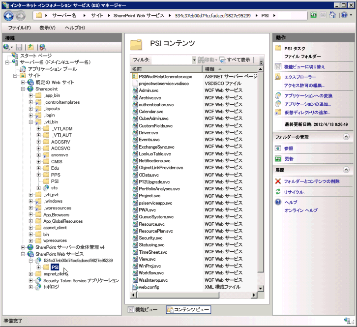

# <a name="project-psi-reference-overview"></a><span data-ttu-id="81a25-104">プロジェクトPSIリファレンスの概要</span><span class="sxs-lookup"><span data-stu-id="81a25-104">Project 2013 PSI reference overview</span></span>

<span data-ttu-id="81a25-105">Project Serverインターフェイス（PSI）は、社内のProject Server 2013と統合するアプリケーションを開発するために使用するAPIです。</span><span class="sxs-lookup"><span data-stu-id="81a25-105">The Project Server Interface (PSI) is the API to use for developing applications that integrate with pj15srvshort on-premises.</span></span>
  
<span data-ttu-id="81a25-106">この記事は、PSIで文書化されているアセンブリ、名前空間、およびサービスの概要です。</span><span class="sxs-lookup"><span data-stu-id="81a25-106">This article is an overview of the documented assemblies, namespaces, and services in the PSI.</span></span> <span data-ttu-id="81a25-107">SDKの[Project Server 2013クラスライブラリとWebサービス参照](https://msdn.microsoft.com/library/ef1830e0-3c9a-4f98-aa0a-5556c298e7d1%28Office.15%29.aspx)には、PSIのマネージコードドキュメントとProject Server 2013の[Microsoft.ProjectServer.Client](https://msdn.microsoft.com/library/Microsoft.ProjectServer.Client.aspx)名前空間がすべて含まれています。</span><span class="sxs-lookup"><span data-stu-id="81a25-107">The Class library and web service reference in the SDK contains all of the managed code documentation for the PSI and the N:Microsoft.ProjectServer.Client namespace in pj15srvshort.</span></span> <span data-ttu-id="81a25-108">Project Online用のアプリケーションを開発するには、PSIの代わりに\*\* Microsoft.ProjectServer.Client\*\*名前空間を使用する必要があります。</span><span class="sxs-lookup"><span data-stu-id="81a25-108">To develop applications for pjsrvo15short, you must use the Microsoft.ProjectServer.Client namespace instead of the PSI.</span></span> 

<span data-ttu-id="81a25-109">Project Server 2013のPSIにはデュアルインターフェイスがあります。</span><span class="sxs-lookup"><span data-stu-id="81a25-109">The PSI in Project Server 2013 has a dual interface.</span></span> <span data-ttu-id="81a25-110">Webサービス用のASMXインターフェースは、仮想ディレクトリー`https://ServerName/ProjectServerName/_vti_bin/psi/`内のディスカバリーおよびWebサービス記述言語（discoおよびWSDL）ファイル（例えば、Projectdisco.aspxおよびProjectwsdl.aspx）によって定義されます。</span><span class="sxs-lookup"><span data-stu-id="81a25-110">The ASMX interface for web services is defined by discovery and Web Service Description Language (disco and WSDL) files in the http://ServerName/ProjectServerName/_vti_bin/psi/ virtual directory (for example, Projectdisco.aspx and Projectwsdl.aspx).</span></span> <span data-ttu-id="81a25-111">ASMXインターフェイスにアクセスできるのは、手動設置式のProject Web App（たとえば、`https://ServerName/ProjectServerName/_vti_bin/psi/project.asmx?wsdl)`のURLを通じてのみです。</span><span class="sxs-lookup"><span data-stu-id="81a25-111">You can access the ASMX interface only through the URL of an on-premises installation of pwa (for example, http://ServerName/ProjectServerName/_vti_bin/psi/project.asmx?wsdl).</span></span> <span data-ttu-id="81a25-112">Webサービスをブラウザに表示するには、`?wsdl` URLオプションを含める必要があります。</span><span class="sxs-lookup"><span data-stu-id="81a25-112">To show the web service in a browser, you must include the ?wsdl`?wsdl` URL option.</span></span> <span data-ttu-id="81a25-113">ASMXインターフェイスはWindows Communication Foundation（WCF）インフラストラクチャを使用して構築されているため、Project Server Webサービス用の.asmxファイルは、実際には仮想PSIディレクトリに存在しません。</span><span class="sxs-lookup"><span data-stu-id="81a25-113">Because the ASMX interface is built using the indigo1 infrastructure, the .asmx files for Project Server web services do not actually exist in the virtual PSI directory.</span></span> 
  
<span data-ttu-id="81a25-114">WCFサービスインターフェースは、SharePoint Webサービスアプリケーションのバックエンド`https://ServerName:32843/GUID/PSI/`仮想ディレクトリー内の.svcファイルによって定義されています。</span><span class="sxs-lookup"><span data-stu-id="81a25-114">The WCF services interface is defined by .svc files in the back-end  `https://ServerName:32843/GUID/PSI/` virtual directory in the SharePoint Web Services application.</span></span> <span data-ttu-id="81a25-115">Project Service Application仮想ディレクトリ（たとえば`https://ServerName:32843/GUID/PSI/project.svc`）内のPSIサービスのURLには、.svcファイルが含まれています。</span><span class="sxs-lookup"><span data-stu-id="81a25-115">The URL of PSI services in the Project Service Application virtual directory (for example,  `https://ServerName:32843/GUID/PSI/project.svc`) includes the .svc files.</span></span> <span data-ttu-id="81a25-116">ただし、バックエンドURLを直接使用してWCFサービス参照を設定することはできません。</span><span class="sxs-lookup"><span data-stu-id="81a25-116">But, you cannot directly use the back-end URL to set a WCF service reference.</span></span> <span data-ttu-id="81a25-117">PSIのWCFサービスを使用するアプリケーションまたはコンポーネントを開発するには、プロキシアセンブリまたはプロキシファイルを使用できます。</span><span class="sxs-lookup"><span data-stu-id="81a25-117">To develop an application or component that uses the WCF services of the PSI, you can use a proxy assembly or a proxy file.</span></span> <span data-ttu-id="81a25-118">Project 2013 SDKのダウンロードには、Project Server 2013のWCFサービス用のプロキシファイル、および更新されたWCFプロキシファイルを取得して直近のProject Serverビルド用のファイルをプロキシアセンブリにコンパイルするためのスクリプトが含まれています。</span><span class="sxs-lookup"><span data-stu-id="81a25-118">The Project 2013 SDK download includes proxy files for the WCF services in Project Server 2013, and scripts to get updated WCF proxy files and to compile the files into a proxy assembly for more recent Project Server builds.</span></span>
  
<span data-ttu-id="81a25-119">Project Serviceアプリケーションのディレクトリ名はGUID値で、これは設置型Project Web AppインスタンスのGUIDと同じです。</span><span class="sxs-lookup"><span data-stu-id="81a25-119">The Project Service Application directory name is a GUID value, which is the same as the GUID of the on-premises pwa instance.</span></span> <span data-ttu-id="81a25-120">[**インターネット インフォメーション サービス (IIS) マネージャー**] ウィンドウで、[**SharePoint Web サービス**] 接続ポイントを展開し、GUID ディレクトリ名を選択し、[**詳細設定**] を選択して、[**仮想パス**] の値をコピーします。</span><span class="sxs-lookup"><span data-stu-id="81a25-120">In the **Internet Information Services (IIS) Manager** window, expand the **SharePoint Web Services** node, choose the GUID directory name, and then choose **Advanced Settings** to copy the **Virtual Path** value.</span></span> 
  
> [!IMPORTANT]
> <span data-ttu-id="81a25-121">PSIのASMX WebサービスインターフェイスはProject Server 2013では非推奨ですが、引き続きサポートされています。</span><span class="sxs-lookup"><span data-stu-id="81a25-121">The ASMX web service interface of the PSI is deprecated in Project Server 2013, but is still supported.</span></span> <span data-ttu-id="81a25-122">新しいアプリケーションは、PSIまたはCSOMのWCFインターフェイスを使用する必要があります。</span><span class="sxs-lookup"><span data-stu-id="81a25-122">New applications should use the WCF interface of the PSI or the CSOM.</span></span> <span data-ttu-id="81a25-123">廃止予定の機能について詳しくは、[Project 2013における開発者向けの更新プログラム](updates-for-developers-in-project-2013.md)を参照してください。</span><span class="sxs-lookup"><span data-stu-id="81a25-123">For more information about new features and deprecated features, see [Updates for developers in Project 2013](updates-for-developers-in-project-2013.md).</span></span>
> 
> <span data-ttu-id="81a25-124">新しいアプリケーション、および手動設置式Project Serverでのみ実行されるミドルウェアコンポーネントは、WCFインターフェイスを使用する必要があります。これはネットワーク通信に推奨されるテクノロジです。</span><span class="sxs-lookup"><span data-stu-id="81a25-124">New applications, and middleware components that run only on an on-premises installation of Project Server, should use the WCF interface, which is the technology that we recommend for network communications.</span></span> <span data-ttu-id="81a25-125">ASMXインターフェイスを使用するレガシアプリケーションは、Project Web Appを通じてURLを使用する必要があります。これにより、Project Serverのアクセス許可が確認されます。</span><span class="sxs-lookup"><span data-stu-id="81a25-125">Legacy applications that use the ASMX interface must use the URL through Project Web App, which checks Project Server permissions.</span></span> 
> 
> <span data-ttu-id="81a25-126">ASMXインターフェースおよびWCFインターフェースの使用方法について詳しくは、[プロジェクトにおけるASMXベースのコードサンプルの前提条件およびプロジェクトにおけるWCFベースのコードサンプルの前提条件を参照してください。</span><span class="sxs-lookup"><span data-stu-id="81a25-126">For more information about the ASMX interface and how to use the WCF interface, see [Prerequisites for ASMX-based code samples in Project](prerequisites-for-asmx-based-code-samples-in-project.md) and [Prerequisites for WCF-based code samples in Project](prerequisites-for-wcf-based-code-samples-in-project.md).</span></span> 
  
<span data-ttu-id="81a25-127">WCFインターフェイスを使用するアプリケーションを開発する際は、Visual Studio 2010またはVisual Studio 2012を使用できます。</span><span class="sxs-lookup"><span data-stu-id="81a25-127">For developing applications that use the WCF interface, you can use Visual Studio 2010 or Visual Studio 2012.</span></span> <span data-ttu-id="81a25-128">宣言型Project Serverワークフローを作成するために、SharePoint Designer 2013を使用できます。</span><span class="sxs-lookup"><span data-stu-id="81a25-128">For creating declarative Project Server workflows, you can use SharePoint Designer 2013.</span></span> <span data-ttu-id="81a25-129">PSIまたはCSOMへのアクセスを必要とするProject Serverワークフローは、Visual Studio 2012を使用して開発できます。</span><span class="sxs-lookup"><span data-stu-id="81a25-129">Project Server workflows that require access to the PSI or the CSOM can be developed with Visual Studio 2012.</span></span>
  
### <a name="using-the-psi-reference"></a><span data-ttu-id="81a25-130">PSIリファレンスを使用する</span><span class="sxs-lookup"><span data-stu-id="81a25-130">Using the PSI reference</span></span>
<span data-ttu-id="81a25-131"><a name="pj15_PSIRefOverview_Using"> </a></span><span class="sxs-lookup"><span data-stu-id="81a25-131"></span></span>

<span data-ttu-id="81a25-132">PSIオブジェクトモデルは大きく、多くのクラスとメンバは内部使用専用です。</span><span class="sxs-lookup"><span data-stu-id="81a25-132">The PSI object model is large, and many classes and members are for internal use only.</span></span> <span data-ttu-id="81a25-133">その結果、[Project Server 2013クラスライブラリとWebサービスリファレンス](https://msdn.microsoft.com/library/ef1830e0-3c9a-4f98-aa0a-5556c298e7d1%28Office.15%29.aspx)の中で必要なトピックをうまく見つけられない場合があります。</span><span class="sxs-lookup"><span data-stu-id="81a25-133">As a result, it can be confusing to find the topics that you want in the [Class library and web service reference](https://msdn.microsoft.com/library/ef1830e0-3c9a-4f98-aa0a-5556c298e7d1%28Office.15%29.aspx).</span></span> <span data-ttu-id="81a25-134">開発に使用する参照用のトピックのほとんどは、以下のグループにあります。</span><span class="sxs-lookup"><span data-stu-id="81a25-134">Most of the reference topics that you will use for development are in the following groups:</span></span>
  
- <span data-ttu-id="81a25-135">**基本クラス・メソッド：** PSI内の各サービスには、そのサービスの名前で命名された基本クラスが含まれています。</span><span class="sxs-lookup"><span data-stu-id="81a25-135">Each service in the PSI includes a primary class that is named for the name of the service.</span></span> <span data-ttu-id="81a25-136">例えば、**Resource**サービスには、[WebSvcResource](https://msdn.microsoft.com/library/WebSvcResource.aspx)名前空間にある[Resource](https://msdn.microsoft.com/library/WebSvcResource.Resource.aspx)クラスが含まれています。</span><span class="sxs-lookup"><span data-stu-id="81a25-136">For example, the **Resource** service contains the [T:WebSvcResource.Resource](https://msdn.microsoft.com/library/WebSvcResource.Resource.aspx) class, which is in the [N:WebSvcResource](https://msdn.microsoft.com/library/WebSvcResource.aspx) namespace.</span></span> <span data-ttu-id="81a25-137">**Resource** クラスで使用できるメソッドの一覧を表示するには、コンテンツ ペインのクラス ノードを展開し、[**リソース メソッド**] トピックをクリックします。</span><span class="sxs-lookup"><span data-stu-id="81a25-137">To see a list of the methods that are available in the **Resource** class, expand the class node in the content pane, and then choose the **Resource Methods** topic.</span></span> 
    
- <span data-ttu-id="81a25-138">**DataRowプロパティー：** 多くの基本クラスメソッドは、**DataSet**を使用、または返します。</span><span class="sxs-lookup"><span data-stu-id="81a25-138">Many of the primary class methods use or return a **DataSet**.</span></span> <span data-ttu-id="81a25-139">\*\* DataSet**の各**DataTable **オブジェクトには、1つ以上の**DataRow\*\*オブジェクトのデータが含まれています。</span><span class="sxs-lookup"><span data-stu-id="81a25-139">Each **DataTable** object in a **DataSet** contains data in one or more **DataRow** objects.</span></span> <span data-ttu-id="81a25-140">ほとんどの場合、見る必要があるのは行のプロパティだけであり、**DataSet**、**DataTable**、または **DataRow** クラスの他のすべてのメンバーを見る必要はありません。</span><span class="sxs-lookup"><span data-stu-id="81a25-140">In most cases, you need to see only the row properties, not all of the other members of the **DataSet**, **DataTable**, or **DataRow** classes.</span></span> <span data-ttu-id="81a25-141">例えば、**ResourceAssignmentDataSet**クラスには、**ResourceAssignmentDataTable**および[ResourceAssignmentDataSet.ResourceAssignmentRow](https://msdn.microsoft.com/library/WebSvcResource.ResourceAssignmentDataSet.ResourceAssignmentRow.aspx)クラスのサブクラスが含まれています。</span><span class="sxs-lookup"><span data-stu-id="81a25-141">For example, the **ResourceAssignmentDataSet** class includes subclasses for the **ResourceAssignmentDataTable** and the [T:WebSvcResource.ResourceAssignmentDataSet.ResourceAssignmentRow](https://msdn.microsoft.com/library/WebSvcResource.ResourceAssignmentDataSet.ResourceAssignmentRow.aspx) class.</span></span> <span data-ttu-id="81a25-142">**ResourceAssignmentRow** クラスのプロパティの一覧を表示するには、コンテンツ ペインでクラス ノードを展開し、[**ResourceAssignmentDataSet.ResourceAssignmentRow のプロパティ**] トピックをクリックします。</span><span class="sxs-lookup"><span data-stu-id="81a25-142">To see a list of properties that are in the **ResourceAssignmentRow** class, expand the class node in the content pane, and then choose the **ResourceAssignmentDataSet.ResourceAssignmentRow Properties** topic.</span></span> 
    
<span data-ttu-id="81a25-143">サービスの名前空間に加えて、[Project Server 2013クラスライブラリとWebサービスリファレンス](https://msdn.microsoft.com/library/ef1830e0-3c9a-4f98-aa0a-5556c298e7d1%28Office.15%29.aspx)のトピックは、手動設置用のサードパーティソリューションの開発に使用される3つのProject Serverアセンブリにリンクしています。</span><span class="sxs-lookup"><span data-stu-id="81a25-143">In addition to the service namespaces, the [Class library and web service Reference](https://msdn.microsoft.com/library/ef1830e0-3c9a-4f98-aa0a-5556c298e7d1%28Office.15%29.aspx) topic links to the three Project Server assemblies that are used in development of third-party solutions for on-premises installations.</span></span> <span data-ttu-id="81a25-144">これらのアセンブリについては、最小限のドキュメントだけが提供されています。</span><span class="sxs-lookup"><span data-stu-id="81a25-144">We provide only minimal documentation for these assemblies.</span></span> <span data-ttu-id="81a25-145">さらに、PSI リファレンスでは、23 のパブリック サービスの主なクラスとメンバーが説明されています。</span><span class="sxs-lookup"><span data-stu-id="81a25-145">The PSI reference documents the main classes and members in the 23 public services.</span></span> <span data-ttu-id="81a25-146">6 つの PSI サービスは内部使用専用であり、文書化されていません。</span><span class="sxs-lookup"><span data-stu-id="81a25-146">Six PSI services are for internal use only, and are not documented.</span></span> 
  
> [!NOTE]
> <span data-ttu-id="81a25-147">クライアントサイドオブジェクトモデル（CSOM）のクラスは、他のProject Serverアセンブリおよびサービスとは独立して使用できます。</span><span class="sxs-lookup"><span data-stu-id="81a25-147">Classes in the client-side object model (CSOM) can be used independently from the other Project Server assemblies and services.</span></span> <span data-ttu-id="81a25-148">Project Serverコンピューターから、リモート開発環境で**Microsoft.ProjectServer.Client**名前空間を使用して、Project Onlineまたは手動設置式のProject Serverと統合するアプリケーションを開発できます。</span><span class="sxs-lookup"><span data-stu-id="81a25-148">You can use the Microsoft.ProjectServer.Client namespace in a remote development environment from the Project Server computer, and develop apps that integrate with pjsrvogenericshort or with an on-premises installation of Project Server.</span></span> <span data-ttu-id="81a25-149">ただし、CSOM に含まれるのは完全な PSI の機能のサブセットです。</span><span class="sxs-lookup"><span data-stu-id="81a25-149">But, the CSOM contains a subset of the functionality of the complete PSI.</span></span> <span data-ttu-id="81a25-150">CSOM を使用すると、Project Server 統合の最も一般的なシナリオを開発できます。</span><span class="sxs-lookup"><span data-stu-id="81a25-150">The CSOM enables development of the most common scenarios for Project Server integration.</span></span> <span data-ttu-id="81a25-151">詳しくは、[CSOMの挙動について](what-the-csom-does-and-does-not-do.md)および[Microsoft.ProjectServer.Client](https://msdn.microsoft.com/library/Microsoft.ProjectServer.Client.aspx)を参照してください。</span><span class="sxs-lookup"><span data-stu-id="81a25-151">For more information, see [What the CSOM does and does not do](what-the-csom-does-and-does-not-do.md).</span></span> 
  
<span data-ttu-id="81a25-152">PSI を使用するほとんどのアプリケーションの開発は、Project Server コンピューターで行わなくてもよく、グローバル アセンブリ キャッシュで Project Server アセンブリへの参照を設定する必要はありません。</span><span class="sxs-lookup"><span data-stu-id="81a25-152">For development of most applications that use the PSI, you do not have to develop on a Project Server computer, or set references to Project Server assemblies in the global assembly cache.</span></span> <span data-ttu-id="81a25-153">必要な Project Server アセンブリを開発コンピューターにコピーできます。</span><span class="sxs-lookup"><span data-stu-id="81a25-153">You can copy the necessary Project Server assemblies to your development computer.</span></span> <span data-ttu-id="81a25-154">Project Server 2013は、_[Program Files] _ `\Microsoft Office Servers\15.0\Bin`に次のアセンブリをインストールします。</span><span class="sxs-lookup"><span data-stu-id="81a25-154">Project Server 2013 installs the following assemblies in  _[Program Files]_ `\Microsoft Office Servers\15.0\Bin`:</span></span> 
  
- <span data-ttu-id="81a25-155">Microsoft.Office.Project.Server.Events.Receivers.dll</span><span class="sxs-lookup"><span data-stu-id="81a25-155">Microsoft.Office.Project.Server.Events.Receivers.dll</span></span> 
- <span data-ttu-id="81a25-156">Microsoft.Office.Project.Server.Library.dll</span><span class="sxs-lookup"><span data-stu-id="81a25-156">Set a reference to the Microsoft.Office.Project.Server.Library.dll assembly.</span></span>
- <span data-ttu-id="81a25-157">Microsoft.Office.Project.Server.Workflow.dll</span><span class="sxs-lookup"><span data-stu-id="81a25-157">Microsoft.Office.Project.Server.Workflow.dll</span></span>
    
<span data-ttu-id="81a25-158">PSIサービスの名前空間には、PSIプロキシアセンブリProjectServerServices.dll用に作成された任意の名前があります。これは、文書化の目的で生成されたものです。</span><span class="sxs-lookup"><span data-stu-id="81a25-158">Namespaces for the PSI services have arbitrary names created for a PSI proxy assembly, ProjectServerServices.dll, which is generated for the purpose of documentation. In the PSI reference, each service namespace has a placeholder name (such as [Project web service]) and a web reference (such as http://ServerName/ProjectServerName/_vti_bin/psi/Project.asmx?wsdl).</span></span> <span data-ttu-id="81a25-159">PSIの参照では、各サービス名前空間はプレースホルダー名（_ [Project Webサービス] _など）とWeb参照（`https://ServerName/ProjectServerName/_vti_bin/psi/Project.asmx?wsdl`など）を持ちます。</span><span class="sxs-lookup"><span data-stu-id="81a25-159">Namespaces for the PSI services have arbitrary names created for a PSI proxy assembly, ProjectServerServices.dll, which is generated for the purpose of documentation. In the PSI reference, each service namespace has a placeholder name (such as _[Project web service]_) and a web reference (such as http://ServerName/ProjectServerName/_vti_bin/psi/Project.asmx?wsdl`https://ServerName/ProjectServerName/_vti_bin/psi/Project.asmx?wsdl`).</span></span> 
  
## <a name="project-server-assemblies-and-namespaces"></a><span data-ttu-id="81a25-160">Project Serverのアセンブリと名前空間</span><span class="sxs-lookup"><span data-stu-id="81a25-160">Project Server assemblies and namespaces</span></span>
<span data-ttu-id="81a25-161"><a name="pj15_PSIRefOverview_Assemblies"> </a></span><span class="sxs-lookup"><span data-stu-id="81a25-161"></span></span>

<span data-ttu-id="81a25-162">Project Serverをインストールすると、多くのアセンブリがインストールされます。文書化されているのは4つのProject Serverアセンブリのみです。</span><span class="sxs-lookup"><span data-stu-id="81a25-162">Many assemblies are installed when you install Project Server; only four of the Project Server assemblies are documented.</span></span> <span data-ttu-id="81a25-163">サードパーティの開発者は通常、これらのアセンブリでは少数のクラスとメンバのみを使用します。</span><span class="sxs-lookup"><span data-stu-id="81a25-163">Third-party developers generally use only a few classes and members in those assemblies.</span></span> <span data-ttu-id="81a25-164">文書化されていないProject Serverアセンブリには、Project Web Appのクラス、事業名、データアクセス層（DAL）など、Project Serverが内部で使用する名前空間とクラスが含まれています。</span><span class="sxs-lookup"><span data-stu-id="81a25-164">The undocumented Project Server assemblies include namespaces and classes that Project Server uses internally, such as classes for Project Web App, the business entities, and the data access layer (DAL).</span></span> <span data-ttu-id="81a25-165">文書化されているいずれかのProject ServerアセンブリにVisual Studioで参照を設定すると、Visual Studioのオブジェクトブラウザですべての名前空間、クラス、およびメンバを表示できます。</span><span class="sxs-lookup"><span data-stu-id="81a25-165">When you set a reference in Visual Studio to one of the documented Project Server assemblies, you can see all of the namespaces, classes, and members in the Visual Studio Object Browser.</span></span>
  
> [!NOTE]
> <span data-ttu-id="81a25-166">文書化されたProject Server名前空間の多くのメンバは内部でのみ使用され、文書化は最小限です。</span><span class="sxs-lookup"><span data-stu-id="81a25-166">Many members of the documented Project Server namespaces are used only internally and have minimal documentation.</span></span> 
  
<span data-ttu-id="81a25-167">Project Online用に開発する場合は、CSOMのみを使用してProject Serverの機能にアクセスできます。</span><span class="sxs-lookup"><span data-stu-id="81a25-167">When developing for pjsrvo15short, you can use only the CSOM to access Project Server functionality.</span></span> <span data-ttu-id="81a25-168">PSIサービスまたは他のProject Serverアセンブリにアクセスすることはできません。</span><span class="sxs-lookup"><span data-stu-id="81a25-168">You do not have access to the PSI services or the other Project Server assemblies.</span></span>
  
<span data-ttu-id="81a25-169">PSIの[ Project Server 2013クラスライブラリとWebサービス参照](https://msdn.microsoft.com/library/ef1830e0-3c9a-4f98-aa0a-5556c298e7d1%28Office.15%29.aspx)には、次のアセンブリの名前空間が含まれています。</span><span class="sxs-lookup"><span data-stu-id="81a25-169">The [Class library and web service reference](https://msdn.microsoft.com/library/ef1830e0-3c9a-4f98-aa0a-5556c298e7d1%28Office.15%29.aspx) for the PSI includes namespaces from the following four assemblies:</span></span> 
  
- <span data-ttu-id="81a25-170">**Microsoft.Office.Project.Server.Library.dll**このアセンブリには、次のように、1つの文書化された名前空間と3つの文書化されていない名前空間が含まれています。</span><span class="sxs-lookup"><span data-stu-id="81a25-170">**Microsoft.Office.Project.Server.Library.dll**   This assembly contains one documented namespace and three undocumented namespaces, as follows:</span></span> 
    
  - <span data-ttu-id="81a25-171">[Microsoft.Office.Project.Server.Library](https://msdn.microsoft.com/library/Microsoft.Office.Project.Server.Library.aspx)名前空間には、多数の列挙型、Project Serverの設置型アプリケーションで頻繁に使用されるクラスフィールドおよびプロパティが含まれています。</span><span class="sxs-lookup"><span data-stu-id="81a25-171">The [N:Microsoft.Office.Project.Server.Library](https://msdn.microsoft.com/library/Microsoft.Office.Project.Server.Library.aspx) namespace includes many enumerations, and class fields and properties that are frequently used in on-premises applications for Project Server.</span></span> <span data-ttu-id="81a25-172">例えば、開発者はよく**CustomField.Type**、**PSClientError**、**PSErrorInfo**、**Filter**クラスなどの列挙型を使用します。</span><span class="sxs-lookup"><span data-stu-id="81a25-172">For example, developers typically use enumerations such as **CustomField.Type**, and the **PSClientError**, **PSErrorInfo**, and **Filter** classes.</span></span> 
    
    <span data-ttu-id="81a25-173">**Microsoft.Office.Project.Server.Library**名前空間には、3,200を超えるサブクラスを含む次の7つのプロパティクラスも含まれています。</span><span class="sxs-lookup"><span data-stu-id="81a25-173">The **Microsoft.Office.Project.Server.Library** namespace also includes the following seven property classes, which include over 3,200 subclasses:</span></span> 
    
      - <span data-ttu-id="81a25-174">**AssignmentProperties**</span><span class="sxs-lookup"><span data-stu-id="81a25-174">**AssignmentProperties**</span></span>  
      - <span data-ttu-id="81a25-175">**CalendarProperties**</span><span class="sxs-lookup"><span data-stu-id="81a25-175">**CalendarProperties**</span></span>
      - <span data-ttu-id="81a25-176">**ConstraintProperties**</span><span class="sxs-lookup"><span data-stu-id="81a25-176">**ConstraintProperties**</span></span>
      - <span data-ttu-id="81a25-177">**LookupTableProperties**</span><span class="sxs-lookup"><span data-stu-id="81a25-177">**LookupTableProperties**</span></span>
      - <span data-ttu-id="81a25-178">**ProjectProperties**</span><span class="sxs-lookup"><span data-stu-id="81a25-178">**ProjectProperties**</span></span>
      - <span data-ttu-id="81a25-179">**ResourceProperties**</span><span class="sxs-lookup"><span data-stu-id="81a25-179">**ResourceProperties**</span></span>
      - <span data-ttu-id="81a25-180">**TaskProperties**</span><span class="sxs-lookup"><span data-stu-id="81a25-180">**TaskProperties**</span></span>
    
    <span data-ttu-id="81a25-181">プロパティクラスは内部的に使用され、文書化されていません。</span><span class="sxs-lookup"><span data-stu-id="81a25-181">The property classes are used internally and are not documented.</span></span> <span data-ttu-id="81a25-182">プロパティクラスは、Project Professional 2013とProject Serverの間の直列化に使用されます。</span><span class="sxs-lookup"><span data-stu-id="81a25-182">The property classes are used for serialization between pj15proshort and Project Server.</span></span> <span data-ttu-id="81a25-183">Visual Studioで**Microsoft.Office.Project.Server.Library**名前空間を操作すると、オブジェクトブラウザにすべてのプロパティクラスが表示されるため、他社環境での開発で有用なクラスを見つけるのがより難しくなってしまいます。</span><span class="sxs-lookup"><span data-stu-id="81a25-183">When you work with the Microsoft.Office.Project.Server.Library namespace in vsnv, the Object Browser shows all of the property classes, which makes it more difficult to find classes that are useful for third-party development.</span></span> <span data-ttu-id="81a25-184">サードパーティーの開発者はプロパティクラスを使用する必要がないため、SDKではそれらを文書化していません。</span><span class="sxs-lookup"><span data-stu-id="81a25-184">Because third-party developers do not have to use the property classes, the SDK does not document them.</span></span> 
    
  - <span data-ttu-id="81a25-185">**Microsoft.Office.Project.Server.DataServices**この名前空間のクラスとメンバは、Project Onlineの**OData**サービスによって内部的に使用され、Projectデータベースのレポートテーブルにアクセスします。</span><span class="sxs-lookup"><span data-stu-id="81a25-185">Microsoft.Office.Project.Server.DataServices   The classes and members of this namespace are used internally by the OData service in pjsrvo15short for access to the reporting tables in the Project database. The DataServices classes are not documented.</span></span> <span data-ttu-id="81a25-186">**DataServices**クラスは文書化されていません。</span><span class="sxs-lookup"><span data-stu-id="81a25-186">The **DataServices** classes are not documented.</span></span> 
    
  - <span data-ttu-id="81a25-187">**Microsoft.Office.Project.Server.Administration**この名前空間のクラスとメンバーは診断ログのために内部で使用されているため、文書化されていません。</span><span class="sxs-lookup"><span data-stu-id="81a25-187">**Microsoft.Office.Project.Server.Administration**   The class and members of this namespace are used internally for diagnostic logging, and are not documented.</span></span> 
    
  - <span data-ttu-id="81a25-188">**Microsoft.Office.Project.Server.Base**この名前空間のクラスとメンバは、基本クラスとして内部的に使用されており、文書化されていません。</span><span class="sxs-lookup"><span data-stu-id="81a25-188">**Microsoft.Office.Project.Server.Base**   The classes and members of this namespace are used internally as base classes and are not documented.</span></span> 
    
  - <span data-ttu-id="81a25-189">**Microsoft.Office.Project.Server.Library.FilterSchema**この名前空間は、フィルター図式を生成するために内部的に使用されているため、文書化されていません。</span><span class="sxs-lookup"><span data-stu-id="81a25-189">**Microsoft.Office.Project.Server.Library.FilterSchema **  This namespace is used internally to generate filter schemas and is not documented.</span></span> 
    
- <span data-ttu-id="81a25-190">**Microsoft.Office.Project.Server.Workflow.dll**このアセンブリは、Project Server 2013で引き続き機能する旧Project Server 2010ワークフローに使用されます。</span><span class="sxs-lookup"><span data-stu-id="81a25-190">**Microsoft.Office.Project.Server.Workflow.dll** This assembly is used for legacy Project Server 2010 workflows that can still work in Project Server 2013.</span></span> <span data-ttu-id="81a25-191">新しいワークフローを作成するには、SharePoint Designer 2013を使用するか、[Microsoft.ProjectServer.Client.WorkflowActivities](https://msdn.microsoft.com/library/Microsoft.ProjectServer.Client.WorkflowActivities.aspx)クラスと共にVisual Studio 2012を使用することもできます。</span><span class="sxs-lookup"><span data-stu-id="81a25-191">For creating new workflows, you should use SharePoint Designer 2013, or you can also use Visual Studio 2012 with the [Microsoft.ProjectServer.Client.WorkflowActivities](https://msdn.microsoft.com/library/Microsoft.ProjectServer.Client.WorkflowActivities.aspx) class.</span></span> <span data-ttu-id="81a25-192">Microsoft.Office.Project.Server.Workflow.dllアセンブリには、次の3つの名前空間が含まれています。</span><span class="sxs-lookup"><span data-stu-id="81a25-192">The Microsoft.Office.Project.Server.Workflow.dll assembly includes the following three namespaces:</span></span> 
    
  - <span data-ttu-id="81a25-193">[Microsoft.Office.Project.Server.Workflow](https://msdn.microsoft.com/library/Microsoft.Office.Project.Server.Workflow.aspx)この名前空間には、Project Serverのワークフローアクティビティに使用されるクラスが含まれています。</span><span class="sxs-lookup"><span data-stu-id="81a25-193">[Microsoft.Office.Project.Server.Workflow](https://msdn.microsoft.com/library/Microsoft.Office.Project.Server.Workflow.aspx) This namespace includes classes that are used for Project Server workflow activities.</span></span> <span data-ttu-id="81a25-194">アクティビティには、プロジェクトプロパティの読み取り、比較、および更新が含まれます。</span><span class="sxs-lookup"><span data-stu-id="81a25-194">Activities include reading, comparing, and updating project properties.</span></span> <span data-ttu-id="81a25-195">他のクラスは作業手順を管理し、プロジェクトが変更されたときのワークフローコールバックも行います。</span><span class="sxs-lookup"><span data-stu-id="81a25-195">Other classes manage workflows and include workflow call-backs when projects are changed.</span></span> 
    
  - <span data-ttu-id="81a25-196">**Microsoft.Office.Project.PWA**この名前空間には、Project Web Appおよびカスタムワークフローアクティビティで使用するためのPSIの内部プロキシが含まれています。これは文書化されていません。</span><span class="sxs-lookup"><span data-stu-id="81a25-196">Microsoft.Office.Project.PWA   This namespace includes an internal proxy for the PSI, for use with pwa and with custom workflow activities; it is not documented.</span></span> 
    
    <span data-ttu-id="81a25-197">カスタムワークフローアクティビティでは、PSIサービス内のすべてのクラスにアクセスするために**Microsoft.Office.Project.PWA**への参照が必要です。</span><span class="sxs-lookup"><span data-stu-id="81a25-197">A custom workflow activity requires a reference to **Microsoft.Office.Project.PWA** to access all of the classes in the PSI services.</span></span> <span data-ttu-id="81a25-198">例えば、**Microsoft.Office.Project.PWA.PSI**クラスには**ProjectWebService**プロパティーが含まれ、これは[WebSvcProject](https://msdn.microsoft.com/library/WebSvcProject.aspx)名前空間のプロキシーを取得します。</span><span class="sxs-lookup"><span data-stu-id="81a25-198">For example, the **Microsoft.Office.Project.PWA.PSI** class includes the **ProjectWebService** property, which gets a proxy for the [N:WebSvcProject](https://msdn.microsoft.com/library/WebSvcProject.aspx) namespace.</span></span> 
    
  - <span data-ttu-id="81a25-199">**Microsoft.Office.Project.Server.WebServiceProxy**この名前空間には、各PSIサービスの基準クラスの内部プロキシクラスが含まれています。</span><span class="sxs-lookup"><span data-stu-id="81a25-199">**Microsoft.Office.Project.Server.WebServiceProxy** This namespace includes internal proxy classes for the primary class in each PSI service.</span></span> <span data-ttu-id="81a25-200">ワークフローユーザーの昇格権限を使用することで、ワークフローはプロキシクラスを通じてPSIメソッドを呼び出すことができます。</span><span class="sxs-lookup"><span data-stu-id="81a25-200">Microsoft.Office.Project.Server.WebServiceProxy   This namespace includes internal proxy classes for the primary class in each PSI service. By using the elevated permissions of the workflow user, the workflow can call PSI methods through proxy classes. The proxy classes are not documented.</span></span> <span data-ttu-id="81a25-201">プロキシクラスは文書化されていません。</span><span class="sxs-lookup"><span data-stu-id="81a25-201">The proxy classes are not documented.</span></span> 
    
- <span data-ttu-id="81a25-202">**Microsoft.Office.Project.Server.Events.Receivers.dll** [Microsoft.Office.Project.Server.Events](https://msdn.microsoft.com/library/Microsoft.Office.Project.Server.Events.aspx)は、このアセンブリの唯一の名前空間です。</span><span class="sxs-lookup"><span data-stu-id="81a25-202">**Microsoft.Office.Project.Server.Events.Receivers.dll**   [N:Microsoft.Office.Project.Server.Events](https://msdn.microsoft.com/library/Microsoft.Office.Project.Server.Events.aspx) is the only namespace in this assembly. It includes event receiver and event argument classes for the PSI services and other internal classes.</span></span> <span data-ttu-id="81a25-203">ここにはPSIサービスと他の内部クラスのためのイベント受信子とイベント引数クラスが含まれています。</span><span class="sxs-lookup"><span data-stu-id="81a25-203">Microsoft.Office.Project.Server.Events.Receivers.dll   N:Microsoft.Office.Project.Server.Events is the only namespace in this assembly. It includes event receiver and event argument classes for the PSI services and other internal classes.</span></span> 
    
  <span data-ttu-id="81a25-204">開発者は、イベント レシーバーのクラスを継承するイベント ハンドラーを作成します。</span><span class="sxs-lookup"><span data-stu-id="81a25-204">Developers write event handlers that derive from event receiver classes.</span></span> <span data-ttu-id="81a25-205">PSI サービスのプライマリ クラスの多くには、対応するイベント レシーバー クラスがあります。</span><span class="sxs-lookup"><span data-stu-id="81a25-205">Most of the primary classes in the PSI services have a corresponding event receiver class.</span></span> <span data-ttu-id="81a25-206">たとえば、**ProjectEventReceiver**クラスには、PSIの**Project**クラスのメソッドに対応する前置イベントおよび後置イベントのレシーバメソッドが含まれています。</span><span class="sxs-lookup"><span data-stu-id="81a25-206">For example, the **ProjectEventReceiver** class contains pre-event and post-event receiver methods that correspond to methods in the **Project** class in the PSI.</span></span> <span data-ttu-id="81a25-207">**OnCreating**メソッドおよび**OnCreated**メソッドは、**QueueCreateProject**メソッドの前置イベントおよび後置イベントの受信メソッドです。</span><span class="sxs-lookup"><span data-stu-id="81a25-207">The **OnCreating** method and the **OnCreated** method are the pre-event and post-event receiver methods for the **QueueCreateProject** method.</span></span> 
    
  <span data-ttu-id="81a25-208">開発者はよく、次のイベントレシーバークラスを使用します。</span><span class="sxs-lookup"><span data-stu-id="81a25-208">Developers typically use the following event receiver classes:</span></span>
  <br/>  
  - [<span data-ttu-id="81a25-209">AdminEventReceiver</span><span class="sxs-lookup"><span data-stu-id="81a25-209">AdminEventReceiver</span></span>](https://msdn.microsoft.com/library/Microsoft.Office.Project.Server.Events.AdminEventReceiver.aspx)
  - [<span data-ttu-id="81a25-210">CalendarEventReceiver</span><span class="sxs-lookup"><span data-stu-id="81a25-210">CalendarEventReceiver</span></span>](https://msdn.microsoft.com/library/Microsoft.Office.Project.Server.Events.CalendarEventReceiver.aspx)
  - [<span data-ttu-id="81a25-211">CubeAdminEventReceiver</span><span class="sxs-lookup"><span data-stu-id="81a25-211">CubeAdminEventReceiver</span></span>](https://msdn.microsoft.com/library/Microsoft.Office.Project.Server.Events.CubeAdminEventReceiver.aspx)
  - [<span data-ttu-id="81a25-212">CustomFieldsEventReceiver</span><span class="sxs-lookup"><span data-stu-id="81a25-212">CustomFieldsEventReceiver</span></span>](https://msdn.microsoft.com/library/Microsoft.Office.Project.Server.Events.CustomFieldsEventReceiver.aspx)
  - [<span data-ttu-id="81a25-213">LookupTableEventReceiver</span><span class="sxs-lookup"><span data-stu-id="81a25-213">LookupTableEventReceiver</span></span>](https://msdn.microsoft.com/library/Microsoft.Office.Project.Server.Events.LookupTableEventReceiver.aspx)
  - [<span data-ttu-id="81a25-214">AdminEventReceiver</span><span class="sxs-lookup"><span data-stu-id="81a25-214">ProjectEventReceiver</span></span>](https://msdn.microsoft.com/library/Microsoft.Office.Project.Server.Events.ProjectEventReceiver.aspx)
  - [<span data-ttu-id="81a25-215">CalendarEventReceiver</span><span class="sxs-lookup"><span data-stu-id="81a25-215">OptimizerEventReceiver</span></span>](https://msdn.microsoft.com/library/Microsoft.Office.Project.Server.Events.OptimizerEventReceiver.aspx)
  - [<span data-ttu-id="81a25-216">AdminEventReceiver</span><span class="sxs-lookup"><span data-stu-id="81a25-216">ReportingEventReceiver</span></span>](https://msdn.microsoft.com/library/Microsoft.Office.Project.Server.Events.ReportingEventReceiver.aspx)
  - [<span data-ttu-id="81a25-217">ResourceEventReceiver</span><span class="sxs-lookup"><span data-stu-id="81a25-217">ResourceEventReceiver</span></span>](https://msdn.microsoft.com/library/Microsoft.Office.Project.Server.Events.ResourceEventReceiver.aspx)
  - [<span data-ttu-id="81a25-218">SecurityEventReceiver</span><span class="sxs-lookup"><span data-stu-id="81a25-218">SecurityEventReceiver</span></span>](https://msdn.microsoft.com/library/Microsoft.Office.Project.Server.Events.SecurityEventReceiver.aspx)
  - [<span data-ttu-id="81a25-219">StatusingEventReceiver</span><span class="sxs-lookup"><span data-stu-id="81a25-219">StatusingEventReceiver</span></span>](https://msdn.microsoft.com/library/Microsoft.Office.Project.Server.Events.StatusingEventReceiver.aspx)
  - [<span data-ttu-id="81a25-220">TimesheetEventReceiver</span><span class="sxs-lookup"><span data-stu-id="81a25-220">TimesheetEventReceiver</span></span>](https://msdn.microsoft.com/library/Microsoft.Office.Project.Server.Events.TimesheetEventReceiver.aspx)
  - [<span data-ttu-id="81a25-221">UserDelegationEventReceiver</span><span class="sxs-lookup"><span data-stu-id="81a25-221">UserDelegationEventReceiver</span></span>](https://msdn.microsoft.com/library/Microsoft.Office.Project.Server.Events.UserDelegationEventReceiver.aspx)
  - [<span data-ttu-id="81a25-222">WorkflowEventReceiver</span><span class="sxs-lookup"><span data-stu-id="81a25-222">WorkflowEventReceiver</span></span>](https://msdn.microsoft.com/library/Microsoft.Office.Project.Server.Events.WorkflowEventReceiver.aspx)
  - [<span data-ttu-id="81a25-223">WssInteropEventReceiver</span><span class="sxs-lookup"><span data-stu-id="81a25-223">WssInteropEventReceiver</span></span>](https://msdn.microsoft.com/library/Microsoft.Office.Project.Server.Events.WssInteropEventReceiver.aspx)
    
  <span data-ttu-id="81a25-224">**RulesEventReceiver**クラスと\*\* StatusReportsEventReceiver \*\*クラスは、Project Web Appの内部で使用されます。</span><span class="sxs-lookup"><span data-stu-id="81a25-224">The RulesEventReceiver class and the StatusReportsEventReceiver class are used internally in pwa.</span></span> 
    
- <span data-ttu-id="81a25-225">**Microsoft.ProjectServer.Client.dll**このアセンブリには、.NET Framework 4で開発するためのCSOMが含まれています。</span><span class="sxs-lookup"><span data-stu-id="81a25-225">**Microsoft.ProjectServer.Client.dll** This assembly contains the CSOM for development with the .NET Framework 4.</span></span> <span data-ttu-id="81a25-226">アセンブリは`%ProgramFiles%\Common Files\Microsoft Shared\Web Server Extensions\15\ISAPI\Microsoft.ProjectServer.Client.dll`に位置しています。</span><span class="sxs-lookup"><span data-stu-id="81a25-226">The assembly is located in  `%ProgramFiles%\Common Files\Microsoft Shared\Web Server Extensions\15\ISAPI\Microsoft.ProjectServer.Client.dll`.</span></span> <span data-ttu-id="81a25-227">**Microsoft.ProjectServer.Client** 名前空間でのアプリの開発は社内設置型の Project Server API およびサービスとは独立していますが、アプリは Project Server の社内設置型インストールまたはオンライン インストールのどちらでも動作できます。</span><span class="sxs-lookup"><span data-stu-id="81a25-227">Development of apps with the **Microsoft.ProjectServer.Client** namespace is independent of the on-premises Project Server APIs and services, although the apps can work with either an on-premises or online installation of Project Server.</span></span> <span data-ttu-id="81a25-228">Windows Phone 8、Microsoft Silverlight、またはWebアプリケーションを備えたJavaScriptに使用できる関連CSOMアセンブリについては、[Microsoft.ProjectServer.Client](https://msdn.microsoft.com/library/Microsoft.ProjectServer.Client.aspx)を参照してください。</span><span class="sxs-lookup"><span data-stu-id="81a25-228">For related CSOM assemblies that can be used for Windows Phone 7, silverlightnv1, or ecmascriptshort with web apps, see N:Microsoft.ProjectServer.Client.</span></span> 
    
- <span data-ttu-id="81a25-229">**Microsoft.Office.Project.Server.Schema.dll** Project 2013 SDKでは、`[Windows]\Microsoft.NET\assembly\GAC_MSIL\Microsoft.Office.Project.Schema\v4.0_15.0.0.0__71e9bce111e9429c\Microsoft.Office.Project.Schema.dll`アセンブリ内にある**Microsoft.Office.Project.Server.Schema**名前空間は文書化されていません。</span><span class="sxs-lookup"><span data-stu-id="81a25-229">**Microsoft.Office.Project.Server.Schema.dll** The Project 2013 SDK does not document the **Microsoft.Office.Project.Server.Schema** namespace, which is in the  `[Windows]\Microsoft.NET\assembly\GAC_MSIL\Microsoft.Office.Project.Schema\v4.0_15.0.0.0__71e9bce111e9429c\Microsoft.Office.Project.Schema.dll` assembly.</span></span> <span data-ttu-id="81a25-230">この名前空間には、PSI で使用されるすべての **DataSet**、**DataTable**、**DataRow** クラスの定義に加えて、Project Server 内部で使用されるその他の多くの類似クラスの定義が含まれます。</span><span class="sxs-lookup"><span data-stu-id="81a25-230">The namespace contains the definitions of all **DataSet**, **DataTable**, and **DataRow** classes used in the PSI, plus many other similar classes that Project Server uses internally.</span></span> <span data-ttu-id="81a25-231">各PSIサービスのパブリッククラスは、特定のサービスリファレンスに記載されています。</span><span class="sxs-lookup"><span data-stu-id="81a25-231">The public classes in each PSI service are documented in the specific service reference.</span></span> <span data-ttu-id="81a25-232">例えば、**DriverDataSet.DriverRow**クラスは、[WebSvcDriver](https://msdn.microsoft.com/library/WebSvcDriver.aspx)名前空間に記載されています。</span><span class="sxs-lookup"><span data-stu-id="81a25-232">For example, the **DriverDataSet.DriverRow** class is documented in the [N:WebSvcDriver](https://msdn.microsoft.com/library/WebSvcDriver.aspx) namespace.</span></span> 
    
  > [!NOTE]
  > <span data-ttu-id="81a25-233">CSOMを使用するアプリケーション、リモートイベントハンドラを使用するアプリケーション、またはProject Onlineにアクセスするアプリケーションは、**Microsoft.Office.Project.Server.Schema**名前空間を使用しません。</span><span class="sxs-lookup"><span data-stu-id="81a25-233">Applications that use the CSOM, use remote event handlers, or access pjsrvogenericshort do not use the Microsoft.Office.Project.Server.Schema namespace.</span></span> 
  
  <span data-ttu-id="81a25-p128">イベント ハンドラーが Project Server コンピューターにインストールされる完全信頼イベント ハンドラーを使用する一部のアプリケーションでは、Microsoft.Office.Project.Schema.dll アセンブリへの参照を設定する必要があります。次に、2 つの例を示します。</span><span class="sxs-lookup"><span data-stu-id="81a25-p128">In some applications that use full-trust event handlers, where the event handlers are installed on the Project Server computer, it is necessary to set a reference to the Microsoft.Office.Project.Schema.dll assembly. Following are two examples:</span></span>
    
  - <span data-ttu-id="81a25-236">ユーザー設定フィールド用の完全信頼 **OnCreated** ポストイベント ハンドラーでは、**e.CustomFieldInformation** イベント引数を、**CustomFieldDataSet** および **CustomFieldsRow** の定義に対する **Microsoft.Office.Project.Server.Schema** 名前空間への参照と共に使用できます。</span><span class="sxs-lookup"><span data-stu-id="81a25-236">In a full-trust **OnCreated** post-event handler for custom fields, you can use the **e.CustomFieldInformation** event argument with a reference to the **Microsoft.Office.Project.Server.Schema** namespace for the **CustomFieldDataSet** and **CustomFieldsRow** definitions.</span></span> 
   
     ```cs
        using PSLibrary = Microsoft.Office.Project.Server.Library;
        using Microsoft.Office.Project.Server.Schema;
        . . .
        // Event handler for the OnCreated event of a custom field.
        public override void OnCreated(
            PSLibrary.PSContextInfo contextInfo, 
            CustomFieldsPostEventArgs e)
        {
            // Get information from the event arguments. 
            string userName = contextInfo.UserName.ToString();
            CustomFieldDataSet customFieldDs = e.CustomFieldInformation;
            CustomFieldsRow customFieldRow = customFieldDs.CustomFields.Rows[0];
            string customFieldName = customFieldRow["MD_PROP_NAME"].ToString();
            byte customFieldType = (byte)customFieldRow["MD_PROP_TYPE_ENUM"];
            Guid customFieldUid = (Guid)customFieldRow["MD_PROP_UID"];
            . . .
        }
     ```

  - <span data-ttu-id="81a25-237">カスタムワークフローアクティビティでは、**DataSet**定義に対して**Microsoft.Office.Project.Server.Schema**への参照が必要になる場合があります。</span><span class="sxs-lookup"><span data-stu-id="81a25-237">A custom workflow activity can require a reference to **Microsoft.Office.Project.Server.Schema** for **DataSet** definitions.</span></span> 
    
## <a name="psi-services"></a><span data-ttu-id="81a25-238">PSI サービス</span><span class="sxs-lookup"><span data-stu-id="81a25-238">PSI services</span></span>
<span data-ttu-id="81a25-239"><a name="pj15_PSIRefOverview_PSI"> </a></span><span class="sxs-lookup"><span data-stu-id="81a25-239"></span></span>

<span data-ttu-id="81a25-240">PSIは、WCFサービスの集まりで、Project Server 2013用のASMX Webサービスと同一のものです。</span><span class="sxs-lookup"><span data-stu-id="81a25-240">The PSI is a set of WCF services and identical ASMX web services for pj15srvshort.</span></span> <span data-ttu-id="81a25-241">Visual Studioプロジェクトでサービスを使用するには、ネームサービスに任意の名前を使用して、`.svc`ファイルまたは`.asmx?wsdl`サービスのURLへの参照を設定します。</span><span class="sxs-lookup"><span data-stu-id="81a25-241">To use a service in a vsnv project, you set a reference to the URL of the .svc file or the .asmx?wsdl service by using an arbitrary name for the nameservice.</span></span> <span data-ttu-id="81a25-242">wsdl.exe ユーティリティまたは svcutil.exe ユーティリティによってその名前空間のプロキシ ソース コードが生成され、コンパイラによりアプリケーションに含めるプロキシ サービス アセンブリが作成されます。</span><span class="sxs-lookup"><span data-stu-id="81a25-242">The wsdl.exe utility or the svcutil.exe utility then generates proxy source code for that namespace, and the compiler creates a proxy service assembly to include in your application.</span></span> 
  
> [!NOTE]
> <span data-ttu-id="81a25-243">PSIリファレンスには、_ [管理Webサービス] _、_ [ドライバーWebサービス] _、_ [プロジェクトWebサービス] _などのPSIサービスのプレースホルダーサービス名が含まれています。</span><span class="sxs-lookup"><span data-stu-id="81a25-243">The PSI reference includes placeholder nameservice names for the PSI services such as _[Admin web service]_, _[Driver web service]_, and _[Project web service]_.</span></span> <span data-ttu-id="81a25-244">各PSIネームサービスには、そのサービスのWebメソッドを含む基準クラスが含まれています。</span><span class="sxs-lookup"><span data-stu-id="81a25-244">Each PSI nameservice includes a primary class that contains the web methods for that service.</span></span> <span data-ttu-id="81a25-245">たとえば、**Admin** サービスへの参照を設定し、それに **WebSvcAdmin** という名前を付けた場合、アプリケーションの **WebSvcAdmin** nameservice には、プライマリ クラス **Admin** とその **GetServerCurrency**、**ListInstalledLanguages**、**ReadServerVersion** などの Web メソッドが含まれます。</span><span class="sxs-lookup"><span data-stu-id="81a25-245">For example, if you set a reference to the **Admin** service and name it **WebSvcAdmin**, then in your application the **WebSvcAdmin** nameservice includes the primary **Admin** class that has the web methods **GetServerCurrency**, **ListInstalledLanguages**, **ReadServerVersion**, and so on.</span></span> <span data-ttu-id="81a25-246">非推奨のPSIサービスのリストについては、[ Project 2013における開発者向け更新](updates-for-developers-in-project-2013.md)を参照してください。</span><span class="sxs-lookup"><span data-stu-id="81a25-246">See [Updates for developers in Project 2013](updates-for-developers-in-project-2013.md) for a list of deprecated PSI services.</span></span> 
  
<span data-ttu-id="81a25-247">合計30のPSIサービスのうち、**認証**、**ExchangeSync**、**OData**、**P12アップグレード**、**psiserviceapp**、**PWA**、**表示**、および**WinProj**は、Project Web AppおよびProject Professionalによって内部的に使用されるものであり、文書化されていません。</span><span class="sxs-lookup"><span data-stu-id="81a25-247">Of the 30 total PSI services, **authentication**, **ExchangeSync**, **OData**, **P12Upgrade**, **psiserviceapp**, **PWA**, **View**, and **WinProj** are for internal use by Project Web App and Project Professional and are not documented.</span></span> <span data-ttu-id="81a25-248">PSI内部サービスを含むプロキシファイルまたはプロキシアセンブリを作成することはできますが、その内部サービスは他社環境による使用には適していません。 PSIリファレンスはそれらのサービスを文書化していません。</span><span class="sxs-lookup"><span data-stu-id="81a25-248">Of the 30 total PSI services, authentication, ExchangeSync, OData, P12Upgrade, psiserviceapp, PWA, View, and WinProj are for internal use by pwa and Project Professional and are not documented. Although you can create proxy files or a proxy assembly that includes the PSI internal services, the internal services are not for third-party use; the PSI reference does not document those services. Figure 1 shows the location of the back-end PSI services in Internet Information Services Manager.</span></span> <span data-ttu-id="81a25-249">次の図は、インターネットインフォメーションサービスマネージャのバックエンドPSIサービスの場所を示しています。</span><span class="sxs-lookup"><span data-stu-id="81a25-249">The following figure shows the location of the back-end PSI services in Internet Information Services Manager.</span></span> 
  
<span data-ttu-id="81a25-250">**IISのPSIサービスを設置する**</span><span class="sxs-lookup"><span data-stu-id="81a25-250">**Locating the PSI services in IIS**</span></span>

<span data-ttu-id="81a25-251"></span><span class="sxs-lookup"><span data-stu-id="81a25-251"></span></span>
  
<span data-ttu-id="81a25-252">以下は、PSIサービス内のWebメソッドを含むすべてのクラスです。</span><span class="sxs-lookup"><span data-stu-id="81a25-252">The following are all of the classes that contain web methods in the PSI services:</span></span>
  
1. <span data-ttu-id="81a25-253">[Admin](https://msdn.microsoft.com/library/WebSvcAdmin.Admin.aspx)には、Project Web Appの**Project Server Administration**ページで使用されるメソッドが含まれています。</span><span class="sxs-lookup"><span data-stu-id="81a25-253">The T:WebSvcAdmin.Admin class includes methods that are used in the Project Server Administration pages in Project Web Access.</span></span> <span data-ttu-id="81a25-254">会計年度を定義し、ステータスと通貨設定、記録期間、監査ログ、およびActive Directoryの設定を管理します。</span><span class="sxs-lookup"><span data-stu-id="81a25-254">T:WebSvcAdmin.Admin   Includes methods that are used in the Project Server Administration pages in pwa. Defines fiscal years, manages statusing and currency settings, reporting periods, the audit log, and settings for Active Directory.</span></span> 
    
2. <span data-ttu-id="81a25-255">[アーカイブ](https://msdn.microsoft.com/library/WebSvcArchive.Archive.aspx)には、プロジェクトのバックアップと復元、セキュリティの分類、カスタムフィールド、リソース、システム設定、ビュー、および事業の総括プロジェクトの管理方法が含まれます。</span><span class="sxs-lookup"><span data-stu-id="81a25-255">[Archive](https://msdn.microsoft.com/library/WebSvcArchive.Archive.aspx) Includes methods for managing backup and restoration of projects, security categories, custom fields, resources, system settings, views, and the enterprise global project.</span></span> <span data-ttu-id="81a25-256">保管スケジュールを読み込んで更新します。</span><span class="sxs-lookup"><span data-stu-id="81a25-256">Reads and updates the archive schedule.</span></span> <span data-ttu-id="81a25-257">すべてのプロジェクトをアーカイブするか、指定されたアーカイブ済みプロジェクトを削除します。</span><span class="sxs-lookup"><span data-stu-id="81a25-257">Archive all projects or delete specified archived projects.</span></span> <span data-ttu-id="81a25-258">バックアップオブジェクトを保管データベーステーブルに保存し、バックアップしたオブジェクトを発行済データベーステーブルに復元します。</span><span class="sxs-lookup"><span data-stu-id="81a25-258">Saves backup objects to the Archive database tables and restores backed up objects to the Published database tables.</span></span> 
    
3. <span data-ttu-id="81a25-259">**認証**には、Project ProfessionalおよびProject Web Appのみによる内部使用のためのメソッドが含まれています。</span><span class="sxs-lookup"><span data-stu-id="81a25-259">Includes methods for internal use only by Project Professional and pwa.</span></span> 
    
4. <span data-ttu-id="81a25-260">[カレンダー](https://msdn.microsoft.com/library/WebSvcCalendar.Calendar.aspx)事業カレンダーの例外を管理します。</span><span class="sxs-lookup"><span data-stu-id="81a25-260">[Calendar](https://msdn.microsoft.com/library/WebSvcCalendar.Calendar.aspx) Manages enterprise calendar exceptions.</span></span> <span data-ttu-id="81a25-261">リソースカレンダーをチェックアウトおよびチェックインします。</span><span class="sxs-lookup"><span data-stu-id="81a25-261">Checks out and checks in resource calendars.</span></span> <span data-ttu-id="81a25-262">カレンダーの例外を作成、削除、一覧表示、更新、または戻します。</span><span class="sxs-lookup"><span data-stu-id="81a25-262">Creates, deletes, lists all, updates, or returns calendar exceptions.</span></span> 
    
5. <span data-ttu-id="81a25-263">[CubeAdmin](https://msdn.microsoft.com/library/WebSvcCubeAdmin.CubeAdmin.aspx) OLAPキューブ設定を管理します。</span><span class="sxs-lookup"><span data-stu-id="81a25-263">Manages OLAP cube settings.</span></span> <span data-ttu-id="81a25-264">分析サーバー、データベースの状態、およびキューブのリストを取得します。</span><span class="sxs-lookup"><span data-stu-id="81a25-264">Gets Analysis Server, database status, and list of cubes.</span></span> <span data-ttu-id="81a25-265">Cube Build Service 要求をキューに配置します。</span><span class="sxs-lookup"><span data-stu-id="81a25-265">Puts a Cube Build Service request on the queue.</span></span> <span data-ttu-id="81a25-266">キューブのディメンションおよびメジャーに関する計算済みのメンバー定義とフィールド設定を読み取り、更新します。</span><span class="sxs-lookup"><span data-stu-id="81a25-266">Reads and updates calculated member definitions and field settings for dimensions and measures in the cube.</span></span> 
    
6. <span data-ttu-id="81a25-267">[CustomFields](https://msdn.microsoft.com/library/WebSvcCustomFields.CustomFields.aspx)事業用カスタムフィールドを管理します。</span><span class="sxs-lookup"><span data-stu-id="81a25-267">[CustomFields](https://msdn.microsoft.com/library/WebSvcCustomFields.CustomFields.aspx) Manages enterprise custom fields.</span></span> <span data-ttu-id="81a25-268">チェックアウトおよびチェックイン方法、および事業用カスタムフィールドの作成、読み取り、更新、および削除（CRUD）メソッドが含まれます。</span><span class="sxs-lookup"><span data-stu-id="81a25-268">T:WebSvcCustomFields.CustomFields   Manages enterprise custom fields. Includes the check out and check in methods, and the create, read, update, and delete (CRUD) methods for enterprise custom fields.</span></span> 
    
7. <span data-ttu-id="81a25-269">[ドライバー](https://msdn.microsoft.com/library/WebSvcDriver.Driver.aspx)プロジェクト作成および需要管理のためのポートフォリオ分析ドライバーおよびドライバーの優先順位付けを管理します。</span><span class="sxs-lookup"><span data-stu-id="81a25-269">[T:WebSvcDriver.Driver](https://msdn.microsoft.com/library/WebSvcDriver.Driver.aspx)   Manages portfolio analysis drivers and driver prioritization for project creation and Demand Management. Includes the CRUD methods for project drivers.</span></span> <span data-ttu-id="81a25-270">プロジェクトドライバー用のCRUDメソッドが含まれます。</span><span class="sxs-lookup"><span data-stu-id="81a25-270">Includes the CRUD methods for project drivers.</span></span> 
    
8. <span data-ttu-id="81a25-271">[イベント](https://msdn.microsoft.com/library/WebSvcEvents.Events.aspx) Project Serverイベントハンドラの関連付けを管理します。</span><span class="sxs-lookup"><span data-stu-id="81a25-271">Manages Project Server event handler associations.</span></span> <span data-ttu-id="81a25-272">特定のイベント、またはすべてのイベントハンドラの関連付けに対するProject Serverのイベントハンドラの関連付けに対するCRUDメソッドが含まれます。</span><span class="sxs-lookup"><span data-stu-id="81a25-272">Includes the CRUD methods for Project Server event handler associations for a specific event, or for all event handler associations.</span></span> 
    
9. <span data-ttu-id="81a25-273">**ExchangeSync**これは、Exchange Serverイベントを処理する内部Project Serverサービスです。</span><span class="sxs-lookup"><span data-stu-id="81a25-273">**ExchangeSync** This is an internal Project Server service that handles Exchange Server events.</span></span> <span data-ttu-id="81a25-274">Project Web Appは、Office Project Server 2007のようにOutlookクライアントと直接同期するのではなく、**ExchangeSync**を使用してProject ServerとExchange Serverの間の割り当てを同期します。</span><span class="sxs-lookup"><span data-stu-id="81a25-274">Project Web App uses **ExchangeSync** to synchronize assignments between Project Server and Exchange Server, instead of synchronizing directly with the Outlook client as in Office Project Server 2007.</span></span> 
    
    <span data-ttu-id="81a25-275">**ExchangeSync**サービスへのアクセスは、**ProjectServiceApplication** URLを通じてのみ可能です。</span><span class="sxs-lookup"><span data-stu-id="81a25-275">Access to the **ExchangeSync** service is available only through the **ProjectServiceApplication** URL.</span></span> <span data-ttu-id="81a25-276">**ExchangeSync**のクラスとメンバは、他社環境での開発ではサポートされていません。</span><span class="sxs-lookup"><span data-stu-id="81a25-276">The **ExchangeSync** classes and members are not supported for third-party development.</span></span> 
    
10. <span data-ttu-id="81a25-277">[LoginForms](https://msdn.microsoft.com/library/WebSvcLoginForms.LoginForms.aspx)フォームベース認証で**Login**および**Logoff**メソッドを提供します。</span><span class="sxs-lookup"><span data-stu-id="81a25-277">[LoginForms](https://msdn.microsoft.com/library/WebSvcLoginForms.LoginForms.aspx) Provides the **Login** and **Logoff** methods with Forms-based authentication.</span></span> <span data-ttu-id="81a25-278">**LoginForms**サービスへのアクセスは、フロントエンドのProject Web Appサイトでのみ利用可能です。</span><span class="sxs-lookup"><span data-stu-id="81a25-278">Access to the **LoginForms** service is available only on a front-end Project Web App site.</span></span> 
    
11. <span data-ttu-id="81a25-279">[LoginWindows](https://msdn.microsoft.com/library/WebSvcLoginWindows.LoginWindows.aspx)複数認証（要求およびフォームベース）Project Server 2013の環境において、ASMXベースのアプリケーションを使ったWindows認証に使用される**Login**および**Logoff**メソッドを提供します。</span><span class="sxs-lookup"><span data-stu-id="81a25-279">[LoginWindows](https://msdn.microsoft.com/library/WebSvcLoginWindows.LoginWindows.aspx) Provides the **Login** and **Logoff** methods that are used for Windows authentication with ASMX-based applications for multiple authentication (claims and Forms-based) Project Server 2013 installations.</span></span> <span data-ttu-id="81a25-280">**LoginWindows**サービスへのアクセスは、フロントエンドのProject Web Appサイトでのみ可能です。</span><span class="sxs-lookup"><span data-stu-id="81a25-280">Access to the **LoginWindows** service is available only on a front-end Project Web App site.</span></span> 
    
    > [!CAUTION]
    > <span data-ttu-id="81a25-281">**LoginWindows**サービスは、WCFベースのアプリケーション、または要求認証のみを使用するProject Server環境で実行されるアプリケーション、または**OAuth**では使用されません。そのような場合、**Login**メソッドは常に**false**を返します。</span><span class="sxs-lookup"><span data-stu-id="81a25-281">The LoginWindows service is not used in WCF-based applications, or for applications that run on Project Server installations that use only claims authentication or OAuth; in those cases, the Login method always returns false. Claims authentication handles integrated Windows authentication.</span></span> <span data-ttu-id="81a25-282">要求認証は、統合Windows認証を扱います。</span><span class="sxs-lookup"><span data-stu-id="81a25-282">Claims authentication handles integrated Windows authentication.</span></span> 
  
12. <span data-ttu-id="81a25-283">[LookupTable](https://msdn.microsoft.com/library/WebSvcLookupTable.LookupTable.aspx)参照テーブル、多言語参照テーブル、およびそれらに対応するコード定義を管理します。</span><span class="sxs-lookup"><span data-stu-id="81a25-283">The T:WebSvcLookupTable.LookupTable primary class includes methods that manage lookup tables, multilanguage lookup tables, and their corresponding code masks.</span></span> <span data-ttu-id="81a25-284">チェックアウト、チェックイン、読み取り、作成、削除、および更新。</span><span class="sxs-lookup"><span data-stu-id="81a25-284">Checks out, checks in, reads, creates, deletes, and updates.</span></span> 
    
13. <span data-ttu-id="81a25-285">[通知](https://msdn.microsoft.com/library/WebSvcNotifications.Notifications.aspx)アラートとリマインダーを管理します。</span><span class="sxs-lookup"><span data-stu-id="81a25-285">[Notifications](https://msdn.microsoft.com/library/WebSvcNotifications.Notifications.aspx) Manages alerts and reminders.</span></span> <span data-ttu-id="81a25-286">アラート結果を取得、設定、登録、および登録解除するメソッドが含まれています。</span><span class="sxs-lookup"><span data-stu-id="81a25-286">T:WebSvcNotifications.Notifications   Manages alerts and reminders. Includes methods that get, set, register, and unregister alert results.</span></span> 
    
14. <span data-ttu-id="81a25-287">[ObjectLinkProvider](https://msdn.microsoft.com/library/WebSvcObjectLinkProvider.ObjectLinkProvider.aspx) SharePointサイト上のドキュメントおよび一覧アイテムのWebオブジェクトおよびリンクを管理します。</span><span class="sxs-lookup"><span data-stu-id="81a25-287">Manages web objects and links for documents and list items on SharePoint sites.</span></span> <span data-ttu-id="81a25-288">プロジェクト、プロジェクトリンク、タスク、またはタスク関連Webオブジェクトを作成、削除、または読み取り。</span><span class="sxs-lookup"><span data-stu-id="81a25-288">Creates, deletes, or reads project, project-linked, task, or task-linked web objects.</span></span> 
    
    > [!NOTE]
    > <span data-ttu-id="81a25-289">**ObjectLinkProvider**サービスは、Project Server 2013では推奨されていません。</span><span class="sxs-lookup"><span data-stu-id="81a25-289">The **ObjectLinkProvider** service is deprecated in Project Server 2013.</span></span> <span data-ttu-id="81a25-290">詳しくは、[Project 2013における開発者向け更新](updates-for-developers-in-project-2013.md)の*非推奨機能*の部分を参照してください。</span><span class="sxs-lookup"><span data-stu-id="81a25-290">For more information, see the  *Deprecated features*  section in [Updates for developers in Project 2013](updates-for-developers-in-project-2013.md).</span></span> 
  
15. <span data-ttu-id="81a25-291">**OData**記録テーブルおよびビューの内部**OData**インターフェースを提供します。</span><span class="sxs-lookup"><span data-stu-id="81a25-291">**OData** Provides the internal **OData** interface for the reporting tables and views.</span></span> <span data-ttu-id="81a25-292">**OData**サービスへのアクセスは、バックエンドの**ProjectServiceApplication** URLを通じてのみ可能です。</span><span class="sxs-lookup"><span data-stu-id="81a25-292">Access to the **OData** service is available only through the back-end **ProjectServiceApplication** URL.</span></span> <span data-ttu-id="81a25-293">PSIの個別**OData**サービスは、**ODataClient.ProcessOdataMessage**という1つのメソッドを提供します。これは、Project Serverがデータ記録を処理するために内部で使用するメソッドです。</span><span class="sxs-lookup"><span data-stu-id="81a25-293">The private **OData** service in the PSI provides one method, **ODataClient.ProcessOdataMessage**, which Project Server uses internally to process requests for reporting data.</span></span> <span data-ttu-id="81a25-294">HTTP要求はフロントエンド**ProjectData**サービスを通過します。</span><span class="sxs-lookup"><span data-stu-id="81a25-294">The HTTP requests go through the front-end **ProjectData** service.</span></span> 
    
    <span data-ttu-id="81a25-295">記録データを読み取るための**ProjectData**サービスおよびODataプロトコルについては、[ProjectData  -  Project ODataサービスの参照](https://msdn.microsoft.com/library/office/jj163015.aspx)をご覧ください。</span><span class="sxs-lookup"><span data-stu-id="81a25-295">For information about the **ProjectData** service and the OData protocol to read reporting data, see [ProjectData - OData service reference](https://msdn.microsoft.com/library/office/jj163015.aspx).</span></span>
    
16. <span data-ttu-id="81a25-296">**P12Upgrade** Project Server 2013インストーラーがOffice Project Server 2007の環境をアップグレードするための内部メソッドを提供します。</span><span class="sxs-lookup"><span data-stu-id="81a25-296">**P12Upgrade** Provides internal methods for the Project Server 2013 installer to upgrade an Office Project Server 2007 installation.</span></span> <span data-ttu-id="81a25-297">**P12Upgrade**サービスへのアクセスは、**ProjectServiceApplication** URLを通じてのみ可能です。</span><span class="sxs-lookup"><span data-stu-id="81a25-297">Access to the **WinProj** service is available only through the **ProjectServiceApplication** URL.</span></span> <span data-ttu-id="81a25-298">**P12Upgrade**メソッドは、他社環境での開発ではサポートされていません。</span><span class="sxs-lookup"><span data-stu-id="81a25-298">The **WinProj** methods are not supported for third-party development.</span></span> 
    
17. <span data-ttu-id="81a25-299">[PortfolioAnalyses](https://msdn.microsoft.com/library/WebSvcPortfolioAnalyses.PortfolioAnalyses.aspx)プロジェクトの依存関係、およびオプティマイザー、プランナー、および分析方法のためのCRUDメソッドが含まれています。</span><span class="sxs-lookup"><span data-stu-id="81a25-299">[T:WebSvcPortfolioAnalyses.PortfolioAnalyses](https://msdn.microsoft.com/library/WebSvcPortfolioAnalyses.PortfolioAnalyses.aspx)   Includes the CRUD methods for project dependencies, and for Optimizer, Planner, and Analysis solutions.</span></span> 
    
18. <span data-ttu-id="81a25-300">[Project](https://msdn.microsoft.com/library/WebSvcProject.Project.aspx)プロジェクトを管理します。</span><span class="sxs-lookup"><span data-stu-id="81a25-300">[Project](https://msdn.microsoft.com/library/WebSvcProject.Project.aspx) Manages projects.</span></span> <span data-ttu-id="81a25-301">プロジェクトデータベースの仮テーブルまたは発行済テーブル内のプロジェクトをチェックアウト、チェックイン、作成、削除、読み取り、または更新します。</span><span class="sxs-lookup"><span data-stu-id="81a25-301">T:WebSvcProject.Project   Manages projects. Checks out, checks in, creates, deletes, reads, or updates projects in the Project database draft tables or published tables. Puts a message on the queue for publishing.</span></span> <span data-ttu-id="81a25-302">発行待ち状態にメッセージを入れます。</span><span class="sxs-lookup"><span data-stu-id="81a25-302">Put a message on the queue for publishing.</span></span> 
    
    <span data-ttu-id="81a25-303">プロジェクト内の命名（タスク、リソース、割り当てなど）を作成または削除します。</span><span class="sxs-lookup"><span data-stu-id="81a25-303">Creates or deletes entities within projects (tasks, resources, assignments, and so on).</span></span> <span data-ttu-id="81a25-304">プロジェクトチームまたはプロジェクトサイトのアドレスに関する情報を取得または更新します。</span><span class="sxs-lookup"><span data-stu-id="81a25-304">Gets information about or updates the project team or pj14projsite address.</span></span> <span data-ttu-id="81a25-305">プロジェクトの状態、下書きテーブル内のプロジェクトのリスト、すべてのサマリー タスク、指定されたリソースに割り当てることができるタスク、またはリソースに割り当てがあるすべてのプロジェクトを取得します。</span><span class="sxs-lookup"><span data-stu-id="81a25-305">Gets project status, a list of projects in the draft tables, all summary tasks, tasks that are available for assignment to a specified resource, or all projects where a resource has assignments.</span></span>
    
    <span data-ttu-id="81a25-306">コミットメントを作成および管理したり、SharePoint タスク リストからプロジェクトの提案とプロジェクトを作成したり、プロジェクト/マスター プロジェクトの関係を検索したりします。</span><span class="sxs-lookup"><span data-stu-id="81a25-306">Creates and manages commitments, creates project proposals and projects from SharePoint task lists, and finds project/master project relationships.</span></span>
    
19. <span data-ttu-id="81a25-307">**psiserviceapp** Project Onlineによって内部的に使用されます。</span><span class="sxs-lookup"><span data-stu-id="81a25-307">**psiserviceapp** Used internally by Project Online.</span></span> <span data-ttu-id="81a25-308">**psiserviceapp**のクラスとメンバは、他社環境での開発ではサポートされていません。</span><span class="sxs-lookup"><span data-stu-id="81a25-308">**psiserviceapp**   Used internally by pjsrvo15short. The psiserviceapp classes and members are not supported for third-party development.</span></span> 
    
20. <span data-ttu-id="81a25-309">**PWA** Project Web App用に最適化された多くのメソッドが含まれています。これには、タスク更新の承認規則やステータスレポートの管理方法などが含まれます。</span><span class="sxs-lookup"><span data-stu-id="81a25-309">**PWA** Contains many methods that are optimized for Project Web App, including the methods for task update approval rules and for managing status reports.</span></span> <span data-ttu-id="81a25-310">**PWA**メソッドは多くの場合特殊化されており、他のPSIサービスの同等のメソッドと比べてやや冗長です。</span><span class="sxs-lookup"><span data-stu-id="81a25-310">The **PWA** methods are often specialized and somewhat redundant compared to equivalent methods in other PSI Web services.</span></span> <span data-ttu-id="81a25-311">**PWA**メソッドは、他のPSIメソッドと同じデータセットを多数使用するか返します。</span><span class="sxs-lookup"><span data-stu-id="81a25-311">**PWA** methods typically use or return many of the same datasets as the other PSI methods, or specialized administration datasets.</span></span> 
    
    <span data-ttu-id="81a25-312">**PWA**サービスへのアクセスは、**ProjectServiceApplication** URLを通じてのみ可能です。</span><span class="sxs-lookup"><span data-stu-id="81a25-312">Access to the **PWA** service is available only through the **ProjectServiceApplication** URL.</span></span> <span data-ttu-id="81a25-313">**PWA**のクラスとメンバーは、他社環境での開発ではサポートされていません。</span><span class="sxs-lookup"><span data-stu-id="81a25-313">The **PWA** classes and members are not supported for third-party development.</span></span> 
    
21. <span data-ttu-id="81a25-314">[QueueSystem](https://msdn.microsoft.com/library/WebSvcQueueSystem.QueueSystem.aspx) Project Serverのキューを管理します。</span><span class="sxs-lookup"><span data-stu-id="81a25-314">Manages the Project Server queue.</span></span> <span data-ttu-id="81a25-315">ジョブ数、ジョブやジョブ グループの待ち時間、すべてのジョブの進捗状況、指定されたジョブ、呼び出し元が所有するジョブ、または指定されたプロジェクトのジョブを取得します。</span><span class="sxs-lookup"><span data-stu-id="81a25-315">Gets job count, job and job group wait time, status of all jobs, specified jobs, jobs owned by the caller, or jobs for specified projects.</span></span> <span data-ttu-id="81a25-316">ジョブの相互関係を管理し、キューを構成します。</span><span class="sxs-lookup"><span data-stu-id="81a25-316">Manages job correlation and configures the queue.</span></span> 
    
22. <span data-ttu-id="81a25-317">[Resource](https://msdn.microsoft.com/library/WebSvcResource.Resource.aspx)業務用リソースを管理します。</span><span class="sxs-lookup"><span data-stu-id="81a25-317">[Resource](https://msdn.microsoft.com/library/WebSvcResource.Resource.aspx) Manages enterprise resources.</span></span> <span data-ttu-id="81a25-318">リソースまたはProject Serverユーザーとその認証設定をチェックアウト、チェックイン、更新、または作成。これは名前またはGUIDでリソースを見つけます。リソースまたはユーザーデータ、およびリソース細分化構造（RBS）と関連するセキュリティ情報の読み取り。これはリソースに対するすべての割り当てを取得し、またユーザーパスワードをリセットします。</span><span class="sxs-lookup"><span data-stu-id="81a25-318">T:WebSvcResource.Resource   Manages enterprise resources. Checks out, checks in, updates, or creates resources or Project Server users and their authorization settings; finds resources by name or GUID; reads resource or user data and the resource breakdown structure (RBS) and related security information; gets all assignments for a resource; and resets user passwords. The Resource class includes CRUD methods for user delegations.</span></span> <span data-ttu-id="81a25-319">**Resource**クラスには、ユーザー委任用のCRUDメソッドが含まれています。</span><span class="sxs-lookup"><span data-stu-id="81a25-319">The **Resource** class includes CRUD methods for user delegations.</span></span> 
    
23. <span data-ttu-id="81a25-320">[ResourcePlan](https://msdn.microsoft.com/library/WebSvcResourcePlan.ResourcePlan.aspx)リソースプランを管理します。</span><span class="sxs-lookup"><span data-stu-id="81a25-320">[ResourcePlan](https://msdn.microsoft.com/library/WebSvcResourcePlan.ResourcePlan.aspx) Manages resource plans.</span></span> <span data-ttu-id="81a25-321">リソースプランのチェックアウト、チェックイン、発行、およびCRUDメソッドの追加をします。</span><span class="sxs-lookup"><span data-stu-id="81a25-321">T:WebSvcResourcePlan.ResourcePlan   Manages resource plans. Checks out, checks in, publishes, and includes the CRUD methods for resource plans.</span></span> 
    
24. <span data-ttu-id="81a25-322">[Security](https://msdn.microsoft.com/library/WebSvcSecurity.Security.aspx)セキュリティテンプレート、セキュリティカテゴリ、組織および総括権限、およびグループの権限に対するCRUDメソッドを含みます。</span><span class="sxs-lookup"><span data-stu-id="81a25-322">[T:WebSvcSecurity.Security](https://msdn.microsoft.com/library/WebSvcSecurity.Security.aspx)   Includes the CRUD methods for security templates, security categories, organizational and global permissions, and group permissions. The Security class includes methods for project categories.</span></span> <span data-ttu-id="81a25-323">**Security**クラスにはプロジェクトカテゴリのメソッドが含まれています。</span><span class="sxs-lookup"><span data-stu-id="81a25-323">The **Security** class includes methods for project categories.</span></span> 
    
25. <span data-ttu-id="81a25-324">[Statusing](https://msdn.microsoft.com/library/WebSvcStatusing.Statusing.aspx)状況の更新および割り当てを管理します。</span><span class="sxs-lookup"><span data-stu-id="81a25-324">Manages status updates and assignments.</span></span> <span data-ttu-id="81a25-325">割り当てを作成、取得、または代理します。</span><span class="sxs-lookup"><span data-stu-id="81a25-325">Applies status updates or approvals, submits status updates, sets summary information for submitted updates, deletes approved status updates or approval history for a specified user, or deletes all status information for a set of projects.</span></span> <span data-ttu-id="81a25-326">割り当ての動作期間を設定します。</span><span class="sxs-lookup"><span data-stu-id="81a25-326">Creates, gets, or delegates assignments; sets assignment work duration.</span></span> <span data-ttu-id="81a25-327">現在のユーザーの新しい割り当てを取得したり、割り当てやタスクのトランザクション履歴、時間配分された実績作業時間、サマリー タスク階層を取得したりします。</span><span class="sxs-lookup"><span data-stu-id="81a25-327">Gets new assignments for the current user; gets assignment or task transaction history, the timephased actuals, or the summary task hierarchy.</span></span> 
    
    <span data-ttu-id="81a25-p160">タイムシート データをプレビューまたはインポートしたり、ユーザーの稼働日および非稼働日のスケジュールを読み取ったりします。承認待ちの進捗状況の更新、提出された更新の情報、または提出された更新に含まれる変更のトランザクション レコードを検索します。チームの状態を読み取ります。</span><span class="sxs-lookup"><span data-stu-id="81a25-p160">Previews or imports timesheet data, or reads a user's working and nonworking schedule. Finds pending status updates, information for submitted updates, or a transaction record of changes in a submitted update. Reads team status.</span></span>
    
26. <span data-ttu-id="81a25-331">[TimeSheet](https://msdn.microsoft.com/library/WebSvcTimeSheet.TimeSheet.aspx)タイムシートを管理します。</span><span class="sxs-lookup"><span data-stu-id="81a25-331">[TimeSheet](https://msdn.microsoft.com/library/WebSvcTimeSheet.TimeSheet.aspx) Manages timesheets.</span></span> <span data-ttu-id="81a25-332">遅れている、または承認待ちのタイムシートを検索します。</span><span class="sxs-lookup"><span data-stu-id="81a25-332">Includes the CRUD methods for timesheets, and submits or recalls timesheets.</span></span> <span data-ttu-id="81a25-333">日付または期間でタイムシートを検索します。</span><span class="sxs-lookup"><span data-stu-id="81a25-333">Finds timesheets that are late or pending approval; finds timesheets by date or period.</span></span> <span data-ttu-id="81a25-334">タイムシート承認者のリストを取得します。</span><span class="sxs-lookup"><span data-stu-id="81a25-334">Gets list of timesheet approvers.</span></span> <span data-ttu-id="81a25-335">実績をプリロードし、タイムシート行を検証します。</span><span class="sxs-lookup"><span data-stu-id="81a25-335">Preloads timesheet actuals and validates a timesheet line.</span></span> <span data-ttu-id="81a25-336">**TimeSheet** クラスには、偽装を必要としないで別のリソースのタイムシートを読み取ったり送信したりするための **ReadProjectTimesheetLines** メソッドおよび **SubmitTimesheetLines** メソッドが含まれます。</span><span class="sxs-lookup"><span data-stu-id="81a25-336">The **TimeSheet** class includes the **ReadProjectTimesheetLines** method and the **SubmitTimesheetLines** method for reading and submitting timesheets for another resource without requiring impersonation.</span></span> 
    
27. <span data-ttu-id="81a25-337">**View** **View**サービスは、Project Web App内でのみ使用するように設計されています。</span><span class="sxs-lookup"><span data-stu-id="81a25-337">**View** The **View** service is designed for use only within Project Web App.</span></span> <span data-ttu-id="81a25-338">\*\*View \*\*クラスのメソッドは、ビューを管理し、レポートを表示し、ビュー内のフィールドを読み取ります。</span><span class="sxs-lookup"><span data-stu-id="81a25-338">Methods in the **View** class manage views and view reports and read fields in views.</span></span> 
    
    <span data-ttu-id="81a25-339">**View**サービスへのアクセスは、**ProjectServiceApplication** URLを通じてのみ可能です。</span><span class="sxs-lookup"><span data-stu-id="81a25-339">Access to the **View** service is available only through the **ProjectServiceApplication** URL.</span></span> <span data-ttu-id="81a25-340">**View**メソッドは、他社製環境での開発ではサポートされていません。</span><span class="sxs-lookup"><span data-stu-id="81a25-340">The **View** methods are not supported for third-party development.</span></span> 
    
28. <span data-ttu-id="81a25-341">**WinProj** **WinProj**サービスは、Project Professional専用のサービスです。</span><span class="sxs-lookup"><span data-stu-id="81a25-341">**WinProj** The **WinProj** service is designed for use only by Project Professional.</span></span> <span data-ttu-id="81a25-342">他社環境での開発者は、Project Serverでのプログラミングに**WinProj**メソッドを使用しないでください。</span><span class="sxs-lookup"><span data-stu-id="81a25-342">Third-party developers should not use **WinProj** methods for programming Project Server extensions.</span></span> 
    
    <span data-ttu-id="81a25-343">一部の **WinProj** メソッドは、**Project** および **Resource** サービスでも使用される、**ProjectRelationsDataSet** や **ResourceDataSet** のようなデータセットを使用しますが、Project Professional の特定のプロパティと機能を必要とします。</span><span class="sxs-lookup"><span data-stu-id="81a25-343">Some **WinProj** methods use datasets such as **ProjectRelationsDataSet** and **ResourceDataSet** that the **Project** and **Resource** services also use, but require specific properties and functions in Project Professional.</span></span> 
    
    <span data-ttu-id="81a25-344">             \*\*WinProj\*\* サービスへのアクセスは、\*\*ProjectServiceApplication\*\* URL を使用してだけ行えます。</span><span class="sxs-lookup"><span data-stu-id="81a25-344">Access to the **WinProj** service is available only through the **ProjectServiceApplication** URL.</span></span> <span data-ttu-id="81a25-345">             \*\*WinProj\*\* メソッドは、サードパーティの開発用にはサポートされていません。</span><span class="sxs-lookup"><span data-stu-id="81a25-345">The **WinProj** methods are not supported for third-party development.</span></span> 
    
29. <span data-ttu-id="81a25-346">[Workflow](https://msdn.microsoft.com/library/WebSvcWorkflow.Workflow.aspx)業務プロジェクトタイプ、および作業のフェーズとステージを管理するためのCRUDメソッドが含まれています。</span><span class="sxs-lookup"><span data-stu-id="81a25-346">[Workflow](https://msdn.microsoft.com/library/WebSvcWorkflow.Workflow.aspx) Includes the CRUD methods for enterprise project types and for managing workflow phases and stages.</span></span> <span data-ttu-id="81a25-347">ワークフローを実行し、ステータス情報を設定し、需要管理ワークフローのプロジェクト詳細ページ（PDP）ステージを管理します。</span><span class="sxs-lookup"><span data-stu-id="81a25-347">Runs workflows, sets status information, and manages project detail page (PDP) stages in demand-management workflows.</span></span> <span data-ttu-id="81a25-348">Project Serverワークフローを構築するには、開発者は宣言型ワークフローにSharePoint Designer 2013を使用するか、.NET Framework 4での開発用にOffice Developer Tools for Visual Studio 2012を用い、CSOM内の[Microsoft.ProjectServer.Client.WorkflowActivities](https://msdn.microsoft.com/library/Microsoft.ProjectServer.Client.WorkflowActivities.aspx) classクラスを使用できます。</span><span class="sxs-lookup"><span data-stu-id="81a25-348">To develop Project Server workflows, developers can use SharePoint Designer 2013 for declarative workflows or use the Office Developer Tools for Visual Studio 2012 for development with .NET Framework 4 and the [Microsoft.ProjectServer.Client.WorkflowActivities](https://msdn.microsoft.com/library/Microsoft.ProjectServer.Client.WorkflowActivities.aspx) class in the CSOM.</span></span> 
    
30. <span data-ttu-id="81a25-349">[WssInterop](https://msdn.microsoft.com/library/WebSvcWssInterop.WssInterop.aspx)プロジェクトサイトを管理します。</span><span class="sxs-lookup"><span data-stu-id="81a25-349">[WssInterop](https://msdn.microsoft.com/library/WebSvcWssInterop.WssInterop.aspx) Manages project sites.</span></span> <span data-ttu-id="81a25-350">プロジェクトサイトを作成および削除します。</span><span class="sxs-lookup"><span data-stu-id="81a25-350">Creates and deletes project sites.</span></span> <span data-ttu-id="81a25-351">SharePoint設定と管理サイトに関する情報を取得して更新します。</span><span class="sxs-lookup"><span data-stu-id="81a25-351">Get information about and update the Windows SharePoint Services settings and administration sites.</span></span> <span data-ttu-id="81a25-352">プロジェクトサイトのメンバーシップとグループを同期して更新します。</span><span class="sxs-lookup"><span data-stu-id="81a25-352">Synchronizes and updates the project site memberships and groups.</span></span> 
    
<span data-ttu-id="81a25-353">各サービスの名前空間には、サービスが使用するすべての**DataSet**スキーマとイベントハンドラクラスが含まれています。</span><span class="sxs-lookup"><span data-stu-id="81a25-353">Each service namespace includes all of the **DataSet** schema and event handler classes that the service uses.</span></span> <span data-ttu-id="81a25-354">例えば、`Calendar.svc`（またはASMX Webサービスの場合は`Calendar.asmx?wsdl`）は、**カレンダー**サービスを表します。</span><span class="sxs-lookup"><span data-stu-id="81a25-354">For example, Calendar.svc`Calendar.svc` (or Calendar.asmx?wsdl`Calendar.asmx?wsdl` for the ASMX web service) describes the **Calendar** service.</span></span> <span data-ttu-id="81a25-355">リファレンスに**WebSvcCalendar**という名前を付けると、プロキシ名前空間には、メソッド**CheckInCalendars**、**CheckOutCalendars**などを持つプライマリ**Calendar**クラスが含まれます。</span><span class="sxs-lookup"><span data-stu-id="81a25-355">If you name the reference **WebSvcCalendar**, the proxy namespace contains the primary **Calendar** class with the methods **CheckInCalendars**, **CheckOutCalendars**, and so on.</span></span> <span data-ttu-id="81a25-356">**WebSvcCalendar**プロキシ名前空間には、**CalendarDataSet**クラスとそのすべてのサブクラスも含まれています。</span><span class="sxs-lookup"><span data-stu-id="81a25-356">The **WebSvcCalendar** proxy namespace also includes the **CalendarDataSet** class and all of its subclasses.</span></span> 
  
<span data-ttu-id="81a25-357">一部のPSIサービスには、重複した**DataSet**クラスが含まれています。</span><span class="sxs-lookup"><span data-stu-id="81a25-357">Some of the PSI services contain duplicate **DataSet** classes.</span></span> <span data-ttu-id="81a25-358">例えば、**Project**サービスと**Statusing**サービスはどちらも**ProjectDataSet**クラスを含みます。</span><span class="sxs-lookup"><span data-stu-id="81a25-358">For example, the **Project** service and the **Statusing** service both include the **ProjectDataSet** class.</span></span> <span data-ttu-id="81a25-359">これは、**Project** サービスと **Statusing** サービスの両方のメソッドに **ProjectDataSet** への参照が含まれ、参照を設定してアプリケーションをコンパイルすると作成されるプロキシ アセンブリに関連するデータセットが含まれるためです。</span><span class="sxs-lookup"><span data-stu-id="81a25-359">This is because methods in both the **Project** service and the **Statusing** service include references to the **ProjectDataSet**, and the proxy assemblies that you create when you set references and compile an application include the related datasets.</span></span> <span data-ttu-id="81a25-360">**Project**サービスおよび**Statusing**サービスでは、**ProjectDataSet.ProjectRow**クラスのさまざまなフィールドに値を指定できます。</span><span class="sxs-lookup"><span data-stu-id="81a25-360">The **Project** service and **Statusing** service can require values for different fields in the **ProjectDataSet.ProjectRow** class.</span></span> 
  
<span data-ttu-id="81a25-361">PSI リファレンスの名前空間とクラスをナビゲートするときは (たとえば、**Project** サービスの Web メソッドを参照するとき)、[**コンテンツ**] リストで [**Project Web サービス**] 名前空間を展開した後、**Project** クラスを展開します。</span><span class="sxs-lookup"><span data-stu-id="81a25-361">When you are navigating the namespaces and classes of the PSI reference, for example to see the web methods for the **Project** service, expand the **[Project web service]** namespace in the **Contents** list, and then expand the **Project** class.</span></span> 
  
## <a name="see-also"></a><span data-ttu-id="81a25-362">関連項目</span><span class="sxs-lookup"><span data-stu-id="81a25-362">See also</span></span>

- [<span data-ttu-id="81a25-363">Project Server 2013 のアーキテクチャ</span><span class="sxs-lookup"><span data-stu-id="81a25-363">Project Server 2013 architecture</span></span>](project-server-2013-architecture.md)
- [<span data-ttu-id="81a25-364">Project Server プログラミング</span><span class="sxs-lookup"><span data-stu-id="81a25-364">Project Server programmability</span></span>](project-server-programmability.md)   
- [<span data-ttu-id="81a25-365">PSI ができること、できないこと</span><span class="sxs-lookup"><span data-stu-id="81a25-365">What the PSI does and does not do</span></span>](what-the-psi-does-and-does-not-do.md)   
- [<span data-ttu-id="81a25-366">プロジェクト内のASMXベースコードサンプルの前提条件</span><span class="sxs-lookup"><span data-stu-id="81a25-366">Prerequisites for ASMX-based code samples in Project 2013</span></span>](prerequisites-for-asmx-based-code-samples-in-project.md)   
- [<span data-ttu-id="81a25-367">プロジェクト内のWCFベースコードサンプルの前提条件</span><span class="sxs-lookup"><span data-stu-id="81a25-367">Prerequisites for WCF-based code samples in Project 2013</span></span>](prerequisites-for-wcf-based-code-samples-in-project.md)   
- [<span data-ttu-id="81a25-368">.NET Framework デベロッパー センター</span><span class="sxs-lookup"><span data-stu-id="81a25-368">.NET Framework Developer Center</span></span>](https://msdn.microsoft.com/netframework/aa496123.aspx)
    

