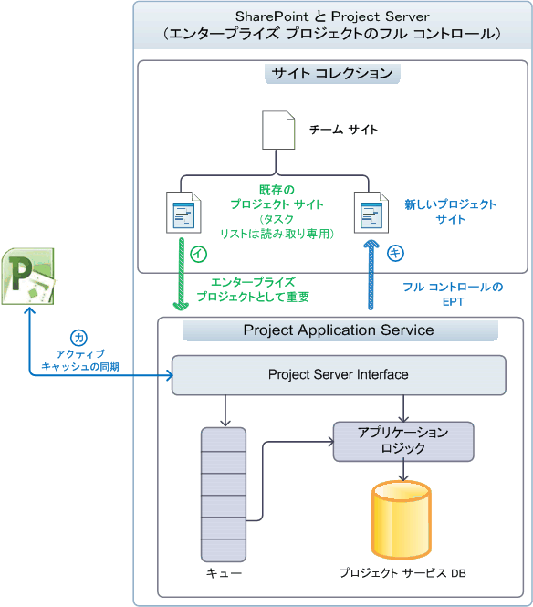
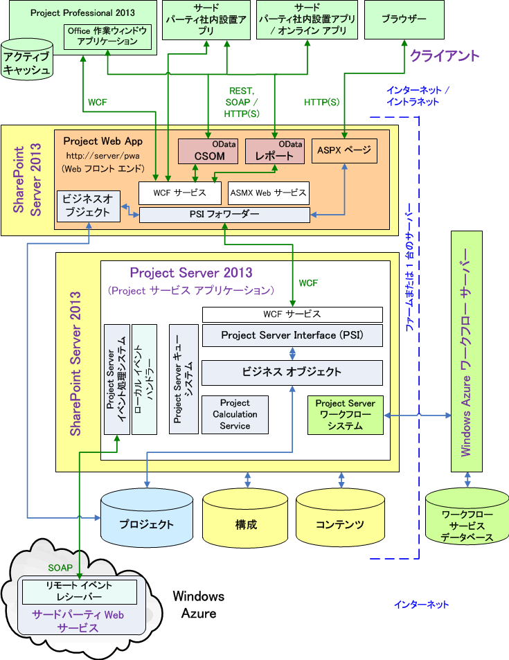
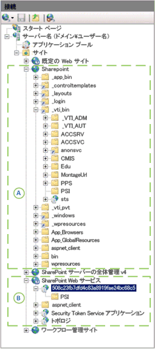

# Project Server のアーキテクチャ

Project Server 2013 は、SharePoint ファーム全体のプロジェクト管理機能を統合し、クライアント側オブジェクト モデル (CSOM) とレポート データ用の OData インターフェイスを持つ Project Online の使用を可能にします。
   
Project Server 2013 は、Office Project Server 2007 で導入されたアーキテクチャを拡張する多層システムです。 アーキテクチャの変更は、Project Application Service と SharePoint サイト コレクションの関連付け、Web フロントエンド (WFE) でのビジネス オブジェクトの追加、リモート アクセス用のクライアント側オブジェクト モデル (CSOM)、単一の Project データベース、レポート テーブルおよびビューのための OData インターフェイス、クラウド内またはローカル サーバー上での ワークフロー マネージャー クライアント 1.0 を介した Windows Workflow Foundation バージョン 4 (WF4) の統合、複数の Project Server インストールからアクセスできるリモート イベント レシーバーなどです。 オンプレミスのカスタム ソリューションに加えて、CSOM や OData インターフェイスにアクセスするリモート イベント レシーバーやコンポーネントを含むアプリケーションを作成できます。
  
フロントエンド層には、Project Professional 2013、Project Web App、およびサードパーティ アプリケーションが含まれます。 クライアント アプリケーションは Project Server Interface (PSI) または CSOM エンドポイントを通して中間層と通信し、中間層は PSI およびビジネス オブジェクト層と通信します。 データベース アクセスはビジネス オブジェクトに統合されます。 Project Server のイベント システムはローカルのイベント ハンドラーとリモートのイベント レシーバーの両方にアクセスできます。 Project Calculation Service は Project Server 内に Project Professional のスケジューリング エンジンを実装します。 クライアント アプリケーションは、Project データベースに直接アクセスしません (または直接のアクセスは禁止されています)。Project Server は、クライアントから直接アクセスできないようにビジネス オブジェクトを隠蔽します。
  
> [!NOTE]
> Project Server は、SharePoint アーキテクチャの上に構築されています。 SharePoint Server 2013 アーキテクチャと SharePoint アプリケーション モデルの詳細については、Office 2013 の開発者向けドキュメントの「*SharePoint 開発の作業の開始*」セクションを参照してください。 

## SharePoint サイト コレクションとの統合

Project Server 2013 の Project Application Service は、SharePoint タスク リストで使用するために SharePoint サイト コレクションに関連付けることができます。Project Application Service は、Project Server をフル コントロールするために SharePoint タスク リストをエンタープライズ プロジェクトとしてインポートすることもできます。 SharePoint タスク リストがある場合、SharePoint はプロジェクト サイトをサイト コレクションに保持します。Project Professional はタスク リストと同期し、タスク リストを更新できます。 プロジェクト サイトは、独立した SharePoint タスク リスト、または .mpp ファイルと同期されたタスク リストにすることができます。.mpp ファイルは、ローカルまたは SharePoint ライブラリに格納できます。 
  
Project Server はフル コントロールがある場合にプロジェクトを保持します。Project Professional はデータを Project Server に直接保存します。 表 1 では、タスク リスト、スケジュール Web パーツ、および他の機能について、SharePoint コントロールのタスク リストの場合と、インポートされたプロジェクトに対して Project Server がフル コントロールを持つ場合との間で比較します。 スケジュール Web パーツには Project Web App ページのグリッドが含まれており、ここでプロジェクト スケジュールを編集できます。 統合モードでは、タスクとタイムシートの両方について、状態管理データを 1 度に入力します。単一入力モードでは、タスクの状態管理データをタイムシートから個別に入力します。
  
**表 1. SharePoint タスク リストと フル コントロールの比較**

| 機能 | タスク リスト | フル コントロール |
|:-----|:-----|:-----|
|**SharePoint のタスク リスト**   |読み取り/書き込み    |読み取り専用    |
|**スケジュール Web パーツ**   |読み取り専用    |読み取り/書き込み    |
|**レポート**   |Project Server を使用した機能豊富なレポート    |Project Server を使用した機能豊富なレポート    |
|**他の Project Server 機能**   | ブロックされる機能:   - Project Web App またはカスタム クライアント アプリケーションを使用したサーバー側のプロジェクト編集   - 状態管理   - 統合モードではタスクは非表示    |すべての機能が有効    |
   
### プロジェクトを SharePoint タスク リストとして管理する

Project Server が、SharePoint がコントロールを保持する SharePoint サイト コレクションと関連付けられている場合、Project Application Service にタスク リストとドキュメント ライブラリ内の Project Professional 2013 (.mpp) ファイルが表示されますが、同期するためのマスター データは、SharePoint が保持しています (図 1 を参照)。 スケジュール Web パーツを使用するサーバー側スケジューリングは実行できません。 Project Professional を使用すると、プロジェクト サイトのタスク リストと同期したり、タスク リストを編集したりできます。 SharePoint タスク リストから始めることにより、組織は徐々に Project Server のフル機能を使いこなすようになっていくことができます。
  
図 1 は、プロジェクトが SharePoint タスク リストで管理される場合の以下の処理を示しています。 
  
- (A) Project Professional は、Project Application Service との関連付けの前後どちらでも、タスク リストと同期したり、サイト コレクションに新しいプロジェクト サイトを作成したりできます。
    
- (B) Project Server は、レポート目的でプロジェクト サイト データと同期しますが、マスター データは SharePoint が保持します。タスク リストは読み取り/書き込みのままです。
    
- (C) 関連付けの後、Project Professional で新しいプロジェクトを作成し、保存または Project Server に発行できます。Project Professional のアクティブ キャッシュにより、Project Server とのデータ同期が維持されます。
    
- (D) Project Professional で新しいプロジェクトが発行されると、ユーザーはそのプロジェクトのプロジェクト サイトを作成できるようになります。 プロジェクトは、SharePoint タスク リスト プロジェクトの種類またはフル コントロール エンタープライズ プロジェクトの種類 (EPT) として Project Web App 内で作成することもできます。 手順 (D) はフル コントロール EPT を示しています。
    
**図 1. プロジェクト サイトを SharePoint タスク リストとして使用する**

 

### フル コントロールを使用してプロジェクトを管理する

Project Server がサイト コレクションと関連付けられていて、フル コントロールの権限を持っている場合、Project Server は SharePoint タスク リストをエンタープライズ プロジェクトとしてインポートします。このとき、関連する .mpp ファイルはすべて削除できます。 タスク リスト同期のためのマスター データは、Project Server が保持します。サイト コレクションのタスク リストは読み取り専用になります (図 2 を参照)。 インポートされたプロジェクトは、Project Professional または Project Web App を使用して編集できます。
  
> [!NOTE]
> Project Server がプロジェクトをインポートした後、ユーザーは、サイトからプロジェクトを削除するか、またはプロジェクトを編集する前に接続を切断するかを選択します。Project Professional でこの選択を行うことができます。 
  
図 2 は、Project Server がフル コントロールの権限でエンタープライズ プロジェクトを管理している場合の以下の処理を示しています。
  
- (A) ユーザーはインポートするプロジェクト サイトを選択できます。Project Server はプロジェクト サイトをインポートし、オプションで、関連する .mpp ファイルを削除します。インポートされたプロジェクトの SharePoint タスク リストは読み取り専用になります。
    
- (B) 関連付けの後、Project Professional は新しいプロジェクトを作成し、Project Server に保存または発行します。 Project Professional のアクティブ キャッシュにより、Project Server とのデータ同期が維持されます。 Project Web App 内のスケジュール Web パーツは、サーバー側のスケジューリングを実行できます。
    
- (C) Project Professional で新しいプロジェクトが発行されると、ユーザーはそのプロジェクトのプロジェクト サイトを作成できるようになります。 Project Web App でフル コントロール EPT のプロジェクトを作成して、サイト コレクションのプロジェクト サイトに読み取り専用のタスク リストと共に発行することもできます。
    
**図 2. フル コントロールを使用してプロジェクト サイトを管理する**

  
## アーキテクチャの概要

図 3 は、Project Server 2013 アーキテクチャの概要を示した図であり、Project サービス アプリケーション、WFE 上の 1 つの Project Web App インスタンス、およびその他のクライアント アプリケーション (Project Professional 2013 など) がいくつか含まれています。
  
バックエンド Project サービス アプリケーションと通信する Project Web App インスタンスが複数存在する場合があります。 オンプレミス インストールでは、WFE を SharePoint ファーム内の別のサーバーに置いたり、Project サービス アプリケーションと同じ SharePoint サーバーに置いたりする場合があります。 Project Online には、WFE、Project サービス アプリケーション、ローカルまたはリモートのワークフロー マネージャー クライアント 1.0 サーバーが含まれます。 
  
**図 3. Project Server 2013 アーキテクチャの概要**

 

図 3 には、次の一般的な説明が該当します。
  
- **Project Online:** CSOM、REST、および OData インターフェイスを使用するアプリケーションを作成できます。アプリケーション パッケージで、ローカル サーバー、Azure サーバー、または Microsoft Azure のカスタム Web サービスにリモート イベント レシーバーもインストールできます。 Project Online は、サードパーティのオンプレミス ソリューション、WCF インターフェイス、ASMX インターフェイス、またはローカル イベント ハンドラーのいずれもサポートしていません。 
    
- **イベント レシーバー:** イベント レシーバーはイベント ハンドラーとも呼ばれます。Project Online は、クラウド内の Project Web App インスタンスやオンプレミスの Project Server インストールが使用できるリモートの Project Server イベント レシーバーの登録をサポートしています。オンプレミスの Project Server インストールは、リモートのイベント レシーバーとローカルの完全信頼イベント ハンドラーをサポートしています。 
    
- **ブラウザー:** Project Server 2010 とは違い、Project Web App ページの表示に関してブラウザー間の制限はありません。 Project Web App では、以下のブラウザーのすべての機能の使用がサポートされています。 
    
  - Internet Explorer 8.x (Windows 7 以前のバージョンの Microsoft Windows)、Internet Explorer 9.x、および Internet Explorer 10.x 
  - Firefox 4.x (Windows、Mac OS X、および Linux/Unix)
  - Safari 5.x (Windows および Mac OS-X)
  - Chrome
    
- **プログラム インターフェイス:** サードパーティ アプリケーションに対して、Project Online は HTTP/HTTPS インターフェイス (REST など)、CSOM インターフェイス、CSOM 用 OData サービス、およびレポート用 OData サービスを公開します。 オンンプレミス (イントラネット) のサードパーティ クライアント アプリケーションの場合、PSI 用の WCF インターフェイス、または CSOM、OData、および HTTP を介した REST インターフェイスを使用できます。 Project Web App と Project Professional 2013 はどちらも WCF インターフェイスを使用します。 単一サーバーのインストールでは、フロントエンド ASMX Web サービス、CSOM、および REST が内部でバックエンド WCF サービスを呼び出します。 
    
    > [!NOTE]
    > PSI の Web サービス用の SOAP ベースの ASMX インターフェイスは引き続き Project Server 2013 で利用できますが、廃止される予定です。 
  
    レポート用の OData サービスは、内部の OData.svc WCF サービスによって実装されます。 `https://ServerName/ProjectServerName/_api/ProjectData/$metadata` を使用して、レポート データのサービス メタデータ ドキュメントを取得できます。 
    
    CSOM 用の OData サービスは、HTML ページの JavaScript で REST インターフェイスを使用できる、Windows RT、iOS や Android などのプラットフォームを対象にしています。 
    
    > [!NOTE]
    > **ProjectData** レポート サービスの `$metadata` オプションは有効ですが、CSOM の **ProjectServer** サービスの `$metadata` オプションは、リリース済みバージョンの Project Server 2013 では削除されています。 CSOM 用の REST クエリの詳細については、「[Client-side object model (CSOM) for Project Server](client-side-object-model-csom-for-project-2013.md)」を参照してください。 
  
- **PSI フォワーダー:** 異なる WFE の PSI へのプログラムによるアクセスは PSI フォワーダーを経由して行われ、これには WCF フォワーダーと Web サービス フォワーダーが含まれます。 ASMX インターフェイスを使用するクライアントでは、Web サービス フォワーダーを経由して PSI にアクセスします。 WCF インターフェイスを使用するクライアントでは、WCF フォワーダーを経由して PSI にアクセスします。 プログラムによる CSOM、OData、および REST へのアクセスは、WCF フォワーダー経由でパイプされます。 
    
- **ワークフロー:** 宣言型ワークフロー (SharePoint Designer 2013 で定義されたワークフロー) の処理は、ワークフロー マネージャー クライアント 1.0 にオフロードされます。 ワークフロー マネージャー クライアント 1.0 は、SharePoint ファームの別のサーバー、クラウドの Microsoft Azure、または単一の Project Server コンピューターで実行して、テストまたはデモンストレーションできます。 Visual Studio 2012 で開発された、コード化されたワークフローは、Project Server 2010 と同様に SharePoint 内のワークフロー ランタイムで処理されます。 詳細については、「[Project Server ワークフロー開発の作業開始](getting-started-developing-project-server-workflows.md)」を参照してください。
    
- **境界ネットワーク (DMZ):** 図 3 では、境界ネットワーク ("非武装地帯" または DMZ とも呼ばれます) にファイアウォールを追加することでオンプレミスの WFE サーバーを分離できることは示されていません。 境界ネットワークでは、インターネット クライアントがファイアウォールを越えて SharePoint および Project Server にアクセスできます。 
    
- **SharePoint Web サービス:** 図 3 では、SharePoint Server 2013 に含まれるバックエンド SharePoint Web サービス アプリケーションなどの SharePoint インフラストラクチャは示されていません。 Project Server のインストール時に Project サービス アプリケーションが SharePoint Web サービスに追加されます。 
    
フロントエンド層には、サードパーティ アプリケーション、Project Professional、および Project Web App が含まれます。ブラウザーには Project Web App の ASP.NET 4.0 のページ (.aspx ページ) が表示されます。Project Web App のページでは、PSI と通信する Project Server Web パーツを使用し、標準の SharePoint Web パーツも使用します。 
  
中間層に含まれるのは、PSI と、Project Server のビジネス エンティティを表す論理オブジェクトから成るビジネス オブジェクト レイヤーです。 ビジネス エンティティには、プロジェクト、タスク、リソース、割り当てなどが含まれます。 PSI とビジネス オブジェクト層は密接に結び付いていて、同じサーバー上にあります。 使用可能ないずれかのインターフェイスからクライアント アプリケーションが PSI を呼び出すと、PSI はビジネス オブジェクトを呼び出します。 パフォーマンスを向上させるため、Project Server 2013 の WFE は、Project Server のキュー システムを使用しない要求、または Project Calculation Service を必要としない要求でビジネス オブジェクトを含めています。 WFE のビジネス オブジェクトは、Project データベースと直接通信します。
  
Project Server の Project Web App コンポーネントは、プロジェクト サイトのセットアップに SharePoint Server 2013 の構成データベースを使用し、タスク リスト、カスタム ページ、ワークフロー、管理設定、ドキュメント、および問題、リスク、コミットメントのリストなどのプロジェクト サイトのコンテンツにコンテンツ データベースを使用します。 SharePoint の構成データベースとコンテンツ データベースは、プロジェクト テンプレートとワークスペース、チーム コラボレーションのカスタム リスト、レポートなど、プロジェクト管理用の追加機能をサポートします。
  
### Project Web App と WFE

イントラネット クライアントでの負荷分散を有効にするために、WFE 上で複数の Project Web App インスタンスを 構成し、企業のイントラネット内で複数の WFE サーバーを構成することができます。 クライアント アプリケーションが別の WFE サーバー上で Project Web App インスタンスを使用する場合は、PSI 呼び出しは PSI フォワーダーを通してルーティングされます。 PSI フォワーダー (WCF フォワーダーまたは Web サービス フォワーダーのいずれか ) は、次の機能を実行します。
  
- リモート クライアントからの PSI への呼び出しを最適化します。
    
- Project Server Queue Service を必要とする PSI 呼び出しと必要としない PSI 呼び出しを区別します。 非同期 PSI メソッドの名前は、**QueueCreateProject** のように Queue で始まります。
    
- 登録されているローカルのイベント ハンドラーを呼び出す PSI 呼び出しを識別します。
    
- Project Calculation Service を必要とする PSI 呼び出しを識別します。
    
- Project Server へのラウンドトリップ要求を減らすために、Project Professional 内のクライアント側のアクティブ キャッシュと連携動作するサーバー ベースのキャッシュを使用します。
    
Project Server ユーザーが SharePoint Server から認証された後、PSI フォワーダーは Project Server を実行しているコンピューター上の PSI サービスに、バックエンド サービスを使用する要求を透過的に送信します。 バックエンド サービスを必要としない要求は、ローカル Project Web App インスタンスのビジネス オブジェクトに送信されます。 PSI フォワーダーは、LAN や WAN を介した Project Server の処理および Project Online での Project Server の処理についてスケーラビリティ、パフォーマンス、および信頼性を向上させます。
  
Project Web App は、ASP.NET 4.0 を使用して開発されています。 .aspx ファイルの視覚要素 (HTML、サーバー コントロール、および固定テキスト) は、コンパイルされたアセンブリ (.dll ファイル) にある分離コード クラスのプログラミング ロジックから隔離されています。 最上位のページ、プロジェクト センター、レポート センターなどの Project Web App 内のサイト ページは、Web パーツを使用してカスタマイズできます。 [サーバー設定] ページや [タイムシートの確認] ページなど、 [**サイト アクション**] メニューに [**ページの編集**] オプションがないアプリケーション ページは編集できません。 
  
### CSOM と Project Server Interface

PSI は、**プロジェクト**、**リソース**、**CustomField**、および**状態管理**などの 22 の公開サービスに盛り込まれています。 PSI には、内部使用のための非公開サービスが 7 つ含まれています。 PSI は Project Server の基本的な API で、Project Server の機能を、CSOM および外部のアプリケーションに公開します。 CSOM には、最もよく使用される PSI クラスにアクセスするクラスおよびサード パーティ製のアプリケーションで使用されるメンバーが含まれています。 Project Server 2013 では、**管理**、**予定表**、 **PortfolioAnalyses**、および**セキュリティ**サービスなどの Project Server の一部の機能は CSOM で利用できません。 
  
Project Professional 2013 および Project Web App は、PSI を使用して Project データベースの下書き、発行済み、アーカイブのテーブルおよびビューの Project Server データにアクセスします。 WCF サービスまたは ASMX Web サービスのいずれかの場合、プロキシ ファイルまたはプロキシ アセンブリを通じて PSI サービスにアクセスできます。
  
> [!NOTE]
> サードパーティの Project Server 開発者には、CSOM インターフェイスがお勧めです。CSOM は、オンプレミスの Project Server インストールおよび Project Online の両方にアクセスするアプリケーションに使用できます。 開発する新しいアプリケーションに必要な機能が CSOM に含まれている場合は、CSOM を使用して開発することをお勧めします。 
  
Project Server 2010 用に開発された一部の基幹業務 (LOB) アプリケーションやその他のサードパーティ アプリケーションでは、まだ CSOM で表現されていない PSI サービスが必要です。 PSI サービスの対象が Project Server のオンプレミス インストールのみの場合、アプリケーションでは引き続き PSI の WCF インターフェイスまたは ASMX インターフェイスを使用できます。
  
クライアント アプリケーションでは、サービス プロキシを通して PSI を呼び出します。 WCF インターフェイスを使用するクライアントでは、`https://ServerName/ProjectServerName/_vti_bin/psi/ProjectServer.svc`からのすべての PSI サービスにアクセスします。 ASMX Web サービス インターフェイスを使用するクライアントでは、このサービスのために Project Web App の URL を使用します。 たとえば、**リソース**サービスは、`https://ServerName/ProjectServerName/_vti_bin/psi/resource.asmx?wsdl` から利用できます。 アプリケーションが Project Server にイントラネット アクセスできない場合、アプリケーションは境界ネットワーク内の Project Web App サーバーを使用することができます (図 3 には表示されていません)。
  
図 4 は、SharePoint Server 2013 の単一サーバーインストール、Project Server 2013、および ワークフロー マネージャー クライアント 1.0 のローカルのワークフロー管理サイトでの、**インターネット インフォメーション サービス (IIS) マネージャー** の [**接続**] ウィンドウを示しています。 SharePoint サイト コレクション (A) では、フロント エンド PSI サービスは `_vti_bin\PSI` 仮想サブディレクトリに含まれています。 SharePoint Web サービス アプリケーション (B) では、Project Service アプリケーションのバック エンド PSI サービスは `508c23fb7dfd4c83a8919fae24bc68c5/PSI` 仮想サブディレクトリに含まれています。 GUID は、この Project Server のインストールでの Project Service アプリケーションのインスタンスの名前です。 
  
**図 4. フロント エンド PSI (A) とバック エンド PSI (B) を示す IIS マネージャー**

  
クライアント アプリケーションは、バック エンド Project Service アプリケーションの PSI 用の WCF サービスに直接アクセスできません。 クライアント アプリケーションが Project Online にアクセスする必要がない場合、クライアント アプリケーションおよび LOB アプリケーションのコンポーネントは PSI でプロキシを使用できます。 例えば、図 4 の**リソース**サービスの WCF インターフェイスのバックエンド URL は `https://ServerName:32843/508c23fb7dfd4c83a8919fae24bc68c5/psi/resource.svc` になります。 ポート 32843 は、SharePoint Web サービス アプリケーションの既定の HTTP ポートです (32844 は HTTPS 通信用のポートです)。 ただし、Project Web App の web.config ファイルは、バック エンド PSI サービスへの直接のアクセスをブロックします。
  
> [!NOTE]
> Project 2013 SDK ダウンロードには、WCF サービスと ASMX サービス用の PSI プロキシ ファイルと、それらのファイルをプロキシ アセンブリにコンパイルする手順が含まれています。 > WCF インターフェイスを使用する更新版の PSI プロキシ ファイルを作成するには、Project Server コンピューター上で直接 svcutil.exe ユーティリティまたは Visual Studio を使用する必要があります。 
  
通常、PSI サービスのメンバーは、ビジネス オブジェクトと情報を交換するための手段として、型指定された **DataSet** オブジェクトを作成または使用します。 また、PSI 開発ではいくつかの異なるモデルが使用されます。 たとえば、**リソース**、**CustomFields**、および **LookupTable** といった PSI サービスでは**DataSet** 操作で XML フィルター オブジェクトが使用されますが、他のサービスでは使用されません。また、_changeXml_ パラメーターは**状態管理**サービスの一部のメソッドで使用されますが、他のメソッドやサービスでは使用されません。 CSOM はデータセットを使用しません。 CSOM のプログラミング モデルは PSI のものと異なり、.NET アセンブリまたは JavaScript のいずれも使用できますが、一般的には、CSOM を使用する開発は PSI を使用する開発に比べてより簡単で一貫生があります。 
  
PSI に関する詳細については、「[プロジェクト PSI リファレンスの概要](project-psi-reference-overview.md)」を参照してください。 CSOM に関する詳細については、「[Client-side object model (CSOM) for Project Server 2013](client-side-object-model-csom-for-project-2013.md)」を参照してください。
  
### WFE および Project Service アプリケーションのビジネス オブジェクト

Project Server の内部オブジェクト モデルには、プロジェクトやリソースなどの論理エンティティを表すビジネス オブジェクトが含まれます。クライアント アプリケーションが必ず CSOM または PSI を介してビジネス オブジェクトにアクセスし、ビジネス オブジェクトがプロジェクト データベースの下書き、発行済み、およびアーカイブの各テーブルとビューにアクセスします。
  
ビジネス オブジェクトはサードパーティの開発者に公開されません。PSI が API とビジネス オブジェクトのマッピングを処理し、CSOM が API と PSI をマッピングします。ビジネス オブジェクトの論理エンティティは、3 種類に分類できます。
  
- **コア エンティティ**は、プロジェクト、タスク、割り当て、リソース、カレンダーなどのオブジェクトです。コア エンティティには、権限や名前付け規則などの基本的なビジネス ロジックが含まれます。 
    
- **ビジネス エンティティ**は、タイムシート、プロジェクト ポートフォリオ、モデルなどのオブジェクトです。ビジネス エンティティは追加のビジネス ロジックを含み、通常はコア エンティティの組み合わせから構築されます。 
    
- **サポート エンティティ**は、セキュリティや検証などのオブジェクトです。 
    
Project Server 2010 では、すべてのビジネス オブジェクトは、Project Service アプリケーションで実装しています。 Project Server 2013 では、同期メソッドを処理するビジネス オブジェクトや Project Calculation Service を必要としないビジネス オブジェクトの多くが WFE でホストされます。 **DeleteProject** や **ReadAssignments** などの同期型の PSI メソッドは Project Server Queue Service を使用しません。  PSI の非同期メソッドには、**QueueCreateProjec** や **QueueUpdateTimesheet** などの `Queue` で始まる名前が付いています。 非同期メソッドは Project Server Queue Service にメッセージを送信し、メソッドの処理をスケジュールするとともに、制御をユーザーに戻します。
  
PSI フォワーダーは、どの要求を Project サービス アプリケーションに送るか、WFE のビジネス オブジェクトがどの要求を処理できるかを判断します。WFE のビジネス オブジェクトは、WFE のその他の SharePoint の処理が構成データベースやコンテンツ データベースに直接アクセスするのと同じように、Project サービス アプリケーションをバイパスして、プロジェクト データベースに直接アクセスできます。WFE で多くのビジネス オブジェクトを実行すると、Project Server の効率が向上し、アプリケーション層の負荷が低減され、Project Server は作業負荷の増加に備えてスケールアップできます。
  
> [!NOTE]
> Project Server 2013 では、WFE とバックエンド Project Server コンピューターにローカル イベント ハンドラーを配置する必要があります。 
  
### Project Server データベース

Project Server 2013 では、以前のバージョンの 4 つの Project Server データベースは、SQL Server 内で 1 つのProject データベースに統合されます。 Project データベースの既定の名前は ProjectService です。 レポート テーブルおよびビューは以前の名前を引き継ぎますが、dbo.MSP_EpmProject や dbo.MSP_EpmProject_UserView などのように `dbo` プレフィックスが追加されます。 以前に下書きデータベースに含まれていたテーブルおよびビューのプレフィックスは `draft` です。 発行済みデータベースからのテーブルおよびビューのプレフィックスは `pub` です。 アーカイブ データベースからのテーブルおよびビューのプレフィックスは `ver` です。 
  
> [!IMPORTANT]
> 下書き (`draft` プレフィックス)、発行済み (`pub` プレフィックス)、アーカイブ (`ver` プレフィックス) のテーブルおよびビューには直接アクセスできません。 レポートでは、`dbo`プレフィックスが付いているレポート テーブルおよびビューのみを使用する必要があります。 
  
Project Server データは、Project データベースで次のようにパーティション分割されます。
  
- 下書きテーブルおよびビューには、Project Professional および他のアプリケーションで作成された未発行プロジェクトのデータが含まれます。 Project Web App では、下書きテーブルおよびビューのプロジェクト データは表示されません。
    
- 発行済みテーブルおよびビューには、すべての発行済みプロジェクトとエンタープライズ リソース、エンタープライズ プロジェクトの種類 (EPT) のグローバル データ、およびその他のプロジェクト テンプレートが格納されます。 発行済みプロジェクトは、Project Web App に表示されます。 発行済みデータには、Project Web App に固有のテーブル (タイムシート、モデル、ビューなど) およびグローバル データ テーブル (ユーザー設定フィールド、参照テーブル、Project Server 承認アクセス許可、メタデータ) も格納されます。
    
- アーカイブ データは、プロジェクト、リソース、ユーザー設定フィールド、およびその他のデータのバックアップ バージョンを保存します。
    
- レポート データは、サード パーティ製のアプリケーションでの読み取り専用アクセスとレポートのために使用できます。 Project Server OLAP キューブは、`_OlapView` サフィックスが付いているレポート ビューを使用します。 OLAP キューブはオンプレミスの Project Server インストールで使用できますが、Project Online では使用できません。 
    
    レポート データは広範であり、ほぼリアルタイムで更新されます。レポート テーブルおよびビューは、読み取り専用のレポート生成用に最適化されています。たとえば、レポート テーブルは、冗長なデータを提供し、リレーショナル テーブルの数を減らすために、非正規化されています。
    
リソースやプロジェクトなどの論理エンティティは複数のテーブルに分かれている場合があり、特定のエンティティに関連するすべてのテーブルには同じ主キーが設定されています。主キーは、特定のエンティティの 1 つのインスタンスを一意に識別する単一の列の GUID です。
  
Project Web App の各インスタンスの Project Server データは、それぞれ別の名前で個別の Project データベースに保存されます。 Project Server に直接アクセスできるクライアント アプリケーションは、レポート テーブルおよびビューを直接読み取ることができます。 リモート アクセスの場合、クライアント アプリケーションは OData インターフェイスおよび REST インターフェイスを使用してレポート用のデータを取得できます。 クライアントは、下書き、発行済み、アーカイブのテーブルおよびビューにアクセスするのに、CSOM または PSI のみを使用する必要があります。 レポート データ サービス (RDS、図 3 に示されていません) は、発行済みデータからのレポート データを、ほぼリアルタイムで更新します。 Project データベースは、別のサーバーに配置することができます。
  
スキーマは、レポート テーブルおよびビューに関してのみ記述されます。 オンプレミスの Project Server インストールの場合は、Project データベース スキーマで定義されていないエンティティのレポート テーブルおよびビューを追加できます。 カスタム オンプレミス アプリケーションごとに個別のデータベースを作成することもできます。 下書き、発行済み、アーカイブのテーブルおよびビューの変更はサポートされていません。 カスタム アプリケーションまたはレポートでカスタム SQL オブジェクト (例えばテーブルやビューなど)を必要とする場合は、カスタム データベースでこれらを作成することをお勧めします。 Project Online では Project データベースへ直接アクセスできないため、レポート テーブルおよびビューは変更できません。 ただし、SQL Azure アカウントがある場合は、Project Online でカスタム使用するために個別のデータベースを作成することができます。
  
### イベント レシーバー

Project Server のローカルのイベント ハンドラーおよびリモートのイベント レシーバーは、プロジェクトの作成や発行などの Project Server イベントへの応答でのサード パーティ拡張機能を有効にします。 Project Server 2010 では、すべてのイベント ハンドラーはローカルで、完全信頼コードで記述され、Project Server を実行しているコンピューター上で WFE に対して直接展開され、そして Project Server イベント システム内で実行されます。 Project Online では完全信頼イベント ハンドラーを使用できないため、Project Server 2013 では SharePoint Server 2013 のリモート イベント レシーバーに似たリモート イベント レシーバーを実装されます。 Project Server 2013 のオンプレミス インストールでは、従来の完全信頼イベント ハンドラーおよびリモートのイベント レシーバーがサポートされています。
  
Project Server リモート イベント レシーバーは、SOAP Web サービスをサポートする Microsoft Azure などの環境で稼働する SOAP エンドポイントのあるカスタム Web サービスに実装できます。 Project Server アプリケーション パッケージにリモート イベント レシーバーを含めて、アプリケーションと共にインストールされるようにすることができます。
  
リモート イベント レシーバーは、CSOM エンドポイント (図 3 には表示されていません) を使用して Project Server へのコールバックを行えます。 リモート イベント レシーバーへの呼び出しには、Project Server イベント システムと、呼び出しを発行する Project Web App インスタンス (または Project Online での Project Web App テナント) からの情報が含まれます。 リモート イベント レシーバーは、複数の Project Server インストールで使用できる単一の Web サービスを作成しホストすることを可能にします。 一方、ローカルの完全信頼イベント ハンドラーは、Project Server のそれぞれのインストールに展開する必要があります。
  
### 発行とサーバー側のスケジューリング

Project Server 2013 では、プロジェクト スケジュールの手動更新と自動更新の両方がサポートされています。 既定の処理は、手動によるスケジュール更新です。 つまり、プロジェクト マネージャーが Project Professional または Project Web App でプロジェクトをチェック アウトして開き、変更を適用し、すべてのユーザーが変更内容を利用できるようにプロジェクトを保存し発行するという処理です。 Project Professional にはスケジューリング エンジンがあり、変更内容を計算して Project Server に変更を保存します。 Project Server 2010 では、サーバー側のスケジューリング エンジンは、Project Professional のスケジューリング エンジンとは異なる実装です。
  
Project Server 2013 では、Project Calculation Service は Project Professional 2013 に含まれるスケジュール エンジンと同じスケジューリング エンジンを実装します。 Project Calculation Service は、**Microsoft Project Server Calculation Service** という名前の Windows サービスで実行されます。 Project Web App または CSOM を使用するサード パーティのアプリケーションでプロジェクト スケジュールを編集する場合、Project Professional で行う場合と全く同じスケジュール変更が行われます。
  
> [!NOTE]
> PSI を使用するサード パーティのアプリケーションでは、Project Web App で計算されるスケージュールとは一部異なるスケジューリングが行われる場合があります。 サーバー側のスケジューリングを行う公開 PSI メソッドは、下位互換性のために、Project Server 2010 で導入されたスケジューリング エンジンを引き続き使用します。 Project Server 2013 での新しい PSI メソッドの **QueueUpdateProject2** は例外です。 たとえば、従来のスケジューリング エンジンではサブプロジェクトまたは他のプロジェクトへのリンクはスケジュールされず、達成額フィールドも計算されません。 サードパーティ アプリケーションと Project Professional または Project Web App の間でのスケジュールの相違の可能性を避けるために、可能な場合はCMOS 内でアプリケーションを開発してください。 
  
Project Server では、以下の手順により、プロジェクト マネージャーが下書きバージョンを使用している間に、プロジェクトの発行済みバージョンを更新できます。
  
1. Project Server が更新の適用と発行済みバージョンの再スケジュールを行います。
    
2. 次のどちらかのイベントが発生すると、Project Server は更新を保存し、下書きバージョンに適用します。
    
   - Project Professional でプロジェクトが開かれます。
    
   - Project Professional でプロジェクトの発行が試みられます。
    
3. 相違がある場合、プロジェクト マネージャーに通知が送信されます。下書きバージョンを公開する前に、相違を解決する必要があります。
    
## 関連項目

- [開発者向け Project 2013 の概要](https://msdn.microsoft.com/library/8da91ab0-af4f-429f-8241-490600e3f7bd%28Office.15%29.aspx)
- [Project Server プログラミング](project-server-programmability.md)  
- [Project 2013 のクライアント側オブジェクト モデル (CSOM)](client-side-object-model-csom-for-project-2013.md)  
- [PSI ができること、できないこと](what-the-psi-does-and-does-not-do.md)  
- [Project Server ワークフロー開発の作業開始](getting-started-developing-project-server-workflows.md)   
- [Project PSI 参照の概要](project-psi-reference-overview.md)   
- [Open Data Protocol](https://www.odata.org/)
    

