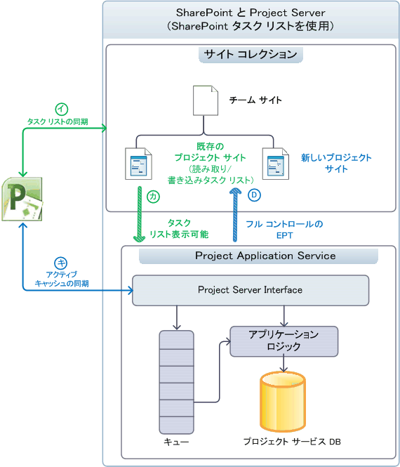

# Project Server のアーキテクチャ

Project Server 2013 では、SharePoint ファーム全体でのプロジェクト管理機能を統合し、オンラインのプロジェクトのレポート データのクライアント側オブジェクト モデル (CSOM) と、OData インターフェイスを使用できるようにします。
   
Project Server 2013 は、Office Project Server 2007 で導入されたアーキテクチャを拡張した多層システムです。 アーキテクチャの変更には、Project アプリケーション サービス、SharePoint サイト コレクション、web フロント エンド サーバー上のいくつかのビジネス オブジェクトの追加 (WFE)、リモート アクセス用のクライアント側オブジェクト モデル (CSOM)、1 つのプロジェクト データベースとの関連付けが含まれます、OData インターフェイス、ローカル サーバー、および複数の Project Server によってアクセス可能なリモート イベント レシーバーのレポート テーブルおよびビュー、Windows Workflow Foundation ワークフロー マネージャー クライアント 1.0 で、雲の中、またはバージョン 4 (WF4) の統合インストールします。 設置型のカスタム ソリューションに加え、リモート イベント レシーバーと CSOM および OData インターフェイスにアクセスするコンポーネントを含むアプリケーションを作成できます。
  
フロント エンド層には、評価のためのプロジェクトを Project Web App では、サード ・ パーティ製のアプリケーションが含まれています。 クライアント アプリケーションは、プロジェクト Server インターフェイス (PSI) を使用」または「CSOM のエンドポイントでは、PSI とビジネス オブジェクト層との通信中間層と通信します。 データベースへのアクセスは、ビジネス オブジェクトに統合されています。 プロジェクトのサーバー イベント処理システムは、ローカルのイベント ハンドラーとリモート イベント レシーバーの両方にアクセスできます。 プロジェクトの計算サービスは、Project Server 内で Project Professional のスケジュール エンジンを実装します。 プロジェクト データベースに直接アクセスするクライアント アプリケーションしないかどうか)Project Server は、クライアントからビジネス オブジェクトを非表示にします。
  
> [!NOTE]
> SharePoint アーキテクチャには、project Server がビルドされます。 SharePoint Server 2013 のアーキテクチャと、SharePoint アプリケーションのモデルについては、Office 2013 の開発者向けのドキュメントで、 *SharePoint の開発の概要*のセクションを参照してください。 

## SharePoint サイト コレクションとの統合

Project Server 2013 で Project アプリケーション サービスは、SharePoint タスク リストを使用するための SharePoint サイト コレクションに関連付けることができます。、Project アプリケーション サービスはすべての Project Server のエンタープライズ プロジェクトとして、SharePoint タスク リストをインポートもことができます。コントロールです。 SharePoint タスク リストでは、SharePoint がサイト コレクション内のプロジェクトのサイトを維持します。Project Professional と同期でき、タスクの一覧を更新することができます。 独立型の SharePoint タスク リストや、.mpp ファイルを使用して同期されるタスク リストをプロジェクトのサイトとして使用することができます。.mpp ファイルは、ローカル コンピューターまたは SharePoint ライブラリに格納できます。 
  
フル コントロールがある場合、project Server がプロジェクトを保持します。Project Professional では、Project Server に直接データを保存します。 表 1 は、Project Server にフル コントロールがある場合のタスクの一覧、スケジュールの web パーツ、その他の機能およびインポートされたプロジェクトのタスク リストの SharePoint コントロールの動作を比較します。 スケジュールの web パーツには、プロジェクトのスケジュールを編集することができます、Project Web App ページ上のグリッドが含まれています。 結合モードでは、状態管理のデータが入力される 1 回の両方のタスクとタイムシートです。1 つのエントリのモードでは、タイムシートから、タスクの状態管理データが別々 に入力します。
  
**表 1 です。SharePoint タスク リストおよびフル コントロールの比較**

| 機能 | タスク リスト | フル コントロール |
|:-----|:-----|:-----|
|**Sharepoint タスク リスト**   |読み取り/書き込み    |読み取り専用    |
|**スケジュールの web パーツ**   |読み取り専用    |読み取り/書き込み    |
|**レポート**   |Project Server を介した豊富なレポート機能    |Project Server を介した豊富なレポート機能    |
|**その他の Project Server の機能**   | ブロックされる機能:   -サーバー側プロジェクト編集では、Project Web App またはカスタムのクライアント ・ アプリケーションで   -状態管理   -タスクがリンク付けされているモードで表示されません。    |フル機能が有効    |
   
### SharePoint タスク リストとしてのプロジェクトの管理

Project Server は、SharePoint の管理、タスク ・ リストおよびドキュメント ライブラリ内の評価のためのプロジェクト (.mpp) ファイルは、プロジェクトのアプリケーション サービスに表示されているが、SharePoint の管理、SharePoint サイト コレクションに関連付けられている場合、マスター同期のためのデータ (図 1 を参照してください)。 サーバー側がスケジュールの web パーツを使用したスケジューリングを実行できません。 同期して、プロジェクト サイトのタスク リストを編集するのには、Project Professional を使用できます。 SharePoint タスク リストから、組織は Project Server のすべての機能を使用する展開徐々 にできます。
  
図 1 は、SharePoint タスク リストでプロジェクトが管理されている場合の以下の処理を示しています。 
  
- (A) Project Professional は、Project Application Service との関連付けの前後どちらでも、タスク リストと同期したり、サイト コレクションに新しいプロジェクト サイトを作成したりできます。
    
- (B) Project Server は、レポート目的でプロジェクト サイト データと同期しますが、マスター データは SharePoint が保持します。タスク リストは読み取り/書き込みのままです。
    
- (C) 関連付けの後、Project Professional で新しいプロジェクトを作成し、保存または Project Server に発行できます。Project Professional のアクティブ キャッシュにより、Project Server とのデータ同期が維持されます。
    
- (D) と、Project Professional の新しいプロジェクトが発行されると、ユーザーは、プロジェクトのプロジェクト サイトを作成するオプションを持ちます。 プロジェクトは、SharePoint タスク リストのプロジェクトの種類、またはフル コントロールのエンタープライズ プロジェクトの種類 (EPT) として、Project Web App で作成することもできます。 手順 (D) は、フル コントロール EPT を示しています。
    
**図 1 です。Sharepoint プロジェクトのサイトを使用してタスク ・ リストします。**

 

### フル コントロールの権限を使用したプロジェクトの管理

Project Server は、サイト コレクションに関連付けられてし、フル コントロールを持って、Project Server がエンタープライズ プロジェクトでは、タスクの一覧を表示する SharePoint がインポートされ、関連の .mpp ファイルを削除することができます。 Project Server のタスク リストの同期化のマスター データを維持します。サイト コレクション内のタスクの一覧では、読み取り専用 (図 2 参照) になります。 Project Professional を使用するか、Project Web App を使用して、インポートされたプロジェクトを編集できます。
  
> [!NOTE]
> Project Server がプロジェクトをインポートした後、ユーザーは、サイトからプロジェクトを削除するか、またはプロジェクトを編集する前に接続を切断するかを選択します。Project Professional でこの選択を行うことができます。 
  
図 2 は、Project Server がフル コントロールの権限でエンタープライズ プロジェクトを管理している場合の以下の処理を示しています。
  
- (A) ユーザーはインポートするプロジェクト サイトを選択できます。Project Server はプロジェクト サイトをインポートし、オプションで、関連する .mpp ファイルを削除します。インポートされたプロジェクトの SharePoint タスク リストは読み取り専用になります。
    
- (関連付けの後 B) は、Project Professional は新しいプロジェクトを作成、保存またはと Project Server に発行します。 Project Professional でアクティブ キャッシュは、プロジェクトのサーバーとデータの同期を維持します。 Project Web App の [スケジュール] web パーツには、サーバー側のスケジュールを実行できます。
    
- (C) と、Project Professional の新しいプロジェクトが発行されると、ユーザーは、プロジェクトのプロジェクト サイトを作成するオプションを持ちます。 プロジェクトのフル コントロール EPT と、Project Web App で作成したし、プロジェクト サイトのサイト コレクションに読み取り専用のタスク ・ リストの発行もできます。
    
**図 2 になります。フル コントロールを持つプロジェクトのサイトを使用します。**

  
## アーキテクチャの概要

図 3 は、プロジェクト サービス アプリケーションで、WFE では、上の 1 つの Project Web App インスタンスおよび評価のためのプロジェクトを含む他のいくつかのクライアント アプリケーションを含む、Project Server 2013 のアーキテクチャの汎用的なビューを示しています。
  
バックエンド プロジェクト サービス アプリケーションと通信する複数の Project Web App インスタンスが存在することができます。 設置型インストール、WFE を SharePoint ファーム構成で別のサーバーにすることができます。 またはプロジェクト サービス アプリケーションと同じ SharePoint サーバーのことができます。 オンライン プロジェクトにはには、WFE、プロジェクト サービス アプリケーション、およびローカルまたはリモート ワークフロー マネージャーのクライアント 1.0 サーバーが含まれています。 
  
**図 3 です。Project Server 2013 の全般的なアーキテクチャ**

 

図 3 には、次の一般的な説明が該当します。
  
- **オンライン プロジェクト:** CSOM、残りの部分、および OData インターフェイスを使用するアプリケーションを作成することができます。 アプリケーション パッケージは、ローカル サーバー上で、Azure サーバーの場合、または Microsoft Azure には、カスタムの web サービスでリモート イベント レシーバーをインストールすることも。 プロジェクトのオンラインでは、サード ・ パーティ製の設置型ソリューション、WCF インターフェイス、ASMX インターフェイス、またはローカルのイベント ハンドラーをサポートしていません。 
    
- **イベントの受信機:** イベント レシーバーは、イベント ハンドラーをということができます。 プロジェクトのオンラインでは、クラウド内の Project Web App インスタンスまたはオンプレミスの Project Server インストールで使用できる、リモートの Project Server イベント レシーバーの登録をサポートしています。 設置の Project Server インストールでは、リモート イベント レシーバーとローカルの完全信頼のイベント ハンドラーをサポートします。 
    
- **ブラウザー:** Project Server 2010 では、Project Web App の一部のページを表示するブラウザー間の制限はありません。 Project Web App で完全に使用するためは、以下のブラウザーがサポートされています。 
    
  - Internet Explorer の Windows 7 と Windows の以前のバージョン)、8.x Internet Explorer 9.x、および Internet Explorer の 10.x 
  - Firefox 4.x (Windows、Mac OS-X、および Linux/Unix)
  - Safari 5.x (Windows および Mac OS-X)
  - Chrome
    
- **プログラムのインタ フェース:** サード ・ パーティ製のアプリケーションのオンライン プロジェクトを公開する、HTTP および HTTPS インターフェイス (残りの部分を含む)、CSOM インタ フェース、CSOM の OData サービスおよびレポートの OData サービス。 設置 (イントラネット) 上にあるサードパーティ製のクライアント アプリケーションで、PSI の WCF インターフェイスを使用することができます。 または HTTP を介して CSOM、OData では、および残りの部分のインターフェイスを使用することができます。 Project Web App と評価のためのプロジェクトの両方のクライアントは、WCF インターフェイスを使用します。 インストールでは、1 台のサーバー、フロント エンド ASMX web サービス、CSOM、および残りの部分を内部で呼び出しますバックエンド WCF サービスです。 
    
    > [!NOTE]
    > PSI web サービスの SOAP ベースの ASMX インターフェイスでは、Project Server 2013 では、引き続き利用ですは推奨されていません。 
  
    レポートの OData サービスは、内部の OData.svc の WCF サービスによって実装されます。 使用して、レポート データのサービスのメタデータ ドキュメントを取得できます`http://ServerName/ProjectServerName/_api/ProjectData/$metadata`。 
    
    CSOM の OData サービスは Windows RT、iOS、Android は、HTML ページに JavaScript の REST インターフェイスを使用する場所などのプラットフォームを対象としています。 
    
    > [!NOTE]
    > ですが、 `$metadata` **ProjectData**サービスが無効な場合、レポート作成ののためのオプション、`$metadata`オプションを使用しない、CSOM の**ProjectServer**サービスが Project Server 2013 のリリース バージョンで削除します。 CSOM の残りのクエリの詳細については、 [Project Server のクライアント側オブジェクト モデル (CSOM)](client-side-object-model-csom-for-project-2013.md)を参照してください。 
  
- **PSI フォワーダー:** 個別 WFE の PSI へのプログラムによるアクセスは、WCF フォワーダーや Web サービス フォワーダーを含む、PSI フォワーダーを通過します。 ASMX インターフェイスを使用するクライアントは、Web サービス フォワーダーを通じて PSI をアクセスします。 WCF インターフェイスを使用するクライアントは、WCF フォワーダーを通じて PSI をアクセスします。 CSOM、OData では、および他のプログラムによるアクセスは、WCF フォワーダーをパイプします。 
    
- **ワークフロー:** 宣言型ワークフロー (SharePoint Designer 2013 で定義されているワークフロー) は、処理のためにワークフロー マネージャーのクライアント 1.0 に任されます。 ワークフロー マネージャー クライアント 1.0 は、別のサーバー ファームでは、SharePoint、クラウド、Microsoft Azure またはテストやデモンストレーションの 1 つの Project Server コンピューター上で実行できます。 Visual Studio 2012 で開発されるコード化されたワークフローは、Project Server 2010 のように、SharePoint のワークフローの実行時に処理されます。 詳細については、 [Project Server のワークフローの開発を開始する](getting-started-developing-project-server-workflows.md)を参照してください。
    
- **境界ネットワーク (DMZ):** 図 3 では、追加のファイアウォールを境界ネットワーク (「非武装地帯」または DMZ とも呼ばれます) により、オンプレミスの WFE サーバーを分離することができますが表示されません。 境界領域のネットワークは、インターネット クライアントが SharePoint と Project Server をファイアウォール経由でアクセスを許可できます。 
    
- **SharePoint Web サービス:** 図 3 では、バックエンドの SharePoint Web サービス アプリケーション、SharePoint Server 2013 の一部であるなどの SharePoint インフラストラクチャは表示されません。 Project Server をインストールすると、プロジェクト サービス アプリケーションは、SharePoint Web サービスに追加されます。 
    
フロント エンド層には、サードパーティ製のアプリケーション、Project Professional および Project Web App が含まれています。 ブラウザーでは、Project Web App の 4.0 の ASP.NET ページ (.aspx) を表示します。 Project Web App ページでは、PSI と通信し、標準的な SharePoint の Web パーツを使用しても Web パーツのサーバー プロジェクトを使用します。 
  
PSI および Project Server のビジネス エンティティを表す論理オブジェクトで構成されるビジネス オブジェクト層、中間層が含まれます。 ビジネス エンティティには、プロジェクト、タスク、リソース、割り当て、およびなどが含まれます。 PSI とビジネス オブジェクト層を密に結合し、同じサーバー上にあります。 クライアント アプリケーションは、使用可能なインタ フェースのいずれかで、PSI を呼び出すし、PSI がビジネス オブジェクトを呼び出します。 パフォーマンス向上のため、WFE の Project Server 2013 には、Project Server キュー システムを使用したり、プロジェクトの計算サービスを必要としないで、要求のいくつかのビジネス オブジェクトが含まれています。 WFE のビジネス オブジェクトは、プロジェクト データベースと直接通信します。
  
Project Server の Project Web App のコンポーネントでは、SharePoint 2013 の構成データベースを使用して、プロジェクト サイトのセットアップ ・ タスク ・ リスト、カスタム ページ、ワークフロー、管理設定、ドキュメント、およびリストなどのプロジェクト サイトのコンテンツのコンテンツ データベース懸案事項、リスク、およびコミットメント。 SharePoint の構成とプロジェクト管理、プロジェクト テンプレートなど、ワークスペースのコンテンツ データベースのサポートの追加機能は、チームの共同作業、およびレポートのユーザー設定が一覧表示されます。
  
### Project Web App と WFE

WFE および企業イントラネット内の複数の WFE サーバーのイントラネット クライアントの負荷分散を有効にするには、複数の Project Web App インスタンスを構成できます。 クライアント アプリケーションは、別の WFE サーバーに Project Web App インスタンスを使用する場合は、PSI の呼び出しが、PSI フォワーダーを通してルーティングされます。 (WCF フォワーダーや Web サービス フォワーダー) は、PSI フォワーダーは、次の関数を実行します。
  
- リモート クライアントから PSI への呼び出しを最適化します。
    
- プロジェクト サーバーのキュー サービスを必要とする PSI の呼び出しとそうでないものが区別されます。 非同期 PSI メソッド名は、キュー、 **QueueCreateProject**などで始まります。
    
- 登録されているローカル イベント ハンドラーを呼び出す PSI 呼び出しを識別します。
    
- Project Calculation Service を必要とする PSI 呼び出しを識別します。
    
- Project Professional のクライアント側アクティブ キャッシュと連動するサーバー ベースのキャッシュを使用して、Project Server へのラウンドトリップ呼び出しの数を減らします。
    
SharePoint サーバーでは、Project Server でユーザーを認証、PSI フォワーダー PSI サービスのバックエンド サービスを使用して、Project Server を実行しているコンピューター上の要求を透過的に送信します。 バックエンド サービスを必要としない要求は、ローカルの Project Web App インスタンス内のビジネス オブジェクトに送信されます。 PSI フォワーダーは、LAN、WAN、およびプロジェクトをオンラインでの処理、Project Server のスケーラビリティ、パフォーマンス、および信頼性を向上します。
  
Project Web App は、ASP.NET 4.0 で開発されています。 (HTML、サーバー コントロール、および静的テキスト) に、.aspx ファイル内のビジュアル要素は、コンパイル済みアセンブリ (.dll ファイル) では、分離コード クラスのプログラミング ロジックとは別です。 最上位のページ、プロジェクト センターでは、レポート センターなどでは、Project Web App では、サイト ページをカスタマイズするには、Web パーツを使用します。 タイムシートの確認] ページで、[サーバー設定] ページなど、**サイトの操作**] メニュー**の編集] ページ**のオプションがないアプリケーション ページは編集できません。 
  
### CSOM と Project Server Interface

PSI は 22 の公共サービス、**プロジェクト**、**リソース**、**カスタム フィールド**、**状態管理**などの影響を考慮します。 PSI には、内部使用のための 7 つのプライベート サービスも含まれています。 。 Project Server の基本的な API では、PSI です。CSOM および外部のアプリケーションに、Project Server の機能を公開します。 CSOM には、最も一般的に使用される PSI クラスおよびサード ・ パーティ製のアプリケーションに使用されるメンバーにアクセスするクラスが含まれています。 Project Server 2013 では、プロジェクトのサーバー機能の一部は、CSOM、**管理**、**予定表**、 **PortfolioAnalyses**、および**セキュリティ**サービスなどで利用可能ではありません。 
  
プロジェクトの評価のための Project Web App の使用の下書きで、発行されると、Project Server データにアクセスするための PSI と、テーブルとビューのプロジェクトのデータベースをアーカイブします。 PSI サービスにアクセスするにはプロキシ ファイルまたは、WCF サービスまたは ASMX web サービスのプロキシ アセンブリを使用します。
  
> [!NOTE]
> CSOM は、サードパーティの Project Server の開発者の推奨されるインタ フェースです。オンプレミスの Project Server のインストールとオンライン プロジェクトにアクセスするアプリケーションを使用できます。 CSOM には、アプリケーションを必要とする機能が含まれている場合、新しいアプリケーションを開発するため、CSOM を使用することをお勧めします。 
  
一部の基幹業務 (LOB) アプリケーションと Project Server 2010 用に開発されている他のサード ・ パーティ製アプリケーション、CSOM でまだ表されない PSI サービスが必要です。 プロジェクトのサーバーの設置型インストールのみを対象にする場合、アプリケーションは、WCF インターフェイスまたは PSI の ASMX インターフェイスを使用するのには継続できます。
  
クライアント アプリケーションは、サービス プロキシを通じて PSI を呼び出します。 WCF インターフェイスを使用するクライアントからのすべての PSI サービスのアクセス`http://ServerName/ProjectServerName/_vti_bin/psi/ProjectServer.svc`。 ASMX web サービスのインタ フェースを使用するクライアントは、特定のサービスの Project Web App の URL を使用します。 **リソース**のサービスが、たとえば、 `http://ServerName/ProjectServerName/_vti_bin/psi/resource.asmx?wsdl`。 アプリケーションでは、プロジェクトのサーバーをイントラネットにアクセスすることはない場合は、Project Web App サーバー (図 3 では表示されません)、境界ネットワークで使用できます。
  
図 4 は、ワークフロー マネージャーのクライアント 1.0 の SharePoint Server 2013 は、Project Server 2013 とローカルのワークフローの管理サイトの単一サーバー インストールの [**インターネット インフォメーション サービス (IIS) マネージャー**の **[接続**] ウィンドウを示します。 SharePoint サイト コレクション (A) には、フロント エンドの PSI サービスが含まれています、`_vti_bin\PSI`仮想サブディレクトリです。 SharePoint Web サービス アプリケーション (B) には、プロジェクト サービス アプリケーションのバックエンドの PSI サービスに、`508c23fb7dfd4c83a8919fae24bc68c5/PSI`仮想サブディレクトリです。 GUID は、Project Server のインストールのプロジェクト サービス アプリケーション インスタンスの名前です。 
  
**図 4 です。IIS マネージャーは、フロント エンド PSI (A)、およびバック ・ エンドの PSI (B) を表示しています。**

  
クライアント アプリケーションは、バックエンド プロジェクト サービス アプリケーションで PSI の WCF サービスに直接アクセスできません。 プロジェクト オンライン、クライアント アプリケーションへのアクセスを必要としないし、LOB アプリケーションのコンポーネントは、PSI のプロキシを使用します。 WCF のインターフェイスの図 4 では、**リソース**のサービスは、たとえば、バックエンドの URL になります`http://ServerName:32843/508c23fb7dfd4c83a8919fae24bc68c5/psi/resource.svc`。 ポート 32843 では、SharePoint Web サービス アプリケーションの既定の HTTP ポート (HTTPS 通信用のポートでは 32844)。 ただし、Project Web App のブロックの web.config ファイルに直接アクセスするバックエンドの PSI サービスです。
  
> [!NOTE]
> Project 2013 SDK ダウンロードには、WCF サービスと、ASMX サービスの PSI プロキシ ファイルとプロキシ アセンブリにコンパイルするための手順が含まれています。 > WCF インターフェイスを使用して、更新済みの PSI プロキシ ファイルを作成するにはには、Project Server コンピューター上で直接、svcutil.exe ユーティリティまたは Visual Studio を使用する必要が。 
  
PSI サービスのメンバーは通常生成またはビジネス オブジェクトと情報を交換するための手段として型指定された**DataSet**オブジェクトを使用します。 PSI 開発のためのいくつかの異なるモデルが用意されています。 たとえば、**リソース****名**、および**LookupTable**の PSI サービスでは、XML オブジェクトをフィルターを使用して、**データセット**を操作するため、他のサービスがないです。**状態管理**サービスの一部のメソッドは、他の方法およびサービスの操作を行いますしないときに_changeXml_パラメーターを使用します。 CSOM は、データセットを使用していません。 CSOM、PSI よりも別のプログラミング モデルには、.NET アセンブリまたは JavaScript を使用することができます、CSOM を使用した開発が一般に簡単、PSI を開発するよりもより一貫性のあります。 
  
PSI の詳細については、[プロジェクトの PSI リファレンスの概要](project-psi-reference-overview.md)を参照してください。 CSOM の詳細については、 [Project 2013 のクライアント側オブジェクト モデル (CSOM)](client-side-object-model-csom-for-project-2013.md)を参照してください。
  
### WFE のビジネス オブジェクトと Project サービス アプリケーション

Project Server の内部オブジェクト モデルには、プロジェクトやリソースなどの論理エンティティを表すビジネス オブジェクトが含まれます。クライアント アプリケーションが必ず CSOM または PSI を介してビジネス オブジェクトにアクセスし、ビジネス オブジェクトがプロジェクト データベースの下書き、発行済み、およびアーカイブの各テーブルとビューにアクセスします。
  
ビジネス オブジェクトはサードパーティの開発者に公開されません。PSI が API とビジネス オブジェクトのマッピングを処理し、CSOM が API と PSI をマッピングします。ビジネス オブジェクトの論理エンティティは、3 種類に分類できます。
  
- **コア エンティティ**は、プロジェクト、タスク、割り当て、リソース、および予定表などのオブジェクトです。 コア エンティティには、アクセス許可の名前付け規則などの基本的なビジネス ロジックが含まれます。 
    
- **ビジネス エンティティ**は、タイムシート、プロジェクトのポートフォリオ、モデルなどのオブジェクトです。 ビジネス エンティティは、追加のビジネス ロジックを含めるし、通常、コア エンティティの組み合わせから構築します。 
    
- **サポートのエンティティ**は、セキュリティや検証などのオブジェクトです。 
    
Project Server 2010 では、すべてのビジネス オブジェクトは、プロジェクト サービス アプリケーションで実装されます。 Project Server 2013 で、WFE は多くの同期メソッドを処理し、プロジェクトの計算サービスを必要としないビジネス オブジェクトをホストします。 **DeleteProject**や**ReadAssignments**などの同期の PSI メソッドは、Project Server キューのサービスを使用しません。 PSI での非同期メソッドで始まる名前を持つ`Queue`、 **QueueCreateProject**や**QueueUpdateTimesheet**などです。 非同期メソッドは、コントロールがユーザーに返されるときに、メソッドの処理をスケジュールするプロジェクト サーバー キュー サービスにメッセージを送ります。
  
PSI フォワーダーは、どの要求を Project サービス アプリケーションに送るか、WFE のビジネス オブジェクトがどの要求を処理できるかを判断します。WFE のビジネス オブジェクトは、WFE のその他の SharePoint の処理が構成データベースやコンテンツ データベースに直接アクセスするのと同じように、Project サービス アプリケーションをバイパスして、プロジェクト データベースに直接アクセスできます。WFE で多くのビジネス オブジェクトを実行すると、Project Server の効率が向上し、アプリケーション層の負荷が低減され、Project Server は作業負荷の増加に備えてスケールアップできます。
  
> [!NOTE]
> Project Server 2013 では、WFE と、バックエンド Project Server コンピューターにローカルのイベント ハンドラーを配置する必要があります。 
  
### Project Server データベース

Project Server 2013 のでは、以前のバージョンの 4 つの Project Server データベースは SQL Server のプロジェクトのデータベースを 1 つに結合されます。 プロジェクトの既定のデータベース名は、ProjectService です。 レポート テーブルおよびビューで、前の名前を保持する、 `dbo` dbo のようなプリフィックスです。MSP_EpmProject dbo.MSP_EpmProject_UserView。 テーブルとビューの下書きデータベースに含まれていたが、`draft`のプレフィックスです。 発行済みデータベースからテーブルとビューがある、`pub`のプレフィックスです。 アーカイブ データベースからテーブルとビューがある、`ver`のプレフィックスです。 
  
> [!IMPORTANT]
> 直接のアクセスが、ドラフトではサポートされていません (`draft`プレフィックス)、公開されている (`pub`プレフィックス)、およびアーカイブ (`ver`プレフィックス) のテーブルとビューです。 のみ、レポート テーブルおよびビューを持つレポートを使用する必要があります、`dbo`のプレフィックスです。 
  
プロジェクト データベースの Project Server データは、次のように分けられています。
  
- ドラフト テーブルとビューには、Project Professional と他のアプリケーションによって作成された非公開のプロジェクトからのデータが含まれています。 Project Web App では、ドラフトのテーブルおよびビューからプロジェクトのデータは表示されません。
    
- パブリッシュされたテーブルやビューのすべての発行済みプロジェクトとエンタープライズ リソース、エンタープライズ プロジェクトの種類 (EPTs)、グローバルなデータおよびその他のプロジェクト テンプレートが含まれています。 発行されたプロジェクトは、Project Web App で表示されます。 パブリッシュされたデータには、Project Web App の (タイムシート、モデル、ビュー、およびなど) に固有のテーブルとグローバル ・ データ ・ テーブル (ユーザー設定フィールド、参照テーブル、Project Server のアクセス許可、およびメタデータ) も含まれています。
    
- アーカイブ データには、プロジェクト、リソース、ユーザー設定フィールドなどのデータのバックアップ バージョンが保存されます。
    
- サード ・ パーティ製のアプリケーションで読み取り専用のアクセス、レポート、レポートのデータを使用できます。 プロジェクト サーバーの OLAP キューブを使用して、レポートのビューを持つ、`_OlapView`のサフィックスです。 OLAP キューブ設置の Project Server のインストールの場合では使用しないプロジェクトをオンラインで利用可能です。 
    
    レポート データは広範であり、ほぼリアルタイムで更新されます。レポート テーブルおよびビューは、読み取り専用のレポート生成用に最適化されています。たとえば、レポート テーブルは、冗長なデータを提供し、リレーショナル テーブルの数を減らすために、非正規化されています。
    
リソースやプロジェクトなどの論理エンティティは複数のテーブルに分かれている場合があり、特定のエンティティに関連するすべてのテーブルには同じ主キーが設定されています。主キーは、特定のエンティティの 1 つのインスタンスを一意に識別する単一の列の GUID です。
  
プロジェクトの Project Web App インスタンスごとにサーバーのデータは、別の名前で別のプロジェクト データベースに格納されます。 Project Server に直接アクセスするクライアント アプリケーションは、レポート テーブルおよびビューに直接読み取る。 リモート アクセスは、クライアント アプリケーションは、レポート データを取得するのに OData インターフェイスと REST インターフェイスを使用できます。 クライアントは、CSOM のみか、PSI を使用して、発行されると、下書きにアクセスして、テーブルとビューをアーカイブする必要があります。 レポート データ サービス (RDS、図 3 に示されていない) では、ほぼリアルタイムにパブリッシュされたデータからレポート データを更新します。 プロジェクト データベースは、別のサーバーに配置できます。
  
スキーマは、レポート テーブルおよびビューにのみ記載されています。 設置型のプロジェクトのサーバーのインストールの場合、レポートのテーブルおよびプロジェクトのデータベース スキーマで定義されていないエンティティのビューを追加できます。 カスタム、オンプレミス アプリケーションに別個のデータベースを作成することもできます。 変更は、下書きはサポートされていません、発行およびテーブルとビューをアーカイブします。 プロジェクト データベースがプロジェクトをオンラインで直接アクセス可能でないため、レポート テーブルおよびビューは変更できません。 ただし、SQL Azure のアカウントがある場合は、プロジェクトをオンラインでカスタムの使用するための別のデータベースを作成できます。
  
### イベント レシーバー

ローカル イベント ハンドラーとリモート イベント レシーバーを Project Server には、サード ・ パーティ製の機能拡張を作成するか、プロジェクトの発行など、プロジェクトのサーバー イベントへの応答を有効にします。 Project Server 2010 では、すべてのイベント ハンドラーは、ローカルでを導入したり、WFEs では、Project Server を実行しているコンピューター上で直接、プロジェクトのサーバー イベント処理システム内で実行して、完全信頼コードで記述されました。 完全に信頼できるイベント ハンドラーは、オンラインのプロジェクトの場合に使用することはできません、ために、Project Server 2013 は SharePoint Server 2013 でリモート イベント レシーバーのようなリモート イベント レシーバーを実装します。 Project Server 2013 の設置型インストールには、従来の完全に信頼できるイベント ハンドラーとリモート イベント レシーバーを使用できます。
  
Project Server のリモート イベント レシーバーは、Microsoft Azure または SOAP web サービスをサポートするその他の環境で実行される SOAP エンドポイントのカスタムの web サービスで実装できます。 Project Server アプリケーション パッケージは、アプリケーションと共にインストールされているリモート イベント レシーバーを含めることができます。
  
リモート イベント レシーバーは、CSOM 端点 (図 3 では表示されません) を使用して Project Server にコールバックできます。 リモート イベント レシーバーを呼び出すには、呼び出しを発行するプロジェクトのサーバーのイベント システムと Project Web App インスタンス (またはプロジェクトをオンラインで Project Web App のテナント) からの情報が含まれています。 リモート イベント レシーバーを作成し、複数の Project Server のインストールで使用できる 1 つの web サービスをホストできます。 対照的に、ローカルの完全信頼のイベント ハンドラーは、Project Server のインストールごとに展開する必要があります。
  
### 発行とサーバー側スケジューリング

Project Server 2013 には、手動と自動のプロジェクト スケジュールの更新プログラムの両方がサポートされています。 既定のプロセスは、手動のスケジュール更新です。 プロジェクト マネージャーをチェック アウトと Project Professional または Project Web App でプロジェクトを開く、変更を適用を保存し、変更する、利用可能なすべてのプロジェクトを発行します。、 Project Professional には、変更を計算し、Project Server に変更を保存し、スケジュール エンジンがあります。 Project Server 2010 では、サーバー側のスケジュール エンジンとは、Project Professional のスケジュール エンジンから別の実装です。
  
Project Server 2013 のでは、プロジェクトの計算サービスは、評価のためのプロジェクト内にある同じスケジューリング エンジンを実装します。 プロジェクトの計算サービスは、 **Microsoft Project サーバーの計算サービス**をという名前の Windows サービスで実行されます。 Project Web App または CSOM 結果を正確に同じスケジュールの変更、Project Professional で使用するサード ・ パーティ製アプリケーションとプロジェクトのスケジュールを編集します。
  
> [!NOTE]
> PSI を使用するサード ・ パーティ製アプリケーションは、Project Web App を計算するためのスケジュールからいくつかのスケジュールの違いを表示する可能性があります。 下位互換性のためは、サーバー側でもスケジュール設定を行う PSI のパブリック メソッドは、Project Server 2010 で導入されたスケジューリング エンジンを使用します。 **QueueUpdateProject2**、Project Server 2013 の新しい PSI メソッドは例外です。 などのスケジュール エンジンが古いはサブプロジェクトまたは他のプロジェクトへのリンクをスケジュールしませんし、達成額フィールドは計算されません。 避けるために可能性のあるサードパーティ製のアプリケーションと Project Professional または Project Web App では、間の相違をスケジューリングする必要がありますアプリケーションを開発する、CSOM で可能な場合。 
  
Project Server では、以下の手順により、プロジェクト マネージャーが下書きバージョンを使用している間に、プロジェクトの発行済みバージョンを更新できます。
  
1. Project Server が更新の適用と発行済みバージョンの再スケジュールを行います。
    
2. 次のどちらかのイベントが発生すると、Project Server は更新を保存し、下書きバージョンに適用します。
    
   - Project Professional でプロジェクトが開かれます。
    
   - Project Professional でプロジェクトの発行が試みられます。
    
3. 競合がある場合はプロジェクト マネージャーに知らせ、プロジェクト マネージャーは下書きバージョンを発行する前に競合を解決する必要があります。
    
## 関連項目

- [開発者の Project 2013 の概要](http://msdn.microsoft.com/library/8da91ab0-af4f-429f-8241-490600e3f7bd%28Office.15%29.aspx)
- [プロジェクト サーバー プログラミング](project-server-programmability.md)  
- [Project 2013 のクライアント側オブジェクト モデル (CSOM)](client-side-object-model-csom-for-project-2013.md)  
- [PSI とものはありません。](what-the-psi-does-and-does-not-do.md)  
- [開発 Project Server ワークフローの開始を取得します。](getting-started-developing-project-server-workflows.md)   
- [プロジェクト PSI リファレンスの概要](project-psi-reference-overview.md)   
- [Open Data Protocol](http://www.odata.org/)
    

