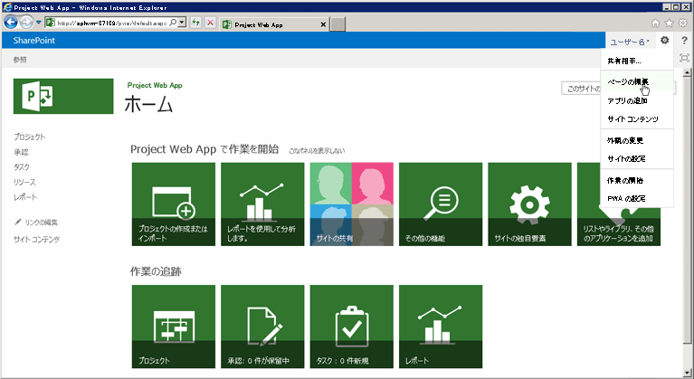
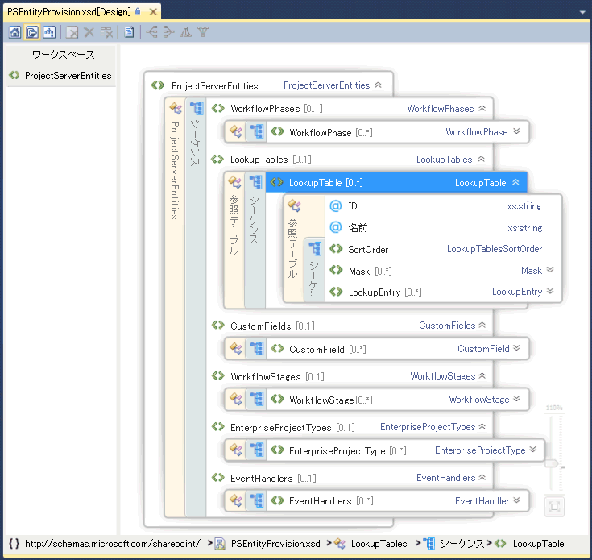

# Project Server プログラミングProject Server programmability

Project Server 2013 の主なプログラミング機能について説明します。Learn about the major programmability features in Project Server 2013. この資料には、Project Server の以前のバージョンでビルドされたアプリケーションの移植に関する情報が含まれています。This article includes information about porting applications that were built for previous versions of Project Server.

Project Server 2013 は、Project Server 2010、新しいソリューションの複数のプラットフォームでは、アプリケーションがアクセスできる場所両方オンラインとプロジェクトのサーバー設置のために開発されたほとんどのアプリケーションをサポートするよう設計されています。Project Server 2013 is designed to support most applications that were developed for Project Server 2010 and new solutions for multiple platforms, where apps can access both online and on-premises Project Server installations. クライアント側オブジェクト モデル (CSOM) またはプロジェクト Server インターフェイス (PSI) を使用するのには、アプリケーションと Project Server 2003 またはそれ以前に開発された拡張機能を再設計する必要があります。Applications and extensions that were developed for Project Server 2003 or earlier must be redesigned to use the client-side object model (CSOM) or the Project Server Interface (PSI). Office Project Server 2007 の Project Server 2010 で開発されたアプリケーションはいくつかの変更とは、PSI を使用して再コンパイルする必要があります。これらのアプリケーションでは、CSOM を使用するには、再設計が必要です。Applications that were developed for Office Project Server 2007 or Project Server 2010 may require some changes and recompiling to use the PSI; to use the CSOM, those applications require a redesign.
  
Project Server プラットフォームでは、SharePoint Server 2013、.NET Framework 4、および、CSOM で OData プロトコルをベースにした高レベルのプログラマの生産性を使用できます。The Project Server platform enables high levels of programmer productivity by building on SharePoint Server 2013, .NET Framework 4, and the OData protocol with the CSOM. 開発者は、アプリケーション、アプリケーションの部分、および Web パーツを使用して Project Web App を拡張、SharePoint Designer 2013 を使用してワークフローを定義および Project Server のイベントのリモート イベント レシーバーを使用してビジネス ルールを適用することができます。Developers can extend Project Web App with apps, app parts, and Web Parts, define workflows by using SharePoint Designer 2013, and enforce business rules by using remote event receivers for Project Server events.
  
## Project Server と SharePoint ServerProject Server and SharePoint Server

Project Web App は、SharePoint Server 2013 とマスター ページおよび Web パーツを使用して、カスタム アプリケーションと Project Web App のソリューションを構築しやすくします。Project Web App is built upon SharePoint Server 2013, and uses master pages and Web Parts to make it easier to build custom apps and Project Web App solutions. プロジェクトの共同作業、レポート作成、サイトの管理、セキュリティ、およびワークフローの管理のためのプラットフォームとして、Project Server 2013 が SharePoint Server 2013 では深く統合されます。Project Server 2013 integrates deeply with SharePoint Server 2013 as the platform for project collaboration, reporting, site administration, security, and workflow management.
  
プロジェクト サイトの詳細を含めるし、成果物、プロジェクトのサマリー情報や専門的な SharePoint リストでは、タイムライン、追跡の問題、リスク、タスクのプロジェクトを含む既定のアプリケーションを追加するときは、チーム メンバーの共同作業のオプションと、チームの予定表、ドキュメント ライブラリ、およびチームのディスカッションとします。The project sites include more information and collaboration options for team members, where you can add default apps that include a project summary, specialized SharePoint lists for tasks with a timeline, tracking issues, risks, project deliverables, and the team calendar, along with the document library and team discussions. Project Server 2013 のカスタム アプリケーションは、拡張機能と共同作業の柔軟性を提供します。Custom apps for Project Server 2013 provide extensions and flexibility for team collaboration. 追加し、ページを編集するときに Web パーツを編集するのと同じメカニズムを使用して、アプリケーションをカスタマイズするのにはアプリケーションのパーツを追加することもできます。You can also add app parts to customize an app, by using the same mechanism to add and edit Web Parts when you edit a page. Project Server がインストールされている SharePoint ファーム内の任意の場所のプロジェクトのサイトを見つけることができます。You can locate project sites anywhere within the SharePoint farm where Project Server is installed. Excel Services と、エンタープライズ検索など、SharePoint Server 2013 のコア サービスを使用するには、管理者を有効にして、サービスを構成します。To use other core services of SharePoint Server 2013, such as Excel Services and Enterprise Search, an administrator can enable and configure the services. 
  
Project Server 2013 をインストールするときに、SharePoint Web サービス サイトのプロジェクト サービス アプリケーションを準備します。When you install Project Server 2013, you provision the Project Service Application in the SharePoint Web Services site. プロジェクト サービス アプリケーションには、ローカルの Windows Communication Foundation (WCF) サービスと、PSI の ASMX web サービスが含まれています。The Project Service Application includes the local Windows Communication Foundation (WCF) services and ASMX web services for the PSI. サービス アプリケーションの他の例には、SharePoint の検索と SharePoint ドキュメントの管理が含まれます。Other examples of service applications include SharePoint Search and SharePoint Document Management. 詳細については、SharePoint Server 2013 の開発者向けドキュメントを参照してください。For more information, see the SharePoint Server 2013 developer documentation.
  
プロジェクト サービス アプリケーションは、Project Web App の複数のインスタンスを管理できる論理サービス プロバイダーです。The Project Service Application is a logical service provider that can manage multiple instances of Project Web App. プロジェクト サーバーのプロビジョニングは、SharePoint web アプリケーション内で特定の Project Web App サイトを作成します。Project Server provisioning creates a specific Project Web App site within a SharePoint web application. Project Web App のホーム ページには、[プロジェクト センター] ページ、リソース センター] ページで、レポート、ビジネス インテリジェンス センターのページおよびその他の標準的なアプリケーションの一覧を含むページへのリンクが含まれています。The Home page of Project Web App contains links to the Project Center page, Resource Center page, and the Business Intelligence Center page for reporting, plus a page that contains a list of additional standard apps. 図 1 は、**設定**のドロップ ダウン リストを追加する Web パーツを編集することができる Project Web App のホーム ページ上で**の編集] ページ**のコマンドを示します。Figure 1 shows the **Edit Page** command in the **Setttings** drop-down list on the Home page of Project Web App, which allows you to add or edit Web Parts. 
  
> [!NOTE]
> Project Web App でいくつかの管理ページ、PWA の設定] ページなど、編集可能にしていないし、**ページの編集**] コマンドを表示しません。Some administrative pages in Project Web App—such as the PWA Settings page—are not editable, and do not show the **Edit Page** command. Project Web App では、SharePoint Designer 2013 を使用してページを編集できません。Project Web App does not allow you to edit pages by using SharePoint Designer 2013. SharePoint Designer 2013 を使用してプロジェクト サイトのページを編集することができます。You can edit project site pages with SharePoint Designer 2013. 
  
**図 1. Project Web App の [ページの編集] メニューの使用****Figure 1. Using the Edit Page menu in Project Web App**

  
Project Web App で [サイト設定] ページにアクセスするには、ページの右上隅で**設定**アイコンを選択します。To access the Site Settings page in Project Web App, choose the **Settings** icon in the top-right corner of the page. [サイト設定] ページ ( `http://ServerName/ProjectServerName/_layouts/15/settings.aspx`) の外観と印象およびサイトのテーマを変更することにより、カスタムの Web パーツを追加し、変更または作成マスター プロジェクト サイトのページです。The Site Settings page (  `http://ServerName/ProjectServerName/_layouts/15/settings.aspx`) enables changing the look and feel and the site theme, adding custom Web Parts, and modifying or creating master pages for project sites.
  
ASPX ページのコードをカスタマイズまたは SharePoint Designer 2013 では、Project Web App のマスター ページのカスタマイズはサポートされていません。Customization of the code in ASPX pages, or customization of Project Web App master pages with SharePoint Designer 2013, is not supported. Project Web App ページ内のコードのカスタマイズには、Project Server の更新プログラムおよび service pack で問題が発生します。Customization of the code in Project Web App pages can cause problems with Project Server updates and service packs. 
  
### SharePoint パッケージによる Project Web App のカスタマイズCustomization of Project Web App with SharePoint packages

Project Web App では、SharePoint アプリケーションの場合は、プロジェクトのサイトは、SharePoint サイト、SharePoint パッケージ (.wsp ファイル) または SharePoint アプリケーション (.spapp ファイル) を使用して、カスタム アプリケーション、Web パーツ、イベント ハンドラー、カスタム フィールド、およびその他の機能を追加できます。Because Project Web App is a SharePoint application, and project sites are SharePoint sites, you can add custom apps, Web Parts, event handlers, custom fields, and other features by using SharePoint packages (.wsp files) or SharePoint apps (.spapp files). SharePoint パッケージまたは、アプリケーション パッケージには、elements.xml ファイル パッケージ内のエンティティの定義が指定されている、Project Server の複数のエンティティを含めることができます。A SharePoint package or an app package can include multiple Project Server entities, where entity definitions are specified in an elements.xml file within the package.
  
オンラインのプロジェクトの Project Web App のリボンにボタンを追加することができますが、削除または、既存の製品のボタンの名前を変更することはできず、新しいリボン タブを作成することはできません。For Project Online, you can add buttons to the Project Web App ribbon, but you can't remove or rename existing product buttons, and you can't create new ribbon tabs. 詳細については、 [SharePoint のアプリケーションと共に配置するカスタム アクションの作成](http://msdn.microsoft.com/en-us/library/office/apps/jj163954%28v=office.15%29.aspx)を参照してください。For more information, see [Create custom actions to deploy with apps for SharePoint](http://msdn.microsoft.com/en-us/library/office/apps/jj163954%28v=office.15%29.aspx).
  
> [!CAUTION]
> SharePoint パッケージまたはアプリ パッケージのインストール時には、Project Server エンティティの種類が PSEntityProvision.xsd スキーマに指定された順序で出現する必要があります。そうでない場合、パッケージのスキーマ検証が失敗し、インストールは完了しません。When you install a SharePoint package or an app package, the types of Project Server entities must appear in the order that the PSEntityProvision.xsd schema specifies or schema validation of the package fails and installation is not completed. 
  
PSEntityProvision.xsd スキーマ ファイルは、Project 2013 SDK のダウンロードに使用可能で、`Documentation\Schemas\AppProvisioning`のサブディレクトリです。The PSEntityProvision.xsd schema file is available in the Project 2013 SDK download, in the  `Documentation\Schemas\AppProvisioning` subdirectory. 図 2 は、 **LookupTable**シーケンスが展開されている、 **PSEntityProvision**スキーマの Visual Studio で XML スキーマのエクスプ ローラー ビューを示しています。Figure 2 shows the XML Schema Explorer view in Visual Studio of the **PSEntityProvision** schema, where the **LookupTable** sequence is expanded. 
  
**図 2. Project Server エンティティ準備スキーマの Visual Studio ビュー****Figure 2. Visual Studio view of the Project Server entity provisioning schema**

  
Project Server 用の機能をインストールする SharePoint パッケージには、**PSEntityProvision** スキーマに従った elements.xml ファイルを 1 つまたは複数含めることができます。1 つの XML ファイル内の Project Server エンティティは、次の順序で出現する必要があります。SharePoint packages that install features for Project Server can contain one or more elements.xml files that follow the **PSEntityProvision** schema. The Project Server entities in a single XML file must appear in the following order: 
  
1. ワークフロー フェーズWorkflow phases
    
2. 参照テーブルLookup tables
    
3. ユーザー設定フィールドCustom fields
    
4. ワークフロー ステージWorkflow stages
    
5. エンタープライズ プロジェクトの種類Enterprise project types
    
6. イベント ハンドラーEvent handlers
    
Project Server エンティティを含む SharePoint パッケージを作成するときに、複数の elements.xml ファイルにエンティティ定義を含めることができます。各 XML ファイルがスキーマ検証に合格しても、パッケージ全体ではエンティティの順序が正しくない可能性があります。たとえば、最初の XML ファイル内のユーザー設定フィールド エンティティが 2 番目の XML ファイル内の参照テーブルを参照している場合があります。インストール時には、参照テーブルがまだ作成されていないため、ユーザー設定フィールドを作成できません。When you create a SharePoint package that contains Project Server entities, it is possible to put the entity definitions in multiple elements.xml files. Each XML file could pass the schema validation, but the entities in the whole package might not be in the correct order. For example, a custom field entity in the first XML file could refer to a lookup table in the second XML file. During installation, the custom field cannot be created because the lookup table has not yet been created.
  
パッケージのインストールが失敗した場合、Project Web App に作成されたオブジェクトがあるが、パッケージが完全にインストールされません。If a package installation fails, objects that have been created remain in Project Web App, but the package does not install completely. パッケージを再インストールできる機能しますが、お客様にとって適切な環境ではありません。Reinstalling the package can work, but that is not a good experience for customers. エンティティの定義は、複数の elements.xml ファイルにまたがる、ときに、SharePoint パッケージのインストールが正しい順序に従っていることを確認するのには全体の Project Server エンティティを整理します。When the entity definitions span multiple elements.xml files, organize the Project Server entities in the entire SharePoint package to ensure that installation follows the correct order. Project 2013 SDK ダウンロードの PSEntityProvision.xsd スキーマには、XML ファイル内のエンティティの指定順序をチェックするツールを開発することです。With the PSEntityProvision.xsd schema in the Project 2013 SDK download, it is possible to develop a tool that checks for the prescribed order of entities in the XML files.
  
## Project Server API によるアプリケーションのアップグレードUpgrading applications with the Project Server APIs

前のバージョンの Project Server 向けに開発されたアプリケーションをアップグレードする場合は、プロジェクト エンティティの作成、読み取り、更新、および削除のためのメソッド (CRUD 操作) を含むプログラム インターフェイスとして CSOM と PSI のどちらを使用するかを選択できます。CSOM は内部で PSI を呼び出しますが、すべての PSI メソッドに完全に代わるものではありません。PSI と CSOM のシナリオと制約については、「[What the PSI does and does not do](what-the-psi-does-and-does-not-do.md)」および「[What the CSOM does and does not do](what-the-csom-does-and-does-not-do.md)」を参照してください。When you upgrade an application that was developed for a previous version of Project Server, you can choose to use either the CSOM or the PSI for a programmatic interface that includes methods to create, read, update, and delete project entities (the CRUD operations). Although the CSOM internally calls the PSI, it does not fully replace all PSI methods. For scenarios and limitations of the PSI and of the CSOM, see [What the PSI does and does not do](what-the-psi-does-and-does-not-do.md) and [What the CSOM does and does not do](what-the-csom-does-and-does-not-do.md).
  
> [!NOTE]
> CSOM には、必要な機能が含まれている場合は、CSOM を使用するアプリケーションをアップグレードすることをお勧めします。If the CSOM includes the functionality you require, we recommend that you upgrade applications to use the CSOM. CSOM は、オンプレミスと Project Server 2013 のオンライン インストールの両方に使用するアプリケーションを有効にします。The CSOM enables applications to be used for both on-premises and online installations of Project Server 2013. 
  
主に、アプリケーションは、Project Server からデータを読み取り場合、は、社内設置型のシナリオでは、Project Server データベースにレポートのテーブルとビューを使用できます。If your application primarily reads data from Project Server, you can use the reporting tables and views in the Project Server database for an on-premises scenario. プロジェクトをオンラインでアプリケーションを使用する場合は、OData プロトコルを使用して、 **ProjectData**サービスは、設置型とレポートのデータをオンライン ・ アクセスの両方を提供することができます。If you intend to use the application with Project Online, you can use the OData protocol for the **ProjectData** service, which provides both on-premises and online access to the reporting data. 詳細については、 [ProjectData - プロジェクトの OData サービスの参照](https://msdn.microsoft.com/en-us/library/office/jj163015.aspx)を参照してください。For more information, see [ProjectData - Project OData service reference](https://msdn.microsoft.com/en-us/library/office/jj163015.aspx)
  
### PSI の使用Using the PSI

PSI には、SharePoint ファーム内の Project Server データにアクセスするのには、評価のためのプロジェクトを Project Web App では、LOB アプリケーションを含む、完全信頼クライアント アプリケーションが有効にします。The PSI enables full-trust client applications, including Project Professional 2013, Project Web App, and LOB applications, to access Project Server data within a SharePoint farm. PSI がビルドされ、.NET Framework 4 で使用し、組み込みのセキュリティ、エラー処理、およびガベージ コレクションなどのよく知られている開発環境を提供します。The PSI is built and used with .NET Framework 4 and provides advantages such as a well-known development environment with built-in security, error handling, and garbage collection.
  
PSI は、WCF サービスまたは ASMX web サービスを介してアクセスされます。The PSI is accessed through WCF services or ASMX web services. ASMX インターフェイスは、WCF に基づいています。The ASMX interface is based on WCF. 各 PSI サービスには通常、そのクラス内の項目に対して CRUD メソッドを基本クラスが含まれます。Each PSI service typically contains a base class with CRUD methods for items within that class. アイテムは、関連する**データセット**クラスによって指定されます。Items are specified by related **DataSet** classes. など**名**サービスには、 [CreateCustomFields2](https://msdn.microsoft.com/library/WebSvcCustomFields.CustomFields.CreateCustomFields2.aspx)などの方法でクラス**名**が含まれています。For example, the **CustomFields** service contains the **CustomFields** class with methods such as [CreateCustomFields2](https://msdn.microsoft.com/library/WebSvcCustomFields.CustomFields.CreateCustomFields2.aspx) . 1 つまたは複数のエンタープライズ ユーザー設定フィールドのデータは、 **CustomFieldDataSet**で指定されます。Data for one or more enterprise custom fields are specified in the **CustomFieldDataSet**.
  
> [!NOTE]
> Project Server 2013 では、PSI は、ASMX web サービス インターフェイスは推奨されていません。The ASMX web services interface of the PSI is deprecated in Project Server 2013. ASMX インターフェイスは利用できますが、PSI を使用する新しいアプリケーションは、WCF インターフェイスを使用する必要がありますか、可能であれば、新しいアプリケーションは PSI のではなく、CSOM を使用する必要があります。Although the ASMX interface is still available, new applications that use the PSI should use the WCF interface, or if possible, new applications should use the CSOM instead of the PSI. Project Server の将来のバージョンには、既存の ASMX ベース アプリケーション、PSI の WCF インターフェイスを使用するか、CSOM を使用するアップグレードが必要です。Future versions of Project Server will require an upgrade of existing ASMX-based applications to use the WCF interface of the PSI or to use the CSOM. 
  
22 があるパブリック PSI サービスは、WCF インターフェイスおよび ASMX インターフェイス内で重複して、文書化します。There are 22 public, documented PSI services, which are duplicated in the WCF interface and the ASMX interface. PSI には、8 つのプライベートな非公開のサービスも含まれています。The PSI also includes eight private, undocumented services. Project Web App と Project Professional は、PSI サービスをパブリックとプライベートの PSI サービスを使用します。Project Web App and Project Professional use the public PSI services and the private PSI services. PSI は、ビジネス オブジェクトに一致するように一般的に考慮されます。The PSI is generally factored to match the business objects. 各 PSI メソッドは、**カレンダー**や**リソース**などのビジネス オブジェクトに関連付けられています。That is, each PSI method is associated with a business object such as **Calendar** or **Resource**. PSI は、ビジネス オブジェクトをプライマリ インターフェイスです。The PSI is the primary interface to the business objects. ビジネス層では、再利用可能なビジネス ロジック コンポーネントを提供するため、Project Server データと対話するさまざまなアプリケーションは、同じビジネス ロジックを使用します。Because the business layer provides reusable business logic components, different applications that interact with Project Server data use the same business logic.
  
Project Server で非同期的にデータをやり取りする PSI メソッドは、**キュー**で始まる名前を持ちます。PSI methods that asynchronously interact with Project Server have names that begin with **Queue**. 各 PSI メソッドは、別のインターフェイスを使用して厳密型指定されたデータで実装されます。Each PSI method is implemented with a separate interface that uses strongly typed data. たとえば、**プロジェクト**のサービスの**QueueCreateProject**メソッドは、 **ProjectDataSet**の種類の_データセット_パラメーターを受け付けます。For example, the **QueueCreateProject** method in the **Project** service accepts the  _dataset_ parameter of type **ProjectDataSet**. **ProjectDataSet**クラスは**データセット**の型から派生します。The **ProjectDataSet** class is derived from the **DataSet** type. PSI を使用して開発で発生したエラーを減らすために、Visual Studio ヘルプの.NET Framework と IntelliSense の入力候補でチェックを入力します。Type checking in the .NET Framework and IntelliSense completion in Visual Studio help to reduce errors in development with the PSI. PSI の名前空間、クラス、メソッド、プロパティ、イベント、および関連アセンブリの詳細なリファレンスの概要については、[プロジェクトの PSI リファレンスの概要](project-psi-reference-overview.md)を参照してください。For an introduction to the detailed reference for PSI namespaces, classes, methods, properties, events, and related assemblies, see [Project PSI reference overview](project-psi-reference-overview.md).
  
Project Server 2013 では、.NET Framework の例外処理を使用します。Project Server 2013 uses the exception handling of the .NET Framework. PSI スタックの最上部にある、サーバーでは、すべてのエラーが記録されます。All errors are logged in the server, at the top of the PSI stack. いくつかのエラーでは、ASMX インターフェイス用の**SoapException**オブジェクトまたは WCF インターフェイスの**FaultException**オブジェクトなどのクライアントに簡単なレポートを送信します。Some errors send a simple report to the client, such as a **SoapException** object for the ASMX interface or a **FaultException** object for the WCF interface. 例外は、アプリケーション イベント ログに記録でき、いくつかのエラーがサーバー上の詳細なレポートをユニファイド ログ サービス (ULS) トレース ログにも記録します。Exceptions can be recorded in the application event log, and some errors also record a detailed report on the server in the Unified Logging Service (ULS) trace logs. 
  
ローカルの完全信頼アプリケーションに対しても、PSI は拡張性に優れています。サービスを含む .NET アセンブリを追加し、そこで新しい機能を提供し、同じ Project Server セキュリティ インフラストラクチャを使用し、他の PSI メソッドを呼び出したり PSI のクラスを継承したりできます。PSI 拡張機能では、新しい機能で必要とされるビジネス ロジックとデータベース アクセスも提供できます。For local full-trust applications, the PSI is also extensible. You can add a .NET assembly with a service that provides new functionality, uses the same Project Server security infrastructure, and calls other PSI methods or inherits from PSI classes. A PSI extension can also provide the business logic and database access required for new functionality.
  
### CSOM の使用Using the CSOM

CSOM では、プロジェクトのオンラインまたはオンプレミスの Project Server 2013 のインストールにアクセスするアプリケーションを開発できます。With the CSOM, you can develop apps that access Project Online or an on-premises Project Server 2013 installation. Office のパブリック ストアまたはプライベート アプリ カタログでは、アプリケーションを配布できます。Apps can be distributed in a public Office Store or a private app catalog. CSOM は、使用する API を直接消費するデータセットを渡すと、 _changeXml_パラメーターまたは XML_フィルター_パラメーターを作成するではなく、LINQ クエリでは、名前によって、データを提供するよう設計されています。The CSOM is designed to be an easy-to-use API that directly consumes or provides data by name with LINQ queries, rather than by passing datasets and constructing  _changeXml_ parameters or XML  _filter_ parameters. CSOM は、**プロジェクト**、**タスク**、 **EnterpriseResource**、および**割り当て**などのプライマリ エンティティのプロジェクト Server インターフェイス (PSI) の主な機能を実装します。The CSOM implements the main functionality of the Project Server Interface (PSI) for the primary entities such as **Project**, **Task**, **EnterpriseResource**, and **Assignment**. CSOM には、**カスタム フィールド**など**LookupTable**、 **WorkflowActivities**、**イベント ハンドラー**、 **QueueJob**、その他の一般的なプロジェクトのサーバーの機能をサポートしているその他さまざまなエンティティが含まれています。The CSOM includes many additional entities such as **CustomField**, **LookupTable**, **WorkflowActivities**, **EventHandler**, and **QueueJob**, which support other common Project Server functionality.
  
CSOM は、次のリソースをローカルの開発用コンピューターにコピーすることによって使用できます。The CSOM can be used by copying the following resources to your local development computer:
  
- .NET Framework 4 の開発のためのコピー、`%ProgramFiles%\Common Files\Microsoft Shared\Web Server Extensions\15\ISAPI\Microsoft.ProjectServer.Client.dll`のアセンブリです。For .NET Framework 4 development, copy the  `%ProgramFiles%\Common Files\Microsoft Shared\Web Server Extensions\15\ISAPI\Microsoft.ProjectServer.Client.dll` assembly. 
    
  CSOM のクラスとメンバーのドキュメントについては、 [Microsoft.ProjectServer.Client](https://msdn.microsoft.com/library/Microsoft.ProjectServer.Client.aspx)名前空間を参照してください。For documentation of the CSOM classes and members, see the [Microsoft.ProjectServer.Client](https://msdn.microsoft.com/library/Microsoft.ProjectServer.Client.aspx) namespace. サンプル アプリケーションでは、 [CSOM および .NET の概要](getting-started-with-the-project-server-csom-and-net.md)を参照してください。For an example application, see [Getting started with the CSOM and .NET](getting-started-with-the-project-server-csom-and-net.md).
    
- Microsoft Silverlight の開発のためのコピー、`%ProgramFiles%\Common Files\Microsoft Shared\Web Server Extensions\15\TEMPLATE\LAYOUTS\ClientBin\Microsoft.ProjectServer.Client.Silverlight.dll`のアセンブリです。For Microsoft Silverlight development, copy the  `%ProgramFiles%\Common Files\Microsoft Shared\Web Server Extensions\15\TEMPLATE\LAYOUTS\ClientBin\Microsoft.ProjectServer.Client.Silverlight.dll` assembly. 
    
- Windows Phone 8 のアプリを開発するには、コピー、`%ProgramFiles%\Common Files\Microsoft Shared\Web Server Extensions\15\TEMPLATE\LAYOUTS\ClientBin\Microsoft.ProjectServer.Client.Phone.dll`のアセンブリです。To develop apps for Windows Phone 8, copy the  `%ProgramFiles%\Common Files\Microsoft Shared\Web Server Extensions\15\TEMPLATE\LAYOUTS\ClientBin\Microsoft.ProjectServer.Client.Phone.dll` assembly. 
    
- Web アプリケーションおよびその他のデバイス用のアプリケーションを開発するための JavaScript を使用するには、コピー、`%ProgramFiles%\Common Files\Microsoft Shared\Web Server Extensions\15\TEMPLATE\LAYOUTS\PS.js`ファイルと`PS.debug.js`ファイルです。To use JavaScript for developing web apps and apps for other devices, copy the  `%ProgramFiles%\Common Files\Microsoft Shared\Web Server Extensions\15\TEMPLATE\LAYOUTS\PS.js` file and the  `PS.debug.js` file. 例 web アプリケーションでは、 [Project Server 2013 の JavaScript オブジェクト モデルの概要](getting-started-with-the-project-server-2013-javascript-object-model.md)を参照してください。For an example web app, see [Getting started with the Project Server 2013 JavaScript object model](getting-started-with-the-project-server-2013-javascript-object-model.md).
    
は PSI を内部的に呼び出して、CSOMしたがって、PSI には、ジョブを実行できない、どちらもことができます、CSOM。The CSOM internally calls the PSI; therefore, if the PSI cannot do a job, neither can the CSOM. CSOM の制限については、[どのような「CSOM は行われない](what-the-csom-does-and-does-not-do.md)し、、[何の PSI を行い、実行できない](what-the-psi-does-and-does-not-do.md)を参照してください。For limitations of the CSOM, see [What the CSOM does and does not do](what-the-csom-does-and-does-not-do.md) and [What the PSI does and does not do](what-the-psi-does-and-does-not-do.md). CSOM を使用した開発の詳細については、 [Project 2013 の開発者用の更新プログラム](updates-for-developers-in-project-2013.md)および[Project 2013 のクライアント側オブジェクト モデル (CSOM)](client-side-object-model-csom-for-project-2013.md)を参照してください。For more information about developing with the CSOM, see [Updates for developers in Project 2013](updates-for-developers-in-project-2013.md) and [Client-side object model (CSOM) for Project 2013](client-side-object-model-csom-for-project-2013.md).
  
### Project Server 2003 用に構築されたアプリケーションの移植Porting applications built for Project Server 2003

Project Server 2003 では、データや機能を利用するためには、多くの場合、Project Professional 2003 を使用するか、データベースに直接アクセスするしかありませんでした。Project Server 2007 で導入された PSI では、こうした制約の多くが取り除かれています。Project Server 2003 の Project Data Service (PDS) と異なり、PSI および CSOM は Project Server のビジネス オブジェクトに対する包括的なインターフェイスを提供しています。In Project Server 2003, much data and functionality is available only with Project Professional 2003 or by direct database access. The PSI, introduced in Project Server 2007, removes much of that restriction. Unlike the Project Data Service (PDS) in Project Server 2003, the PSI and the CSOM provide comprehensive interfaces to business objects in Project Server.
  
PDS 用に開発されたアプリケーションは、それ以降のバージョンの Project Server と互換性がありません。CSOM および PSI は PDS と同等の機能を提供していますが、PDS のメソッドやパラメーターと完全には対応していません。Applications developed for the PDS are not compatible with later versions of Project Server. The CSOM and the PSI provide functional parity for the PDS, but do not match PDS methods or parameters.
  
> [!NOTE]
> PDS アプリケーションは、Project Server 2013 を一新する必要があります、ため、CSOM を使用することをお勧めします。Because PDS applications must be completely redesigned for Project Server 2013, we recommend that you use the CSOM. 
  
PDS の互換性の詳細と PDS 拡張機能を PSI に移植するときのガイドラインについては、「[PDS Parity in PSI Web Services](http://msdn.microsoft.com/library/61a0b0c7-9b74-46d1-87ed-66ffdd8017f8%28Office.15%29.aspx)」を参照してください。For more information about PDS compatibility and guidelines for porting PDS extensions to the PSI, see [PDS Parity in PSI Web Services](http://msdn.microsoft.com/library/61a0b0c7-9b74-46d1-87ed-66ffdd8017f8%28Office.15%29.aspx).
  
### Project Server 2007 および Project Server 2010 用に構築されたアプリケーションの移植Porting applications built for Project Server 2007 and Project Server 2010

Project Server 2013 の PSI は、Office Project Server 2007 と Project Server 2010 のオブジェクト モデルに PSI のスーパー セットです。The PSI in Project Server 2013 is a superset of the PSI object model in Office Project Server 2007 and Project Server 2010. Project Server の 2 つの以前のバージョン用に作成された多くのアプリケーションは、Project Server 2013 のローカルの完全信頼、オンプレミスのインストール環境で作業を続けます。Many applications built for the two previous versions of Project Server continue to work in local full-trust, on-premises installations of Project Server 2013. ただし、次のようなアプリケーションには、更新または再設計が必要です。However, the following kinds of applications require updates or redesign:
  
- プロジェクトをオンラインで使用するために適用されるアプリケーションは、CSOM を使用します。Use the CSOM for applications that are adapted for use with Project Online.
    
- モバイル デバイスおよびタブレット コンピューターでの使用に適応させたアプリケーションには、CSOM を使用します。Use the CSOM for applications that are adapted for use on mobile devices and tablet computers.
    
- Office ストアまたはプライベート アプリ カタログでのアプリケーションとして利用可能なアプリケーションは、CSOM を使用します。Use the CSOM for applications that are available as apps in the Office Store or a private app catalog.
    
- アプリケーション プロジェクトのスケジュールを変更する場合は、CSOM を使用して、または[QueueUpdateProject2](https://msdn.microsoft.com/library/WebSvcProject.Project.QueueUpdateProject2.aspx)の PSI メソッドを使用してアプリケーションを変更します。For applications that modify project scheduling, use the CSOM, or change the application to use the [QueueUpdateProject2](https://msdn.microsoft.com/library/WebSvcProject.Project.QueueUpdateProject2.aspx) PSI method. 
    
- ローカル ユーザーが Project Web App の別のインスタンスにログオンする web アプリケーションは、CSOM または PSI の WCF エンドポイントのプログラムの設定を使用する必要がありますか。Local or web applications that log on users to different instances of Project Web App should use programmatic settings for WCF endpoints of the CSOM or the PSI. メソッドは推奨されていません。The methods are deprecated. アプリケーションは、プロジェクトをオンラインでフォーム認証の代わりに、使用するために、OAuth 認証を使用する必要があります。Apps should use OAuth authentication in place of Forms authentication and for use with Project Online. 詳細については、 [SharePoint 2013 でのアプリケーションの認証および承認](http://msdn.microsoft.com/en-us/library/fp142384%28office.15%29.aspx#FileName_uniquekeyword1)を参照してください。For more information, see [Authorization and authentication for apps in SharePoint 2013](http://msdn.microsoft.com/en-us/library/fp142384%28office.15%29.aspx#FileName_uniquekeyword1).
    
- 特定の Project Server セキュリティ設定に依存するか、それを変更するアプリケーション。Applications that rely on or modify specific Project Server security settings.
    
  > [!NOTE]
  > Project Server 2013 の既定の設置型インストールでは、Project Server のセキュリティ設定は、PSI を使用してアクセスできない SharePoint アクセス許可モードを使用します。A default on-premises installation of Project Server 2013 uses the SharePoint permission mode, where Project Server security settings are not accessible through the PSI. プロジェクトのアクセス権モードに変更するには、 [Project Server 2013 の IT プロフェッショナル向けの新規](http://technet.microsoft.com/en-us/library/ff631142%28office.15%29.aspx#section13)の*SharePoint アクセス許可モード*を参照してください。To change to the Project permission mode, see the  *SharePoint Permission Mode*  section in [What's new for IT pros in Project Server 2013](http://technet.microsoft.com/en-us/library/ff631142%28office.15%29.aspx#section13). 
  
- 多くのカスタム Project Server ワークフローの宣言型ワークフローを作成するのに SharePoint Designer 2013 を使用できます。For many custom Project Server workflows, you can use SharePoint Designer 2013 to create declarative workflows. 追加のプログラミングを必要とするカスタム ワークフローにする必要があります*いない*直接のクラスまたはメンバー **Microsoft.Office.Project.Server.Workflow**名前空間を使用します。For custom workflows that require additional programming, you should  *not*  directly use classes or members in the **Microsoft.Office.Project.Server.Workflow** namespace. 代わりに、CSOM で[Microsoft.ProjectServer.Client.WorkflowActivities](https://msdn.microsoft.com/library/Microsoft.ProjectServer.Client.WorkflowActivities.aspx)クラスを使用します。Instead, use the [Microsoft.ProjectServer.Client.WorkflowActivities](https://msdn.microsoft.com/library/Microsoft.ProjectServer.Client.WorkflowActivities.aspx) class in the CSOM. 
    
- 一般に、偽装を使用するアプリケーションは、PSI の WCF インターフェイスを使用して書き直す必要があります。In general, applications that use impersonation should be rewritten to use the WCF interface of the PSI. 他のユーザーの簡易ステータスの更新を行うアプリケーションでは、偽装は必要ありません。Applications that do simple status updates for other users do not require impersonation. [StatusAssignment.SubmitStatusUpdates](https://msdn.microsoft.com/library/Microsoft.ProjectServer.Client.StatusAssignment.SubmitStatusUpdates.aspx) CSOM または PSI の[Statusing.SubmitStatusForResource](https://msdn.microsoft.com/library/WebSvcStatusing.Statusing.SubmitStatusForResource.aspx)メソッドを使用することができます。They can use the [StatusAssignment.SubmitStatusUpdates](https://msdn.microsoft.com/library/Microsoft.ProjectServer.Client.StatusAssignment.SubmitStatusUpdates.aspx) method in the CSOM or the [Statusing.SubmitStatusForResource](https://msdn.microsoft.com/library/WebSvcStatusing.Statusing.SubmitStatusForResource.aspx) method in the PSI. 
    
- Project Server コンピューター上で実行されるミドルウェア コンポーネントでは、設置型で使用するためだけにインストールすることができ、PSI の WCF インターフェイスを使用する必要があります。Middleware components that run on the Project Server computer can be installed only for on-premises use, and must use the WCF interface of the PSI. たとえば、Project Web App の設置型の間でデータを交換するため、asmx サービスを使用しているミドルウェア コンポーネントのインターフェイスし、外部タイムシート アプリケーションは、PSI の WCF インターフェイスを使用して書き換える必要があります。For example, a middleware component that uses the ASMX interface to exchange data between Project Web App on-premises and an external timesheet application would have to be rewritten to use the WCF interface of the PSI. オンライン プロジェクトを操作するには、コンポーネントがアプリケーションとして再設計し、CSOM を使用する必要があります。To work with Project Online, the component would have to be redesigned as an app and use the CSOM.
    
### カスタム ソリューションの移行と互換性Migration and compatibility of custom solutions

PSI のパブリック ASMX と WCF インターフェイスのクラスとメンバーと同じです。Classes and members in the public ASMX and WCF interfaces of the PSI are identical. 列の数、または使用して、PSI メソッドによって返されるデータのテーブルのサイズは、Project Server 2013 の 2 つの以前のプロジェクトのサーバー バージョンでは異なる。But, the number of columns and size of datatables used or returned by PSI methods can be different between Project Server 2013 and the two previous Project Server versions. レポート テーブルおよびビューを以前のバージョンのレポート データベースと比較しての違いもあります。There are also differences in the reporting tables and views, compared with the Reporting database in previous versions.
  
> [!IMPORTANT]
> 運用サーバーに展開する前に Project Server 2013 の非本番環境でのソリューションを徹底的にテストすることを強くお勧めします。We strongly recommend that you thoroughly test solutions on a non-production installation of Project Server 2013 before deploying them to a production server. 
  
Project Server 2013 では、ソリューションに移行するか、期待どおりに解決策がうまくいかない場合は最低限にする必要があるときは、次の操作を行います。When you migrate a solution to Project Server 2013, or if a solution does not work as expected, you should at a minimum do the following:
  
- Visual Studio 2012 で開くことによってソリューションを更新します。Update the solution by opening it in Visual Studio 2012. いくつかのソリューションは、Visual Studio 2010 を使用することもできます。Some solutions can also use Visual Studio 2010.
    
- ターゲットを.NET Framework 4 に変更します。Change the target to .NET Framework 4.
    
- Microsoft.Office.Project.Server.Library.dll および Microsoft.Office.Project.Server.Events.Receivers.dll など、Project Server 2013 のアセンブリを使用するには、アセンブリの参照を変更します。Change assembly references to use the Project Server 2013 assemblies, such as Microsoft.Office.Project.Server.Library.dll and Microsoft.Office.Project.Server.Events.Receivers.dll.
    
- ASMX Web 参照または WCF サービス参照と名前空間名の一覧を作成し、Project Server 参照を削除します。Make a list of the ASMX web references or the WCF service references and namespace names, and then delete the Project Server references.
    
- Project 2013 SDK ダウンロードでは、WCF プロキシ ソース ファイルからビルドまたは必要な WCF サービスのプロキシのソース ファイルを追加することができます ProjectServerServices.dll プロキシ アセンブリを追加します。Add the ProjectServerServices.dll proxy assembly that you can build from the WCF proxy source files in the Project 2013 SDK download, or add the proxy source files for the required WCF services. ASMX サービスでは、ASMX web サービスの参照は、フロント エンド、もう一度を使用して追加、同じ名前空間の名前です。または、Project 2013 SDK ダウンロードの WSDL のソースからビルドすることができます ProjectServerServices.dll プロキシ アセンブリを追加します。For ASMX services, add the front-end ASMX web service references again, by using the same namespace names; or add the ProjectServerServices.dll proxy assembly that you can build from the WSDL sources in the Project 2013 SDK download.
    
  > [!NOTE]
  > Project 2013 SDK ダウンロードには、プロキシ ファイルの名前空間は、 *Svc*のすべての開始をファイルします。In the Project 2013 SDK download, the namespaces in the proxy source files all start with  *Svc*  . たとえば、**リソース**サービスの名前空間、ASMX プロキシ ファイルに WCF プロキシ ファイルには、 **SvcResource**です。For example, the **Resource** service namespace in the WCF proxy file and in the ASMX proxy file is **SvcResource**. > アプリケーションでは、異なる名前空間の名前を使用する場合、名前空間を使用するプロキシ アセンブリを再コンパイルしてか、アプリケーションで PSI の名前空間を変更します。> If your application uses different namespace names, you can either recompile the proxy assembly to use your namespaces, or change the PSI namespaces in your application. たとえば、CompileWCFProxyAssembly.cmd スクリプトを変更し、SDK のダウンロードにプロキシのソース ファイルから ProjectServerServices.dll を再コンパイルできます。For example, you can modify the CompileWCFProxyAssembly.cmd script and recompile ProjectServerServices.dll from the proxy source files in the SDK download. 
  
- インターフェイスを使用して、ASMX、PSI の WCF インターフェイスから変更する場合は、プログラムまたは app.config で WCF エンドポイントを使用してクライアント クラスを初期化できます。Project Web App では、別のインスタンスをすばやく切り替える必要があるとき、または、PSI を使用する web パーツを開発しているときは、プログラムの初期化を使用します。If you change from using the ASMX interface of the PSI to the WCF interface, you can initialize the client classes either programmatically or by using WCF endpoints in app.config. Use programmatic initialization when you have to quickly switch to different instances of Project Web App, or when you are developing a web part that uses the PSI.
    
- いくつかの新しい方法があるし、Project Server 2013 と**DataRow**クラスがいくつかの PSI サービス内のデータセットに新しいプロパティが含まれています。There are several new methods and datasets in the PSI services in Project Server 2013 and some **DataRow** classes contain new properties. PSI の[QueueUpdateProject2](https://msdn.microsoft.com/library/WebSvcProject.Project.QueueUpdateProject2.aspx)メソッドの評価のためのプロジェクトでプロジェクトを開く必要はありません、更新されたプロジェクトのスケジュールを変更するのには Project Server スケジュール エンジンを使用して、追加またはプロジェクト内のエンティティを削除することができますなど同じ呼び出しします。For example, the [QueueUpdateProject2](https://msdn.microsoft.com/library/WebSvcProject.Project.QueueUpdateProject2.aspx) method in the PSI uses the Project Server scheduling engine to reschedule an updated project without you having to open the project in Project Professional 2013, and also allows adding or deleting project entities in the same call. 
    
- ソリューションをコンパイルしてテストします。Compile and test the solution.
    
## サーバー上でのプロジェクト スケジューリングProject scheduling on the server

Project Server 2013 には、2 つのスケジュール エンジンがあります。Project Server 2013 has two scheduling engines. 新しいスケジューリング エンジンは、スケジュール エンジンは、評価のためのプロジェクトと同じです。The newer scheduling engine is the same as the scheduling engine in Project Professional 2013. スケジュールの変更または、CSOM では、日付、コスト、期間の計算を使用して、Project Web App またはプロジェクトのサイトでは、スケジュールの web パーツ ([プロジェクトの詳細] ページ) を使用して変更内容を発行すると残りの作業時間、基準、および関連するその他の変更スケジュールには、同じ変更を行ったし、評価のためのプロジェクトを使用してプロジェクトを発行する場合とします。When you make scheduling changes and publish the changes by using the Scheduling web part (Project Details page) in Project Web App or a project site, or by using the CSOM, the calculation of dates, costs, duration, remaining work, baselines, and other changes related to scheduling are the same as if you made the changes and published the project by using Project Professional 2013. ただし、PSI メソッドを除いて、 [QueueUpdateProject2](https://msdn.microsoft.com/library/WebSvcProject.Project.QueueUpdateProject2.aspx)メソッドでは、Project Server 2010 を反映した古いスケジュール エンジンを使用してください。However, except for the [QueueUpdateProject2](https://msdn.microsoft.com/library/WebSvcProject.Project.QueueUpdateProject2.aspx) method, PSI methods use the older scheduling engine that was migrated from Project Server 2010. 理由は、従来のアプリケーションと同じ働きを Project Server 2013 で以前に行ったことを確認します。The reason is to ensure that legacy applications behave the same in Project Server 2013 as they previously did. 
  
> [!NOTE]
> Project Server 2013 の更新のスケジュール管理エンジンを使用するには、アプリケーションは、CSOM を使用できます。To use the updated scheduling engine in Project Server 2013, applications can use the CSOM. 
  
古いスケジューリング エンジンと新しいスケジュール エンジンにはいずれも、以下の制約事項があります。Both the older and the newer scheduling engines have the following limitations:
  
- **スケジューリングだけ 1 つのプロジェクト**スケジュール PSI または、CSOM または Project Web App のタスク ステータスの更新によって変更されると、現在のプロジェクトのみに影響します。**Single project scheduling only** Scheduling affects only the current project, when changes are made through task status updates with the PSI or the CSOM, or with Project Web App. 現在のプロジェクトに他のプロジェクト、サブプロジェクト、またはマスター プロジェクトへのリンクがある場合は、リンクされたプロジェクトは変更されません。If the current project has links to other projects, subprojects, or master projects, the linked projects are not changed. 
    
- **サマリー タスク**サマリー タスクは一般に読み取り専用プロジェクト サーバーにします。**Summary tasks** Summary tasks are generally read-only on Project Server. などのサマリー タスクの割り当てを作成することはできませんし、完了のパーセントを変更することはできません。For example, assignments for summary tasks cannot be created, and percent completion cannot be modified. ただし、Project Server では、日付と手動でスケジュールされたサマリー タスクの期間を編集はサポートします。However, Project Server does support editing the dates and duration of manually scheduled summary tasks. 
    
    Project Server の実績作業時間がサマリー タスクの割り当てに自動的に追加されることはありません。それは Project Server の承認プロセスをバイパスすることになるからです。Project Professional では、サブタスクに追加した実績作業時間はサマリー タスクの割り当てにも追加されます。この動作の違いがユーザーを混乱させることがあります。Actuals on Project Server are not added automatically to a summary task assignment, because that would bypass the approval process in Project Server. In Project Professional, when you add actuals to a subtask, the actuals are also added for an assignment on the summary task. The difference in behavior can be confusing for a user.
    
    Project Server は、サブタスクの期間が短縮されるか、終了日が変更された場合に、サマリー タスクの割り当ての実績作業時間を削除します。Project Server deletes actuals on a summary task assignment if the subtask duration shortens or the finish date is changed.
    
    > [!CAUTION]
    > Project Professional ではサマリー タスク上で割り当てを作成できますが、作成しないことをお勧めします。Although Project Professional can do it, we recommend that you do not make assignments on summary tasks. 
  
古い Project Server スケジューリング エンジンでの PSI プログラミングの問題と制限事項は以下のとおりです。Following are issues and limitations of PSI programming with the older Project Server scheduling engine:
  
- **タスクの現在のステータスを変更します。** Project Server の以前のスケジュール エンジンが一貫性のないスタートを表示または終了時刻は、タスクの現在のステータスを変更するのには、 [QueueUpdateProject](https://msdn.microsoft.com/library/WebSvcProject.Project.QueueUpdateProject.aspx)メソッドを使用する場合、_の**ProjectDataSet**オブジェクトで複数の変更がある場合データセット_のパラメーターです。**Changing the active status of a task** The older Project Server scheduling engine can show inconsistent start or finish times when you use the [QueueUpdateProject](https://msdn.microsoft.com/library/WebSvcProject.Project.QueueUpdateProject.aspx) method to change the active status of a task, if there are multiple changes in the **ProjectDataSet** object for the  _dataset_ parameter. **TASK_IS_ACTIVE**プロパティが**QueueUpdateProject**の_データセット_のパラメーターの変更のみの場合は、プロジェクトを更新することができます。If the **TASK_IS_ACTIVE** property is the only change in the  _dataset_ parameter of **QueueUpdateProject**, you can update the project.
    
    非アクティブなタスクと古いスケジュール エンジンの詳細については、ブログ記事の[Project 2010 で使用頻度の低いタスクの概要](http://blogs.msdn.com/b/project/archive/2010/06/10/introducing-inactive-tasks-in-project-2010.aspx)を参照してくださいと[Project Server 2010: PSI と Project Professional は、web 上でスケジュールを設定する](http://blogs.msdn.com/b/brismith/archive/2010/09/10/project-server-2010-scheduling-on-the-web-the-psi-and-project-professional.aspx?wa=wsignin1.0)です。For more information about inactive tasks and the older scheduling engine, see the blog articles [Introducing inactive tasks in Project 2010](http://blogs.msdn.com/b/project/archive/2010/06/10/introducing-inactive-tasks-in-project-2010.aspx) and [Project Server 2010: Scheduling on the web, the PSI and Project Professional](http://blogs.msdn.com/b/brismith/archive/2010/09/10/project-server-2010-scheduling-on-the-web-the-psi-and-project-professional.aspx?wa=wsignin1.0). Project Professional 2010 と Project Server 2010 で、Project Web App でのスケジュール設定の比較とは、 [Web ベースのスケジュール管理の比較](https://blogs.msdn.microsoft.com/brismith/2010/09/10/project-server-2010-scheduling-on-the-web-the-psi-and-project-professional/)を参照してください。For a comparison of scheduling in Project Professional 2010 and Project Web App in Project Server 2010, see [Web-based schedule management comparison](https://blogs.msdn.microsoft.com/brismith/2010/09/10/project-server-2010-scheduling-on-the-web-the-psi-and-project-professional/).
    
- **達成値は計算されません。** 古いスケジュール エンジンでは、達成額フィールドは計算されません。 ACWP、BAC、BCWP、BCWS、CPI、CV、CV %、EAC、SPI、SV、SV %、TCPI、VAC、[期間差異]、開始日の差異、終了日の差異、コストの差異、および作業時間の差異。**Earned value not calculated** The older scheduling engine does not calculate the earned value fields: ACWP, BAC, BCWP, BCWS, CPI, CV, CV%, EAC, SPI, SV, SV%, TCPI, VAC, Duration Variance, Start Variance, Finish Variance, Cost Variance, and Work Variance. プロジェクトにこれらのフィールドの値があり、ユーザーが**QueueUpdateProject**メソッドを使用してプロジェクトを更新は、フィールドの値は変更されません。If a project has values for these fields and the project is updated by using the **QueueUpdateProject** method, the field values do not change. 問題を避けるためには、 **QueueUpdateProject2**メソッドを使用します。To avoid the problem, use the **QueueUpdateProject2** method. 
    
PSI のスケジューリングの制限事項には、以下の方法で対処できます。You can handle the PSI scheduling limitations in the following ways:
  
- アプリケーションで必要なメソッドが CSOM にある場合は、PSI ではなく CSOM を使用する。If the CSOM has the methods the application requires, use the CSOM instead of the PSI.
    
- Project Professional でプロジェクトを開き、Project Server に保存する。Open projects in Project Professional and save them back to Project Server.
    
- レポートに、PSI が更新しないフィールドは含めない。In reports, do not include fields that the PSI does not update.
    
- レポートに、データが古くなっている可能性があるという注意を記す。Add a note in reports about data that may be stale.
    
レポート テーブルとキューブには、プロジェクト データの一部が更新されていないことを検出できるフラグがあります。MSP_EpmProject テーブルと MSP_EpmProject_UserView のレポート データには次のフィールドがあります。There are flags in the reporting tables and the cubes that help you detect when some project data is not updated. The reporting data in the MSP_EpmProject table and in MSP_EpmProject_UserView includes the following fields: 
  
-  _ProjectWbsIsStale_&ndash;作業分割構造 (タスクのアウトラインの階層) が古いかどうかを示します。_ProjectWbsIsStale_ &ndash; Indicates whether the work breakdown structure (task outline hierarchy) is stale. 
    
-  _ProjectEarnedValueIsStale_&ndash;達成額フィールドは、古くなったことを示します。_ProjectEarnedValueIsStale_ &ndash; Indicates the earned value fields are stale. 
    
-  _ProjectRollupsAreStale_&ndash;サブプロジェクトが下書きデータベースで更新されますが、マスター プロジェクトが更新されていないことを示します。_ProjectRollupsAreStale_ &ndash; Indicates that a subproject is updated in the draft database, but the master project is not updated. サブプロジェクトのロールアップ値は、古いです。The rolled-up values from the subproject are stale. 
    
-  _ProjectHierarchyNotSynchronized_&ndash;マスター プロジェクトはその子とは同期されません。_ProjectHierarchyNotSynchronized_ &ndash; The master project is not synchronized with its children. これは、子プロジェクトがマスター プロジェクトの発行の一部としてではなく、明示的に発行された場合に発生します。This happens when the child projects are published explicitly, not as part of the master project publishing. 
    
-  _ProjectCalculationsAreStale_&ndash; Project Professional のスケジュールを計算することがなく、プロジェクトを保存する **(つまり、計算モードが手動**] に設定 [**プロジェクト オプション**] ダイアログ ボックスで [**スケジュール**] タブ)。_ProjectCalculationsAreStale_ &ndash; Project Professional saved a project without calculating the schedule (that is, the calculation mode is set to **Manual** on the **Schedule** tab in the **Project Options** dialog box). 
    
-  _ProjectGhostTaskAreStale_&ndash;と同様に_ProjectHierarchyNotSynchronized_プロジェクト間のリンクのデータでは警告が表示されます。_ProjectGhostTaskAreStale_ &ndash; Similar to  _ProjectHierarchyNotSynchronized_, but warns on cross-project link data. マスター プロジェクトが存在しないが、プロジェクトでのリンクの一方の側が反対側よりも新しいことは。It is possible that no master project exists, but the project data on one side of the link is newer than on the other side.
    
## Project Server データベースへのアクセスについてAbout accessing the Project Server database

Project Server データベースにアクセスするための Microsoft SQL Server でアクセス許可がある場合は、レポート テーブルおよびビューを読み取ることができます。If you have permissions in Microsoft SQL Server to access the Project Server database, you can read the reporting tables and views. Project Server に必要な権限があればは、OData クエリを使用してレポート テーブルからデータを参照することもできます。If you have the necessary Project Server permissions, you can also read data from the reporting tables by using OData queries. 開発者から発行されると、下書きに直接アクセスすることが推奨されます。 または、Project Server データベース内の SQL Server のクエリを使用してテーブルを保存します。Developers are strongly discouraged from directly accessing the draft, published, or archive tables through SQL Server queries in the Project Server database. Project Server データベース内のテーブルのいずれかで直接変更を行うと、参照整合性を損傷し、Project Server キュー サービスからデータベースへのアクセスに干渉することができます。Making direct changes in any of the tables in the Project Server database can damage referential integrity and interfere with database access through the Project Server Queuing Service.
  
> [!IMPORTANT]
> プログラムによってデータベースに直接アクセスしてデータを更新することを能動的に妨げるものは存在しません。Project Professional キャッシュ、発行済みテーブル、およびレポート テーブルはすべてがキャッシュ同期プロトコルに依存しているので、直接データを編集すると同期が混乱する可能性があることに注意が必要です。直接アクセスしてデータを変更することによって、Project Server データベースや Project Professional クライアント側キャッシュが破損した場合、製品サポートは役に立てません。There is nothing to actively prevent you from using direct programmatic database access to update data. You should be aware that the Project Professional cache, the published tables, and the reporting tables all rely on a cache synchronization protocol that can be disrupted by direct data editing. If you damage your Project Server database or corrupt Project Professional client-side caches by using direct access to change data, be warned that product support won't be able to help! 
  
下書きに直接アクセスするアプリケーションの公開、またはテーブルを保存し、ビューも、サービス パックまたは Project Server 2013 の以降のバージョンで変更できるデータベースのスキーマに依存します。Applications that directly access the draft, published, or archive tables and views are also dependent on the database schemas, which can change in service packs or later versions of Project Server 2013. データベースに直接アクセスするアプリケーションは、組み込みの Project Server セキュリティ、共通のビジネス ロジック、追跡、監査、エラー チェック、レポート、ワークフロー、およびその他の機能も失われます。Applications that directly access the databases also lose the built-in Project Server security, common business logic, tracking, audits, error checking, reporting, workflow, and other features. 多くの場合、Project Server 2013 を更新した後にこのようなアプリケーションを書き換える必要があります。You would likely have to rewrite such an application after Project Server 2013 updates. 
  
すべてのこれらの理由から、Project Professional および Project Web App の操作を行いますしない、公開、下書きへの直接呼び出しを行うまたはアーカイブ テーブルです。Project Server との統合により、他のアプリケーションをもする必要があります。For all of these reasons, Project Professional and Project Web App do not make direct calls to the draft, published, or archive tables; neither should any other application that integrates with Project Server.
  
ドラフトでは、発行されると、スキーマ アーカイブ テーブルに記載されていないとします。The schemas for the draft, published, and archive tables are not documented. レポート テーブルを使用するには、レポートの作成を支援して、レポート テーブルおよびビューのスキーマが記載されている Project 2013 SDK ダウンロードにします。You can use the reporting tables to help generate reports, and the schema for the reporting tables and views is documented in the Project 2013 SDK download. レポート データの OData スキーマ、 [ProjectData - プロジェクトの OData サービスの参照](https://msdn.microsoft.com/en-us/library/office/jj163015.aspx)を参照してください。For the OData schema of the reporting data, see [ProjectData - Project OData service reference](https://msdn.microsoft.com/en-us/library/office/jj163015.aspx).
  
## 関連項目See also

- [Project 2013 の開発者向けの新機能Updates for developers in Project 2013](updates-for-developers-in-project-2013.md)    
- [Project Server 2013 のアーキテクチャProject Server 2013 architecture](project-server-2013-architecture.md)    
- [PSI のすること、しないことWhat the PSI does and does not do](what-the-psi-does-and-does-not-do.md)   
- [CSOM のすること、しないことWhat the CSOM does and does not do](what-the-csom-does-and-does-not-do.md)    
- [Project 2013 のクライアント側オブジェクト モデル (CSOM)Client-side object model (CSOM) for Project 2013](client-side-object-model-csom-for-project-2013.md)    
- [Project Server ワークフロー開発の作業開始Getting started developing Project Server workflows](getting-started-developing-project-server-workflows.md)    
- [Project 2013 プログラミング リファレンスProject 2013 programming references](project-2013-programming-references.md)    
- [プロジェクト PSI リファレンスの概要Project PSI reference overview](project-psi-reference-overview.md)    
- [SharePoint 用アプリを使用して配置するカスタム アクションを作成します。Create custom actions to deploy with apps for SharePoint](http://msdn.microsoft.com/en-us/library/office/apps/jj163954%28v=office.15%29.aspx)    
- [Project 2010 での非アクティブなタスクの概要Introducing Inactive Tasks in Project 2010](http://blogs.msdn.com/b/project/archive/2010/06/10/introducing-inactive-tasks-in-project-2010.aspx)    
- [プロジェクトの Server 2010: Web PSI、Project Professional のスケジュール設定Project Server 2010: Scheduling on the Web, the PSI and Project Professional](https://blogs.msdn.microsoft.com/brismith/2010/09/10/project-server-2010-scheduling-on-the-web-the-psi-and-project-professional/)

