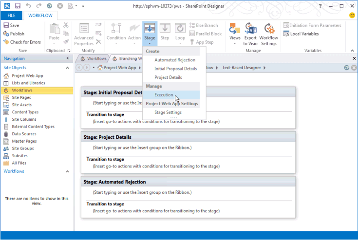

# <a name="updates-for-developers-in-project"></a><span data-ttu-id="dac29-103">プロジェクトの開発者用の更新プログラム</span><span class="sxs-lookup"><span data-stu-id="dac29-103">Updates for developers in Project</span></span>

<span data-ttu-id="dac29-104">Project Server 2013 の機能を拡張を使用するアドイン プロジェクトをオンラインに設置します。</span><span class="sxs-lookup"><span data-stu-id="dac29-104">Extensibility features in Project Server 2013 work with add-ins for Project Online and with on-premises installations.</span></span> <span data-ttu-id="dac29-105">新しい機能には、プロジェクトのクライアント用のクライアント側オブジェクト モデル (CSOM)、残りのインターフェイス、レポート、リモート イベント レシーバー、宣言型ワークフローは、および作業ウィンドウ アドインの OData サービスが含まれます。</span><span class="sxs-lookup"><span data-stu-id="dac29-105">New features include a client-side object model (CSOM), REST interfaces, an OData service for reporting, remote event receivers, declarative workflows, and task pane add-ins for Project clients.</span></span> <span data-ttu-id="dac29-106">新しい開発のために使用する必要がありますはない機能についても学びます。</span><span class="sxs-lookup"><span data-stu-id="dac29-106">Also learn about deprecated features that should not be used for new development.</span></span>
  
<span data-ttu-id="dac29-107">Project Server 2013 は、Project Server 2007 の Microsoft Office で導入し、Project Server 2010 で拡張フレームワークに基づいています。</span><span class="sxs-lookup"><span data-stu-id="dac29-107">Project Server 2013 builds on the framework introduced with Microsoft Office Project Server 2007 and extended by Project Server 2010.</span></span> <span data-ttu-id="dac29-108">Project Server 2013 では、リファクタリング、プロジェクト Server インターフェイス (PSI) からの簡略化し、JavaScript ライブラリと Windows アプリケーション、Windows Phone 8、および Microsoft Silverlight 用の.NET Framework 4 のライブラリが含まれています、クライアント側オブジェクト モデル (CSOM) を追加します。</span><span class="sxs-lookup"><span data-stu-id="dac29-108">Project Server 2013 adds a client-side object model (CSOM) that is refactored and simplified from the Project Server Interface (PSI), and includes a JavaScript library and .NET Framework 4 libraries for Windows apps, Windows Phone 8, and Microsoft Silverlight.</span></span> <span data-ttu-id="dac29-109">CSOM はオンラインのプロジェクトの開発用に設計され、も設置した Project Server インストール機能します。</span><span class="sxs-lookup"><span data-stu-id="dac29-109">The CSOM is designed for development for Project Online, and also works with an on-premises Project Server installation.</span></span> 

<span data-ttu-id="dac29-110">Project Server データベースを結合して 1 つのデータベースにOData サービスをオンラインのレポート テーブルおよびビューにアクセスできます。</span><span class="sxs-lookup"><span data-stu-id="dac29-110">The Project Server databases are combined into a single database; you can access the online reporting tables and views through an OData service.</span></span> <span data-ttu-id="dac29-111">CSOM と OData サービスには、主要な状態を転送 (REST) インターフェイスが含まれます。</span><span class="sxs-lookup"><span data-stu-id="dac29-111">The CSOM and the OData service include a Representational State Transfer (REST) interface.</span></span> <span data-ttu-id="dac29-112">プロジェクト サーバーのワークフローは、SharePoint Designer 2013 を使用して作成できます。</span><span class="sxs-lookup"><span data-stu-id="dac29-112">Project Server workflows can be created by using SharePoint Designer 2013.</span></span> <span data-ttu-id="dac29-113">プロジェクト 2013 の本格的なは、Project Server の作業ウィンドウに Office のアドインの機能拡張モデルを使用して、データ、SharePoint タスク リスト、およびその他の外部コンテンツをレポートに統合できます。</span><span class="sxs-lookup"><span data-stu-id="dac29-113">Project Professional 2013 can integrate with Project Server reporting data, SharePoint task lists, and other external content by using the Office Add-ins extensibility model for task panes.</span></span> <span data-ttu-id="dac29-114">プロジェクト標準 2013 は、タスク ウィンドウ - アドインを使用して、一般的な外部コンテンツとの統合します。</span><span class="sxs-lookup"><span data-stu-id="dac29-114">Project Standard 2013 can use task pane add-ins to integrate with general external content.</span></span>
  
<span data-ttu-id="dac29-115">図および Project Server 2013 の主な変更点の詳細については、 [Project Server 2013 のアーキテクチャ](project-server-2013-architecture.md)を参照してください。</span><span class="sxs-lookup"><span data-stu-id="dac29-115">For diagrams and more information about major changes in Project Server 2013, see [Project Server 2013 architecture](project-server-2013-architecture.md).</span></span>
  
> [!NOTE]
> <span data-ttu-id="dac29-116">Project Server 2013 は、プラットフォーム上に構築、SharePoint Server 2013、および Project 2013 には、他の Office 2013 アプリケーションとインフラストラクチャの大部分が含まれています。</span><span class="sxs-lookup"><span data-stu-id="dac29-116">Project Server 2013 is built on the SharePoint Server 2013 platform, and Project 2013 includes much of the same infrastructure as the other Office 2013 applications.</span></span> <span data-ttu-id="dac29-117">モデルのドキュメントを SharePoint のアドイン、SharePoint ベースのワークフローでは、Web パーツ、その他の SharePoint の機能、および Office アドインのドキュメントを使用して開発を参照してください[SharePoint アドイン](https://docs.microsoft.com/sharepoint/dev/sp-add-ins/sharepoint-add-ins)、 [Office アドイン](https://docs.microsoft.com/office/dev/add-ins/overview/office-add-ins)、および SharePoint の[2013 開発の概要](https://msdn.microsoft.com/library/jj164084%28office.15%29.aspx)。</span><span class="sxs-lookup"><span data-stu-id="dac29-117">For documentation of the model for SharePoint Add-ins, SharePoint-based workflows, Web Parts, development with other SharePoint features, and documentation of Office Add-ins, see [SharePoint Add-ins](https://docs.microsoft.com/sharepoint/dev/sp-add-ins/sharepoint-add-ins), [Office Add-ins](https://docs.microsoft.com/office/dev/add-ins/overview/office-add-ins), and [SharePoint 2013 development overview](https://msdn.microsoft.com/library/jj164084%28office.15%29.aspx).</span></span> 
  
## <a name="major-new-features-in-project-2013"></a><span data-ttu-id="dac29-118">Project 2013 の主な新機能</span><span class="sxs-lookup"><span data-stu-id="dac29-118">Major new features in Project 2013</span></span>
<span data-ttu-id="dac29-119"><a name="pj15_WhatsNew_MajorNewFeatures"> </a></span><span class="sxs-lookup"><span data-stu-id="dac29-119"></span></span>

<span data-ttu-id="dac29-120">標準 2013 のプロジェクトおよびプロジェクトの評価のための新機能は、ユーザー インターフェイスの改良を他の Office 2013 アプリケーションと一致して、Windows 8、バーンダウンのレポートで Office アート オブジェクトとの統合で、現代のスタイルのユーザー インターフェイスをサポートしています。レポート、およびレポート用の新しいプログラミング機能。</span><span class="sxs-lookup"><span data-stu-id="dac29-120">New features in Project Standard 2013 and Project Professional 2013 include an improved user interface that matches other Office 2013 applications and supports the modern style user interface in Windows 8, integration with Office Art objects for reports, burndown reports, and new programmability features for reports.</span></span> <span data-ttu-id="dac29-121">プロジェクト評価のため有効に共有して、作業ウィンドウのアドインも、Word、Excel、Outlook などの他の Office 2013 アプリケーションで実装されていると、SharePoint Server 2013 では、上のプロジェクトを同期するにはより多くします。</span><span class="sxs-lookup"><span data-stu-id="dac29-121">Project Professional 2013 enables more extensive sharing and synchronizing projects on SharePoint Server 2013, along with the task pane add-ins that are also implemented in other Office 2013 applications such as Word, Excel, and Outlook.</span></span>
  
<span data-ttu-id="dac29-122">Project Server 2013 では、多くの新機能があります。</span><span class="sxs-lookup"><span data-stu-id="dac29-122">There are many new features in Project Server 2013.</span></span> <span data-ttu-id="dac29-123">Project Web App で新しいタイムラインなどのプログラミングの主要なストーリーでは、いくつかはありません。</span><span class="sxs-lookup"><span data-stu-id="dac29-123">Some do not have a major programmability story, such as the new timeline in Project Web App.</span></span> <span data-ttu-id="dac29-124">Microsoft Office オンラインの製品ヘルプとエンド ・ ユーザー マニュアルに、管理者および Microsoft TechNet の IT プロフェッショナル向けのトピックでそれらの機能を文書化します。</span><span class="sxs-lookup"><span data-stu-id="dac29-124">Those features will be documented in the product help and end-user documentation on Microsoft Office Online and in topics targeted at administrators and IT professionals on Microsoft TechNet.</span></span> <span data-ttu-id="dac29-125">他の新機能、強化されたタイムシートなど簡単にタイムシートと状態管理のプロジェクト Server インターフェイス (PSI) をやり取りするサード パーティの開発者。</span><span class="sxs-lookup"><span data-stu-id="dac29-125">Other new features, such as improved timesheets, make it easier for third-party developers to interact with timesheets and statusing through the Project Server Interface (PSI).</span></span>
  
<span data-ttu-id="dac29-126">プロジェクトをオンラインで、Office ストアの追加 (https://office.microsoft.com/store)プロジェクトのアドインは、広範囲に及ぶ変更が、Project Server は、Microsoft Azure を使用してアクセスします。</span><span class="sxs-lookup"><span data-stu-id="dac29-126">The addition of Project Online and the Office Store (https://office.microsoft.com/store) for Project add-ins are far-reaching changes, where Project Server is accessible through Microsoft Azure.</span></span> <span data-ttu-id="dac29-127">Project Server へのクラウド ・ ベースのアクセスは、Microsoft.NET Framework、Microsoft Silverlight、Windows Phone では、JavaScript を使用する web アプリケーションとアドインを開発するため、クライアント側オブジェクト モデル (CSOM) を使用します。</span><span class="sxs-lookup"><span data-stu-id="dac29-127">Cloud-based access to Project Server uses a client-side object model (CSOM) for development of add-ins with the Microsoft .NET Framework, Microsoft Silverlight, Windows Phone, and web apps that use JavaScript.</span></span> <span data-ttu-id="dac29-128">オンライン プロジェクトの要件は、以前のバージョンの 4 つの Project Server データベースを 1 つのデータベースにマージされることです。</span><span class="sxs-lookup"><span data-stu-id="dac29-128">A requirement of Project Online is that the four Project Server databases of previous versions are merged into one database.</span></span>
  
<span data-ttu-id="dac29-129">タスクの状態、タイムシート、プロジェクト管理などの多くの領域では、Project Server 2013 のパフォーマンスとスケーラビリティが向上します。</span><span class="sxs-lookup"><span data-stu-id="dac29-129">Project Server 2013 performance and scalability is improved in many areas such as task status, timesheets, and project management.</span></span> <span data-ttu-id="dac29-130">Windows Workflow Foundation (WF4) のバージョン 4 では、プロジェクトのサーバーのワークフローが再設計します。</span><span class="sxs-lookup"><span data-stu-id="dac29-130">Project Server workflows are redesigned with version 4 of Windows Workflow Foundation (WF4).</span></span> <span data-ttu-id="dac29-131">.NET Framework 4 および PSI のように、Windows Communication Foundation (WCF) の使用には、セキュリティ、パフォーマンス、および拡張性が向上します。</span><span class="sxs-lookup"><span data-stu-id="dac29-131">Use of the .NET Framework 4 and Windows Communication Foundation (WCF) with the PSI improves security, performance, and scalability.</span></span> <span data-ttu-id="dac29-132">たとえば、アプリケーション コードを変更または再コンパイルすることがなく、構成ファイルを使用して WCF ベースのアプリケーションの転送プロトコルを変更できます。</span><span class="sxs-lookup"><span data-stu-id="dac29-132">For example, you can change the transport protocol of WCF-based applications by using configuration files, without changing the application code or recompiling.</span></span> <span data-ttu-id="dac29-133">Project Web App では、データが大幅に変更されない、PSI の呼び出しの多くをキャッシュします。</span><span class="sxs-lookup"><span data-stu-id="dac29-133">Project Web App caches many of the PSI calls where data does not change significantly.</span></span>
  
> [!NOTE]
> <span data-ttu-id="dac29-134">Project Server 2013 の開発のため、Office および SharePoint ツールの拡張機能、ネイティブ Office 2013 製品用のアドインを作成すると Visual Studio を使用できます。</span><span class="sxs-lookup"><span data-stu-id="dac29-134">For development with Project Server 2013, you can use Visual Studio with the Office and SharePoint tools extensions, which can natively create add-ins for the Office 2013 products.</span></span> <span data-ttu-id="dac29-135">Project Server 2013 には、Visual Studio のプロジェクト詳細ページと WCF ベースのアプリケーションなどの機能の開発を有効にする必要があります。</span><span class="sxs-lookup"><span data-stu-id="dac29-135">Project Server 2013 requires Visual Studio to fully enable development of features such as project detail pages and WCF-based applications.</span></span> <span data-ttu-id="dac29-136">Visual Studio で SharePoint ツールの拡張機能では、Project Web App およびその他の SharePoint サイトに直接 Web パーツおよびその他の SharePoint の機能を展開できます。</span><span class="sxs-lookup"><span data-stu-id="dac29-136">The SharePoint tools extensions in Visual Studio can deploy Web Parts and other SharePoint features directly to Project Web App and other SharePoint sites.</span></span> 
>
> <span data-ttu-id="dac29-137">Visual Studio はユーザー設定フィールド、ステージ、フェーズ、および管理するのには、Project Web App のエンタープライズ プロジェクトの種類を使用して Project Server ワークフローを作成する必要なくなりました。</span><span class="sxs-lookup"><span data-stu-id="dac29-137">Visual Studio is no longer required to develop Project Server workflows that use custom fields, stages, phases, and enterprise project types that can be managed in Project Web App.</span></span> <span data-ttu-id="dac29-138">ワークフローを作成する Visual Studio を使用できますが頻繁にありますが簡単かつ速く SharePoint デザイナーを使用して作成します。</span><span class="sxs-lookup"><span data-stu-id="dac29-138">Although you can use Visual Studio to develop workflows, they are often easier and quicker to create by using SharePoint Designer.</span></span> <span data-ttu-id="dac29-139">CSOM またはその他の外部 Api へのアクセスを必要とするワークフローでは、Visual Studio を使用できます。</span><span class="sxs-lookup"><span data-stu-id="dac29-139">Visual Studio can be used for workflows that require access to the CSOM or other external APIs.</span></span> 
  
### <a name="project-add-ins"></a><span data-ttu-id="dac29-140">Project アドイン</span><span class="sxs-lookup"><span data-stu-id="dac29-140">Project add-ins</span></span>
<span data-ttu-id="dac29-141"><a name="pj15_WhatsNew_Apps"> </a></span><span class="sxs-lookup"><span data-stu-id="dac29-141"></span></span>

<span data-ttu-id="dac29-142">配布とソフトウェアのマーケティング革命的に変わりましたとアドインの概念です。</span><span class="sxs-lookup"><span data-stu-id="dac29-142">Distribution and marketing of software has been revolutionized with the concept of an add-in.</span></span> <span data-ttu-id="dac29-143">Project 2013 では、アドインを Office のパブリック ストアから購入し、ダウンロードできるようになりましたや SharePoint 上のプライベート カタログ内で配布することができます。</span><span class="sxs-lookup"><span data-stu-id="dac29-143">For Project 2013, add-ins can be made available for purchase and download from the public Office Store or distributed within a private catalog on SharePoint.</span></span> <span data-ttu-id="dac29-144">アドインは通常自己完結型、対話型のプログラムで、少数の関連するタスクを実行します。</span><span class="sxs-lookup"><span data-stu-id="dac29-144">An add-in is typically a self-contained, interactive program that performs a small number of related tasks.</span></span> <span data-ttu-id="dac29-145">プロジェクトの追加には、標準 2013 のプロジェクトまたはプロジェクトの標準的な 2013 のクライアントの作業ウィンドウ アドインまたは Project Server 2013 またはプロジェクトをオンラインで。</span><span class="sxs-lookup"><span data-stu-id="dac29-145">A Project add-in can be a task pane add-in for the Project Standard 2013 or Project Standard 2013 clients, or an add-in for Project Server 2013 or Project Online.</span></span>
  
<span data-ttu-id="dac29-146">プロジェクトのデスクトップ クライアント用のアドインについては、[タスク ペインでアドイン プロジェクト](#pj15_WhatsNew_Agave)を参照してください。</span><span class="sxs-lookup"><span data-stu-id="dac29-146">For information about add-ins for the Project desktop clients, see [Task pane add-ins in Project](#pj15_WhatsNew_Agave).</span></span> <span data-ttu-id="dac29-147">Project Server 2013 の例では、 [Project Server の SharePoint によってホストされる作成アドインを](create-a-sharepoint-hosted-project-server-add-in.md)参照してください。</span><span class="sxs-lookup"><span data-stu-id="dac29-147">For a Project Server 2013 example, see [Create a SharePoint-hosted Project Server add-in](create-a-sharepoint-hosted-project-server-add-in.md).</span></span> <span data-ttu-id="dac29-148">[Office および SharePoint アドイン SDK](https://msdn.microsoft.com/library/fp161507.aspx)の記事、[ブログの Office](https://blogs.office.com/dev/) Project 2013 とオンラインのプロジェクトに関連するも多くの投稿にあります。</span><span class="sxs-lookup"><span data-stu-id="dac29-148">In addition to articles in the [Office and SharePoint Add-ins SDK](https://msdn.microsoft.com/library/fp161507.aspx), the [Office Blog](https://blogs.office.com/dev/) has many posts that are also relevant to Project 2013 and Project Online.</span></span> 
  
<span data-ttu-id="dac29-149">Project Server 2013 のでは、オンプレミスのインストールとオンライン プロジェクトを操作できます。</span><span class="sxs-lookup"><span data-stu-id="dac29-149">An add-in for Project Server 2013 can work with both an on-premises installation and Project Online.</span></span> <span data-ttu-id="dac29-150">プロジェクト サーバーのアドインには、Web パーツ、リモート イベント レシーバー、およびビジネス ロジックを含めることができます。</span><span class="sxs-lookup"><span data-stu-id="dac29-150">Project Server add-ins can include Web Parts, remote event receivers, and business logic.</span></span> <span data-ttu-id="dac29-151">追加の Project Server のオブジェクト モデルへのアクセスでは、CSOM、PSI ではない、です。</span><span class="sxs-lookup"><span data-stu-id="dac29-151">Access to the Project Server object model in an add-in is through the CSOM, not the PSI.</span></span> <span data-ttu-id="dac29-152">データ記憶域は、クラウド ・ ベースなど、SQL Azure の外部などを通じて Microsoft Business Connectivity Services (BCS)、ローカル データベースの内部で、または混合できます。</span><span class="sxs-lookup"><span data-stu-id="dac29-152">Data storage can be cloud-based such as with SQL Azure, external such as through Microsoft Business Connectivity Services (BCS), internal with a local database, or mixed.</span></span>
  
#### <a name="add-in-security"></a><span data-ttu-id="dac29-153">アドインのセキュリティ</span><span class="sxs-lookup"><span data-stu-id="dac29-153">Add-in security</span></span>

<span data-ttu-id="dac29-154">。 アドインを実行しているユーザーの代理としてアドインを実行するアクションを実行する一般的に、明示的に、偽装を使用して、アドインを実行できるユーザーを指定したりしないでください。</span><span class="sxs-lookup"><span data-stu-id="dac29-154">In general, actions that an add-in takes are performed on behalf of the user who runs the add-in; you do not explicitly use impersonation or specify who can run the add-in.</span></span> <span data-ttu-id="dac29-155">アクションには、アドインを実行しているユーザーのアクセス許可レベルを超えることはできません。</span><span class="sxs-lookup"><span data-stu-id="dac29-155">Actions cannot exceed the permission level of the user who runs the add-in.</span></span> 
  
<span data-ttu-id="dac29-156">Visual Studio 2012 ののための Office 開発ツール、AppManifext.xml ファイルがグラフィカル ・ エディターのアクセス許可要求のスコープを設定することができます。</span><span class="sxs-lookup"><span data-stu-id="dac29-156">In Office Developer Tools for Visual Studio 2012, the AppManifext.xml file has a graphical editor where you can set the permission request scope.</span></span> <span data-ttu-id="dac29-157">などの**AppManifest.xml**デザイナー ウィンドウの [**アクセス許可**] タブで、プロジェクトを更新するプロジェクト マネージャーを有効にするアドインを作成する**複数のプロジェクト**の選択、スコープと [**書き込み**アクセス許可のします。</span><span class="sxs-lookup"><span data-stu-id="dac29-157">For example, to create an add-in that enables project managers to update their projects, on the **Permissions** tab of the **AppManifest.xml** designer pane, select **Multiple Projects** for the scope and **Write** for the permission.</span></span> <span data-ttu-id="dac29-158">アドインをユーザーにプロジェクト マネージャーのアクセス許可がある場合は、彼女を彼女を管理するプロジェクトのアドインを実行できます。</span><span class="sxs-lookup"><span data-stu-id="dac29-158">If the add-in user has project manager permissions, she can run the add-in for projects that she manages.</span></span> <span data-ttu-id="dac29-159">AppManifest.xml ファイル内のコードは以下に示します。</span><span class="sxs-lookup"><span data-stu-id="dac29-159">The code in the AppManifest.xml file would include the following:</span></span> 
  
```XML
  <AppPermissionRequests>
    <AppPermissionRequest Scope="https://sharepoint/projectserver/projects" Right="Write" />
  </AppPermissionRequests>
```

<span data-ttu-id="dac29-160">**表 1. Project Server アドイン用のアクセス許可リクエストのスコープ**</span><span class="sxs-lookup"><span data-stu-id="dac29-160">**Table 1. Permission request scopes for Project Server add-ins**</span></span>

|<span data-ttu-id="dac29-161">スコープ</span><span class="sxs-lookup"><span data-stu-id="dac29-161">Scope</span></span>|<span data-ttu-id="dac29-162">アクセス許可</span><span class="sxs-lookup"><span data-stu-id="dac29-162">Permissions</span></span>|
|:-----|:-----|
|<span data-ttu-id="dac29-163">**Project Server**</span><span class="sxs-lookup"><span data-stu-id="dac29-163">**Project Server**</span></span> <br/> |<span data-ttu-id="dac29-164">**管理** (Project Server 管理者のアクセス許可が必要)</span><span class="sxs-lookup"><span data-stu-id="dac29-164">**Manage** (Requires Project Server administrator permissions.)</span></span>  <br/> |
|<span data-ttu-id="dac29-165">\*\*複数のプロジェクト \*\*</span><span class="sxs-lookup"><span data-stu-id="dac29-165">**Multiple Projects**</span></span> <br/> |<span data-ttu-id="dac29-166">**読み取り**、**書き込み** (一部の操作にはプロジェクト マネージャーのアクセス許可が必要となり、タスクの割り当てなどの基本の読み取り操作にはプロジェクト チーム メンバーのアクセス許可が必要となります。)</span><span class="sxs-lookup"><span data-stu-id="dac29-166">**Read**, **Write** (Requires project manager permissions for some operations; project team member permissions for basic read operations, such as task assignments.)</span></span>  <br/> |
|<span data-ttu-id="dac29-167">\*\*1 つのプロジェクト \*\*</span><span class="sxs-lookup"><span data-stu-id="dac29-167">**Single Project**</span></span> <br/> |<span data-ttu-id="dac29-168">**読み取り**、**書き込み** (少なくともプロジェクト チーム メンバーのアクセス許可が必要。プロジェクト内のデータにアクセスできるかどうかは、他のアクセス許可レベルに依存します。)</span><span class="sxs-lookup"><span data-stu-id="dac29-168">**Read**, **Write** (Requires at least project team member permissions; access to some data in a project depends on other permission levels.)</span></span>  <br/> |
|<span data-ttu-id="dac29-169">**エンタープライズ リソース**</span><span class="sxs-lookup"><span data-stu-id="dac29-169">**Enterprise Resources**</span></span> <br/> |<span data-ttu-id="dac29-170">**読み取り**、**書き込み** (リソース マネージャーのアクセス許可が必要)</span><span class="sxs-lookup"><span data-stu-id="dac29-170">**Read**, **Write** (Requires resource manager permissions.)</span></span>  <br/> |
|<span data-ttu-id="dac29-171">**状態管理**</span><span class="sxs-lookup"><span data-stu-id="dac29-171">**Statusing**</span></span> <br/> |<span data-ttu-id="dac29-172">**提出ステータス** (プロジェクトの状態を送信するためのアクセス許可が必要)</span><span class="sxs-lookup"><span data-stu-id="dac29-172">**SubmitStatus** (Requires permission to submit status for your projects.)</span></span>  <br/> |
|<span data-ttu-id="dac29-173">**レポート**</span><span class="sxs-lookup"><span data-stu-id="dac29-173">**Reporting**</span></span> <br/> |<span data-ttu-id="dac29-174">**読み取り** (Project Server にログオンするためのアクセス許可が必要)</span><span class="sxs-lookup"><span data-stu-id="dac29-174">**Read** (Requires permission to log on Project Server.)</span></span>  <br/> |
|<span data-ttu-id="dac29-175">**ワークフロー**</span><span class="sxs-lookup"><span data-stu-id="dac29-175">**Workflow**</span></span> <br/> |<span data-ttu-id="dac29-p116">**昇格** (ワークフローを実行するためのアクセス許可が必要。ワークフローでのステージ間の移行を可能にするために、アドインは管理者特権で実行されます。ステージ遷移はアドイン内のビジネス ロジックによって制御されます。)</span><span class="sxs-lookup"><span data-stu-id="dac29-p116">**Elevate** (Requires permission to run workflows. The add-in runs with elevated permissions, to enable transitions from stage to stage in a workflow. Business logic in the add-in controls stage transitions.)  </span></span><br/> |
   
> [!NOTE]
> <span data-ttu-id="dac29-179">Project Server 2013 とオンライン プロジェクトは、SharePoint 2013 の ( [SharePoint 2013 で追加の認証ポリシー型](https://msdn.microsoft.com/library/124879c7-a746-4c10-96a7-da76ad5327f0%28Office.15%29.aspx)を参照してください) のアプリケーション専用の認証モデルを使わないでください。</span><span class="sxs-lookup"><span data-stu-id="dac29-179">Project Server 2013 and Project Online do not use the app-only authentication model in SharePoint 2013 (see [Add-in authorization policy types in SharePoint 2013](https://msdn.microsoft.com/library/124879c7-a746-4c10-96a7-da76ad5327f0%28Office.15%29.aspx)).</span></span> 
  
<span data-ttu-id="dac29-180">開発方法の詳細については、配布する、ホスト、およびアドインを管理するを参照してください[SharePoint のアドイン](https://docs.microsoft.com/sharepoint/dev/sp-add-ins/sharepoint-add-ins)と[Office アドイン](https://docs.microsoft.com/office/dev/add-ins/overview/office-add-ins)、および SharePoint Server 2013 と Office 2013 の開発者向けドキュメントに関連するトピックです。</span><span class="sxs-lookup"><span data-stu-id="dac29-180">For information about developing, distributing, hosting, and managing add-ins, see [SharePoint Add-ins](https://docs.microsoft.com/sharepoint/dev/sp-add-ins/sharepoint-add-ins) and [Office Add-ins](https://docs.microsoft.com/office/dev/add-ins/overview/office-add-ins), and related topics in the SharePoint Server 2013 and Office 2013 developer documentation.</span></span> <span data-ttu-id="dac29-181">アクセス許可要求スコープの他の SharePoint のアドインについては、 [SharePoint 2013 で追加のアクセス許可](https://msdn.microsoft.com/library/5f7a8440-3c09-4cf8-83ec-c236bfa2d6c4%28Office.15%29.aspx)を参照してください。</span><span class="sxs-lookup"><span data-stu-id="dac29-181">For information about permission request scope for other SharePoint Add-ins, see [Add-in permissions in SharePoint 2013](https://msdn.microsoft.com/library/5f7a8440-3c09-4cf8-83ec-c236bfa2d6c4%28Office.15%29.aspx).</span></span>
  
### <a name="integrating-with-sharepoint-server"></a><span data-ttu-id="dac29-182">SharePoint Server との統合</span><span class="sxs-lookup"><span data-stu-id="dac29-182">Integrating with SharePoint Server</span></span>
<span data-ttu-id="dac29-183"><a name="pj15_WhatsNew_IntegrationWSS"> </a></span><span class="sxs-lookup"><span data-stu-id="dac29-183"></span></span>

<span data-ttu-id="dac29-184">Project Web App で多くの機能は、SharePoint Server 2013 OAuth とクレーム ベース認証、サーバーのプロジェクトの承認および SharePoint グループを使用してアクセス許可などの SharePoint のタスクとプロジェクトの同期の新しいインフラストラクチャを必要とします。リスト、および Project Server の宣言型ワークフローです。</span><span class="sxs-lookup"><span data-stu-id="dac29-184">Many features in Project Web App require the new infrastructure in SharePoint Server 2013 such as OAuth and claims-based authentication, Project Server authorization and permissions through SharePoint groups, synchronization of projects with SharePoint task lists, and Project Server declarative workflows.</span></span> <span data-ttu-id="dac29-185">プロジェクト サービス アプリケーションは、SharePoint ファーム内のすべてのサイト コレクションに関連付けることができます。</span><span class="sxs-lookup"><span data-stu-id="dac29-185">The Project Service Application can be associated with any site collection in a SharePoint farm.</span></span> <span data-ttu-id="dac29-186">プロジェクトの同期は、SharePoint タスク リストでは、SharePoint プロジェクトを保持しています。</span><span class="sxs-lookup"><span data-stu-id="dac29-186">Project synchronization can be with a SharePoint task list, where SharePoint maintains the project.</span></span> <span data-ttu-id="dac29-187">エンタープライズ プロジェクトは、Project Server がフル コントロールを保持して、SharePoint タスク リストとも同期できます。</span><span class="sxs-lookup"><span data-stu-id="dac29-187">An enterprise project can also be synchronized with a SharePoint task list, where Project Server maintains full control.</span></span> <span data-ttu-id="dac29-188">アーキテクチャ ダイアグラムとプロジェクトの同期の詳細については、 [Project Server 2013 のアーキテクチャ](project-server-2013-architecture.md)を参照してください。</span><span class="sxs-lookup"><span data-stu-id="dac29-188">For architectural diagrams and an explanation of project synchronization, see [Project Server 2013 architecture](project-server-2013-architecture.md).</span></span>
  
<span data-ttu-id="dac29-189">SharePoint Server 2013 では、多くの新機能があります。</span><span class="sxs-lookup"><span data-stu-id="dac29-189">There are many new features in SharePoint Server 2013.</span></span> <span data-ttu-id="dac29-190">詳細については、[開発者向けの SharePoint](https://msdn.microsoft.com/sharepoint)を参照してください。</span><span class="sxs-lookup"><span data-stu-id="dac29-190">For more information, see [SharePoint for developers](https://msdn.microsoft.com/sharepoint).</span></span>
  
### <a name="integrating-with-workflows"></a><span data-ttu-id="dac29-191">ワークフローとの統合</span><span class="sxs-lookup"><span data-stu-id="dac29-191">Integrating with workflows</span></span>
<span data-ttu-id="dac29-192"><a name="pj15_WhatsNew_Workflow"> </a></span><span class="sxs-lookup"><span data-stu-id="dac29-192"></span></span>

<span data-ttu-id="dac29-p120">ワークフローはプロジェクト ポートフォリオ管理のコア機能です。プロジェクトのライフ サイクルには、多くのフェーズにまたがる長期間のプロセスを含めることができます。ガバナンス フェーズには、プロジェクトの提案、ビジネスへの影響度の分析、およびプロジェクトの選択、作成、計画、管理、追跡が含まれます。</span><span class="sxs-lookup"><span data-stu-id="dac29-p120">Workflows are a core feature of project portfolio management. A project life cycle can include long-running processes that span many phases. Governance phases include project proposals, analyses of business impact, and selecting, creating, planning, managing, and tracking projects.</span></span>
  
<span data-ttu-id="dac29-196">WF4 を使用して、SharePoint 2013 ワークフロー プラットフォームでは、Project Server 2013 のワークフローが組み込まれています。</span><span class="sxs-lookup"><span data-stu-id="dac29-196">Project Server 2013 workflows are built on the SharePoint 2013 workflow platform, which uses WF4.</span></span> <span data-ttu-id="dac29-197">異なり以前のバージョンでは、Project Server 2013 の宣言型ワークフロー SharePoint Designer 2013 を使用して作成することができますはオンプレミスとオンラインの両方にアクセスできるようにします。</span><span class="sxs-lookup"><span data-stu-id="dac29-197">Unlike in previous versions, declarative workflows for Project Server 2013 can be created by using SharePoint Designer 2013 and are accessible for both on-premises and online use.</span></span> <span data-ttu-id="dac29-198">プロジェクト サーバーのワークフローでは、SharePoint ワークフローのセキュリティ モデルを使用して、OAuth を使用と、Project Web App サイトにインストールすることができます。</span><span class="sxs-lookup"><span data-stu-id="dac29-198">Project Server workflows use the SharePoint workflow security model with OAuth, and can be installed on a Project Web App site.</span></span> <span data-ttu-id="dac29-199">図 1 は、SharePoint Designer 2013 が需要の管理、各ステージが Project Web App で定義されているため、サイトのワークフローにステージを追加できることを示しています。</span><span class="sxs-lookup"><span data-stu-id="dac29-199">Figure 1 shows that SharePoint Designer 2013 can add stages to a site workflow for Demand Management, where the stages are defined in Project Web App.</span></span>
  
<span data-ttu-id="dac29-200">**図 1. SharePoint Designer を使用した Project Web アプリ用ワークフローへのステージの追加**</span><span class="sxs-lookup"><span data-stu-id="dac29-200">**Figure 1. Using SharePoint Designer to add a stage to a workflow for Project Web App**</span></span>

<span data-ttu-id="dac29-201"></span><span class="sxs-lookup"><span data-stu-id="dac29-201"></span></span>

<br/>

<span data-ttu-id="dac29-202">宣言型ワークフローを構築するには、デザイン ツールで、SharePoint Designer 2013 または Visual Studio 2012 のいずれかのワークフロー ステージ、アクション、条件、およびその他の要素を追加します。</span><span class="sxs-lookup"><span data-stu-id="dac29-202">You build a declarative workflow by adding workflow stages, actions, conditions, and other elements in a design tool, which can be either SharePoint Designer 2013 or Visual Studio 2012.</span></span> <span data-ttu-id="dac29-203">デザイン ツールは、実行時に解釈されますが、XAML のコードと、ワークフローを保存します。</span><span class="sxs-lookup"><span data-stu-id="dac29-203">The design tool then saves the workflow as XAML code, which is interpreted at runtime.</span></span> <span data-ttu-id="dac29-204">宣言型ワークフローは、Project Server 2013 の設置またはプロジェクトをオンラインで実行できます。</span><span class="sxs-lookup"><span data-stu-id="dac29-204">Declarative workflows can run either in Project Server 2013 on-premises or in Project Online.</span></span> <span data-ttu-id="dac29-205">Visual Studio 2012 を使用すると、またカスタム アクションは、追加のコントロールのフォームを作成し、複数の Project Web App インスタンスを再利用するためのワークフロー テンプレートを保存できます。</span><span class="sxs-lookup"><span data-stu-id="dac29-205">By using Visual Studio 2012, you can also build custom actions and forms for additional control, and save workflow templates for reuse with multiple Project Web App instances.</span></span> <span data-ttu-id="dac29-206">SharePoint Designer 2013 には、Visual Studio 2012 で作成されたカスタム アクションを使用できます。</span><span class="sxs-lookup"><span data-stu-id="dac29-206">SharePoint Designer 2013 can consume custom actions that are created in Visual Studio 2012.</span></span>
  
<span data-ttu-id="dac29-207">Project Server 2013 のワークフローを果たし、アプリケーション、管理者は、Project Web App のデザイン権限を持つ-宣言型ワークフローを発行し、エンタープライズ プロジェクトの種類 (EPT) に関連付けることができます。</span><span class="sxs-lookup"><span data-stu-id="dac29-207">A Project Server 2013 workflow acts as an app, where an administrator—who has design permissions for Project Web App—can publish a declarative workflow and associate it with an enterprise project type (EPT).</span></span> <span data-ttu-id="dac29-208">EPT では、エンタープライズ プロジェクトの Project Server がフル コントロールを保持する場所があります。</span><span class="sxs-lookup"><span data-stu-id="dac29-208">The EPT must be for an enterprise project, where Project Server maintains full control.</span></span> <span data-ttu-id="dac29-209">SharePoint タスク リストでは、Project Server ワークフローを使用することはできません。</span><span class="sxs-lookup"><span data-stu-id="dac29-209">A SharePoint task list cannot use a Project Server workflow.</span></span> 
  
<span data-ttu-id="dac29-210">OAuth では、プロジェクト マネージャーは偽装を使用せずにワークフローを起動するには、プロジェクト作成の権限が有効にします。</span><span class="sxs-lookup"><span data-stu-id="dac29-210">OAuth enables project managers who have project creation permissions to invoke the workflow without using impersonation.</span></span> <span data-ttu-id="dac29-211">例に従って、分岐を決定するユーザー設定フィールドの値を読み取るための Project server では、ワークフローの呼び出しは、プロジェクト マネージャーのために行われます。</span><span class="sxs-lookup"><span data-stu-id="dac29-211">Workflow calls to Project Server, for example to read a custom field value to decide which branch to follow, are made on behalf of the project manager.</span></span> <span data-ttu-id="dac29-212">プロジェクト マネージャーが自動的に次の段階へと進化するワークフローを作成することを防ぐには、次のワークフロー ステージに移動するための呼び出しは、ワークフローの作成者 (管理者) として実行されます。</span><span class="sxs-lookup"><span data-stu-id="dac29-212">To prevent the project manager from creating a workflow that automatically advances to the next stage, the call for moving to the next workflow stage runs as the workflow author (the administrator).</span></span> <span data-ttu-id="dac29-213">対照的に、従来の Project Server 2010 のワークフローのユーザーは、ワークフロー全体を通して管理者のアクセス権を得るためにワークフロー プロキシ ユーザー アカウントを偽装の電話をかけます。</span><span class="sxs-lookup"><span data-stu-id="dac29-213">In contrast, users of legacy Project Server 2010 workflows make impersonated calls through the Workflow Proxy User account to gain administrator access throughout the entire workflow.</span></span>
  
<span data-ttu-id="dac29-214">Project Server 2013 の設置には、コンパイル済みの WF3.5 ベースのワークフローを使用できますが、WF4 に基づく宣言型のワークフローには、従来のワークフローをアップグレードすることをお勧めします。</span><span class="sxs-lookup"><span data-stu-id="dac29-214">Although Project Server 2013 on-premises can use compiled WF3.5-based workflows, we recommend that you upgrade legacy workflows to declarative workflows based on WF4.</span></span> <span data-ttu-id="dac29-215">新しいテクノロジーよりスケーラブルで信頼性の高いです。</span><span class="sxs-lookup"><span data-stu-id="dac29-215">The newer technology is more scalable and robust.</span></span> <span data-ttu-id="dac29-216">ビジネス アナリストおよび PMO スタッフ作成または Visio 2013 を使用して、ワークフローの設計を更新して SharePoint Designer 2013 を使用してコーディングせずに Project Server のワークフローを実装します。</span><span class="sxs-lookup"><span data-stu-id="dac29-216">Business analysts and PMO staff can create or update workflow designs by using Visio 2013 and implement Project Server workflows without coding by using SharePoint Designer 2013.</span></span>
  
<span data-ttu-id="dac29-217">Project Web App の宣言型ワークフローを作成する方法の詳細については、 [Project Server のワークフローの開発を開始する](getting-started-developing-project-server-workflows.md)を参照してください。</span><span class="sxs-lookup"><span data-stu-id="dac29-217">For information about creating a declarative workflow for Project Web App, see [Getting started developing Project Server workflows](getting-started-developing-project-server-workflows.md).</span></span> <span data-ttu-id="dac29-218">SharePoint デザイナーとワークフローを Visual Studio の機能の比較とは、 [Visual Studio を使用して SharePoint 2013 の開発のワークフロー](https://msdn.microsoft.com/library/office/jj163199.aspx)を参照してください。</span><span class="sxs-lookup"><span data-stu-id="dac29-218">For a comparison of SharePoint Designer and Visual Studio capabilities for workflows, see [Develop SharePoint 2013 workflows using Visual Studio](https://msdn.microsoft.com/library/office/jj163199.aspx).</span></span>
  
### <a name="client-side-object-model"></a><span data-ttu-id="dac29-219">クライアント側オブジェクト モデル</span><span class="sxs-lookup"><span data-stu-id="dac29-219">Client-side object model</span></span>
<span data-ttu-id="dac29-220"><a name="pj15_WhatsNew_CSOM"> </a></span><span class="sxs-lookup"><span data-stu-id="dac29-220"></span></span>

<span data-ttu-id="dac29-221">オンライン プロジェクトにプログラムでアクセスには、SharePoint の CSOM に組み込まれている CSOM が必要です。</span><span class="sxs-lookup"><span data-stu-id="dac29-221">Programmatic access to Project Online requires a CSOM that is built on the SharePoint CSOM.</span></span> <span data-ttu-id="dac29-222">プロジェクトのオンライン認証は、Windows Live ID、プロジェクトのサーバーのフォーム認証ではない、または Windows 認証を使用して OAuth になります。</span><span class="sxs-lookup"><span data-stu-id="dac29-222">Project Online authentication will be with OAuth using a Windows Live ID, not Project Server Forms authentication or Windows authentication.</span></span>
  
<span data-ttu-id="dac29-223">以下は、原則と Project Server 2013 で CSOM の機能です。</span><span class="sxs-lookup"><span data-stu-id="dac29-223">Following are the principles and features of the CSOM in Project Server 2013:</span></span>
  
- <span data-ttu-id="dac29-224">CSOM は、使いやすさを設計されています。</span><span class="sxs-lookup"><span data-stu-id="dac29-224">The CSOM is designed for ease of use.</span></span> <span data-ttu-id="dac29-225">メソッドとプロパティを直接使用など、名、Guid、 _changeXml_パラメーターの数を必要とするではなくまたはデータセットを渡すことによってデータを提供します。</span><span class="sxs-lookup"><span data-stu-id="dac29-225">For example, methods and properties directly use or provide data by name, rather than requiring many GUIDs,  _changeXml_ parameters, or passing around datasets.</span></span> 
    
- <span data-ttu-id="dac29-226">Project Server の CSOM はサードパーティのソリューションの一般的な要件に基づいて PSI 機能のサブセットを実装します。</span><span class="sxs-lookup"><span data-stu-id="dac29-226">The Project Server CSOM implements a subset of the PSI functionality, based on the most common requirements for third-party solutions.</span></span>
    
- <span data-ttu-id="dac29-p129">CSOM は PSI を内部的に呼び出しますが、その構造は変わったものになっています。たとえば、すべての状態変更の更新が **StatusAssignmentCollection.SubmitAllStatusUpdates** メソッドを使用して行われるようになっており、ユーザーについては PSI メソッドの **Statusing.SubmitStatus** を使用し、その他のリソースについては **SubmitStatusForResource** メソッドを使用する、というようにはなっていません。</span><span class="sxs-lookup"><span data-stu-id="dac29-p129">The CSOM internally calls the PSI, but is factored differently. For example, updates for all statusing changes are done through the **StatusAssignmentCollection.SubmitAllStatusUpdates** method, not by the **Statusing.SubmitStatus** PSI method for the user or the **SubmitStatusForResource** method for other resources.</span></span> 
    
- <span data-ttu-id="dac29-229">PSI の 22 個のパブリック サービスを使用しなくても、1 つの WCF サービス (Client.svc) で CSOM に アクセスできます。</span><span class="sxs-lookup"><span data-stu-id="dac29-229">The CSOM is accessible through one WCF service (Client.svc), rather than through the 22 public services of the PSI.</span></span>
    
- <span data-ttu-id="dac29-230">プロジェクトのサーバー CSOM の初期化は、Project Web App の URL を使用して[ProjectContext](https://msdn.microsoft.com/library/Microsoft.ProjectServer.Client.ProjectContext.aspx)クラスを使用して直接 WCF 参照またはプロキシのアセンブリを使用しています。</span><span class="sxs-lookup"><span data-stu-id="dac29-230">Initialization of the Project Server CSOM is directly through the [ProjectContext](https://msdn.microsoft.com/library/Microsoft.ProjectServer.Client.ProjectContext.aspx) class with the Project Web App URL, not by using a WCF reference or proxy assembly.</span></span> 
    
- <span data-ttu-id="dac29-p130">CSOM は、内部 SharePoint CSOM インフラストラクチャでサポートされる複数のクライアント ライブラリおよびインターフェイスを実装します。クライアント ライブラリおよびインターフェイスには次のものが含まれます。</span><span class="sxs-lookup"><span data-stu-id="dac29-p130">The CSOM implements multiple client libraries and interfaces, which are supported by the internal SharePoint CSOM infrastructure. The client libraries and interfaces include the following:</span></span>
    
  - <span data-ttu-id="dac29-233">Microsoft.ProjectServer.Client.dll アセンブリ内の Microsoft .NET クライアント ライブラリ</span><span class="sxs-lookup"><span data-stu-id="dac29-233">Microsoft .NET client library in the Microsoft.ProjectServer.Client.dll assembly</span></span>
    
  - <span data-ttu-id="dac29-234">Microsoft.ProjectServer.Client.Silverlight.dll アセンブリ内の Silverlight ライブラリ</span><span class="sxs-lookup"><span data-stu-id="dac29-234">Silverlight library in the Microsoft.ProjectServer.Client.Silverlight.dll assembly</span></span>
    
  - <span data-ttu-id="dac29-235">Microsoft.ProjectServer.Client.Phone.dll アセンブリ内の Windows Phone 8 ライブラリ</span><span class="sxs-lookup"><span data-stu-id="dac29-235">Windows Phone 8 library in the Microsoft.ProjectServer.Client.Phone.dll assembly</span></span>
    
  - <span data-ttu-id="dac29-236">PS.js ファイルまたは PS.debug.js ファイル内の web アプリケーション用の JavaScript ライブラリ</span><span class="sxs-lookup"><span data-stu-id="dac29-236">JavaScript library for web applications in the PS.js file or PS.debug.js file</span></span>
    
  - <span data-ttu-id="dac29-237">OData プロトコルを使用してアクセスするための REST エンドポイント</span><span class="sxs-lookup"><span data-stu-id="dac29-237">REST endpoints, for access with the OData protocol</span></span>
    
  - <span data-ttu-id="dac29-238">フィルター処理によって返されるデータ量を制限できる LINQ クエリのネイティブ サポート</span><span class="sxs-lookup"><span data-stu-id="dac29-238">Native support for LINQ queries with filtering, to limit the amount of data that is returned</span></span>
    
- <span data-ttu-id="dac29-239">プロジェクト オンライン ソリューションと PSI や Microsoft.Office.Project.Server.Library.dll などの他の Project Server アセンブリとは別に、オンプレミスのソリューションの両方は、CSOM を使用できます。</span><span class="sxs-lookup"><span data-stu-id="dac29-239">The CSOM can be used both for Project Online solutions and for on-premises solutions, independently of the PSI and other Project Server assemblies such as Microsoft.Office.Project.Server.Library.dll.</span></span>
    
- <span data-ttu-id="dac29-240">累積的な更新と service pack、Project Server のパートナーからの要求と開発者コミュニティに基づく Project Server 2013 の CSOM の追加機能を考慮することがあります。</span><span class="sxs-lookup"><span data-stu-id="dac29-240">Additional functionality of the Project Server 2013 CSOM may be considered for cumulative updates and service packs, based on requests by Project Server partners and the developer community.</span></span>
    
> [!NOTE]
> <span data-ttu-id="dac29-p131">CSOM はサードパーティの Project Server 開発者にお勧めのインターフェイスです。新しいアプリケーションを開発する際に、対象アプリケーションに必要な機能が CSOM に含まれている場合には、CSOM を使用することをお勧めします。</span><span class="sxs-lookup"><span data-stu-id="dac29-p131">The CSOM is the preferred interface for third-party Project Server developers. We recommend that you use the CSOM for developing new applications, if the CSOM includes the functionality that your application requires.</span></span> 
  
<span data-ttu-id="dac29-243">CSOM を使用した開発方法の詳細については、 [Project 2013 のクライアント側オブジェクト モデル (CSOM)](client-side-object-model-csom-for-project-2013.md)を参照してください。</span><span class="sxs-lookup"><span data-stu-id="dac29-243">For information about developing with the CSOM, see [Client-side object model (CSOM) for Project 2013](client-side-object-model-csom-for-project-2013.md).</span></span> <span data-ttu-id="dac29-244">SharePoint アプリケーションの残りの部分インターフェイスの詳細については、SharePoint 2013 の開発者向けドキュメントに*SharePoint の REST サービスを使用してプログラミング*を参照してください。</span><span class="sxs-lookup"><span data-stu-id="dac29-244">For information about the REST interface in SharePoint applications, see  *Programming using the SharePoint REST service*  in the SharePoint 2013 developer documentation.</span></span> 
  
### <a name="changes-in-the-reporting-database"></a><span data-ttu-id="dac29-245">レポート データベースの変更点</span><span class="sxs-lookup"><span data-stu-id="dac29-245">Changes in the Reporting database</span></span>
<span data-ttu-id="dac29-246"><a name="pj15_WhatsNew_RDBChanges"> </a></span><span class="sxs-lookup"><span data-stu-id="dac29-246"></span></span>

<span data-ttu-id="dac29-247">Project Server 2010 の 4 つのデータベースは、Project Server 2013 の 1 つのプロジェクト データベースに結合されます。</span><span class="sxs-lookup"><span data-stu-id="dac29-247">The four databases in Project Server 2010 are combined into a single Project database in Project Server 2013.</span></span> <span data-ttu-id="dac29-248">プロジェクト データベースの既定の名前は、ProjectService です。</span><span class="sxs-lookup"><span data-stu-id="dac29-248">The default name of the Project database is ProjectService.</span></span> <span data-ttu-id="dac29-249">テーブルとビューは、前の名前を保持して、下書き、発行済み、およびアーカイブ データベースからテーブルとビューの接頭番号を報告する`draft`、 `pub`、および`ver`ProjectService データベースにします。</span><span class="sxs-lookup"><span data-stu-id="dac29-249">Reporting tables and views retain their previous names, and tables and views from the Draft, Published, and Archive databases have the prefixes  `draft`,  `pub`, and  `ver` in the ProjectService database.</span></span> <span data-ttu-id="dac29-250">たとえば、プロジェクトのパブリッシュされたテーブルは、pub です。MSP_PROJECTS。</span><span class="sxs-lookup"><span data-stu-id="dac29-250">For example, the published projects table is pub.MSP_PROJECTS.</span></span> 
  
> [!IMPORTANT]
> <span data-ttu-id="dac29-251">直接のアクセスが、ドラフトではサポートされていません (`draft`プレフィックス)、公開されている (`pub`)、およびアーカイブ (`ver`) テーブルとビューです。</span><span class="sxs-lookup"><span data-stu-id="dac29-251">Direct access is not supported for the draft (`draft` prefix), published (`pub`), and archive (`ver`) tables and views.</span></span> <span data-ttu-id="dac29-252">のみ、レポート テーブルおよびビューを持つレポートを使用する必要があります、`dbo`のプレフィックスです。</span><span class="sxs-lookup"><span data-stu-id="dac29-252">Reports should use only the reporting tables and views, which have the `dbo` prefix.</span></span> <span data-ttu-id="dac29-253">たとえば、dbo です。MSP_EpmProject テーブルには、Project Web App インスタンス内のプロジェクトの一覧が含まれています。</span><span class="sxs-lookup"><span data-stu-id="dac29-253">For example, the dbo.MSP_EpmProject table includes the list of projects in the Project Web App instance.</span></span> 
>
> <span data-ttu-id="dac29-p135">Project データベースのテーブルおよびビューには、プログラムによってデータベースに直接アクセスしてデータを更新することを能動的に妨げるものは存在しません。Project Professional キャッシュ、下書きおよび発行済みデータ テーブル、およびレポート テーブルはすべてがキャッシュ同期プロトコルに依存しているので、直接データを編集すると同期が混乱する可能性があることに注意が必要です。直接アクセスしてデータを変更することによって、Project Server データベースや Project Professional クライアント側キャッシュが破損した場合、製品サポートは役に立てません。</span><span class="sxs-lookup"><span data-stu-id="dac29-p135">There is nothing to actively prevent you from using direct programmatic database access to update data in any of the tables and views in the Project database. You should be aware that the Project Professional cache, the tables for draft and published data, and the reporting tables all rely on a cache synchronization protocol that can be disrupted by direct data editing. If you damage your Project Server databases or corrupt Project Professional client-side caches by using direct access to change data, be warned that product support won't be able to help!</span></span> 
  
<span data-ttu-id="dac29-257">Project Server 2013 の OData サービスをオンラインに導入、設置型のアクセス。</span><span class="sxs-lookup"><span data-stu-id="dac29-257">Project Server 2013 introduces an OData service for online and on-premises access.</span></span> <span data-ttu-id="dac29-258">オンラインのレポート テーブルおよびビューが、OData インターフェイスだけが公開されています。設置型で使用するため、odata を使用したり、レポートのテーブルと SharePoint ファーム内の ProjectService データベース内のビューに直接アクセスできます。</span><span class="sxs-lookup"><span data-stu-id="dac29-258">The online reporting tables and views are exposed only by the OData interface; for on-premises use, you can use the OData interface or directly access the reporting tables and views in the ProjectService database in the SharePoint farm.</span></span> <span data-ttu-id="dac29-259">プロジェクトのオンラインでは、マルチ テナント データベースをサポートしていません。</span><span class="sxs-lookup"><span data-stu-id="dac29-259">Project Online does not support a multitenant database.</span></span> <span data-ttu-id="dac29-260">それぞれの Project Web App の複数のインスタンスでは、独自のプロジェクトのデータベースがあります。</span><span class="sxs-lookup"><span data-stu-id="dac29-260">That is, multiple instances of Project Web App each have their own Project database.</span></span> <span data-ttu-id="dac29-261">OData サービスは内部的にレポート テーブルおよびビュー、SQL クエリを実行し、XML または JSON ペイロードを提供します。</span><span class="sxs-lookup"><span data-stu-id="dac29-261">The OData service internally runs SQL queries on the reporting tables and views, and delivers an XML or JSON payload.</span></span> <span data-ttu-id="dac29-262">**ProjectData**スキーマの参照、Project Server 2013 に報告するために、OData サービスの概要については、 [ProjectData - プロジェクトの OData サービスの参照](https://msdn.microsoft.com/library/office/jj163015.aspx)を参照してください。</span><span class="sxs-lookup"><span data-stu-id="dac29-262">For an introduction to the OData service for reporting in Project Server 2013, and for the **ProjectData** schema reference, see [ProjectData - Project OData service reference](https://msdn.microsoft.com/library/office/jj163015.aspx).</span></span>
  
<span data-ttu-id="dac29-263">OData クエリに関する一般的な情報を参照してください[OData: URI 規則](https://www.odata.org/documentation/)。</span><span class="sxs-lookup"><span data-stu-id="dac29-263">For general information about OData queries, see [OData: URI conventions](https://www.odata.org/documentation/).</span></span> <span data-ttu-id="dac29-264">たとえば、Project Web App のブラウザーで次のクエリを使用してプロジェクト名を"Test"で始まる場所の設置型のインスタンス内のプロジェクトのすべてを表示できます。</span><span class="sxs-lookup"><span data-stu-id="dac29-264">For example, you can see all of the projects in an on-premises instance of Project Web App where the project name starts with "Test" by using the following query in a browser.</span></span> <span data-ttu-id="dac29-265">ブラウザーのページ内を右クリックし、**ソースの表示**] をクリックします。</span><span class="sxs-lookup"><span data-stu-id="dac29-265">Right-click in the browser page, and then click **View source**.</span></span>
  
```html
https://ServerName /ProjectServerName /_api/ProjectData/Projects?$filter=startswith(ProjectName, 'Test') eq true
```

<span data-ttu-id="dac29-266">Excel 2013 では、[PowerPivot に [データ] リボンのプロジェクト データをインポートするには、**その他のソースから**のドロップ ダウン メニューで**OData からのデータ フィード**を選択します。</span><span class="sxs-lookup"><span data-stu-id="dac29-266">To import project data into PowerPivot in Excel 2013, on the DATA ribbon, select **From OData data feed** in the **From Other Sources** drop-down menu.</span></span> <span data-ttu-id="dac29-267">[**データ接続ウィザード**ダイアログ ボックスで、https://ServerName/ProjectServerName/_api/ProjectData/データの場所のフィード**次へ**を選択し、ウィザードの [**テーブルの選択**] ページで、**プロジェクト**のテーブルを選択します。</span><span class="sxs-lookup"><span data-stu-id="dac29-267">In the **Data Connection Wizard** dialog box, type https://ServerName/ProjectServerName/_api/ProjectData/ in the data feed location, choose **Next**, and then select the **Projects** table in the **Select Tables** page of the wizard.</span></span> <span data-ttu-id="dac29-268">名前および .odc ファイルを保存し、[**完了**] を選択します。</span><span class="sxs-lookup"><span data-stu-id="dac29-268">Name and save the .odc file, and then choose **Finish**.</span></span> <span data-ttu-id="dac29-269">**データのインポート**] ダイアログ ボックスで、**ピボット テーブル レポート**を選択します。</span><span class="sxs-lookup"><span data-stu-id="dac29-269">In the **Import Data** dialog box, choose **PivotTable Report**.</span></span> <span data-ttu-id="dac29-270">Excel のワークシート上のピボット テーブルの行と列を表示するフィールドを選択します。</span><span class="sxs-lookup"><span data-stu-id="dac29-270">On the Excel worksheet, choose fields for the pivot table rows and columns that you want to show.</span></span>
  
<span data-ttu-id="dac29-271">適切なアクセス許可を持つ、オンプレミス Project Server ユーザーは、直接アクセスできますレポート テーブルおよびビュー、レポートを作成するのには、Microsoft SQL Server から Project Server 2010 のように。</span><span class="sxs-lookup"><span data-stu-id="dac29-271">On-premises Project Server users, who have the correct permissions, can directly access the reporting tables and views through Microsoft SQL Server to create reports, as they do in Project Server 2010.</span></span> <span data-ttu-id="dac29-272">Project Server 2013 では、[ユーザーは OData インターフェイスを通じてレポートのテーブルをアクセス、オンプレミスでこともできます。</span><span class="sxs-lookup"><span data-stu-id="dac29-272">In Project Server 2013, users can also access the on-premises reporting tables through the OData interface.</span></span> <span data-ttu-id="dac29-273">Project Server データをオンラインまたはオンプレミス OData サービスの REST エンドポイントを通じて取得できます。</span><span class="sxs-lookup"><span data-stu-id="dac29-273">You can retrieve Project Server data online or on-premises through REST endpoints for the OData service.</span></span> <span data-ttu-id="dac29-274">たとえば、dbo です。MSP_PROJECT テーブル dbo.MSP_EpmProject_UserView ビューは、レポートに使用できます。</span><span class="sxs-lookup"><span data-stu-id="dac29-274">For example, the dbo.MSP_PROJECT table and the dbo.MSP_EpmProject_UserView view can be used for reports.</span></span> <span data-ttu-id="dac29-275">すべてのテーブルまたはビューを持つ、 `draft`、 `pub`、または`ver`プレフィックスは、Project Server によって内部使用のみ、および使用を報告するためではありません。</span><span class="sxs-lookup"><span data-stu-id="dac29-275">Any tables or views that have a  `draft`,  `pub`, or  `ver` prefix are for internal use by Project Server only, and are not for reporting use.</span></span> <span data-ttu-id="dac29-276">たとえば、下書きです。MSP_TASKS テーブル、pub.MSP_PROJECTS_WORKING_VIEW ビューでは、文書化されていないと、内部でのみ使用されます。</span><span class="sxs-lookup"><span data-stu-id="dac29-276">For example, the draft.MSP_TASKS table and the pub.MSP_PROJECTS_WORKING_VIEW view are not documented and are for internal use only.</span></span> 
  
> [!NOTE]
> <span data-ttu-id="dac29-p140">オンプレミス レポートは、別のデータベース内のテーブル、ビュー、フィールド、およびストアド プロシージャを追加して拡張できます。Project Server データベース内の既存のレポート テーブルやレポート ビューは変更しないでください。</span><span class="sxs-lookup"><span data-stu-id="dac29-p140">You can extend on-premises reporting by adding tables, views, fields, and stored procedures in a separate database. You should not modify the existing reporting tables and views in the Project Server database.</span></span> 
  
<span data-ttu-id="dac29-279">レポートのテーブル、ビュー、およびプロジェクト データベース内のフィールドは、Project 2013 SDK ダウンロードの後で、更新プログラムで HTML ヘルプ ファイルに記載します。</span><span class="sxs-lookup"><span data-stu-id="dac29-279">The reporting tables, views, and fields in the Project database will be documented in an HTML Help file in a later update of the Project 2013 SDK download.</span></span> <span data-ttu-id="dac29-280">**ProjectData**サービスの OData の XML スキーマのドキュメントについては、 [ProjectData - プロジェクトの OData サービスの参照](https://msdn.microsoft.com/library/office/jj163015.aspx)を参照してください。</span><span class="sxs-lookup"><span data-stu-id="dac29-280">For documentation of the OData XML schema for the **ProjectData** service, see [ProjectData - Project OData service reference](https://msdn.microsoft.com/library/office/jj163015.aspx).</span></span> <span data-ttu-id="dac29-281">レポートのテーブルと Project Server 2010 用に作成されたビューのクエリは、ほとんどの場合、データベースと連動プロジェクト Project Server 2013 にします。</span><span class="sxs-lookup"><span data-stu-id="dac29-281">Queries of the reporting tables and views that were created for Project Server 2010 will, in most cases, work with the Project database in Project Server 2013.</span></span> <span data-ttu-id="dac29-282">ように現在、オンプレミスのユーザーは SQL Server Analysis Services では、[Project Server OLAP キューブにアクセスできます。</span><span class="sxs-lookup"><span data-stu-id="dac29-282">On-premises users can access the Project Server OLAP cubes in SQL Server Analysis Services, as they currently do.</span></span> <span data-ttu-id="dac29-283">オンラインのプロジェクトの OLAP キューブでは使用できません。</span><span class="sxs-lookup"><span data-stu-id="dac29-283">In Project Online, OLAP cubes are not available.</span></span>
  
### <a name="task-pane-add-ins-in-project"></a><span data-ttu-id="dac29-284">Project の作業ウィンドウ アドイン</span><span class="sxs-lookup"><span data-stu-id="dac29-284">Task pane add-ins in Project</span></span>
<span data-ttu-id="dac29-285"><a name="pj15_WhatsNew_Agave"> </a></span><span class="sxs-lookup"><span data-stu-id="dac29-285"></span></span>

<span data-ttu-id="dac29-286">標準 2013 のプロジェクトとプロジェクトの評価のための両方は、作業ウィンドウのアドインと統合し、web ページ内の外部コンテンツを表示するに使用できるをサポートします。</span><span class="sxs-lookup"><span data-stu-id="dac29-286">Both Project Standard 2013 and Project Professional 2013 support task pane add-ins, which can be used to integrate with and display external content in a webpage.</span></span> <span data-ttu-id="dac29-287">作業ウィンドウには、javascript のタスク、リソース、ビュー、および一般的なプロジェクト データにアクセスを許可された web ページ コンテンツが表示されます。</span><span class="sxs-lookup"><span data-stu-id="dac29-287">The task pane shows webpage content that has access through JavaScript to tasks, resources, views, and general project data.</span></span> <span data-ttu-id="dac29-288">プロジェクトの JavaScript オブジェクト モデルは、選択したタスクまたはリソースに関する情報を取得することができ、ガント チャート] ビューなどのビューのグリッドで選択したセルにデータを取得できます。</span><span class="sxs-lookup"><span data-stu-id="dac29-288">The JavaScript object model for Project can get information about a selected task or resource, and can get data in a selected cell in the grid for views such as the Gantt chart.</span></span> <span data-ttu-id="dac29-289">作業ウィンドウ用のアドイン プロジェクトはタスク、リソース、イベント ハンドラーを実装したり、選択変更イベントを表示できます。</span><span class="sxs-lookup"><span data-stu-id="dac29-289">Task pane add-ins for Project can also implement event handlers for task, resource, or view selection changed events.</span></span> 
  
<span data-ttu-id="dac29-290">**こんにちは ProjectData**タスク ペインを追加で**ProjectData**サービスのクエリを実行し、すべてのプロジェクトの平均値と現在のプロジェクト内のデータを比較し、図 2 を示しています。</span><span class="sxs-lookup"><span data-stu-id="dac29-290">Figure 2 shows the **Hello ProjectData** task pane add-in that queries the **ProjectData** service, and then compares data in the current project with the averages for all projects.</span></span> <span data-ttu-id="dac29-291">Project 2013 SDK ダウンロードには、アドインの完全なソース コードが含まれています。</span><span class="sxs-lookup"><span data-stu-id="dac29-291">The Project 2013 SDK download includes the complete source code for the add-in.</span></span> 
  
<span data-ttu-id="dac29-292">**図 2. Project Professional 内の作業ウィンドウ アドインは Project Server 内のデータにアクセスできる**</span><span class="sxs-lookup"><span data-stu-id="dac29-292">**Figure 2. A task pane add-in in Project Professional can access data in Project Server**</span></span>

<span data-ttu-id="dac29-293"></span><span class="sxs-lookup"><span data-stu-id="dac29-293"></span></span>
  
> [!NOTE]
> <span data-ttu-id="dac29-294">プロジェクト 2013 の標準は、作業ウィンドウ - アドインを Project Server 2013 に直接統合できません。</span><span class="sxs-lookup"><span data-stu-id="dac29-294">Project Standard 2013 cannot directly integrate with Project Server 2013 through task pane add-ins.</span></span> 
  
<span data-ttu-id="dac29-295">タスク ペインでアドイン プロジェクトの担当者には、Project Web App と Project Professional の両方を実行すると、開発者が拡張機能を構築できますので、Project Server 2013 では、用に構築された Web パーツをサポートできます。</span><span class="sxs-lookup"><span data-stu-id="dac29-295">Task pane add-ins in Project Professional can support Web Parts that are built for Project Server 2013, so developers can build an extension once that runs with both Project Web App and Project Professional.</span></span> <span data-ttu-id="dac29-296">全般的なタスク ペインのアドインが、他の Office 2013 製品の開発は、プロジェクトの標準的な 2013 と評価のためのプロジェクトにも使用できます。</span><span class="sxs-lookup"><span data-stu-id="dac29-296">General task pane add-ins that are developed for other Office 2013 products can also be used with Project Standard 2013 and Project Professional 2013.</span></span> <span data-ttu-id="dac29-297">詳細については、[作業ウィンドウ用のアドイン プロジェクト](task-pane-add-ins-for-project.md)を参照してください。</span><span class="sxs-lookup"><span data-stu-id="dac29-297">For more information, see [Task pane add-ins for Project](task-pane-add-ins-for-project.md).</span></span>
  
### <a name="project-server-event-receivers"></a><span data-ttu-id="dac29-298">Project Server イベント レシーバー</span><span class="sxs-lookup"><span data-stu-id="dac29-298">Project Server event receivers</span></span>
<span data-ttu-id="dac29-299"><a name="pj15_WhatsNew_Events"> </a></span><span class="sxs-lookup"><span data-stu-id="dac29-299"></span></span>

<span data-ttu-id="dac29-300">バックエンド プロジェクト サービス アプリケーションを含む SharePoint ファームに複数の Project Web App サーバー (フロント エンドの web サーバー、または WFEs とも呼ばれます) があります。</span><span class="sxs-lookup"><span data-stu-id="dac29-300">There can be multiple Project Web App servers (also called web front end servers, or WFEs) in a SharePoint farm that includes the back-end Project Service Application.</span></span> <span data-ttu-id="dac29-301">イベント レシーバーは、イベント ハンドラーをということができます。</span><span class="sxs-lookup"><span data-stu-id="dac29-301">Event receivers can also be called event handlers.</span></span> <span data-ttu-id="dac29-302">ローカル イベント ハンドラーは、完全信頼のコードを使用して実装し、すべて Project Server のローカル インストール用の WFEs の上に展開できます。</span><span class="sxs-lookup"><span data-stu-id="dac29-302">Local event handlers can be implemented with full-trust code and deployed on all of the WFEs for a local Project Server installation.</span></span> <span data-ttu-id="dac29-303">リモート イベント レシーバーをローカル サーバーまたはリモート サーバー上の web サービスに実装されているし、複数の WFEs と Project Server の複数のインストールにアクセスできます。</span><span class="sxs-lookup"><span data-stu-id="dac29-303">Remote event receivers can be implemented in web services on local or remote servers and accessed by multiple WFEs and multiple Project Server installations.</span></span> <span data-ttu-id="dac29-304">プロジェクトのオンラインでは、リモート イベント レシーバーのみを使用できます。</span><span class="sxs-lookup"><span data-stu-id="dac29-304">Project Online can use only remote event receivers.</span></span>
  
<span data-ttu-id="dac29-305">プロジェクトのサーバー イベント ハンドラーは、特定の Project Web App の設定ページではなく、Project Web App インスタンスごとに SharePoint で管理されます。</span><span class="sxs-lookup"><span data-stu-id="dac29-305">Project Server event handlers are managed by SharePoint for each Project Web App instance, rather than by a specific Project Web App Settings page.</span></span> <span data-ttu-id="dac29-306">SharePoint サーバーの全体管理アプリケーションで、**アプリケーションの全般的な設定**を選択、 **PWA の設定**、[**管理**] を選択および設定の PWA **Project Web App インスタンス**のドロップダウン リストで、インスタンスを選択ページです。</span><span class="sxs-lookup"><span data-stu-id="dac29-306">In the SharePoint Central Administration application, choose **General Application Settings**, choose **Manage** under **PWA Settings**, and then choose the instance in the **Project Web App Instance** drop-down list on the PWA Settings page.</span></span> <span data-ttu-id="dac29-307">ローカル イベント ハンドラーまたはリモート イベント レシーバーを追加するには、**サーバー側のイベント ハンドラー**を選択します。</span><span class="sxs-lookup"><span data-stu-id="dac29-307">To add a local event handler or a remote event receiver, choose **Server Side Event Handlers**.</span></span>
  
<span data-ttu-id="dac29-308">、プロジェクトのサーバーの設置型インストールの、CSOM で[Microsoft.ProjectServer.Client.EventHandlerCreationInformation](https://msdn.microsoft.com/library/Microsoft.ProjectServer.Client.EventHandlerCreationInformation.aspx)クラスを使用する SharePoint 機能として、リモート イベント レシーバーを作成および管理プログラムを使用して、[EventHandlerCollection](https://msdn.microsoft.com/library/Microsoft.ProjectServer.Client.EventHandlerCollection.aspx)クラスでメソッドを使用してイベント レシーバーです。</span><span class="sxs-lookup"><span data-stu-id="dac29-308">For an on-premises installation of Project Server, you can create a remote event receiver as a SharePoint feature that uses the [Microsoft.ProjectServer.Client.EventHandlerCreationInformation](https://msdn.microsoft.com/library/Microsoft.ProjectServer.Client.EventHandlerCreationInformation.aspx) class in the CSOM, and then programmatically manage the event receiver by using methods in the [EventHandlerCollection](https://msdn.microsoft.com/library/Microsoft.ProjectServer.Client.EventHandlerCollection.aspx) class.</span></span> <span data-ttu-id="dac29-309">リモート イベント レシーバーの前のイベントは、同期後のイベントは、非同期で、リモート イベント レシーバーが返さない場合にタイムアウトが設定されています。</span><span class="sxs-lookup"><span data-stu-id="dac29-309">For remote event receivers, pre-events are synchronous, post-events are asynchronous, and there is a timeout for cases where the remote event receiver does not return.</span></span> 
  
> [!NOTE]
> <span data-ttu-id="dac29-310">SharePoint サーバーの全体管理は、オンプレミスのインストールでのみ使用可能です。</span><span class="sxs-lookup"><span data-stu-id="dac29-310">SharePoint Central Administration is available only for on-premises installations.</span></span> <span data-ttu-id="dac29-311">オンライン プロジェクトと SharePoint Online は、追加したり、CSOM ベースのアプリケーション パッケージを使用してリモート イベント レシーバーを削除します。</span><span class="sxs-lookup"><span data-stu-id="dac29-311">For Project Online and SharePoint Online, you can add or remove remote event receivers by using a CSOM-based app package.</span></span> 
  
<span data-ttu-id="dac29-312">設置 Project Server インストール用のローカルのイベント ハンドラーを追加するプロセスではサーバー側のイベント ハンドラー] ページで、Project Server の[プロジェクトのサーバー イベント ハンドラーを作成しイベントをログ出力](https://msdn.microsoft.com/library/gg615466.aspx)のトピックで説明したプロセスとほぼ同じ2010。</span><span class="sxs-lookup"><span data-stu-id="dac29-312">On the Server Side Event Handlers page, the process to add a local event handler for an on-premises Project Server installation is nearly the same as the process described in the [Create a Project Server event handler and log an event](https://msdn.microsoft.com/library/gg615466.aspx) topic for Project Server 2010.</span></span> <span data-ttu-id="dac29-313">違いは、イベント ハンドラーを新しいページに追加のオプションがあります。</span><span class="sxs-lookup"><span data-stu-id="dac29-313">The difference is that the New Event Handler page has additional options.</span></span> <span data-ttu-id="dac29-314">などの**イベント**の一覧で**プロジェクトを作成する**」を選択し、**新しいイベント ハンドラー**を選択し。</span><span class="sxs-lookup"><span data-stu-id="dac29-314">For example, choose **Project Creating** in the **Events** list, and then choose **NEW EVENT HANDLER**.</span></span> <span data-ttu-id="dac29-315">[新しいイベント ハンドラー] ページで 2 つだけ必要なフィールド**名**と**注文**(図 3 を参照してください)。</span><span class="sxs-lookup"><span data-stu-id="dac29-315">On the New Event handler page, the only two required fields are **Name** and **Order** (see Figure 3).</span></span> <span data-ttu-id="dac29-316">ローカルの完全信頼のイベント ハンドラーを追加する場合、[**アセンブリ名**] フィールドと、**クラス名**] フィールドを追加します。**エンドポイントの Url**は空のままにします。</span><span class="sxs-lookup"><span data-stu-id="dac29-316">If you are adding a local full-trust event handler, add the **Assembly Name** field and the **Class Name** field; leave **Endpoint Url** empty.</span></span> <span data-ttu-id="dac29-317">リモート イベント レシーバーを追加する場合は、**エンドポイントの Url**を追加し、**アセンブリ名**と**クラス名**を空のままにします。</span><span class="sxs-lookup"><span data-stu-id="dac29-317">If you are adding a remote event receiver, add **Endpoint Url**, and leave **Assembly Name** and **Class Name** empty.</span></span> 
  
> [!CAUTION]
> <span data-ttu-id="dac29-318">Project Server がローカル (設置型) のみを呼び出す場合は、アセンブリ名とクラス名、およびエンドポイントの URL に*両方*を指定するイベント ハンドラーです。</span><span class="sxs-lookup"><span data-stu-id="dac29-318">If you specify  *both*  the assembly name/class name, and the endpoint URL, Project Server calls only the local (on-premises) event handler.</span></span> <span data-ttu-id="dac29-319">リモート イベント レシーバーは無視されます。</span><span class="sxs-lookup"><span data-stu-id="dac29-319">The remote event receiver is ignored.</span></span> 
> 
> <span data-ttu-id="dac29-320">同じイベントに 2 つのイベント ハンドラー (一方のイベント ハンドラーがローカルで、もう一方がリモート イベント レシーバー) を作成する場合、**[Order]** の値が両方とも同じであれば、Project Server はリモート イベント レシーバーを無視します。</span><span class="sxs-lookup"><span data-stu-id="dac29-320">If you create two event handlers for the same event, where one event handler is local and one is a remote event receiver, and the **Order** value is the same for both, Project Server ignores the remote event receiver.</span></span> 
  
<span data-ttu-id="dac29-321">**図 3. ローカル イベント ハンドラーまたはリモート イベント レシーバーの追加**</span><span class="sxs-lookup"><span data-stu-id="dac29-321">**Figure 3. Adding a local event handler or a remote event receiver**</span></span>

<span data-ttu-id="dac29-322"></span><span class="sxs-lookup"><span data-stu-id="dac29-322"></span></span>
    
<span data-ttu-id="dac29-323">Microsoft.Office.Project.Schema.dll アセンブリをコピーするにはローカル イベント ハンドラーの PSI のデータセットへのアクセスを必要とする場合、[Windows]\Microsoft.NET\assembly\GAC\_MSIL\Microsoft.Office.Project.Schema\v4.0_15.0.0.0__71e9bce111e9429c ディレクトリです。</span><span class="sxs-lookup"><span data-stu-id="dac29-323">If you require access to PSI datasets for a local event handler, you can copy the Microsoft.Office.Project.Schema.dll assembly from the [Windows]\Microsoft.NET\assembly\GAC\_MSIL\Microsoft.Office.Project.Schema\v4.0_15.0.0.0__71e9bce111e9429c directory.</span></span> 

<span data-ttu-id="dac29-324">、PSI の代わりにお勧め**Microsoft.ProjectServer.Client**名前空間内のイベント クラスを使用することCSOM を使用して開発には、データセットの操作は不要です。</span><span class="sxs-lookup"><span data-stu-id="dac29-324">Instead of the PSI, we recommend that you use the event classes in the **Microsoft.ProjectServer.Client** namespace; development with the CSOM does not require manipulation of datasets.</span></span> <span data-ttu-id="dac29-325">プロジェクト オンラインのリモート イベント レシーバーを開発するのには、CSOM で[イベント](https://msdn.microsoft.com/library/Microsoft.ProjectServer.Client.Event.aspx)クラスと[EventHandlerCreationInformation](https://msdn.microsoft.com/library/Microsoft.ProjectServer.Client.EventHandlerCreationInformation.aspx)クラスを使用してください。</span><span class="sxs-lookup"><span data-stu-id="dac29-325">To develop remote event receivers for Project Online, you must use the [Event](https://msdn.microsoft.com/library/Microsoft.ProjectServer.Client.Event.aspx) class and the [EventHandlerCreationInformation](https://msdn.microsoft.com/library/Microsoft.ProjectServer.Client.EventHandlerCreationInformation.aspx) class in the CSOM.</span></span> 
  
<span data-ttu-id="dac29-326">Project Server イベント ハンドラーを展開する前にインストールし、Project Server のテスト環境で徹底的にイベント ハンドラーをテストします。</span><span class="sxs-lookup"><span data-stu-id="dac29-326">Before you deploy a Project Server event handler, install and test the event handler thoroughly on a test installation of Project Server.</span></span> <span data-ttu-id="dac29-327">設置プロジェクトのサーバー インストールの場合は、ローカル イベント ハンドラーを追加することになると動作していない場合、Project Server 2013 のイベント サービスが他の有効なカスタム イベント ハンドラーの読み込みに失敗します。</span><span class="sxs-lookup"><span data-stu-id="dac29-327">For an on-premises Project Server installation, if the local event handler that you add becomes inoperative, the Project Server 2013 Events Service fails to load the other valid custom event handlers.</span></span> <span data-ttu-id="dac29-328">その場合は、問題のイベント ハンドラーを削除し、イベント サービスを再起動してください。</span><span class="sxs-lookup"><span data-stu-id="dac29-328">In that case, you must remove the problem event handler and restart the Events service.</span></span>
  
> [!NOTE]
> <span data-ttu-id="dac29-p153">オンプレミスの Project Server インストールでイベント レシーバーを開発するには、CSOM を使用してリモート イベント レシーバーに移行することをお勧めします。リモート イベント レシーバーには Project Server Events Service 内で実行するサードパーティのコードが存在しないため、リモート イベント レシーバーの方が安定しています。ローカル管理者は、Project Server Events Service のメンテナンスを行う責任が軽減されます。</span><span class="sxs-lookup"><span data-stu-id="dac29-p153">For an on-premises Project Server installation, we recommend that you migrate to remote event receivers by using the CSOM to develop event receivers. Because remote event receivers do not have third-party code running within the Project Server Events Service, remote event receivers are more stable. Local administrators are relieved of the responsibility for maintaining the Project Server Events Service.</span></span> 
  
<span data-ttu-id="dac29-332">イベントに関する一般情報は、 [SharePoint のアプリケーションでイベントを処理する](https://msdn.microsoft.com/library/jj220048%28office.15%29.aspx)を参照してください。</span><span class="sxs-lookup"><span data-stu-id="dac29-332">For general information about events, see [Handling events in apps for SharePoint](https://msdn.microsoft.com/library/jj220048%28office.15%29.aspx).</span></span> 
  
## <a name="deprecated-features"></a><span data-ttu-id="dac29-333">非推奨になった機能</span><span class="sxs-lookup"><span data-stu-id="dac29-333">Deprecated features</span></span>
<span data-ttu-id="dac29-334"><a name="pj15_WhatsNew_Deprecated"> </a></span><span class="sxs-lookup"><span data-stu-id="dac29-334"></span></span>

> [!NOTE]
> <span data-ttu-id="dac29-335">機能とプロジェクト サーバー 2016 のプレビューでは削除または廃止されている Api の詳細については、[プロジェクト サーバー 2016 のプレビューでは削除または廃止について](https://technet.microsoft.com/library/mt422816%28v=office.16%29.aspx)を参照してください。</span><span class="sxs-lookup"><span data-stu-id="dac29-335">For information about features and APIs that are deprecated or removed in Project Server 2016 Preview, see [What's deprecated or removed in Project Server 2016 Preview](https://technet.microsoft.com/library/mt422816%28v=office.16%29.aspx).</span></span> 
  
<span data-ttu-id="dac29-336">非推奨の機能は、いくつかのソリューションでは、Project 2013 で引き続き使用しますが、新たに開発には使用する必要があります。</span><span class="sxs-lookup"><span data-stu-id="dac29-336">Deprecated features are still available in Project 2013 for some solutions, but should not be used for new development.</span></span> <span data-ttu-id="dac29-337">プロジェクトがオンライン、または SharePoint アクセス許可モードで Project Server 2013 の既定のオンプレミスのインストールと、次の機能と手法のほとんどは動作しません。</span><span class="sxs-lookup"><span data-stu-id="dac29-337">Most of the following features and practices do not work with Project Online, or with the default on-premises installation of Project Server 2013 in SharePoint permission mode.</span></span> <span data-ttu-id="dac29-338">Project Server 2013 に Project Server 2010 のアップグレードのこれらの機能を使用する既存のソリューションは使用できません。</span><span class="sxs-lookup"><span data-stu-id="dac29-338">Existing solutions that use these features may not work for an upgrade of Project Server 2010 to Project Server 2013.</span></span> <span data-ttu-id="dac29-339">使用するソリューションが推奨されない機能は、場合によっては作業を続けることがありますが、Project 2013 のすべてのインストールを完全にサポートされていません。</span><span class="sxs-lookup"><span data-stu-id="dac29-339">Although solutions that use deprecated features may continue to work in some cases, they are not fully supported for all Project 2013 installations.</span></span>
  
<span data-ttu-id="dac29-340">ソリューションは、非推奨の機能を使用する場合、展開する前に徹底的にテストする必要があり、必要がありますを変更することとしてすぐに使用がサポートされている機能としては実用的では。</span><span class="sxs-lookup"><span data-stu-id="dac29-340">If your solutions use deprecated features, they should be tested thoroughly before deployment, and you should modify them to use supported features as soon as is practical.</span></span> <span data-ttu-id="dac29-341">プロジェクトのアクセス許可モードの設置型の Project Server 2013 のセキュリティの構成方法の詳細については、 [Project Server 2013 の IT プロフェッショナル向けの新規](https://technet.microsoft.com/en-us/library/ff631142%28office.15%29.aspx)の*SharePoint アクセス許可モード*を参照してください。</span><span class="sxs-lookup"><span data-stu-id="dac29-341">For information about configuring on-premises Project Server 2013 security for Project permission mode, see the  *SharePoint Permission Mode*  section in [What's new for IT pros in Project Server 2013](https://technet.microsoft.com/en-us/library/ff631142%28office.15%29.aspx).</span></span>
  
- <span data-ttu-id="dac29-342">**拡張機能**[PSI 拡張機能のシナリオ](https://msdn.microsoft.com/library/office/ff843378%28v=office.14%29.aspx)は推奨されていませんし、将来のリリースではサポートされません。</span><span class="sxs-lookup"><span data-stu-id="dac29-342">**Extensions** [PSI extension scenarios](https://msdn.microsoft.com/library/office/ff843378%28v=office.14%29.aspx) are deprecated, and will not be supported in future releases.</span></span> <span data-ttu-id="dac29-343">設置 Project Server 2013 のシナリオでは、カスタムの Windows Communication Foundation (WCF) サービスを使用して統合が有効になります。</span><span class="sxs-lookup"><span data-stu-id="dac29-343">These on-premises Project Server 2013 scenarios enabled integration by using custom Windows Communication Foundation (WCF) services.</span></span> 
  
- <span data-ttu-id="dac29-344">**プロジェクト PSI**PSI の[プロジェクトのクラス](https://docs.microsoft.com/office/client-developer/project/project-psi-reference-overview)の使用は推奨されていません。</span><span class="sxs-lookup"><span data-stu-id="dac29-344">**Project PSI** The [Project class](https://docs.microsoft.com/office/client-developer/project/project-psi-reference-overview) of the PSI is deprecated.</span></span> <span data-ttu-id="dac29-345">すべての新しい開発[プロジェクトの CSOM](client-side-object-model-csom-for-project-2013.md)を使用します。</span><span class="sxs-lookup"><span data-stu-id="dac29-345">For all new development, use the [Project CSOM](client-side-object-model-csom-for-project-2013.md).</span></span> <span data-ttu-id="dac29-346">プロジェクトの PSI を使用して Project Server 2013 のアプリケーションは引き続き動作が、プロジェクトのオンライン アプリケーションは CSOM と同じメソッドにすべてのプロジェクト クラスの PSI メソッドを置換する必要があります。</span><span class="sxs-lookup"><span data-stu-id="dac29-346">Project Server 2013 apps that use the Project PSI will continue to work, but Project Online apps will need to replace any Project-class PSI methods with their equivalent CSOM methods.</span></span>
  
- <span data-ttu-id="dac29-347">**リソース計画の PSI**[リソース計画の PSI](https://msdn.microsoft.com/library/office/websvcresourceplan_di_pj14mref.aspx)の使用は推奨されていません。</span><span class="sxs-lookup"><span data-stu-id="dac29-347">**Resource Plan PSI** The [Resource Plan PSI](https://msdn.microsoft.com/library/office/websvcresourceplan_di_pj14mref.aspx) is deprecated.</span></span> <span data-ttu-id="dac29-348">Project 2013 の開発をサポートするのに続行されますが、将来のリリースではサポートされません。</span><span class="sxs-lookup"><span data-stu-id="dac29-348">It will continue to be supported for Project 2013 development, but will not be supported in future releases.</span></span> 
  
- <span data-ttu-id="dac29-349">**PSI の ASMX インターフェイス**PSI には、設置型のプロジェクトのサーバー拡張機能を開発するために重複するインターフェイスが含まれています。</span><span class="sxs-lookup"><span data-stu-id="dac29-349">**ASMX interface for the PSI** The PSI includes duplicate interfaces for developing on-premises Project Server extensions.</span></span> <span data-ttu-id="dac29-350">ASMX web サービス インターフェイスは、Office Project Server 2007 で PSI の最初の実装で導入されました。</span><span class="sxs-lookup"><span data-stu-id="dac29-350">The ASMX web services interface was introduced with the first implementation of the PSI in Office Project Server 2007.</span></span> <span data-ttu-id="dac29-351">Project Server 2010 には、オブジェクト モデルが本質的には、ASMX web サービスを複製、WCF サービスのインターフェイスが追加されます。</span><span class="sxs-lookup"><span data-stu-id="dac29-351">Project Server 2010 added the WCF services interface, where the object model essentially duplicates the ASMX web services.</span></span> <span data-ttu-id="dac29-352">ASMX と WCF の両方をサポートするために Project Server 2013 は続いていますが、PSI を必要とする新しいソリューションでは、WCF サービスを使用してください。</span><span class="sxs-lookup"><span data-stu-id="dac29-352">Although Project Server 2013 continues to support both ASMX and WCF, new solutions that require the PSI should use the WCF services.</span></span> <span data-ttu-id="dac29-353">可能であれば、新しいソリューション、CSOM を使用して記述する必要があります。</span><span class="sxs-lookup"><span data-stu-id="dac29-353">If possible, new solutions should be written using the CSOM.</span></span> 
  
  <span data-ttu-id="dac29-354">PSI の ASMX web サービスは、Project Server 2013 で廃止されました。</span><span class="sxs-lookup"><span data-stu-id="dac29-354">The ASMX web services of the PSI are deprecated in Project Server 2013.</span></span> <span data-ttu-id="dac29-355">Project Server のバージョンでは将来的に、WCF サービスまたは、CSOM を使用する ASMX web サービスを使用するソリューションを書き直す必要があります。</span><span class="sxs-lookup"><span data-stu-id="dac29-355">To work in future Project Server versions, solutions that use the ASMX web services must be rewritten to use either the WCF services or the CSOM.</span></span> <span data-ttu-id="dac29-356">詳細については、 [Project Server プログラミング](project-server-programmability.md)する*プロジェクトのサーバー Api を使用してアプリケーションをアップグレードする*」を参照してください。</span><span class="sxs-lookup"><span data-stu-id="dac29-356">For more information, see the  *Upgrading applications with the Project Server APIs*  section in [Project Server programmability](project-server-programmability.md).</span></span>
  
- <span data-ttu-id="dac29-357">**オブジェクト リンク プロバイダー (OLP)** Project Server の以前のバージョンで、PSI の**ObjectLinkProvider**サービスにはエンタープライズ プロジェクトのタスクとプロジェクトのサイトで専用の SharePoint リストとの間の web オブジェクトのリンクを管理する方法も用意されています ( [WebSvcObjectLinkProvider](https://msdn.microsoft.com/library/WebSvcObjectLinkProvider.aspx)を参照してください)懸案事項、リスク、成果物、およびドキュメントです。</span><span class="sxs-lookup"><span data-stu-id="dac29-357">**Object Link Provider (OLP)** In previous versions of Project Server, the **ObjectLinkProvider** service in the PSI (see [WebSvcObjectLinkProvider](https://msdn.microsoft.com/library/WebSvcObjectLinkProvider.aspx) ) provides a way to manage web object links between enterprise project tasks and specialized SharePoint lists in the project site for issues, risks, deliverables, and documents.</span></span> <span data-ttu-id="dac29-358">Project Server 2013 で、OLP は使用されなくなりました。</span><span class="sxs-lookup"><span data-stu-id="dac29-358">In Project Server 2013, the OLP is deprecated.</span></span> 
  
  <span data-ttu-id="dac29-359">クラスを使用して**[RelatedItemManager](https://msdn.microsoft.com/library/microsoft.sharepoint.client.relateditemmanager.aspx)** SharePoint CSOM で作成、読み取り、[タスク] リスト内の項目とプロジェクトのサイト内の他のリストとの間の web オブジェクトのリンクを削除できます。</span><span class="sxs-lookup"><span data-stu-id="dac29-359">You can use the **[RelatedItemManager](https://msdn.microsoft.com/library/microsoft.sharepoint.client.relateditemmanager.aspx)** class in the SharePoint CSOM to create, read, and delete web object links between items in the tasks list and the other lists in a project site.</span></span> <span data-ttu-id="dac29-360">たとえば、懸案事項作業項目からリンクを追加するに、 **[AddSingleLink](https://msdn.microsoft.com/library/office/microsoft.sharepoint.client.relateditemmanager.addsinglelink.aspx)** メソッドまたは**AddSingleLinkFromUrl**または**AddSingleLinkToUrl**、2 つのような方法のいずれかを使用できます。</span><span class="sxs-lookup"><span data-stu-id="dac29-360">For example, to add a link from a task item to an issue, you can use the **[AddSingleLink](https://msdn.microsoft.com/library/office/microsoft.sharepoint.client.relateditemmanager.addsinglelink.aspx)** method or either of two similar methods, **AddSingleLinkFromUrl** or **AddSingleLinkToUrl**.</span></span> <span data-ttu-id="dac29-361">**RelatedItemManager**クラスには、web オブジェクトのリンクを削除して、関連アイテムを読み取るのためのメソッドも含まれています。</span><span class="sxs-lookup"><span data-stu-id="dac29-361">The **RelatedItemManager** class also includes methods for deleting a web object link and reading related items.</span></span> <span data-ttu-id="dac29-362">JSOM (JavaScript オブジェクト モデル) に相当するクラスを参照してください[。RelatedItemManager オブジェクト (sp.js)](https://msdn.microsoft.com/library/jj838582.aspx)。</span><span class="sxs-lookup"><span data-stu-id="dac29-362">For the equivalent class in the JSOM (the JavaScript object model), see [SP.RelatedItemManager object (sp.js)](https://msdn.microsoft.com/library/jj838582.aspx).</span></span>
  
  <span data-ttu-id="dac29-363">OLP 型アプリケーションの Project Server 2013 の設置型インストールとオンライン プロジェクトを作成する SharePoint CSOM を使用することをお勧めします。</span><span class="sxs-lookup"><span data-stu-id="dac29-363">We recommend that you use the SharePoint CSOM to create OLP-type apps for an on-premises installation of Project Server 2013 and for Project Online.</span></span> <span data-ttu-id="dac29-364">["Microsoft.sharepoint"](https://msdn.microsoft.com/library/microsoft.sharepoint.aspx)の名前空間では、 **RelatedItemManager**は含まれません。 クラスです。</span><span class="sxs-lookup"><span data-stu-id="dac29-364">The [Microsoft.SharePoint](https://msdn.microsoft.com/library/microsoft.sharepoint.aspx) namespace does not include a **RelatedItemManager** \*\*\*\* class.</span></span> 
  
- <span data-ttu-id="dac29-365">**カスタムのアクセス許可**Project Server の特定の機能や拡張機能にアクセスするためのカスタム セキュリティ アクセス許可は、SDK の資料が発行済みデータベースを直接変更することによってそれらを作成する方法を説明して、Office Project Server 2007 でサポートされていました。</span><span class="sxs-lookup"><span data-stu-id="dac29-365">**Custom permissions** Custom security permissions to access specific Project Server features or extensions were supported in Office Project Server 2007, where an SDK article explained how to create them by directly modifying the Published database.</span></span> <span data-ttu-id="dac29-366">Project Server 2010 でカスタムのアクセス許可も動作しますが推奨されていません。</span><span class="sxs-lookup"><span data-stu-id="dac29-366">In Project Server 2010, custom permissions still work but are deprecated.</span></span> <span data-ttu-id="dac29-367">Project Server 2013 では、[カスタムのアクセス許可は設置用の既定の SharePoint アクセス許可モードでは動作しません。</span><span class="sxs-lookup"><span data-stu-id="dac29-367">In Project Server 2013, custom permissions do not work with the default SharePoint permission mode for on-premises installations.</span></span> <span data-ttu-id="dac29-368">プロジェクトのアクセス許可モードは、カスタム アクセス許可がサポートされています。</span><span class="sxs-lookup"><span data-stu-id="dac29-368">For the Project permission mode, custom permissions are supported.</span></span> <span data-ttu-id="dac29-369">Project online では、データベースに直接アクセスはできません。</span><span class="sxs-lookup"><span data-stu-id="dac29-369">With Project Online, direct database access is not possible.</span></span> 
  
- <span data-ttu-id="dac29-370">**偽装**Project Server 2013 の PSI ベースのアプリケーションで偽装アプリのユーザーが、別の Project Server ユーザーのセキュリティのアクセス許可と見なすことが推奨されていません。</span><span class="sxs-lookup"><span data-stu-id="dac29-370">**Impersonation** Impersonation in PSI-based apps, where the user of an app can assume the security permissions of a different Project Server user, is deprecated in Project Server 2013.</span></span> <span data-ttu-id="dac29-371">以前に指定されている場合既定設置 Project Server 2013 のインストールを使用して、SharePoint アクセス許可モードは、Project Server のセキュリティ グループの偽装を許可しません。</span><span class="sxs-lookup"><span data-stu-id="dac29-371">As previously indicated, a default on-premises Project Server 2013 installation uses SharePoint permission mode, which does not allow impersonation in the Project Server security groups.</span></span> <span data-ttu-id="dac29-372">詳細については、[認証、承認、および SharePoint 2013 のセキュリティ](https://msdn.microsoft.com/library/ms457529%28office.15%29.aspx)を参照してください。</span><span class="sxs-lookup"><span data-stu-id="dac29-372">For more information, see [Authentication, authorization, and security in SharePoint 2013](https://msdn.microsoft.com/library/ms457529%28office.15%29.aspx).</span></span>
  
  <span data-ttu-id="dac29-373">状態管理アプリケーションは、Project Server の以前のバージョンの偽装を使用した可能性のある一般的な拡張機能です。</span><span class="sxs-lookup"><span data-stu-id="dac29-373">Statusing applications are typical extensions that might have used impersonation in previous versions of Project Server.</span></span> <span data-ttu-id="dac29-374">Project Server 2010 が**ReadStatusForResource**メソッドと**StatusBrokerPermission**グローバル アクセス許可の読み取りに偽装の必要性を排除するとともに、PSI の**SubmitStatusForResource**メソッドを導入およびほかのユーザーのステータスを更新します。</span><span class="sxs-lookup"><span data-stu-id="dac29-374">Project Server 2010 introduced the **ReadStatusForResource** method and the **SubmitStatusForResource** method in the PSI, along with the **StatusBrokerPermission** global permission, which eliminated the need for impersonation to read and update status on behalf of another user.</span></span> <span data-ttu-id="dac29-375">Project Server 2013 で CSOM は透過的に、状態管理の拡張機能を有効にする基になる PSI を使用しておよびプロジェクトでも、オンプレミスのインストールに使用できます。</span><span class="sxs-lookup"><span data-stu-id="dac29-375">The CSOM in Project Server 2013 uses the underlying PSI to transparently enable statusing extensions, and can be used for either Project Online or on-premises installations.</span></span> 
  
- <span data-ttu-id="dac29-376">**レポート データベースの拡張機能**追加のカスタム テーブルとビューをレポート データベースには、Project Server の以前のバージョンで一般的な方法です。</span><span class="sxs-lookup"><span data-stu-id="dac29-376">**Reporting database extensions** Adding custom tables and views to the Reporting database is a common practice with previous versions of Project Server.</span></span> <span data-ttu-id="dac29-377">Project Server 2013 は、1 つのデータベースに以前のバージョンの 4 つのデータベースを結合、するためのアップグレードは転送されませんカスタム テーブル、ビュー、またはストアド プロシージャ、レポート データベース内のテーブル、Project Server 2013 に。</span><span class="sxs-lookup"><span data-stu-id="dac29-377">Because Project Server 2013 combines the four databases of previous versions into one database, upgrades do not transfer custom tables, views, or SPROCs to the reporting tables in the Project Server 2013 database.</span></span> 
  
  <span data-ttu-id="dac29-378">使用すること SQL Azure または別の SQL Server データベースのいずれかのカスタム レポートのテーブル、ビュー、データベースのバックアップと更新プログラムを管理することをお勧めします。</span><span class="sxs-lookup"><span data-stu-id="dac29-378">We recommend that you use either SQL Azure or a separate SQL Server database for custom reporting tables and views, where you can manage database backups and updates.</span></span> <span data-ttu-id="dac29-379">プロジェクト オンラインでは、これが必要です。</span><span class="sxs-lookup"><span data-stu-id="dac29-379">For Project Online, this is required.</span></span>
  
- <span data-ttu-id="dac29-380">**レポート**ローカルのレポート テーブルおよびビューでは、Project Server データベース、および OLAP キューブは*廃止、されず、完全にサポートされているままです。*</span><span class="sxs-lookup"><span data-stu-id="dac29-380">**Reporting** The local reporting tables and views in the Project Server database, and the OLAP cubes, are  *not*  deprecated, and remain fully supported.</span></span> <span data-ttu-id="dac29-381">ただし、レポート テーブルおよびビュー (Project Server の以前のバージョンのレポート データベース) はプロジェクトをオンラインでアクセスできるようにします。</span><span class="sxs-lookup"><span data-stu-id="dac29-381">However, the reporting tables and views (the Reporting database in previous Project Server versions) are not accessible in Project Online.</span></span> <span data-ttu-id="dac29-382">同様に、OLAP キューブは、Project Server 2013 のオンプレミスのインストールでのみ利用できます。</span><span class="sxs-lookup"><span data-stu-id="dac29-382">Similarly, OLAP cubes are available only with on-premises installations of Project Server 2013.</span></span> <span data-ttu-id="dac29-383">プロジェクト オンラインを使用してアプリケーションを報告するには、OData プロトコルを使用して残りのクエリによって、 **ProjectData**サービスを使用できます。</span><span class="sxs-lookup"><span data-stu-id="dac29-383">For reporting applications with Project Online, you can use the **ProjectData** service, through REST queries with the OData protocol.</span></span> 
  
- <span data-ttu-id="dac29-384">**プロジェクト ガイド**プロジェクト ガイドは、Office Project 2007 のデスクトップ アプリケーションでの標準的な機能であり、作業ウィンドウの HTML と JavaScript のコンテンツが作成およびプロジェクトを管理するための対話型のガイダンスを提供します。</span><span class="sxs-lookup"><span data-stu-id="dac29-384">**Project Guide** The Project Guide is a standard feature in the Office Project 2007 desktop applications, where HTML and JavaScript content in a task pane provides interactive guidance for creating and managing projects.</span></span> <span data-ttu-id="dac29-385">Project 2010 では、プロジェクト ガイドは、既定のインストールでは使用できませんが、VBA と VSTO アドインを有効にすることができます。</span><span class="sxs-lookup"><span data-stu-id="dac29-385">In Project 2010, the Project Guide is not available in a default installation, but can be enabled through VBA or a VSTO add-in.</span></span> <span data-ttu-id="dac29-386">プロジェクト 2010 SDK ダウンロードには、変更後のプロジェクト ガイド ファイルが含まれています。</span><span class="sxs-lookup"><span data-stu-id="dac29-386">The Project 2010 SDK download includes the modified Project Guide files.</span></span> 
  
  <span data-ttu-id="dac29-387">VBA オブジェクト モデルと、 **Microsoft.Office.Interop.MSProject**オブジェクト モデルでは、Project 2013 でも、**アプリケーション**クラスと、**プロジェクト**プロジェクト ガイドを管理できるは、22 のメンバーが含まれます。</span><span class="sxs-lookup"><span data-stu-id="dac29-387">The VBA object model and the **Microsoft.Office.Interop.MSProject** object model in Project 2013 still include the 22 members of the **Application** class and the **Project** class that can manage the Project Guide.</span></span> <span data-ttu-id="dac29-388">ただし、Project 2013 の作業ウィンドウのアプリケーションは、プロジェクト ガイドの作業ウィンドウと [プロジェクト ガイドの内容の操作と競合があることはできません簡単に配布または Office ストアで販売します。</span><span class="sxs-lookup"><span data-stu-id="dac29-388">However, Project 2013 task pane apps may conflict with actions in a Project Guide task pane and Project Guide contents cannot be easily distributed or sold in the Office Store.</span></span> <span data-ttu-id="dac29-389">Office アドイン、ユーザー設定のプロジェクト ガイドのコンテンツを持つプロジェクトのタスク ペイン ソリューションを開発することを強くお勧めします。</span><span class="sxs-lookup"><span data-stu-id="dac29-389">We strongly recommend that you develop Project task pane solutions with Office Add-ins, not custom Project Guide content.</span></span> <span data-ttu-id="dac29-390">プロジェクト ガイドの詳細については、[プロジェクト 2010 SDK のマニュアル](https://msdn.microsoft.com/library/ms512767.aspx)を参照してください。</span><span class="sxs-lookup"><span data-stu-id="dac29-390">For more information about the Project Guide, see the [Project 2010 SDK Documentation](https://msdn.microsoft.com/library/ms512767.aspx).</span></span>
  
## <a name="comparing-project-server-on-premises-with-project-online"></a><span data-ttu-id="dac29-391">オンプレミスの Project Server と Project Online との比較</span><span class="sxs-lookup"><span data-stu-id="dac29-391">Comparing Project Server on-premises with Project Online</span></span>
<span data-ttu-id="dac29-392"><a name="pj15_WhatsNew_Comparing"> </a></span><span class="sxs-lookup"><span data-stu-id="dac29-392"></span></span>

<span data-ttu-id="dac29-393">プロジェクト サーバー設置型またはオンラインのプロジェクトを使用するかどうか、どのような種類の拡張を作成するいずれの場合を決定するために、表 2 のオンライン プロジェクトを Project Server 2013 の設置型インストールの拡張機能を比較します。</span><span class="sxs-lookup"><span data-stu-id="dac29-393">To help you decide whether to use Project Server on-premises or Project Online, and what kinds of extensions you can develop in either case, Table 2 compares the extensible features of an on-premises installation of Project Server 2013 with Project Online.</span></span> <span data-ttu-id="dac29-394">表 2 では、展開、管理、または使用法の相違点は含まれません。</span><span class="sxs-lookup"><span data-stu-id="dac29-394">Table 2 does not include differences in deployment, administration, or usage.</span></span> <span data-ttu-id="dac29-395">オンライン プロジェクトと Project Server 2013 の詳細については、 [Project 2013 の開発者](https://msdn.microsoft.com/office/fp161502)と[オンライン プロジェクト](https://developer.microsoft.com/en-us/project)を参照してください。</span><span class="sxs-lookup"><span data-stu-id="dac29-395">For more information about Project Online and Project Server 2013, see [Project 2013 for developers](https://msdn.microsoft.com/office/fp161502) and [Project Online](https://developer.microsoft.com/en-us/project).</span></span>
  
<span data-ttu-id="dac29-396">**表 2. オンプレミスの Project Server と Project Online の拡張性**</span><span class="sxs-lookup"><span data-stu-id="dac29-396">**Table 2. Extensibility of Project Server on-premises and Project Online**</span></span>

| <span data-ttu-id="dac29-397">機能</span><span class="sxs-lookup"><span data-stu-id="dac29-397">Feature</span></span> |<span data-ttu-id="dac29-398">オンプレミスの Project Server</span><span class="sxs-lookup"><span data-stu-id="dac29-398">Project Server on-premises</span></span> | <span data-ttu-id="dac29-399">Project Online</span><span class="sxs-lookup"><span data-stu-id="dac29-399">Project Online</span></span> |
|:-----|:-----|:-----|
|<span data-ttu-id="dac29-400">**プログラミング**</span><span class="sxs-lookup"><span data-stu-id="dac29-400">**Programmability**</span></span> <br/> |<span data-ttu-id="dac29-401">CSOM ベースのアプリ (一貫性のあるプログラミング モデル)</span><span class="sxs-lookup"><span data-stu-id="dac29-401">CSOM-based apps; consistent programming model</span></span>  <br/><span data-ttu-id="dac29-402">-.NET では、Silverlight、Windows Phone クライアント ライブラリ</span><span class="sxs-lookup"><span data-stu-id="dac29-402">- .NET, Silverlight, Windows Phone client libraries</span></span>  <br/><span data-ttu-id="dac29-403">のカスタム ページ、Web パーツ、およびリボンの拡張機能用 JavaScript ライブラリ</span><span class="sxs-lookup"><span data-stu-id="dac29-403">- JavaScript library for custom pages, Web Parts, and ribbon extensions</span></span>  <br/><span data-ttu-id="dac29-404">OData および他のプロトコル</span><span class="sxs-lookup"><span data-stu-id="dac29-404">- OData and REST protocols</span></span><br/><br/> <span data-ttu-id="dac29-405">PSI ベースのアプリ (複雑なプログラミング モデル) では、管理、ポートフォリオ分析、通知、Project のモードのセキュリティ、キュー システム、およびその他の領域用アプリも作成できます。</span><span class="sxs-lookup"><span data-stu-id="dac29-405">PSI-based apps; complex programming model, can also create apps for administration, portfolio analysis, notifications, Project mode security, queue system, and other areas</span></span><br/><br/><span data-ttu-id="dac29-406">PSI の拡張機能</span><span class="sxs-lookup"><span data-stu-id="dac29-406">PSI extensions</span></span>  <br/><br/><span data-ttu-id="dac29-407">Project モードのセキュリティを含むユーザー設定のアクセス許可 (非推奨)</span><span class="sxs-lookup"><span data-stu-id="dac29-407">Custom permissions with Project mode security (deprecated)</span></span>  <br/><br/><span data-ttu-id="dac29-408">PSI による偽装 (非推奨)</span><span class="sxs-lookup"><span data-stu-id="dac29-408">Impersonation with the PSI (deprecated)</span></span>  <br/><br/><span data-ttu-id="dac29-409">完全信頼コード、SharePoint ファームへの機能拡張のインストール</span><span class="sxs-lookup"><span data-stu-id="dac29-409">Full-trust code; install extensions in SharePoint farm</span></span>  <br/> |<span data-ttu-id="dac29-410">CSOM ベースのアプリ (一貫性のあるプログラミング モデル)</span><span class="sxs-lookup"><span data-stu-id="dac29-410">CSOM-based apps; consistent programming model</span></span>  <br/><span data-ttu-id="dac29-411">-.NET では、Silverlight、Windows Phone クライアント ライブラリ</span><span class="sxs-lookup"><span data-stu-id="dac29-411">- .NET, Silverlight, Windows Phone client libraries</span></span><br/><span data-ttu-id="dac29-412">のカスタム ページ、Web パーツ、およびリボンの拡張機能用 JavaScript ライブラリ</span><span class="sxs-lookup"><span data-stu-id="dac29-412">- JavaScript library for custom pages, Web Parts, and ribbon extensions</span></span><br/><span data-ttu-id="dac29-413">OData および他のプロトコル</span><span class="sxs-lookup"><span data-stu-id="dac29-413">- OData and REST protocols</span></span><br/><br/><span data-ttu-id="dac29-414">PSI を使用できますが、サポートされていません。OAuth 接続とサービス間接続はありません</span><span class="sxs-lookup"><span data-stu-id="dac29-414">Can use the PSI, but not supported: no OAuth and no service-to-service connections</span></span><br/><br/><span data-ttu-id="dac29-415">CSOM API の拡張機能はありません</span><span class="sxs-lookup"><span data-stu-id="dac29-415">No extensions of the CSOM API</span></span><br/><br/><span data-ttu-id="dac29-416">ユーザー設定のアクセス許可はありません</span><span class="sxs-lookup"><span data-stu-id="dac29-416">No custom permissions</span></span><br/><br/><span data-ttu-id="dac29-417">偽装はありません</span><span class="sxs-lookup"><span data-stu-id="dac29-417">No impersonation</span></span><br/><br/><span data-ttu-id="dac29-418">完全信頼コードはありません</span><span class="sxs-lookup"><span data-stu-id="dac29-418">No full-trust code</span></span>  <br/> |
|<span data-ttu-id="dac29-419">\*\*カスタム データベース \*\*</span><span class="sxs-lookup"><span data-stu-id="dac29-419">**Custom databases**</span></span> <br/> |<span data-ttu-id="dac29-420">-SQL Azure</span><span class="sxs-lookup"><span data-stu-id="dac29-420">- SQL Azure</span></span>  <br/><span data-ttu-id="dac29-421">-SQL Server (変更のレポート テーブルおよびビューでは、Project Server データベースはサポートされていません)</span><span class="sxs-lookup"><span data-stu-id="dac29-421">- SQL Server (modification of reporting tables and views in the Project Server database is not supported)</span></span>  <br/> |<span data-ttu-id="dac29-422">-SQL Azure</span><span class="sxs-lookup"><span data-stu-id="dac29-422">- SQL Azure</span></span>  <br/><span data-ttu-id="dac29-423">-SQL Server (変更のレポート テーブルおよびビューでは、Project Server データベースはサポートされていません)</span><span class="sxs-lookup"><span data-stu-id="dac29-423">- SQL Server (modification of reporting tables and views in the Project Server database is not supported)</span></span>  <br/> |
|<span data-ttu-id="dac29-424">**レポート**</span><span class="sxs-lookup"><span data-stu-id="dac29-424">**Reporting**</span></span> <br/> |<span data-ttu-id="dac29-425">- **ProjectData**サービスです。OData と他のプロトコル</span><span class="sxs-lookup"><span data-stu-id="dac29-425">- **ProjectData** service; OData and REST protocols</span></span>  <br/><span data-ttu-id="dac29-426">-レポートのテーブルと、Project Server データベース内のビュー</span><span class="sxs-lookup"><span data-stu-id="dac29-426">- Reporting tables and views in the Project Server database</span></span><br/><span data-ttu-id="dac29-427">OLAP データベース</span><span class="sxs-lookup"><span data-stu-id="dac29-427">- OLAP database</span></span>  <br/> |<span data-ttu-id="dac29-428">- **ProjectData**サービスです。OData と他のプロトコル</span><span class="sxs-lookup"><span data-stu-id="dac29-428">- **ProjectData** service; OData and REST protocols</span></span>  <br/> |
|<span data-ttu-id="dac29-429">**イベント ハンドラー**</span><span class="sxs-lookup"><span data-stu-id="dac29-429">**Event handlers**</span></span> <br/> |<span data-ttu-id="dac29-430">-リモート イベント レシーバー、WCF エンドポイント経由でアクセスできます。</span><span class="sxs-lookup"><span data-stu-id="dac29-430">- Remote event receivers, accessible through WCF endpoints</span></span><br/><span data-ttu-id="dac29-431">-完全に信頼できるイベント ハンドラーは、SharePoint ファームにインストールされています。</span><span class="sxs-lookup"><span data-stu-id="dac29-431">- Full-trust event handlers, installed in SharePoint farm</span></span>  <br/> | <span data-ttu-id="dac29-432">-リモート イベント レシーバー、WCF エンドポイント経由でアクセスできます。</span><span class="sxs-lookup"><span data-stu-id="dac29-432">- Remote event receivers, accessible through WCF endpoints</span></span>  <br/> |
|<span data-ttu-id="dac29-433">**ワークフロー**</span><span class="sxs-lookup"><span data-stu-id="dac29-433">**Workflows**</span></span> <br/> |<span data-ttu-id="dac29-434">宣言型ワークフローは、SharePoint Designer 2013 で作成されました。</span><span class="sxs-lookup"><span data-stu-id="dac29-434">Declarative workflows, created with SharePoint Designer 2013</span></span><br/><span data-ttu-id="dac29-435">-特定の Project Web App インスタンスでのみ使用します。</span><span class="sxs-lookup"><span data-stu-id="dac29-435">- Use only on a specific Project Web App instance</span></span><br/><span data-ttu-id="dac29-436">-Visio 2013 のワークフローのデザインをインポートすることができます。</span><span class="sxs-lookup"><span data-stu-id="dac29-436">- Can import a workflow design from Visio 2013</span></span><br/><span data-ttu-id="dac29-437">インポートし、カスタム アクションを使用します。</span><span class="sxs-lookup"><span data-stu-id="dac29-437">- Can import and use custom actions</span></span><br/><br/> <span data-ttu-id="dac29-438">Visual Studio 2012 で作成された、宣言型ワークフロー</span><span class="sxs-lookup"><span data-stu-id="dac29-438">Declarative workflows, created with Visual Studio 2012</span></span><br/><span data-ttu-id="dac29-439">-ワークフローを含むことができるアプリケーションを作成します。</span><span class="sxs-lookup"><span data-stu-id="dac29-439">- Create an app that can include workflows</span></span><br/><span data-ttu-id="dac29-440">-ワークフローを含むことができる SharePoint ソリューション パッケージ (.wsp) を作成します。</span><span class="sxs-lookup"><span data-stu-id="dac29-440">- Create a SharePoint solution package (.wsp) that can include workflows</span></span><br/><span data-ttu-id="dac29-441">-再利用するためのワークフロー テンプレートを作成します。</span><span class="sxs-lookup"><span data-stu-id="dac29-441">- Create workflow templates for reuse</span></span><br/><span data-ttu-id="dac29-442">-を作成し、カスタム アクションを使用します。</span><span class="sxs-lookup"><span data-stu-id="dac29-442">- Create and use custom actions</span></span>  <br/><br/><span data-ttu-id="dac29-443">WF3.5 で作成された従来のコンパイル済みワークフローを使用できます (宣言型の WF4 ワークフローへのアップグレードをお勧めします)</span><span class="sxs-lookup"><span data-stu-id="dac29-443">Can use legacy compiled workflows, created with WF3.5 (recommend upgrade to declarative WF4 workflow)</span></span>  <br/> |<span data-ttu-id="dac29-444">宣言型ワークフローは、SharePoint Designer 2013 で作成されました。</span><span class="sxs-lookup"><span data-stu-id="dac29-444">Declarative workflows, created with SharePoint Designer 2013</span></span><br/><span data-ttu-id="dac29-445">-特定の Project Web App インスタンスでのみ使用します。</span><span class="sxs-lookup"><span data-stu-id="dac29-445">- Use only on a specific Project Web App instance</span></span><br/><span data-ttu-id="dac29-446">-Visio 2013 のワークフローのデザインをインポートすることができます。</span><span class="sxs-lookup"><span data-stu-id="dac29-446">- Can import a workflow design from Visio 2013</span></span><br/><span data-ttu-id="dac29-447">インポートし、カスタム アクションを使用します。</span><span class="sxs-lookup"><span data-stu-id="dac29-447">- Can import and use custom actions</span></span>  <br/><br/><span data-ttu-id="dac29-448">Visual Studio 2012 で作成された、宣言型ワークフロー</span><span class="sxs-lookup"><span data-stu-id="dac29-448">Declarative workflows, created with Visual Studio 2012</span></span><br/><span data-ttu-id="dac29-449">-ワークフローを含むことができるアプリケーションを作成します。</span><span class="sxs-lookup"><span data-stu-id="dac29-449">- Create an app that can include workflows</span></span>  <br/><span data-ttu-id="dac29-450">-ワークフローを含むことができる SharePoint ソリューション パッケージ (.wsp) を作成します。</span><span class="sxs-lookup"><span data-stu-id="dac29-450">- Create a SharePoint solution package (.wsp) that can include workflows</span></span><br/><span data-ttu-id="dac29-451">-再利用するためのワークフロー テンプレートを作成します。</span><span class="sxs-lookup"><span data-stu-id="dac29-451">- Create workflow templates for reuse</span></span> <br/><span data-ttu-id="dac29-452">-を作成し、カスタム アクションを使用します。</span><span class="sxs-lookup"><span data-stu-id="dac29-452">- Create and use custom actions</span></span>  <br/> |
|<span data-ttu-id="dac29-453">\*\*配布 \*\*</span><span class="sxs-lookup"><span data-stu-id="dac29-453">**Distribution**</span></span> <br/> |<span data-ttu-id="dac29-454">、(CSOM ベースのアプリケーション) は Office ストア</span><span class="sxs-lookup"><span data-stu-id="dac29-454">- Office Store (for CSOM-based apps)</span></span><br/><span data-ttu-id="dac29-455">の SharePoint 上プライベートなアプリ カタログ</span><span class="sxs-lookup"><span data-stu-id="dac29-455">- Private app catalog on SharePoint</span></span><br/><span data-ttu-id="dac29-456">-イントラネットのファイル共有</span><span class="sxs-lookup"><span data-stu-id="dac29-456">- Intranet file share</span></span>  <br/> |<span data-ttu-id="dac29-457">-Office ストア</span><span class="sxs-lookup"><span data-stu-id="dac29-457">- Office Store</span></span><br/><span data-ttu-id="dac29-458">の SharePoint 上プライベートなアプリ カタログ</span><span class="sxs-lookup"><span data-stu-id="dac29-458">- Private app catalog on SharePoint</span></span>  <br/> |

   
## <a name="conclusion"></a><span data-ttu-id="dac29-459">終わりに</span><span class="sxs-lookup"><span data-stu-id="dac29-459">Conclusion</span></span>
<span data-ttu-id="dac29-460"><a name="pj15_WhatsNew_Conclusion"> </a></span><span class="sxs-lookup"><span data-stu-id="dac29-460"></span></span>

<span data-ttu-id="dac29-461">Project Server 2013 は、豊富な開発の新機能を提供し、提携している状況や顧客を使用して対応し、機能と大企業と小規模な組織で Project Server の有用。</span><span class="sxs-lookup"><span data-stu-id="dac29-461">Project Server 2013 provides a wealth of new development capabilities and scenarios that partners and customers can use to adapt and extend the capabilities and usefulness of Project Server in large enterprises and in small organizations.</span></span> <span data-ttu-id="dac29-462">作成し、習得し、カスタム アプリケーションの使用を大幅に拡張可能な Project 2013 のアプリケーションを配布するのには、Office 2013 および SharePoint 2013 のインフラストラクチャを使用できます。</span><span class="sxs-lookup"><span data-stu-id="dac29-462">You can use the infrastructure for Office 2013 and SharePoint 2013 to help create and distribute apps for Project 2013 that can greatly extend the marketability and use of custom applications.</span></span> <span data-ttu-id="dac29-463">Project 2013 の、特に、ASMX web サービスの PSI と偽装またはオンライン プロジェクトでは使用できませんが、直接データベースへの変更に関連する機能では、いくつかの拡張機能と以前のバージョンの慣行が廃止されました。</span><span class="sxs-lookup"><span data-stu-id="dac29-463">Some extensibility features and practices of previous versions are deprecated in Project 2013, particularly the ASMX web services of the PSI and features that involve impersonation or direct database changes, which cannot be used with Project Online.</span></span>
  
<span data-ttu-id="dac29-464">CSOM の導入では、さまざまなデバイスや web アプリケーションで JavaScript を使用してプロジェクトをオンラインにプログラムからのアクセスを使用できます。</span><span class="sxs-lookup"><span data-stu-id="dac29-464">The introduction of the CSOM enables programmatic access to Project Online for a wide variety of devices and by using JavaScript in web applications.</span></span> <span data-ttu-id="dac29-465">CSOM は、PSI と比較して、一貫性のあるプログラミング モデルを提供します。</span><span class="sxs-lookup"><span data-stu-id="dac29-465">The CSOM provides a more consistent programming model compared to the PSI.</span></span> <span data-ttu-id="dac29-466">プロジェクトのサーバーのデータは、オンラインの OData サービスを使用し、プロジェクト データベース内のレポートのデータの残りの部分の端点を含む、以前のバージョンより多くの方法の多くにアクセスできます。</span><span class="sxs-lookup"><span data-stu-id="dac29-466">Project Server data can be accessed in many more ways than in previous versions, including through the online OData service and through REST endpoints for reporting data in the Project database.</span></span> <span data-ttu-id="dac29-467">設置型で使用する場合と同じ方法で既存のレポートがまだ動作します。新しいレポートには、柔軟性があります。</span><span class="sxs-lookup"><span data-stu-id="dac29-467">Existing reports still work in the same way for on-premises use; new reports have more flexibility.</span></span>
  
<span data-ttu-id="dac29-468">Office アドインでは、ソリューションを販売し、プロジェクトの標準的な 2013 web コンテンツおよびその他の Office 2013 製品との統合の新たな手段を提供します。</span><span class="sxs-lookup"><span data-stu-id="dac29-468">Office Add-ins provide a new avenue for selling solutions and integrating Project Standard 2013 with web content and other Office 2013 products.</span></span> <span data-ttu-id="dac29-469">評価のためのプロジェクトを Project Server のデータと統合する新しい方法を作成することもでき、Office アドイン] 作業ウィンドウで [SharePoint のリストです。</span><span class="sxs-lookup"><span data-stu-id="dac29-469">You can also create new ways to integrate Project Professional 2013 with Project Server data and SharePoint lists through task pane Office Add-ins.</span></span>
  
<span data-ttu-id="dac29-470">アプリケーションの開発およびプログラミング機能と SharePoint Server 2013 の CSOM を使用する方法の詳細については、 [SharePoint 開発者向け](https://msdn.microsoft.com/sharepoint)、[開発者向けの Office](https://msdn.microsoft.com/office)を参照してください。</span><span class="sxs-lookup"><span data-stu-id="dac29-470">For more information about developing apps, and using the programmability features and the CSOM of SharePoint Server 2013, see [SharePoint for developers](https://msdn.microsoft.com/sharepoint) and [Office for developers](https://msdn.microsoft.com/office).</span></span>
  
## <a name="see-also"></a><span data-ttu-id="dac29-471">関連項目</span><span class="sxs-lookup"><span data-stu-id="dac29-471">See also</span></span>

- [<span data-ttu-id="dac29-472">Project Server 2013 のアーキテクチャ</span><span class="sxs-lookup"><span data-stu-id="dac29-472">Project Server 2013 architecture</span></span>](project-server-2013-architecture.md)  
- [<span data-ttu-id="dac29-473">Project のプログラミング タスク</span><span class="sxs-lookup"><span data-stu-id="dac29-473">Project programming tasks</span></span>](project-programming-tasks.md) 
- [<span data-ttu-id="dac29-474">Project 2013 のクライアント側オブジェクト モデル (CSOM)</span><span class="sxs-lookup"><span data-stu-id="dac29-474">Client-side object model (CSOM) for Project 2013</span></span>](client-side-object-model-csom-for-project-2013.md) 
- [<span data-ttu-id="dac29-475">ProjectData - Project OData サービス リファレンス</span><span class="sxs-lookup"><span data-stu-id="dac29-475">ProjectData - Project OData service reference</span></span>](https://msdn.microsoft.com/library/office/jj163015.aspx)  
- [<span data-ttu-id="dac29-476">Project 用の作業ウィンドウ アドイン</span><span class="sxs-lookup"><span data-stu-id="dac29-476">Task pane add-ins for Project</span></span>](task-pane-add-ins-for-project.md)   
- [<span data-ttu-id="dac29-477">OData: URI の表記規則</span><span class="sxs-lookup"><span data-stu-id="dac29-477">OData: URI conventions</span></span>](https://www.odata.org/documentation/uri-conventions#FilterSystemQueryOption)    
- [<span data-ttu-id="dac29-478">SharePoint (開発者向け)</span><span class="sxs-lookup"><span data-stu-id="dac29-478">SharePoint for developers</span></span>](https://msdn.microsoft.com/sharepoint)    
- [<span data-ttu-id="dac29-479">Office 開発者向け</span><span class="sxs-lookup"><span data-stu-id="dac29-479">Office for developers</span></span>](https://msdn.microsoft.com/office)   
- [<span data-ttu-id="dac29-480">SharePoint のアプリケーションでイベントの処理</span><span class="sxs-lookup"><span data-stu-id="dac29-480">Handling events in apps for SharePoint</span></span>](https://msdn.microsoft.com/library/jj220048%28office.15%29.aspx)   
- [<span data-ttu-id="dac29-481">Office ストア</span><span class="sxs-lookup"><span data-stu-id="dac29-481">Office Store</span></span>](https://office.microsoft.com/en-us/store/)   
- [<span data-ttu-id="dac29-482">Project Online</span><span class="sxs-lookup"><span data-stu-id="dac29-482">Project Online</span></span>](https://developer.microsoft.com/en-us/project)
    

