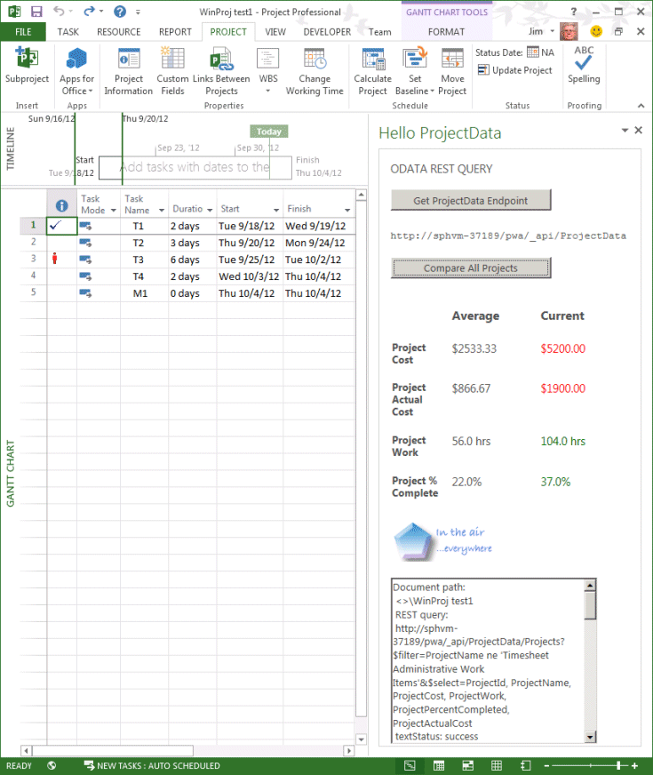

# <a name="updates-for-developers-in-project"></a><span data-ttu-id="8fedb-103">開発者向けの更新プログラム (Project</span><span class="sxs-lookup"><span data-stu-id="8fedb-103">Updates for developers in Project</span></span>

<span data-ttu-id="8fedb-104">Project Server 2013 の機能拡張機能は、Project Onlineオンプレミス インストール用のアドインで動作します。</span><span class="sxs-lookup"><span data-stu-id="8fedb-104">Extensibility features in Project Server 2013 work with add-ins for Project Online and with on-premises installations.</span></span> <span data-ttu-id="8fedb-105">新機能には、クライアント側のオブジェクト モデル (CSOM)、REST インターフェイス、レポート用 OData サービス、リモート イベント レシーバー、宣言型ワークフロー、および Project クライアント用作業ウィンドウ アドインなどがあります。</span><span class="sxs-lookup"><span data-stu-id="8fedb-105">New features include a client-side object model (CSOM), REST interfaces, an OData service for reporting, remote event receivers, declarative workflows, and task pane add-ins for Project clients.</span></span> <span data-ttu-id="8fedb-106">さらに、新しい開発には使用しないほうがよい、使用されなくなった機能についても説明します。</span><span class="sxs-lookup"><span data-stu-id="8fedb-106">Also learn about deprecated features that should not be used for new development.</span></span>
  
<span data-ttu-id="8fedb-107">Projectサーバー 2013 は、Microsoft Office Project Server 2007 で導入され、Project Server 2010 によって拡張されます。</span><span class="sxs-lookup"><span data-stu-id="8fedb-107">Project Server 2013 builds on the framework introduced with Microsoft Office Project Server 2007 and extended by Project Server 2010.</span></span> <span data-ttu-id="8fedb-108">Projectサーバー 2013 は、Project Server Interface (PSI) からリファクタリングおよび簡略化されたクライアント側オブジェクト モデル (CSOM) を追加し、Windows アプリ、Windows Phone 8、および Microsoft Silverlight 用の JavaScript ライブラリと .NET Framework 4 ライブラリを含む。</span><span class="sxs-lookup"><span data-stu-id="8fedb-108">Project Server 2013 adds a client-side object model (CSOM) that is refactored and simplified from the Project Server Interface (PSI), and includes a JavaScript library and .NET Framework 4 libraries for Windows apps, Windows Phone 8, and Microsoft Silverlight.</span></span> <span data-ttu-id="8fedb-109">CSOM は、Project Online向け開発用に設計され、オンプレミスのサーバー インストールProject動作します。</span><span class="sxs-lookup"><span data-stu-id="8fedb-109">The CSOM is designed for development for Project Online, and also works with an on-premises Project Server installation.</span></span> 

<span data-ttu-id="8fedb-110">Project Server データベースは 1 つのデータベースに統合されており、OData サービスでオンラインのレポート テーブルおよびビューにアクセスできます。</span><span class="sxs-lookup"><span data-stu-id="8fedb-110">The Project Server databases are combined into a single database; you can access the online reporting tables and views through an OData service.</span></span> <span data-ttu-id="8fedb-111">CSOM および OData サービスには Representational State Transfer (REST) インターフェイスが含まれます。</span><span class="sxs-lookup"><span data-stu-id="8fedb-111">The CSOM and the OData service include a Representational State Transfer (REST) interface.</span></span> <span data-ttu-id="8fedb-112">Projectサーバー ワークフローは、Designer 2013 SharePoint使用して作成できます。</span><span class="sxs-lookup"><span data-stu-id="8fedb-112">Project Server workflows can be created by using SharePoint Designer 2013.</span></span> <span data-ttu-id="8fedb-113">Project Professional 2013 では、作業ウィンドウの Office アドイン拡張モデルを使用して、Project Server レポート データ、SharePoint タスク リスト、その他の外部コンテンツと統合できます。</span><span class="sxs-lookup"><span data-stu-id="8fedb-113">Project Professional 2013 can integrate with Project Server reporting data, SharePoint task lists, and other external content by using the Office Add-ins extensibility model for task panes.</span></span> <span data-ttu-id="8fedb-114">Project Standard 2013 では、作業ウィンドウ アドインを使用して一般的な外部コンテンツと統合できます。</span><span class="sxs-lookup"><span data-stu-id="8fedb-114">Project Standard 2013 can use task pane add-ins to integrate with general external content.</span></span>
  
<span data-ttu-id="8fedb-115">Project Server 2013 の主な変更点の図と詳細については、「Project [Server 2013 アーキテクチャ」を参照してください](project-server-2013-architecture.md)。</span><span class="sxs-lookup"><span data-stu-id="8fedb-115">For diagrams and more information about major changes in Project Server 2013, see [Project Server 2013 architecture](project-server-2013-architecture.md).</span></span>
  
> [!NOTE]
> <span data-ttu-id="8fedb-116">Project Server 2013 は SharePoint Server 2013 プラットフォームに基づいて構築され、Project 2013 には他の Office 2013 アプリケーションと同じインストラクチャが数多く含まれています。</span><span class="sxs-lookup"><span data-stu-id="8fedb-116">Project Server 2013 is built on the SharePoint Server 2013 platform, and Project 2013 includes much of the same infrastructure as the other Office 2013 applications.</span></span> <span data-ttu-id="8fedb-117">SharePoint アドインのモデル、SharePoint ベースのワークフロー、Web パーツ、他の SharePoint 機能を使用した開発、Office アドインのドキュメントについては[、「SharePoint](https://docs.microsoft.com/sharepoint/dev/sp-add-ins/sharepoint-add-ins)アドイン[、Office](https://docs.microsoft.com/office/dev/add-ins/overview/office-add-ins)アドイン、および[SharePoint 2013](https://msdn.microsoft.com/library/jj164084%28office.15%29.aspx)開発の概要」を参照してください。</span><span class="sxs-lookup"><span data-stu-id="8fedb-117">For documentation of the model for SharePoint Add-ins, SharePoint-based workflows, Web Parts, development with other SharePoint features, and documentation of Office Add-ins, see [SharePoint Add-ins](https://docs.microsoft.com/sharepoint/dev/sp-add-ins/sharepoint-add-ins), [Office Add-ins](https://docs.microsoft.com/office/dev/add-ins/overview/office-add-ins), and [SharePoint 2013 development overview](https://msdn.microsoft.com/library/jj164084%28office.15%29.aspx).</span></span> 
  
## <a name="major-new-features-in-project-2013"></a><span data-ttu-id="8fedb-118">Project 2013 の主な新機能</span><span class="sxs-lookup"><span data-stu-id="8fedb-118">Major new features in Project 2013</span></span>
<span data-ttu-id="8fedb-119"><a name="pj15_WhatsNew_MajorNewFeatures"> </a></span><span class="sxs-lookup"><span data-stu-id="8fedb-119"><a name="pj15_WhatsNew_MajorNewFeatures"> </a></span></span>

<span data-ttu-id="8fedb-120">Project Standard 2013 および Project Professional 2013 の新機能には、他の Office 2013 アプリケーションと一致し、Windows 8 のモダン スタイルのユーザー インターフェイスをサポートする改善されたユーザー インターフェイス、レポートの Office Art オブジェクトとの統合、レポートのバーンダウン レポート、および新しいプログラミング機能が含まれています。</span><span class="sxs-lookup"><span data-stu-id="8fedb-120">New features in Project Standard 2013 and Project Professional 2013 include an improved user interface that matches other Office 2013 applications and supports the modern style user interface in Windows 8, integration with Office Art objects for reports, burndown reports, and new programmability features for reports.</span></span> <span data-ttu-id="8fedb-121">Project Professional 2013 では、SharePoint Server 2013 でのプロジェクトの広範な共有と同期、および Word、Excel、Outlook などの他の Office 2013 アプリケーションにも実装されている作業ウィンドウ アドインが有効になります。</span><span class="sxs-lookup"><span data-stu-id="8fedb-121">Project Professional 2013 enables more extensive sharing and synchronizing projects on SharePoint Server 2013, along with the task pane add-ins that are also implemented in other Office 2013 applications such as Word, Excel, and Outlook.</span></span>
  
<span data-ttu-id="8fedb-122">サーバー 2013 には多くの新機能Projectがあります。</span><span class="sxs-lookup"><span data-stu-id="8fedb-122">There are many new features in Project Server 2013.</span></span> <span data-ttu-id="8fedb-123">一部のユーザーには、新しいタイムラインなどの主要なプログラミングストーリー Project Web App。</span><span class="sxs-lookup"><span data-stu-id="8fedb-123">Some do not have a major programmability story, such as the new timeline in Project Web App.</span></span> <span data-ttu-id="8fedb-124">それらの機能については、Microsoft Office Online の製品のヘルプとエンド ユーザー向けドキュメント、および Microsoft TechNet の管理者と IT 担当者を対象にしたトピックに記載される予定です。</span><span class="sxs-lookup"><span data-stu-id="8fedb-124">Those features will be documented in the product help and end-user documentation on Microsoft Office Online and in topics targeted at administrators and IT professionals on Microsoft TechNet.</span></span> <span data-ttu-id="8fedb-125">その他にも、タイムシートの向上などの新機能によって、サード パーティの開発者がタイムシートと状態管理を Project Server Interface (PSI) で容易に操作できるようになりました。</span><span class="sxs-lookup"><span data-stu-id="8fedb-125">Other new features, such as improved timesheets, make it easier for third-party developers to interact with timesheets and statusing through the Project Server Interface (PSI).</span></span>
  
<span data-ttu-id="8fedb-126">Project Online および Office ストア (Project アドインの追加は、Project Server が Microsoft Azure を通じてアクセスできる、大まかな変更 https://office.microsoft.com/store) です。</span><span class="sxs-lookup"><span data-stu-id="8fedb-126">The addition of Project Online and the Office Store (https://office.microsoft.com/store) for Project add-ins are far-reaching changes, where Project Server is accessible through Microsoft Azure.</span></span> <span data-ttu-id="8fedb-127">Project Server へのクラウドベースのアクセスでは、JavaScript を使用する Microsoft .NET Framework、Microsoft Silverlight、Windows Phone、および Web アプリを使用したアドインの開発にクライアント側オブジェクト モデル (CSOM) を使用します。</span><span class="sxs-lookup"><span data-stu-id="8fedb-127">Cloud-based access to Project Server uses a client-side object model (CSOM) for development of add-ins with the Microsoft .NET Framework, Microsoft Silverlight, Windows Phone, and web apps that use JavaScript.</span></span> <span data-ttu-id="8fedb-128">以前のバージョンProject Online 4 つのサーバー データベースProject 1 つのデータベースにマージする必要があります。</span><span class="sxs-lookup"><span data-stu-id="8fedb-128">A requirement of Project Online is that the four Project Server databases of previous versions are merged into one database.</span></span>
  
<span data-ttu-id="8fedb-129">Projectサーバー 2013 のパフォーマンスとスケーラビリティは、タスクの状態、タイムシート、プロジェクト管理など、多くの分野で向上しています。</span><span class="sxs-lookup"><span data-stu-id="8fedb-129">Project Server 2013 performance and scalability is improved in many areas such as task status, timesheets, and project management.</span></span> <span data-ttu-id="8fedb-130">Projectサーバー ワークフローは、バージョン 4 のワークフロー 基盤 (WF4) Windows再設計されています。</span><span class="sxs-lookup"><span data-stu-id="8fedb-130">Project Server workflows are redesigned with version 4 of Windows Workflow Foundation (WF4).</span></span> <span data-ttu-id="8fedb-131">PSI で .NET Framework 4 および Windows通信ファンデーション (WCF) を使用すると、セキュリティ、パフォーマンス、およびスケーラビリティが向上します。</span><span class="sxs-lookup"><span data-stu-id="8fedb-131">Use of the .NET Framework 4 and Windows Communication Foundation (WCF) with the PSI improves security, performance, and scalability.</span></span> <span data-ttu-id="8fedb-132">たとえば、WCF ベースのアプリケーションの転送プロトコルを変更する場合、アプリケーション コードを変更して再コンパイルすることなく、構成ファイルを使用して変更できます。</span><span class="sxs-lookup"><span data-stu-id="8fedb-132">For example, you can change the transport protocol of WCF-based applications by using configuration files, without changing the application code or recompiling.</span></span> <span data-ttu-id="8fedb-133">Project Web Appは、データが大きく変化しない PSI 呼び出しの多くをキャッシュします。</span><span class="sxs-lookup"><span data-stu-id="8fedb-133">Project Web App caches many of the PSI calls where data does not change significantly.</span></span>
  
> [!NOTE]
> <span data-ttu-id="8fedb-134">Project Server 2013 での開発では、Office および SharePoint ツール拡張機能を使用して Visual Studio を使用できます。Office 2013 製品のアドインをネイティブに作成できます。</span><span class="sxs-lookup"><span data-stu-id="8fedb-134">For development with Project Server 2013, you can use Visual Studio with the Office and SharePoint tools extensions, which can natively create add-ins for the Office 2013 products.</span></span> <span data-ttu-id="8fedb-135">ProjectServer 2013 では、Visual Studioページや WCF ベースのアプリケーションなどの機能の開発を完全に有効にする必要があります。</span><span class="sxs-lookup"><span data-stu-id="8fedb-135">Project Server 2013 requires Visual Studio to fully enable development of features such as project detail pages and WCF-based applications.</span></span> <span data-ttu-id="8fedb-136">SharePointの SharePoint Web パーツ ツール拡張機能は、Visual Studio および他の SharePoint 機能を Project Web Appおよび他の SharePoint サイトに直接SharePointできます。</span><span class="sxs-lookup"><span data-stu-id="8fedb-136">The SharePoint tools extensions in Visual Studio can deploy Web Parts and other SharePoint features directly to Project Web App and other SharePoint sites.</span></span> 
>
> <span data-ttu-id="8fedb-137">Visual Studioで管理できるカスタム フィールド、ステージ、フェーズ、およびエンタープライズ プロジェクトの種類を使用する Project Project Web App Server ワークフローを開発する必要がなくなりました。</span><span class="sxs-lookup"><span data-stu-id="8fedb-137">Visual Studio is no longer required to develop Project Server workflows that use custom fields, stages, phases, and enterprise project types that can be managed in Project Web App.</span></span> <span data-ttu-id="8fedb-138">ワークフローの開発にはVisual Studio使用することができますが、多くの場合、ワークフロー デザイナーを使用して簡単かつ迅速にSharePointできます。</span><span class="sxs-lookup"><span data-stu-id="8fedb-138">Although you can use Visual Studio to develop workflows, they are often easier and quicker to create by using SharePoint Designer.</span></span> <span data-ttu-id="8fedb-139">Visual Studio は、CSOM または他の外部 API にアクセスする必要があるワークフローを開発する際に使用できます。</span><span class="sxs-lookup"><span data-stu-id="8fedb-139">Visual Studio can be used for workflows that require access to the CSOM or other external APIs.</span></span> 
  
### <a name="project-add-ins"></a><span data-ttu-id="8fedb-140">Project アドイン</span><span class="sxs-lookup"><span data-stu-id="8fedb-140">Project add-ins</span></span>
<span data-ttu-id="8fedb-141"><a name="pj15_WhatsNew_Apps"> </a></span><span class="sxs-lookup"><span data-stu-id="8fedb-141"><a name="pj15_WhatsNew_Apps"> </a></span></span>

<span data-ttu-id="8fedb-142">ソフトウェアの配布とマーケティングは、アドインの概念によって大きく変化してきました。</span><span class="sxs-lookup"><span data-stu-id="8fedb-142">Distribution and marketing of software has been revolutionized with the concept of an add-in.</span></span> <span data-ttu-id="8fedb-143">2013 Project では、アドインをパブリック Office ストアから購入およびダウンロードしたり、SharePoint のプライベート カタログ内で配布したりできます。</span><span class="sxs-lookup"><span data-stu-id="8fedb-143">For Project 2013, add-ins can be made available for purchase and download from the public Office Store or distributed within a private catalog on SharePoint.</span></span> <span data-ttu-id="8fedb-144">通常、アドインは、少数の関連タスクを実行する自己完結型の対話型プログラムです。</span><span class="sxs-lookup"><span data-stu-id="8fedb-144">An add-in is typically a self-contained, interactive program that performs a small number of related tasks.</span></span> <span data-ttu-id="8fedb-145">Project アドインには、Project Standard 2013 または Project Standard 2013 クライアントの作業ウィンドウ アドイン、Project Server 2013 または Project Online のアドインを指定できます。</span><span class="sxs-lookup"><span data-stu-id="8fedb-145">A Project add-in can be a task pane add-in for the Project Standard 2013 or Project Standard 2013 clients, or an add-in for Project Server 2013 or Project Online.</span></span>
  
<span data-ttu-id="8fedb-146">Project デスクトップ クライアント用アドインについては、「[Project の作業ウィンドウ アドイン](#pj15_WhatsNew_Agave)」を参照してください。</span><span class="sxs-lookup"><span data-stu-id="8fedb-146">For information about add-ins for the Project desktop clients, see [Task pane add-ins in Project](#pj15_WhatsNew_Agave).</span></span> <span data-ttu-id="8fedb-147">サーバー 2013 Projectの例については、「Create [a SharePointホストProjectサーバー アドイン」を参照してください](create-a-sharepoint-hosted-project-server-add-in.md)。</span><span class="sxs-lookup"><span data-stu-id="8fedb-147">For a Project Server 2013 example, see [Create a SharePoint-hosted Project Server add-in](create-a-sharepoint-hosted-project-server-add-in.md).</span></span> <span data-ttu-id="8fedb-148">Office および SharePoint アドイン[SDK](https://msdn.microsoft.com/library/fp161507.aspx)の記事に加えて[、Office ブログ](https://blogs.office.com/dev/)には、Project および Project Online に関連する投稿が多数含まれています。</span><span class="sxs-lookup"><span data-stu-id="8fedb-148">In addition to articles in the [Office and SharePoint Add-ins SDK](https://msdn.microsoft.com/library/fp161507.aspx), the [Office Blog](https://blogs.office.com/dev/) has many posts that are also relevant to Project 2013 and Project Online.</span></span> 
  
<span data-ttu-id="8fedb-149">サーバー 2013 Projectアドインは、オンプレミスのインストールとインストールの両方でProject Online。</span><span class="sxs-lookup"><span data-stu-id="8fedb-149">An add-in for Project Server 2013 can work with both an on-premises installation and Project Online.</span></span> <span data-ttu-id="8fedb-150">Project Server アドインには、Web パーツ、リモート イベント レシーバー、およびビジネス ロジックを含めることができます。</span><span class="sxs-lookup"><span data-stu-id="8fedb-150">Project Server add-ins can include Web Parts, remote event receivers, and business logic.</span></span> <span data-ttu-id="8fedb-151">アドインでの Project Server オブジェクト モデルへのアクセスは、PSI ではなく CSOM を介して行われます。</span><span class="sxs-lookup"><span data-stu-id="8fedb-151">Access to the Project Server object model in an add-in is through the CSOM, not the PSI.</span></span> <span data-ttu-id="8fedb-152">データ ストレージには、SQL Azure、Microsoft Business Connectivity Services (BCS) 経由などの外部データ、ローカル データベースを使用した内部、混在などのクラウドベースのストレージを使用できます。</span><span class="sxs-lookup"><span data-stu-id="8fedb-152">Data storage can be cloud-based such as with SQL Azure, external such as through Microsoft Business Connectivity Services (BCS), internal with a local database, or mixed.</span></span>
  
#### <a name="add-in-security"></a><span data-ttu-id="8fedb-153">アドインのセキュリティ   通常、アドインが実行可能なアクションは、アドインを実行しているユーザーに代わって実行されます。</span><span class="sxs-lookup"><span data-stu-id="8fedb-153">Add-in security</span></span>

<span data-ttu-id="8fedb-154">ユーザーが明示的に偽装を使用したり、アドインを実行可能なユーザーを指定したりすることはありません。</span><span class="sxs-lookup"><span data-stu-id="8fedb-154">In general, actions that an add-in takes are performed on behalf of the user who runs the add-in; you do not explicitly use impersonation or specify who can run the add-in.</span></span> <span data-ttu-id="8fedb-155">アドインを実行しているユーザーのアクセス許可レベルを超えるアクションは、実行できません。</span><span class="sxs-lookup"><span data-stu-id="8fedb-155">Actions cannot exceed the permission level of the user who runs the add-in.</span></span> 
  
<span data-ttu-id="8fedb-156">2012 Office Developer Tools for Visual Studio では、AppManifext.xml ファイルには、アクセス許可要求スコープを設定できるグラフィカル エディターがあります。</span><span class="sxs-lookup"><span data-stu-id="8fedb-156">In Office Developer Tools for Visual Studio 2012, the AppManifext.xml file has a graphical editor where you can set the permission request scope.</span></span> <span data-ttu-id="8fedb-157">たとえば、プロジェクト マネージャーが自らのプロジェクトを更新できるアドインを作成するには、**AppManifest.xml** デザイナー ウィンドウの [**アクセス許可**] タブで、スコープは [**複数のプロジェクト**] を、アクセス許可は [**書き込み**] を選択します。</span><span class="sxs-lookup"><span data-stu-id="8fedb-157">For example, to create an add-in that enables project managers to update their projects, on the **Permissions** tab of the **AppManifest.xml** designer pane, select **Multiple Projects** for the scope and **Write** for the permission.</span></span> <span data-ttu-id="8fedb-158">プロジェクト マネージャーの権限を持つアドイン ユーザーは、自らが管理しているプロジェクトでアドインを実行できます。</span><span class="sxs-lookup"><span data-stu-id="8fedb-158">If the add-in user has project manager permissions, she can run the add-in for projects that she manages.</span></span> <span data-ttu-id="8fedb-159">AppManifest.xml ファイル内のコードには、以下の記述が含まれます。</span><span class="sxs-lookup"><span data-stu-id="8fedb-159">The code in the AppManifest.xml file would include the following:</span></span> 
  
```XML
  <AppPermissionRequests>
    <AppPermissionRequest Scope="https://sharepoint/projectserver/projects" Right="Write" />
  </AppPermissionRequests>
```

<span data-ttu-id="8fedb-160">**表 1. Project Server アドイン用のアクセス許可リクエストのスコープ**</span><span class="sxs-lookup"><span data-stu-id="8fedb-160">**Table 1. Permission request scopes for Project Server add-ins**</span></span>

|<span data-ttu-id="8fedb-161">範囲</span><span class="sxs-lookup"><span data-stu-id="8fedb-161">Scope</span></span>|<span data-ttu-id="8fedb-162">権限</span><span class="sxs-lookup"><span data-stu-id="8fedb-162">Permissions</span></span>|
|:-----|:-----|
|<span data-ttu-id="8fedb-163">**Project Server**</span><span class="sxs-lookup"><span data-stu-id="8fedb-163">**Project Server**</span></span> <br/> |<span data-ttu-id="8fedb-164">**管理** (Project Server 管理者のアクセス許可が必要)</span><span class="sxs-lookup"><span data-stu-id="8fedb-164">**Manage** (Requires Project Server administrator permissions.)</span></span>  <br/> |
|<span data-ttu-id="8fedb-165">**複数のプロジェクト**</span><span class="sxs-lookup"><span data-stu-id="8fedb-165">**Multiple Projects**</span></span> <br/> |<span data-ttu-id="8fedb-166">**読み取り**、**書き込み** (一部の操作にはプロジェクト マネージャーのアクセス許可が必要となり、タスクの割り当てなどの基本の読み取り操作にはプロジェクト チーム メンバーのアクセス許可が必要となります。)</span><span class="sxs-lookup"><span data-stu-id="8fedb-166">**Read**, **Write** (Requires project manager permissions for some operations; project team member permissions for basic read operations, such as task assignments.)</span></span>  <br/> |
|<span data-ttu-id="8fedb-167">**1 つのプロジェクト**</span><span class="sxs-lookup"><span data-stu-id="8fedb-167">**Single Project**</span></span> <br/> |<span data-ttu-id="8fedb-168">**読み取り**、**書き込み** (少なくともプロジェクト チーム メンバーのアクセス許可が必要。プロジェクト内のデータにアクセスできるかどうかは、他のアクセス許可レベルに依存します。)</span><span class="sxs-lookup"><span data-stu-id="8fedb-168">**Read**, **Write** (Requires at least project team member permissions; access to some data in a project depends on other permission levels.)</span></span>  <br/> |
|<span data-ttu-id="8fedb-169">**エンタープライズ リソース**</span><span class="sxs-lookup"><span data-stu-id="8fedb-169">**Enterprise Resources**</span></span> <br/> |<span data-ttu-id="8fedb-170">**読み取り**、**書き込み** (リソース マネージャーのアクセス許可が必要)</span><span class="sxs-lookup"><span data-stu-id="8fedb-170">**Read**, **Write** (Requires resource manager permissions.)</span></span>  <br/> |
|<span data-ttu-id="8fedb-171">**Statusing**</span><span class="sxs-lookup"><span data-stu-id="8fedb-171">**Statusing**</span></span> <br/> |<span data-ttu-id="8fedb-172">**提出ステータス** (プロジェクトの状態を送信するためのアクセス許可が必要)</span><span class="sxs-lookup"><span data-stu-id="8fedb-172">**SubmitStatus** (Requires permission to submit status for your projects.)</span></span>  <br/> |
|<span data-ttu-id="8fedb-173">**レポート**</span><span class="sxs-lookup"><span data-stu-id="8fedb-173">**Reporting**</span></span> <br/> |<span data-ttu-id="8fedb-174">**読み取り** (Project Server にログオンするためのアクセス許可が必要)</span><span class="sxs-lookup"><span data-stu-id="8fedb-174">**Read** (Requires permission to log on Project Server.)</span></span>  <br/> |
|<span data-ttu-id="8fedb-175">**ワークフロー**</span><span class="sxs-lookup"><span data-stu-id="8fedb-175">**Workflow**</span></span> <br/> |<span data-ttu-id="8fedb-p116">**昇格** (ワークフローを実行するためのアクセス許可が必要。ワークフローでのステージ間の移行を可能にするために、アドインは管理者特権で実行されます。ステージ遷移はアドイン内のビジネス ロジックによって制御されます。)</span><span class="sxs-lookup"><span data-stu-id="8fedb-p116">**Elevate** (Requires permission to run workflows. The add-in runs with elevated permissions, to enable transitions from stage to stage in a workflow. Business logic in the add-in controls stage transitions.)  </span></span><br/> |
   
> [!NOTE]
> <span data-ttu-id="8fedb-179">Projectサーバー 2013 および Project Online は、SharePoint 2013 ではアプリ専用認証モデルを使用しません (「SharePoint [2013 のアドイン承認ポリシーの種類」を参照](https://msdn.microsoft.com/library/124879c7-a746-4c10-96a7-da76ad5327f0%28Office.15%29.aspx)してください)。</span><span class="sxs-lookup"><span data-stu-id="8fedb-179">Project Server 2013 and Project Online do not use the app-only authentication model in SharePoint 2013 (see [Add-in authorization policy types in SharePoint 2013](https://msdn.microsoft.com/library/124879c7-a746-4c10-96a7-da76ad5327f0%28Office.15%29.aspx)).</span></span> 
  
<span data-ttu-id="8fedb-180">アドインの開発、配布、ホスティング、管理については、「SharePoint アドインと Office アドイン」、および[「SharePoint](https://docs.microsoft.com/sharepoint/dev/sp-add-ins/sharepoint-add-ins) Server 2013 および[Office](https://docs.microsoft.com/office/dev/add-ins/overview/office-add-ins)2013 開発者向けドキュメント」を参照してください。</span><span class="sxs-lookup"><span data-stu-id="8fedb-180">For information about developing, distributing, hosting, and managing add-ins, see [SharePoint Add-ins](https://docs.microsoft.com/sharepoint/dev/sp-add-ins/sharepoint-add-ins) and [Office Add-ins](https://docs.microsoft.com/office/dev/add-ins/overview/office-add-ins), and related topics in the SharePoint Server 2013 and Office 2013 developer documentation.</span></span> <span data-ttu-id="8fedb-181">他のアドインのアクセス許可要求範囲[SharePoint、2013](https://msdn.microsoft.com/library/5f7a8440-3c09-4cf8-83ec-c236bfa2d6c4%28Office.15%29.aspx)年のアドインのアクセス許可SharePoint参照してください。</span><span class="sxs-lookup"><span data-stu-id="8fedb-181">For information about permission request scope for other SharePoint Add-ins, see [Add-in permissions in SharePoint 2013](https://msdn.microsoft.com/library/5f7a8440-3c09-4cf8-83ec-c236bfa2d6c4%28Office.15%29.aspx).</span></span>
  
### <a name="integrating-with-sharepoint-server"></a><span data-ttu-id="8fedb-182">SharePoint Server との統合</span><span class="sxs-lookup"><span data-stu-id="8fedb-182">Integrating with SharePoint Server</span></span>
<span data-ttu-id="8fedb-183"><a name="pj15_WhatsNew_IntegrationWSS"> </a></span><span class="sxs-lookup"><span data-stu-id="8fedb-183"><a name="pj15_WhatsNew_IntegrationWSS"> </a></span></span>

<span data-ttu-id="8fedb-184">Project Web App の多くの機能では、OAuth やクレーム ベース認証、SharePoint グループによる Project Server の承認とアクセス許可、SharePoint タスク リストを使用したプロジェクトの同期、Project Server 宣言型ワークフローなど、SharePoint Server 2013 の新しいインフラストラクチャが必要です。</span><span class="sxs-lookup"><span data-stu-id="8fedb-184">Many features in Project Web App require the new infrastructure in SharePoint Server 2013 such as OAuth and claims-based authentication, Project Server authorization and permissions through SharePoint groups, synchronization of projects with SharePoint task lists, and Project Server declarative workflows.</span></span> <span data-ttu-id="8fedb-185">Project Service アプリケーションは、SharePoint ファーム内の任意のサイト コレクションと関連付けることができます。</span><span class="sxs-lookup"><span data-stu-id="8fedb-185">The Project Service Application can be associated with any site collection in a SharePoint farm.</span></span> <span data-ttu-id="8fedb-186">プロジェクトを SharePoint タスク リストと同期し、SharePoint でプロジェクトを維持することができます。</span><span class="sxs-lookup"><span data-stu-id="8fedb-186">Project synchronization can be with a SharePoint task list, where SharePoint maintains the project.</span></span> <span data-ttu-id="8fedb-187">エンタープライズ プロジェクトを SharePoint タスク リストと同期し、Project Server がフル コントロールを維持することもできます。</span><span class="sxs-lookup"><span data-stu-id="8fedb-187">An enterprise project can also be synchronized with a SharePoint task list, where Project Server maintains full control.</span></span> <span data-ttu-id="8fedb-188">アーキテクチャ図とプロジェクト同期の説明については、「Project [Server 2013 アーキテクチャ」を参照してください](project-server-2013-architecture.md)。</span><span class="sxs-lookup"><span data-stu-id="8fedb-188">For architectural diagrams and an explanation of project synchronization, see [Project Server 2013 architecture](project-server-2013-architecture.md).</span></span>
  
<span data-ttu-id="8fedb-189">サーバー 2013 には多くの新機能SharePointがあります。</span><span class="sxs-lookup"><span data-stu-id="8fedb-189">There are many new features in SharePoint Server 2013.</span></span> <span data-ttu-id="8fedb-190">詳細については、「開発者向[けSharePoint」を参照してください](https://msdn.microsoft.com/sharepoint)。</span><span class="sxs-lookup"><span data-stu-id="8fedb-190">For more information, see [SharePoint for developers](https://msdn.microsoft.com/sharepoint).</span></span>
  
### <a name="integrating-with-workflows"></a><span data-ttu-id="8fedb-191">ワークフローとの統合</span><span class="sxs-lookup"><span data-stu-id="8fedb-191">Integrating with workflows</span></span>
<span data-ttu-id="8fedb-192"><a name="pj15_WhatsNew_Workflow"> </a></span><span class="sxs-lookup"><span data-stu-id="8fedb-192"><a name="pj15_WhatsNew_Workflow"> </a></span></span>

<span data-ttu-id="8fedb-p120">ワークフローはプロジェクト ポートフォリオ管理のコア機能です。プロジェクトのライフ サイクルには、多くのフェーズにまたがる長期間のプロセスを含めることができます。ガバナンス フェーズには、プロジェクトの提案、ビジネスへの影響度の分析、およびプロジェクトの選択、作成、計画、管理、追跡が含まれます。</span><span class="sxs-lookup"><span data-stu-id="8fedb-p120">Workflows are a core feature of project portfolio management. A project life cycle can include long-running processes that span many phases. Governance phases include project proposals, analyses of business impact, and selecting, creating, planning, managing, and tracking projects.</span></span>
  
<span data-ttu-id="8fedb-196">Projectサーバー 2013 ワークフローは、WF4 を使用SharePoint 2013 ワークフロー プラットフォーム上に構築されています。</span><span class="sxs-lookup"><span data-stu-id="8fedb-196">Project Server 2013 workflows are built on the SharePoint 2013 workflow platform, which uses WF4.</span></span> <span data-ttu-id="8fedb-197">以前のバージョンとは異なり、Project Server 2013 の宣言型ワークフローは、SharePoint Designer 2013 を使用して作成できます。オンプレミスとオンラインの両方でアクセスできます。</span><span class="sxs-lookup"><span data-stu-id="8fedb-197">Unlike in previous versions, declarative workflows for Project Server 2013 can be created by using SharePoint Designer 2013 and are accessible for both on-premises and online use.</span></span> <span data-ttu-id="8fedb-198">Projectサーバー ワークフローは、OAuth SharePointワークフロー セキュリティ モデルを使用し、そのワークフロー サイトにProject Web Appできます。</span><span class="sxs-lookup"><span data-stu-id="8fedb-198">Project Server workflows use the SharePoint workflow security model with OAuth, and can be installed on a Project Web App site.</span></span> <span data-ttu-id="8fedb-199">図 1 は、SharePoint Designer 2013 が需要管理のサイト ワークフローにステージを追加できる点を示しています。このワークフローでは、ステージは Project Web App。</span><span class="sxs-lookup"><span data-stu-id="8fedb-199">Figure 1 shows that SharePoint Designer 2013 can add stages to a site workflow for Demand Management, where the stages are defined in Project Web App.</span></span>
  
<span data-ttu-id="8fedb-200">**図 1. SharePoint Designer を使用した Project Web アプリ用ワークフローへのステージの追加**</span><span class="sxs-lookup"><span data-stu-id="8fedb-200">**Figure 1. Using SharePoint Designer to add a stage to a workflow for Project Web App**</span></span>

<span data-ttu-id="8fedb-201"></span><span class="sxs-lookup"><span data-stu-id="8fedb-201"></span></span>

<br/>

<span data-ttu-id="8fedb-202">SharePoint Designer 2013 または Visual Studio 2012 のいずれかのワークフロー ステージ、アクション、条件、その他の要素をデザイン ツールに追加することで、宣言型ワークフローを構築します。</span><span class="sxs-lookup"><span data-stu-id="8fedb-202">You build a declarative workflow by adding workflow stages, actions, conditions, and other elements in a design tool, which can be either SharePoint Designer 2013 or Visual Studio 2012.</span></span> <span data-ttu-id="8fedb-203">次に、デザイン ツールはワークフローを XAML コードとして保存し、実行時に解釈されます。</span><span class="sxs-lookup"><span data-stu-id="8fedb-203">The design tool then saves the workflow as XAML code, which is interpreted at runtime.</span></span> <span data-ttu-id="8fedb-204">宣言型ワークフローは、サーバー 2013 Projectオンプレミスまたはオンプレミスで実行Project Online。</span><span class="sxs-lookup"><span data-stu-id="8fedb-204">Declarative workflows can run either in Project Server 2013 on-premises or in Project Online.</span></span> <span data-ttu-id="8fedb-205">2012 Visual Studioを使用すると、追加のコントロール用にカスタム アクションとフォームを作成し、複数のインスタンスで再利用するためにワークフロー テンプレートを保存Project Web Appできます。</span><span class="sxs-lookup"><span data-stu-id="8fedb-205">By using Visual Studio 2012, you can also build custom actions and forms for additional control, and save workflow templates for reuse with multiple Project Web App instances.</span></span> <span data-ttu-id="8fedb-206">SharePointDesigner 2013 では、2012 年に作成されたカスタム アクションVisual Studioできます。</span><span class="sxs-lookup"><span data-stu-id="8fedb-206">SharePoint Designer 2013 can consume custom actions that are created in Visual Studio 2012.</span></span>
  
<span data-ttu-id="8fedb-207">Project Server 2013 ワークフローはアプリとして機能し、管理者 (Project Web App の設計アクセス許可を持つ管理者) は宣言型ワークフローを発行し、それをエンタープライズ プロジェクトの種類 (EPT) に関連付けます。</span><span class="sxs-lookup"><span data-stu-id="8fedb-207">A Project Server 2013 workflow acts as an app, where an administrator—who has design permissions for Project Web App—can publish a declarative workflow and associate it with an enterprise project type (EPT).</span></span> <span data-ttu-id="8fedb-208">EPT は Project Server がフル コントロールを維持するエンタープライズ プロジェクトにする必要があります。</span><span class="sxs-lookup"><span data-stu-id="8fedb-208">The EPT must be for an enterprise project, where Project Server maintains full control.</span></span> <span data-ttu-id="8fedb-209">SharePoint タスク リストでは Project Server ワークフローを使用できません。</span><span class="sxs-lookup"><span data-stu-id="8fedb-209">A SharePoint task list cannot use a Project Server workflow.</span></span> 
  
<span data-ttu-id="8fedb-210">OAuth では、プロジェクト マネージャーはプロジェクト作成権限が与えられ、偽装を使用せずにワークフローを起動できます。</span><span class="sxs-lookup"><span data-stu-id="8fedb-210">OAuth enables project managers who have project creation permissions to invoke the workflow without using impersonation.</span></span> <span data-ttu-id="8fedb-211">Project Server へのワークフローの呼び出し、たとえば、通過する分岐を選択するためのユーザー設定フィールド値の読み取りを、プロジェクト マネージャーを代理して実行します。</span><span class="sxs-lookup"><span data-stu-id="8fedb-211">Workflow calls to Project Server, for example to read a custom field value to decide which branch to follow, are made on behalf of the project manager.</span></span> <span data-ttu-id="8fedb-212">自動的に次のステージに進むワークフローをプロジェクト マネージャーが作成することを防ぐため、次のワークフロー ステージに移動するための呼び出しはワークフロー作成者 (管理者) 権限で実行されます。</span><span class="sxs-lookup"><span data-stu-id="8fedb-212">To prevent the project manager from creating a workflow that automatically advances to the next stage, the call for moving to the next workflow stage runs as the workflow author (the administrator).</span></span> <span data-ttu-id="8fedb-213">これに対し、従来のサーバー 2010 Project ワークフローのユーザーは、ワークフロー プロキシ ユーザー アカウントを介して偽装された呼び出しを行い、ワークフロー全体で管理者アクセス権を取得します。</span><span class="sxs-lookup"><span data-stu-id="8fedb-213">In contrast, users of legacy Project Server 2010 workflows make impersonated calls through the Workflow Proxy User account to gain administrator access throughout the entire workflow.</span></span>
  
<span data-ttu-id="8fedb-214">オンプレミスProjectサーバー 2013 では、コンパイル済みの WF3.5 ベースのワークフローを使用することができますが、従来のワークフローを WF4 に基づく宣言型ワークフローにアップグレードすることをお勧めします。</span><span class="sxs-lookup"><span data-stu-id="8fedb-214">Although Project Server 2013 on-premises can use compiled WF3.5-based workflows, we recommend that you upgrade legacy workflows to declarative workflows based on WF4.</span></span> <span data-ttu-id="8fedb-215">最新のテクノロジは、より拡張性があり堅牢です。</span><span class="sxs-lookup"><span data-stu-id="8fedb-215">The newer technology is more scalable and robust.</span></span> <span data-ttu-id="8fedb-216">ビジネス アナリストと PMO スタッフは、Visio 2013 を使用してワークフロー デザインを作成または更新し、SharePoint Designer 2013 を使用してコーディングせずに Project Server ワークフローを実装できます。</span><span class="sxs-lookup"><span data-stu-id="8fedb-216">Business analysts and PMO staff can create or update workflow designs by using Visio 2013 and implement Project Server workflows without coding by using SharePoint Designer 2013.</span></span>
  
<span data-ttu-id="8fedb-217">宣言型ワークフローを作成する方法については、「Project Web App Server ワークフローの開発の[Project」を参照してください](getting-started-developing-project-server-workflows.md)。</span><span class="sxs-lookup"><span data-stu-id="8fedb-217">For information about creating a declarative workflow for Project Web App, see [Getting started developing Project Server workflows](getting-started-developing-project-server-workflows.md).</span></span> <span data-ttu-id="8fedb-218">ワークフローのデザイナー機能と SharePoint 機能Visual Studio比較については、「ワークフローを使用して SharePoint [2013](https://msdn.microsoft.com/library/office/jj163199.aspx)ワークフローを開発する」を参照Visual Studio。</span><span class="sxs-lookup"><span data-stu-id="8fedb-218">For a comparison of SharePoint Designer and Visual Studio capabilities for workflows, see [Develop SharePoint 2013 workflows using Visual Studio](https://msdn.microsoft.com/library/office/jj163199.aspx).</span></span>
  
### <a name="client-side-object-model"></a><span data-ttu-id="8fedb-219">クライアント側オブジェクト モデル</span><span class="sxs-lookup"><span data-stu-id="8fedb-219">Client-side object model</span></span>
<span data-ttu-id="8fedb-220"><a name="pj15_WhatsNew_CSOM"> </a></span><span class="sxs-lookup"><span data-stu-id="8fedb-220"><a name="pj15_WhatsNew_CSOM"> </a></span></span>

<span data-ttu-id="8fedb-221">プログラムによるアクセスには、Project Online CSOM 上に構築された CSOM が必要SharePointです。</span><span class="sxs-lookup"><span data-stu-id="8fedb-221">Programmatic access to Project Online requires a CSOM that is built on the SharePoint CSOM.</span></span> <span data-ttu-id="8fedb-222">Project Online認証は、サーバー フォーム認証やサーバー フォーム認証Windows認証ではなく、Windows Live Project ID を使用Windowsされます。</span><span class="sxs-lookup"><span data-stu-id="8fedb-222">Project Online authentication will be with OAuth using a Windows Live ID, not Project Server Forms authentication or Windows authentication.</span></span>
  
<span data-ttu-id="8fedb-223">サーバー 2013 の CSOM の原則とProject次に示します。</span><span class="sxs-lookup"><span data-stu-id="8fedb-223">Following are the principles and features of the CSOM in Project Server 2013:</span></span>
  
- <span data-ttu-id="8fedb-224">CSOM は使いやすさを考慮して設計されています。</span><span class="sxs-lookup"><span data-stu-id="8fedb-224">The CSOM is designed for ease of use.</span></span> <span data-ttu-id="8fedb-225">たとえば、メソッドとプロパティは、多くの  _GUID、changeXml_ パラメーターを必要としたり、データセットを渡したりするのではなく、名前でデータを直接使用または提供します。</span><span class="sxs-lookup"><span data-stu-id="8fedb-225">For example, methods and properties directly use or provide data by name, rather than requiring many GUIDs,  _changeXml_ parameters, or passing around datasets.</span></span> 
    
- <span data-ttu-id="8fedb-226">Project Server の CSOM はサードパーティのソリューションの一般的な要件に基づいて PSI 機能のサブセットを実装します。</span><span class="sxs-lookup"><span data-stu-id="8fedb-226">The Project Server CSOM implements a subset of the PSI functionality, based on the most common requirements for third-party solutions.</span></span>
    
- <span data-ttu-id="8fedb-p129">CSOM は PSI を内部的に呼び出しますが、その構造は変わったものになっています。たとえば、すべての状態変更の更新が **StatusAssignmentCollection.SubmitAllStatusUpdates** メソッドを使用して行われるようになっており、ユーザーについては PSI メソッドの **Statusing.SubmitStatus** を使用し、その他のリソースについては **SubmitStatusForResource** メソッドを使用する、というようにはなっていません。</span><span class="sxs-lookup"><span data-stu-id="8fedb-p129">The CSOM internally calls the PSI, but is factored differently. For example, updates for all statusing changes are done through the **StatusAssignmentCollection.SubmitAllStatusUpdates** method, not by the **Statusing.SubmitStatus** PSI method for the user or the **SubmitStatusForResource** method for other resources.</span></span> 
    
- <span data-ttu-id="8fedb-229">PSI の 22 個のパブリック サービスを使用しなくても、1 つの WCF サービス (Client.svc) で CSOM に アクセスできます。</span><span class="sxs-lookup"><span data-stu-id="8fedb-229">The CSOM is accessible through one WCF service (Client.svc), rather than through the 22 public services of the PSI.</span></span>
    
- <span data-ttu-id="8fedb-230">サーバー CSOM Projectの初期化は、WCF 参照またはプロキシ アセンブリを使用するのではなく、Project Web App URL を持つ[ProjectContext](https://msdn.microsoft.com/library/Microsoft.ProjectServer.Client.ProjectContext.aspx)クラスを介して直接行います。</span><span class="sxs-lookup"><span data-stu-id="8fedb-230">Initialization of the Project Server CSOM is directly through the [ProjectContext](https://msdn.microsoft.com/library/Microsoft.ProjectServer.Client.ProjectContext.aspx) class with the Project Web App URL, not by using a WCF reference or proxy assembly.</span></span> 
    
- <span data-ttu-id="8fedb-p130">CSOM は、内部 SharePoint CSOM インフラストラクチャでサポートされる複数のクライアント ライブラリおよびインターフェイスを実装します。クライアント ライブラリおよびインターフェイスには次のものが含まれます。</span><span class="sxs-lookup"><span data-stu-id="8fedb-p130">The CSOM implements multiple client libraries and interfaces, which are supported by the internal SharePoint CSOM infrastructure. The client libraries and interfaces include the following:</span></span>
    
  - <span data-ttu-id="8fedb-233">Microsoft.ProjectServer.Client.dll アセンブリ内の Microsoft .NET クライアント ライブラリ</span><span class="sxs-lookup"><span data-stu-id="8fedb-233">Microsoft .NET client library in the Microsoft.ProjectServer.Client.dll assembly</span></span>
    
  - <span data-ttu-id="8fedb-234">アセンブリ内の Silverlight ライブラリMicrosoft.ProjectServer.Client.Silverlight.dllします。</span><span class="sxs-lookup"><span data-stu-id="8fedb-234">Silverlight library in the Microsoft.ProjectServer.Client.Silverlight.dll assembly</span></span>
    
  - <span data-ttu-id="8fedb-235">Microsoft.ProjectServer.Client.Phone.dll アセンブリ内の Windows Phone 8 ライブラリ</span><span class="sxs-lookup"><span data-stu-id="8fedb-235">Windows Phone 8 library in the Microsoft.ProjectServer.Client.Phone.dll assembly</span></span>
    
  - <span data-ttu-id="8fedb-236">Web アプリケーション用の JavaScript ライブラリ (PS.jsファイルまたは PS.debug.js ファイル内)</span><span class="sxs-lookup"><span data-stu-id="8fedb-236">JavaScript library for web applications in the PS.js file or PS.debug.js file</span></span>
    
  - <span data-ttu-id="8fedb-237">OData プロトコルを使用してアクセスするための REST エンドポイント</span><span class="sxs-lookup"><span data-stu-id="8fedb-237">REST endpoints, for access with the OData protocol</span></span>
    
  - <span data-ttu-id="8fedb-238">フィルター処理によって返されるデータ量を制限できる LINQ クエリのネイティブ サポート</span><span class="sxs-lookup"><span data-stu-id="8fedb-238">Native support for LINQ queries with filtering, to limit the amount of data that is returned</span></span>
    
- <span data-ttu-id="8fedb-239">CSOM は、PSI や Microsoft.Office.Project.Server.Library.dll などの他の Project Server アセンブリとは別に、Project Online ソリューションとオンプレミス ソリューションの両方に使用できます。</span><span class="sxs-lookup"><span data-stu-id="8fedb-239">The CSOM can be used both for Project Online solutions and for on-premises solutions, independently of the PSI and other Project Server assemblies such as Microsoft.Office.Project.Server.Library.dll.</span></span>
    
- <span data-ttu-id="8fedb-240">Project Server 2013 CSOM の追加機能は、Project Server パートナーと開発者コミュニティからの要求に基づいて、累積的な更新プログラムとサービス パックに対して考慮される場合があります。</span><span class="sxs-lookup"><span data-stu-id="8fedb-240">Additional functionality of the Project Server 2013 CSOM may be considered for cumulative updates and service packs, based on requests by Project Server partners and the developer community.</span></span>
    
> [!NOTE]
> <span data-ttu-id="8fedb-p131">CSOM はサードパーティの Project Server 開発者にお勧めのインターフェイスです。新しいアプリケーションを開発する際に、対象アプリケーションに必要な機能が CSOM に含まれている場合には、CSOM を使用することをお勧めします。</span><span class="sxs-lookup"><span data-stu-id="8fedb-p131">The CSOM is the preferred interface for third-party Project Server developers. We recommend that you use the CSOM for developing new applications, if the CSOM includes the functionality that your application requires.</span></span> 
  
<span data-ttu-id="8fedb-243">CSOM の開発の詳細については、「クライアント側オブジェクト モデル[(CSOM) for Project 2013」を参照](client-side-object-model-csom-for-project-2013.md)してください。</span><span class="sxs-lookup"><span data-stu-id="8fedb-243">For information about developing with the CSOM, see [Client-side object model (CSOM) for Project 2013](client-side-object-model-csom-for-project-2013.md).</span></span> <span data-ttu-id="8fedb-244">SharePoint アプリケーションの REST インターフェイスの詳細については、SharePoint 2013 開発者向けドキュメントの *「SharePoint* SharePoint REST サービスを使用したプログラミング」を参照してください。</span><span class="sxs-lookup"><span data-stu-id="8fedb-244">For information about the REST interface in SharePoint applications, see  *Programming using the SharePoint REST service*  in the SharePoint 2013 developer documentation.</span></span> 
  
### <a name="changes-in-the-reporting-database"></a><span data-ttu-id="8fedb-245">レポート データベースの変更点</span><span class="sxs-lookup"><span data-stu-id="8fedb-245">Changes in the Reporting database</span></span>
<span data-ttu-id="8fedb-246"><a name="pj15_WhatsNew_RDBChanges"> </a></span><span class="sxs-lookup"><span data-stu-id="8fedb-246"><a name="pj15_WhatsNew_RDBChanges"> </a></span></span>

<span data-ttu-id="8fedb-247">Project Server 2010 の 4 つのデータベースは、Project Server 2013 の単一Projectに組み合わされます。</span><span class="sxs-lookup"><span data-stu-id="8fedb-247">The four databases in Project Server 2010 are combined into a single Project database in Project Server 2013.</span></span> <span data-ttu-id="8fedb-248">Project データベースの既定の名前は ProjectService です。</span><span class="sxs-lookup"><span data-stu-id="8fedb-248">The default name of the Project database is ProjectService.</span></span> <span data-ttu-id="8fedb-249">レポート テーブルとビューは以前の名前を保持し、下書きデータベース、発行済みデータベース、アーカイブ データベースのテーブルとビューにはプレフィックス  `draft`  `pub`  `ver` 、ProjectService データベースがあります。</span><span class="sxs-lookup"><span data-stu-id="8fedb-249">Reporting tables and views retain their previous names, and tables and views from the Draft, Published, and Archive databases have the prefixes  `draft`,  `pub`, and  `ver` in the ProjectService database.</span></span> <span data-ttu-id="8fedb-250">たとえば、発行済みプロジェクト テーブルの名前は pub.MSP_PROJECTS です。</span><span class="sxs-lookup"><span data-stu-id="8fedb-250">For example, the published projects table is pub.MSP_PROJECTS.</span></span> 
  
> [!IMPORTANT]
> <span data-ttu-id="8fedb-251">下書き (プレフィックス)、発行済み ( )、アーカイブ ( ) テーブルとビューでは直接 `draft` `pub` `ver` アクセスはサポートされていません。</span><span class="sxs-lookup"><span data-stu-id="8fedb-251">Direct access is not supported for the draft (`draft` prefix), published (`pub`), and archive (`ver`) tables and views.</span></span> <span data-ttu-id="8fedb-252">レポートでは、プレフィックスを持つレポート テーブルとビューのみを使用 `dbo` する必要があります。</span><span class="sxs-lookup"><span data-stu-id="8fedb-252">Reports should use only the reporting tables and views, which have the `dbo` prefix.</span></span> <span data-ttu-id="8fedb-253">たとえば、dbo。MSP_EpmProjectには、インスタンス内のプロジェクトの一覧がProject Web Appされます。</span><span class="sxs-lookup"><span data-stu-id="8fedb-253">For example, the dbo.MSP_EpmProject table includes the list of projects in the Project Web App instance.</span></span> 
>
> <span data-ttu-id="8fedb-p135">Project データベースのテーブルおよびビューには、プログラムによってデータベースに直接アクセスしてデータを更新することを能動的に妨げるものは存在しません。Project Professional キャッシュ、下書きおよび発行済みデータ テーブル、およびレポート テーブルはすべてがキャッシュ同期プロトコルに依存しているので、直接データを編集すると同期が混乱する可能性があることに注意が必要です。直接アクセスしてデータを変更することによって、Project Server データベースや Project Professional クライアント側キャッシュが破損した場合、製品サポートは役に立てません。</span><span class="sxs-lookup"><span data-stu-id="8fedb-p135">There is nothing to actively prevent you from using direct programmatic database access to update data in any of the tables and views in the Project database. You should be aware that the Project Professional cache, the tables for draft and published data, and the reporting tables all rely on a cache synchronization protocol that can be disrupted by direct data editing. If you damage your Project Server databases or corrupt Project Professional client-side caches by using direct access to change data, be warned that product support won't be able to help!</span></span> 
  
<span data-ttu-id="8fedb-257">Projectサーバー 2013 では、オンラインおよびオンプレミス アクセス用の OData サービスが導入されています。</span><span class="sxs-lookup"><span data-stu-id="8fedb-257">Project Server 2013 introduces an OData service for online and on-premises access.</span></span> <span data-ttu-id="8fedb-258">オンライン レポート テーブルとビューは、OData インターフェイスによってのみ公開されます。オンプレミスで使用する場合は、OData インターフェイスを使用するか、またはレポート テーブルとビューに直接アクセスSharePointできます。</span><span class="sxs-lookup"><span data-stu-id="8fedb-258">The online reporting tables and views are exposed only by the OData interface; for on-premises use, you can use the OData interface or directly access the reporting tables and views in the ProjectService database in the SharePoint farm.</span></span> <span data-ttu-id="8fedb-259">Project Onlineマルチテナント データベースはサポートされていません。</span><span class="sxs-lookup"><span data-stu-id="8fedb-259">Project Online does not support a multitenant database.</span></span> <span data-ttu-id="8fedb-260">つまり、データベースの複数のインスタンスProject Web AppデータベースがProjectされます。</span><span class="sxs-lookup"><span data-stu-id="8fedb-260">That is, multiple instances of Project Web App each have their own Project database.</span></span> <span data-ttu-id="8fedb-261">OData サービスは、レポート テーブルSQLクエリを内部的に実行し、XML または JSON ペイロードを提供します。</span><span class="sxs-lookup"><span data-stu-id="8fedb-261">The OData service internally runs SQL queries on the reporting tables and views, and delivers an XML or JSON payload.</span></span> <span data-ttu-id="8fedb-262">Project Server 2013 でのレポート作成のための OData サービスの概要と **ProjectData** スキーマリファレンスについては [、「ProjectData -](https://msdn.microsoft.com/library/office/jj163015.aspx)Project OData サービス リファレンス」を参照してください。</span><span class="sxs-lookup"><span data-stu-id="8fedb-262">For an introduction to the OData service for reporting in Project Server 2013, and for the **ProjectData** schema reference, see [ProjectData - Project OData service reference](https://msdn.microsoft.com/library/office/jj163015.aspx).</span></span>
  
<span data-ttu-id="8fedb-263">OData クエリの一般的な情報については [、「OData: URI の規則」を参照してください](https://www.odata.org/documentation/)。</span><span class="sxs-lookup"><span data-stu-id="8fedb-263">For general information about OData queries, see [OData: URI conventions](https://www.odata.org/documentation/).</span></span> <span data-ttu-id="8fedb-264">たとえば、ブラウザーで次のクエリを使用して、プロジェクト名が "Test" で始まる Project Web App のオンプレミス インスタンス内のすべてのプロジェクトを確認できます。</span><span class="sxs-lookup"><span data-stu-id="8fedb-264">For example, you can see all of the projects in an on-premises instance of Project Web App where the project name starts with "Test" by using the following query in a browser.</span></span> <span data-ttu-id="8fedb-265">ブラウザーのページを右クリックし、[**ソースの表示**] をクリックします。</span><span class="sxs-lookup"><span data-stu-id="8fedb-265">Right-click in the browser page, and then click **View source**.</span></span>
  
```html
https://ServerName /ProjectServerName /_api/ProjectData/Projects?$filter=startswith(ProjectName, 'Test') eq true
```

<span data-ttu-id="8fedb-266">2013 年 PowerPivot Excel にプロジェクト データをインポートするには、[データ] リボンで、[その他のソースから]ドロップダウン メニューの **[OData** データ フィードから] を選択します。</span><span class="sxs-lookup"><span data-stu-id="8fedb-266">To import project data into PowerPivot in Excel 2013, on the DATA ribbon, select **From OData data feed** in the **From Other Sources** drop-down menu.</span></span> <span data-ttu-id="8fedb-267">[データ **接続ウィザード] ダイアログ** ボックスで、データ フィードの場所に入力し、[次へ] を選択し、ウィザードの [テーブルの選択] ページで [プロジェクト] テーブル https://ServerName/ProjectServerName/_api/ProjectData/ を選択します。   </span><span class="sxs-lookup"><span data-stu-id="8fedb-267">In the **Data Connection Wizard** dialog box, type https://ServerName/ProjectServerName/_api/ProjectData/ in the data feed location, choose **Next**, and then select the **Projects** table in the **Select Tables** page of the wizard.</span></span> <span data-ttu-id="8fedb-268">.odc ファイルに名前を付けて保存し、[**完了**] をクリックします。</span><span class="sxs-lookup"><span data-stu-id="8fedb-268">Name and save the .odc file, and then choose **Finish**.</span></span> <span data-ttu-id="8fedb-269">[**データのインポート**] ダイアログ ボックスで [**ピボットテーブル レポート**] を選択します。</span><span class="sxs-lookup"><span data-stu-id="8fedb-269">In the **Import Data** dialog box, choose **PivotTable Report**.</span></span> <span data-ttu-id="8fedb-270">Excel ワークシートで、表示するピボット テーブルの行と列のフィールドを選択します。</span><span class="sxs-lookup"><span data-stu-id="8fedb-270">On the Excel worksheet, choose fields for the pivot table rows and columns that you want to show.</span></span>
  
<span data-ttu-id="8fedb-271">適切なアクセス許可を持つオンプレミスの Project Server ユーザーは、Microsoft SQL Server を通じてレポート テーブルとビューに直接アクセスして、Project Server 2010 と同様にレポートを作成できます。</span><span class="sxs-lookup"><span data-stu-id="8fedb-271">On-premises Project Server users, who have the correct permissions, can directly access the reporting tables and views through Microsoft SQL Server to create reports, as they do in Project Server 2010.</span></span> <span data-ttu-id="8fedb-272">サーバー 2013 Project、ユーザーは OData インターフェイスを介してオンプレミスのレポート テーブルにアクセスすることもできます。</span><span class="sxs-lookup"><span data-stu-id="8fedb-272">In Project Server 2013, users can also access the on-premises reporting tables through the OData interface.</span></span> <span data-ttu-id="8fedb-273">Project Server のデータは、OData サービス用の REST エンドポイントを使用して、オンラインまたはオンプレミスで取得できます。</span><span class="sxs-lookup"><span data-stu-id="8fedb-273">You can retrieve Project Server data online or on-premises through REST endpoints for the OData service.</span></span> <span data-ttu-id="8fedb-274">たとえば、dbo.MSP_PROJECT テーブルと dbo.MSP_EpmProject_UserView ビューをレポートに使用できます。</span><span class="sxs-lookup"><span data-stu-id="8fedb-274">For example, the dbo.MSP_PROJECT table and the dbo.MSP_EpmProject_UserView view can be used for reports.</span></span> <span data-ttu-id="8fedb-275">、、またはプレフィックスを持つすべてのテーブルまたはビューは、Project サーバーによる内部使用用であり、レポート `draft` `pub` `ver` の使用には使用されません。</span><span class="sxs-lookup"><span data-stu-id="8fedb-275">Any tables or views that have a  `draft`,  `pub`, or  `ver` prefix are for internal use by Project Server only, and are not for reporting use.</span></span> <span data-ttu-id="8fedb-276">たとえば、draft.MSP_TASKS テーブルと pub.MSP_PROJECTS_WORKING_VIEW ビューはドキュメントに記載されておらず、内部使用専用です。</span><span class="sxs-lookup"><span data-stu-id="8fedb-276">For example, the draft.MSP_TASKS table and the pub.MSP_PROJECTS_WORKING_VIEW view are not documented and are for internal use only.</span></span> 
  
> [!NOTE]
> <span data-ttu-id="8fedb-p140">オンプレミス レポートは、別のデータベース内のテーブル、ビュー、フィールド、およびストアド プロシージャを追加して拡張できます。Project Server データベース内の既存のレポート テーブルやレポート ビューは変更しないでください。</span><span class="sxs-lookup"><span data-stu-id="8fedb-p140">You can extend on-premises reporting by adding tables, views, fields, and stored procedures in a separate database. You should not modify the existing reporting tables and views in the Project Server database.</span></span> 
  
<span data-ttu-id="8fedb-279">Project データベース内のレポート テーブル、ビュー、およびフィールドは、2013 SDK ダウンロードの後の更新プログラムで HTML ヘルプ ファイルProjectされます。</span><span class="sxs-lookup"><span data-stu-id="8fedb-279">The reporting tables, views, and fields in the Project database will be documented in an HTML Help file in a later update of the Project 2013 SDK download.</span></span> <span data-ttu-id="8fedb-280">**ProjectData** サービスの OData XML スキーマのドキュメントについては [、「ProjectData - OData サービスリファレンスProjectを参照してください](https://msdn.microsoft.com/library/office/jj163015.aspx)。</span><span class="sxs-lookup"><span data-stu-id="8fedb-280">For documentation of the OData XML schema for the **ProjectData** service, see [ProjectData - Project OData service reference](https://msdn.microsoft.com/library/office/jj163015.aspx).</span></span> <span data-ttu-id="8fedb-281">Project Server 2010 用に作成されたレポート テーブルとビューのクエリは、ほとんどの場合、Project Server 2013 の Project データベースで動作します。</span><span class="sxs-lookup"><span data-stu-id="8fedb-281">Queries of the reporting tables and views that were created for Project Server 2010 will, in most cases, work with the Project database in Project Server 2013.</span></span> <span data-ttu-id="8fedb-282">オンプレミスのユーザーは、現在と同様に SQL Server Analysis Services で Project Server OLAP キューブにアクセスできます。</span><span class="sxs-lookup"><span data-stu-id="8fedb-282">On-premises users can access the Project Server OLAP cubes in SQL Server Analysis Services, as they currently do.</span></span> <span data-ttu-id="8fedb-283">Project Online では、OLAP キューブは使用できません。</span><span class="sxs-lookup"><span data-stu-id="8fedb-283">In Project Online, OLAP cubes are not available.</span></span>
  
### <a name="task-pane-add-ins-in-project"></a><span data-ttu-id="8fedb-284">Project の作業ウィンドウ アドイン</span><span class="sxs-lookup"><span data-stu-id="8fedb-284">Task pane add-ins in Project</span></span>
<span data-ttu-id="8fedb-285"><a name="pj15_WhatsNew_Agave"> </a></span><span class="sxs-lookup"><span data-stu-id="8fedb-285"><a name="pj15_WhatsNew_Agave"> </a></span></span>

<span data-ttu-id="8fedb-286">2013 Project Standard 2013 および Project Professional 2013 の両方が作業ウィンドウ アドインをサポートしています。これは、Web ページに外部コンテンツを統合して表示するために使用できます。</span><span class="sxs-lookup"><span data-stu-id="8fedb-286">Both Project Standard 2013 and Project Professional 2013 support task pane add-ins, which can be used to integrate with and display external content in a webpage.</span></span> <span data-ttu-id="8fedb-287">作業ウィンドウには、JavaScript を介してタスク、リソース、ビュー、および一般的なプロジェクト データにアクセスできる Web ページ コンテンツが表示されます。</span><span class="sxs-lookup"><span data-stu-id="8fedb-287">The task pane shows webpage content that has access through JavaScript to tasks, resources, views, and general project data.</span></span> <span data-ttu-id="8fedb-288">Project の JavaScript オブジェクト モデルは、選択したタスクまたはリソースに関する情報を取得し、ガント チャートなどのビューのグリッド内の選択したセル内のデータを取得できます。</span><span class="sxs-lookup"><span data-stu-id="8fedb-288">The JavaScript object model for Project can get information about a selected task or resource, and can get data in a selected cell in the grid for views such as the Gantt chart.</span></span> <span data-ttu-id="8fedb-289">タスク ウィンドウ アドインでは、タスクProject、またはビューの選択が変更されたイベントのイベント ハンドラーを実装することもできます。</span><span class="sxs-lookup"><span data-stu-id="8fedb-289">Task pane add-ins for Project can also implement event handlers for task, resource, or view selection changed events.</span></span> 
  
<span data-ttu-id="8fedb-290">図 2 は **、ProjectData** サービスを照会し、現在のプロジェクトのデータとすべてのプロジェクトの平均を比較する **Hello ProjectData** 作業ウィンドウ アドインを示しています。</span><span class="sxs-lookup"><span data-stu-id="8fedb-290">Figure 2 shows the **Hello ProjectData** task pane add-in that queries the **ProjectData** service, and then compares data in the current project with the averages for all projects.</span></span> <span data-ttu-id="8fedb-291">2013 Project SDK のダウンロードには、アドインの完全なソース コードが含まれています。</span><span class="sxs-lookup"><span data-stu-id="8fedb-291">The Project 2013 SDK download includes the complete source code for the add-in.</span></span> 
  
<span data-ttu-id="8fedb-292">**図 2. Project Professional 内の作業ウィンドウ アドインは Project Server 内のデータにアクセスできる**</span><span class="sxs-lookup"><span data-stu-id="8fedb-292">**Figure 2. A task pane add-in in Project Professional can access data in Project Server**</span></span>

<span data-ttu-id="8fedb-293"></span><span class="sxs-lookup"><span data-stu-id="8fedb-293"></span></span>
  
> [!NOTE]
> <span data-ttu-id="8fedb-294">Project Standard 2013 では、作業ウィンドウ アドインをProjectサーバー 2013 と直接統合することはできません。</span><span class="sxs-lookup"><span data-stu-id="8fedb-294">Project Standard 2013 cannot directly integrate with Project Server 2013 through task pane add-ins.</span></span> 
  
<span data-ttu-id="8fedb-295">Project Professional の作業ウィンドウ アドインは、Project Server 2013 用に構築された Web パーツ をサポートすることができるので、開発者は Project Web App と Project Professional の両方で実行されると拡張機能をビルドできます。</span><span class="sxs-lookup"><span data-stu-id="8fedb-295">Task pane add-ins in Project Professional can support Web Parts that are built for Project Server 2013, so developers can build an extension once that runs with both Project Web App and Project Professional.</span></span> <span data-ttu-id="8fedb-296">他の Office 2013 製品用に開発された一般的な作業ウィンドウ アドインは、Project Standard 2013 および Project Professional 2013 でも使用できます。</span><span class="sxs-lookup"><span data-stu-id="8fedb-296">General task pane add-ins that are developed for other Office 2013 products can also be used with Project Standard 2013 and Project Professional 2013.</span></span> <span data-ttu-id="8fedb-297">詳細については、「[Task pane add-ins for Project](task-pane-add-ins-for-project.md)」を参照してください。</span><span class="sxs-lookup"><span data-stu-id="8fedb-297">For more information, see [Task pane add-ins for Project](task-pane-add-ins-for-project.md).</span></span>
  
### <a name="project-server-event-receivers"></a><span data-ttu-id="8fedb-298">Project Server イベント レシーバー</span><span class="sxs-lookup"><span data-stu-id="8fedb-298">Project Server event receivers</span></span>
<span data-ttu-id="8fedb-299"><a name="pj15_WhatsNew_Events"> </a></span><span class="sxs-lookup"><span data-stu-id="8fedb-299"><a name="pj15_WhatsNew_Events"> </a></span></span>

<span data-ttu-id="8fedb-300">SharePoint ファームには、Project Web App サービス アプリケーションを含む複数の Project Web App サーバー (Web フロントエンド サーバーまたは WFEs とも呼ばれる) をProjectできます。</span><span class="sxs-lookup"><span data-stu-id="8fedb-300">There can be multiple Project Web App servers (also called web front end servers, or WFEs) in a SharePoint farm that includes the back-end Project Service Application.</span></span> <span data-ttu-id="8fedb-301">イベント レシーバーはイベント ハンドラーとも呼ばれます。</span><span class="sxs-lookup"><span data-stu-id="8fedb-301">Event receivers can also be called event handlers.</span></span> <span data-ttu-id="8fedb-302">ローカル イベント ハンドラーを完全な信頼コードで実装し、Project Server のローカル インストールですべての WFE に展開できます。</span><span class="sxs-lookup"><span data-stu-id="8fedb-302">Local event handlers can be implemented with full-trust code and deployed on all of the WFEs for a local Project Server installation.</span></span> <span data-ttu-id="8fedb-303">リモート イベント レシーバーをローカルまたはリモート サーバーの Web サービスに実装して複数の WFE および複数の Project Server インストールからアクセスできます。</span><span class="sxs-lookup"><span data-stu-id="8fedb-303">Remote event receivers can be implemented in web services on local or remote servers and accessed by multiple WFEs and multiple Project Server installations.</span></span> <span data-ttu-id="8fedb-304">Project Onlineはリモート イベント レシーバーのみを使用できます。</span><span class="sxs-lookup"><span data-stu-id="8fedb-304">Project Online can use only remote event receivers.</span></span>
  
<span data-ttu-id="8fedb-305">Projectサーバー イベント ハンドラーは、特定SharePointページではなく、Project Web AppインスタンスごとにProject Web App 設定されます。</span><span class="sxs-lookup"><span data-stu-id="8fedb-305">Project Server event handlers are managed by SharePoint for each Project Web App instance, rather than by a specific Project Web App Settings page.</span></span> <span data-ttu-id="8fedb-306">SharePoint サーバーの全体管理アプリケーションで、[全般アプリケーション **設定]** を選択し **、[PWA 設定]** の [管理] を選択し **、[PWA 設定]** ページの Project Web App インスタンス ドロップダウン リストでインスタンスを選択します。 </span><span class="sxs-lookup"><span data-stu-id="8fedb-306">In the SharePoint Central Administration application, choose **General Application Settings**, choose **Manage** under **PWA Settings**, and then choose the instance in the **Project Web App Instance** drop-down list on the PWA Settings page.</span></span> <span data-ttu-id="8fedb-307">ローカル イベント ハンドラーまたはリモート イベント レシーバーを追加するには、[サーバー側イベント ハンドラー **] を選択します**。</span><span class="sxs-lookup"><span data-stu-id="8fedb-307">To add a local event handler or a remote event receiver, choose **Server Side Event Handlers**.</span></span>
  
<span data-ttu-id="8fedb-308">Project Server のオンプレミス インストールでは、CSOM の[Microsoft.ProjectServer.Client.EventHandlerCreationInformation](https://msdn.microsoft.com/library/Microsoft.ProjectServer.Client.EventHandlerCreationInformation.aspx)クラスを使用する SharePoint 機能としてリモート イベント レシーバーを作成し[、EventHandlerCollection](https://msdn.microsoft.com/library/Microsoft.ProjectServer.Client.EventHandlerCollection.aspx)クラスのメソッドを使用してプログラムによってイベント レシーバーを管理できます。</span><span class="sxs-lookup"><span data-stu-id="8fedb-308">For an on-premises installation of Project Server, you can create a remote event receiver as a SharePoint feature that uses the [Microsoft.ProjectServer.Client.EventHandlerCreationInformation](https://msdn.microsoft.com/library/Microsoft.ProjectServer.Client.EventHandlerCreationInformation.aspx) class in the CSOM, and then programmatically manage the event receiver by using methods in the [EventHandlerCollection](https://msdn.microsoft.com/library/Microsoft.ProjectServer.Client.EventHandlerCollection.aspx) class.</span></span> <span data-ttu-id="8fedb-309">リモート イベント レシーバーではプレイベントが同期、ポストイベントは非同期であり、リモート イベント レシーバーが制御を返さない場合はタイムアウトが発生します。</span><span class="sxs-lookup"><span data-stu-id="8fedb-309">For remote event receivers, pre-events are synchronous, post-events are asynchronous, and there is a timeout for cases where the remote event receiver does not return.</span></span> 
  
> [!NOTE]
> <span data-ttu-id="8fedb-310">SharePoint サーバーの全体管理は、オンプレミス インストールでのみ使用できます。</span><span class="sxs-lookup"><span data-stu-id="8fedb-310">SharePoint Central Administration is available only for on-premises installations.</span></span> <span data-ttu-id="8fedb-311">オンラインProject Online SharePoint、CSOM ベースのアプリ パッケージを使用してリモート イベント レシーバーを追加または削除できます。</span><span class="sxs-lookup"><span data-stu-id="8fedb-311">For Project Online and SharePoint Online, you can add or remove remote event receivers by using a CSOM-based app package.</span></span> 
  
<span data-ttu-id="8fedb-312">[サーバー側イベント ハンドラー] ページで、オンプレミスの Project Server インストール用のローカル イベント ハンドラーを追加するプロセスは[、「Project Server](https://msdn.microsoft.com/library/gg615466.aspx)イベント ハンドラーを作成し、Project Server 2010 のイベント トピックを記録する」で説明されているプロセスとほぼ同じです。</span><span class="sxs-lookup"><span data-stu-id="8fedb-312">On the Server Side Event Handlers page, the process to add a local event handler for an on-premises Project Server installation is nearly the same as the process described in the [Create a Project Server event handler and log an event](https://msdn.microsoft.com/library/gg615466.aspx) topic for Project Server 2010.</span></span> <span data-ttu-id="8fedb-313">違いは、[新しいイベント ハンドラー] ページに追加のオプションがある点です。</span><span class="sxs-lookup"><span data-stu-id="8fedb-313">The difference is that the New Event Handler page has additional options.</span></span> <span data-ttu-id="8fedb-314">たとえば、[イベント] リスト **で [Project作成**] を **選択** し **、[NEW EVENT HANDLER] を選択します**。</span><span class="sxs-lookup"><span data-stu-id="8fedb-314">For example, choose **Project Creating** in the **Events** list, and then choose **NEW EVENT HANDLER**.</span></span> <span data-ttu-id="8fedb-315">[新しいイベント ハンドラー] ページで、必要なフィールドは **Name** と **Order** の 2 つのみです (図 3 を参照)。</span><span class="sxs-lookup"><span data-stu-id="8fedb-315">On the New Event handler page, the only two required fields are **Name** and **Order** (see Figure 3).</span></span> <span data-ttu-id="8fedb-316">ローカルの完全信頼イベント ハンドラーを追加する場合は、[ **アセンブリ** 名] フィールドと [クラス名] **フィールドを追加** します。[ **エンドポイント URL] は空** のままにします。</span><span class="sxs-lookup"><span data-stu-id="8fedb-316">If you are adding a local full-trust event handler, add the **Assembly Name** field and the **Class Name** field; leave **Endpoint Url** empty.</span></span> <span data-ttu-id="8fedb-317">リモート イベント レシーバーを追加する場合は **、Endpoint Url** を追加し、[アセンブリ名] と [クラス **名** ] を **空のままに** します。</span><span class="sxs-lookup"><span data-stu-id="8fedb-317">If you are adding a remote event receiver, add **Endpoint Url**, and leave **Assembly Name** and **Class Name** empty.</span></span> 
  
> [!CAUTION]
> <span data-ttu-id="8fedb-318">アセンブリ名/*クラス名* とエンドポイント URL の両方を指定すると、Project サーバーはローカル (オンプレミス) イベント ハンドラーのみを呼び出します。</span><span class="sxs-lookup"><span data-stu-id="8fedb-318">If you specify  *both*  the assembly name/class name, and the endpoint URL, Project Server calls only the local (on-premises) event handler.</span></span> <span data-ttu-id="8fedb-319">リモート イベント レシーバーは無視されます。</span><span class="sxs-lookup"><span data-stu-id="8fedb-319">The remote event receiver is ignored.</span></span> 
> 
> <span data-ttu-id="8fedb-320">同じイベントに 2 つのイベント ハンドラー (一方のイベント ハンドラーがローカルで、もう一方がリモート イベント レシーバー) を作成する場合、**[Order]** の値が両方とも同じであれば、Project Server はリモート イベント レシーバーを無視します。</span><span class="sxs-lookup"><span data-stu-id="8fedb-320">If you create two event handlers for the same event, where one event handler is local and one is a remote event receiver, and the **Order** value is the same for both, Project Server ignores the remote event receiver.</span></span> 
  
<span data-ttu-id="8fedb-321">**図 3. ローカル イベント ハンドラーまたはリモート イベント レシーバーの追加**</span><span class="sxs-lookup"><span data-stu-id="8fedb-321">**Figure 3. Adding a local event handler or a remote event receiver**</span></span>

<span data-ttu-id="8fedb-322"></span><span class="sxs-lookup"><span data-stu-id="8fedb-322"></span></span>
    
<span data-ttu-id="8fedb-323">ローカル イベント ハンドラーの PSI データセットへのアクセスが必要な場合は、[Windows]\Microsoft.NET\assembly\GAC MSIL\Microsoft.Office から Microsoft.Office.Project.Schema.dll アセンブリをコピー \_ できます。Project。Schema\v4.0_15.0.0.0__71e9bce111e9429c ディレクトリ。</span><span class="sxs-lookup"><span data-stu-id="8fedb-323">If you require access to PSI datasets for a local event handler, you can copy the Microsoft.Office.Project.Schema.dll assembly from the [Windows]\Microsoft.NET\assembly\GAC\_MSIL\Microsoft.Office.Project.Schema\v4.0_15.0.0.0__71e9bce111e9429c directory.</span></span> 

<span data-ttu-id="8fedb-324">PSI の代わりに **、Microsoft.ProjectServer.Client** 名前空間でイベント クラスを使用することをお勧めします。CSOM を使用した開発では、データセットの操作は不要です。</span><span class="sxs-lookup"><span data-stu-id="8fedb-324">Instead of the PSI, we recommend that you use the event classes in the **Microsoft.ProjectServer.Client** namespace; development with the CSOM does not require manipulation of datasets.</span></span> <span data-ttu-id="8fedb-325">リモート イベント レシーバーを Project Onlineするには、CSOM で[](https://msdn.microsoft.com/library/Microsoft.ProjectServer.Client.Event.aspx)Event クラスと[EventHandlerCreationInformation](https://msdn.microsoft.com/library/Microsoft.ProjectServer.Client.EventHandlerCreationInformation.aspx)クラスを使用する必要があります。</span><span class="sxs-lookup"><span data-stu-id="8fedb-325">To develop remote event receivers for Project Online, you must use the [Event](https://msdn.microsoft.com/library/Microsoft.ProjectServer.Client.Event.aspx) class and the [EventHandlerCreationInformation](https://msdn.microsoft.com/library/Microsoft.ProjectServer.Client.EventHandlerCreationInformation.aspx) class in the CSOM.</span></span> 
  
<span data-ttu-id="8fedb-326">Project Server のテスト インストールにイベント ハンドラーをインストールし、十分にテストしてから Project Server イベント ハンドラーを展開してください。</span><span class="sxs-lookup"><span data-stu-id="8fedb-326">Before you deploy a Project Server event handler, install and test the event handler thoroughly on a test installation of Project Server.</span></span> <span data-ttu-id="8fedb-327">オンプレミスの Project Server インストールの場合、追加したローカル イベント ハンドラーが動作しなく場合、Project Server 2013 Events Service は他の有効なカスタム イベント ハンドラーを読み込めない。</span><span class="sxs-lookup"><span data-stu-id="8fedb-327">For an on-premises Project Server installation, if the local event handler that you add becomes inoperative, the Project Server 2013 Events Service fails to load the other valid custom event handlers.</span></span> <span data-ttu-id="8fedb-328">その場合は、問題のあるイベント ハンドラーを削除して Events Service を再起動する必要があります。</span><span class="sxs-lookup"><span data-stu-id="8fedb-328">In that case, you must remove the problem event handler and restart the Events service.</span></span>
  
> [!NOTE]
> <span data-ttu-id="8fedb-p153">オンプレミスの Project Server インストールでイベント レシーバーを開発するには、CSOM を使用してリモート イベント レシーバーに移行することをお勧めします。リモート イベント レシーバーには Project Server Events Service 内で実行するサードパーティのコードが存在しないため、リモート イベント レシーバーの方が安定しています。ローカル管理者は、Project Server Events Service のメンテナンスを行う責任が軽減されます。</span><span class="sxs-lookup"><span data-stu-id="8fedb-p153">For an on-premises Project Server installation, we recommend that you migrate to remote event receivers by using the CSOM to develop event receivers. Because remote event receivers do not have third-party code running within the Project Server Events Service, remote event receivers are more stable. Local administrators are relieved of the responsibility for maintaining the Project Server Events Service.</span></span> 
  
<span data-ttu-id="8fedb-332">イベントの一般的な情報については、「アプリでイベントを処理[する」を参照SharePoint。](https://msdn.microsoft.com/library/jj220048%28office.15%29.aspx)</span><span class="sxs-lookup"><span data-stu-id="8fedb-332">For general information about events, see [Handling events in apps for SharePoint](https://msdn.microsoft.com/library/jj220048%28office.15%29.aspx).</span></span> 
  
## <a name="deprecated-features"></a><span data-ttu-id="8fedb-333">推奨されない機能</span><span class="sxs-lookup"><span data-stu-id="8fedb-333">Deprecated features</span></span>
<span data-ttu-id="8fedb-334"><a name="pj15_WhatsNew_Deprecated"> </a></span><span class="sxs-lookup"><span data-stu-id="8fedb-334"><a name="pj15_WhatsNew_Deprecated"> </a></span></span>

> [!NOTE]
> <span data-ttu-id="8fedb-335">Project Server 2016 プレビューで非推奨または削除された機能と API の詳細については、「Project Server 2016 プレビューで廃止または[削除された機能」を参照してください](https://docs.microsoft.com/project/what-s-deprecated-or-removed-in-project-server-2016)。</span><span class="sxs-lookup"><span data-stu-id="8fedb-335">For information about features and APIs that are deprecated or removed in Project Server 2016 Preview, see [What's deprecated or removed in Project Server 2016 Preview](https://docs.microsoft.com/project/what-s-deprecated-or-removed-in-project-server-2016).</span></span> 
  
<span data-ttu-id="8fedb-336">一部のソリューションでは、Project 2013 では非推奨の機能を使用できますが、新しい開発には使用できません。</span><span class="sxs-lookup"><span data-stu-id="8fedb-336">Deprecated features are still available in Project 2013 for some solutions, but should not be used for new development.</span></span> <span data-ttu-id="8fedb-337">次のほとんどの機能とプラクティスは、Project Online または Project Server 2013 の既定のオンプレミス インストール (SharePoint アクセス許可モード) では動作しません。</span><span class="sxs-lookup"><span data-stu-id="8fedb-337">Most of the following features and practices do not work with Project Online, or with the default on-premises installation of Project Server 2013 in SharePoint permission mode.</span></span> <span data-ttu-id="8fedb-338">これらの機能を使用する既存のソリューションは、Project Server 2010 からサーバー 2013 へのProject場合があります。</span><span class="sxs-lookup"><span data-stu-id="8fedb-338">Existing solutions that use these features may not work for an upgrade of Project Server 2010 to Project Server 2013.</span></span> <span data-ttu-id="8fedb-339">非推奨の機能を使用するソリューションは、場合によっては引き続き機能しますが、2013 年のすべてのインストールで完全にサポートProjectではありません。</span><span class="sxs-lookup"><span data-stu-id="8fedb-339">Although solutions that use deprecated features may continue to work in some cases, they are not fully supported for all Project 2013 installations.</span></span>
  
<span data-ttu-id="8fedb-340">お客様のソリューションで非推奨になった機能を使用する場合は、展開する前に十分にテストする必要があり、サポートされる機能が実際に使用できるようになり次第サポートされる機能を使用するように変更する必要があります。</span><span class="sxs-lookup"><span data-stu-id="8fedb-340">If your solutions use deprecated features, they should be tested thoroughly before deployment, and you should modify them to use supported features as soon as is practical.</span></span> <span data-ttu-id="8fedb-341">Project アクセス許可モード用にオンプレミス Project Server 2013 セキュリティを構成する方法については、「Project [Server 2013](https://docs.microsoft.com/project/what-s-new-for-it-pros-in-project-server-2016)の IT 管理者向け新機能」の *「SharePoint* アクセス許可モード」セクションを参照してください。</span><span class="sxs-lookup"><span data-stu-id="8fedb-341">For information about configuring on-premises Project Server 2013 security for Project permission mode, see the  *SharePoint Permission Mode*  section in [What's new for IT pros in Project Server 2013](https://docs.microsoft.com/project/what-s-new-for-it-pros-in-project-server-2016).</span></span>
  
- <span data-ttu-id="8fedb-342">**拡張機能** [PSI 拡張シナリオ](https://docs.microsoft.com/previous-versions/office/developer/office-2010/ff843378(v=office.14)) は非推奨であり、今後のリリースではサポートされません。</span><span class="sxs-lookup"><span data-stu-id="8fedb-342">**Extensions** [PSI extension scenarios](https://docs.microsoft.com/previous-versions/office/developer/office-2010/ff843378(v=office.14)) are deprecated, and will not be supported in future releases.</span></span> <span data-ttu-id="8fedb-343">これらのオンプレミスのサーバー Project 2013 シナリオでは、カスタム 通信ファンデーション (WCF) Windowsを使用して統合が有効になっています。</span><span class="sxs-lookup"><span data-stu-id="8fedb-343">These on-premises Project Server 2013 scenarios enabled integration by using custom Windows Communication Foundation (WCF) services.</span></span> 
  
- <span data-ttu-id="8fedb-344">**Project PSI** PSI [Projectクラス](https://docs.microsoft.com/office/client-developer/project/project-psi-reference-overview)は非推奨です。</span><span class="sxs-lookup"><span data-stu-id="8fedb-344">**Project PSI** The [Project class](https://docs.microsoft.com/office/client-developer/project/project-psi-reference-overview) of the PSI is deprecated.</span></span> <span data-ttu-id="8fedb-345">すべての新しい開発では、[Project CSOM](client-side-object-model-csom-for-project-2013.md) を使用してください。</span><span class="sxs-lookup"><span data-stu-id="8fedb-345">For all new development, use the [Project CSOM](client-side-object-model-csom-for-project-2013.md).</span></span> <span data-ttu-id="8fedb-346">ProjectProject PSI を使用するサーバー 2013 アプリは引き続き動作しますが、Project Online アプリでは、Project クラスの PSI メソッドを同等の CSOM メソッドに置き換える必要があります。</span><span class="sxs-lookup"><span data-stu-id="8fedb-346">Project Server 2013 apps that use the Project PSI will continue to work, but Project Online apps will need to replace any Project-class PSI methods with their equivalent CSOM methods.</span></span>
  
- <span data-ttu-id="8fedb-347">**リソース 計画 PSI** リソース [計画 PSI は](https://docs.microsoft.com/previous-versions/office/project-class/gg240019(v=office.15)) 非推奨です。</span><span class="sxs-lookup"><span data-stu-id="8fedb-347">**Resource Plan PSI** The [Resource Plan PSI](https://docs.microsoft.com/previous-versions/office/project-class/gg240019(v=office.15)) is deprecated.</span></span> <span data-ttu-id="8fedb-348">引き続き 2013 Projectサポートされますが、今後のリリースではサポートされません。</span><span class="sxs-lookup"><span data-stu-id="8fedb-348">It will continue to be supported for Project 2013 development, but will not be supported in future releases.</span></span> 
  
- <span data-ttu-id="8fedb-349">**PSI の ASMX インターフェイス** PSI には、オンプレミスのサーバー拡張機能を開発するための重複インターフェイスProject含まれています。</span><span class="sxs-lookup"><span data-stu-id="8fedb-349">**ASMX interface for the PSI** The PSI includes duplicate interfaces for developing on-premises Project Server extensions.</span></span> <span data-ttu-id="8fedb-350">ASMX Web サービス インターフェイスは、サーバー 2007 で PSI の最初Office Projectされました。</span><span class="sxs-lookup"><span data-stu-id="8fedb-350">The ASMX web services interface was introduced with the first implementation of the PSI in Office Project Server 2007.</span></span> <span data-ttu-id="8fedb-351">Projectサーバー 2010 は、オブジェクト モデルが基本的に ASMX Web サービスを複製する WCF サービス インターフェイスを追加しました。</span><span class="sxs-lookup"><span data-stu-id="8fedb-351">Project Server 2010 added the WCF services interface, where the object model essentially duplicates the ASMX web services.</span></span> <span data-ttu-id="8fedb-352">サーバー 2013 Project ASMX と WCF の両方を引き続きサポートしますが、PSI を必要とする新しいソリューションでは WCF サービスを使用する必要があります。</span><span class="sxs-lookup"><span data-stu-id="8fedb-352">Although Project Server 2013 continues to support both ASMX and WCF, new solutions that require the PSI should use the WCF services.</span></span> <span data-ttu-id="8fedb-353">可能であれば、新しいソリューションは、CSOM を使用して記述することをお勧めします。</span><span class="sxs-lookup"><span data-stu-id="8fedb-353">If possible, new solutions should be written using the CSOM.</span></span> 
  
  <span data-ttu-id="8fedb-354">PSI の ASMX Web サービスは、サーバー 2013 Projectで廃止されました。</span><span class="sxs-lookup"><span data-stu-id="8fedb-354">The ASMX web services of the PSI are deprecated in Project Server 2013.</span></span> <span data-ttu-id="8fedb-355">Project Server の今後のバージョンで機能するために、ASMX Web サービスを使用するソリューションは、WCF サービスまたは CSOM のいずれかを使用して書き換える必要があります。</span><span class="sxs-lookup"><span data-stu-id="8fedb-355">To work in future Project Server versions, solutions that use the ASMX web services must be rewritten to use either the WCF services or the CSOM.</span></span> <span data-ttu-id="8fedb-356">詳細については、「Project Server プログラミング」の *「Projectアプリケーション* のアップグレード [Project」を参照してください](project-server-programmability.md)。</span><span class="sxs-lookup"><span data-stu-id="8fedb-356">For more information, see the  *Upgrading applications with the Project Server APIs*  section in [Project Server programmability](project-server-programmability.md).</span></span>
  
- <span data-ttu-id="8fedb-357">**オブジェクト リンク プロバイダー (OLP)** Project Server の以前のバージョンでは、PSI の **ObjectLinkProvider** サービス [(「WebSvcObjectLinkProvider」](https://docs.microsoft.com/previous-versions/office/ms481347(v=office.14))を参照)は、問題、リスク、成果物、およびドキュメントについて、プロジェクト サイトのエンタープライズ プロジェクト タスクと特殊な SharePoint リスト間の Web オブジェクト リンクを管理する方法を提供しています。</span><span class="sxs-lookup"><span data-stu-id="8fedb-357">**Object Link Provider (OLP)** In previous versions of Project Server, the **ObjectLinkProvider** service in the PSI (see [WebSvcObjectLinkProvider](https://docs.microsoft.com/previous-versions/office/ms481347(v=office.14)) provides a way to manage web object links between enterprise project tasks and specialized SharePoint lists in the project site for issues, risks, deliverables, and documents.</span></span> <span data-ttu-id="8fedb-358">サーバー 2013 Projectでは、OLP は非推奨です。</span><span class="sxs-lookup"><span data-stu-id="8fedb-358">In Project Server 2013, the OLP is deprecated.</span></span> 
  
  <span data-ttu-id="8fedb-359">SharePoint CSOM の **[RelatedItemManager](https://docs.microsoft.com/previous-versions/office/sharepoint-server/jj168020(v=office.15))** クラスを使用して、タスク リスト内のアイテムとプロジェクト サイト内の他のリスト間の Web オブジェクト リンクを作成、読み取り、および削除できます。</span><span class="sxs-lookup"><span data-stu-id="8fedb-359">You can use the **[RelatedItemManager](https://docs.microsoft.com/previous-versions/office/sharepoint-server/jj168020(v=office.15))** class in the SharePoint CSOM to create, read, and delete web object links between items in the tasks list and the other lists in a project site.</span></span> <span data-ttu-id="8fedb-360">たとえば、タスク アイテムから問題へのリンクを追加するには **[、AddSingleLink](https://docs.microsoft.com/previous-versions/office/sharepoint-server/jj166451(v=office.15))** メソッドを使用するか **、AddSingleLinkFromUrl** または **AddSingleLinkToUrl** という 2 つの同様のメソッドのいずれかを使用できます。</span><span class="sxs-lookup"><span data-stu-id="8fedb-360">For example, to add a link from a task item to an issue, you can use the **[AddSingleLink](https://docs.microsoft.com/previous-versions/office/sharepoint-server/jj166451(v=office.15))** method or either of two similar methods, **AddSingleLinkFromUrl** or **AddSingleLinkToUrl**.</span></span> <span data-ttu-id="8fedb-361">**RelatedItemManager** クラスには、Web オブジェクトのリンクを削除するメソッドと、関連する項目を読み取るメソッドも含まれています。</span><span class="sxs-lookup"><span data-stu-id="8fedb-361">The **RelatedItemManager** class also includes methods for deleting a web object link and reading related items.</span></span> <span data-ttu-id="8fedb-362">JSOM (JavaScript オブジェクト モデル) の同等のクラスについては [、「SP」を参照してください。RelatedItemManager オブジェクト (sp.js)](https://docs.microsoft.com/previous-versions/office/sharepoint-visio/jj838582(v=office.15))。</span><span class="sxs-lookup"><span data-stu-id="8fedb-362">For the equivalent class in the JSOM (the JavaScript object model), see [SP.RelatedItemManager object (sp.js)](https://docs.microsoft.com/previous-versions/office/sharepoint-visio/jj838582(v=office.15)).</span></span>
  
  <span data-ttu-id="8fedb-363">SharePoint CSOM を使用して、Project Server 2013 および Project Online のオンプレミス インストール用の OLP 型アプリを作成することをお勧Project Online。</span><span class="sxs-lookup"><span data-stu-id="8fedb-363">We recommend that you use the SharePoint CSOM to create OLP-type apps for an on-premises installation of Project Server 2013 and for Project Online.</span></span> <span data-ttu-id="8fedb-364">[Microsoft.SharePoint](https://docs.microsoft.com/previous-versions/office/sharepoint-server/ms464984(v=office.15))名前空間には **RelatedItemManager** \*\*\*\* クラスが含まれます。</span><span class="sxs-lookup"><span data-stu-id="8fedb-364">The [Microsoft.SharePoint](https://docs.microsoft.com/previous-versions/office/sharepoint-server/ms464984(v=office.15)) namespace does not include a **RelatedItemManager** \*\*\*\* class.</span></span> 
  
- <span data-ttu-id="8fedb-365">**カスタムアクセス許可** Office Project Server 2007 では、特定の Project Server の機能または拡張機能にアクセスするためのカスタム セキュリティアクセス許可がサポートされ、SDK の記事では、発行済みデータベースを直接変更して作成する方法について説明しました。</span><span class="sxs-lookup"><span data-stu-id="8fedb-365">**Custom permissions** Custom security permissions to access specific Project Server features or extensions were supported in Office Project Server 2007, where an SDK article explained how to create them by directly modifying the Published database.</span></span> <span data-ttu-id="8fedb-366">このProject Server 2010 では、カスタムアクセス許可は引き続き機能しますが、非推奨です。</span><span class="sxs-lookup"><span data-stu-id="8fedb-366">In Project Server 2010, custom permissions still work but are deprecated.</span></span> <span data-ttu-id="8fedb-367">このProject Server 2013 では、カスタムアクセス許可は、オンプレミスインストールSharePoint既定のアクセス許可モードでは機能しません。</span><span class="sxs-lookup"><span data-stu-id="8fedb-367">In Project Server 2013, custom permissions do not work with the default SharePoint permission mode for on-premises installations.</span></span> <span data-ttu-id="8fedb-368">アクセス許可Project、カスタムアクセス許可がサポートされています。</span><span class="sxs-lookup"><span data-stu-id="8fedb-368">For the Project permission mode, custom permissions are supported.</span></span> <span data-ttu-id="8fedb-369">このProject Online、データベースへの直接アクセスはできません。</span><span class="sxs-lookup"><span data-stu-id="8fedb-369">With Project Online, direct database access is not possible.</span></span> 
  
- <span data-ttu-id="8fedb-370">**偽装** アプリのユーザーが別の Project Server ユーザーのセキュリティアクセス許可を引き受けできる PSI ベースのアプリでの偽装は、Project Server 2013 で廃止されました。</span><span class="sxs-lookup"><span data-stu-id="8fedb-370">**Impersonation** Impersonation in PSI-based apps, where the user of an app can assume the security permissions of a different Project Server user, is deprecated in Project Server 2013.</span></span> <span data-ttu-id="8fedb-371">前に示した通り、既定のオンプレミス Project Server 2013 インストールでは SharePoint アクセス許可モードが使用され、Project Server セキュリティ グループでの偽装は許可されません。</span><span class="sxs-lookup"><span data-stu-id="8fedb-371">As previously indicated, a default on-premises Project Server 2013 installation uses SharePoint permission mode, which does not allow impersonation in the Project Server security groups.</span></span> <span data-ttu-id="8fedb-372">詳細については、「[Authentication, authorization, and security in SharePoint 2013](https://docs.microsoft.com/sharepoint/dev/general-development/authentication-authorization-and-security-in-sharepoint)」を参照してください。</span><span class="sxs-lookup"><span data-stu-id="8fedb-372">For more information, see [Authentication, authorization, and security in SharePoint 2013](https://docs.microsoft.com/sharepoint/dev/general-development/authentication-authorization-and-security-in-sharepoint).</span></span>
  
  <span data-ttu-id="8fedb-373">Statusing アプリケーションは、以前のバージョンのサーバーで偽装を使用した可能性がある一般的Projectです。</span><span class="sxs-lookup"><span data-stu-id="8fedb-373">Statusing applications are typical extensions that might have used impersonation in previous versions of Project Server.</span></span> <span data-ttu-id="8fedb-374">Projectサーバー 2010 では **、PSI に ReadStatusForResource** メソッドと **SubmitStatusForResource** メソッドが導入され **、StatusBrokerPermission** グローバルアクセス許可が追加され、別のユーザーに代わって状態の読み取りおよび更新を偽装する必要がなくなります。</span><span class="sxs-lookup"><span data-stu-id="8fedb-374">Project Server 2010 introduced the **ReadStatusForResource** method and the **SubmitStatusForResource** method in the PSI, along with the **StatusBrokerPermission** global permission, which eliminated the need for impersonation to read and update status on behalf of another user.</span></span> <span data-ttu-id="8fedb-375">Project Server 2013 の CSOM は、基になる PSI を使用して、状態の拡張機能を透過的に有効にし、Project Online またはオンプレミスのインストールに使用できます。</span><span class="sxs-lookup"><span data-stu-id="8fedb-375">The CSOM in Project Server 2013 uses the underlying PSI to transparently enable statusing extensions, and can be used for either Project Online or on-premises installations.</span></span> 
  
- <span data-ttu-id="8fedb-376">**レポート データベース拡張機能** レポート データベースにカスタム テーブルとビューを追加する方法は、以前のバージョンの Projectです。</span><span class="sxs-lookup"><span data-stu-id="8fedb-376">**Reporting database extensions** Adding custom tables and views to the Reporting database is a common practice with previous versions of Project Server.</span></span> <span data-ttu-id="8fedb-377">Project Server 2013 は、以前のバージョンの 4 つのデータベースを 1 つのデータベースに結合します。アップグレードでは、カスタム テーブル、ビュー、または SPROC を Project Server 2013 データベース内のレポート テーブルに転送しません。</span><span class="sxs-lookup"><span data-stu-id="8fedb-377">Because Project Server 2013 combines the four databases of previous versions into one database, upgrades do not transfer custom tables, views, or SPROCs to the reporting tables in the Project Server 2013 database.</span></span> 
  
  <span data-ttu-id="8fedb-378">データベースのバックアップと更新を管理SQL Azure、カスタム レポート テーブルとビュー SQL Server別のレポート データベースを使用することをお勧めします。</span><span class="sxs-lookup"><span data-stu-id="8fedb-378">We recommend that you use either SQL Azure or a separate SQL Server database for custom reporting tables and views, where you can manage database backups and updates.</span></span> <span data-ttu-id="8fedb-379">このProject Online必須です。</span><span class="sxs-lookup"><span data-stu-id="8fedb-379">For Project Online, this is required.</span></span>
  
- <span data-ttu-id="8fedb-380">**レポート** サーバー データベースのローカル レポート テーブルとビュー Project OLAP キューブは非推奨であり、完全にサポートされたままです。</span><span class="sxs-lookup"><span data-stu-id="8fedb-380">**Reporting** The local reporting tables and views in the Project Server database, and the OLAP cubes, are  *not*  deprecated, and remain fully supported.</span></span> <span data-ttu-id="8fedb-381">ただし、レポート テーブルとビュー (以前のバージョンのサーバー Project Reporting データベース) にはアクセスProject Online。</span><span class="sxs-lookup"><span data-stu-id="8fedb-381">However, the reporting tables and views (the Reporting database in previous Project Server versions) are not accessible in Project Online.</span></span> <span data-ttu-id="8fedb-382">同様に、OLAP キューブは、サーバー 2013 のオンプレミス インストールProject使用できます。</span><span class="sxs-lookup"><span data-stu-id="8fedb-382">Similarly, OLAP cubes are available only with on-premises installations of Project Server 2013.</span></span> <span data-ttu-id="8fedb-383">レポート アプリケーションに対 **Project Online、OData** プロトコルを使用して REST クエリを使用して ProjectData サービスを使用できます。</span><span class="sxs-lookup"><span data-stu-id="8fedb-383">For reporting applications with Project Online, you can use the **ProjectData** service, through REST queries with the OData protocol.</span></span> 
  
- <span data-ttu-id="8fedb-384">**Projectガイド** Project ガイドは、Office Project 2007 デスクトップ アプリケーションの標準機能であり、作業ウィンドウ内の HTML および JavaScript コンテンツは、プロジェクトの作成と管理に関する対話型ガイダンスを提供します。</span><span class="sxs-lookup"><span data-stu-id="8fedb-384">**Project Guide** The Project Guide is a standard feature in the Office Project 2007 desktop applications, where HTML and JavaScript content in a task pane provides interactive guidance for creating and managing projects.</span></span> <span data-ttu-id="8fedb-385">2010 Projectでは、Project ガイドは既定のインストールでは使用できませんが、VBA または VSTO アドインを使用して有効にできます。</span><span class="sxs-lookup"><span data-stu-id="8fedb-385">In Project 2010, the Project Guide is not available in a default installation, but can be enabled through VBA or a VSTO add-in.</span></span> <span data-ttu-id="8fedb-386">2010 Project SDK のダウンロードには、変更されたガイド ファイルProject含まれています。</span><span class="sxs-lookup"><span data-stu-id="8fedb-386">The Project 2010 SDK download includes the modified Project Guide files.</span></span> 
  
  <span data-ttu-id="8fedb-387">VBA オブジェクト モデルと **Microsoft.Office。** Project 2013 の Interop.MSProject オブジェクト モデルには **、Application** クラスの 22 のメンバーと、Project ガイドを管理できる **Project** クラスが含まれています。</span><span class="sxs-lookup"><span data-stu-id="8fedb-387">The VBA object model and the **Microsoft.Office.Interop.MSProject** object model in Project 2013 still include the 22 members of the **Application** class and the **Project** class that can manage the Project Guide.</span></span> <span data-ttu-id="8fedb-388">ただし、Project 2013 作業ウィンドウ アプリは、Project ガイド作業ウィンドウ内のアクションと競合する可能性があります。Project ガイドのコンテンツを Office ストアで簡単に配布または販売することはできません。</span><span class="sxs-lookup"><span data-stu-id="8fedb-388">However, Project 2013 task pane apps may conflict with actions in a Project Guide task pane and Project Guide contents cannot be easily distributed or sold in the Office Store.</span></span> <span data-ttu-id="8fedb-389">カスタム ガイド コンテンツではなく、Projectアドインを使用Office作業ウィンドウ ソリューションを開発Project強く推奨します。</span><span class="sxs-lookup"><span data-stu-id="8fedb-389">We strongly recommend that you develop Project task pane solutions with Office Add-ins, not custom Project Guide content.</span></span> <span data-ttu-id="8fedb-390">このガイドの詳細については、「Project [Project 2010 SDK ドキュメント」を参照してください](https://msdn.microsoft.com/library/ms512767.aspx)。</span><span class="sxs-lookup"><span data-stu-id="8fedb-390">For more information about the Project Guide, see the [Project 2010 SDK Documentation](https://msdn.microsoft.com/library/ms512767.aspx).</span></span>
  
## <a name="comparing-project-server-on-premises-with-project-online"></a><span data-ttu-id="8fedb-391">オンプレミスの Project Server と Project Online との比較</span><span class="sxs-lookup"><span data-stu-id="8fedb-391">Comparing Project Server on-premises with Project Online</span></span>
<span data-ttu-id="8fedb-392"><a name="pj15_WhatsNew_Comparing"> </a></span><span class="sxs-lookup"><span data-stu-id="8fedb-392"><a name="pj15_WhatsNew_Comparing"> </a></span></span>

<span data-ttu-id="8fedb-393">Project Server をオンプレミスまたは Project Online で使用するかどうか、およびどちらの場合でも開発できる拡張機能の種類を決定するために、表 2 は、Project Server 2013 のオンプレミス インストールの拡張可能な機能と Project Online を比較します。</span><span class="sxs-lookup"><span data-stu-id="8fedb-393">To help you decide whether to use Project Server on-premises or Project Online, and what kinds of extensions you can develop in either case, Table 2 compares the extensible features of an on-premises installation of Project Server 2013 with Project Online.</span></span> <span data-ttu-id="8fedb-394">この表 2 には、開発、管理、または使用法の相違点は記載していません。</span><span class="sxs-lookup"><span data-stu-id="8fedb-394">Table 2 does not include differences in deployment, administration, or usage.</span></span> <span data-ttu-id="8fedb-395">サーバー 2013 Project Onlineおよび Projectの詳細については[、「Project 2013 for developers and Project Online」](https://developer.microsoft.com/project/docs)を[参照してください](https://developer.microsoft.com/project)。</span><span class="sxs-lookup"><span data-stu-id="8fedb-395">For more information about Project Online and Project Server 2013, see [Project 2013 for developers](https://developer.microsoft.com/project/docs) and [Project Online](https://developer.microsoft.com/project).</span></span>
  
<span data-ttu-id="8fedb-396">**表 2. オンプレミスの Project Server と Project Online の拡張性**</span><span class="sxs-lookup"><span data-stu-id="8fedb-396">**Table 2. Extensibility of Project Server on-premises and Project Online**</span></span>

| <span data-ttu-id="8fedb-397">機能</span><span class="sxs-lookup"><span data-stu-id="8fedb-397">Feature</span></span> |<span data-ttu-id="8fedb-398">オンプレミスの Project Server</span><span class="sxs-lookup"><span data-stu-id="8fedb-398">Project Server on-premises</span></span> | <span data-ttu-id="8fedb-399">Project Online</span><span class="sxs-lookup"><span data-stu-id="8fedb-399">Project Online</span></span> |
|:-----|:-----|:-----|
|<span data-ttu-id="8fedb-400">**プログラミング**</span><span class="sxs-lookup"><span data-stu-id="8fedb-400">**Programmability**</span></span> <br/> |<span data-ttu-id="8fedb-401">CSOM ベースのアプリ (一貫性のあるプログラミング モデル)</span><span class="sxs-lookup"><span data-stu-id="8fedb-401">CSOM-based apps; consistent programming model</span></span>  <br/><span data-ttu-id="8fedb-402">- .NET、Silverlight、Windows Phone ライブラリ</span><span class="sxs-lookup"><span data-stu-id="8fedb-402">- .NET, Silverlight, Windows Phone client libraries</span></span>  <br/><span data-ttu-id="8fedb-403">- カスタム ページ、ページ、およびリボンWeb パーツ JavaScript ライブラリ</span><span class="sxs-lookup"><span data-stu-id="8fedb-403">- JavaScript library for custom pages, Web Parts, and ribbon extensions</span></span>  <br/><span data-ttu-id="8fedb-404">- OData および REST プロトコル</span><span class="sxs-lookup"><span data-stu-id="8fedb-404">- OData and REST protocols</span></span><br/><br/> <span data-ttu-id="8fedb-405">PSI ベースのアプリ (複雑なプログラミング モデル) では、管理、ポートフォリオ分析、通知、Project のモードのセキュリティ、キュー システム、およびその他の領域用アプリも作成できます。</span><span class="sxs-lookup"><span data-stu-id="8fedb-405">PSI-based apps; complex programming model, can also create apps for administration, portfolio analysis, notifications, Project mode security, queue system, and other areas</span></span><br/><br/><span data-ttu-id="8fedb-406">PSI の拡張機能</span><span class="sxs-lookup"><span data-stu-id="8fedb-406">PSI extensions</span></span>  <br/><br/><span data-ttu-id="8fedb-407">Project モードのセキュリティを含むユーザー設定のアクセス許可 (非推奨)</span><span class="sxs-lookup"><span data-stu-id="8fedb-407">Custom permissions with Project mode security (deprecated)</span></span>  <br/><br/><span data-ttu-id="8fedb-408">PSI による偽装 (非推奨)</span><span class="sxs-lookup"><span data-stu-id="8fedb-408">Impersonation with the PSI (deprecated)</span></span>  <br/><br/><span data-ttu-id="8fedb-409">完全信頼コード、SharePoint ファームへの機能拡張のインストール</span><span class="sxs-lookup"><span data-stu-id="8fedb-409">Full-trust code; install extensions in SharePoint farm</span></span>  <br/> |<span data-ttu-id="8fedb-410">CSOM ベースのアプリ (一貫性のあるプログラミング モデル)</span><span class="sxs-lookup"><span data-stu-id="8fedb-410">CSOM-based apps; consistent programming model</span></span>  <br/><span data-ttu-id="8fedb-411">- .NET、Silverlight、Windows Phone ライブラリ</span><span class="sxs-lookup"><span data-stu-id="8fedb-411">- .NET, Silverlight, Windows Phone client libraries</span></span><br/><span data-ttu-id="8fedb-412">- カスタム ページ、ページ、およびリボンWeb パーツ JavaScript ライブラリ</span><span class="sxs-lookup"><span data-stu-id="8fedb-412">- JavaScript library for custom pages, Web Parts, and ribbon extensions</span></span><br/><span data-ttu-id="8fedb-413">- OData および REST プロトコル</span><span class="sxs-lookup"><span data-stu-id="8fedb-413">- OData and REST protocols</span></span><br/><br/><span data-ttu-id="8fedb-414">PSI を使用できますが、サポートされていません。OAuth 接続とサービス間接続はありません</span><span class="sxs-lookup"><span data-stu-id="8fedb-414">Can use the PSI, but not supported: no OAuth and no service-to-service connections</span></span><br/><br/><span data-ttu-id="8fedb-415">CSOM API の拡張機能はありません</span><span class="sxs-lookup"><span data-stu-id="8fedb-415">No extensions of the CSOM API</span></span><br/><br/><span data-ttu-id="8fedb-416">ユーザー設定のアクセス許可はありません</span><span class="sxs-lookup"><span data-stu-id="8fedb-416">No custom permissions</span></span><br/><br/><span data-ttu-id="8fedb-417">偽装はありません</span><span class="sxs-lookup"><span data-stu-id="8fedb-417">No impersonation</span></span><br/><br/><span data-ttu-id="8fedb-418">完全信頼コードはありません</span><span class="sxs-lookup"><span data-stu-id="8fedb-418">No full-trust code</span></span>  <br/> |
|<span data-ttu-id="8fedb-419">**カスタム データベース**</span><span class="sxs-lookup"><span data-stu-id="8fedb-419">**Custom databases**</span></span> <br/> |<span data-ttu-id="8fedb-420">- SQL Azure</span><span class="sxs-lookup"><span data-stu-id="8fedb-420">- SQL Azure</span></span>  <br/><span data-ttu-id="8fedb-421">- SQL Server (サーバー データベース内のレポート テーブルとビュー Project変更はサポートされていません)</span><span class="sxs-lookup"><span data-stu-id="8fedb-421">- SQL Server (modification of reporting tables and views in the Project Server database is not supported)</span></span>  <br/> |<span data-ttu-id="8fedb-422">- SQL Azure</span><span class="sxs-lookup"><span data-stu-id="8fedb-422">- SQL Azure</span></span>  <br/><span data-ttu-id="8fedb-423">- SQL Server (サーバー データベース内のレポート テーブルとビュー Project変更はサポートされていません)</span><span class="sxs-lookup"><span data-stu-id="8fedb-423">- SQL Server (modification of reporting tables and views in the Project Server database is not supported)</span></span>  <br/> |
|<span data-ttu-id="8fedb-424">**レポート**</span><span class="sxs-lookup"><span data-stu-id="8fedb-424">**Reporting**</span></span> <br/> |<span data-ttu-id="8fedb-425">- **ProjectData** サービス。OData および REST プロトコル</span><span class="sxs-lookup"><span data-stu-id="8fedb-425">- **ProjectData** service; OData and REST protocols</span></span>  <br/><span data-ttu-id="8fedb-426">- サーバー データベース内のレポート テーブルProjectビュー</span><span class="sxs-lookup"><span data-stu-id="8fedb-426">- Reporting tables and views in the Project Server database</span></span><br/><span data-ttu-id="8fedb-427">- OLAP データベース</span><span class="sxs-lookup"><span data-stu-id="8fedb-427">- OLAP database</span></span>  <br/> |<span data-ttu-id="8fedb-428">- **ProjectData** サービス。OData および REST プロトコル</span><span class="sxs-lookup"><span data-stu-id="8fedb-428">- **ProjectData** service; OData and REST protocols</span></span>  <br/> |
|<span data-ttu-id="8fedb-429">**イベント ハンドラー**</span><span class="sxs-lookup"><span data-stu-id="8fedb-429">**Event handlers**</span></span> <br/> |<span data-ttu-id="8fedb-430">- WCF エンドポイントからアクセス可能なリモート イベント レシーバー</span><span class="sxs-lookup"><span data-stu-id="8fedb-430">- Remote event receivers, accessible through WCF endpoints</span></span><br/><span data-ttu-id="8fedb-431">- 完全信頼イベント ハンドラー (ファームにSharePoint)</span><span class="sxs-lookup"><span data-stu-id="8fedb-431">- Full-trust event handlers, installed in SharePoint farm</span></span>  <br/> | <span data-ttu-id="8fedb-432">- WCF エンドポイントからアクセス可能なリモート イベント レシーバー</span><span class="sxs-lookup"><span data-stu-id="8fedb-432">- Remote event receivers, accessible through WCF endpoints</span></span>  <br/> |
|<span data-ttu-id="8fedb-433">**ワークフロー**</span><span class="sxs-lookup"><span data-stu-id="8fedb-433">**Workflows**</span></span> <br/> |<span data-ttu-id="8fedb-434">デザイナー 2013 で作成SharePoint宣言型ワークフロー</span><span class="sxs-lookup"><span data-stu-id="8fedb-434">Declarative workflows, created with SharePoint Designer 2013</span></span><br/><span data-ttu-id="8fedb-435">- 特定のインスタンスでのみProject Web Appする</span><span class="sxs-lookup"><span data-stu-id="8fedb-435">- Use only on a specific Project Web App instance</span></span><br/><span data-ttu-id="8fedb-436">- ワークフロー デザインを 2013 年Visioできます</span><span class="sxs-lookup"><span data-stu-id="8fedb-436">- Can import a workflow design from Visio 2013</span></span><br/><span data-ttu-id="8fedb-437">- カスタム アクションのインポートと使用が可能</span><span class="sxs-lookup"><span data-stu-id="8fedb-437">- Can import and use custom actions</span></span><br/><br/> <span data-ttu-id="8fedb-438">宣言型ワークフロー (2012 年Visual Studio作成)</span><span class="sxs-lookup"><span data-stu-id="8fedb-438">Declarative workflows, created with Visual Studio 2012</span></span><br/><span data-ttu-id="8fedb-439">- ワークフローを含めるアプリを作成する</span><span class="sxs-lookup"><span data-stu-id="8fedb-439">- Create an app that can include workflows</span></span><br/><span data-ttu-id="8fedb-440">- ワークフローをSharePointできるソリューション パッケージ (.wsp) を作成する</span><span class="sxs-lookup"><span data-stu-id="8fedb-440">- Create a SharePoint solution package (.wsp) that can include workflows</span></span><br/><span data-ttu-id="8fedb-441">- 再利用するワークフロー テンプレートを作成する</span><span class="sxs-lookup"><span data-stu-id="8fedb-441">- Create workflow templates for reuse</span></span><br/><span data-ttu-id="8fedb-442">- カスタム アクションの作成と使用</span><span class="sxs-lookup"><span data-stu-id="8fedb-442">- Create and use custom actions</span></span>  <br/><br/><span data-ttu-id="8fedb-443">WF3.5 で作成された従来のコンパイル済みワークフローを使用できます (宣言型の WF4 ワークフローへのアップグレードをお勧めします)</span><span class="sxs-lookup"><span data-stu-id="8fedb-443">Can use legacy compiled workflows, created with WF3.5 (recommend upgrade to declarative WF4 workflow)</span></span>  <br/> |<span data-ttu-id="8fedb-444">デザイナー 2013 で作成SharePoint宣言型ワークフロー</span><span class="sxs-lookup"><span data-stu-id="8fedb-444">Declarative workflows, created with SharePoint Designer 2013</span></span><br/><span data-ttu-id="8fedb-445">- 特定のインスタンスでのみProject Web Appする</span><span class="sxs-lookup"><span data-stu-id="8fedb-445">- Use only on a specific Project Web App instance</span></span><br/><span data-ttu-id="8fedb-446">- ワークフロー デザインを 2013 年Visioできます</span><span class="sxs-lookup"><span data-stu-id="8fedb-446">- Can import a workflow design from Visio 2013</span></span><br/><span data-ttu-id="8fedb-447">- カスタム アクションのインポートと使用が可能</span><span class="sxs-lookup"><span data-stu-id="8fedb-447">- Can import and use custom actions</span></span>  <br/><br/><span data-ttu-id="8fedb-448">宣言型ワークフロー (2012 年Visual Studio作成)</span><span class="sxs-lookup"><span data-stu-id="8fedb-448">Declarative workflows, created with Visual Studio 2012</span></span><br/><span data-ttu-id="8fedb-449">- ワークフローを含めるアプリを作成する</span><span class="sxs-lookup"><span data-stu-id="8fedb-449">- Create an app that can include workflows</span></span>  <br/><span data-ttu-id="8fedb-450">- ワークフローをSharePointできるソリューション パッケージ (.wsp) を作成する</span><span class="sxs-lookup"><span data-stu-id="8fedb-450">- Create a SharePoint solution package (.wsp) that can include workflows</span></span><br/><span data-ttu-id="8fedb-451">- 再利用するワークフロー テンプレートを作成する</span><span class="sxs-lookup"><span data-stu-id="8fedb-451">- Create workflow templates for reuse</span></span> <br/><span data-ttu-id="8fedb-452">- カスタム アクションの作成と使用</span><span class="sxs-lookup"><span data-stu-id="8fedb-452">- Create and use custom actions</span></span>  <br/> |
|<span data-ttu-id="8fedb-453">**配布**</span><span class="sxs-lookup"><span data-stu-id="8fedb-453">**Distribution**</span></span> <br/> |<span data-ttu-id="8fedb-454">- Office ストア (CSOM ベースのアプリの場合)</span><span class="sxs-lookup"><span data-stu-id="8fedb-454">- Office Store (for CSOM-based apps)</span></span><br/><span data-ttu-id="8fedb-455">- プライベート アプリ カタログ (SharePoint</span><span class="sxs-lookup"><span data-stu-id="8fedb-455">- Private app catalog on SharePoint</span></span><br/><span data-ttu-id="8fedb-456">- イントラネット ファイル共有</span><span class="sxs-lookup"><span data-stu-id="8fedb-456">- Intranet file share</span></span>  <br/> |<span data-ttu-id="8fedb-457">- Office ストア</span><span class="sxs-lookup"><span data-stu-id="8fedb-457">- Office Store</span></span><br/><span data-ttu-id="8fedb-458">- プライベート アプリ カタログ (SharePoint</span><span class="sxs-lookup"><span data-stu-id="8fedb-458">- Private app catalog on SharePoint</span></span>  <br/> |

   
## <a name="conclusion"></a><span data-ttu-id="8fedb-459">まとめ</span><span class="sxs-lookup"><span data-stu-id="8fedb-459">Conclusion</span></span>
<span data-ttu-id="8fedb-460"><a name="pj15_WhatsNew_Conclusion"> </a></span><span class="sxs-lookup"><span data-stu-id="8fedb-460"><a name="pj15_WhatsNew_Conclusion"> </a></span></span>

<span data-ttu-id="8fedb-461">ProjectServer 2013 には、パートナーと顧客が大規模企業や小規模組織における Project Server の機能と機能を拡張するために使用できる豊富な新しい開発機能とシナリオが用意されています。</span><span class="sxs-lookup"><span data-stu-id="8fedb-461">Project Server 2013 provides a wealth of new development capabilities and scenarios that partners and customers can use to adapt and extend the capabilities and usefulness of Project Server in large enterprises and in small organizations.</span></span> <span data-ttu-id="8fedb-462">Office 2013 および SharePoint 2013 のインフラストラクチャを使用すると、Project 2013 のアプリを作成および配布し、カスタム アプリケーションの市場性と使用を大幅に拡張できます。</span><span class="sxs-lookup"><span data-stu-id="8fedb-462">You can use the infrastructure for Office 2013 and SharePoint 2013 to help create and distribute apps for Project 2013 that can greatly extend the marketability and use of custom applications.</span></span> <span data-ttu-id="8fedb-463">以前のバージョンの一部の機能拡張機能とプラクティスは、Project 2013 では推奨されていません。特に PSI の ASMX Web サービスと、偽装や直接データベースの変更を伴う機能 (Project Online では使用できません)。</span><span class="sxs-lookup"><span data-stu-id="8fedb-463">Some extensibility features and practices of previous versions are deprecated in Project 2013, particularly the ASMX web services of the PSI and features that involve impersonation or direct database changes, which cannot be used with Project Online.</span></span>
  
<span data-ttu-id="8fedb-464">CSOM の導入により、さまざまなデバイスProject Online Web アプリケーションで JavaScript を使用して、プログラムによるアクセスが可能になります。</span><span class="sxs-lookup"><span data-stu-id="8fedb-464">The introduction of the CSOM enables programmatic access to Project Online for a wide variety of devices and by using JavaScript in web applications.</span></span> <span data-ttu-id="8fedb-465">CSOM は PSI より一貫性に優れたプログラミング モデルです。</span><span class="sxs-lookup"><span data-stu-id="8fedb-465">The CSOM provides a more consistent programming model compared to the PSI.</span></span> <span data-ttu-id="8fedb-466">Project Server データへのアクセス方法も、オンライン OData サービスを使用する方法や Project データベース内のレポート データ用 REST インターフェイスを使用する方法など、以前のバージョンより多様になりました。</span><span class="sxs-lookup"><span data-stu-id="8fedb-466">Project Server data can be accessed in many more ways than in previous versions, including through the online OData service and through REST endpoints for reporting data in the Project database.</span></span> <span data-ttu-id="8fedb-467">既存のレポートは今後もオンプレミスでの利用の場合と同様の方法で使用できますが、新しいレポートはさらに柔軟性が向上しています。</span><span class="sxs-lookup"><span data-stu-id="8fedb-467">Existing reports still work in the same way for on-premises use; new reports have more flexibility.</span></span>
  
<span data-ttu-id="8fedb-468">Officeアドインは、ソリューションを販売し、2013 年Project Standard Web コンテンツなどの 2013 製品と統合Office提供します。</span><span class="sxs-lookup"><span data-stu-id="8fedb-468">Office Add-ins provide a new avenue for selling solutions and integrating Project Standard 2013 with web content and other Office 2013 products.</span></span> <span data-ttu-id="8fedb-469">また、2013 年 201 Project 3 年に Project Professional Server データと SharePoint リストを作業ウィンドウまたはアドインOffice統合する新しい方法を作成することもできます。</span><span class="sxs-lookup"><span data-stu-id="8fedb-469">You can also create new ways to integrate Project Professional 2013 with Project Server data and SharePoint lists through task pane Office Add-ins.</span></span>
  
<span data-ttu-id="8fedb-470">アプリの開発、および SharePoint Server 2013 のプログラミング機能と CSOM の使用の詳細については、「SharePoint [for](https://docs.microsoft.com/sharepoint/dev/) developers and [Office」を参照](https://developer.microsoft.com/office/docs)してください。</span><span class="sxs-lookup"><span data-stu-id="8fedb-470">For more information about developing apps, and using the programmability features and the CSOM of SharePoint Server 2013, see [SharePoint for developers](https://docs.microsoft.com/sharepoint/dev/) and [Office for developers](https://developer.microsoft.com/office/docs).</span></span>
  
## <a name="see-also"></a><span data-ttu-id="8fedb-471">関連項目</span><span class="sxs-lookup"><span data-stu-id="8fedb-471">See also</span></span>

- [<span data-ttu-id="8fedb-472">Project Server 2013 のアーキテクチャ</span><span class="sxs-lookup"><span data-stu-id="8fedb-472">Project Server 2013 architecture</span></span>](project-server-2013-architecture.md)  
- [<span data-ttu-id="8fedb-473">Project のプログラミング タスク</span><span class="sxs-lookup"><span data-stu-id="8fedb-473">Project programming tasks</span></span>](project-programming-tasks.md) 
- [<span data-ttu-id="8fedb-474">Project 2013 のクライアント側オブジェクト モデル (CSOM)</span><span class="sxs-lookup"><span data-stu-id="8fedb-474">Client-side object model (CSOM) for Project 2013</span></span>](client-side-object-model-csom-for-project-2013.md) 
- [<span data-ttu-id="8fedb-475">ProjectData - Project OData サービス リファレンス</span><span class="sxs-lookup"><span data-stu-id="8fedb-475">ProjectData - Project OData service reference</span></span>](https://msdn.microsoft.com/library/office/jj163015.aspx)  
- [<span data-ttu-id="8fedb-476">Project 用の作業ウィンドウ アドイン</span><span class="sxs-lookup"><span data-stu-id="8fedb-476">Task pane add-ins for Project</span></span>](task-pane-add-ins-for-project.md)   
- [<span data-ttu-id="8fedb-477">OData: URI の規則</span><span class="sxs-lookup"><span data-stu-id="8fedb-477">OData: URI conventions</span></span>](https://www.odata.org/documentation/uri-conventions#FilterSystemQueryOption)    
- [<span data-ttu-id="8fedb-478">SharePoint デベロッパー センター</span><span class="sxs-lookup"><span data-stu-id="8fedb-478">SharePoint for developers</span></span>](https://msdn.microsoft.com/sharepoint)    
- [<span data-ttu-id="8fedb-479">Office開発者向け</span><span class="sxs-lookup"><span data-stu-id="8fedb-479">Office for developers</span></span>](https://msdn.microsoft.com/office)   
- [<span data-ttu-id="8fedb-480">アプリでイベントを処理SharePoint</span><span class="sxs-lookup"><span data-stu-id="8fedb-480">Handling events in apps for SharePoint</span></span>](https://msdn.microsoft.com/library/jj220048%28office.15%29.aspx)   
- [<span data-ttu-id="8fedb-481">AppSource</span><span class="sxs-lookup"><span data-stu-id="8fedb-481">AppSource</span></span>](https://appsource.microsoft.com/marketplace/apps?product=office)   
- [<span data-ttu-id="8fedb-482">Project Online</span><span class="sxs-lookup"><span data-stu-id="8fedb-482">Project Online</span></span>](https://developer.microsoft.com/project)
    

