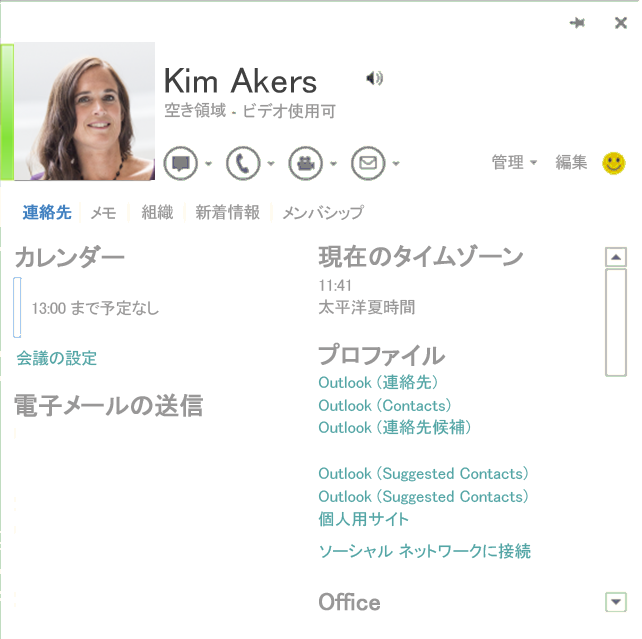

# <a name="integrating-im-applications-with-office"></a>IM アプリケーションと Office の統合

この記事では、プレゼンスの表示や連絡先カードからのインスタント メッセージの送信など、Office 2013 のソーシャル機能と統合するように、インスタント メッセージ (IM) クライアント アプリケーションを構成する方法について説明します。
  
この技術文書やここで説明されるプロセスについて質問やコメントがある場合、[docthis@microsoft.com](mailto:docthis@microsoft.com) にメールを送信するによって直接 Microsoft に連絡することができます。
  
## <a name="introduction"></a>概要
<a name="off15_IMIntegration_Intro"> </a>

Office 2013 は、Lync 2013 などの IM クライアント アプリケーションとの多機能な統合を提供します。この統合は、ユーザーに、Word 2013、Excel 2013、PowerPoint 2013、Outlook 2013、Visio 2013、Project 2013、および OneNote 2013 内からの IM 機能を提供し、さらに SharePoint 2013 ページでのプレゼンス統合を提供します。連絡先リストに含まれる個人について、写真、名前、プレゼンス ステータス、連絡先データを表示できます。IM セッション、ビデオ通話、電話通話を連絡先カード (連絡先情報や通信オプションを示す Office 2013 内の UI 要素) から直接開始することができます。Office 2013 により、メールやドキュメントの外に出ることなく連絡先と接続された状態を保つことが容易になります。 
  
> [!NOTE]
> この記事では、コンピューターにインストールされた IM サービスと通信するアプリケーションを特に表すために、 IM クライアント アプリケーションという用語を使用します。たとえば、Lync 2013 は IM クライアント アプリケーションとみなされます。この記事では、IM クライアント アプリケーションが IM サービスと通信する方法や、IM サービス自体については詳しく説明しません。 
  
Office と通信できるように、IM のクライアント アプリケーションをカスタマイズすることができます。具体的には、Office UI 内に次の情報が表示されるように、IM のアプリケーションを変更できます。
  
- 連絡先の写真。
    
- 連絡先の名前。
    
- 連絡先の個人ステータスに関する注記。
    
- 連絡先のプレゼンス ステータス。
    
- 連絡先の連絡可能性を示す文字列 (たとえば「連絡可能」や「退席中」など)。
    
- 連絡先の機能を示す文字列 (たとえば、「ビデオ準備完了」など)。
    
- IM のワンクリック起動。
    
- ビデオ通話のワンクリック起動。
    
- 電話通話のワンクリック起動 (SIP、電話番号、ボイス メール、新規番号の呼び出しを含む)。
    
- 連絡先の管理 (IM グループに追加)。
    
- 連絡先の場所とタイム ゾーン。
    
- 連絡先データ、電話番号、電子メール アドレス、役職、および会社名。
    
**図 1. Office 2013 での連絡先カード**


  
Office とのこの統合を有効にするために、IM のクライアント アプリケーションは、Office に接続するために提供されている一連のインターフェイスを実装する必要があります。この統合の API は、Lync / Skype for Business を含むバージョンの Office 2013 と共にインストールされる Microsoft.Office.UC.dll ファイル内にある [UCCollborationLib](http://msdn.microsoft.com/en-au/library/uccollaborationlib.aspx) 名前空間に含まれています。 **UCCollaborationLib** 名前空間には、Office と統合するために実装する必要のあるインターフェイスが含まれています。 
  
> [!IMPORTANT] 
> Lync 2013/Skype for Business には、必要なインターフェイスのタイプ ライブラリが埋め込まれています。 サード パーティ インテグレーターの場合、これは Lync 2013 と Skype for Business の両方が対象コンピューターにインストールされている場合にのみ動作します。 Office 標準を使用して統合している場合は、タイプ ライブラリを抽出して、対象コンピューターにインストールする必要があります。 [Lync 2013 SDK](https://www.microsoft.com/en-us/download/details.aspx?id=36824) には、Microsoft.Office.UC.dll ファイルが含まれています。 
  
> [!NOTE]
>  少数の Office 2010 アプリケーションは、同様に、次のサード パーティ IM プロバイダーのアプリケーションと統合できます: Outlook 2010、Word 2010、Excel 2010、PowerPoint 2010、および SharePoint Server 2010 (ActiveX コントロールを使用)。 Office 2013 との統合に必要な手順の多くは、Office 2010 にも同様に適用されます。 Office 2010 が IM プロバイダー アプリケーションと統合する方法には、いくつかの重要な相違があります。 
>  - Office 2010 には、連絡先の写真が表示されません。 
>  - Microsoft.Office.Uc.dll ファイルは、Office 2010 とは別にダウンロードする必要があります。 [Lync 2010 SDK](http://www.microsoft.com/en-us/download/details.aspx?id=18898) には、Office 2010 のための Microsoft.Office.UC.dll ファイルが含まれています。 
>  - Office アプリケーションが IM クライアント アプリケーションで [IUCOfficeIntegration.GetAuthenticationInfo](integrating-im-applications-with-office.md#off15_IMIntegration_ImplementRequired_IUCOfficeIntegration) メソッドを呼び出すときには、文字列「14.0.0.0」が渡されます。 
>  - Office 2010 は、IM クライアント アプリケーションに接続した直後に、すべてのグループと連絡先を列挙します。 
  
## <a name="how-office-integrates-with-an-im-client-application"></a>IM クライアント アプリケーションとの Office の統合方法
<a name="off15_IMIntegration_How"> </a>

Office 2013 アプリケーションは、起動するときに、以下のプロセスによって既定の IM クライアント アプリケーションと統合します。
  
1. レジストリをチェックして既定の IM クライアント アプリケーションを検出し、それに接続します。
    
2. IM クライアント アプリケーションでの認証を行います。
    
3. IM クライアント アプリケーションで公開されている特定のインターフェイスに接続します。
    
4. 現在サインインしているユーザー (ローカル ユーザー) の能力を判別します。これには、ユーザーの連絡先の取得、ユーザーのプレゼンスの判別、ユーザーの IM の能力 (インスタント メッセージング、ビデオ チャット、VOIP、その他) の判別などが含まれます。
    
5. ローカル ユーザーの連絡先のプレゼンス情報を取得します。
    
6. IM クライアント アプリケーションが終了するとき、Office 2013 アプリケーションは警告なしに切断します。
    
### <a name="discovering-the-im-application"></a>IM アプリケーションの検出

Office アプリケーションは、レジストリ内でいくつかの特定のキーとエントリを検索して、既定の IM クライアント アプリケーションを検出します。既定の IM クライアント アプリケーションが見つかった場合、それに接続しようとします。
  
Office アプリケーションが、既定の IM のクライアント アプリケーションを検出するためのプロセスは、次のとおりです。
  
1. Office アプリケーションは、レジストリで HKEY_CURRENT_USER\Software\IM Providers\DefaultIMApp サブキーが設定されているかを確認し、そこにリストされているアプリケーション名を読み取ります。
    
2. その後、Office アプリケーションは HKEY_CURRENT_USER\Software\IM Providers\ _アプリケーション名_\UpAndRunning を読み取り、 その値の変更を監視します。
    
3. 次に Office アプリケーションは HKEY_LOCAL_MACHINE\Software\IM Providers\ _アプリケーション名_ レジストリ キーを読み取り、そこに格納されている ProcessName およびクラス ID (CLSID) の値を取得します。 
    
4. IM クライアント アプリケーションは、その開始シーケンスを正常に完了し、すべてのクラスをプレゼンス統合のために正しく登録した後に、HKEY_CURRENT_USER\Software\IM Providers\ _アプリケーション名_\UpAndRunning キーを「2」に設定して、クライアント アプリケーションが実行中であることを示します。
    
5. Office アプリケーションは、HKEY_CURRENT_USER\Software\IM Providers\ _アプリケーション名_\UpAndRunning キーが「2」に設定されていることを検出すると、コンピューターで実行されるプロセスの一覧を調べて IM クライアント アプリケーションのプロセス名を見つけます。
    
6. Office アプリケーションが IM クライアント アプリケーションの使用するプロセスを検出すると、Office アプリケーションは CLSID を使用して **CoCreateInstance** を呼び出し、プロセス外 COM サーバーとして IM クライアント アプリケーションへの接続を確立します。 
    
### <a name="authenticating-the-connection-to-the-im-application"></a>IM アプリケーションへの接続の認証

Office アプリケーションは、IM クライアント アプリケーションへの接続を確立した後に、以下を行います。
  
1. Office アプリケーションは、[IUnknown::QueryInterface](http://msdn.microsoft.com/ja-JP/library/ms682521%28v=VS.85%29.aspx) メソッドを呼び出して、 [IUCOfficeIntegration](integrating-im-applications-with-office.md#off15_IMIntegration_ImplementRequired_IUCOfficeIntegration) インターフェースを検索します。 
    
2. その後、Office アプリケーションは **IUCOfficeIntegration.GetAuthenticationInfo** メソッドを呼び出して、サポートされる最高の統合バージョン (たとえば、「15.0.0.0」) を渡します。 
    
3. パラメーターとして渡された Office のバージョンを IM クライアント アプリケーションがサポートしている場合、アプリケーションは、以下のハード コーディングされた XML 文字列を呼び出し元のコードに返します。
    
    `<authenticationinfo>`
    
   > [!NOTE]
   > 従来のものにも対応できるように、IM クライアント アプリケーションは、パラメーターとして渡された Office のバージョンをサポートしている場合、正確な値の  `<authenticationinfo>` を **GetAuthenticationInfo** への呼び出しに戻す必要があります。 
  
4. IM クライアント アプリケーションが値を返すことに失敗した場合、Office アプリケーションは、サポートされる次に高位の Office のバージョン (たとえば、「14.0.0.0」) を指定して **GetAuthenticationInfo** メソッドを再び呼び出します。 
    
5. Office は、IM クライアント アプリケーションが IM とプレゼンス統合をサポートすると判断した後、必要なセットのインターフェイスに接続して初期化を完了します。(詳細については、[必要なインターフェイスへの接続](#off15_IMIntegration_HowConnect)を参照してください。
    
Office アプリケーションは、上記の手順のいずれかでエラーを検出するとバックアウトして、その Office アプリケーションのセッション中にはプレゼンス統合が再実行されません。 
  
### <a name="connecting-to-required-interfaces"></a>必要なインターフェイスへの接続
<a name="off15_IMIntegration_HowConnect"> </a>

IM クライアント アプリケーションへの接続を認証した後、Office アプリケーションは、IM クライアント アプリケーションが公開する必要のある必要なインターフェイスのセットに接続しようとします。Office アプリケーションは、以下を行ってこれを実行します。
  
- Office アプリケーションは、 [IUCOfficeIntegration.GetInterface](integrating-im-applications-with-office.md#off15_IMIntegration_ImplementRequired_ILyncClient) メソッドを呼び出し、 **oiInterfaceLyncClient** 定数を **UCCollaborationLib.OIInterface** 列挙から渡して、 [ILyncClient](http://msdn.microsoft.com/library/UCCollaborationLib.OIInterface) オブジェクトを取得します。 
    
- Office アプリケーションは、 [IUCOfficeIntegration.GetInterface](integrating-im-applications-with-office.md#off15_IMIntegration_ImplementRequired_IAutomation) メソッドを呼び出し、 **oiInterfaceAutomation** 定数を **OIInterface** 列挙から渡して、 **IAutomation** オブジェクトを取得します。 
    
- Office アプリケーションは、[_ILyncClientEvents](integrating-im-applications-with-office.md#off15_IMIntegration_ImplementRequired_ILyncClient) イベント リスナーをセットアップします。 
    
- Office アプリケーションは、[_IUCOfficeIntegrationEvents](integrating-im-applications-with-office.md#off15_IMIntegration_ImplementRequired_IUCOfficeIntegration) イベント リスナーをセットアップします。 
    
- Office アプリケーションは、 **ILyncClient.State** プロパティにアクセスして、IM クライアント アプリケーションからサイン イン状態を取得します。 
    
- Office アプリケーションは、**UCCollaborationLib.OIFeature** 列挙からフラグを戻す [IUCOfficeIntegration.GetSupportedFeatures](http://msdn.microsoft.com/library/UCCollaborationLib.OIFeature) メソッドを呼び出すことにより、IM クライアント アプリケーションの機能を取得します。 
    
- Office アプリケーションは、 **ILyncClient.Self** プロパティにアクセスして、 [ISelf](integrating-im-applications-with-office.md#off15_IMIntegration_ImplementRequired_ISelf) オブジェクトへの参照を取得します。 
    
### <a name="retrieving-the-capabilities-of-the-local-user"></a>ローカル ユーザーの能力を取得する
<a name="off15_IMIntegration_HowConnect"> </a>

Office アプリケーションは、次の手順に従ってローカル ユーザーの能力を取得します。
  
1. IM クライアント アプリケーションが **IClient2** インターフェイスをサポートしている場合、Office は [IClient2.PrivateContactManager](integrating-im-applications-with-office.md#off15_IMIntegration_ImplementRequired_IContactManager) プロパティにアクセスして、 **IContactManager** オブジェクトを取得しようとします。 
    
2. IM アプリケーションが **IClient2** インターフェイスをサポートしていない場合、Office アプリケーションは **ILyncClient.ContactManager** プロパティにアクセスして、 **IContactManager** オブジェクトを取得します。IM クライアント アプリケーションは、他のいずれかの IM 機能を確立する前に、 **IContactManager** オブジェクトを正常に返す必要があります。 
    
3. Office アプリケーションは、 **ILyncClient.Uri** プロパティにアクセスしてから、 **IContactManager.GetContactByUri** を呼び出して、ローカル ユーザーに関連付けられている [IContact](integrating-im-applications-with-office.md#off15_IMIntegration_ImplementRequired_IContact) オブジェクトを取得します。 
    
4. その後、Office アプリケーションは複数の呼び出しを **IContact.CanStart** に対して実行してローカル ユーザーの能力を確立し、 **ModalityTypes.ucModalityInstantMessage** と **ModalityTypes.ucModalityAudioVideo** の値を順次渡します。 
    
### <a name="retrieving-contact-presence"></a>連絡先プレゼンスの取得
<a name="off15_IMIntegration_HowConnect"> </a>

Office アプリケーションは、以下を行うことにより、ローカル ユーザーを含む連絡先プレゼンスを取得します。 
  
1. Office アプリケーションは、 **IContact.GetContactInformation** を呼び出して、連絡先からプレゼンス アイテムを取得します。 
    
2. その後、Office アプリケーションは、連絡先からのプレゼンス ステータスの変化をサブスクライブします。これは **IContactManager.CreateSubscription** を呼び出して、 [IContactSubscription](integrating-im-applications-with-office.md#off15_IMIntegration_ImplementRequired_IContactSubscription) オブジェクトを取得します、その後、 **IContactSubscription.AddContact** を呼び出して連絡先をサブスクリプションに追加してから、 **IContactSubscription.Subscribe** を呼び出して連絡先のステータスの変更を取得します。 
    
3. IM アプリケーションが **IContact2** をサポートしている場合、Office は **IContact2.BatchGetContactInformation2** を呼び出してプレゼンス情報を取得しようとします。
    
4. その後、Office アプリケーションは、 **IContact.BatchGetContactInformation** を呼び出して連絡先のプレゼンス プロパティを取得します。Office アプリケーションは、 **IContact.Settings** プロパティにアクセスして、プレゼンス プロパティの 2 つ目のセットを取得できます。 
    
5. 最後に、Office アプリケーションは **IContact.CustomGroups** プロパティにアクセスして、連絡先のグループ メンバーシップを取得します。これにより、連絡先の属するすべての [IGroup](integrating-im-applications-with-office.md#off15_IMIntegration_ImplementRequired_IGroup) オブジェクトを含む、 [IGroupCollection](integrating-im-applications-with-office.md#off15_IMIntegration_ImplementRequired_IGroup) コレクションが返されます。 
    
### <a name="disconnecting-from-the-im-application"></a>IM アプリケーションから切断する
<a name="off15_IMIntegration_HowConnect"> </a>

Office 2013 アプリケーションは、IM アプリケーションからの **OnShuttingDown** イベントを検出すると、警告なしで切断します。ただし、IM アプリケーションよりも前に Office アプリケーションがシャット ダウンする場合、Office アプリケーションは接続がクリーンアップされることを保証しません。IM アプリケーションは、クライアント接続リークを処理する必要があります。 
  
## <a name="setting-registry-keys-and-entries"></a>レジストリ キーとエントリを設定する
<a name="off15_IMIntegration_SetRegistry"> </a>

前述のとおり、IM 対応の Office 2013 アプリケーションは、レジストリ内で特定のキー、エントリ、および値を検索して、接続する IM クライアント アプリケーションを検出します。これらのレジストリ値は、Office アプリケーションに、IM クライアント アプリケーションのオブジェクト モデルへのエントリ ポイントとして機能するクラスのプロセス名と CLSID を提供します (つまり、 **IUCOfficeIntegration** インターフェイスを実装するクラス)。Office アプリケーションは、そのクラスを共同作成して、IM クライアント アプリケーションのプロセス外 COM サーバーに対するクライアントとして接続します。 
  
表 1 を使用して、IM クライアント アプリケーションを Office と統合するためにレジストリに書き込む必要のあるキー、エントリ、および値を識別します。
  
**表 1. 既定の IM クライアント アプリケーションを設定するレジストリ キー**

|**キー**|**エントリ**|**型**|**値**|**例**|
|:-----|:-----|:-----|:-----|:-----|
|HKEY_LOCAL_MACHINE\Software\IM Providers\\<アプリケーション名\>  <br/> |FriendlyName  <br/> |REG_SZ  <br/> |サード パーティ製の IM クライアント アプリケーションの名前。  <br/> |Litware IM 2012  <br/> |
||ProcessName  <br/> |REG_SZ  <br/> |サード パーティ製の IM クライアント アプリケーションのプロセス名。  <br/> |litware.exe  <br/> |
||GUID  <br/> |REG_SZ  <br/> |ルートのクラス ID (CLSID)、 IM アプリケーションでの共同作成可能なクラス ( **IUCOfficeIntegration** インターフェイスを実装するクラス)。  <br/> |(A GUID)  <br/> |
|HKEY_CURRENT_USER\Software\IM Providers  <br/> |DefaultIMApp  <br/> |REG_SZ  <br/> |IM クライアント アプリケーションの名前。これは、HKEY_LOCAL_MACHINE の最上位レベルのレジストリ キー (ハイブ) と同じ名前でなければなりません。  <br/> |Litware  <br/> |
|HKEY_CURRENT_USER\Software\IM Providers\\<アプリケーション名\>  <br/> |UpAndRunning  <br/> |REG_DWORD  <br/> | 0 ～ 2 の整数値。  <br/>  0—実行していない  <br/>  1—開始中  <br/>  2—実行中  <br/> <br/>**メモ**: アプリケーション名のレジストリ キーは、DefaultIMApp エントリの値と同一の必要があります。           ||
   
## <a name="implementing-the-required-interfaces-for-integration-with-office"></a>Office との統合のために必要なインターフェイスを実装する
<a name="off15_IMIntegration_ImplementRequired"> </a>

**UCCollaborationLib** 名前空間には、Office と統合するために IM クライアント アプリケーションの実行可能ファイル (または COM サーバー) が実装する必要のある 3 つのインターフェイスがあります。これらのインターフェイスが実装されていない場合、Office アプリケーションは初期化プロセス中にバックアウトして、IM クライアント アプリケーションとの接続が確立されていません。 
  
必要なインターフェイスは、次のとおりです。
  
- [IUCOfficeIntegration](integrating-im-applications-with-office.md#off15_IMIntegration_ImplementRequired_IUCOfficeIntegration)必須ではありませんが、 **_IUCOfficeIntegrationEvents** インターフェイスも同じ派生クラス内に実装される必要があります。 
    
- [ILyncClient](integrating-im-applications-with-office.md#off15_IMIntegration_ImplementRequired_ILyncClient)必須ではありませんが、 **_ILyncClientEvents** インターフェイスも同じ派生クラス内に実装される必要があります。 
    
- [IAutomation](integrating-im-applications-with-office.md#off15_IMIntegration_ImplementRequired_IAutomation)
    
### <a name="iucofficeintegration-interface"></a>IUCOfficeIntegration インターフェイス
<a name="off15_IMIntegration_ImplementRequired_IUCOfficeIntegration"> </a>

**IUCOfficeIntegration** インターフェイスは、Office アプリケーションが IM クライアント アプリケーションと接続するためのエントリ ポイントを提供します。このインターフェイスは、IM クライアント アプリケーションとの接続を開始するプロセスの一部として Office アプリケーションが呼び出す 3 つのメソッドを定義します。 **IUCOfficeIntegration** インターフェイスを実装するクラスは、Office がそのインスタンスを共同作成できるように、共同作成可能でなければなりません。さらに、HKEY_LOCAL_MACHINE\Software\IM Providers\  _アプリケーション名_ レジストリ キーで、GUID エントリの値として入力された CLSID を公開する必要もあります。 
  
**IUCOfficeIntegration** から継承するクラスも **_IUCOfficeIntegrationEvents** インターフェイスを実装する必要があります。 **_IUCOfficeIntegrationEvents** インターフェイスには、 **IUCOfficeIntegration** インターフェイスのイベント ハンドラーを公開するメンバーが含まれています。 
  
表 2 は、 **IUCOfficeIntegration** と **_IUCOfficeIntegration** から継承するクラスに実装されている必要のあるメンバーを示しています。
  
> [!NOTE]
> **IUCOfficeIntegration** と **_IUCOfficeIntegrationEvents** インターフェイス、およびそのメンバーについて詳しくは、 [UCCollaborationLib.IUCOfficeIntegration](http://msdn.microsoft.com/library/UCCollaborationLib.IUCOfficeIntegration) と [UCCollaborationLib._IUCOfficeIntegrationEvents](http://msdn.microsoft.com/library/UCCollaborationLib._IUCOfficeIntegrationEvents) を参照してください。 
  
**表 2. IUCOfficeIntegration と _IUCOfficeIntegrationEvents インターフェイスの実装**

|**インターフェイス**|**メンバー**|**説明**|
|:-----|:-----|:-----|
|**IUCOfficeIntegration** <br/> |**GetAuthenticationInfo** メソッド  <br/> |認証情報の文字列を取得します。  <br/> |
||**GetInterface** メソッド  <br/> |特定のバージョンのインターフェイスを取得します。  <br/> |
||**GetSupportedFeatures** メソッド  <br/> |サポートされている Office の統合機能を取得します。  <br/> |
|**_IUCOfficeIntegrationEvents** <br/> |**OnShuttingDown** イベント  <br/> |IM クライアント アプリケーションがシャットダウンしようとするときに発生するイベント。  <br/> |
   
次のコードを使用して、IM クライアント アプリケーション内の **IUCOfficeIntegration** と **_IUCOfficeIntegration** インターフェイスから継承するクラスを定義します。 
  
```cs
// An example of a class that can be co-created and can integrate
// with Office as an IM provider.
[ClassInterface(ClassInterfaceType.None)]
[ComSourceInterfaces(typeof(_IUCOfficeIntegrationEvents))]
[Guid("{CLSID value}"), ComVisible(true)]
public class LitwareClientAppObject : IUCOfficeIntegration
{
    // Implementation details omitted.
}

```

**GetAuthenticationInfo** メソッドは、文字列を  _version_ パラメーターの引数として取得します。 Office アプリケーションは、このメソッドを呼び出すと、Office のバージョンに応じて引数の 2 つの文字列のいずれかで渡します。 Office アプリケーションがメソッドに IM クライアント アプリケーションでサポートされる (つまり機能がサポートされる) Office のバージョンを提供すると、**GetAuthenticationInfo** メソッドは、ハード コーディングされた XML 文字列 「`<authenticationinfo>`」を返します。 
  
次のコードを使用して、IM クライアント アプリケーションのコード内で **GetAuthentication** メソッドを実装します。 
  
```cs
public string GetAuthenticationInfo(string _version)
{
    // Define the version of Office that the IM client application supports.
    string supportedOfficeVersion = "15.0.0.0";
    // Do a simple check for equivalency.
    if (supportedOfficeVersion == _version)
    {
        // If the version of Office is supported, this method must 
        // return the string literal "<authenticationinfo>" exactly.
        return "<authenticationinfo>";
    }
    else
    {
        return null;
    }
}

```

**GetInterface** メソッドは、  _interface_ パラメーターの引数として渡された内容に応じて、クラスへの参照を呼び出し元コードにシャトルします。Office アプリケーションは、 **GetInterface** メソッドを呼び出すと、インターフェイス パラメーター用に 2 つの値のいずれか、つまり **UCCollaborationLib.OIInterface** 列挙の **oiInterfaceILyncClient** 定数 (1) または [oiInterfaceIAutomation](http://msdn.microsoft.com/library/UCCollaborationLib.OIInterface) 定数 (2) を渡します。Office アプリケーションが **oiInterfaceILyncClient** 定数を渡すと、 **GetInterface** メソッドは **ILyncClient** インターフェースを実装するクラスへの参照を返します。Office アプリケーションが **oiInterfaceIAutomation** 定数を渡すと、 **GetInterface** メソッドは **IAutomation** インターフェースを実装するクラスを返します。 
  
次のコード例を使用して、IM クライアント アプリケーションのコード内で **GetInterface** メソッドを実装します。 
  
```cs
public object GetInterface(string _version, OIInterface _interface)
{
    // These objects implement the ILyncClient or IAutomation 
    // interfaces respectively. There is no restriction on what these
    // classes are named.
    IMClient imClient = new IMClient();
    IMClientAutomation imAutomation = new IMClientAutomation();
    // Return different object references depending on the value passed in
    // for the _interface parameter.
    switch (_interface)
    {
        // The calling code is asking for an object that inherits
        // from ILyncClient, so it returns such an object.
        case OIInterface.oiInterfaceILyncClient:
        {
            return imClient;
        }
        // The calling code is asking for an object that inherits
        // from IAutomation, so it returns such an object.
        case OIInterface.oiInterfaceIAutomation:
        {
            return imAutomation;
        }
        default:
        {
            throw new NotImplementedException();
        }
    }
}

```

**GetSupportedFeatures**メソッドは、IM クライアント アプリケーションによってサポートされる IM 機能に関する情報を返します。その唯一のパラメーター  _version_ は、文字列を取ります。Office アプリケーションが **GetSupportFeatures**メソッドを呼び出すと、メソッドは [UCCollaborationLib.OIFeature ](http://msdn.microsoft.com/library/UCCollaborationLib.OIFeature)列挙からの値を返します。返される値は IM のクライアントの機能を示し、値にフラグを追加することによって、IM クライアント アプリケーションの各機能が Office アプリケーションに対して指定されます。 
  
> [!NOTE]
>  Office 2013 アプリケーションは、**OIFeature** 列挙の以下の定数を無視します。 
> - **oiFeaturePictures** (2) 
> - **oiFeatureFreeBusyIntegration**
> - **oiFeaturePhoneNormalization**
  
次のコード例を使用して、IM クライアント アプリケーションのコード内で **GetSupportFeatures** メソッドを実装します。 
  
```cs
public OIFeature GetSupportedFeatures(string _version)
{
    OIFeature supportedFeature1 = OIFeature.oiFeatureQuickContacts;
    OIFeature supportedFeature2 = OIFeature.oiFeatureFastSearch;
    return (supportedFeature1 | supportedFeature2);
}

```

### <a name="ilyncclient-interface"></a>ILyncClient インターフェイス
<a name="off15_IMIntegration_ImplementRequired_ILyncClient"> </a>

**ILyncClient** インターフェイスは、IM クライアント アプリケーション自体の機能に対応しています。これは、アプリケーションにサインインしたユーザー ( [UCCollaborationLib.ISelf ](http://msdn.microsoft.com/library/UCCollaborationLib.ISelf)インターフェイスによって表されるローカル ユーザー)、アプリケーションの状態、ローカル ユーザーの連絡先の一覧、および他のいくつかの設定を参照するプロパティを公開します。IM のクライアント アプリケーションに接続しようとするとき、Office アプリケーションは **ILyncClient** インターフェイスを実装するオブジェクトへの参照を取得します。その参照から、Office は IM クライアント アプリケーションの機能の多くにアクセスできます。 
  
さらに、 **ILyncClient** インターフェイスを実装するクラスは、 **_ILyncClientEvents** インターフェイスも実装する必要があります。 **_ILyncClientEvents** インターフェイスは、IM クライアント アプリケーションの状態を監視するために必要ないくつかのイベントを公開します。 
  
表 3 は、**ILyncClient** と **_ILyncClientEvents** から継承するクラスに実装されている必要のあるメンバーを示しています。
  
> [!NOTE]
> 表に記載されていない **ILyncClient** または **\_ILyncClientEvents** インターフェイスのメンバーは、存在している必要がありますが、実装されている必要はありません。 存在していても実装されていないメンバーは、**NotImplementedException** または **E\_NOTIMPL** エラーをスローすることがあります。 
> 
> **ILyncClient** と **_ILyncClientEvents** インターフェイス、およびそのメンバーの詳細については、「[UCCollaborationLib.ILyncClient](http://msdn.microsoft.com/library/UCCollaborationLib.ILyncClient)」および「[UCCollaborationLib._ILyncClientEvents](http://msdn.microsoft.com/library/UCCollaborationLib._ILyncClientEvents)」を参照してください。 
  
**表 3. ILyncClient と ILyncClientEvents インターフェイスの実装**

|**インターフェイス**|**メンバー**|**説明**|
|:-----|:-----|:-----|
|**ILyncClient** <br/> |**ContactManager** プロパティ  <br/> |連絡先グループ マネージャーを取得します。  <br/> |
||**ConversationManager** プロパティ  <br/> |会話マネージャーを取得します。  <br/> |
||**Self** プロパティ  <br/> |**Self** オブジェクトを取得します。  <br/> |
||**SignIn** メソッド  <br/> |特定の可用性を持つ IM クライアント アプリケーションのサインイン プロセスを開始します。  <br/> |
||**State** プロパティ  <br/> |現在のプラットフォーム状態を取得します。  <br/> |
||**Uri** プロパティ  <br/> |IM クライアント アプリケーションの URI を取得します。  <br/> |
|**_ILyncClientEvents** <br/> |**OnStateChanged** イベント  <br/> |IM クライアント アプリケーションの状態が変化したときに発生します。このイベントを処理し、 **eventData.NewState** プロパティを取得する必要があります。アプリケーション内のいずれかのサブシステムで状態の変更が生じたとき、IM クライアント アプリケーションのインスタンスにバインドされているすべてのプロセスに対して、イベントが発生します。  <br/> |
   
初期化の処理中に、Office は **ILyncClient.State** プロパティにアクセスします。このプロパティは、 [UCCollaborationLib.ClientState](http://msdn.microsoft.com/library/UCCollaborationLib.ClientState) 列挙からの値を返す必要があります。 
  
```cs
private ClientState _clientState;
public ClientState State
{
    get
    {
        return this._clientState;
    }
}

```

**State** プロパティは、IM クライアント アプリケーションの現在の状態を保管します。これは、IM アプリケーションのセッション全体で設定され、更新されている必要があります。IM クライアント アプリケーションは、サインイン、サインアウト、またはシャット ダウンするときに、 **State** プロパティを設定する必要があります。次の例で示すように、このプロパティは **ILyncClient.SignIn** と **ILyncClient.SignOut** メソッド内に設定することが最善です。 
  
```cs
// This field is of a type that implements the 
// IAsynchronousOperation interface.
private IMClientAsyncOperation _asyncOperation = new IMClientAsyncOperation();
// This field is of a type that implements the ISelf interface.
private IMClientSelf _self;
public IMClientAsyncOperation SignIn(string _userUri, string _domainAndUser, 
    string _password, object _IMClientCallback, object _state)
{
    ClientState _previousClientState = this._clientState;
    this._clientState = ClientState.ucClientStateSignedIn;
    // The IMClientStateChangedEventData class implements the 
    // IClientStateChangedEventData interface.
    IMClientStateChangedEventData eventData = 
        new IMClientStateChangedEventData(_previousClientState, 
        this._clientState);
    if (_userUri != null)
    {
        // During the sign-in process, create a new contact with
        // the contact information of the currently signed-in user.
        this._self = new IMClientSelf(IMContact.BuildContact(_userUri));
    }
    // Raise the _ILyncClientEvents.OnStateChanged event.
    OnStateChanged(this, eventData as UC.ClientStateChangedEventData);
    
    return this._asyncOperation;
    }
}

```

次のコード例は、_ **ILyncClientEvents** インターフェイスと _ **IUCOfficeIntegrationEvents** インターフェイスを使用してイベント リスナーをセットアップする方法を示します。 
  
```cs
using Microsoft.Office.Uc;
using System;
using System.Runtime.CompilerServices;
using System.Runtime.InteropServices;
namespace SampleImplementation
{
    // Note: UCOfficeIntegration inherits from both IUCOfficeIntegration and _IUCOfficeIntegrationEvents_Event
    [ClassInterface(ClassInterfaceType.None), Guid("13c41ef9-eb90-4e94-8a7c-1e9d686bc019"), ComVisible(true)]
    [ComSourceInterfaces(typeof(_IUCOfficeIntegrationEvents))]
    public class MyInstantMessengerOfficeIntegration : UCOfficeIntegration
    {
        #region IUCOfficeIntegration implementation
        public string GetAuthenticationInfo(string _version)
        {
            return "";
        }
        public object GetInterface(string _version, OIInterface _interface)
        {
            return null;
        }
        public OIFeature GetSupportedFeatures(string _version)
        {
            return OIFeature.oiFeatureAddOneNoteToConversation;
        }
        #endregion
        #region _IUCOfficeIntegrationEvents support
        // This event implements void _IUCOfficeIntegrationEvents.OnShuttingDown();
        public event _IUCOfficeIntegrationEvents_OnShuttingDownEventHandler OnShuttingDown;
        // This method is called by the IM application when it is beginning to shut down.
        // The method will raise the OnShuttingDown event which is translated by .NET COM interop layer
        // into a call to _IUCOfficeIntegrationEvents.OnShuttingDown.
        // This notifies Office applications that the IM application is going away.
        internal void RaiseOnShuttingDownEvent()
        {
            if (this.OnShuttingDown != null)
            {
                this.OnShuttingDown();
            }
        }
        #endregion
    }
    // Note: LyncClient inherits from both ILyncClient and _ILyncClientEvents_Event
    // You must implement LyncClient because the event handlers in _ILyncClientEvents expect you to pass a LyncClient interface.
    [ComVisible(true)]
    [ComSourceInterfaces(typeof(_ILyncClientEvents))]
    public class MyInstantMessengerOfficeIntegration2 :
        Client,
        Client2,
        LyncClient
    {
        #region Interfaces
        public LyncClientCapabilityTypes Capabilities
        {
            get
            {
                throw new NotImplementedException();
            }
        }
        public ConferenceScheduler ConferenceScheduler
        {
            get
            {
                throw new NotImplementedException();
            }
        }
        public ContactManager ContactManager
        {
            get
            {
                throw new NotImplementedException();
            }
        }
        public ConversationManager ConversationManager
        {
            get
            {
                throw new NotImplementedException();
            }
        }
        public DelegatorClient[] DelegatorClients
        {
            get
            {
                throw new NotImplementedException();
            }
        }
        public DeviceManager DeviceManager
        {
            get
            {
                throw new NotImplementedException();
            }
        }
        public bool InSuppressedMode
        {
            get
            {
                throw new NotImplementedException();
            }
        }
        public ContactManager PrivateContactManager
        {
            get
            {
                throw new NotImplementedException();
            }
        }
        public RoomManager RoomManager
        {
            get
            {
                throw new NotImplementedException();
            }
        }
        public Self Self
        {
            get
            {
                throw new NotImplementedException();
            }
        }
        public ClientSettings Settings
        {
            get
            {
                throw new NotImplementedException();
            }
        }
        public SignInConfiguration SignInConfiguration
        {
            get
            {
                throw new NotImplementedException();
            }
        }
        public ClientState State
        {
            get
            {
                throw new NotImplementedException();
            }
        }
        public ClientType Type
        {
            get
            {
                throw new NotImplementedException();
            }
        }
        public string Uri
        {
            get
            {
                throw new NotImplementedException();
            }
        }
        public Utilities Utilities
        {
            get
            {
                throw new NotImplementedException();
            }
        }
        public ApplicationRegistration CreateApplicationRegistration(string _appGuid, string _appName)
        {
            throw new NotImplementedException();
        }
        public AsynchronousOperation Initialize(string _clientName, string _version = "0", string _clientShortName = "0", string _clientNameAbbreviation = "0", string _clientLongName = "0", SupportedFeatures _supportedFeatures = SupportedFeatures.ucAllFeatures, [IUnknownConstant] object _CommunicatorClientCallback = null, object _state = null)
        {
            throw new NotImplementedException();
        }
        public AsynchronousOperation Shutdown([IUnknownConstant] object _CommunicatorClientCallback, object _state)
        {
            throw new NotImplementedException();
        }
        public AsynchronousOperation SignIn(string _userUri = "0", string _domainAndUsername = "0", string _password = "0", [IUnknownConstant] object _CommunicatorClientCallback = null, object _state = null)
        {
            throw new NotImplementedException();
        }
        public AsynchronousOperation SignOut([IUnknownConstant] object _CommunicatorClientCallback, object _state)
        {
            throw new NotImplementedException();
        }
        #endregion
        #region _ILyncClientEvents support
        public event _ILyncClientEvents_OnStateChangedEventHandler OnStateChanged;
        public event _ILyncClientEvents_OnNotificationReceivedEventHandler OnNotificationReceived;
        public event _ILyncClientEvents_OnCredentialRequestedEventHandler OnCredentialRequested;
        public event _ILyncClientEvents_OnSignInDelayedEventHandler OnSignInDelayed;
        public event _ILyncClientEvents_OnCapabilitiesChangedEventHandler OnCapabilitiesChanged;
        public event _ILyncClientEvents_OnDelegatorClientAddedEventHandler OnDelegatorClientAdded;
        public event _ILyncClientEvents_OnDelegatorClientRemovedEventHandler OnDelegatorClientRemoved;
        // Notifies Office apps that the IM client state (signed out, signing in, singed in, signing out, etc) has changed.
        internal void RaiseOnStateChangedEvent(ClientStateChangedEventData eventData)
        {
            if (this.OnStateChanged != null)
            {
                this.OnStateChanged(this, eventData);
            }
        }
        // Notifies Office apps that the IM client has received a notification event from MAPI (e.g. autodiscover has finished)
        internal void RaiseOnNotificationReceivedEvent(LyncClientNotificationReceivedEventData eventData)
        {
            if (this.OnNotificationReceived != null)
            {
                this.OnNotificationReceived(this, eventData);
            }
        }
        // Notifies Office apps that the IM client has received a request for credentials for some operation (e.g. sign in, web search)
        internal void RaiseOnCredentialRequestedEvent(CredentialRequestedEventData eventData)
        {
            if (this.OnCredentialRequested != null)
            {
                this.OnCredentialRequested(this, eventData);
            }
        }
        // Notifies Office apps that the IM client has been delayed from signing in and gives an estimated delay time.
        internal void RaiseOnSignInDelayedEvent(SignInDelayedEventData eventData)
        {
            if (this.OnSignInDelayed != null)
            {
                this.OnSignInDelayed(this, eventData);
            }
        }
        // Notifies Office apps that the capabilities of this IM client have changed.
        internal void RaiseOnCapabilitiesChangedEvent(PreferredCapabilitiesChangedEventData eventData)
        {
            if (this.OnCapabilitiesChanged != null)
            {
                this.OnCapabilitiesChanged(this, eventData);
            }
        }
        // Notifies Office apps that a DelegatorClient object has been added to the IM client object.
        internal void RaiseOnDelegatorClientAdded(DelegatorClientCollectionEventData eventData)
        {
            if (this.OnDelegatorClientAdded != null)
            {
                this.OnDelegatorClientAdded(this, eventData);
            }
        }
        // Notifies Office apps that a DelegatorClient object has been removed from the IM client object.
        internal void RaiseOnDelegatorClientRemoved(DelegatorClientCollectionEventData eventData)
        {
            if (this.OnDelegatorClientRemoved != null)
            {
                this.OnDelegatorClientRemoved(this, eventData);
            }
        }
        #endregion
    }
}
```

### <a name="iautomation-interface"></a>IAutomation インターフェイス
<a name="off15_IMIntegration_ImplementRequired_IAutomation"> </a>

**IAutomation** インターフェイスは、IM クライアント アプリケーションの機能を自動化します。これを使用して、会話を開始すること、会議に参加すること、および拡張機能ウィンドウのコンテキストを提供することができます。 
  
表 4 は、 **IAutomation** から継承するクラスに実装されている必要のあるメンバーを示しています。
  
> [!NOTE]
> 表に記載されていない **IAutomation** インターフェイスのメンバーは、存在している必要がありますが、実装されている必要はありません。 存在していても実装されていないメンバーは、**NotImplementedException** または **E_NOTIMPL** エラーをスローすることがあります。 
> 
> **IAutomation** インターフェイスとそのメンバーの詳細については、「[UCCollaborationLib.IAutomation](http://msdn.microsoft.com/library/UCCollaborationLib.IAutomation)」を参照してください。 
  
**表 4. IAutomation インターフェイスの実装**

|**メンバー**|**説明**|
|:-----|:-----|
|**StartConversation** メソッド  <br/> |指定された会話モダリティを使用して会話を開始します。 **IConversationWindow** のインスタンスが返されます。  <br/> |
   
## <a name="implementing-contact-presence-integration"></a>連絡先プレゼンス統合の実装
<a name="off15_IMIntegration_ImplementIMFeatures"> </a>

前述の 3 つの必須インターフェイスに加えて、Office での連絡先プレゼンス機能を有効にするために必要な他のいくつかのインターフェイスがあります。これらには、以下のものが含まれます。
  
- [IContact](integrating-im-applications-with-office.md#off15_IMIntegration_ImplementRequired_IContact) や **IContact2** インターフェイス。 
    
- [ISelf](integrating-im-applications-with-office.md#off15_IMIntegration_ImplementRequired_ISelf) インターフェイス。 
    
- [IContactManager](integrating-im-applications-with-office.md#off15_IMIntegration_ImplementRequired_IContactManager) と [_IContactManagerEvents](integrating-im-applications-with-office.md#off15_IMIntegration_ImplementRequired_IContactManager) インターフェイス。 
    
- [IGroup](integrating-im-applications-with-office.md#off15_IMIntegration_ImplementRequired_IGroup) と [IGroupCollection](integrating-im-applications-with-office.md#off15_IMIntegration_ImplementRequired_IGroup) インターフェイス。 
    
- [IContactSubscription](integrating-im-applications-with-office.md#off15_IMIntegration_ImplementRequired_IContactSubscription) インターフェイス。 
    
- [IContactEndPoint](integrating-im-applications-with-office.md#off15_IMIntegration_ImplementRequired_IContactEndPoint) インターフェイス。 
    
- [ILocaleString](integrating-im-applications-with-office.md#off15_IMIntegration_ImplementRequired_ILocaleString) インターフェイス 
    
### <a name="icontact-interface"></a>IContact インターフェイス
<a name="off15_IMIntegration_ImplementRequired_IContact"> </a>

**IContact** インターフェイスは、IM クライアント アプリケーションのユーザーを表します。このインターフェイスは、ユーザーのプレゼンス、使用可能なモダリティ、グループ メンバーシップ、および連絡先の種類のプロパティを公開します。別のユーザーとの会話を開始するには、そのユーザーに **IContact** のインスタンスを提供する必要があります。
  
表 5 は、 **IContact** から継承するクラスに実装されている必要のあるメンバーを示しています。
  
> [!NOTE]
> 表に記載されていない **IContact** インターフェイスのメンバーは、存在している必要がありますが、実装されている必要はありません。 存在していても実装されていないメンバーは、**NotImplementedException** または **E_NOTIMPL** エラーをスローすることがあります。 
>
> **IContact** インターフェイスとそのメンバーの詳細については、「[UCCollaborationLib.IContact](http://msdn.microsoft.com/library/UCCollaborationLib.IContact)」を参照してください。 
  
**表 5. IContact インターフェイスの実装**

|**メンバー**|**説明**|
|:-----|:-----|
|**CanStart** メソッド  <br/> |指定の種類のモダリティを連絡先で開始できる場合は、 **true** を返します。  <br/> |
|**GetContactInformation** メソッド  <br/> |発行連絡先から 1 つのプレゼンス アイテムを取得します。  <br/> |
|**BatchGetContactInformation** メソッド  <br/> |発行連絡先から複数のプレゼンス アイテムを取得します。  <br/> |
|**Settings** プロパティ  <br/> |連絡先プロパティのコレクションを取得します。  <br/> |
|**CustomGroups** プロパティ  <br/> |連絡先がメンバーとなっているグループのコレクションを取得します。  <br/> |
   
初期化プロセス中に、Office アプリケーションは **IContact.CanStart** メソッドを呼び出して、ローカル ユーザーの IM 機能を判別します。 **CanStart** メソッドは、 [UCCollaborationLib.ModalityTypes](http://msdn.microsoft.com/library/UCCollaborationLib.ModalityTypes) 列挙から  __modalityTypes_ パラメーターの引数としてフラグを取得します。現在のユーザーが要求されたモダリティに関わることができる場合 (つまり、ユーザーにインスタント メッセージング、音声とビデオのメッセージング、またはアプリケーション共有の能力がある場合)、 **CanStart** メソッドは **true** を返します。
  
```cs
public bool CanStart(ModalityTypes _modalityTypes)
{
    // Define the capabilities of the current IM client application
    // user by using flags from the ModalityTypes enumeration.
    ModalityTypes userCapabilities = 
        ModalityTypes.ucModalityInstantMessage | 
        ModalityTypes.ucModalityAudioVideo | 
        ModalityTypes.ucModalityAppSharing;
    // Perform a simple test for equivalency.
    if (_modalityType == userCapabilities) 
    {
        return true;
    }
    else 
    {
        return false;
    }
}

```

**GetContactInformation** メソッドは、連絡先に関する情報を **IContact** オブジェクトから取得します。呼び出し元のコードは [UCCollaborationLib.ContactInformationType](http://msdn.microsoft.com/library/UCCollaborationLib.ContactInformationType) 列挙からの値を、取得するデータを示す  __contactInformationType_ パラメーターに渡す必要があります。 
  
```cs
public object GetContactInformation(
    ContactInformationType _contactInformationType)
{
    // Determine the information to return from the contact's data based
    // on the value passed in for the _contactInformationType parameter.
    switch (_contactInformationType)
    {
        case ContactInformationType.ucPresenceEmailAddresses:
        {
            // Return the URI associated with the contact.
            string returnValue = this.Uri.ToLower().Replace("sip:", String.Empty);
            return returnValue;
        }
        case ContactInformationType.ucPresenceDisplayName:
        {
            // Return the display name associated with the contact.
            string returnValue = this._DisplayName;
            return returnValue;
        }
        default:
        {
            throw new NotImplementedException;
        }
        // Additional implementation details omitted.
    }
}
```

**GetContactInformation** と同様に、 **BatchGetContactInformation** メソッドは、連絡先に関する複数のプレゼンス アイテムを **IContact** オブジェクトから取得します。呼び出し元のコードは、値の配列を **ContactInformationType** 列挙から  __contactInformationTypes_ パラメーターに渡す必要があります。メソッドは、要求されたデータを含む [UCCollaborationLib.IContactInformationDictionary](http://msdn.microsoft.com/library/UCCollaborationLib.IContactInformationDictionary) オブジェクトを返します。 
  
```cs
public IMClientContactInformationDictionary BatchGetContactInformation(
    ContactInformationType[] _contactInformationTypes)
{
    // The IMClientContactInformationDictionary class implements the
    // IContactInformationDictionary interface.
    IMClientContactInformationDictionary contactDictionary = 
        new IMClientContactInformationDictionary();
    foreach (ContactInformationType type in _contactInformationTypes)
    {
        // Call GetContactInformation for each type of contact 
        // information to retrieve. This code adds a new entry to
        // a Dictionary object exposed by the
        // ContactInformationDictionary property.
        contactDictionary.ContactInformationDictionary.Add(
            type, this.GetContactInformation(type));
    }
    return contactDictionary;
}
```

**IContact.Settings** プロパティは、連絡先についてのカスタム プロパティが含まれる **IContactSettingDictionary** オブジェクトを返します。 
  
```cs
public IMClientContactSettingDictionary Settings
{
    get
    {
       // The IMClientContactSettingDictionary class implements
       // the IContactSettingDictionary interface.
       return new IMClientContactSettingDictionary();
    }
}
```

**IContact.CustomGroups** プロパティは、連絡先がメンバーとなっているすべてのグループを含む **IGroupCollection** オブジェクトを返します。 
  
```cs
public IMClientGroupCollection CustomGroups
{
    get {
       // The IMClientGroupCollection class implements
       // the IGroupCollection interface.
        return new IMClientGroupCollection();
    }
}
```

### <a name="iself-interface"></a>ISelf インターフェイス
<a name="off15_IMIntegration_ImplementRequired_ISelf"> </a>

初期化プロセス中に、Office アプリケーションは **ILyncClient.Self** プロパティにアクセスして、現在のユーザーのためのデータを取得します。その結果、 **ISelf** オブジェクトが必ず返されます。 **ISelf** インターフェイスは、ローカルの、サインインしている IM クライアント アプリケーションのユーザーを表します。 
  
表 6 は、 **ISelf** から継承するクラスに実装されている必要のあるメンバーを示しています。
  
> [!NOTE]
> 表に記載されていない **ISelf** インターフェイスのメンバーは、存在している必要がありますが、実装されている必要はありません。存在していても実装されていないメンバーは、 **NotImplementedException** または **E_NOTIMPL** エラーをスローすることがあります。 
  
**表 6. ISelf インターフェイスの実装**

|**メンバー**|**説明**|
|:-----|:-----|
|**Contact** プロパティ  <br/> |ローカル ユーザーに関連付けられた **IContact** オブジェクトを取得します。  <br/> |
   
ローカル ユーザーのプレゼンス、使用可能なモダリティ、グループ メンバーシップ、および連絡先の種類のプロパティは、( **IContact** オブジェクトを返す) **ISelf.Contact** プロパティによって公開されます。初期化プロセス中に、Office アプリケーションは **ISelf.Contact** プロパティにアクセスして、ローカル ユーザーの連絡先情報への参照を取得します。 
  
次のコードを使用して、 **Contact** プロパティを実装する、 **ISelf** インターフェイスから継承するクラスを定義します。 
  
```cs
[ComVisible(true)]
public class IMClientSelf : ISelf
{
    // Declare a private field to store contact data for local user.
    private IMClientContact _contactData;
    // In the constructor for the ISelf object, the calling code 
    // must supply contact data.
    public IMClientSelf (IMClientContact _selfContactData)
    {
        this._contactData = _selfContactData;
    }
    // When accessed, the Contact property returns a reference
    // to the IContact object that represents the local user.
    public IMClientContact Contact
    {
        get
        {
            return this._contactData as IMClientContact;
        }
    }
    // Additional implementation details omitted.
}
```

### <a name="icontactmanager-and-icontactmanagerevents-interfaces"></a>IContactManager と _IContactManagerEvents インターフェイス
<a name="off15_IMIntegration_ImplementRequired_IContactManager"> </a>

**IContactManager** オブジェクトは、ローカル ユーザー自身の連絡先情報を含む、ローカル ユーザーの連絡先を管理します。Office アプリケーションは、 **IContactManager** オブジェクトを使用して、ローカル ユーザーの連絡先に対応する **IContact** オブジェクトにアクセスします。 
  
表 7 は、 **IContactManager** と **_IContactManagerEvents** から継承するクラスに実装されている必要のあるメンバーを示しています。
  
> [!NOTE]
> 表に記載されていない **IContactManager** インターフェイスのメンバーは、存在している必要がありますが、実装されている必要はありません。 存在していても実装されていないメンバーは、**NotImplementedException** または **E\_NOTIMPL** エラーをスローすることがあります。 
>
> **IContactManager** と **_IContactManagerEvents** インターフェイス、およびそのメンバーの詳細については、「[UCCollaborationLib.IContactManager](http://msdn.microsoft.com/library/UCCollaborationLib.IContactManager)」および「[UCCollaborationLib._IContactManagerEvents](http://msdn.microsoft.com/library/UCCollaborationLib._IContactManagerEvents)」を参照してください。 
  
**表 7. IContactManager と _IContactManagerEvents インターフェイスの実装**

|**インターフェイス**|**メンバー**|**説明**|
|:-----|:-----|:-----|
|**IContactManager** <br/> |**GetContactByUri** メソッド  <br/> |連絡先 URI を使用して、新しい連絡先インスタンスを検索または作成します。  <br/> |
||**CreateSubscription** メソッド  <br/> |サブスクリプションやクエリのバッチ処理に使用できる **ISubscription** オブジェクトを作成します。  <br/> |
||**Lookup** メソッド  <br/> |連絡先または配布グループを検索します。  <br/> |
|**_IContactManagerEvents** <br/> |**OnGroupAdded** イベント  <br/> |グループがグループ コレクションに追加されると発生します。更新されたグループ コレクションは、 **IContactManager.Groups** プロパティから取得できます。  <br/> |
||**OnGroupRemoved** イベント  <br/> |グループがグループ コレクションから除去されると発生します。更新されたグループ コレクションは、 **IContactManager.Groups** プロパティから取得できます。  <br/> |
||**OnSearchProviderStateChanged** イベント  <br/> |検索プロバイダーの状態が変化したときに発生します。  <br/> |
   
Office は **IContactManager.GetContactByUri** を呼び出して、連絡先の SIP アドレスを使用することにより、連絡先プレゼンス情報を取得します。Active Directory で連絡先が SIP アドレス用に構成されると、Office は連絡先用にこのアドレスを判別して、 **GetContactByUri** を呼び出し、連絡先の SIP アドレスを  __contactUri_ パラメーターに渡します。 
  
Office は、連絡先の SIP アドレスを判別できないとき、 **IContactManager.Lookup** メソッドを呼び出して、IM サービスを使用することにより SIP を検索します。ここで、Office は検索できた最良のデータを連絡先に渡します (たとえば、連絡先のメール アドレスだけなど)。 **Lookup** メソッドは、非同期で **AsynchronousOperation** オブジェクトを返します。コールバックを呼び出すときに、 **Lookup** メソッドは連絡先の URI に加えて操作の成否も返します。 
  
```cs
public IMClientContact GetContactByUri(string _contactUri)
{
    // Declare a Contact variable to contain information about the contact.
    IMClientContact tempContact = null;
    // The _groupCollections field is an IGroupCollection object. Iterate 
    // over each group in collection to see if the 
    // contact is a part of the group.
    foreach (IMClientGroup group in this._groupCollections)
    {
       if (group.TryGetContact(_contactUri, out tempContact))
       {
           break;
       }
    }
    // Check to see that the URI returned a valid contact. If it
    // did not, create a new contact.
    if (tempContact == null)
    {
        tempContact = IMClientContact.BuildContact(_contactUri);
    }
    // Return the contact to the calling code.
    return tempContact;
}
```

Office アプリケーションは、個々の連絡先のプレゼンスの変更をサブスクライブする必要があります。したがって、連絡先のプレゼンス状態が変化したとき、IM サーバーは、IM クライアント アプリケーションに警告を出すことにより、Office アプリケーションに警告します。これを行うには、Office アプリケーションが **IContactManager.CreateSubscription** メソッドを呼び出して、この要求に対する新しい **IContactSubscription** オブジェクトを作成します。 
  
```cs
// Declare a private field to contain an IContactSubscription object.
private IMClientContactSubscription _contactSubscription;
// Return the IContactSubscription object associated 
// with the IContactManager object.
public IMClientContactSubscription CreateSubscription()
{
    return this._contactSubscription;
}
```

### <a name="igroup-and-igroupcollection-interfaces"></a>IGroup と IGroupCollection インターフェイス
<a name="off15_IMIntegration_ImplementRequired_IGroup"> </a>

**IGroup**オブジェクトは、集合的なグループ名によって連絡先のコレクションを特定するために、追加のプロパティを持つ連絡先のコレクションを表します。 **IGroupCollection** オブジェクトは、ローカル ユーザーと IM クライアント アプリケーションで定義されている **IGroup** オブジェクトのコレクションを表します。Office アプリケーションは **IGroupCollection** と **IGroup** オブジェクトを使用して、ローカル ユーザーの連絡先にアクセスします。 
  
表 9 は、以下の表の **IGroup** と **IGroupCollection** から継承するクラスに実装されている必要のあるメンバーを示しています。 
  
> [!NOTE]
> 表に記載されていない **IGroup** インターフェイスのメンバーは、存在している必要がありますが、実装されている必要はありません。 存在していても実装されていないメンバーは、**NotImplementedException** または **E_NOTIMPL** エラーをスローすることがあります。 
>
> **IGroup** と **IGroupCollection** インターフェイス、およびそのメンバーの詳細については、「[UCCollaborationLib.IGroup](http://msdn.microsoft.com/library/UCCollaborationLib.IGroup)」および「[UCCollaborationLib.IGroupCollection](http://msdn.microsoft.com/library/UCCollaborationLib.IGroupCollection)」を参照してください。 
  
**表 9. IGroup と IGroupCollection インターフェイスの実装**

|**インターフェイス**|**メンバー**|**説明**|
|:-----|:-----|:-----|
|**IGroupCollection** <br/> |**Count** プロパティ  <br/> |コレクションに含まれている **IGroup** オブジェクトの数を返します。  <br/> |
||**Item** プロパティ  <br/> |コレクション内の指定のインデックス位置にある **IGroup** オブジェクトを返します。  <br/> |
|**IGroup** <br/> |**Id** プロパティ  <br/> |グループの ID を返します。  <br/> |
   
Office アプリケーションは、ローカル ユーザーの情報を取得すると、 **IGroupCollection** オブジェクトを返す **IContact.CustomGroups** プロパティを呼び出すことにより、連絡先 (ローカル ユーザー) のグループ メンバーシップにアクセスします。 **IGroupCollection** には、 **IGroup** オブジェクトの配列 (または **List**) が含まれている必要があります。 **IGroupCollection** から派生するクラスは、コレクション内の項目数を返す **Count** プロパティ、およびコレクションから **IGroup** オブジェクトを返すインデクサー メソッド **this(int)** を公開する必要があります。 
  
### <a name="icontactsubscription-interface"></a>IContactSubscription インターフェイス
<a name="off15_IMIntegration_ImplementRequired_IContactSubscription"> </a>

**IContactSubscription** インターフェイスによって、そのプレゼンス情報の更新を受け取る連絡先と通知をトリガーするプレゼンス情報の種類を指定できます。Office アプリケーションは **IContactSubscription** オブジェクトを使用して、連絡先のプレゼンス ステータスの情報を登録します。 
  
表 10 は、 **IContactSubscription** から継承するクラスに実装されている必要のあるメンバーを示しています。
  
> [!NOTE]
> 表に記載されていない **IContactSubscription** インターフェイスのメンバーは、存在している必要がありますが、実装されている必要はありません。 存在していても実装されていないメンバーは、**NotImplementedException** または **E_NOTIMPL** エラーをスローすることがあります。
>
> **IContactSubscription** インターフェイスとそのメンバーの詳細については、「[UCCollaborationLib.IContactSubscription](http://msdn.microsoft.com/library/UCCollaborationLib.IContactSubscription)」を参照してください。 
  
**表 10. IContactSubscription インターフェイスの実装**

|**メンバー**|**説明**|
|:-----|:-----|
|**AddContact** メソッド  <br/> |サブスクリプション オブジェクトに連絡先を追加します。  <br/> |
|**Subscribe** メソッド  <br/> |IM クライアント アプリケーションが連絡先についてプレゼンスを監視するために役立ちます。  <br/> |
   
**IContactSubscription** インターフェイスには、配列または **List** を使用して、監視するすべての **IContact** オブジェクトへの参照を含める必要があります。 **IContactSubscription.AddContact** メソッドは、 **IContactSubscription** オブジェクトの基礎となるデータ構造のために **IContact** オブジェクトを追加することによって、プレゼンスの変更を監視する新しい連絡先を追加します。 
  
```cs
// Store references to all of the IContact objects to subscribe to.
private List<IMClientContact> _subscribedContacts;
// Add a new IContact object to the collection of contacts.
public void AddContact(IMClientContact _contact)
{
    this._subscribedContacts.Add(_contact);
}
```

**IContactSubscription.Subscribe** メソッドにより、IM クライアント アプリケーションは、連絡先のプレゼンス オブザーバーにアクセスできます。それはポーリング戦略を使用して、IM クライアント アプリケーションがサブスクライブした連絡先について、サーバーからのプレゼンスを取得できます。 **Subscribe** メソッドは、ユーザーの連絡先リストの外部から (たとえば、大規模なパブリック ネットワークから) プレゼンスが要求されている状況で役立ちます。 
  
### <a name="icontactendpoint-interface"></a>IContactEndPoint インターフェイス
<a name="off15_IMIntegration_ImplementRequired_IContactEndPoint"> </a>

**IContactEndPoint** は、連絡先の電話番号コレクションからの電話番号を表します。 
  
表 11 は、 **IContactEndPoint** から継承するクラスに実装されている必要のあるメンバーを示しています。
  
> [!NOTE]
> 表に記載されていない **IContactEndPoint** インターフェイスのメンバーは、存在している必要がありますが、実装されている必要はありません。 存在していても実装されていないメンバーは、**NotImplementedException** または **E_NOTIMPL** エラーをスローすることがあります。
>
> **IContactEndPoint** インターフェイスとそのメンバーの詳細については、「[UCCollaborationLib.IContactEndpoint](http://msdn.microsoft.com/library/UCCollaborationLib.IContactEndpoint)」を参照してください。 
  
**表 11. IContactEndPoint インターフェイスの実装**

|**メンバー**|**説明**|
|:-----|:-----|
|**DisplayName** プロパティ  <br/> |表示文字列を取得します。  <br/> |
|**Type** プロパティ  <br/> |連絡先のエンドポイントの種類を取得します。  <br/> |
|**Uri** プロパティ  <br/> |連絡先の URI を取得します。  <br/> |
   
### <a name="ilocalestring-interface"></a>ILocaleString インターフェイス
<a name="off15_IMIntegration_ImplementRequired_ILocaleString"> </a>

**ILocaleString** は、ローカライズされた文字列とローカリゼーションのロケール ID の両方を含む、ローカライズされた文字列構造です。 **ILocaleString** インターフェイスを使用して、連絡先カードのカスタム ステータスの文字列を書式設定します。 
  
表 12 は、 **ILocaleString** から継承するクラスに実装されている必要のあるメンバーを示しています。
  
> [!NOTE]
> 表に記載されていない **ILocaleString** インターフェイスのメンバーは、存在している必要がありますが、実装されている必要はありません。 存在していても実装されていないメンバーは、**NotImplementedException** または **E_NOTIMPL** エラーをスローすることがあります。
>
> **ILocalString** インターフェイスとそのメンバーの詳細については、「[UCCollaborationLib.ILocaleString](http://msdn.microsoft.com/library/UCCollaborationLib.ILocaleString)」を参照してください。 
  
**表 12. ILocaleString インターフェイスの実装**

|**メンバー**|**説明**|
|:-----|:-----|
|**LocaleId** プロパティ  <br/> |ロケール ID を取得します。  <br/> |
|**Value** プロパティ  <br/> |文字列を取得します。  <br/> |
   
## <a name="see-also"></a>関連項目

- [UCCollaborationLib](http://msdn.microsoft.com/library/UCCollaborationLib) 名前空間 
    

