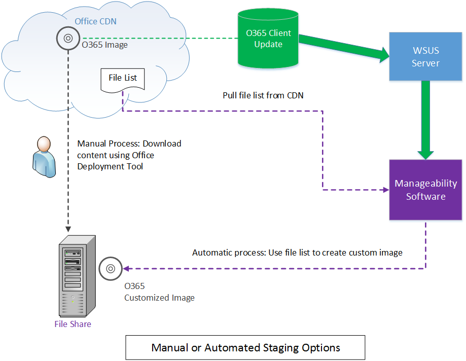
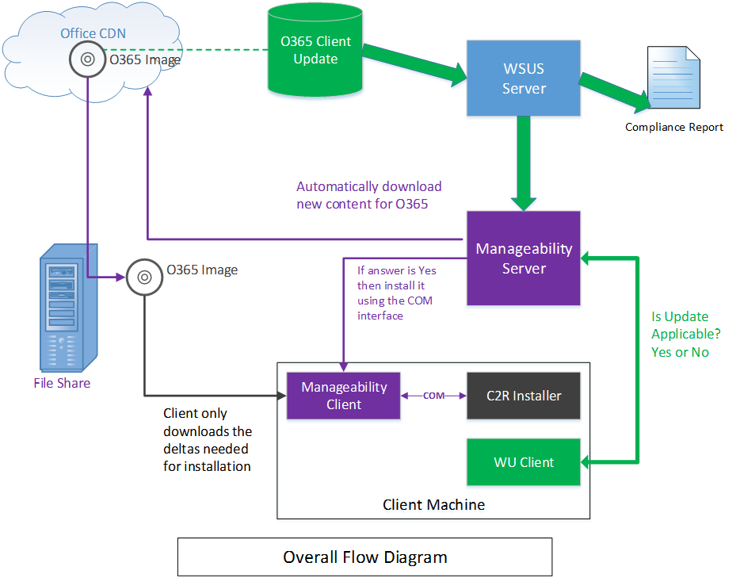

# <a name="integrating-manageability-applications-with-office-365-click-to-run-installer"></a>実行をクリックしてインストーラーを Office 365 管理アプリケーションと統合します。

ソフトウェア管理ソリューションと Office 365 クイック実行インストーラーを統合する方法について説明します。
  
Office 365 クイック実行インストーラーには、IT 担当者およびソフトウェア管理ソリューションがプログラムで更新の管理を制御できるようになる COM インターフェイスが用意されています。このインターフェイスは、Office 展開ツールよりも高度な追加の管理機能を提供します。
  
> [!NOTE]
> [!メモ] この記事は、Office 2016 以降および Office 365 に適用されます。 
  
## <a name="integrating-with-the-click-to-run"></a>クイック実行との統合

このインターフェイスを使用するには、管理アプリケーションで COM インターフェイスを起動して、クイック実行インストール サービスと直接通信する公開 API を呼び出します。 
  
> [!NOTE]
> [!メモ] Office クイック実行インストーラーは、インストーラーの動作を制御できるパラメーターを指定して、コマンド ラインから実行できます。詳細は、「[クイック実行用 Office 展開ツール](https://www.microsoft.com/en-us/download/details.aspx?id=49117)」を参照してください。 
  
**次に、COM インターフェイスの概念図を示します**

![COM インターフェイスを使用して Office の実行をクリックしてインストーラーを次の図にします]。(media/e7ac2523-e67b-4a44-ae67-c048709f872a.png "Office の実行をクリックしてインストーラーを COM インターフェイスを使用して次の図")
  
Office 365 クイック実行インストーラーには、COM ベースのインターフェイス **IUpdateNotify** が実装されています。このインターフェイスは、CLSID **CLSID_UpdateNotifyObject** に登録されています。
  
このインターフェイスは、次のように呼び出すことができます。
  
```cpp
hr = CoCreateInstance(CLSID_UpdateNotifyObject, NULL, CLSCTX_ALL,
       IID_IUpdateNotify, 
      (void **)&p); 
```

クイック実行インストール プログラムは昇格された特権で実行する必要があるので、この呼び出しは、呼び出し元が昇格された特権で実行している場合のみ正常に実行されます。
  
**IUpdateNotify** COM インターフェイスは、コマンドおよびパラメーターの検証と、クイック実行インストール サービスによる実行のスケジュール設定に利用できる 3 つの非同期関数を公開しています。 
  
```cpp
HRESULT Download([in] LPWSTR pcwszParameters) // Download update content.
HRESULT Apply([in] LPWSTR pcwszParameters) // Apply update content.
HRESULT Cancel() // Cancel the download action.

```

4 つ目のメソッド **Status** は、最後に実行したコマンドの状態または現在実行中のコマンド状態に関する情報 (成功、失敗、詳細なエラー コードなど) を取得するために使用できます。
  
```cpp
HRESULT status([out] _UPDATE_STATUS_REPORT* pUpdateStatusReport) // Get status of current action. 
typedef struct _UPDATE_STATUS_REPORT  
{  
UPDATE_STATUS status;  
UINT error; 
BSTR contentid;  
} UPDATE_STATUS_REPORT;

```

クイック実行インストール サービスには、そのライフサイクルの間に **IUpdateNotify** メソッドの呼び出しが可能になる 4 つの状態 (起動中、アイドル、ダウンロード中および適用中) が存在します。 
  
**次に、COM インターフェイスの状態マシンの図を示します**

![COM インターフェイスの状態の図です]。(media/a409003e-6876-4ab3-bb4c-cd0c0fed5cbb.png "COM インターフェイスの状態の図")
  
> [!NOTE]
> **再起動**: クイック実行インストーラー サービスはありません利用可能な期間があるマシンを起動するとします。 再起動後に Status メソッドの呼び出しが成功すると、eUPDATE_UNKNOWN が返されます。 
  
**Idle:** クイック実行インストーラーがアイドル状態のときは、以下を呼び出すことができます。 
  
- **Apply**: 以前にダウンロードしたコンテンツをインストールします。
    
- **Cancel**:  `0x800000e`「予期しないときにメソッドが呼び出されました。」を返します。
    
- **Download**: 後でインストールするために、新しいコンテンツをクライアントにダウンロードします。
    
- **Status**: 最後に完了したアクションの結果を返すか、アクションがエラーで終了した場合はエラー メッセージを返します。前のアクションがない場合は、 **Status** は  `eUPDATE_UNKNOWN` を返します。
    
**Downloading:** クイック実行インストーラーがダウンロード状態のときは、以下のものを呼び出すことができます。 
  
- **Apply**: 値  ****、「予期しないときにメソッドが呼び出されました。」の `0x800000e` を返します。
    
- **Cancel**: ダウンロードを停止し、一部ダウンロードされたコンテンツを削除します。
    
- **Download**: 値  ****、「予期しないときにメソッドが呼び出されました。」の `0x800000e` を返します。 
    
- **Status**: **DOWNLOAD_WIP** を返して、ダウンロード作業が進行中であることを示します。 
    
**適用中:** クイック実行インストーラーが、以前にダウンロードしたコンテンツのインストール処理中の場合。 
  
- **Apply**: 値  ****、「予期しないときにメソッドが呼び出されました。」の `0x800000e` を返します。
    
- **Cancel**:  `0x800000e` を返します。Apply アクションを取り消すことはできません。
    
- **Download**: 値  ****、「予期しないときにメソッドが呼び出されました。」の `0x800000e` を返します。 
    
- **Status**: **APPLY_WIP** を返して、適用作業が進行中であることを示します。 
    
> [!NOTE]
> OfficeC2RCOM は COM + サービスは、動的に読み込まれるので、期待される結果になるようにするには、このクラスのメソッドを呼び出すたびに、 **CoCreateInstance**をコールする必要があります。 この COM+ サービスは必要に応じて新しいインスタンスの作成を処理します。 いずれかのメソッドが初めて呼び出されるときに、COM+ は **IUpdateNotify** オブジェクトを読み込んで、そのオブジェクトを dllhost.exe インスタンスの 1 つで実行します。 新しいオブジェクトは約 3 分間アイドル状態でアクティブになります。 前回の呼び出しから 3 分以内に後続の呼び出しが行われると、 **IUpdateNotify** オブジェクトは読み込まれたままで、新しいインスタンスは作成されません。 3 分以内に呼び出しが行われないと、IUpdateNotify オブジェクトはアンロードされ、その後の呼び出しでは新しい **IUpdateNotify** オブジェクトが作成されます。 
  
## <a name="click-to-run-installer-com-api-reference-guide"></a>クイック実行インストーラー COM API リファレンス ガイド

以下の API リファレンス ドキュメントでは、次のようになっています。
  
- パラメーターは、スペースで区切られたキー/値ペアの形式です。
    
- パラメーターでは大文字小文字は区別されません。
    
- [パラメーターのリスト](https://blogs.technet.microsoft.com/odsupport/2014/03/03/the-new-update-now-feature-for-office-2013-click-to-run-for-office365-and-its-associated-command-line-and-switches/)と説明を利用できます。 
    
- IUpdateNotify2 インターフェイスの概要が含まれるようになりました。
    
### <a name="apply"></a>Apply

```cpp
HRESULT Apply([in] LPWSTR pcwszParameters) // Apply update content.
```

#### <a name="parameters"></a>Parameters

-  _displaylevel_: 更新処理中のインストールの状態 (エラーを含む) を表示する場合は **true** に設定します。更新処理中のインストールの状態 (エラーを含む) を非表示にする場合は **false** に設定します。既定値は **false** です。
    
-  _forceappshutdown_: **Apply** アクションがトリガーされた直後に Office アプリケーションを強制的にシャット ダウンする場合は **true** に設定します。 **false** に設定した場合、実行中の Office アプリケーションがあると失敗します。既定値は **false** です。詳細は、「 [注釈](#bk_ApplyRemark)」を参照してください。 
    
  **Apply** アクションがトリガーされた時にいずれかの Office アプリケーションが実行中の場合、通常 **Apply** アクションは失敗します。  `forceappshutdown=true` が **Apply** メソッドに渡されると、 **OfficeClickToRun** サービスは即時にアプリケーションをシャットダウンし、更新プログラムを適用します。この場合、データの損失が発生する可能性があります。 
    
#### <a name="return-results"></a>返される結果

|||
|:-----|:-----|
|**S_OK** <br/> |アクションが、実行のためにクイック実行サービスに正常に送られました。  <br/> |
|**E_ACCESSDENIED** <br/> |呼び出し元が、昇格された特権で実行していません。  <br/> |
|**E_INVALIDARG** <br/> |無効なパラメーターが渡されました。  <br/> |
|**E_ILLEGAL_METHOD_CALL** <br/> |この時点では、アクションは許可されていません。詳細については、「[注釈 ](#bk_ApplyRemark)」を参照してください。  <br/> |

<a name="bk_ApplyRemark"></a>

#### <a name="remarks"></a>Remarks

- **Apply** アクションがトリガーされたときに実行中の Office アプリケーションがあると **Apply** アクションは失敗します。  `forceappshutdown=true` が **Apply** メソッドに渡されると、その直後に **OfficeClickToRun** サービスは実行中の Office アプリケーションをシャットダウンして更新プログラムを適用します。開いているドキュメントの変更内容を保存するように求めるダイアログが表示されないため、ユーザーはデータを損失する可能性があります。 
    
- このアクションは、COM の状態が次のいずれかのときにのみトリガーできます。 
    
  - **eUPDATE_UNKNOWN**
    
  - **eDOWNLOAD_CANCELLED**
    
  - **eDOWNLOAD_FAILED**
    
  - **eDOWNLOAD_SUCCEEDED**
    
  - **eAPPLY_SUCCEEDED**
    
  - **eAPPLY_FAILED**
    
- 以前にダウンロードしたコンテンツがない状態で **Apply** メソッドを呼び出すと、 **Apply** メソッドは **Succeeded** を報告します。これは、このメソッドが適用するものがないことを検出して、 **Apply** 処理を正常に完了したことを示します。 
    
### <a name="cancel"></a>Cancel

```cpp
HRESULT Cancel() // Cancel the download action.
```

#### <a name="return-results"></a>返される結果

|||
|:-----|:-----|
|S_OK  <br/> |アクションが、実行のためにクイック実行サービスに正常に送られました。  <br/> |
|E_ILLEGAL_METHOD_CALL  <br/> |この時点では、アクションは許可されていません。詳細については、「[注釈 ](#bk_CancelRemarks)」セクションを参照してください。  <br/> |

<a name="bk_CancelRemarks"></a>

#### <a name="remarks"></a>Remarks

- このメソッドは、COM 状態 ID **eDOWNLOAD_WIP** の場合のみトリガーできます。このメソッドは現在のダウンロード アクションを取り消そうとします。COM 状態は **eDOWNLOAD_CANCELLING** に変わり、最終的に **eDOWNLOAD_CANCELED** に変わります。これ以外の場合にトリガーすると、COM 状態は **E_ILLEGAL_METHOD_CALL** を返します。 
    
### <a name="download"></a>Download

```cpp
HRESULT Download([in] LPWSTR pcwszParameters) // Download update content.
```

#### <a name="parameters"></a>Parameters

-  _displaylevel_: 更新処理中のインストールの状態 (エラーを含む) を表示する場合は **true** に設定します。更新処理中のインストールの状態 (エラーを含む) を非表示にする場合は **false** に設定します。既定値は **false** です。
    
-  _updatebaseurl_: 代替ダウンロード ソースへの URL です。
    
-  _updatetoversion_: このバージョンに Office を更新します。このパラメーターは、現在インストールされているバージョンよりも古いバージョンに更新する場合に定義します。
    
-  _downloadsource_: カスタマイズされた **IBackgroundCopyManager** の実装 (BITS マネージャー) の CLSID です。 
    
-  _contentid_: カスタマイズされた BITS マネージャーのコンテンツ サーバーからダウンロードするコンテンツを識別します。この値は、解釈のために BITS インターフェイスを介して渡されます。
    
#### <a name="return-results"></a>返される結果

|||
|:-----|:-----|
|**S_OK** <br/> |アクションが、実行のためにクイック実行サービスに正常に送られました。  <br/> |
|**E_ACCESSDENIED** <br/> |呼び出し元が、昇格された特権で実行していません。  <br/> |
|**E_INVALIDARG** <br/> |無効なパラメーターが渡されました。  <br/> |
|**E_ILLEGAL_METHOD_CALL** <br/> |この時点では、アクションは許可されていません。詳細については、「[注釈 ](#bk_DownloadRemark)」を参照してください。  <br/> |

<a name="bk_DownloadRemark"></a>

#### <a name="remarks"></a>Remarks

- _downloadsource_ と  _contentid_ をペアとして指定する必要があります。ペアで指定しないと、 **Download** メソッドは **E_INVALIDARG** エラーを返します。 
    
- _downloadsource_、 _contentid_、 _updatebaseurl_ を指定すると、  _updatebaseurl_ は無視されます。 
    
- このアクションは、COM の状態が次のいずれかのときにのみトリガーできます。 
    
  - **eUPDATE_UNKNOWN**
    
  - **eDOWNLOAD_CANCELLED**
    
  - **eDOWNLOAD_FAILED**
    
  - **eDOWNLOAD_SUCCEEDED**
    
  - **eAPPLY_SUCCEEDED**
    
  - **eAPPLY_FAILED**
    
- 以前にダウンロードしたコンテンツがない状態で **Apply** メソッドを呼び出すと、 **Apply** メソッドは **Succeeded** を報告します。それはこのメソッドが、適用されたものがないことを検出し、 **Apply** 処理を正常に完了したことを示します。 
    
#### <a name="examples"></a>Examples

- カスタマイズした BITS マネージャーからコンテンツをダウンロードするには、次のパラメーターを渡す **download()** 関数を呼び出します。 
    
  ```cpp
  "downloadsource=CLSIDofBITSInterface contentid=BITSServerContentIdentifier"
  ```

- Microsoft CDN からコンテンツをダウンロードするには、 **downloadsource**、 _contentid_、 _updatebaseurl_ パラメーターを指定しないで _download()_ 関数を呼び出します。 
    
- カスタマイズした場所からコンテンツをダウンロードするには、次のパラメーターを渡す **download()** 関数を呼び出します。 
    
  ```cpp
  "updatebaseurl=yourcontentserverurl"
  ```

### <a name="status"></a>Status

```cpp
typdef struct _UPDATE_STATUS_REPORT
{
    UPDATE_STATUS status;
    UINT error;
    LPCWSTR contentid;
}UPDATE_STATUS_REPORT;
HRESULT status([out] _UPDATE_STATUS_REPORT& pUpdateStatusReport) // Get status of current action
```

#### <a name="parameters"></a>Parameters

|||
|:-----|:-----|
| _pUpdateStatusReport_ <br/> |UPDATE_STATUS_REPORT 構造体を指すポインターです。  <br/> |
   
#### <a name="return-results"></a>返される結果

|||
|:-----|:-----|
|**S_OK** <br/> |**Status** メソッドは、常にこの結果を返します。現在のアクションの状態については、  `UPDATE_STATUS_RESULT` 構造体を調べます。  <br/> |
   
#### <a name="remarks"></a>Remarks

- `UPDATE_STATUS_REPORT` の状態フィールドには、現在のアクションの状態が含まれています。次のいずれかの状態値が返されます。 
    
  ```cpp
  typedef enum _UPDATE_STATUS
  {
  eUPDATE_UNKNOWN = 0,
  eDOWNLOAD_PENDING,
  eDOWNLOAD_WIP,
  eDOWNLOAD_CANCELLING,
  eDOWNLOAD_CANCELLED,
  eDOWNLOAD_FAILED,
  eDOWNLOAD_SUCCEEDED,
  eAPPLY_PENDING,
  eAPPLY_WIP,
  eAPPLY_SUCCEEDED,
  eAPPLY_FAILED,
  } UPDATE_STATUS;
  
  ```

- 前回実行したコマンドがエラーになると、そのエラーに関する詳細が  `UPDATE_STATUS_REPORT` のエラー フィールドに入ります。2 種類のエラー コードが **Status** メソッドから返されます。 
    
- `UDPATE_ERROR_CODE::eUNKNOWN` より少ないエラーは、次の事前に定義されたエラー コードのいずれかになります。
    
  ```cpp
  typedef enum _UPDATE_ERROR_CODE
  {
  eOK = 0,
  eFAILED_UNEXPECTED,
  eTRIGGER_DISABLED,
  ePIPELINE_IN_USE,
  eFAILED_STOP_C2RSERVICE,
  eFAILED_GET_CLIENTUPDATEFOLDER,
  eFAILED_LOCK_PACKAGE_TO_UPDATE,
  eFAILED_CREATE_STREAM_SESSION,
  eFAILED_PUBLISH_WORKING_CONFIGURATION,
  eFAILED_DOWNLOAD_UPGRADE_PACKAGE,
  eFAILED_APPLY_UPGRADE_PACKAGE,
  eFAILED_INITIALIZE_RSOD,
  eFAILED_PUBLISH_RSOD,
  // Keep this one as the last
  eUNKNOWN
  } UPDATE_ERROR_CODE;
  
  ```

  リターン エラー コードが  `UDPATE_ERROR_CODE::eUNKNOWN` より大きい場合、そのコードは失敗した関数呼び出しの **HRESULT** になります。HRESULT を抽出するには、  `UDPATE_ERROR_CODE::eUNKNOWN` のエラー フィールドで返された値から  `UPDATE_STATUS_REPORT` を減算します。
    
  状態とエラー値の完全なリストは、OfficeC2RCom.dll に埋め込まれている **IUpdateNotify** タイプ ライブラリを調べることで確認できます。 
    
- Contentid フィールドは、**ダウンロード**を開始しましたし、**ダウンロード**の呼び出しに渡された contentid が返されます、**状態**への呼び出しに使用されます。 このフィールドは、 **Status** メソッドの呼び出し前に **null** に初期化し、 **Status** が返されてから値を確認するようにしてください。 この値が **null** のままの場合は、返す contentid がないことを意味します。 この値が **null** 以外の場合は、 **SysFreeString()** の呼び出しで解放する必要があります。 次のコード スニペットは、 **Download** の後で **Status** を呼び出す方法を示しています。
    
  ```cpp
  std::wstring contentID;
  UPDATE_STATUS_REPORT statusReport;
  statusReport.status = eUPDATE_UNKNOWN;
  statusReport.error = eOK;
  statusReport.contentid = NULL;
  hr = p->Status(&statusReport);
  if (statusReport.contentid != NULL)
  {
  contentID = statusReport.contentid;
  SysFreeString(statusReport.contentid);
  }
  wprintf(L"ContentID: %s, Status: %d, LastError: %d", contentID.c_str(), statusReport.status, statusReport.error);
  
  ```

### <a name="summary-of-iupdatenotify2-interface"></a>IUpdateNotify2 インターフェイスの概要

> [!NOTE]
> [!メモ] この概要は、「[管理容易性アプリケーションと Office 365 クイック実行インストーラーの統合](https://msdn.microsoft.com/EN-US/library/office/mt608768.aspx)」の補完情報として提供します。パブリック ドキュメントの更新後は、このドキュメントは廃止と見なされます。 
  
C2RTenant [16.0.8208.6352](https://oloop/BuildGroup/Details/tenantc2rclient#3519/1255278) (最初の一般公開ビルドは 6 月のフォーク ビルド 8326.* になります) 以降に、新しい **IUpdateNotify2** インターフェイスが追加されています。次に、このインターフェイスに関する基本情報の一部を示します。 
  
- CLSID_UpdateNotifyObject2, {52C2F9C2-F1AC-4021-BF50-756A5FA8DDFE}
    
- このインターフェイスは、下位互換性を実現するために元の IUpdateNotify インターフェイスもホストします。つまり、このインターフェイスを使用すると、 **UpdateNotifyObject** インターフェイスで提供されるすべてのメソッドにアクセスできるようになります。 
    
- IUpdateNotify2 には、次の新しいメソッドが追加されています。
    
  - **HRESULT** GetBlockingApps([out] BSTR \* AppsList)。更新をブロックしているアプリのリストを取得します。この呼び出しにより、更新処理の進行をブロックする実行中の Office アプリが返されます。 
    
  - **HRESULT** GetOfficeDeploymentData([in] int dataType, [in] **LPCWSTR** pcwszName, [out] BSTR * OfficeData)。Office 展開データを取得します。 
    
- 新しいメソッドを使用する場合は、確認する必要があります。
    
  - C2R バージョンが上記のビルドよりも新しい場合は (\>年 6 月フォークのビルドを =)。
    
  - **CoCreateInstance** の呼び出しには、 **UpdateNotifyObject** ではなく UpdateNotifyObject2 を使用すること。
    
新しいメソッドを使用しない場合は、何も変更する必要はありません。すべての既存のメソッドは、以前とまったく同じ方法で動作します。
  
## <a name="implementing-the-bits-interface"></a>BITS インターフェイスの実装

[Background Intelligent Transfer Service](https://msdn.microsoft.com/library/bb968799(v=vs.85).aspx) (BITS) は、クライアントとサーバーの間でファイルを転送するための Microsoft が提供するサービスです。BITS は、Office クイック実行インストーラーがコンテンツのダウンロードに使用できるチャネルの 1 つです。既定では、Office クイック実行インストーラーは、Windows に組み込まれている BITS の実装を使用して、CDN からコンテンツをダウンロードします。 
  
カスタマイズされた BITS の実装を **IUpdateNotify** インターフェイスの **download()** メソッドに提供すると、管理ソフトウェアはクライアントがコンテンツをダウンロードする場所と方法を制御できます。カスタマイズされた BITS インターフェイスは、Office CDN、IIS サーバー、ファイル共有など、クイック実行組み込みチャネル以外のカスタム コンテンツ配布チャネルを提供する場合に便利です。 
  
カスタマイズした BITS インターフェイスが Office C2R サービスと連動するための最小要件は次のとおりです。
  
- **IBackgroundCopyManager** の場合:
    
  ```cpp
  HRESULT _stdcall CreateJob(
                      [in] LPWSTR DisplayName, 
                      [in] BG_JOB_TYPE Type, 
                      [out] GUID* pJobId, 
                      [out] IBackgroundCopyJob** ppJob)
  HRESULT _stdcall GetJob(
                      [in] GUID* jobID, 
                      [out] IBackgroundCopyJob** ppJob)
  HRESULT _stdcall EnumJobs(
                      [in] unsigned long dwFlags, 
                      [out] IEnumBackgroundCopyJobs** ppenum)
  
  ```

- **IBackgroundCopyJob** の場合:
    
  ```cpp
  HRESULT _stdcall AddFile(
                      [in] LPWSTR RemoteUrl, 
                      [in] LPWSTR LocalName)
  HRESULT _stdcall Resume()
  HRESULT _stdcall Complete()
  HRESULT _stdcall Cancel();
  HRESULT _stdcall GetState([out] BG_JOB_STATE* pVal);
  HRESULT GetProgress( [out] BG_JOB_PROGRESS *pProgress);
  
  ```

- **IBackgroundCopyJob3** の場合:
    
  ```cpp
  HRESULT _stdcall AddFileWithRanges(
                      [in] LPWSTR RemoteUrl, 
                      [in] LPWSTR LocalName,
                      [in] DWORD RangeCount,
                      [in] BG_FILE_RANGE Ranges[])
  
  ```

- `Addfile` 関数と  `AddFileWithRanges` 関数の場合、リモート URL は次の形式です。 
    
  ```cpp
  cmbits://<contentid>/<relative path to target file>
  ```

  - cmbits はハード コードされており、カスタマイズされた BITS を表します。
    
  -  _\<contentid\>_ は、 _Download()_ メソッドの  **contentid** パラメーターです。 
    
  -  _\<relative path to target file\>_ は、ファイルをダウンロードする場所とファイル名を指定します。 
    
    たとえば、 __ の  `f732af58-5d86-4299-abe9-7595c35136ef` を **Download()** メソッドに提供しており、Office C2R が  `v32.cab` ファイルのようにバージョン指定の cab ファイルをダウンロードしようとする場合、次の  **** を使用して `RemoteUrl` を呼び出します。
    
  ```cpp
  cmbits://f732af58-5d86-4299-abe9-7595c35136ef/Office/Data/V32.cab
  ```

- **IBackgroundCopyError** の場合:
    
  ```cpp
  HRESULT _stdcall GetErrorDescription(
        [in]  DWORD  LanguageId,
        [out] LPWSTR *ppErrorDescription);
  
  ```

- **IBackgroundCopyFile** の場合:
    
  ```cpp
  HRESULT _stdcall GetLocalName([out] LPWSTR *ppName); 
  HRESULT _stdcall GetRemoteName([out] LPWSTR *ppName);
  
  ```

<!--## Automating content staging

IT administrators can choose to have desktop clients enabled to automatically receive updates when they are available directly from the Microsoft Content Delivery Network (CDN) or they can choose to control the deployment of updates available from the [update channels](https://support.office.com/en-us/article/Overview-of-update-channels-for-Office-365-ProPlus-9ccf0f13-28ff-4975-9bd2-7e4ea2fefef4?ui=en-US&rs=en-US&ad=US) using the [Office 2016 Deployment Tool](https://www.microsoft.com/en-us/download/details.aspx?id=49117) or [System Center Configuration Manager](https://support.office.com/en-us/article/Manage-updates-to-Office-365-ProPlus-with-System-Center-Configuration-Manager-b4a17328-fcfe-40bf-9202-58d7cbf1cede).
  
The service supports the ability for management tools to recognize and automate the download of the content when updates are made available.
  
**Following is a diagram showing the overview of downloading a custom image**


  
In the above diagram you see that a new Office 365 ProPlus image is available on the Office Content Distribution Network (CDN). Along with the Office 365 ProPlus image, an XML-formatted file list is also available which has the information needed to enable manageability software to directly create customized images replacing the need for using the Office Deployment Tool.
  
An enterprise configures their WSUS to sync the Office 365 Client Updates. These updates do not contain the actual image payload but does allow the manageability software to recognize when new content is available. The manageability software can then read the Client Update metadata to understand what version of Office the update applies to.
  
If the update is applicable, the manageability software can use the CDN content and the file list to create the custom image and store it onto the file share location that it is configured to use.
  
### Format of the XML file list

There are two file lists available in a cab file on the CDN. One lists the files for the 32-bit version of Office and one for the 64-bit version of Office. The URL of the location of the Office File List (OFL.CAB) file is [https://officecdn.microsoft.com/pr/wsus/ofl.cab](https://officecdn.microsoft.com/pr/wsus/ofl.cab). The two file lists are called:
  
- O365Client_32bit.xml
    
- O365Client_64bit.xml
    
Within the XML for each of the file lists is an  `UpdateFiles` node which contains a version attribute.  `UpdateFiles version="1.4"`.
  
This version is incremented if changes are made to the file lists.
  
There are two parameters that need to be combined with the XML to make a custom image: 
  
- Replace  _%version%_ with the build version of Office. This can be derived from the Client Update metadata  `MoreInfoURL` field, see below. 
    
- Define  _baseURL_ by using the URL value associated with the branch the image is being created for. This can be derived from the Client Update metadata, see below. 
    
The steps for creating an image are:
  
1. Open the XML file list.
    
2. Replace occurrences of  _%version%_ with the applicable Office build version. The build version can be acquired from releasehistory.xml as described later in this article. 
    
3. Read the URL attribute for the target branch.
    
4. Remove language nodes for any languages not required in the custom image.
    
   > [!NOTE]
   > Nodes with language='0' are language neutral and must be included in the image. 
  
5. Construct a local image of the CDN by iterating through the XML file list and copying the CDN files, while creating the folder structure as needed. 
    
   - If the  _rename_ attribute is provided, then rename the copied file to the value provided in the  _rename_ attribute. This used to create the top-level default v64.cab and v32.cab files. These are the renamed versions of the top-level build cab file and are used as the default installation version if the version is not specified. 
    
   - Use URL + relativePath + filename to construct the CDN location.
    
The following examples use the Monthly channel (as defined by the  `baseURL` node) and build version 16.0.4229.1004 from releasehistory.xml. 
  
```cpp
baseURL branch="Monthly" URL="https://officecdn.microsoft.com/pr/492350f6-3a01-4f97-b9c0-c7c6ddf67d60" /
```

- The following is a language neutral file needed for all languages. The name of the file is v64_16.0.4229.1004.cab and it should be copied from https://officecdn.microsoft.com/pr/492350f6-3a01-4f97-b9c0-c7c6ddf67d60/office/data/v64_16.0.4229.1004.cab and renamed to …/office/data/v64.cab.
    
  ```cpp
  baseURL branch="Business" URL="https://officecdn.microsoft.com/pr/7ffbc6bf-bc32-4f92-8982-f9dd17fd3114" /
  File name="v64_%version%.cab" rename="v64.cab" relativePath="/office/data/" language="0"/
  
  ```

- The following is a file to be included in the en-US image as designated by the language LCID=1033. The name of the file is s641033.cab and it should be copied from https://officecdn.microsoft.com/pr/492350f6-3a01-4f97-b9c0-c7c6ddf67d60/office/data/16.0.4229.1004/s641033.cab and not renamed.
    
  ```cpp
  File name="s641033.cab" relativePath="/office/data/%version%/" language="1033" /
  ```

### Hash verification of data files

Image creation tools may verify the integrity of the downloaded .dat files by comparing a computed HASH value with the supplied HASH value associated with each of the .dat files. Below is an example of a .dat file from the Monthly channel with build version 16.0.4229.1004 and language set to Bulgarian.
  
```cpp
File name="stream.x64.bg-bg.dat" hashLocation="s641026.cab/stream.x64.bg-bg.hash" hashAlgo="Sha256" relativePath="/office/data/%version%/" language="1026"
```

- The  _hashLocation_ attribute specifies the relative path location of the stream.x64.bg-bg.hash for the stream.x64.bg-bg.dat file. Construct the hash file location by concatenating URL + relativePath + hashLocation. In this example the stream.x64.bg-bg.hash location would be https://officecdn.microsoft.com/pr/492350f6-3a01-4f97-b9c0-c7c6ddf67d60/office/data/16.0.4229.1004/s641026.cab/stream.x64.bg-bg.hash 
    
- The  _hashAlgo_ attribute specifies what hashing algorithm was used. In this case the Sha256 algorithm was used. 
    
To validate the integrity of the stream.x64.bg-bg.dat file, open the stream.x64.bg-bg.hash and read the hash value from the first line of text in the hash file. Compare this to the has value that you computed using the specified hashing algorithm to verify that the values match. Use the following C# code to read the hash.
  
```cs
string[] readHashes = System.IO.File.ReadAllLines(tmpFile, Encoding.Unicode);
string readHash = readHashes.First();

```

### Office 365 Client Updates

Office 365 Client Updates enable manageability software to treat the Office 365 Client Updates in a manner very similar to any other WU update with one exception; the client updates do not contain an actual payload. The Office 365 Client Updates should not be installed on any clients but rather used to trigger the workflows with the manageability software replacing the installation command with the COM based installation mechanism shown above.
  
**Office 365 Client Update workflow**


  
Each Office 365 Client Update that is published includes metadata about the update. This metadata includes a parameter called  _MoreInfoUrl_ which can be used to derive the following information: 
  
-  _Ver_: Identifies the Office version associated with this update. For example 16.0.4229.1004.
    
-  _Branch_: Identifies the Update Channel for this update. Values include InsiderFast, Insiders, Monthly, Targeted, Broad. Additional values may be added in the future.
    
-  _Arch_: Identifies the processor architecture associated with this update.
    
-  _xmlVer_: Identifies the version of the XML file lists to use to construct the base image for this update.
    
-  _xmlPath_: Path to the OFL.CAB file that contains the XML file lists.
    
-  _xmlFile_: The name of the file list that should be used for this update. The value will be  `O365Client_32bit` or  `O365Client_64bit` and will match the value in  _Arch_.
    
The following is an example of the  _MoreInfoURL_ parameter which refers to the Office 365 Client Update for the 32-bit version of Office with build version of 16.0.2342.2343 on the Current channel. 
  
```http
https://officecdn.microsoft.com/pr/wsus/ofl.cab is the location of the XML file lists for this update, specifically the O365Client_32bit.xml from within the OFL.CAB.
https://go.microsoft.com/fwlink/?LinkId=626090&Ver=16.0.8326.2096&Branch=Current&Arch=64&XMLVer=1.4&xmlPath=https://officecdn.microsoft.com/pr/wsus/ofl.cab&xmlFile=O365Client_64bit.xml 

```
THE ABOVE SECTION APPEARS TO BE A DUPLICATE OF THE FOLLOWING SECTION; TEMPORARILY COMMENTING IT OUT.-->

## <a name="automating-content-staging"></a>コンテンツのステージングの自動化

IT 管理者は、更新プログラムが利用できるようになったときに、デスクトップ クライアントが Microsoft コンテンツ配信ネットワーク (CDN) から直接自動的に更新プログラムを受信できるようにすることも、Office 2016 展開ツールまたは System Center Configuration Manager を使用して更新プログラム チャネルからの利用可能な更新プログラムの展開を制御することもできます。
  
このサービスは、更新プログラムが利用可能になったときに、コンテンツのダウンロードを認識して自動化するための管理ツールの機能をサポートしています。
  
**次の画像は、カスタム イメージのダウンロードの概要です**

![COM インターフェイスを使用して Office の実行をクリックしてインストーラーを次の図にします]。(media/e7ac2523-e67b-4a44-ae67-c048709f872a.png "Office の実行をクリックしてインストーラーを COM インターフェイスを使用して次の図")
  
### <a name="overview-of-downloading-a-custom-image"></a>カスタム イメージのダウンロードの概要
  
上記の図では、Office コンテンツ配信ネットワーク (CDN) で新しい Office 365 ProPlus イメージが利用可能になっていることが示されています。この Office 365 ProPlus イメージとともに、XML 形式のファイル リストも利用可能になっています。このファイルには、カスタマイズしたイメージを管理ソフトウェアで直接作成できるようにするために必要な情報が含まれています。これにより、Office 展開ツールを使用することの必要性がなくなります。
  
エンタープライズは、Office 365 クライアント更新プログラムと同期するように WSUS を構成します。こうした更新プログラムには実際のイメージ ペイロードは含まれていませんが、管理ソフトウェアは新しいコンテンツが利用可能になったことを認識できます。それにより、管理ソフトウェアは、クライアント更新プログラム メタデータを読み取って、適用対象の Office のバージョンを識別できるようになります。
  
更新プログラムの適用が可能な場合、管理ソフトウェアは CDN コンテンツとファイル リストを使用して、カスタム イメージを作成し、イメージの保存先として使用するように構成されたファイル共有の場所に保存できます。
  
### <a name="format-of-the-xml-file-list"></a>XML ファイル一覧の形式

CDN の cab ファイルには、2 つの利用可能なファイル リストが含まれています。その一方には Office の 32 ビット バージョン用のファイルがリストされています。もう一方は Office の 64 ビット バージョン用です。Office ファイル リスト (OFL.CAB) ファイルの場所の URL は、[https://officecdn.microsoft.com/pr/wsus/ofl.cab](https://officecdn.microsoft.com/pr/wsus/ofl.cab) です。この 2 つのファイルの名前は次のとおりです。
  
- O365Client_32bit.xml
    
- O365Client_64bit.xml
    
それぞれのファイル リスト用の XML には、バージョン属性が含まれている <UpdateFiles> ノードがあります ( `<UpdateFiles version="1.4">`)。このバージョンは、ファイル リストに変更が加えられると増分されます。
  
カスタム イメージを作成するには、以下の 2 つのパラメーターを XML と組み合わせる必要があります。 
  
- *%version%*  を Office のビルド バージョンに置き換えます。これは、クライアント更新プログラム メタデータから導出できます (次のセクションで説明します)。 
    
- イメージの作成対象の分岐に関連付けられている URL 値を使用して  *baseURL*  を定義します。これは、クライアント更新プログラム メタデータから導出できます。詳細は、次のセクションを参照してください。 
    
イメージを作成する手順は次のとおりです。
  
1. XML ファイル一覧を開きます。
    
2. *%version%*  と一致する部分を該当する Office ビルド バージョンに置換します。ビルド バージョンは、この記事で後述するように、releasehistory.xml から取得できます。 
    
3. 対象の分岐の URL 属性を読み取ります。
    
4. カスタム イメージで不要な言語の言語ノードを削除します。
    
   > [!NOTE]
   > [!メモ] language='0' のノードは、言語に依存しないノードであり、イメージに含めておく必要があります。 
  
5. XML ファイル一覧に対して反復処理を行い、CDN ファイルをコピーして、CDN のローカル イメージを構成します。必要に応じてフォルダー構造を作成します。 
    
   - *rename*  属性が指定されている場合は、コピーしたファイルの名前を  *rename*  属性で指定された値に変更します。これを使用して最上位レベルの既定の v64.cab ファイルと v32.cab ファイルを作成します。これらのファイルは最上位のビルド cab ファイルの名前が変更されたバージョンで、バージョンが指定されていない場合に既定のインストール バージョンとして使用されます。 
    
   - URL + relativePath + ファイル名を使用して、CDN の場所を構成します。
    
次の例では、Monthly チャネル ( `<baseURL>` ノードで定義) と、releasehistory.xml からのビルド バージョン 16.0.4229.1004 を使用します。 
  
```xml
<baseURL branch="Monthly" URL="https://officecdn.microsoft.com/pr/492350f6-3a01-4f97-b9c0-c7c6ddf67d60" />
```

- 次の例は、すべての言語に必要な言語非依存のファイルです。 ファイルの名前は、v64_16.0.4229.1004.cab とそのコピーから`https://officecdn.microsoft.com/pr/492350f6-3a01-4f97-b9c0-c7c6ddf67d60/office/data/v64_16.0.4229.1004.cab`に名前を変更したと`…/office/data/v64.cab`。 
    
  ```xml
  <File name="v64_%version%.cab" rename="v64.cab" relativePath="/office/data/" language="0"/>
  
  ```

- 次の例は、言語 LCID=1033 で指定されている en-US イメージに組み込まれるファイルです。ファイルの名前は s641033.cab で、`https://officecdn.microsoft.com/pr/492350f6-3a01-4f97-b9c0-c7c6ddf67d60/office/data/16.0.4229.1004/s641033.cab` からコピーし、名前は変更しません。
    
  ```xml
  <File name="s641033.cab" relativePath="/office/data/%version%/" language="1033" />
  ```

### <a name="hash-verification-of-dat-files"></a>.Dat ファイルのハッシュの検証

イメージ作成ツールでは、処理済みのハッシュ値と .dat ファイルごとに関連付けられた指定のハッシュ値を比較することで、ダウンロードした .dat ファイルの整合性を検証できます。次の例は、ビルド バージョンが 16.0.4229.1004 で言語がブルガリア語に設定されている Monthly チャネルからの .dat ファイルです。
  
```xml
<File name="stream.x64.bg-bg.dat" hashLocation="s641026.cab/stream.x64.bg-bg.hash" hashAlgo="Sha256" relativePath="/office/data/%version%/" language="1026"/>
```

- **hashLocation** 属性は、stream.x64.bg-bg.dat ファイルに対する stream.x64.bg-bg.hash の相対パスの場所を指定します。URL + relativePath + hashLocation を連結して、ハッシュ ファイルの場所を構成します。 この例では、stream.x64.bg-bg.hash の場所は次のようになります。 
    
  ```http
  https://officecdn.microsoft.com/pr/492350f6-3a01-4f97-b9c0-c7c6ddf67d60/office/data/16.0.4229.1004/s641026.cab/stream.x64.bg-bg.hash 
  ```

- **hashAlgo** 属性は、使用されたハッシュ アルゴリズムを指定します。この例では、Sha256 が使用されています。 
    
  stream.x64.bg-bg.dat ファイルの整合性を検証するには、stream.x64.bg-bg.hash を開いて、ハッシュ ファイルの最初の行にあるハッシュ値を読み込みます。この値と処理済みのハッシュ値 (指定のハッシュ アルゴリズムを使用して計算された値) を比較して、ダウンロードした .dat ファイルの整合性を検証します。
    
  次の例は、ハッシュを読み取る C# コードを示しています。
    
  ```cs
    string[] readHashes = System.IO.File.ReadAllLines(tmpFile, Encoding.Unicode);
    string readHash = readHashes.First();
  ```

### <a name="office-365-client-updates"></a>Office 365 クライアント更新プログラム

すべての Office 365 クライアント更新プログラムは、[Microsoft Update カタログ](https://www.catalog.update.microsoft.com/Search.aspx?q=office+365+client)に公開されます。
  
Office 365 クライアント更新プログラムにより、管理ソフトウェアは、その他の WU 更新プログラムとほとんど同じ方法で Office 365 クライアントの更新を処理できるようになります。ただし、クライアント更新プログラムには実際のペイロードが含まれていないという 1 つの例外があります。Office 365 クライアント更新プログラムは、クライアントにインストールするのではなく、管理ソフトウェアでワークフローをトリガーするために使用します。このワークフローでは、インストール コマンドを前述した COM ベースのインストール メカニズムに置き換えます。 
  
**次の図は、Office 365 クライアント更新プログラムのワークフローを示しています。**

![O365PP クライアントの更新のワークフロー図]。(media/bc8092b0-62b8-402c-a5c0-04d55cca01d4.png "O365PP クライアントの更新のワークフロー図")
  
公開された Office 365 クライアント更新プログラムごとに、更新プログラムに関するメタデータが含まれています。このメタデータには、次の情報の導出に使用できる  *MoreInfoUrl*  というパラメーターが含まれています。 
  
-  *Ver*: この更新プログラムに関連付けられている Office のバージョンを識別します。 
    
-  *Branch*: この更新プログラムの更新プログラム チャネルを識別します。 この値には、InsiderFast、Insiders、Monthly、Targeted、Broad などがあります。将来、その他の値が追加されることがあります。 
    
-  *Arch*: この更新プログラムに関連付けられているプロセッサ アーキテクチャを識別します。 
    
-  *xmlVer*: この更新プログラムの基本イメージの作成に使用する XML ファイル リストのバージョンです。 
    
-  *xmlPath*: XML ファイル リストを格納している OFL.CAB ファイルへのパスです。 
    
-  *mlFile*: この更新プログラムを使用する [ファイル] ボックスの一覧の名前。 この値は、O365Client_32bit または O365Client_64bit で、Arch と一致します。 
    
次の  *MoreInfoURL*  パラメーターの例は、Current チャネルの Office 32 ビット バージョン用の Office 365 クライアント更新プログラム リリース (ビルド バージョン 16.0.2342.2343) を参照します。 
  
https://officecdn.microsoft.com/pr/wsus/ofl.cab は、この更新プログラムの XML ファイル リスト (具体的には、OFL.CAB 内の O365Client_32bit.xml) の場所です。
  
[Office 365 クライアント更新プログラムのチャネルのリリース](https://go.microsoft.com/fwlink/?LinkId=626090&Ver=16.0.8326.2096&Branch=Current&Arch=64&XMLVer=1.4&xmlPath=https://officecdn.microsoft.com/pr/wsus/ofl.cab&xmlFile=O365Client_64bit.xml)
  
### <a name="additional-metadata-for-automating-content-staging"></a>コンテンツのステージングを自動化するための追加のメタデータ

公開されているメタデータに加えて、CDN に公開されている追加の XML ファイルもあります。こうしたファイルは、Office CDN から入手できる Office 365 クライアントに関する追加情報を提供するために役立ちます。
  
**SKU です。XML**
  
この XML ファイルは、署名された CAB に含まれていて、次の URL で Office CDN に公開されています: [https://officecdn.microsoft.com/pr/wsus/skus.cab](https://officecdn.microsoft.com/pr/wsus/skus.cab)。
  
この XML ファイルで公開されるメタデータは、展開できる製品を判断して、それらに対応する各種オプションとともに Office CDN からのサービスを利用する際に役立ちます。 
  
```XML
<?xml version="1.0" encoding="utf-8"?>
<ReleaseInfo PublishedDate="08/07/2017 16:34">
  <!-- Suite / App catalog -->
  <Suite>
    <SKU Name="Office 365 ProPlus" ProductID="O365ProPlusRetail" Default="True">
      <Apps>
        <App Name="Access" AppID="Access" />
        <App Name="Excel" AppID="Excel" />
        <App Name="OneDrive for Business (Groove)" AppID="Groove" />
        <App Name="OneDrive for Business (Next Gen Sync Client)" AppID="OneDrive" />
        <App Name="OneNote" AppID="OneNote" />
        <App Name="Outlook" AppID="Outlook" />
        <App Name="PowerPoint" AppID="PowerPoint" />
        <App Name="Publisher" AppID="Publisher" />
        <App Name="Skype for Business" AppID="Lync" />
        <App Name="Word" AppID="Word" />
      </Apps>
      <Channels>
        <Channel ID="Monthly"/>
        <Channel ID="Insiders"/>
        <Channel ID="Targeted"/>
        <Channel ID="Broad"/>
      </Channels>
    </SKU>
```

**\<ReleaseInfo\>** ルート ノードには、このファイルが公開された日付を特定する PublishedDate 属性が含まれています。 
  
**\<SKU\>** ノードでは、個別の SKU を識別します。 
  
- *[商品コード]* 属性では、密接に関連を使用する場合、configuration.xml 内の ID 属性として渡される ID を識別します。 たとえば、`<Product ID="O365ProPlusRetail">` などです。 
    
- *Default*  属性では、推奨される SKU を識別します (True に設定されている場合)。 
    
**\<App\>** ノードは、各 SKU がサポートする個別の Office アプリを定義するために使用されます。 
  
- *Name*  属性は、アプリケーションの表示名です。 
    
- *AppID*  属性は、 **\<ExcludeApp\>** ノードの configuration.xml で渡された ID 属性です。たとえば、`<ExcludeApp ID="Publisher" />`。 
    
**RELEASEHISTORY。XML**
  
この XML ファイルは、署名された CAB に含まれていて、次の場所で Office CDN に公開されています: [https://officecdn.microsoft.com/pr/wsus/releasehistory.cab](https://officecdn.microsoft.com/pr/wsus/releasehistory.cab)。 
  
この XML ファイルで公開されるメタデータは、サポートされている各チャネルのビルド履歴に関する情報とともに、Office CDN からサービスされる更新プログラムでサポートされるチャネルを判断する際に役立ちます。
  
```XML
<?xml version="1.0" encoding="utf-8"?>
<ReleaseHistory PublishedDate="10/22/2017 00:48">
  <UpdateChannel Name="Current" ID="Monthly" DisplayName="Monthly Channel">
    <Update Latest="True" Version="1709" LegacyVersion="16.0.8528.2139" Build="8528.2139" PubTime="2017-10-16T19:45:50.743Z" />
    <Update Latest="False" Version="1708" LegacyVersion="16.0.8431.2107" Build="8431.2107" PubTime="2017-10-11T01:52:33.793Z" />
    <Update Latest="False" Version="1708" LegacyVersion="16.0.8431.2079" Build="8431.2079" PubTime="2017-09-18T22:26:13.673Z" />
    <Update Latest="False" Version="1707" LegacyVersion="16.0.8326.2107" Build="8326.2107" PubTime="2017-09-12T18:56:53.657Z" />
    <Update Latest="False" Version="1707" LegacyVersion="16.0.8326.2096" Build="8326.2096" PubTime="2017-08-30T00:10:25.253Z" />
    <Update Latest="False" Version="1707" LegacyVersion="16.0.8326.2076" Build="8326.2076" PubTime="2017-08-19T00:13:01.787Z" />
    <Update Latest="False" Version="1707" LegacyVersion="16.0.8326.2073" Build="8326.2073" PubTime="2017-08-11T19:35:42.173Z" />
  </UpdateChannel>
```

** \<ReleaseHistory\>** のルート ノードには、このファイルが発行されている日付を識別する PublishedDate 属性が含まれています。 
  
** \<UpdateChannel\>** ノードがサポートされているチャネルを定義します。 
  
- *Name*  属性では、Channel 属性として configuration.xml の ODT に渡すために使用されるチャネル ID を定義します。 
    
  例: `<Add SourcePath="\\Server\Share" OfficeClientEdition="32" Channel="Current">` 
    
  > [!NOTE] 
  > この属性は推奨されていません、旧バージョンとの互換性を保つのために使用します。 Name 属性の代わりに ID 属性を使用します。 
    
- *ID*  属性では、Channel 属性として configuration.xml の ODT に渡すために使用されるチャネル ID を定義します。 
    
  例: `<Add SourcePath="\\Server\Share" OfficeClientEdition="32" Channel="Deferred">` 
    
- **DisplayName**属性は、表示名として使用されます。 
    
**\<Update\>** ノードは、その特定のチャネルに対して公開されている各更新プログラムを定義するために使用します。 
  
- **最新**属性を true の場合、そのチャンネルの最新のリリースのリリースを定義する設定です。 
    
- **バージョン**属性は、この特定の更新プログラムのバージョン番号を定義します。 
    
- **LegacyVersion**属性は、この特定の更新プログラムの完全なバージョン番号を定義します。 
    
- **ビルド**属性は、この特定の更新プログラムのビルド番号を定義します。 
    
- **PubTime**属性では、Office CDN に、この更新プログラムが公開されたときの日時を定義します。 
    

