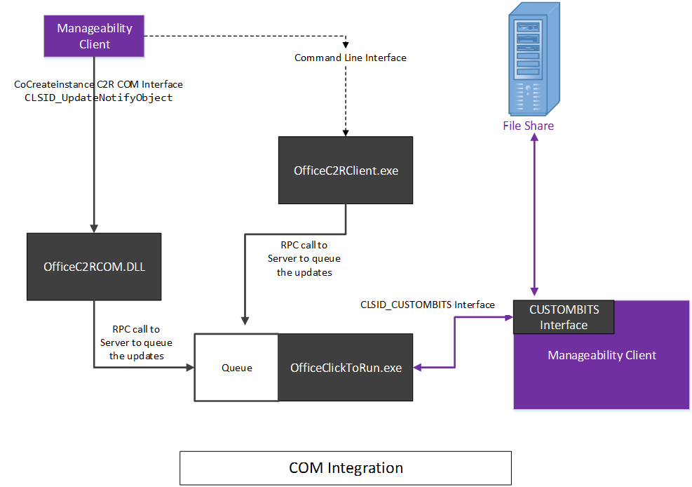

# <a name="integrating-manageability-applications-with-office-365-click-to-run-installer"></a><span data-ttu-id="ad004-103">実行をクリックしてインストーラーを Office 365 管理アプリケーションと統合します。</span><span class="sxs-lookup"><span data-stu-id="ad004-103">Integrating manageability applications with Office 365 click-to-run installer</span></span>

<span data-ttu-id="ad004-104">ソフトウェア管理ソリューションと Office 365 クイック実行インストーラーを統合する方法について説明します。</span><span class="sxs-lookup"><span data-stu-id="ad004-104">Learn how to integrate the Office 365 Click-to-Run installer with a software management solution.</span></span>
  
<span data-ttu-id="ad004-p101">Office 365 クイック実行インストーラーには、IT 担当者およびソフトウェア管理ソリューションがプログラムで更新の管理を制御できるようになる COM インターフェイスが用意されています。このインターフェイスは、Office 展開ツールよりも高度な追加の管理機能を提供します。</span><span class="sxs-lookup"><span data-stu-id="ad004-p101">The Office 365 Click-to-Run installer provides a COM interface that allows IT Professionals and software management solutions programmatic control over update management. This interface provides additional management capabilities beyond what is provided by the Office Deployment Tool.</span></span>
  
> [!NOTE]
> <span data-ttu-id="ad004-107">この記事は、Office 2016 以降および Office 365 に適用されます。</span><span class="sxs-lookup"><span data-stu-id="ad004-107">This article applies to Office 2016 and later, Office 365.</span></span> 
  
## <a name="integrating-with-the-click-to-run"></a><span data-ttu-id="ad004-108">クイック実行との統合</span><span class="sxs-lookup"><span data-stu-id="ad004-108">Integrating with the Click-to-Run</span></span>

<span data-ttu-id="ad004-109">このインターフェイスを使用するには、管理アプリケーションで COM インターフェイスを起動して、クイック実行インストール サービスと直接通信する公開 API を呼び出します。</span><span class="sxs-lookup"><span data-stu-id="ad004-109">To use this interface, a manageability application invokes the COM interface and calls exposed APIs that communicate directly with the Click-to-Run installation service.</span></span> 
  
> [!NOTE]
> <span data-ttu-id="ad004-110">Office クイック実行インストーラーは、インストーラーの動作を制御できるパラメーターを指定して、コマンド ラインから実行できます。詳細は、「[クイック実行用 Office 展開ツール](https://www.microsoft.com/en-us/download/details.aspx?id=49117)」を参照してください。</span><span class="sxs-lookup"><span data-stu-id="ad004-110">The Office Click-to-Run installer can be run from the command-line with parameters that can control the behavior, as documented in [Office Deployment Tool for Click-to-Run](https://www.microsoft.com/en-us/download/details.aspx?id=49117).</span></span> 
  
<span data-ttu-id="ad004-111">**次に、COM インターフェイスの概念図を示します**</span><span class="sxs-lookup"><span data-stu-id="ad004-111">**Following is a conceptual diagram of the COM interface**</span></span>

<span data-ttu-id="ad004-112">![COM インターフェイスを使用して Office の実行をクリックしてインストーラーを次の図にします]。(media/e7ac2523-e67b-4a44-ae67-c048709f872a.png "Office の実行をクリックしてインストーラーを COM インターフェイスを使用して次の図")</span><span class="sxs-lookup"><span data-stu-id="ad004-112"></span></span>
  
<span data-ttu-id="ad004-113">Office 365 クイック実行インストーラーには、COM ベースのインターフェイス **IUpdateNotify** が実装されています。このインターフェイスは、CLSID **CLSID_UpdateNotifyObject** に登録されています。</span><span class="sxs-lookup"><span data-stu-id="ad004-113">The Office 365 Click-to-Run installer implements a COM-based interface, **IUpdateNotify** registered to CLSID **CLSID_UpdateNotifyObject**.</span></span>
  
<span data-ttu-id="ad004-114">このインターフェイスは、次のように呼び出すことができます。</span><span class="sxs-lookup"><span data-stu-id="ad004-114">This interface can be invoked as follows:</span></span>
  
```cpp
hr = CoCreateInstance(CLSID_UpdateNotifyObject, NULL, CLSCTX_ALL,
       IID_IUpdateNotify, 
      (void **)&p); 
```

<span data-ttu-id="ad004-115">クイック実行インストール プログラムは昇格された特権で実行する必要があるので、この呼び出しは、呼び出し元が昇格された特権で実行している場合のみ正常に実行されます。</span><span class="sxs-lookup"><span data-stu-id="ad004-115">The call will only succeed if the caller is running under elevated privileges, as the Click-to-Run installation program must be run with elevated privileges.</span></span>
  
<span data-ttu-id="ad004-116">**IUpdateNotify** COM インターフェイスは、コマンドおよびパラメーターの検証と、クイック実行インストール サービスによる実行のスケジュール設定に利用できる 3 つの非同期関数を公開しています。</span><span class="sxs-lookup"><span data-stu-id="ad004-116">The **IUpdateNotify** COM interface exposes three asynchronous functions responsible for validating the commands and parameters and scheduling execution with the Click-to-Run installation service.</span></span> 
  
```cpp
HRESULT Download([in] LPWSTR pcwszParameters) // Download update content.
HRESULT Apply([in] LPWSTR pcwszParameters) // Apply update content.
HRESULT Cancel() // Cancel the download action.

```

<span data-ttu-id="ad004-117">4 つ目のメソッド **Status** は、最後に実行したコマンドの状態または現在実行中のコマンド状態に関する情報 (成功、失敗、詳細なエラー コードなど) を取得するために使用できます。</span><span class="sxs-lookup"><span data-stu-id="ad004-117">A forth method, **Status**, can be used to get information about the status of the last executed command or the status of the currently executing command (i.e. success, failure, detailed error codes).</span></span>
  
```cpp
HRESULT status([out] _UPDATE_STATUS_REPORT* pUpdateStatusReport) // Get status of current action. 
typedef struct _UPDATE_STATUS_REPORT  
{  
UPDATE_STATUS status;  
UINT error; 
BSTR contentid;  
} UPDATE_STATUS_REPORT;

```

<span data-ttu-id="ad004-118">クイック実行インストール サービスには、そのライフサイクルの間に **IUpdateNotify** メソッドの呼び出しが可能になる 4 つの状態 (起動中、アイドル、ダウンロード中および適用中) が存在します。</span><span class="sxs-lookup"><span data-stu-id="ad004-118">There are four states that the Click-to-Run installation service may be in during its lifecycle, during which **IUpdateNotify** methods may be called; Rebooting, Idle, Downloading and Applying.</span></span> 
  
<span data-ttu-id="ad004-119">**次に、COM インターフェイスの状態マシンの図を示します**</span><span class="sxs-lookup"><span data-stu-id="ad004-119">**Following is the COM Interface State Machine diagram**</span></span>

<span data-ttu-id="ad004-120">![COM インターフェイスの状態の図です]。(media/a409003e-6876-4ab3-bb4c-cd0c0fed5cbb.png "COM インターフェイスの状態の図")</span><span class="sxs-lookup"><span data-stu-id="ad004-120"></span></span>
  
> [!NOTE]
> <span data-ttu-id="ad004-121">**再起動**: クイック実行インストーラー サービスはありません利用可能な期間があるマシンを起動するとします。</span><span class="sxs-lookup"><span data-stu-id="ad004-121">**Rebooting**: When the machine is booting there is a period of time when the Click-to-Run installer service is not available.</span></span> <span data-ttu-id="ad004-122">再起動後に Status メソッドの呼び出しが成功すると、eUPDATE_UNKNOWN が返されます。</span><span class="sxs-lookup"><span data-stu-id="ad004-122">A successful call to the Status method after a reboot will return eUPDATE_UNKNOWN.</span></span> 
  
<span data-ttu-id="ad004-123">**Idle:** クイック実行インストーラーがアイドル状態のときは、以下を呼び出すことができます。</span><span class="sxs-lookup"><span data-stu-id="ad004-123">**Idle:** When the Click-to-Run installer is in the idle state, you can call:</span></span> 
  
- <span data-ttu-id="ad004-124">**Apply**: 以前にダウンロードしたコンテンツをインストールします。</span><span class="sxs-lookup"><span data-stu-id="ad004-124">**Apply**: Install previously downloaded content.</span></span>
    
- <span data-ttu-id="ad004-125">**Cancel**:  `0x800000e`「予期しないときにメソッドが呼び出されました。」を返します。</span><span class="sxs-lookup"><span data-stu-id="ad004-125">**Cancel**: Returns  `0x800000e`, "A method was called at an unexpected time."</span></span>
    
- <span data-ttu-id="ad004-126">**Download**: 後でインストールするために、新しいコンテンツをクライアントにダウンロードします。</span><span class="sxs-lookup"><span data-stu-id="ad004-126">**Download**: Downloads new content to the client for later installation.</span></span>
    
- <span data-ttu-id="ad004-p103">**Status**: 最後に完了したアクションの結果を返すか、アクションがエラーで終了した場合はエラー メッセージを返します。前のアクションがない場合は、 **Status** は  `eUPDATE_UNKNOWN` を返します。</span><span class="sxs-lookup"><span data-stu-id="ad004-p103">**Status**: Returns the result of the last completed action, or an error message if the action ended in failure. If there is no previous action, **Status** returns  `eUPDATE_UNKNOWN`.</span></span>
    
<span data-ttu-id="ad004-129">**Downloading:** クイック実行インストーラーがダウンロード状態のときは、以下のものを呼び出すことができます。</span><span class="sxs-lookup"><span data-stu-id="ad004-129">**Downloading:** When the Click-to-Run installer is in the downloading state, you can call:</span></span> 
  
- <span data-ttu-id="ad004-130">**Apply**: 値  ****、「予期しないときにメソッドが呼び出されました。」の `0x800000e` を返します。</span><span class="sxs-lookup"><span data-stu-id="ad004-130">**Apply**: Returns an **HRESULT** with the value  `0x800000e`, "A method was called at an unexpected time."</span></span>
    
- <span data-ttu-id="ad004-131">**Cancel**: ダウンロードを停止し、一部ダウンロードされたコンテンツを削除します。</span><span class="sxs-lookup"><span data-stu-id="ad004-131">**Cancel**: Stops the download and removes the partially downloaded content.</span></span>
    
- <span data-ttu-id="ad004-132">**Download**: 値  ****、「予期しないときにメソッドが呼び出されました。」の `0x800000e` を返します。</span><span class="sxs-lookup"><span data-stu-id="ad004-132">**Download**: Returns an **HRESULT** with the value  `0x800000e`, "A method was called at an unexpected time."</span></span> 
    
- <span data-ttu-id="ad004-133">**Status**: **DOWNLOAD_WIP** を返して、ダウンロード作業が進行中であることを示します。</span><span class="sxs-lookup"><span data-stu-id="ad004-133">**Status**: Returns **DOWNLOAD_WIP** to indicate that download work is in progress.</span></span> 
    
<span data-ttu-id="ad004-134">**適用中:** クイック実行インストーラーが、以前にダウンロードしたコンテンツのインストール処理中の場合。</span><span class="sxs-lookup"><span data-stu-id="ad004-134">**Applying:** When the Click-to-Run installer is in the process of installing previously download content:</span></span> 
  
- <span data-ttu-id="ad004-135">**Apply**: 値  ****、「予期しないときにメソッドが呼び出されました。」の `0x800000e` を返します。</span><span class="sxs-lookup"><span data-stu-id="ad004-135">**Apply**: Returns an **HRESULT** with the value  `0x800000e`, "A method was called at an unexpected time."</span></span>
    
- <span data-ttu-id="ad004-136">**Cancel**:  `0x800000e` を返します。Apply アクションを取り消すことはできません。</span><span class="sxs-lookup"><span data-stu-id="ad004-136">**Cancel**: Returns  `0x800000e`, the Apply action cannot be canceled.</span></span>
    
- <span data-ttu-id="ad004-137">**Download**: 値  ****、「予期しないときにメソッドが呼び出されました。」の `0x800000e` を返します。</span><span class="sxs-lookup"><span data-stu-id="ad004-137">**Download**: Returns an **HRESULT** with the value  `0x800000e`, "A method was called at an unexpected time."</span></span> 
    
- <span data-ttu-id="ad004-138">**Status**: **APPLY_WIP** を返して、適用作業が進行中であることを示します。</span><span class="sxs-lookup"><span data-stu-id="ad004-138">**Status**: Returns **APPLY_WIP** to indicate that apply work is in progress.</span></span> 
    
> [!NOTE]
> <span data-ttu-id="ad004-139">OfficeC2RCOM は COM + サービスは、動的に読み込まれるので、期待される結果になるようにするには、このクラスのメソッドを呼び出すたびに、 **CoCreateInstance**をコールする必要があります。</span><span class="sxs-lookup"><span data-stu-id="ad004-139">Since OfficeC2RCOM is a COM+ service and is dynamically loaded, you need to call **CoCreateInstance** every time you call a method on this class to ensure that you get the expected result.</span></span> <span data-ttu-id="ad004-140">この COM+ サービスは必要に応じて新しいインスタンスの作成を処理します。</span><span class="sxs-lookup"><span data-stu-id="ad004-140">The COM+ service will handle creating a new instance if necessary.</span></span> <span data-ttu-id="ad004-141">いずれかのメソッドが初めて呼び出されるときに、COM+ は **IUpdateNotify** オブジェクトを読み込んで、そのオブジェクトを dllhost.exe インスタンスの 1 つで実行します。</span><span class="sxs-lookup"><span data-stu-id="ad004-141">When one of the methods is called for the first time, COM+ will load the **IUpdateNotify** object and run it within one of the dllhost.exe instances.</span></span> <span data-ttu-id="ad004-142">新しいオブジェクトは約 3 分間アイドル状態でアクティブになります。</span><span class="sxs-lookup"><span data-stu-id="ad004-142">The new object will stay active for about 3 minutes in idle.</span></span> <span data-ttu-id="ad004-143">前回の呼び出しから 3 分以内に後続の呼び出しが行われると、 **IUpdateNotify** オブジェクトは読み込まれたままで、新しいインスタンスは作成されません。</span><span class="sxs-lookup"><span data-stu-id="ad004-143">If a subsequent call is made within three minutes of the last call, the **IUpdateNotify** object will remain loaded and a new instance is not created.</span></span> <span data-ttu-id="ad004-144">3 分以内に呼び出しが行われないと、IUpdateNotify オブジェクトはアンロードされ、その後の呼び出しでは新しい **IUpdateNotify** オブジェクトが作成されます。</span><span class="sxs-lookup"><span data-stu-id="ad004-144">If no call is made within three minutes, the IUpdateNotify object will be unloaded and a new **IUpdateNotify** object will be created when the next call is made.</span></span> 
  
## <a name="click-to-run-installer-com-api-reference-guide"></a><span data-ttu-id="ad004-145">クイック実行インストーラー COM API リファレンス ガイド</span><span class="sxs-lookup"><span data-stu-id="ad004-145">Click-to-Run installer COM API reference guide</span></span>

<span data-ttu-id="ad004-146">以下の API リファレンス ドキュメントでは、次のようになっています。</span><span class="sxs-lookup"><span data-stu-id="ad004-146">In the following API reference documentation:</span></span>
  
- <span data-ttu-id="ad004-147">パラメーターは、スペースで区切られたキー/値ペアの形式です。</span><span class="sxs-lookup"><span data-stu-id="ad004-147">Parameters are in a key/value pair format separated by a space.</span></span>
    
- <span data-ttu-id="ad004-148">パラメーターでは大文字小文字は区別されません。</span><span class="sxs-lookup"><span data-stu-id="ad004-148">The parameters are not case-sensitive.</span></span>
    
- <span data-ttu-id="ad004-149">[パラメーターのリスト](https://blogs.technet.microsoft.com/odsupport/2014/03/03/the-new-update-now-feature-for-office-2013-click-to-run-for-office365-and-its-associated-command-line-and-switches/)と説明を利用できます。</span><span class="sxs-lookup"><span data-stu-id="ad004-149">There is a [list of parameters](https://blogs.technet.microsoft.com/odsupport/2014/03/03/the-new-update-now-feature-for-office-2013-click-to-run-for-office365-and-its-associated-command-line-and-switches/) with documentation available.</span></span> 
    
- <span data-ttu-id="ad004-150">IUpdateNotify2 インターフェイスの概要が含まれるようになりました。</span><span class="sxs-lookup"><span data-stu-id="ad004-150">Summary of IUpdateNotify2 interface is now included.</span></span>
    
### <a name="apply"></a><span data-ttu-id="ad004-151">Apply</span><span class="sxs-lookup"><span data-stu-id="ad004-151">Apply</span></span>

```cpp
HRESULT Apply([in] LPWSTR pcwszParameters) // Apply update content.
```

#### <a name="parameters"></a><span data-ttu-id="ad004-152">Parameters</span><span class="sxs-lookup"><span data-stu-id="ad004-152">Parameters</span></span>

-  <span data-ttu-id="ad004-p105">_displaylevel_: 更新処理中のインストールの状態 (エラーを含む) を表示する場合は **true** に設定します。更新処理中のインストールの状態 (エラーを含む) を非表示にする場合は **false** に設定します。既定値は **false** です。</span><span class="sxs-lookup"><span data-stu-id="ad004-p105">_displaylevel_: **true** to show the installation status, including errors, during the update process; **false** to hide the installation status, including errors, during the update process. The default is **false**.</span></span>
    
-  <span data-ttu-id="ad004-p106">_forceappshutdown_: **Apply** アクションがトリガーされた直後に Office アプリケーションを強制的にシャット ダウンする場合は **true** に設定します。 **false** に設定した場合、実行中の Office アプリケーションがあると失敗します。既定値は **false** です。詳細は、「 [注釈](#bk_ApplyRemark)」を参照してください。</span><span class="sxs-lookup"><span data-stu-id="ad004-p106">_forceappshutdown_: **true** to force Office applications to shut down immediately when the **Apply** action is triggered; **false** to fail if any Office applications are running. The default is **false**. See [Remarks](#bk_ApplyRemark) for more information.</span></span> 
    
  <span data-ttu-id="ad004-p107">**Apply** アクションがトリガーされた時にいずれかの Office アプリケーションが実行中の場合、通常 **Apply** アクションは失敗します。  `forceappshutdown=true` が **Apply** メソッドに渡されると、 **OfficeClickToRun** サービスは即時にアプリケーションをシャットダウンし、更新プログラムを適用します。この場合、データの損失が発生する可能性があります。</span><span class="sxs-lookup"><span data-stu-id="ad004-p107">If any Office application is running when the **Apply** action is triggered, the **Apply** action will usually fail. Passing  `forceappshutdown=true` to the **Apply** method will cause the **OfficeClickToRun** service to immediately shut down the applications and apply the update. The user may experience data loss in this case.</span></span> 
    
#### <a name="return-results"></a><span data-ttu-id="ad004-161">返される結果</span><span class="sxs-lookup"><span data-stu-id="ad004-161">Return results</span></span>

|||
|:-----|:-----|
|<span data-ttu-id="ad004-162">**S_OK**</span><span class="sxs-lookup"><span data-stu-id="ad004-162">**S_OK**</span></span> <br/> |<span data-ttu-id="ad004-163">アクションが、実行のためにクイック実行サービスに正常に送られました。</span><span class="sxs-lookup"><span data-stu-id="ad004-163">Action was successfully submitted to the Click-To-Run service for execution.</span></span>  <br/> |
|<span data-ttu-id="ad004-164">**E_ACCESSDENIED**</span><span class="sxs-lookup"><span data-stu-id="ad004-164">**E_ACCESSDENIED**</span></span> <br/> |<span data-ttu-id="ad004-165">呼び出し元が、昇格された特権で実行していません。</span><span class="sxs-lookup"><span data-stu-id="ad004-165">The caller is not running with elevated privileges.</span></span>  <br/> |
|<span data-ttu-id="ad004-166">**E_INVALIDARG**</span><span class="sxs-lookup"><span data-stu-id="ad004-166">**E_INVALIDARG**</span></span> <br/> |<span data-ttu-id="ad004-167">無効なパラメーターが渡されました。</span><span class="sxs-lookup"><span data-stu-id="ad004-167">Invalid parameters were passed.</span></span>  <br/> |
|<span data-ttu-id="ad004-168">**E_ILLEGAL_METHOD_CALL**</span><span class="sxs-lookup"><span data-stu-id="ad004-168">**E_ILLEGAL_METHOD_CALL**</span></span> <br/> |<span data-ttu-id="ad004-p108">この時点では、アクションは許可されていません。詳細については、「[注釈 ](#bk_ApplyRemark)」を参照してください。  </span><span class="sxs-lookup"><span data-stu-id="ad004-p108">Action is not allowed at this time. See [Remarks](#bk_ApplyRemark) for more information.  </span></span><br/> |

<a name="bk_ApplyRemark"></a>

#### <a name="remarks"></a><span data-ttu-id="ad004-171">Remarks</span><span class="sxs-lookup"><span data-stu-id="ad004-171">Remarks</span></span>

- <span data-ttu-id="ad004-p109">**Apply** アクションがトリガーされたときに実行中の Office アプリケーションがあると **Apply** アクションは失敗します。  `forceappshutdown=true` が **Apply** メソッドに渡されると、その直後に **OfficeClickToRun** サービスは実行中の Office アプリケーションをシャットダウンして更新プログラムを適用します。開いているドキュメントの変更内容を保存するように求めるダイアログが表示されないため、ユーザーはデータを損失する可能性があります。</span><span class="sxs-lookup"><span data-stu-id="ad004-p109">If any Office application is running when the **Apply** action is triggered, the **Apply** action will fail. Passing  `forceappshutdown=true` to the **Apply** method will cause the **OfficeClickToRun** service to immediately shut down any Office applications that are running and apply the update. The user may experience data as they are not prompted to save changes to open documents..</span></span> 
    
- <span data-ttu-id="ad004-175">このアクションは、COM の状態が次のいずれかのときにのみトリガーできます。</span><span class="sxs-lookup"><span data-stu-id="ad004-175">This action can only be triggered when the COM status is one of the following:</span></span> 
    
  - <span data-ttu-id="ad004-176">**eUPDATE_UNKNOWN**</span><span class="sxs-lookup"><span data-stu-id="ad004-176">**eUPDATE_UNKNOWN**</span></span>
    
  - <span data-ttu-id="ad004-177">**eDOWNLOAD_CANCELLED**</span><span class="sxs-lookup"><span data-stu-id="ad004-177">**eDOWNLOAD_CANCELLED**</span></span>
    
  - <span data-ttu-id="ad004-178">**eDOWNLOAD_FAILED**</span><span class="sxs-lookup"><span data-stu-id="ad004-178">**eDOWNLOAD_FAILED**</span></span>
    
  - <span data-ttu-id="ad004-179">**eDOWNLOAD_SUCCEEDED**</span><span class="sxs-lookup"><span data-stu-id="ad004-179">**eDOWNLOAD_SUCCEEDED**</span></span>
    
  - <span data-ttu-id="ad004-180">**eAPPLY_SUCCEEDED**</span><span class="sxs-lookup"><span data-stu-id="ad004-180">**eAPPLY_SUCCEEDED**</span></span>
    
  - <span data-ttu-id="ad004-181">**eAPPLY_FAILED**</span><span class="sxs-lookup"><span data-stu-id="ad004-181">**eAPPLY_FAILED**</span></span>
    
- <span data-ttu-id="ad004-182">以前にダウンロードしたコンテンツがない状態で **Apply** メソッドを呼び出すと、 **Apply** メソッドは **Succeeded** を報告します。これは、このメソッドが適用するものがないことを検出して、 **Apply** 処理を正常に完了したことを示します。</span><span class="sxs-lookup"><span data-stu-id="ad004-182">If you call the **Apply** method without previously downloading content, the **Apply** method will report **Succeeded** as it detected nothing to apply and completed the **Apply** process successfully.</span></span> 
    
### <a name="cancel"></a><span data-ttu-id="ad004-183">Cancel</span><span class="sxs-lookup"><span data-stu-id="ad004-183">Cancel</span></span>

```cpp
HRESULT Cancel() // Cancel the download action.
```

#### <a name="return-results"></a><span data-ttu-id="ad004-184">返される結果</span><span class="sxs-lookup"><span data-stu-id="ad004-184">Return results</span></span>

|||
|:-----|:-----|
|<span data-ttu-id="ad004-185">S_OK</span><span class="sxs-lookup"><span data-stu-id="ad004-185">S_OK</span></span>  <br/> |<span data-ttu-id="ad004-186">アクションが、実行のためにクイック実行サービスに正常に送られました。</span><span class="sxs-lookup"><span data-stu-id="ad004-186">Action was successfully submitted to the Click-to-Run service for execution.</span></span>  <br/> |
|<span data-ttu-id="ad004-187">E_ILLEGAL_METHOD_CALL</span><span class="sxs-lookup"><span data-stu-id="ad004-187">E_ILLEGAL_METHOD_CALL</span></span>  <br/> |<span data-ttu-id="ad004-p110">この時点では、アクションは許可されていません。詳細については、「[注釈 ](#bk_CancelRemarks)」セクションを参照してください。  </span><span class="sxs-lookup"><span data-stu-id="ad004-p110">Action is not allowed at this time. See the [Remarks](#bk_CancelRemarks) section for more information  </span></span><br/> |

<a name="bk_CancelRemarks"></a>

#### <a name="remarks"></a><span data-ttu-id="ad004-190">Remarks</span><span class="sxs-lookup"><span data-stu-id="ad004-190">Remarks</span></span>

- <span data-ttu-id="ad004-p111">このメソッドは、COM 状態 ID **eDOWNLOAD_WIP** の場合のみトリガーできます。このメソッドは現在のダウンロード アクションを取り消そうとします。COM 状態は **eDOWNLOAD_CANCELLING** に変わり、最終的に **eDOWNLOAD_CANCELED** に変わります。これ以外の場合にトリガーすると、COM 状態は **E_ILLEGAL_METHOD_CALL** を返します。</span><span class="sxs-lookup"><span data-stu-id="ad004-p111">This method can only be triggered when the COM status id **eDOWNLOAD_WIP**. It will attempt to cancel the current download action. The COM status will change to **eDOWNLOAD_CANCELLING** and eventually change to **eDOWNLOAD_CANCELED**. The COM status will return **E_ILLEGAL_METHOD_CALL** if triggered at any other time.</span></span> 
    
### <a name="download"></a><span data-ttu-id="ad004-195">Download</span><span class="sxs-lookup"><span data-stu-id="ad004-195">Download</span></span>

```cpp
HRESULT Download([in] LPWSTR pcwszParameters) // Download update content.
```

#### <a name="parameters"></a><span data-ttu-id="ad004-196">Parameters</span><span class="sxs-lookup"><span data-stu-id="ad004-196">Parameters</span></span>

-  <span data-ttu-id="ad004-p112">_displaylevel_: 更新処理中のインストールの状態 (エラーを含む) を表示する場合は **true** に設定します。更新処理中のインストールの状態 (エラーを含む) を非表示にする場合は **false** に設定します。既定値は **false** です。</span><span class="sxs-lookup"><span data-stu-id="ad004-p112">_displaylevel_: **true** to show the installation status, including errors, during the update process; **false** to hide the installation status, including errors, during the update process. The default is **false**.</span></span>
    
-  <span data-ttu-id="ad004-199">_updatebaseurl_: 代替ダウンロード ソースへの URL です。</span><span class="sxs-lookup"><span data-stu-id="ad004-199">_updatebaseurl_: URL to the alternate download source.</span></span>
    
-  <span data-ttu-id="ad004-p113">_updatetoversion_: このバージョンに Office を更新します。このパラメーターは、現在インストールされているバージョンよりも古いバージョンに更新する場合に定義します。</span><span class="sxs-lookup"><span data-stu-id="ad004-p113">_updatetoversion_: The version to update Office to. Define this parameter if you want to update to an older version than the version that is currently installed.</span></span>
    
-  <span data-ttu-id="ad004-202">_downloadsource_: カスタマイズされた **IBackgroundCopyManager** の実装 (BITS マネージャー) の CLSID です。</span><span class="sxs-lookup"><span data-stu-id="ad004-202">_downloadsource_: CLSID of the customized **IBackgroundCopyManager** implementation (BITS manager).</span></span> 
    
-  <span data-ttu-id="ad004-p114">_contentid_: カスタマイズされた BITS マネージャーのコンテンツ サーバーからダウンロードするコンテンツを識別します。この値は、解釈のために BITS インターフェイスを介して渡されます。</span><span class="sxs-lookup"><span data-stu-id="ad004-p114">_contentid_: Identifies the content to download from the content server through the customized BITS manager. This value is passed through the BITS interface for interpretation.</span></span>
    
#### <a name="return-results"></a><span data-ttu-id="ad004-205">返される結果</span><span class="sxs-lookup"><span data-stu-id="ad004-205">Return results</span></span>

|||
|:-----|:-----|
|<span data-ttu-id="ad004-206">**S_OK**</span><span class="sxs-lookup"><span data-stu-id="ad004-206">**S_OK**</span></span> <br/> |<span data-ttu-id="ad004-207">アクションが、実行のためにクイック実行サービスに正常に送られました。</span><span class="sxs-lookup"><span data-stu-id="ad004-207">Action was successfully submitted to the Click-To-Run service for execution.</span></span>  <br/> |
|<span data-ttu-id="ad004-208">**E_ACCESSDENIED**</span><span class="sxs-lookup"><span data-stu-id="ad004-208">**E_ACCESSDENIED**</span></span> <br/> |<span data-ttu-id="ad004-209">呼び出し元が、昇格された特権で実行していません。</span><span class="sxs-lookup"><span data-stu-id="ad004-209">The caller is not running with elevated privileges.</span></span>  <br/> |
|<span data-ttu-id="ad004-210">**E_INVALIDARG**</span><span class="sxs-lookup"><span data-stu-id="ad004-210">**E_INVALIDARG**</span></span> <br/> |<span data-ttu-id="ad004-211">無効なパラメーターが渡されました。</span><span class="sxs-lookup"><span data-stu-id="ad004-211">Invalid parameters were passed.</span></span>  <br/> |
|<span data-ttu-id="ad004-212">**E_ILLEGAL_METHOD_CALL**</span><span class="sxs-lookup"><span data-stu-id="ad004-212">**E_ILLEGAL_METHOD_CALL**</span></span> <br/> |<span data-ttu-id="ad004-p115">この時点では、アクションは許可されていません。詳細については、「[注釈 ](#bk_DownloadRemark)」を参照してください。  </span><span class="sxs-lookup"><span data-stu-id="ad004-p115">Action is not allowed at this time. See [Remarks](#bk_DownloadRemark) for more information.  </span></span><br/> |

<a name="bk_DownloadRemark"></a>

#### <a name="remarks"></a><span data-ttu-id="ad004-215">Remarks</span><span class="sxs-lookup"><span data-stu-id="ad004-215">Remarks</span></span>

- <span data-ttu-id="ad004-p116">_downloadsource_ と  _contentid_ をペアとして指定する必要があります。ペアで指定しないと、 **Download** メソッドは **E_INVALIDARG** エラーを返します。</span><span class="sxs-lookup"><span data-stu-id="ad004-p116">You must specify  _downloadsource_ and  _contentid_ as a pair. If not, the **Download** method will return an **E_INVALIDARG** error.</span></span> 
    
- <span data-ttu-id="ad004-218">_downloadsource_、 _contentid_、 _updatebaseurl_ を指定すると、  _updatebaseurl_ は無視されます。</span><span class="sxs-lookup"><span data-stu-id="ad004-218">If  _downloadsource_,  _contentid_, and  _updatebaseurl_ are provided,  _updatebaseurl_ will be ignored.</span></span> 
    
- <span data-ttu-id="ad004-219">このアクションは、COM の状態が次のいずれかのときにのみトリガーできます。</span><span class="sxs-lookup"><span data-stu-id="ad004-219">This action can only be triggered when the COM status is one of the following:</span></span> 
    
  - <span data-ttu-id="ad004-220">**eUPDATE_UNKNOWN**</span><span class="sxs-lookup"><span data-stu-id="ad004-220">**eUPDATE_UNKNOWN**</span></span>
    
  - <span data-ttu-id="ad004-221">**eDOWNLOAD_CANCELLED**</span><span class="sxs-lookup"><span data-stu-id="ad004-221">**eDOWNLOAD_CANCELLED**</span></span>
    
  - <span data-ttu-id="ad004-222">**eDOWNLOAD_FAILED**</span><span class="sxs-lookup"><span data-stu-id="ad004-222">**eDOWNLOAD_FAILED**</span></span>
    
  - <span data-ttu-id="ad004-223">**eDOWNLOAD_SUCCEEDED**</span><span class="sxs-lookup"><span data-stu-id="ad004-223">**eDOWNLOAD_SUCCEEDED**</span></span>
    
  - <span data-ttu-id="ad004-224">**eAPPLY_SUCCEEDED**</span><span class="sxs-lookup"><span data-stu-id="ad004-224">**eAPPLY_SUCCEEDED**</span></span>
    
  - <span data-ttu-id="ad004-225">**eAPPLY_FAILED**</span><span class="sxs-lookup"><span data-stu-id="ad004-225">**eAPPLY_FAILED**</span></span>
    
- <span data-ttu-id="ad004-226">以前にダウンロードしたコンテンツがない状態で **Apply** メソッドを呼び出すと、 **Apply** メソッドは **Succeeded** を報告します。それはこのメソッドが、適用されたものがないことを検出し、 **Apply** 処理を正常に完了したことを示します。</span><span class="sxs-lookup"><span data-stu-id="ad004-226">If you call the **Apply** method without previously downloaded content, the **Apply** method will report **Succeeded** as it detected nothing to apply and completed the **Apply** process successfully.</span></span> 
    
#### <a name="examples"></a><span data-ttu-id="ad004-227">Examples</span><span class="sxs-lookup"><span data-stu-id="ad004-227">Examples</span></span>

- <span data-ttu-id="ad004-228">カスタマイズした BITS マネージャーからコンテンツをダウンロードするには、次のパラメーターを渡す **download()** 関数を呼び出します。</span><span class="sxs-lookup"><span data-stu-id="ad004-228">To download the content from the customized BITS manager: Call the **download()** function passing the following parameters:</span></span> 
    
  ```cpp
  "downloadsource=CLSIDofBITSInterface contentid=BITSServerContentIdentifier"
  ```

- <span data-ttu-id="ad004-229">Microsoft CDN からコンテンツをダウンロードするには、 **downloadsource**、 _contentid_、 _updatebaseurl_ パラメーターを指定しないで _download()_ 関数を呼び出します。</span><span class="sxs-lookup"><span data-stu-id="ad004-229">To download the content from the Microsoft CDN: Call the **download()** function without specifying the  _downloadsource_,  _contentid_, or  _updatebaseurl_ parameters.</span></span> 
    
- <span data-ttu-id="ad004-230">カスタマイズした場所からコンテンツをダウンロードするには、次のパラメーターを渡す **download()** 関数を呼び出します。</span><span class="sxs-lookup"><span data-stu-id="ad004-230">To download the content from a customized location: Call the **download()** function passing the following parameter:</span></span> 
    
  ```cpp
  "updatebaseurl=yourcontentserverurl"
  ```

### <a name="status"></a><span data-ttu-id="ad004-231">Status</span><span class="sxs-lookup"><span data-stu-id="ad004-231">Status</span></span>

```cpp
typdef struct _UPDATE_STATUS_REPORT
{
    UPDATE_STATUS status;
    UINT error;
    LPCWSTR contentid;
}UPDATE_STATUS_REPORT;
HRESULT status([out] _UPDATE_STATUS_REPORT& pUpdateStatusReport) // Get status of current action
```

#### <a name="parameters"></a><span data-ttu-id="ad004-232">Parameters</span><span class="sxs-lookup"><span data-stu-id="ad004-232">Parameters</span></span>

|||
|:-----|:-----|
| <span data-ttu-id="ad004-233">_pUpdateStatusReport_</span><span class="sxs-lookup"><span data-stu-id="ad004-233">_pUpdateStatusReport_</span></span> <br/> |<span data-ttu-id="ad004-234">UPDATE_STATUS_REPORT 構造体を指すポインターです。</span><span class="sxs-lookup"><span data-stu-id="ad004-234">Pointer to an UPDATE_STATUS_REPORT structure.</span></span>  <br/> |
   
#### <a name="return-results"></a><span data-ttu-id="ad004-235">返される結果</span><span class="sxs-lookup"><span data-stu-id="ad004-235">Return results</span></span>

|||
|:-----|:-----|
|<span data-ttu-id="ad004-236">**S_OK**</span><span class="sxs-lookup"><span data-stu-id="ad004-236">**S_OK**</span></span> <br/> |<span data-ttu-id="ad004-p117">**Status** メソッドは、常にこの結果を返します。現在のアクションの状態については、  `UPDATE_STATUS_RESULT` 構造体を調べます。  </span><span class="sxs-lookup"><span data-stu-id="ad004-p117">The **Status** method always returns this result. Inspect the  `UPDATE_STATUS_RESULT` structure for the status of the current action.  </span></span><br/> |
   
#### <a name="remarks"></a><span data-ttu-id="ad004-239">Remarks</span><span class="sxs-lookup"><span data-stu-id="ad004-239">Remarks</span></span>

- <span data-ttu-id="ad004-p118">`UPDATE_STATUS_REPORT` の状態フィールドには、現在のアクションの状態が含まれています。次のいずれかの状態値が返されます。</span><span class="sxs-lookup"><span data-stu-id="ad004-p118">The status field of the  `UPDATE_STATUS_REPORT` contains the status of the current action. One of the following status values is returned:</span></span> 
    
  ```cpp
  typedef enum _UPDATE_STATUS
  {
  eUPDATE_UNKNOWN = 0,
  eDOWNLOAD_PENDING,
  eDOWNLOAD_WIP,
  eDOWNLOAD_CANCELLING,
  eDOWNLOAD_CANCELLED,
  eDOWNLOAD_FAILED,
  eDOWNLOAD_SUCCEEDED,
  eAPPLY_PENDING,
  eAPPLY_WIP,
  eAPPLY_SUCCEEDED,
  eAPPLY_FAILED,
  } UPDATE_STATUS;
  
  ```

- <span data-ttu-id="ad004-p119">前回実行したコマンドがエラーになると、そのエラーに関する詳細が  `UPDATE_STATUS_REPORT` のエラー フィールドに入ります。2 種類のエラー コードが **Status** メソッドから返されます。</span><span class="sxs-lookup"><span data-stu-id="ad004-p119">If the last command resulted in an error, the error field of the  `UPDATE_STATUS_REPORT` contains detailed information about the error. Two types of error codes are returned from the **Status** method.</span></span> 
    
- <span data-ttu-id="ad004-244">`UDPATE_ERROR_CODE::eUNKNOWN` より少ないエラーは、次の事前に定義されたエラー コードのいずれかになります。</span><span class="sxs-lookup"><span data-stu-id="ad004-244">If the error less than  `UDPATE_ERROR_CODE::eUNKNOWN`, the error is one of the following pre-defined error codes:</span></span>
    
  ```cpp
  typedef enum _UPDATE_ERROR_CODE
  {
  eOK = 0,
  eFAILED_UNEXPECTED,
  eTRIGGER_DISABLED,
  ePIPELINE_IN_USE,
  eFAILED_STOP_C2RSERVICE,
  eFAILED_GET_CLIENTUPDATEFOLDER,
  eFAILED_LOCK_PACKAGE_TO_UPDATE,
  eFAILED_CREATE_STREAM_SESSION,
  eFAILED_PUBLISH_WORKING_CONFIGURATION,
  eFAILED_DOWNLOAD_UPGRADE_PACKAGE,
  eFAILED_APPLY_UPGRADE_PACKAGE,
  eFAILED_INITIALIZE_RSOD,
  eFAILED_PUBLISH_RSOD,
  // Keep this one as the last
  eUNKNOWN
  } UPDATE_ERROR_CODE;
  
  ```

  <span data-ttu-id="ad004-p120">リターン エラー コードが  `UDPATE_ERROR_CODE::eUNKNOWN` より大きい場合、そのコードは失敗した関数呼び出しの **HRESULT** になります。HRESULT を抽出するには、  `UDPATE_ERROR_CODE::eUNKNOWN` のエラー フィールドで返された値から  `UPDATE_STATUS_REPORT` を減算します。</span><span class="sxs-lookup"><span data-stu-id="ad004-p120">If the return error code is larger than  `UDPATE_ERROR_CODE::eUNKNOWN` it is the **HRESULT** of a failed function call. To extract the HRESULT subtract  `UDPATE_ERROR_CODE::eUNKNOWN` from the value returned in the error field of the  `UPDATE_STATUS_REPORT`.</span></span>
    
  <span data-ttu-id="ad004-247">状態とエラー値の完全なリストは、OfficeC2RCom.dll に埋め込まれている **IUpdateNotify** タイプ ライブラリを調べることで確認できます。</span><span class="sxs-lookup"><span data-stu-id="ad004-247">The complete list of status and error values can be viewed by inspecting the **IUpdateNotify** type library embedded in OfficeC2RCom.dll.</span></span> 
    
- <span data-ttu-id="ad004-248">Contentid フィールドは、**ダウンロード**を開始しましたし、**ダウンロード**の呼び出しに渡された contentid が返されます、**状態**への呼び出しに使用されます。</span><span class="sxs-lookup"><span data-stu-id="ad004-248">The contentid field is used for calls to **Status** after **Download** has initiated and returns the contentid that was passed in to the **Download** call.</span></span> <span data-ttu-id="ad004-249">このフィールドは、 **Status** メソッドの呼び出し前に **null** に初期化し、 **Status** が返されてから値を確認するようにしてください。</span><span class="sxs-lookup"><span data-stu-id="ad004-249">It is a best practice to initialize this field to **null** before you call the **Status** method and then check the value after **Status** has been returned.</span></span> <span data-ttu-id="ad004-250">この値が **null** のままの場合は、返す contentid がないことを意味します。</span><span class="sxs-lookup"><span data-stu-id="ad004-250">If the value is still **null**, that means there is no contentid to return.</span></span> <span data-ttu-id="ad004-251">この値が **null** 以外の場合は、 **SysFreeString()** の呼び出しで解放する必要があります。</span><span class="sxs-lookup"><span data-stu-id="ad004-251">If the value is not **null**, you need to free it with a call to **SysFreeString()**.</span></span> <span data-ttu-id="ad004-252">次のコード スニペットは、 **Download** の後で **Status** を呼び出す方法を示しています。</span><span class="sxs-lookup"><span data-stu-id="ad004-252">Here is a code snippet of how to call **Status** after **Download**.</span></span>
    
  ```cpp
  std::wstring contentID;
  UPDATE_STATUS_REPORT statusReport;
  statusReport.status = eUPDATE_UNKNOWN;
  statusReport.error = eOK;
  statusReport.contentid = NULL;
  hr = p->Status(&statusReport);
  if (statusReport.contentid != NULL)
  {
  contentID = statusReport.contentid;
  SysFreeString(statusReport.contentid);
  }
  wprintf(L"ContentID: %s, Status: %d, LastError: %d", contentID.c_str(), statusReport.status, statusReport.error);
  
  ```

### <a name="summary-of-iupdatenotify2-interface"></a><span data-ttu-id="ad004-253">IUpdateNotify2 インターフェイスの概要</span><span class="sxs-lookup"><span data-stu-id="ad004-253">Summary of IUpdateNotify2 interface</span></span>

> [!NOTE]
> <span data-ttu-id="ad004-p122">この概要は、「[管理容易性アプリケーションと Office 365 クイック実行インストーラーの統合](https://msdn.microsoft.com/ja-jp/library/office/mt608768.aspx)」の補完情報として提供します。パブリック ドキュメントの更新後は、このドキュメントは廃止と見なされます。</span><span class="sxs-lookup"><span data-stu-id="ad004-p122">This summary is provided as a compliment info to [Integrating manageability applications with the Office 365 click-to-run installer](https://msdn.microsoft.com/ja-jp/library/office/mt608768.aspx). Once the public doc is updated, this doc can be considered as obsolete.</span></span> 
  
<span data-ttu-id="ad004-p123">C2RTenant [16.0.8208.6352](http://oloop/BuildGroup/Details/tenantc2rclient#3519/1255278) (最初の一般公開ビルドは 6 月のフォーク ビルド 8326.\* になります) 以降に、新しい **IUpdateNotify2** インターフェイスが追加されています。次に、このインターフェイスに関する基本情報の一部を示します。</span><span class="sxs-lookup"><span data-stu-id="ad004-p123">From C2RTenant [16.0.8208.6352](http://oloop/BuildGroup/Details/tenantc2rclient#3519/1255278) (First publicly available build should be June fork build -- 8326.\*) we have added a new **IUpdateNotify2** interface. Here is some basic info about this interface:</span></span> 
  
- <span data-ttu-id="ad004-258">CLSID_UpdateNotifyObject2, {52C2F9C2-F1AC-4021-BF50-756A5FA8DDFE}</span><span class="sxs-lookup"><span data-stu-id="ad004-258">CLSID_UpdateNotifyObject2, {52C2F9C2-F1AC-4021-BF50-756A5FA8DDFE}</span></span>
    
- <span data-ttu-id="ad004-p124">このインターフェイスは、下位互換性を実現するために元の IUpdateNotify インターフェイスもホストします。つまり、このインターフェイスを使用すると、 **UpdateNotifyObject** インターフェイスで提供されるすべてのメソッドにアクセスできるようになります。</span><span class="sxs-lookup"><span data-stu-id="ad004-p124">This interface also hosted the original IUpdateNotify interface to provide backward compatibility. Which means if you use this interface, you have access to all the methods provided in **UpdateNotifyObject** interface.</span></span> 
    
- <span data-ttu-id="ad004-261">IUpdateNotify2 には、次の新しいメソッドが追加されています。</span><span class="sxs-lookup"><span data-stu-id="ad004-261">New methods added to IUpdateNotify2:</span></span>
    
  - <span data-ttu-id="ad004-p125">**HRESULT** GetBlockingApps([out] BSTR \* AppsList)。更新をブロックしているアプリのリストを取得します。この呼び出しにより、更新処理の進行をブロックする実行中の Office アプリが返されます。</span><span class="sxs-lookup"><span data-stu-id="ad004-p125">**HRESULT** GetBlockingApps([out] BSTR \* AppsList). Get updates blocking apps list. This call will return running Office apps which will block the update process from proceeding.</span></span> 
    
  - <span data-ttu-id="ad004-p126">**HRESULT** GetOfficeDeploymentData([in] int dataType, [in] **LPCWSTR** pcwszName, [out] BSTR \* OfficeData)。Office 展開データを取得します。</span><span class="sxs-lookup"><span data-stu-id="ad004-p126">**HRESULT** GetOfficeDeploymentData([in] int dataType, [in] **LPCWSTR** pcwszName, [out] BSTR \* OfficeData). Get Office deployment Data.</span></span> 
    
- <span data-ttu-id="ad004-267">新しいメソッドを使用する場合は、確認する必要があります。</span><span class="sxs-lookup"><span data-stu-id="ad004-267">If you want to use the new methods, you need to make sure:</span></span>
    
  - <span data-ttu-id="ad004-268">C2R バージョンが上記のビルドよりも新しい場合は (\>年 6 月フォークのビルドを =)。</span><span class="sxs-lookup"><span data-stu-id="ad004-268">Your C2R version is newer than the above build (\>= June fork build).</span></span>
    
  - <span data-ttu-id="ad004-269">**CoCreateInstance** の呼び出しには、 **UpdateNotifyObject** ではなく UpdateNotifyObject2 を使用すること。</span><span class="sxs-lookup"><span data-stu-id="ad004-269">Use UpdateNotifyObject2, instead of **UpdateNotifyObject** to call **CoCreateInstance**.</span></span>
    
<span data-ttu-id="ad004-p127">新しいメソッドを使用しない場合は、何も変更する必要はありません。すべての既存のメソッドは、以前とまったく同じ方法で動作します。</span><span class="sxs-lookup"><span data-stu-id="ad004-p127">If you don't use any of the new methods, you don't need to change anything. All the existing methods will work as exact the same way as before.</span></span>
  
## <a name="implementing-the-bits-interface"></a><span data-ttu-id="ad004-272">BITS インターフェイスの実装</span><span class="sxs-lookup"><span data-stu-id="ad004-272">Implementing the BITS interface</span></span>

<span data-ttu-id="ad004-p128">[Background Intelligent Transfer Service](https://msdn.microsoft.com/ja-jp/library/bb968799(v=vs.85).aspx) (BITS) は、クライアントとサーバーの間でファイルを転送するための Microsoft が提供するサービスです。BITS は、Office クイック実行インストーラーがコンテンツのダウンロードに使用できるチャネルの 1 つです。既定では、Office クイック実行インストーラーは、Windows に組み込まれている BITS の実装を使用して、CDN からコンテンツをダウンロードします。</span><span class="sxs-lookup"><span data-stu-id="ad004-p128">The [Background Intelligent Transfer Service](https://msdn.microsoft.com/ja-jp/library/bb968799(v=vs.85).aspx) (BITS) is a service provided by Microsoft to transfer files between a client and server. BITS is one of the channels that Office Click-To-Run installer can use to download content. By default, the Office Click-To-Run installer uses the Windows' built in implementation of BITS to download the content from the CDN.</span></span> 
  
<span data-ttu-id="ad004-p129">カスタマイズされた BITS の実装を **IUpdateNotify** インターフェイスの **download()** メソッドに提供すると、管理ソフトウェアはクライアントがコンテンツをダウンロードする場所と方法を制御できます。カスタマイズされた BITS インターフェイスは、Office CDN、IIS サーバー、ファイル共有など、クイック実行組み込みチャネル以外のカスタム コンテンツ配布チャネルを提供する場合に便利です。</span><span class="sxs-lookup"><span data-stu-id="ad004-p129">By providing a customized BITS implementation to the **download()** method of the **IUpdateNotify** interface, your manageability software can control where and how the client downloads the content. A customized BITS interface is useful when providing a custom content distribution channel other than the Click-to-Run built-in channels, such as the Office CDN, IIS servers, or file shares.</span></span> 
  
<span data-ttu-id="ad004-278">カスタマイズした BITS インターフェイスが Office C2R サービスと連動するための最小要件は次のとおりです。</span><span class="sxs-lookup"><span data-stu-id="ad004-278">The minimum requirement for a customized BITS interface to work with Office C2R service is:</span></span>
  
- <span data-ttu-id="ad004-279">**IBackgroundCopyManager** の場合:</span><span class="sxs-lookup"><span data-stu-id="ad004-279">For **IBackgroundCopyManager**:</span></span>
    
  ```cpp
  HRESULT _stdcall CreateJob(
                      [in] LPWSTR DisplayName, 
                      [in] BG_JOB_TYPE Type, 
                      [out] GUID* pJobId, 
                      [out] IBackgroundCopyJob** ppJob)
  HRESULT _stdcall GetJob(
                      [in] GUID* jobID, 
                      [out] IBackgroundCopyJob** ppJob)
  HRESULT _stdcall EnumJobs(
                      [in] unsigned long dwFlags, 
                      [out] IEnumBackgroundCopyJobs** ppenum)
  
  ```

- <span data-ttu-id="ad004-280">**IBackgroundCopyJob** の場合:</span><span class="sxs-lookup"><span data-stu-id="ad004-280">For **IBackgroundCopyJob**:</span></span>
    
  ```cpp
  HRESULT _stdcall AddFile(
                      [in] LPWSTR RemoteUrl, 
                      [in] LPWSTR LocalName)
  HRESULT _stdcall Resume()
  HRESULT _stdcall Complete()
  HRESULT _stdcall Cancel();
  HRESULT _stdcall GetState([out] BG_JOB_STATE* pVal);
  HRESULT GetProgress( [out] BG_JOB_PROGRESS *pProgress);
  
  ```

- <span data-ttu-id="ad004-281">**IBackgroundCopyJob3** の場合:</span><span class="sxs-lookup"><span data-stu-id="ad004-281">For **IBackgroundCopyJob3**:</span></span>
    
  ```cpp
  HRESULT _stdcall AddFileWithRanges(
                      [in] LPWSTR RemoteUrl, 
                      [in] LPWSTR LocalName,
                      [in] DWORD RangeCount,
                      [in] BG_FILE_RANGE Ranges[])
  
  ```

- <span data-ttu-id="ad004-282">`Addfile` 関数と  `AddFileWithRanges` 関数の場合、リモート URL は次の形式です。</span><span class="sxs-lookup"><span data-stu-id="ad004-282">For the  `Addfile` and  `AddFileWithRanges` functions, the remote URL is in the following format:</span></span> 
    
  ```cpp
  cmbits://<contentid>/<relative path to target file>
  ```

  - <span data-ttu-id="ad004-283">cmbits はハード コードされており、カスタマイズされた BITS を表します。</span><span class="sxs-lookup"><span data-stu-id="ad004-283">cmbits is hard coded, and stands for customized BITS.</span></span>
    
  -  <span data-ttu-id="ad004-284">_\<contentid\>_ は、 _Download()_ メソッドの  **contentid** パラメーターです。</span><span class="sxs-lookup"><span data-stu-id="ad004-284">_\<contentid\>_ is the  _contentid_ parameter for the **Download()** method.</span></span> 
    
  -  <span data-ttu-id="ad004-285">_\<relative path to target file\>_ は、ファイルをダウンロードする場所とファイル名を指定します。</span><span class="sxs-lookup"><span data-stu-id="ad004-285">_\<relative path to target file\>_ provides the location and file name of the file to download.</span></span> 
    
    <span data-ttu-id="ad004-286">たとえば、 __ の  `f732af58-5d86-4299-abe9-7595c35136ef` を **Download()** メソッドに提供しており、Office C2R が  `v32.cab` ファイルのようにバージョン指定の cab ファイルをダウンロードしようとする場合、次の  **** を使用して `RemoteUrl` を呼び出します。</span><span class="sxs-lookup"><span data-stu-id="ad004-286">For example, if you have provided a  _contentid_ of  `f732af58-5d86-4299-abe9-7595c35136ef` to the **Download()** method, and Office C2R wants to download the version cab file, such as  `v32.cab` file, it will call **AddFile()** with the following  `RemoteUrl`:</span></span>
    
  ```cpp
  cmbits://f732af58-5d86-4299-abe9-7595c35136ef/Office/Data/V32.cab
  ```

- <span data-ttu-id="ad004-287">**IBackgroundCopyError** の場合:</span><span class="sxs-lookup"><span data-stu-id="ad004-287">For **IBackgroundCopyError**:</span></span>
    
  ```cpp
  HRESULT _stdcall GetErrorDescription(
        [in]  DWORD  LanguageId,
        [out] LPWSTR *ppErrorDescription);
  
  ```

- <span data-ttu-id="ad004-288">**IBackgroundCopyFile** の場合:</span><span class="sxs-lookup"><span data-stu-id="ad004-288">For **IBackgroundCopyFile**:</span></span>
    
  ```cpp
  HRESULT _stdcall GetLocalName([out] LPWSTR *ppName); 
  HRESULT _stdcall GetRemoteName([out] LPWSTR *ppName);
  
  ```

<!--## Automating content staging

IT administrators can choose to have desktop clients enabled to automatically receive updates when they are available directly from the Microsoft Content Delivery Network (CDN) or they can choose to control the deployment of updates available from the [update channels](https://support.office.com/ja-jp/article/Overview-of-update-channels-for-Office-365-ProPlus-9ccf0f13-28ff-4975-9bd2-7e4ea2fefef4?ui=en-US&rs=en-US&ad=US) using the [Office 2016 Deployment Tool](https://www.microsoft.com/en-us/download/details.aspx?id=49117) or [System Center Configuration Manager](https://support.office.com/ja-jp/article/Manage-updates-to-Office-365-ProPlus-with-System-Center-Configuration-Manager-b4a17328-fcfe-40bf-9202-58d7cbf1cede).
  
The service supports the ability for management tools to recognize and automate the download of the content when updates are made available.
  
**Following is a diagram showing the overview of downloading a custom image**


  
In the above diagram you see that a new Office 365 ProPlus image is available on the Office Content Distribution Network (CDN). Along with the Office 365 ProPlus image, an XML-formatted file list is also available which has the information needed to enable manageability software to directly create customized images replacing the need for using the Office Deployment Tool.
  
An enterprise configures their WSUS to sync the Office 365 Client Updates. These updates do not contain the actual image payload but does allow the manageability software to recognize when new content is available. The manageability software can then read the Client Update metadata to understand what version of Office the update applies to.
  
If the update is applicable, the manageability software can use the CDN content and the file list to create the custom image and store it onto the file share location that it is configured to use.
  
### Format of the XML file list

There are two file lists available in a cab file on the CDN. One lists the files for the 32-bit version of Office and one for the 64-bit version of Office. The URL of the location of the Office File List (OFL.CAB) file is [http://officecdn.microsoft.com/pr/wsus/ofl.cab](http://officecdn.microsoft.com/pr/wsus/ofl.cab). The two file lists are called:
  
- O365Client_32bit.xml
    
- O365Client_64bit.xml
    
Within the XML for each of the file lists is an  `UpdateFiles` node which contains a version attribute.  `UpdateFiles version="1.4"`.
  
This version is incremented if changes are made to the file lists.
  
There are two parameters that need to be combined with the XML to make a custom image: 
  
- Replace  _%version%_ with the build version of Office. This can be derived from the Client Update metadata  `MoreInfoURL` field, see below. 
    
- Define  _baseURL_ by using the URL value associated with the branch the image is being created for. This can be derived from the Client Update metadata, see below. 
    
The steps for creating an image are:
  
1. Open the XML file list.
    
2. Replace occurrences of  _%version%_ with the applicable Office build version. The build version can be acquired from releasehistory.xml as described later in this article. 
    
3. Read the URL attribute for the target branch.
    
4. Remove language nodes for any languages not required in the custom image.
    
   > [!NOTE]
   > Nodes with language='0' are language neutral and must be included in the image. 
  
5. Construct a local image of the CDN by iterating through the XML file list and copying the CDN files, while creating the folder structure as needed. 
    
   - If the  _rename_ attribute is provided, then rename the copied file to the value provided in the  _rename_ attribute. This used to create the top-level default v64.cab and v32.cab files. These are the renamed versions of the top-level build cab file and are used as the default installation version if the version is not specified. 
    
   - Use URL + relativePath + filename to construct the CDN location.
    
The following examples use the Monthly channel (as defined by the  `baseURL` node) and build version 16.0.4229.1004 from releasehistory.xml. 
  
```cpp
baseURL branch="Monthly" URL="http://officecdn.microsoft.com/pr/492350f6-3a01-4f97-b9c0-c7c6ddf67d60" /
```

- The following is a language neutral file needed for all languages. The name of the file is v64_16.0.4229.1004.cab and it should be copied from http://officecdn.microsoft.com/pr/492350f6-3a01-4f97-b9c0-c7c6ddf67d60/office/data/v64_16.0.4229.1004.cab and renamed to …/office/data/v64.cab.
    
  ```cpp
  baseURL branch="Business" URL="http://officecdn.microsoft.com/pr/7ffbc6bf-bc32-4f92-8982-f9dd17fd3114" /
  File name="v64_%version%.cab" rename="v64.cab" relativePath="/office/data/" language="0"/
  
  ```

- The following is a file to be included in the en-US image as designated by the language LCID=1033. The name of the file is s641033.cab and it should be copied from http://officecdn.microsoft.com/pr/492350f6-3a01-4f97-b9c0-c7c6ddf67d60/office/data/16.0.4229.1004/s641033.cab and not renamed.
    
  ```cpp
  File name="s641033.cab" relativePath="/office/data/%version%/" language="1033" /
  ```

### Hash verification of data files

Image creation tools may verify the integrity of the downloaded .dat files by comparing a computed HASH value with the supplied HASH value associated with each of the .dat files. Below is an example of a .dat file from the Monthly channel with build version 16.0.4229.1004 and language set to Bulgarian.
  
```cpp
File name="stream.x64.bg-bg.dat" hashLocation="s641026.cab/stream.x64.bg-bg.hash" hashAlgo="Sha256" relativePath="/office/data/%version%/" language="1026"
```

- The  _hashLocation_ attribute specifies the relative path location of the stream.x64.bg-bg.hash for the stream.x64.bg-bg.dat file. Construct the hash file location by concatenating URL + relativePath + hashLocation. In this example the stream.x64.bg-bg.hash location would be http://officecdn.microsoft.com/pr/492350f6-3a01-4f97-b9c0-c7c6ddf67d60/office/data/16.0.4229.1004/s641026.cab/stream.x64.bg-bg.hash 
    
- The  _hashAlgo_ attribute specifies what hashing algorithm was used. In this case the Sha256 algorithm was used. 
    
To validate the integrity of the stream.x64.bg-bg.dat file, open the stream.x64.bg-bg.hash and read the hash value from the first line of text in the hash file. Compare this to the has value that you computed using the specified hashing algorithm to verify that the values match. Use the following C# code to read the hash.
  
```cs
string[] readHashes = System.IO.File.ReadAllLines(tmpFile, Encoding.Unicode);
string readHash = readHashes.First();

```

### Office 365 Client Updates

Office 365 Client Updates enable manageability software to treat the Office 365 Client Updates in a manner very similar to any other WU update with one exception; the client updates do not contain an actual payload. The Office 365 Client Updates should not be installed on any clients but rather used to trigger the workflows with the manageability software replacing the installation command with the COM based installation mechanism shown above.
  
**Office 365 Client Update workflow**


  
Each Office 365 Client Update that is published includes metadata about the update. This metadata includes a parameter called  _MoreInfoUrl_ which can be used to derive the following information: 
  
-  _Ver_: Identifies the Office version associated with this update. For example 16.0.4229.1004.
    
-  _Branch_: Identifies the Update Channel for this update. Values include InsiderFast, Insiders, Monthly, Targeted, Broad. Additional values may be added in the future.
    
-  _Arch_: Identifies the processor architecture associated with this update.
    
-  _xmlVer_: Identifies the version of the XML file lists to use to construct the base image for this update.
    
-  _xmlPath_: Path to the OFL.CAB file that contains the XML file lists.
    
-  _xmlFile_: The name of the file list that should be used for this update. The value will be  `O365Client_32bit` or  `O365Client_64bit` and will match the value in  _Arch_.
    
The following is an example of the  _MoreInfoURL_ parameter which refers to the Office 365 Client Update for the 32-bit version of Office with build version of 16.0.2342.2343 on the Current channel. 
  
```http
http://officecdn.microsoft.com/pr/wsus/ofl.cab is the location of the XML file lists for this update, specifically the O365Client_32bit.xml from within the OFL.CAB.
http://go.microsoft.com/fwlink/?LinkId=626090&Ver=16.0.8326.2096&Branch=Current&Arch=64&XMLVer=1.4&xmlPath=http://officecdn.microsoft.com/pr/wsus/ofl.cab&xmlFile=O365Client_64bit.xml 

```
THE ABOVE SECTION APPEARS TO BE A DUPLICATE OF THE FOLLOWING SECTION; TEMPORARILY COMMENTING IT OUT.-->

## <a name="automating-content-staging"></a><span data-ttu-id="ad004-289">コンテンツのステージングの自動化</span><span class="sxs-lookup"><span data-stu-id="ad004-289">Automating content staging</span></span>

<span data-ttu-id="ad004-290">IT 管理者は、更新プログラムが利用できるようになったときに、デスクトップ クライアントが Microsoft コンテンツ配信ネットワーク (CDN) から直接自動的に更新プログラムを受信できるようにすることも、Office 2016 展開ツールまたは System Center Configuration Manager を使用して更新プログラム チャネルからの利用可能な更新プログラムの展開を制御することもできます。</span><span class="sxs-lookup"><span data-stu-id="ad004-290">IT administrators can choose to have desktop clients enabled to automatically receive updates when they are available directly from the Microsoft Content Delivery Network (CDN) or they can choose to control the deployment of updates available from the update channels using the Office Deployment Tool or System Center Configuration Manager.</span></span>
  
<span data-ttu-id="ad004-291">このサービスは、更新プログラムが利用可能になったときに、コンテンツのダウンロードを認識して自動化するための管理ツールの機能をサポートしています。</span><span class="sxs-lookup"><span data-stu-id="ad004-291">The service supports the ability for management tools to recognize and automate the download of the content when updates are made available.</span></span>
  
<span data-ttu-id="ad004-292">**次の画像は、カスタム イメージのダウンロードの概要です**</span><span class="sxs-lookup"><span data-stu-id="ad004-292">**The following image is an overview of downloading a custom image**</span></span>

<span data-ttu-id="ad004-293">![COM インターフェイスを使用して Office の実行をクリックしてインストーラーを次の図にします]。(media/e7ac2523-e67b-4a44-ae67-c048709f872a.png "Office の実行をクリックしてインストーラーを COM インターフェイスを使用して次の図")</span><span class="sxs-lookup"><span data-stu-id="ad004-293"></span></span>
  
### <a name="overview-of-downloading-a-custom-image"></a><span data-ttu-id="ad004-294">カスタム イメージのダウンロードの概要</span><span class="sxs-lookup"><span data-stu-id="ad004-294">Overview of downloading a custom image</span></span>
  
<span data-ttu-id="ad004-p130">上記の図では、Office コンテンツ配信ネットワーク (CDN) で新しい Office 365 ProPlus イメージが利用可能になっていることが示されています。この Office 365 ProPlus イメージとともに、XML 形式のファイル リストも利用可能になっています。このファイルには、カスタマイズしたイメージを管理ソフトウェアで直接作成できるようにするために必要な情報が含まれています。これにより、Office 展開ツールを使用することの必要性がなくなります。</span><span class="sxs-lookup"><span data-stu-id="ad004-p130">In the previous diagram, you see that a new Office 365 ProPlus image is available on the Office Content Distribution Network (CDN). Along with the Office 365 ProPlus image, an XML-formatted file list is also available which has the information needed to enable manageability software to directly create customized images replacing the need for using the Office Deployment Tool.</span></span>
  
<span data-ttu-id="ad004-p131">エンタープライズは、Office 365 クライアント更新プログラムと同期するように WSUS を構成します。こうした更新プログラムには実際のイメージ ペイロードは含まれていませんが、管理ソフトウェアは新しいコンテンツが利用可能になったことを認識できます。それにより、管理ソフトウェアは、クライアント更新プログラム メタデータを読み取って、適用対象の Office のバージョンを識別できるようになります。</span><span class="sxs-lookup"><span data-stu-id="ad004-p131">An enterprise configures their WSUS to sync the Office 365 Client Updates. These updates do not contain the actual image payload but does allow the manageability software to recognize when new content is available. The manageability software can then read the Client Update metadata to understand what version of Office the update applies to.</span></span>
  
<span data-ttu-id="ad004-300">更新プログラムの適用が可能な場合、管理ソフトウェアは CDN コンテンツとファイル リストを使用して、カスタム イメージを作成し、イメージの保存先として使用するように構成されたファイル共有の場所に保存できます。</span><span class="sxs-lookup"><span data-stu-id="ad004-300">If the update is applicable, the manageability software can use the CDN content and the file list to create the custom image and store it onto the file share location that it is configured to use.</span></span>
  
### <a name="format-of-the-xml-file-list"></a><span data-ttu-id="ad004-301">XML ファイル一覧の形式</span><span class="sxs-lookup"><span data-stu-id="ad004-301">Format of the XML file list</span></span>

<span data-ttu-id="ad004-p132">CDN の cab ファイルには、2 つの利用可能なファイル リストが含まれています。その一方には Office の 32 ビット バージョン用のファイルがリストされています。もう一方は Office の 64 ビット バージョン用です。Office ファイル リスト (OFL.CAB) ファイルの場所の URL は、[http://officecdn.microsoft.com/pr/wsus/ofl.cab](http://officecdn.microsoft.com/pr/wsus/ofl.cab) です。この 2 つのファイルの名前は次のとおりです。</span><span class="sxs-lookup"><span data-stu-id="ad004-p132">There are two file lists available in a cab file on the CDN. One lists the files for the 32-bit version of Office and one for the 64-bit version of Office. The URL of the location of the Office File List (OFL.CAB) file is [http://officecdn.microsoft.com/pr/wsus/ofl.cab](http://officecdn.microsoft.com/pr/wsus/ofl.cab). The two file lists are called:</span></span>
  
- <span data-ttu-id="ad004-306">O365Client_32bit.xml</span><span class="sxs-lookup"><span data-stu-id="ad004-306">O365Client_32bit.xml</span></span>
    
- <span data-ttu-id="ad004-307">O365Client_64bit.xml</span><span class="sxs-lookup"><span data-stu-id="ad004-307">O365Client_64bit.xml</span></span>
    
<span data-ttu-id="ad004-p133">それぞれのファイル リスト用の XML には、バージョン属性が含まれている <UpdateFiles> ノードがあります ( `<UpdateFiles version="1.4">`)。このバージョンは、ファイル リストに変更が加えられると増分されます。</span><span class="sxs-lookup"><span data-stu-id="ad004-p133">Within the XML for each of the file lists is an <UpdateFiles> node which contains a version attribute.  `<UpdateFiles version="1.4">`. This version is incremented if changes are made to the file lists.</span></span>
  
<span data-ttu-id="ad004-311">カスタム イメージを作成するには、以下の 2 つのパラメーターを XML と組み合わせる必要があります。</span><span class="sxs-lookup"><span data-stu-id="ad004-311">There are two parameters that need to be combined with the XML to make a custom image:</span></span> 
  
- <span data-ttu-id="ad004-p134">*%version%*  を Office のビルド バージョンに置き換えます。これは、クライアント更新プログラム メタデータから導出できます (次のセクションで説明します)。</span><span class="sxs-lookup"><span data-stu-id="ad004-p134">Replace  *%version%*  with the build version of Office. This can be derived from the Client Update metadata (explained in the next section).</span></span> 
    
- <span data-ttu-id="ad004-p135">イメージの作成対象の分岐に関連付けられている URL 値を使用して  *baseURL*  を定義します。これは、クライアント更新プログラム メタデータから導出できます。詳細は、次のセクションを参照してください。</span><span class="sxs-lookup"><span data-stu-id="ad004-p135">Define  *baseURL*  by using the URL value associated with the branch the image is being created for. This is derived from the Client Update metadata, explained in the following section.</span></span> 
    
<span data-ttu-id="ad004-316">イメージを作成する手順は次のとおりです。</span><span class="sxs-lookup"><span data-stu-id="ad004-316">The steps for creating an image are:</span></span>
  
1. <span data-ttu-id="ad004-317">XML ファイル一覧を開きます。</span><span class="sxs-lookup"><span data-stu-id="ad004-317">Open the XML file list.</span></span>
    
2. <span data-ttu-id="ad004-p136">*%version%*  と一致する部分を該当する Office ビルド バージョンに置換します。ビルド バージョンは、この記事で後述するように、releasehistory.xml から取得できます。</span><span class="sxs-lookup"><span data-stu-id="ad004-p136">Replace occurrences of  *%version%*  with the applicable Office build version. The build version can be acquired from releasehistory.xml as described later in this article.</span></span> 
    
3. <span data-ttu-id="ad004-320">対象の分岐の URL 属性を読み取ります。</span><span class="sxs-lookup"><span data-stu-id="ad004-320">Read the URL attribute for the target branch.</span></span>
    
4. <span data-ttu-id="ad004-321">カスタム イメージで不要な言語の言語ノードを削除します。</span><span class="sxs-lookup"><span data-stu-id="ad004-321">Remove language nodes for any languages not required in the custom image.</span></span>
    
   > [!NOTE]
   > <span data-ttu-id="ad004-322">language='0' のノードは、言語に依存しないノードであり、イメージに含めておく必要があります。</span><span class="sxs-lookup"><span data-stu-id="ad004-322">Nodes with language='0' are language neutral and must be included in the image.</span></span> 
  
5. <span data-ttu-id="ad004-323">XML ファイル一覧に対して反復処理を行い、CDN ファイルをコピーして、CDN のローカル イメージを構成します。必要に応じてフォルダー構造を作成します。</span><span class="sxs-lookup"><span data-stu-id="ad004-323">Construct a local image of the CDN by iterating through the XML file list and copying the CDN files, while creating the folder structure as needed.</span></span> 
    
   - <span data-ttu-id="ad004-p137">*rename*  属性が指定されている場合は、コピーしたファイルの名前を  *rename*  属性で指定された値に変更します。これを使用して最上位レベルの既定の v64.cab ファイルと v32.cab ファイルを作成します。これらのファイルは最上位のビルド cab ファイルの名前が変更されたバージョンで、バージョンが指定されていない場合に既定のインストール バージョンとして使用されます。</span><span class="sxs-lookup"><span data-stu-id="ad004-p137">If the  *rename*  attribute is provided, then  *rename*  the copied file to the value provided in the rename attribute. This is used to create the top-level default v64.cab and v32.cab files. These are the renamed versions of the top-level build cab file and are used as the default installation version if the version is not specified.</span></span> 
    
   - <span data-ttu-id="ad004-327">URL + relativePath + ファイル名を使用して、CDN の場所を構成します。</span><span class="sxs-lookup"><span data-stu-id="ad004-327">Use URL + relativePath + filename to construct the CDN location.</span></span>
    
<span data-ttu-id="ad004-328">次の例では、Monthly チャネル ( `<baseURL>` ノードで定義) と、releasehistory.xml からのビルド バージョン 16.0.4229.1004 を使用します。</span><span class="sxs-lookup"><span data-stu-id="ad004-328">The following are examples that use the Monthly channel (as defined by the  `<baseURL>` node) and build version 16.0.4229.1004 from releasehistory.xml.</span></span> 
  
```xml
<baseURL branch="Monthly" URL="http://officecdn.microsoft.com/pr/492350f6-3a01-4f97-b9c0-c7c6ddf67d60" />
```

- <span data-ttu-id="ad004-329">次の例は、すべての言語に必要な言語非依存のファイルです。</span><span class="sxs-lookup"><span data-stu-id="ad004-329">The following is a language neutral file needed for all languages.</span></span> <span data-ttu-id="ad004-330">ファイルの名前は、v64_16.0.4229.1004.cab とそのコピーから`http://officecdn.microsoft.com/pr/492350f6-3a01-4f97-b9c0-c7c6ddf67d60/office/data/v64_16.0.4229.1004.cab`に名前を変更したと`…/office/data/v64.cab`。</span><span class="sxs-lookup"><span data-stu-id="ad004-330">The name of the file is v64_16.0.4229.1004.cab and it should be copied from `http://officecdn.microsoft.com/pr/492350f6-3a01-4f97-b9c0-c7c6ddf67d60/office/data/v64_16.0.4229.1004.cab` and renamed to `…/office/data/v64.cab`.</span></span> 
    
  ```xml
  <File name="v64_%version%.cab" rename="v64.cab" relativePath="/office/data/" language="0"/>
  
  ```

- <span data-ttu-id="ad004-p139">次の例は、言語 LCID=1033 で指定されている en-US イメージに組み込まれるファイルです。ファイルの名前は s641033.cab で、`http://officecdn.microsoft.com/pr/492350f6-3a01-4f97-b9c0-c7c6ddf67d60/office/data/16.0.4229.1004/s641033.cab` からコピーし、名前は変更しません。</span><span class="sxs-lookup"><span data-stu-id="ad004-p139">The following is a file to be included in the en-US image as designated by the language LCID=1033. The name of the file is s641033.cab and it should be copied from `http://officecdn.microsoft.com/pr/492350f6-3a01-4f97-b9c0-c7c6ddf67d60/office/data/16.0.4229.1004/s641033.cab` and not renamed.</span></span>
    
  ```xml
  <File name="s641033.cab" relativePath="/office/data/%version%/" language="1033" />
  ```

### <a name="hash-verification-of-dat-files"></a><span data-ttu-id="ad004-333">.Dat ファイルのハッシュの検証</span><span class="sxs-lookup"><span data-stu-id="ad004-333">Hash verification of .dat files</span></span>

<span data-ttu-id="ad004-p140">イメージ作成ツールでは、処理済みのハッシュ値と .dat ファイルごとに関連付けられた指定のハッシュ値を比較することで、ダウンロードした .dat ファイルの整合性を検証できます。次の例は、ビルド バージョンが 16.0.4229.1004 で言語がブルガリア語に設定されている Monthly チャネルからの .dat ファイルです。</span><span class="sxs-lookup"><span data-stu-id="ad004-p140">Image creation tools may verify the integrity of the downloaded .dat files by comparing a computed HASH value with the supplied HASH value associated with each of the .dat files. Following is an example of a .dat file from the Monthly channel with build version 16.0.4229.1004 and language set to Bulgarian:</span></span>
  
```xml
<File name="stream.x64.bg-bg.dat" hashLocation="s641026.cab/stream.x64.bg-bg.hash" hashAlgo="Sha256" relativePath="/office/data/%version%/" language="1026"/>
```

- <span data-ttu-id="ad004-p141">**hashLocation** 属性は、stream.x64.bg-bg.dat ファイルに対する stream.x64.bg-bg.hash の相対パスの場所を指定します。URL + relativePath + hashLocation を連結して、ハッシュ ファイルの場所を構成します。 この例では、stream.x64.bg-bg.hash の場所は次のようになります。</span><span class="sxs-lookup"><span data-stu-id="ad004-p141">The **hashLocation** attribute specifies the relative path location of the stream.x64.bg-bg.hash for the stream.x64.bg-bg.dat file. Construct the hash file location by concatenating URL + relativePath + hashLocation. In the following example, the stream.x64.bg-bg.hash location would be:</span></span> 
    
  ```http
  http://officecdn.microsoft.com/pr/492350f6-3a01-4f97-b9c0-c7c6ddf67d60/office/data/16.0.4229.1004/s641026.cab/stream.x64.bg-bg.hash 
  ```

- <span data-ttu-id="ad004-p142">**hashAlgo** 属性は、使用されたハッシュ アルゴリズムを指定します。この例では、Sha256 が使用されています。</span><span class="sxs-lookup"><span data-stu-id="ad004-p142">The **hashAlgo** attribute specifies what hashing algorithm was used. In this case Sha256 was used.</span></span> 
    
  <span data-ttu-id="ad004-p143">stream.x64.bg-bg.dat ファイルの整合性を検証するには、stream.x64.bg-bg.hash を開いて、ハッシュ ファイルの最初の行にあるハッシュ値を読み込みます。この値と処理済みのハッシュ値 (指定のハッシュ アルゴリズムを使用して計算された値) を比較して、ダウンロードした .dat ファイルの整合性を検証します。</span><span class="sxs-lookup"><span data-stu-id="ad004-p143">To validate the integrity of the stream.x64.bg-bg.dat file, open the stream.x64.bg-bg.hash and read the HASH value which is the first line of text in the hash file. Compare this to the computed hash value (using the specified hashing algorithm) to verify the integrity of the downloaded .dat file.</span></span>
    
  <span data-ttu-id="ad004-343">次の例は、ハッシュを読み取る C# コードを示しています。</span><span class="sxs-lookup"><span data-stu-id="ad004-343">The following example shows the C# code to read the hash.</span></span>
    
  ```cs
    string[] readHashes = System.IO.File.ReadAllLines(tmpFile, Encoding.Unicode);
    string readHash = readHashes.First();
  ```

### <a name="office-365-client-updates"></a><span data-ttu-id="ad004-344">Office 365 クライアント更新プログラム</span><span class="sxs-lookup"><span data-stu-id="ad004-344">Office 365 Client Updates</span></span>

<span data-ttu-id="ad004-345">すべての Office 365 クライアント更新プログラムは、[Microsoft Update カタログ](http://www.catalog.update.microsoft.com/Search.aspx?q=office+365+client)に公開されます。</span><span class="sxs-lookup"><span data-stu-id="ad004-345">All Office 365 Client Updates are published to the [Microsoft Update Catalog](http://www.catalog.update.microsoft.com/Search.aspx?q=office+365+client).</span></span>
  
<span data-ttu-id="ad004-p144">Office 365 クライアント更新プログラムにより、管理ソフトウェアは、その他の WU 更新プログラムとほとんど同じ方法で Office 365 クライアントの更新を処理できるようになります。ただし、クライアント更新プログラムには実際のペイロードが含まれていないという 1 つの例外があります。Office 365 クライアント更新プログラムは、クライアントにインストールするのではなく、管理ソフトウェアでワークフローをトリガーするために使用します。このワークフローでは、インストール コマンドを前述した COM ベースのインストール メカニズムに置き換えます。</span><span class="sxs-lookup"><span data-stu-id="ad004-p144">Office 365 Client Updates enable manageability software to treat the Office 365 Client Updates in a manner very similar to any other WU update with one exception; the client updates do not contain an actual payload. The Office 365 Client Updates should not be installed on any clients but rather used to trigger the workflows with the manageability software replacing the installation command with the COM based installation mechanism shown above.</span></span> 
  
<span data-ttu-id="ad004-348">**次の図は、Office 365 クライアント更新プログラムのワークフローを示しています。**</span><span class="sxs-lookup"><span data-stu-id="ad004-348">**The following figure shows a diagram of the Office 365 Client Update workflow.**</span></span>

<span data-ttu-id="ad004-349">![O365PP クライアントの更新のワークフロー図]。(media/bc8092b0-62b8-402c-a5c0-04d55cca01d4.png "O365PP クライアントの更新のワークフロー図")</span><span class="sxs-lookup"><span data-stu-id="ad004-349"></span></span>
  
<span data-ttu-id="ad004-p145">公開された Office 365 クライアント更新プログラムごとに、更新プログラムに関するメタデータが含まれています。このメタデータには、次の情報の導出に使用できる  *MoreInfoUrl*  というパラメーターが含まれています。</span><span class="sxs-lookup"><span data-stu-id="ad004-p145">Each Office 365 Client Update that is published includes metadata about the update. This metadata includes a parameter called  *MoreInfoUrl*  which can be used to derive the following information:</span></span> 
  
-  <span data-ttu-id="ad004-352">*Ver*: この更新プログラムに関連付けられている Office のバージョンを識別します。</span><span class="sxs-lookup"><span data-stu-id="ad004-352">*Ver*: Identifies the Office version associated with this update.</span></span> 
    
-  <span data-ttu-id="ad004-p146">*Branch*: この更新プログラムの更新プログラム チャネルを識別します。 この値には、InsiderFast、Insiders、Monthly、Targeted、Broad などがあります。将来、その他の値が追加されることがあります。</span><span class="sxs-lookup"><span data-stu-id="ad004-p146">*Branch*: Identifies the Update Channel for this update. Values include InsiderFast, Insiders, Monthly, Targeted, Broad. Additional values may be added in the future.</span></span> 
    
-  <span data-ttu-id="ad004-356">*Arch*: この更新プログラムに関連付けられているプロセッサ アーキテクチャを識別します。</span><span class="sxs-lookup"><span data-stu-id="ad004-356">*Arch*: Identifies the processor architecture associated with this update.</span></span> 
    
-  <span data-ttu-id="ad004-357">*xmlVer*: この更新プログラムの基本イメージの作成に使用する XML ファイルのリストのバージョンです。</span><span class="sxs-lookup"><span data-stu-id="ad004-357">*xmlVer*: The version of the XML file lists that should be used to construct the base image for this update.</span></span> 
    
-  <span data-ttu-id="ad004-358">*xmlPath*: OFL へのパスです。XML ファイルが含まれている CAB ファイルが一覧表示されます。</span><span class="sxs-lookup"><span data-stu-id="ad004-358">*xmlPath*: Path to the OFL.CAB file which contains the XML file lists.</span></span> 
    
-  <span data-ttu-id="ad004-359">*mlFile*: この更新プログラムを使用する [ファイル] ボックスの一覧の名前。</span><span class="sxs-lookup"><span data-stu-id="ad004-359">*mlFile*: The name of the file list that should be used for this update.</span></span> <span data-ttu-id="ad004-360">この値は、O365Client_32bit または O365Client_64bit で、Arch と一致します。</span><span class="sxs-lookup"><span data-stu-id="ad004-360">The value will be O365Client_32bit or O365Client_64bit and will match the Arch.</span></span> 
    
<span data-ttu-id="ad004-361">次の  *MoreInfoURL*  パラメーターの例は、Current チャネルの Office 32 ビット バージョン用の Office 365 クライアント更新プログラム リリース (ビルド バージョン 16.0.2342.2343) を参照します。</span><span class="sxs-lookup"><span data-stu-id="ad004-361">The following URL is an example of the  *MoreInfoURL*  parameter which refers to the Office 365 client update releases for the 32-bit version of Office with build version of 16.0.2342.2343 on the Current channel.</span></span> 
  
<span data-ttu-id="ad004-362">http://officecdn.microsoft.com/pr/wsus/ofl.cab は、この更新プログラムの XML ファイル リスト (具体的には、OFL.CAB 内の O365Client_32bit.xml) の場所です。</span><span class="sxs-lookup"><span data-stu-id="ad004-362">http://officecdn.microsoft.com/pr/wsus/ofl.cab is the location of the XML file lists for this update, specifically the O365Client_32bit.xml from within the OFL.CAB.</span></span>
  
[<span data-ttu-id="ad004-363">Office 365 クライアント更新プログラムのチャネルのリリース</span><span class="sxs-lookup"><span data-stu-id="ad004-363">Office 365 client update channel releases</span></span>](http://go.microsoft.com/fwlink/?LinkId=626090&Ver=16.0.8326.2096&Branch=Current&Arch=64&XMLVer=1.4&xmlPath=http://officecdn.microsoft.com/pr/wsus/ofl.cab&xmlFile=O365Client_64bit.xml)
  
### <a name="additional-metadata-for-automating-content-staging"></a><span data-ttu-id="ad004-364">コンテンツのステージングを自動化するための追加のメタデータ</span><span class="sxs-lookup"><span data-stu-id="ad004-364">Additional metadata for automating content staging</span></span>

<span data-ttu-id="ad004-365">公開されているメタデータに加えて、CDN に公開されている追加の XML ファイルもあります。こうしたファイルは、Office CDN から入手できる Office 365 クライアントに関する追加情報を提供するために役立ちます。</span><span class="sxs-lookup"><span data-stu-id="ad004-365">In addition to the metadata that is published which defines there are also additional XML files published to the CDN that can help provide additional information about the Office 365 clients that are available from the Office CDN.</span></span>
  
<span data-ttu-id="ad004-366">**SKU です。XML**</span><span class="sxs-lookup"><span data-stu-id="ad004-366">**SKUS.XML**</span></span>
  
<span data-ttu-id="ad004-367">この XML ファイルは、署名された CAB に含まれていて、次の URL で Office CDN に公開されています: [http://officecdn.microsoft.com/pr/wsus/skus.cab](http://officecdn.microsoft.com/pr/wsus/skus.cab)。</span><span class="sxs-lookup"><span data-stu-id="ad004-367">This XML file is contained within a signed CAB and published to the Office CDN at the following URL: [http://officecdn.microsoft.com/pr/wsus/skus.cab](http://officecdn.microsoft.com/pr/wsus/skus.cab).</span></span>
  
<span data-ttu-id="ad004-368">この XML ファイルで公開されるメタデータは、展開できる製品を判断して、それらに対応する各種オプションとともに Office CDN からのサービスを利用する際に役立ちます。</span><span class="sxs-lookup"><span data-stu-id="ad004-368">The metadata published in this XML file is useful for determining which products are available for deployment and servicing from the Office CDN along with various options for each.</span></span> 
  
```XML
<?xml version="1.0" encoding="utf-8"?>
<ReleaseInfo PublishedDate="08/07/2017 16:34">
  <!-- Suite / App catalog -->
  <Suite>
    <SKU Name="Office 365 ProPlus" ProductID="O365ProPlusRetail" Default="True">
      <Apps>
        <App Name="Access" AppID="Access" />
        <App Name="Excel" AppID="Excel" />
        <App Name="OneDrive for Business (Groove)" AppID="Groove" />
        <App Name="OneDrive for Business (Next Gen Sync Client)" AppID="OneDrive" />
        <App Name="OneNote" AppID="OneNote" />
        <App Name="Outlook" AppID="Outlook" />
        <App Name="PowerPoint" AppID="PowerPoint" />
        <App Name="Publisher" AppID="Publisher" />
        <App Name="Skype for Business" AppID="Lync" />
        <App Name="Word" AppID="Word" />
      </Apps>
      <Channels>
        <Channel ID="Monthly"/>
        <Channel ID="Insiders"/>
        <Channel ID="Targeted"/>
        <Channel ID="Broad"/>
      </Channels>
    </SKU>
```

<span data-ttu-id="ad004-369">**\<ReleaseInfo\>** ルート ノードには、このファイルが公開された日付を特定する PublishedDate 属性が含まれています。</span><span class="sxs-lookup"><span data-stu-id="ad004-369">**\<ReleaseInfo\>** root node contains the PublishedDate attribute which identifies the date which this file was published.</span></span> 
  
<span data-ttu-id="ad004-370">**\<SKU\>** ノードでは、個別の SKU を識別します。</span><span class="sxs-lookup"><span data-stu-id="ad004-370">**\<SKU\>** node identifies an individual SKU.</span></span> 
  
- <span data-ttu-id="ad004-371">*[商品コード]* 属性では、密接に関連を使用する場合、configuration.xml 内の ID 属性として渡される ID を識別します。</span><span class="sxs-lookup"><span data-stu-id="ad004-371">The  *ProductID*  attribute identifies the ID that is passed as the ID attribute in the configuration.xml if using the ODT.</span></span> <span data-ttu-id="ad004-372">たとえば、`<Product ID="O365ProPlusRetail">`。</span><span class="sxs-lookup"><span data-stu-id="ad004-372">For example, `<Product ID="O365ProPlusRetail">`.</span></span> 
    
- <span data-ttu-id="ad004-373">*Default*  属性では、推奨される SKU を識別します (True に設定されている場合)。</span><span class="sxs-lookup"><span data-stu-id="ad004-373">The  *Default*  attribute, if set to True, identifies the recommended SKU.</span></span> 
    
<span data-ttu-id="ad004-374">**\<App\>** ノードは、各 SKU がサポートする個別の Office アプリを定義するために使用されます。</span><span class="sxs-lookup"><span data-stu-id="ad004-374">**\<App\>** nodes are used to define the individual Office apps that each SKU supports.</span></span> 
  
- <span data-ttu-id="ad004-375">*Name*  属性は、アプリケーションの表示名です。</span><span class="sxs-lookup"><span data-stu-id="ad004-375">The  *Name*  attribute is the displayed application name.</span></span> 
    
- <span data-ttu-id="ad004-p149">*AppID*  属性は、 **\<ExcludeApp\>** ノードの configuration.xml で渡された ID 属性です。たとえば、`<ExcludeApp ID="Publisher" />`。</span><span class="sxs-lookup"><span data-stu-id="ad004-p149">The  *AppID*  attribute is the ID attribute passed in the configuration.xml for the **\<ExcludeApp\>** node if using the ODT. For example, `<ExcludeApp ID="Publisher" />`.</span></span> 
    
<span data-ttu-id="ad004-378">**RELEASEHISTORY。XML**</span><span class="sxs-lookup"><span data-stu-id="ad004-378">**RELEASEHISTORY.XML**</span></span>
  
<span data-ttu-id="ad004-379">この XML ファイルは、署名された CAB に含まれていて、次の場所で Office CDN に公開されています: [http://officecdn.microsoft.com/pr/wsus/releasehistory.cab](http://officecdn.microsoft.com/pr/wsus/releasehistory.cab)。</span><span class="sxs-lookup"><span data-stu-id="ad004-379">This XML file is contained within a signed CAB and published to the Office CDN at the following location: [http://officecdn.microsoft.com/pr/wsus/releasehistory.cab](http://officecdn.microsoft.com/pr/wsus/releasehistory.cab).</span></span> 
  
<span data-ttu-id="ad004-380">この XML ファイルで公開されるメタデータは、サポートされている各チャネルのビルド履歴に関する情報とともに、Office CDN からサービスされる更新プログラムでサポートされるチャネルを判断する際に役立ちます。</span><span class="sxs-lookup"><span data-stu-id="ad004-380">The metadata published in this XML file is useful for determining which channels are supported for servicing updates from the Office CDN along with information about the build history for each of the supported channels.</span></span>
  
```XML
<?xml version="1.0" encoding="utf-8"?>
<ReleaseHistory PublishedDate="10/22/2017 00:48">
  <UpdateChannel Name="Current" ID="Monthly" DisplayName="Monthly Channel">
    <Update Latest="True" Version="1709" LegacyVersion="16.0.8528.2139" Build="8528.2139" PubTime="2017-10-16T19:45:50.743Z" />
    <Update Latest="False" Version="1708" LegacyVersion="16.0.8431.2107" Build="8431.2107" PubTime="2017-10-11T01:52:33.793Z" />
    <Update Latest="False" Version="1708" LegacyVersion="16.0.8431.2079" Build="8431.2079" PubTime="2017-09-18T22:26:13.673Z" />
    <Update Latest="False" Version="1707" LegacyVersion="16.0.8326.2107" Build="8326.2107" PubTime="2017-09-12T18:56:53.657Z" />
    <Update Latest="False" Version="1707" LegacyVersion="16.0.8326.2096" Build="8326.2096" PubTime="2017-08-30T00:10:25.253Z" />
    <Update Latest="False" Version="1707" LegacyVersion="16.0.8326.2076" Build="8326.2076" PubTime="2017-08-19T00:13:01.787Z" />
    <Update Latest="False" Version="1707" LegacyVersion="16.0.8326.2073" Build="8326.2073" PubTime="2017-08-11T19:35:42.173Z" />
  </UpdateChannel>
```

<span data-ttu-id="ad004-381">** \<ReleaseHistory\>** のルート ノードには、このファイルが発行されている日付を識別する PublishedDate 属性が含まれています。</span><span class="sxs-lookup"><span data-stu-id="ad004-381">The **\<ReleaseHistory\>** root node contains the PublishedDate attribute which identifies the date which this file was published.</span></span> 
  
<span data-ttu-id="ad004-382">** \<UpdateChannel\>** ノードがサポートされているチャネルを定義します。</span><span class="sxs-lookup"><span data-stu-id="ad004-382">The **\<UpdateChannel\>** node defines a supported channel.</span></span> 
  
- <span data-ttu-id="ad004-383">*Name*  属性では、Channel 属性として configuration.xml の ODT に渡すために使用されるチャネル ID を定義します。</span><span class="sxs-lookup"><span data-stu-id="ad004-383">The  *Name*  attribute defines the channel ID which is used to pass to the ODT in the configuration.xml as the Channel attribute.</span></span> 
    
  <span data-ttu-id="ad004-384">例: `<Add SourcePath="\\Server\Share" OfficeClientEdition="32" Channel="Current">`</span><span class="sxs-lookup"><span data-stu-id="ad004-384">Example: `<Add SourcePath="\\Server\Share" OfficeClientEdition="32" Channel="Current">`</span></span> 
    
  > [!NOTE] 
  > <span data-ttu-id="ad004-385">この属性は推奨されていません、旧バージョンとの互換性を保つのために使用します。</span><span class="sxs-lookup"><span data-stu-id="ad004-385">This attribute has been deprecated and is used for backward compatibility only.</span></span> <span data-ttu-id="ad004-386">Name 属性の代わりに ID 属性を使用します。</span><span class="sxs-lookup"><span data-stu-id="ad004-386">Use the ID attribute in place of the Name attribute.</span></span> 
    
- <span data-ttu-id="ad004-387">*ID*  属性では、Channel 属性として configuration.xml の ODT に渡すために使用されるチャネル ID を定義します。</span><span class="sxs-lookup"><span data-stu-id="ad004-387">The  *ID*  attribute defines the channel ID which is used to pass to the ODT in the configuration.xml as the Channel attribute.</span></span> 
    
  <span data-ttu-id="ad004-388">例: `<Add SourcePath="\\Server\Share" OfficeClientEdition="32" Channel="Deferred">`</span><span class="sxs-lookup"><span data-stu-id="ad004-388">Example: `<Add SourcePath="\\Server\Share" OfficeClientEdition="32" Channel="Deferred">`</span></span> 
    
- <span data-ttu-id="ad004-389">**DisplayName**属性は、表示名として使用されます。</span><span class="sxs-lookup"><span data-stu-id="ad004-389">The **DisplayName**  attribute is used as the display name.</span></span> 
    
<span data-ttu-id="ad004-390">**\<Update\>** ノードは、その特定のチャネルに対して公開されている各更新プログラムを定義するために使用します。</span><span class="sxs-lookup"><span data-stu-id="ad004-390">The **\<Update\>** node is used to define each update that has been published for that particular channel.</span></span> 
  
- <span data-ttu-id="ad004-391">**最新**属性を true の場合、そのチャンネルの最新のリリースのリリースを定義する設定です。</span><span class="sxs-lookup"><span data-stu-id="ad004-391">The **Latest**  attribute, if set to True, defines the release that is the latest release for that channel.</span></span> 
    
- <span data-ttu-id="ad004-392">**バージョン**属性は、この特定の更新プログラムのバージョン番号を定義します。</span><span class="sxs-lookup"><span data-stu-id="ad004-392">The **Version** attribute defines the version number for this particular update.</span></span> 
    
- <span data-ttu-id="ad004-393">**LegacyVersion**属性は、この特定の更新プログラムの完全なバージョン番号を定義します。</span><span class="sxs-lookup"><span data-stu-id="ad004-393">The **LegacyVersion** attribute defines the full version number for this particular update.</span></span> 
    
- <span data-ttu-id="ad004-394">**ビルド**属性は、この特定の更新プログラムのビルド番号を定義します。</span><span class="sxs-lookup"><span data-stu-id="ad004-394">The **Build** attribute defines the build number for this particular update.</span></span> 
    
- <span data-ttu-id="ad004-395">**PubTime**属性では、Office CDN に、この更新プログラムが公開されたときの日時を定義します。</span><span class="sxs-lookup"><span data-stu-id="ad004-395">The **PubTime** attribute defines the date and time at which this update was published to the Office CDN.</span></span> 
    

