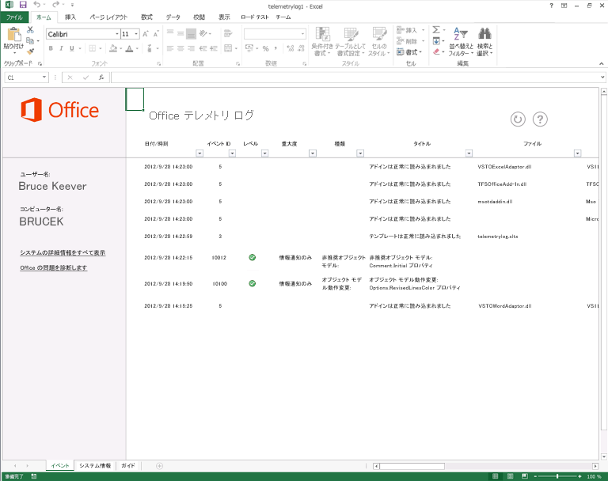

# テレメトリ ログを使用した Office ファイルおよびカスタム ソリューションのトラブルシューティング

Office 2013 テレメトリ ログ を使用して、Office 2013 と以前のバージョンの Office 用に構築されたソリューションの互換性に関する問題を特定します。
  
次の記事は、テレメトリ ログとその使用方法について説明します。 テレメトリ ログに表示される具体的な結果の詳細については、「[Office の互換性に関する問題](compatibility-issues-in-office.md)」を参照してください。

マイクロソフトは、数多くのリリースにわたって Office をカスタマイズ、自動化、および拡張するツールやフレームワークを提供してきました。これによって、企業やユーザーが、生産性と効率性を向上させる Office アプリケーション用のソリューションやアドインを作成できるようになりました。これらのソリューションは、単純な Visual Basic for Applications (VBA) マクロから堅牢な .NET Framework のカスタマイズまで、複雑さの範囲はさまざまです。多くのユーザーは、ビジネスに不可欠なタスクの実施をこれらのソリューションに依存し、使用している Office アプリケーションにカスタマイズ機能を追加して使用していることにさえ気付いていないことがあります。
  
このような Office ソリューションが普及したことで、Office のバージョンのアップグレードが複雑になる場合があります。企業やユーザーは、使用している重要なソリューションが新しいバージョンと完全に互換性があるかどうかを知りません。以前のバージョンの Office で使用可能であるが、新しいバージョンでは廃止された機能やコンピューター コードが、ソリューションで使用されている可能性があります。廃止された機能を使用しているソリューションが「ホスト」アプリケーションに読み込まれると、ソリューションが異なる動作をすることがあります。他にも、エラーの発生や読み込みの失敗、さらにホスト アプリケーションがクラッシュする可能性もあります。
  
Office 2013 テレメトリ ログ は Excel 2013 を基盤として構築されたツールです。開発者や経験豊富なユーザーは、これを使用して、指定の Office 2013 アプリケーションに発生するイベントを確認し、互換性の問題を診断できます。これによりユーザーは、自身の作業環境で使用するアドインに内在する問題を特定し、Office 2013 にアップグレードするかどうかを判断するのに必要な情報を企業の意志決定者に提供できます。また、テレメトリ ログ では Office 2013 アプリケーションのオブジェクト モデルの具体的な変更点や廃止事項に関する詳細なフィードバックが得られます。これにより開発者は、問題のあるコードやコントロールをすばやく特定して切り分けることができます。IT 担当者は、テレメトリ ログ の付属ツールである Office 2013 テレメトリ ダッシュボード を使用して、複数クライアントにわたってソリューションの正常性の傾向を確認できます。
  
詳細については、「[Office テレメトリ ダッシュボードを展開する](https://technet.microsoft.com/library/f69cde72-689d-421f-99b8-c51676c77717)」を参照してください。
  
## テレメトリ ログで監視する問題

ある Office 2013 アプリケーションで、Office ファイルまたはソリューションを読み込む、使用する、閉じるなどのイベントやエラーが発生すると、このアプリケーションは発生したイベントに関する情報を含む記録をローカル データ ストア (同じコンピューター上のデータベース) に追加します。この記録は、イベントのタイトル、イベントのログを収集したアプリケーション、時間、ファイルまたはソリューションの名前、重大度、および発生したエラーの簡単な説明で構成されます。最新の情報に更新すると、ローカル データ ストアに格納された記録のリストが テレメトリ ログ ワークブックに表示されます。
  
> [!NOTE]
> ローカル データ ストアの既定の場所は、%Users%\[Current user]\AppData\Local\Microsoft\Office\15.0\Telemetry です。このデータ ストアの既定の最大サイズは、5 MB (5,120 KB) です。 
  
実行された Office 2013 アプリケーションの実行時ログ収集 API により、次のイベントが発生する度に記録がローカル データ ストアに作成されます。
  
- **OnLoad**: ファイルまたはソリューションが特定の Office 2013 アプリケーションに読み込まれると、ローカル データ ストアに記録が書き込まれます。 **OnLoad** イベントが発生すると、実行時エラーのログにファイル名、場所、およびその他の情報がローカル データ ストアに記録されます。 
    
- **OnClose**: ファイルまたはソリューションがアプリケーション内で閉じられると、ローカル データ ストアに記録が書き込まれます。記録には、ソリューションまたはファイルの名前、場所、およびイベントが発生したアプリケーションが書き込まれます。
    
- **OnError**: ある特定の Office 2013 アプリケーションのソリューションでエラーが見つかると、記録が書き込まれます。記録には、ソリューションまたはファイルの名前と発生した実行時エラーまたは互換性の問題が書き込まれます。既知の問題である場合は、エラーがその互換性の問題にマップされ、テレメトリ ログ にそのように表示されることがあります。
    
テレメトリ ログ には、選択した Office 2013 アプリケーションについて、ファイルやソリューションの種類に関する多数の項目が表示されます。実行時ログ収集 API によって監視されるファイルとソリューションの種類は、アプリケーションによって異なります。監視されるソリューションの種類について詳しくは、表 1 を参照してください。
  
### 表 1. テレメトリ ログ でトラッキングされる Office ファイルやソリューションの種類

|**ソリューションの種類**|**アプリケーション**|**説明**|
|:-----|:-----|:-----|
|作業ウィンドウ アプリ    |Excel 2013、Word 2013、Project 2013    |これらは、クライアント アプリケーション内の作業ウィンドウにホストされる Office アドイン です。    |
|コンテンツ アプリ    |Excel 2013    |これらは、Office ファイルのコンテンツに統合される Office アドイン です。    |
|メール アプリ    |Outlook 2013    |これらは、特定の条件が満たされたとき (電子メールの本文または件名に特定の語句が含まれるとき) に Outlook 2013 に表示されるアプリです。    |
|アクティブ ドキュメント    |Word 2013    PowerPoint 2013    Excel 2013    | アクティブなドキュメントは、この表にリストされているその他の種類のソリューション以外のすべての Office ドキュメント ファイルです。たとえば、以下のようなファイルです。     Office バイナリ形式のファイル (.doc、.ppt、.pps、.xls)     Office OpenXML 形式のファイル (.docx、.pptx、.ppsx、.xlsx)     VBA コードを含むマクロ有効ファイル (.docm、.dotm、.pptm、.potm、.xlsm、.xltm)     ActiveX コントロールを含むファイル     外部データ接続を含むファイル    |
|COM アドイン    |Word 2013    PowerPoint 2013    Excel 2013    Outlook 2013    |COM アドインには Visual Studio 2010 の Office 開発ツール アプリケーション レベルのアドインが含まれます。    |
|Excel 自動化アドイン    |Excel 2013    |この種類のソリューションには、COM アドインを基盤として構築された、以前のバージョンの Excel でサポートされる自動化アドインが含まれます。自動化アドインの機能は、Excel ワークシートの数式で呼び出せます。    |
|Excel XLL アドイン    |Excel 2013    |XLL アドイン (.xll) は Excel 専用で、DLL (ダイナミックリンク ライブラリ) の構築をサポートするコンパイラを使用して構築されます。このアドインは、インストールも登録も必要ありません。XLL アドインには、ユーザー定義のコマンドや関数が含まれる DLL も組み込まれています。    |
|Excel XLS RTD アドイン    |Excel 2013    |XLS リアルタイム データ (RTD) アドインは、 **RealTimeData** ワークシート関数を使用して自動化サーバーを呼び出し、リアルタイムでデータを取得する、Excel ワークシートです。    |
|Word WLL アドイン    |Word 2013    |WLL (.wll) アドインは Word 固有のアドインであり、DLL の作成をサポートするコンパイラを使用して構築されます。    |
|アプリケーション アドイン    |Word 2013    PowerPoint 2013    Excel 2013    |アプリケーション アドインは、VBA コードを含むアプリケーション固有のファイルです。マクロ有効 Word テンプレート (.dotm)、Excel アドイン (.xla, .xlam)、PowerPoint アドイン (.ppa, .ppam) などがあります。    |
|テンプレート    |Word 2013    PowerPoint 2013    Excel 2013    |Office ファイルに添付されている、文書 (.dot、.dotx)、ワークシート (.xlt、.xltx)、プレゼンテーション (.pot、.potx) などのテンプレートがあります。    |
   
## テレメトリ ログ 2013 を使用する

Office 2013 をインストールすると、テレメトリ ログ がインストールされるほか、同じコンピューターにローカル データ ストアが作成され、前に挙げた Office 2013 アプリケーションで実行時ログ収集 API を使用できます。ただし、テレメトリ ログ で監視を開始する前に、ソリューションまたはファイルがアプリケーションに読み込まれているか、開かれている必要があります。
  
次の手順を使用して、テレメトリ ログ に記録された Office の問題を表示します。 
  
### テレメトリ ログ の使用方法

1. テレメトリ ログ を開くには、次のいずれかの操作を行います。
    
   - **Windows 7 の場合:** [ **スタート**] メニューの [ **すべてのプログラム**] をクリックします。次に、プログラムの一覧で、[ **Microsoft Office 2013**]、[ **Office 2013 ツール**] の順に展開し、[ **テレメトリ ログ 2013**] をクリックします。
    
     Excel 2013 で新しいブックが開きます。このブックには、[ **イベント**]、[ **システム情報**]、および [ **ガイド**] という 3 つのワークシートがあります。
    
   - **Windows 8 の場合:** 上方向にスワイプして AppBar を表示し、[ **すべてのアプリ**]、[ **テレメトリ ログ 2013**] の順に選択します。
    
     Excel 2013 で新しいブックが開きます。このブックには、[ **イベント**]、[ **システム情報**]、および [ **ガイド**] という 3 つのワークシートがあります。
    
2. 最新のイベント一覧を表示するには、**[イベント]** ワークシートの最上部にある **[最新の情報に更新]** をクリックします。
    
3. Office 2013 アプリケーションから収集されたイベント データを確認するには、[ **イベント**] ワークシートの表を確認します。 
    
4. Office 2013 および テレメトリ ログ がインストールされたコンピューターの情報を確認するには、[ **システム情報**] ワークシートの情報を確認します。 
    
> [!NOTE]
> 結果の記録を保管するのに、Excel 2013 で テレメトリ ログ のワークブックを保存する必要はありません。情報はローカル データ ストア (テレメトリ ログ とは別の場所) に保管されているからです。ただし、ワークブックを保存しても テレメトリ ログ に影響はありません。 
  
テレメトリ ログ には、記録されたイベントに関する簡単な情報が表示されます。テレメトリ ログ に表示される各記録にはタイトルが付き、表示されるイベントには重大度が示されます。エラーの場合は、エラーの説明と問題を解決するための手順も含まれます。表示される記録のすべてが Office ソリューションのエラーではないことに注意してください。テレメトリ ログ にはソリューションやファイルが正常に読み込まれるか閉じられた場合の記録も表示されます。 
  
たとえば、「非推奨オブジェクト モデル: Comment.Initial プロパティ」というタイトルの問題は、Word 2013 で開かれたソリューションまたはマクロ有効ファイルによって、コメントに関連付けられているコメント投稿者のイニシャルの取得が試行されると発生します。Word 2013 ではコメント機能の操作性が向上しているため、既定ではコメント投稿者のイニシャルが表示されません。以前のコメント機能のモデルに関連付けられている API は Word 2013 オブジェクト モデルに表示されませんが、下位互換性のために残されています。「非推奨オブジェクト モデル: Comment.Initial」の問題は、API の使用を試行したファイル、イベントが発生したアプリケーション (Word 2013)、イベントが発生した時間と日付、およびエラーに関する簡単な説明と修復する方法を示します。
  
**図 1. Office テレメトリ ログ**
  

  
> [!NOTE]
>  テレメトリ ログの**システム情報**ワークシートには、Office 2013 がインストールされているコンピューターに関する情報が含まれています。 このワークシートには次の情報が示されます。 
> - ユーザー名です。
> - フル コンピューター名
> - オペレーティング システムのアーキテクチャ (x64/64 ビットまたは x86/32 ビット)
> - コンピューターにインストールされている Windows のバージョン
> - コンピューターの内部時計のタイム ゾーン。
> - テレメトリ ログのバージョン。
> - コンピューターにインストールされている Office のバージョン。
> 
> この情報は、**イベント** ワークシートに記載されている問題とイベントを解釈するときに役立ちます。 
  
テレメトリ ログ には、既知の問題とともに重大度のレベルが表示されます。前に挙げた例のように、オブジェクト モデルの一部が非推奨となっている問題の重大度は、多くの場合「情報」レベルです。その一方で、他の既知の問題はより重大で、よりすばやいアクションが必要な場合があります。テレメトリ ログ に表示される問題の重大度は、次のいずれかです。
  
- **情報** アプリケーションの互換性に即時の影響を与える問題ではないが、後でアクションを取る必要がある場合があります。「非推奨オブジェクト モデル」のような問題の多くはこの重大度レベルです。 
    
- **警告** データ損失や表示の忠実性の低下を引き起こす可能性のある問題です。 
    
- **重大** 機能の大幅な損失やアプリケーションのクラッシュを引き起こす可能性のある問題です。 
    
### 表 2. テレメトリ ログに表示されるイベントの種類

以下の表 (表 2) を使用して、テレメトリ ログに表示されるレコードを解釈してください。
  
|**イベント ID**|**タイトル**|**重大度**|**説明**|
|:-----|:-----|:-----|:-----|
|1    |ドキュメントは正常に読み込まれました    ||[ **ファイル**] 列に列挙されているファイルが Office アプリケーションで問題なく開かれました。    |
|2    |ドキュメントを読み込めませんでした    |警告    | アプリケーションがファイルを読み込めませんでした。互換性の問題が存在する可能性があります。    破損したブックを Excel 2013 で修復する方法の詳細については、「[破損したブックを修復する](https://office.microsoft.com/en-us/excel-help/repairing-a-corrupted-workbook-HA102749554.aspx)」を参照してください。  破損した文書を Word 2013 で修復する方法の詳細については、「[文書のバックアップ ファイルを保存および復元する](https://office.microsoft.com/en-us/word-help/save-and-recover-a-backup-copy-of-a-document-HA010121250.aspx)」を参照してください。   |
|3    |テンプレートは正常に読み込まれました    ||[ **ファイル**] 列に列挙されているテンプレート ファイルが Office アプリケーションで問題なく開かれました。    |
|4    |テンプレートを読み込めませんでした    |警告    | アプリケーションがテンプレート ファイルを読み込めませんでした。互換性の問題が存在するか、テンプレートの利用状況が変更されている可能性があります。    破損したブックを Excel 2013 で修復する方法の詳細については、「[破損したブックを修復する](https://office.microsoft.com/en-us/excel-help/repairing-a-corrupted-workbook-HA102749554.aspx)」を参照してください。  破損した文書を Word 2013 で修復する方法の詳細については、「[文書のバックアップ ファイルを保存および復元する](https://office.microsoft.com/en-us/word-help/save-and-recover-a-backup-copy-of-a-document-HA010121250.aspx)」を参照してください。   |
|5    |アドインは正常に読み込まれました    ||[ **ファイル**] 列に列挙されているアドインが Office アプリケーションで正常に読み込まれました。互換性の問題は検出されませんでした。    |
|6    |アドインを読み込めませんでした    |重大    | アプリケーションが [ **ファイル**] 列に列挙されているアドインを読み込めませんでした。    破損したブックを Excel 2013 で修復する方法の詳細については、「[破損したブックを修復する](https://office.microsoft.com/en-us/excel-help/repairing-a-corrupted-workbook-HA102749554.aspx)」を参照してください。     破損した文書を Word 2013 で修復する方法の詳細については、「[文書のバックアップ ファイルを保存および復元する](https://office.microsoft.com/en-us/word-help/save-and-recover-a-backup-copy-of-a-document-HA010121250.aspx)」を参照してください。   |
|7    |アドインのマニフェストが正常にダウンロードされました    ||ホスト アプリケーションは Office アドイン 用のマニフェストを正常に読み込みました。    |
|8    |アドインのマニフェストがダウンロードされませんでした    |重大    |ホスト アプリケーションは Office アドインのマニフェスト ファイルを、SharePoint カタログ、コーポレート カタログ、Office ストアのいずれからも読み込めませんでした。    |
|9    |アドイン マニフェストを解析できませんでした。    |重大    |ホスト アプリケーションは Office アドイン のマニフェストを読み込みましたが、XML を読み取れませんでした。    |
|10    |アドインの CPU 使用率が高すぎます    |重大    |Office アドインは、限定された時間内に CPU リソースの 90% 超を使用しました。    |
|11    |読み込み時にアプリケーションがクラッシュしました    |重大    |Office アプリケーションが起動時にドキュメントまたはソリューションの読み込みを試行しましたが、ドキュメントまたはソリューションの問題によってアプリケーションが起動しませんでした。    |
|12    |問題が発生したため、アプリケーションは終了しました    |重大    |何かが原因でアプリケーションに重大なエラーが発生したため、閉じる必要がありました。    |
|13    |ドキュメントは正常に閉じられました    ||[ **ファイル**] 列に列挙されているファイルが正常に閉じられました。    |
|14    |アプリケーションのセッションが延長されました    ||特定のドキュメントまたはソリューションが開かれたアプリケーション セッションの有効期間は最大で 24 時間です。24 時間を超えると、ホスト アプリケーションによって新しいセッションが作成されます。    |
|15    |アドインは文字列検索のタイムアウトのため無効になっています    ||メール アドインは電子メールの件名とメッセージを検索して、それらを正規表現で表示するかどうかを決定します。[ **File**] 列に記されたメール アプリは、正規表現での一致を試みている最中に繰り返しタイムアウトしたため、Outlook 2013 によって無効にされました。    |
|16    |アプリケーションがクラッシュしたときに、ドキュメントが開いていました    |重大    |アプリケーション ([ **アプリケーション**] 列に列挙) がクラッシュしたときに [ **ファイル**] 列に列挙されているファイルが開かれていました。 アプリケーションのクラッシュの原因がこのファイルにあるとは限りません。    |
|17    |アドインは正常に終了しました    |情報    |アプリケーションがアドインを正常にシャット ダウンしました。    |
|18    |アプリは正常に終了しました    ||ホスト アプリケーションによって Office アドインが正常に閉じられました。    |
|19    |アドインで実行時エラーが発生しました    |重大    |Office アドイン に、エラーの原因となる問題がありました。詳細については、エラーが発生したコンピューター上で Windows イベント ビューアーを使用して Microsoft Office Alerts ログを確認してください。    |
|20    |アドインでライセンスを確認できませんでした    |重大    |Office アドイン のライセンス情報を確認できないか、有効期限が切れている可能性があります。詳細については、エラーが発生したコンピューター上で Windows イベント ビューアーを使用して Microsoft Office Alerts ログを確認してください。    |
|各種    |「オブジェクト モデル動作変更: ...」    |情報    |アドインまたはマクロが有効なドキュメントのコードで、前のバージョンの Office と動作が異なるオブジェクト、メンバー、コレクション、列挙体、または定数が使用されています。   詳細については、「[Office の互換性に関する問題](compatibility-issues-in-office.md)」を参照してください。    |
|各種    |「オブジェクト モデル削除済み: ...」    |重大    |アドインまたはマクロが有効なドキュメントのコードで、オブジェクト モデルから削除されているオブジェクト、メンバー、コレクション、列挙体、または定数が使用されています。  詳細については、「[Office の互換性に関する問題](compatibility-issues-in-office.md)」を参照してください。    |
|各種    |「非推奨オブジェクト モデル: ...」    |情報    |アドインまたはマクロが有効なドキュメントのコードで、オブジェクト モデルで非表示になっているオブジェクト、メンバー、コレクション、列挙体、または定数が使用されています。  詳細については、「[Office の互換性に関する問題](compatibility-issues-in-office.md)」を参照してください。    |
|各種    |「コントロール: ...」    ||Office 2013 またはコンピューターのオペレーティング システムでサポートされていないコントロールがファイルに含まれています。  詳細については、「[Office の互換性に関する問題](compatibility-issues-in-office.md)」を参照してください。    |
   
## 終わりに

テレメトリ ログ は、重要な Office ソリューションを監視するための簡単なツールを大企業、個人ユーザー、および開発者に提供します。大規模なアップグレードの前に問題のある Office ソリューションを特定することによって、企業は Office 2013 を採用するコストをより正確に見積もることができます。
  
## 関連項目

- [Office デベロッパー センター](https://msdn.microsoft.com/office/aa905340.aspx)
- [Office の互換性に関する問題](compatibility-issues-in-office.md)
- [Office テレメトリ ダッシュボードを展開する](https://technet.microsoft.com/library/f69cde72-689d-421f-99b8-c51676c77717)
- [Office デベロッパー センター](https://msdn.microsoft.com/office/aa905340)
    

