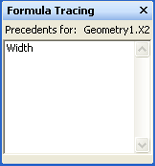

# 数式トレース ウィンドウについて

[**数式トレース**] ウィンドウは、参照元セル (特定のセルに依存するセル) および参照先セル (特定のセルが依存するセル) の両方の相互依存に関する情報を図形作成者が表示できるように設計されています。 
  
Microsoft Visio シェイプ シートのセルには、値と数式が含まれています。 数式を次が別のセルの値に基づいて 1 つのセルの値を計算するのには電源を提供する、他のセルへの参照。 作成するか、複雑な形状を維持する、ただし、ことができます同じシェイプ シート内のセルまたはセルを図面の別のオブジェクトに属することがあるかどうか数式は、図面内の任意のセルを参照できるため、これらすべての依存関係を識別することは困難。たとえば、ページ、スタイル、マスター、または別の図形です。 
  
**数式トレース**] ウィンドウでは、セルに対して行う変更の意味合いを理解するのに役立つ情報を提供します。 
  
## [数式トレース] ウィンドウを表示します。

シェイプ シート] ウィンドウをアクティブにして、[**シェイプ シート ツール**の [**数式トレース**] ウィンドウを表示するのには、* * デザイン * *] タブの [**数式トレース**] で、**ウィンドウの表示**] をクリックします。 **数式トレース**] ウィンドウは、既定では、ドッキングされた [シェイプ シート] ウィンドウが表示されますが、アンカー ウィンドウのドッキング、フロート、またはマージできることを他の利用可能なシェイプ シート ウィンドウ、 **[スタイル エクスプ ローラー**ウィンドウなどでは。 
  
## 参照元セルのトレース

特定のセルに依存するセルの一覧を表示するには、[シェイプシート] ウィンドウでそのセルを選択します。この例では、[Width] セルを選択しています。 
  

  
[**数式トレース**] で、参照先のセルを表示するには、**参照先のトレース**をクリックします。
  
[**数式トレース**] ウィンドウに、[Width] セルに依存するセルの一覧が表示されます。[**数式トレース**] ウィンドウで、一覧の中の任意のセルに移動するには、目的のセルのエントリをダブルクリックしてください。 
  

  
## Precendent セルのトレース

特定のセルが依存しているセルの一覧を表示するには、[シェイプシート] ウィンドウで該当のセルを選択します。この例では、[Geometry1.X2] セルを選択しています。 
  

  
[**数式トレース**] で、その参照先のセルを表示するには、**参照元のトレース**をクリックします。
  
**数式トレース**] ウィンドウで、[geometry1.x2] セルが依存しているすべてのセルの一覧が表示されます。 **数式トレース**] ウィンドウ内のエントリをダブルクリックすると、リスト内の任意のセルに移動できます。 
  

  

