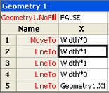

# [数式トレース] ウィンドウについてAbout the Formula Tracing Window

[**数式トレース**] ウィンドウは、参照元セル (特定のセルに依存するセル) および参照先セル (特定のセルが依存するセル) の両方の相互依存に関する情報を図形作成者が表示できるように設計されています。The **Formula Tracing** window is designed to provide shape developers with information about cell interdependencies—both dependent cells (cells that have a dependency on a given cell), and precedent cells (cells that a given cell depends on). 
  
Microsoft Visio シェイプシートのセルには、値と数式が含まれています。The cells in a Microsoft Visio ShapeSheet contain values and formulas. 数式は、他のセルを参照して、別のセルの値に基づいて1つのセルの値を計算することができます。Formulas can, in turn, have references to other cells, giving you the power to calculate a value in one cell based on another cell's value. ただし、複雑な図形を作成または維持している場合、数式は図面内の任意のセル、同じシェイプシートのセル、または図面内の別のオブジェクトに属するセルを参照できるので、これらの相互依存関係をすべて特定するのは困難です。たとえば、ページ、スタイル、マスターシェイプ、またはその他の図形です。When creating or maintaining complex shapes, however, it can be difficult to identify all these interdependencies because a formula can reference any cell in the drawing, whether it's a cell in the same ShapeSheet, or a cell belonging to another object in the drawing, for example, a page, style, master, or another shape. 
  
[**数式トレース**] ウィンドウには、セルに加えた変更の影響を理解するのに役立つ情報が表示されます。The **Formula Tracing** window provides information to help you understand the implications of changes you make to cells. 
  
## [数式トレース] ウィンドウを表示するDisplaying the Formula Tracing Window

[**数式トレース**] ウィンドウを表示するには、[シェイプシート] ウィンドウをアクティブにして、[\* \* Design \* \*] タブの [**シェイプシートツール**] の下にある [**数式トレース**] グループで、[**ウィンドウの表示**] をクリックします。To view the **Formula Tracing** window, with the ShapeSheet window active, under **ShapeSheet Tools** on the \*\* Design \*\* tab, in the **Formula Tracing** group, click **Show Window**. [**数式トレース**] ウィンドウは既定で [シェイプシート] ウィンドウに表示されますが、[**スタイルエクスプローラー** ] ウィンドウなどの他のアンカーされたシェイプシートウィンドウと一緒にドッキング、フローティング、または結合できるアンカーウィンドウです。The **Formula Tracing** window appears docked in the ShapeSheet window by default, but is an anchored window that can be docked, floated or merged with other available anchored ShapeSheet windows, for example, the **Style Explorer** window. 
  
## 参照元セルのトレースTracing dependent cells

特定のセルに依存するセルの一覧を表示するには、[シェイプシート] ウィンドウでそのセルを選択します。この例では、[Width] セルを選択しています。To see a list of cells that are dependent on a particular cell, select that cell in the ShapeSheet window. In this example, the Width cell is selected. 
  
![[Width] セルが選択されている](media/ShapeSheetDependents_UI_01_ZA01039814.gif)
  
その依存セルを表示するには、[**式のトレース**] グループで、[参照先の**トレース**] をクリックします。To view its dependent cells, in the **Formula Tracing**group, click **Trace Dependents**.
  
[**数式トレース**] ウィンドウに、[Width] セルに依存するセルの一覧が表示されます。[**数式トレース**] ウィンドウで、一覧の中の任意のセルに移動するには、目的のセルのエントリをダブルクリックしてください。A list of all the cells with a dependency on the Width cell appears in the **Formula Tracing** window. You can navigate to any cell in the list by double-clicking its entry in the **Formula Tracing** window. 
  
![[数式トレース] ウィンドウに [Width] セルに依存するすべてのセルが表示される](media/ShapeSheetDependents_UI_02_ZA01039815.gif)
  
## precendent セルのトレースTracing precendent cells

特定のセルが依存しているセルの一覧を表示するには、[シェイプシート] ウィンドウで該当のセルを選択します。この例では、[Geometry1.X2] セルを選択しています。To see a list of cells that a particular cell is dependent upon, first select the cell in the ShapeSheet window. In this example, the Geometry1.X2 cell is selected. 
  

  
参照元のセルを表示するには、[**式のトレース**] グループで、[**参照元のトレース**] をクリックします。To view its precedent cells, in the **Formula Tracing**group, click **Trace Precedents**.
  
geometry1.path セルが依存しているすべてのセルの一覧が [**数式トレース**] ウィンドウに表示されます。A list of all the cells that the Geometry1.X2 cell is dependent upon appears in the **Formula Tracing** window. [**数式トレース**] ウィンドウで、一覧の中の任意のセルに移動するには、目的のセルのエントリをダブルクリックしてください。You can navigate to any cell in the list by double-clicking its entry in the **Formula Tracing** window. 
  
![geometry1.path セルが依存しているすべてのセルが [数式トレース] ウィンドウに表示されます。](media/ShapeSheetPrecedents_UI_02_ZA01039818.gif)
  

