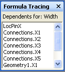

# [数式トレース] ウィンドウについてAbout the Formula Tracing Window

**数式トレース**] ウィンドウがセルの依存関係に関する情報を図形の開発者に提供するように設計されています: 参照先セル (特定のセルに依存するセル) および参照先セル (特定のセルが依存している)。The **Formula Tracing** window is designed to provide shape developers with information about cell interdependencies—both dependent cells (cells that have a dependency on a given cell), and precedent cells (cells that a given cell depends on). 
  
Microsoft Visio シェイプ シートのセルには、値と数式が含まれています。The cells in a Microsoft Visio ShapeSheet contain values and formulas. 数式を次が別のセルの値に基づいて 1 つのセルの値を計算するのには電源を提供する、他のセルへの参照。Formulas can, in turn, have references to other cells, giving you the power to calculate a value in one cell based on another cell's value. 作成するか、複雑な形状を維持する、ただし、ことができます同じシェイプ シート内のセルまたはセルを図面の別のオブジェクトに属することがあるかどうか数式は、図面内の任意のセルを参照できるため、これらすべての依存関係を識別することは困難。たとえば、ページ、スタイル、マスター、または別の図形です。When creating or maintaining complex shapes, however, it can be difficult to identify all these interdependencies because a formula can reference any cell in the drawing, whether it's a cell in the same ShapeSheet, or a cell belonging to another object in the drawing, for example, a page, style, master, or another shape. 
  
**数式トレース**] ウィンドウでは、セルに対して行う変更の意味合いを理解するのに役立つ情報を提供します。The **Formula Tracing** window provides information to help you understand the implications of changes you make to cells. 
  
## [数式トレース] ウィンドウを表示します。Displaying the Formula Tracing Window

シェイプ シート] ウィンドウをアクティブにして、[**シェイプ シート ツール**の [**数式トレース**] ウィンドウを表示するのには、* * デザイン * *] タブの [**数式トレース**] で、**ウィンドウの表示**] をクリックします。To view the **Formula Tracing** window, with the ShapeSheet window active, under **ShapeSheet Tools** on the ** Design ** tab, in the **Formula Tracing** group, click **Show Window**. **数式トレース**] ウィンドウは、既定では、ドッキングされた [シェイプ シート] ウィンドウが表示されますが、アンカー ウィンドウのドッキング、フロート、またはマージできることを他の利用可能なシェイプ シート ウィンドウ、 **[スタイル エクスプ ローラー**ウィンドウなどでは。The **Formula Tracing** window appears docked in the ShapeSheet window by default, but is an anchored window that can be docked, floated or merged with other available anchored ShapeSheet windows, for example, the **Style Explorer** window. 
  
## 従属セルをトレースTracing dependent cells

特定のセルに依存するセルの一覧を表示するには、[シェイプシート] ウィンドウでそのセルを選択します。この例では、[Width] セルを選択しています。To see a list of cells that are dependent on a particular cell, select that cell in the ShapeSheet window. In this example, the Width cell is selected. 
  

  
[**数式トレース**] で、参照先のセルを表示するには、**参照先のトレース**をクリックします。To view its dependent cells, in the **Formula Tracing**group, click **Trace Dependents**.
  
**数式トレース**] ウィンドウで、[Width] セルへの依存関係を持つすべてのセルの一覧が表示されます。A list of all the cells with a dependency on the Width cell appears in the **Formula Tracing** window. **数式トレース**] ウィンドウ内のエントリをダブルクリックすると、リスト内の任意のセルに移動できます。You can navigate to any cell in the list by double-clicking its entry in the **Formula Tracing** window. 
  

  
## Precendent セルのトレースTracing precendent cells

特定のセルが依存しているセルの一覧を表示するには、[シェイプシート] ウィンドウで該当のセルを選択します。この例では、[Geometry1.X2] セルを選択しています。To see a list of cells that a particular cell is dependent upon, first select the cell in the ShapeSheet window. In this example, the Geometry1.X2 cell is selected. 
  

  
[**数式トレース**] で、その参照先のセルを表示するには、**参照元のトレース**をクリックします。To view its precedent cells, in the **Formula Tracing**group, click **Trace Precedents**.
  
**数式トレース**] ウィンドウで、[geometry1.x2] セルが依存しているすべてのセルの一覧が表示されます。A list of all the cells that the Geometry1.X2 cell is dependent upon appears in the **Formula Tracing** window. **数式トレース**] ウィンドウ内のエントリをダブルクリックすると、リスト内の任意のセルに移動できます。You can navigate to any cell in the list by double-clicking its entry in the **Formula Tracing** window. 
  

  

