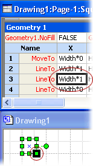

# シェイプシートのスプレッドシートについて

Microsoft Visio のすべての要素 (図面、ページ、スタイル、図形、グループ、グループ内の図形やオブジェクト、マスター シェイプ、別のプログラムのオブジェクト、ガイド、ガイド点) には、それぞれのシェイプシートというスプレッドシートがあり、各オブジェクトについての情報が格納されています。このスプレッドシートには、高さ、幅、角度、色など、図形の外観や動作を決定する属性が含まれています。
  
図形の開発者は、作成する図形の外観と動作を正確に設定する必要があります。図形の開発者は、シェイプシートで編集し、図形の既定の動作を変更して、機能を拡張できます。シェイプシートには、シェイプシート ウィンドウまたはプログラムからアクセスできます。
  
## シェイプ シート ウィンドウでオブジェクトを表示します。

Visio の図面ウィンドウと [シェイプシート] ウィンドウには、同じ図形に対して異なるビューが表示されます。
  
- 図面ウィンドウで図形を表示すると、図形はグラフィカルに描画されます。またシェイプシートの数式に従った動作を参照できます。
    
- [シェイプシート] ウィンドウで図形を表示すると、図面ページでの図形の外観と動作を決定する、基本となる数式を参照できます。
    
[シェイプシート] ウィンドウと図面ウィンドウを同時に表示し、[シェイプシート] ウィンドウでセルを操作しながら図形の変更を図面ウィンドウで確認したり、逆の操作をしたりできます。たとえば、ポインターによって図形を移動すると、[Shape Transform] セクションにあるその図形の PinX 式と PinY 式が、図面ページ上の新しい位置を反映して変更されます。
  
## シェイプ シート ウィンドウの構造

シェイプ シートは、座標や書式設定などの図形の動作や外観を特定の側面を制御する*セクション*に分割されます。 各セクションには、*セル*を含む 1 つまたは複数の*行*が含まれています。 各セルは、数式、その結果の (セルの値とよく呼ばれます) およびオプションのエラー情報を含めることができます。 必須またはオプションによっては、特定のセル、数式があります。 (たとえば、その数式または値) のセルのデータ、ローカルで定義されているかより多くの場合は、図形のマスター シェイプまたはスタイルに対応するセルから継承されています。 
  
次の例は、[シェイプシート] ウィンドウでの数式バー 、セクション 、セル 、および行  を示しています。 
  

  
図形を描画するときに、Visio は、直線セグメントに接続されている水平および垂直方向の位置のコレクションとして図形を記録します。 (頂点と呼ばれます)、これらの場所は、図形の [ **Geometry** ] セクションの X と Y のセルに記録されます。 図形のシェイプ シート ウィンドウの [ **Geometry** ] セクションで、X と Y のセルをクリックしたときに、次の例では、ように、黒い枠線のボックスでの図面ウィンドウ内の図形の頂点を強調表示が表示されます。 
  

  
## シェイプ シート ウィンドウでオブジェクトを編集します。

[シェイプシート] ウィンドウがアクティブになると、リボンは、このウィンドウで作業するためのオプションが表示されるように変更されます。シェイプシートのセルを選択すると、オブジェクトの数式を入力または編集するための数式バーが表示されます。セルに直接数式を入力することもできます。
  
[シェイプ シート] ウィンドウで、図面ページ上の図形に新しい特性を追加する図形のシートにセクションを追加することができます。 たとえば、接続を作成する**接続ポイント**のセクションを追加できます。 セクション必要がなくなったときを削除することができます。 
  
図形の外観を変更するのにはまたはその他の数式を保持するためのセクションに行を追加することも。 たとえば、図形にセグメントを追加するのには **[Geometry** ] セクションに行を追加できます。 同様に、不要になった行を削除することができます。 
  
セルには、数式または値のいずれでも表示できます。たとえば新しい数式を入力したり、既存の数式を編集したり、セルの数式の相互関係を確認する場合には、数式を表示します。セルの数式が評価されると、その結果として、値を受け取ります。セルの値を表示して評価の結果を確認できます。
  
## シェイプ シートの参照を追加

特定のセクション、行、または、[シェイプ シートのセルの詳細については、この[「シェイプ シート リファレンス](reference-visio-shapesheet.md)の対応する記事を表示します。
  
プログラムを使用してシェイプシートにアクセスする方法については、『Microsoft Visio オートメーション リファレンス』を参照してください。
  

