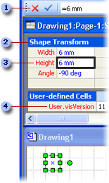

# シェイプシートのスプレッドシートについてAbout the ShapeSheet Spreadsheet

Microsoft Visio のすべての要素 (図面、ページ、スタイル、図形、グループ、グループ内の図形やオブジェクト、マスター シェイプ、別のプログラムのオブジェクト、ガイド、ガイド点) には、それぞれのシェイプシートというスプレッドシートがあり、各オブジェクトについての情報が格納されています。このスプレッドシートには、高さ、幅、角度、色など、図形の外観や動作を決定する属性が含まれています。Everything in Microsoft Visio, every document, page, style, shape, group, shape or object within a group, master, object from another program, guide, and guide point, has a ShapeSheet spreadsheet where information about that object is stored. This spreadsheet contains information such as height, width, angle, color, and other attributes that determine the shape's appearance and behavior.
  
図形の開発者は、作成する図形の外観と動作を正確に設定する必要があります。図形の開発者は、シェイプシートで編集し、図形の既定の動作を変更して、機能を拡張できます。シェイプシートには、シェイプシート ウィンドウまたはプログラムからアクセスできます。As a shape developer, you need precise control over the appearance and behavior of the shapes you create. You can change a shape's default behavior and enhance what it can do by editing it in its ShapeSheet, which you can access in a ShapeSheet window or programmatically.
  
## [シェイプシート] ウィンドウでオブジェクトを表示するViewing an object in a ShapeSheet window

Visio の図面ウィンドウと [シェイプシート] ウィンドウには、同じ図形に対して異なるビューが表示されます。The Visio drawing window and ShapeSheet window are simply different views of the same shape.
  
- 図面ウィンドウで図形を表示すると、図形はグラフィカルに描画されます。またシェイプシートの数式に従った動作を参照できます。When you view a shape in a drawing window, you see it rendered graphically and behaving according to the formulas in its ShapeSheet.
    
- [シェイプシート] ウィンドウで図形を表示すると、図面ページでの図形の外観と動作を決定する、基本となる数式を参照できます。When you view a shape in a ShapeSheet window, you see the underlying formulas that determine how it looks and behaves on the drawing page.
    
[シェイプシート] ウィンドウと図面ウィンドウを同時に表示し、[シェイプシート] ウィンドウでセルを操作しながら図形の変更を図面ウィンドウで確認したり、逆の操作をしたりできます。たとえば、ポインターによって図形を移動すると、[Shape Transform] セクションにあるその図形の PinX 式と PinY 式が、図面ページ上の新しい位置を反映して変更されます。You can view a ShapeSheet window and a drawing window simultaneously and see the shape change in the drawing window as you manipulate cells in its ShapeSheet window or vice versa. For example, when you move the shape with the pointer, the shape's PinX and PinY formulas in the Shape Transform section change to reflect its new position on the drawing page.
  
## [シェイプシート] ウィンドウの構造Structure of the ShapeSheet window

ShapeSheet は、図形の動作や外観の特定の側面 (ジオメトリや書式設定など) を制御するセクションに分かれています。A ShapeSheet is divided into  *sections*  that control a particular aspect of a shape's behavior or appearance, for example, its geometry or its formatting. 各セクションには、セルを含む 1 つ以上  *の*  行が  *含まれます*  。Each section contains one or more  *rows*  that contain  *cells*  . 各セルには、数式とその結果 (セルの値と呼ばれます)、およびオプションのエラー情報を含めることができます。Each cell can contain a formula, its result (commonly called the cell value), and optional error information. 数式は、セルに応じて、必須の場合とオプションの場合があります。A formula may be required or optional, depending on the particular cell. セルのデータ (数式や値など) はユーザーが定義できますが、多くの場合、図形のマスター シェイプまたはスタイル内にある対応するセルから継承されます。A cell's data (for example, its formula or value) may be locally defined or, more often, inherited from the equivalent cell in the shape's master or style. 
  
次の例は、数式バーを示していますThe following example shows the formula bar 、セクション, a section 、セル, a cell 、および行, and a row  を[シェイプシート] ウィンドウに表示します。in the ShapeSheet window. 
  

  
図形を描画すると、Visio では直線セグメントに接続された水平および垂直の位置のコレクションとしてその図形を記録します。When you draw a shape, Visio records the shape as a collection of horizontal and vertical locations connected with line segments. これらの場所 (頂点と呼ばれる) は、図形の [Geometry] セクションの X セルと Y セルに **記録** されます。These locations (called vertices) are recorded in the X and Y cells of the shape's **Geometry** section. 次の例に示すように、図形の [シェイプシート] ウィンドウの[Geometry] セクションで [X] セルと [Y] セルをクリックすると、図面ウィンドウで図形の頂点を強調表示する黒枠のボックスが表示されます。As shown in the following example, when you click the X and Y cells in the **Geometry** section of a shape's ShapeSheet window, you will see a black-bordered box highlighting the vertex on the shape in the drawing window. 
  

  
## [シェイプシート] ウィンドウでオブジェクトを編集するEditing an object in the ShapeSheet window

[シェイプシート] ウィンドウがアクティブになると、リボンは、このウィンドウで作業するためのオプションが表示されるように変更されます。シェイプシートのセルを選択すると、オブジェクトの数式を入力または編集するための数式バーが表示されます。セルに直接数式を入力することもできます。When a ShapeSheet window is active, the ribbon changes to display options specific to working in this window. When you select a ShapeSheet cell, a formula bar appears, which you can use to enter and edit an object's formulas. Or, you can work directly in the cell.
  
[シェイプシート] ウィンドウでは、図形のシートにセクションを追加することで図面ページの図形に新しい特性を追加できます。In a ShapeSheet window, you can add sections to a shape's sheet to add new characteristics to the shape on the drawing page. たとえば、[接続ポイント] セクションを追加 **して** 接続を作成できます。For example, you can add a **Connection Points** section to create a connection. セクションが不要になった場合は、削除することもできます。When you no longer need a section, you can delete it. 
  
また、セクションに行を追加して、新しい式を保持したり、図形の外観を変更したりできます。You also can add rows to sections to hold additional formulas or to change a shape's appearance. たとえば、行を Geometry セクションに追加して、セグメントを図形に追加できます。For example, you can add a row to a **Geometry** section to add a segment to a shape. 同様に、不要になった行は削除できます。Similarly, you can delete rows you no longer need. 
  
セルには、数式または値のいずれでも表示できます。たとえば新しい数式を入力したり、既存の数式を編集したり、セルの数式の相互関係を確認する場合には、数式を表示します。セルの数式が評価されると、その結果として、値を受け取ります。セルの値を表示して評価の結果を確認できます。You can display either formulas or values in cells. Display formulas when you are entering new formulas, editing existing formulas, or to see how formulas in cells relate to each other. A value is the result you get when Visio evaluates a cell's formula. You can display values in cells to see the result of an evaluation.
  
## シェイプシートに関する参照情報Additional ShapeSheet references

シェイプシートの特定のセクション、行、またはセルの詳細については、このシェイプシートリファレンスの対応する [記事を参照してください](reference-visio-shapesheet.md)。For details on a particular section, row, or cell in the ShapeSheet, view the corresponding article in this [ShapeSheet Reference](reference-visio-shapesheet.md).
  
プログラムを使用してシェイプシートにアクセスする方法については、『Microsoft Visio オートメーション リファレンス』を参照してください。For details on programmatically accessing the ShapeSheet spreadsheet, see the Microsoft Visio Automation Reference.
  

