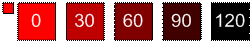

# SHADE 関数

_int_パラメーターで指定された正または負の値で明度を減らして色を変更します。 
  
## 構文

網掛け (* * *color* * *, * * *int* * *) 
  
### パラメーター

|**名前**|**必須 / オプション**|**データ型**|**説明**|
|:-----|:-----|:-----|:-----|
| _color_   |必須    |**数値型 (Numeric)**   |Microsoft Visio カラー インデックスまたは RGB 値を指定します。    |
| _int_   |必須    |**整数型 (Integer)**   |色の輝度を減少する量を指定します。 正または負の値を指定できます。    |
   
### 戻り値

 **RGB**
  
## 解説

明度の上限と下限は、それぞれ 0 と 240 です。 _int_パラメーターに渡すことができる整数のサイズに制限はありませんが、明度がこれらの制限を超えることはありません。 
  

  

