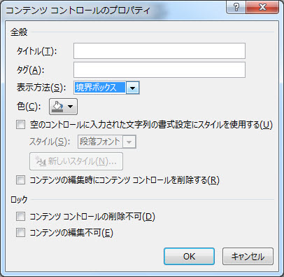
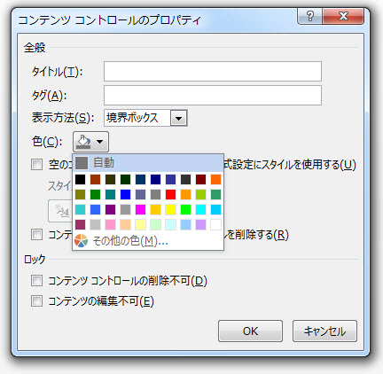
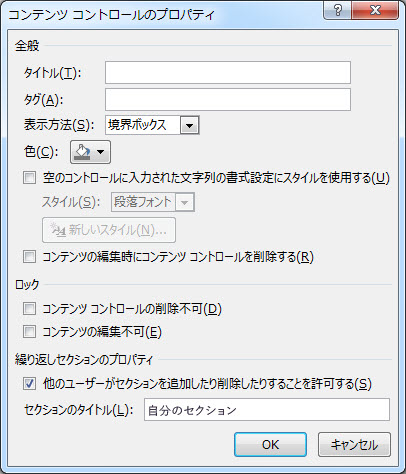

# <a name="content-controls-in-word"></a>Word におけるコンテンツ コントロール

Microsoft Word 2013 のコンテンツ コントロールによって、どのように構造化文書のシナリオの幅が広がるかについて説明します。

このトピックでは、Microsoft Word 2013 のコンテンツ コントロールに加えられた変更点と、それらの変更内容によって可能になる文書のシナリオについて取り上げます。
  
### <a name="structured-documents"></a>構造化文書
<a name="WordCC_StructuredDocs"> </a>

構造化文書とは、文書上でコンテンツを配置できる場所や、文書に含めることのできるコンテンツの種類、コンテンツを編集できるかどうかを管理できる文書のことです。
  
Microsoft Word の構造化コンテンツが求められる一般的なシナリオのいくつかを次に示します。
  
- 法律事務所で、ユーザーが変更してはならない法律用語が含まれている文書を作成する。
    
- 企業で、タイトル、作成者、日付だけをユーザーが入力する提案書の表紙を作成する。
    
- 企業で、事前に定義された場所に顧客データが入った請求書を作成する。
    
### <a name="using-content-controls-to-structure-a-document"></a>コンテンツ コントロールを使用して文書を構造化する
<a name="WordCC_StructuredDocs"> </a>

コンテンツ コントロールとは、文書内の特定のコンテンツ用のコンテナーとして機能する Microsoft Word のエンティティのことです。 それぞれのコンテンツ コントロールには、日付、リスト、書式設定された段落などを含めることができます。 コンテンツ コントロールは、リッチな構造化されたコンテンツ ブロックを作成する際に役立つものであり、構造化されたドキュメントを作成するために、適切に定義されたブロックを文書に挿入するテンプレートでの使用を意図しています。
  
コンテンツ コントロールは、コンテンツの位置を固定したり、コンテンツの種類を指定したり (日付、画像、テキストなど)、編集を許可または禁止したり、コンテンツにセマンティックな意味を付与したりするため、構造化文書の作成に最適です。
  
### <a name="content-controls-in-word-2010"></a>Word 2010 のコンテンツ コントロール
<a name="WordCC_StructuredDocs"> </a>

Word 2010 では、次のコンテンツ コントロールを使用できます。
  
- リッチ テキスト
    
- プレーン テキスト
    
- 画像
    
- 文書パーツ ギャラリー
    
- コンボ ボックス
    
- ドロップダウン リスト
    
- 日付
    
- チェックボックス
    
- グループ
    
Word 2010 のコンテンツ コントロールにより、さまざまな構造化文書ソリューションの可能性に対応できますが、Word 2013 のコンテンツ コントロールでは、それよりも広範囲なシナリオに対応できます。
  
## <a name="content-control-improvements-in-word-2013"></a>Word 2013 におけるコンテンツ コントロールの機能強化
<a name="WordCC_WhatsNew"> </a>

Word 2013 では、コンテンツ コントロールに 3 つの主要な機能強化が加えられました。その内容は、視覚化の改善、リッチ テキスト コンテンツ コントロールの XML マッピングのサポート、新しい繰り返しコンテンツ用のコンテンツ コントロールです。
  
### <a name="improved-visualization"></a>視覚化の改善

Word 2013 では、次の 3 つの状態のいずれかで個々のコンテンツ コントロールを表示できます。
  
- 境界ボックス
    
- 開始/終了タグ
    
- なし
    
> [!NOTE]
> 特に明記されていない限り、このセクションでは、文書が [**デザイン モード**] で表示されていない場合のコンテンツ コントロールの視覚化について取り上げます。コンテンツ コントロールの表示モードは、[**コンテンツ コントロールのプロパティ**] ダイアログ ボックスの [**表示方法**] ドロップダウン リスト コントロールを使用して設定します。 
  
**図 1. ［コンテンツ コントロールのプロパティ］ ダイアログ ボックス**


  
コンテンツ コントロールの表示モードは、Word 2013 オブジェクト モデル (「[新しい Word 2013 のコンテンツ コントロール オブジェクト モデルのメンバー](#WordCC_NewOM)」で後述) を使用して設定することもできます。
  
### <a name="bounding-box"></a>境界ボックス
<a name="WordCC_DefaultRendering"> </a>

Word 2013 のコンテンツ コントロールの既定の表示形式は、Word 2007 および Word 2010 のコンテンツ コントロールの表示と同じ境界ボックスとしての外観が維持されています。 コンテンツ コントロールを **[境界ボックス]** として表示するように設定すると、次のユーザー操作によって表示が変化します。
  
- コンテンツ コントロールにフォーカスがないときには視覚化されません
    
- マウスを置くと、コンテンツ コントロールは影付きの四角形として表示されます
    
**図 2. マウスを置いたときのコンテンツ コントロール**


  
- コンテンツ コントロールにフォーカスがある場合 (ユーザーがコンテンツ コントロールを選択した場合)、コントロールが「境界ボックス」として表示されます （コンテンツで線で囲まれ、タイトルを設定した場合にはそのタイトルが表示されます）
    
**図 3. フォーカスがあるコンテンツ コントロール**


  
### <a name="startend-tags"></a>開始/終了タグ
<a name="WordCC_StartEndTags"> </a>

コンテンツ コントロールを ［**開始/終了タグ**］ として表示するように設定すると、ユーザー操作に関係なくタグが表示され、タイトルは表示されません。ただし、［**ドロップダウン リスト**］ ボタンなどのボタンは、マウスと置くと表示されます。 
  
**図 4. ［開始/終了タグ］ として表示するよう設定されているコンテンツ コントロール**


  
### <a name="none"></a>なし
<a name="WordCC_Invisible"> </a>

コンテンツ コントロールを **［なし］** として表示するように設定すると、コンテンツ コントロールは表示されません。
  
### <a name="content-control-colorization"></a>コンテンツ コントロールの色
<a name="WordCC_CCColorization"> </a>

コンテンツ コントロールに対する各種の表示が可能なことに加えて、Word 2013 では個別のコンテンツ コントロールの色を設定することもできます。 コンテンツ コントロールの色を設定するには、**[コンテンツ コントロールのプロパティ]** ダイアログ ボックスの **[色]** ボタンを使用します。 
  
また、コンテンツ コントロールの色は、Word 2013 オブジェクト モデル (「[新しい Word 2013 のコンテンツ コントロール オブジェクト モデルのメンバー](#WordCC_NewOM)」で後述) を使用して設定することもできます。
  
**図 5. ［コンテンツ コントロールのプロパティ］ ダイアログ ボックス**


  
### <a name="support-for-xml-mapping-for-rich-text-content-controls"></a>リッチ テキスト コンテンツ コントロールの XML マッピングのサポート
<a name="WordCC_XMLMapping"> </a>

Word 2013 では、リッチ テキスト コンテンツ コントロールと文書パーツ コンテンツ コントロールのコンテンツを XML データ ストアにマップできます。 そうするには、コンテンツ コントロールの *XML マッピング*を設定します。 このプロパティは、オブジェクト モデルにある **XMLMapping.SetMapping** メソッドを使用して設定します。 カスタム XML パーツ内では、カスタム XML が文字列に変換されたフラットな Open XML マークアップ (標準 XML エンコーディングを使用) として保存されます。これにより、カスタム XML はカスタム XML パーツのテキスト ノードとして保存できるようになります。 ただし、マッピングには、リーフ ノードまたは属性へのマッピングのみが成功するという以前からの制限があります。 
  
> [!NOTE]
> リッチ テキスト コンテンツ コントロールに他のリッチ テキスト コンテンツ コントロールを含めることはできません。(ファイル形式の操作やコピーと貼り付けなどによって) リッチ コンテキスト コンテンツ コントロールが別のリッチ コンテキスト コントロールの中に入ると、それはマップされたリッチ テキスト コントロールの中に含まれなくなるまでリンク解除されます。 
  
XML マッピングの設定方法について詳しくは、このトピックで後述する「[新しい Word 2013 のコンテンツ コントロール オブジェクト モデルのメンバー](#WordCC_NewOM)」というセクションをご覧ください。 
  
### <a name="supporting-repeating-content"></a>繰り返しコンテンツのサポート
<a name="WordCC_SupportingRepeating"> </a>

表示の機能拡張とリッチ テキスト コンテンツ コントロールへの XML マッピングのサポートに加えて、Word 2013 には、コンテンツの繰り返しが可能になる新しいコンテンツ コントロールも追加されています。 繰り返しセクション コンテンツ コントロールにより、そのコントロールに含まれている (別のコンテンツ コントロールを含んでいる) コンテンツを繰り返します。
  
段落全体や表の行の周囲に繰り返しセクション コンテンツ コントロールを挿入します。あるセクションをこのコントロールで囲むと、中に含まれているセクションの上または下にそのセクションのコピーを挿入できます。
  
**図 6. 繰り返しセクション コンテンツ コンソールのコンテキスト メニュー**


  
挿入されたセクションの繰り返しは、コンテンツ コントロールの末尾のコントロール (プラス記号の付いたボタンとして表示されます ()) を使用するか、コンテキスト メニューのコマンド (図 6 を参照) を選択することで可能です。 繰り返されるコンテンツは、個別のコンテンツのセクションになります。このセクションには、**[コンテンツ コントロールのプロパティ]** ダイアログ ボックスを使用してタイトルを割り当てることができます。 
  
**図 7. [コンテンツ コントロールのプロパティ] ダイアログ ボックスによるセクション タイトルの割り当**


  
セクションにタイトルを指定した場合に [**コンテンツ コントロールのプロパティ**] ダイアログ ボックスの [**他のユーザーがセクションを追加したり削除したりすることを許可する**] を選択すると、ユーザーは名前で選択対象を追加または削除できるようになります。 
  
**図 8. 繰り返しセクション コンテンツ コントロールのコンテキスト メニューによるセクションの削除**


  
繰り返しセクション コンテンツ コントロールで他のコンテンツ コントロールを囲むと、中に含まれたコンテンツ コントロールは新しいアイテムごとに繰り返されます。ただし、そのようなコンテンツ コントロールのコンテンツはプレースホルダー テキストにリセットされます。以下の 2 つの例外の場合には子コントロール コンテンツが保持されます。 
  
- 子コントロールが繰り返しセクション コントロールの場合。
    
- 子コントロールが、繰り返しセクション コンテンツ コントロール外のノードに XML マッピングされている場合。
    
**図 9. 繰り返しの前に子コントロールが含まれる繰り返しセクション コンテンツ コントロール**


  
**図 10. 繰り返しの後に子コントロールが含まれる繰り返しセクション コンテンツ コントロール**


  
### <a name="repeating-section-content-controls-around-xml-mapped-controls"></a>XML マッピング コントロールを囲む繰り返しセクション コンテンツ コントロール
<a name="WordCC_RepeatingSectionCCs"> </a>

Word 2013 は、繰り返しセクションに含まれている XML マッピングを次のようにマップします。
  
マッピングがその親チェーンの一部としてノード セット内のアイテムと重ならない場合、バインディングは「絶対バインディング」となり、すべての繰り返しセクション アイテム内で同じコンテンツが示されます。
  
マッピングがその親チェーンの一部としてノード セット内のアイテムと重なる場合、バインディングは「相対バインディング」となり、次のように再マップされます。
  
- ノードの絶対バインディングが判別されます (クエリ式はすべて平坦化されます) - これは最初のマッピングで生じます。
    
- ノード セットと重なるバインディングの軸が削除されます。
    
- 残りの XPath が、繰り返しセクション コンテンツ アイテムの XPath に基づいて相対評価されます。
    
たとえば、次のマッピングが生じるとします。
  
- 繰り返しセクションが \root\next\path にマップされます。
    
- サンプル アイテム内のコントロールが \root\next\path[2]\baz にマップされます。
    
- Word が \root\next\path[2] をノード セット内のアイテムに対応付けます。
    
結果としてバインディングは .\baz として評価されます。この場合、繰り返しコンテンツ アイテムのノードが基準となります。
  
繰り返しコンテンツ コントロールを処理する際、データの損失を避けて障害を防止するには以下の提案が役立ちます。
  
### <a name="working-with-repeating-section-content-controls-that-are-mapped-to-xml-data"></a>XML データにマップされる繰り返しセクション コンテンツ コントロールを扱う
<a name="WordCC_RepeatingSectionCCs"> </a>

XML データにマップされた繰り返しセクション コンテンツ コントロールを挿入すると、ユーザーが文書を再度開くたびに、データ ストアの情報に基づいて、繰り返しセクションのアイテムが Word によって繰り返されます。 文書を保存しても、ユーザーがドキュメントの繰り返しセクションのアイテムに行った変更がデータ ストアにもマップされていないと、その変更内容は失われます。
  
この事態が生じないようにするには、繰り返しセクション コンテンツ コントロールをロックし、同じように XML にマップされる、ロックされていない子コンテンツ コントロールでのみユーザーが編集を行えるようにします。
  
### <a name="binding-a-repeating-section-content-control-to-a-table"></a>繰り返しセクション コンテンツ コントロールを表にバインドする
<a name="WordCC_RepeatingSectionCCs"> </a>

繰り返しセクション コンテンツ コントロールを表にバインドする場合は、表を挿入した*後*、繰り返しセクション コンテンツ コントロールを挿入するようにします。この順序は逆にしないでください  (逆にすると、表だけを選択することができなくなります)。 
  
### <a name="nesting-repeating-section-content-controls-within-a-table"></a>繰り返しセクション コンテンツ コントロールを表の中に入れ子にする
<a name="WordCC_RepeatingSectionCCs"> </a>

繰り返しセクション コンテンツ コントロールを表の中に隣接して入れ子にする場合 (たとえば、親の繰り返しセクション コンテンツ コントロールの最後と子繰り返しセクション コンテンツ コントロールが同じセル内にある場合)、内部セクションでアイテムを追加したり削除したりすると、外部繰り返しセクションが削除されます。
  
この事態が生じるのを避けるには、繰り返しセクション コンテンツ コントロールの最後と次の繰り返しセクション コンテンツ コントロール間に段落記号を追加できます。段落記号を非表示にするには、リボンの [**ホーム**] タブの [**表示/非表示**] オプションの選択を解除します。 
  
### <a name="open-xml-file-format-schema-additions"></a>Open XML ファイル形式スキーマにおける追加内容
<a name="WordCC"> </a>

WordprocessingML Open XML ファイル形式スキーマに次の要素が追加されました。
  
**表 1. コンテンツ コントロール用 WordprocessingML Open XML ファイル形式スキーマの新しい要素**

|**要素**|**説明**|
|:-----|:-----|
|\<w:appearance\>  <br/> |\<w:appearance\> は、\<w:sdtPr\> の子要素です。  <br/> val 属性には次の値が有効です。  <br/> \<w:appearance val= boundingBox|tags|hidden。  <br/> 既定値は boundingBox です。  <br/> |
|\<w:color\>  <br/> |\<w:color\> は \<w:sdtPr\> の子要素です。  <br/> このコンテンツ モデルは、既存の CT_Color 複合型と一致します。既定値は Word 2010 で使用されている色です。  <br/> |
   
## <a name="new-word-2013-content-control-object-model-members"></a>新しい Word 2013 のコンテンツ コントロール オブジェクト モデルのメンバー
<a name="WordCC_NewOM"> </a>

Word 2013 の新しい機能拡張とコンテンツ コントロールへの追加機能によって、Word のオブジェクト モデルは、新しい機能セットをプログラムで操作できるように更新されています。 さらに、ワード処理文書の基礎となる Open XML ファイル形式にも変更が加えられています。
  
次からのセクションでは、各コンテンツ コントロール機能拡張に関連する特有のオブジェクト モデルの変更内容について詳しく取り上げます。
  
### <a name="visualization-enhancements"></a>視覚化の機能拡張
<a name="WordCC_VisEnhancements"> </a>

Word 2013 に含まれている複数のオブジェクト モデル追加機能は、コンテンツ コントロールの視覚化の機能拡張に向けたものです。 次の表に、視覚化のための **ContentControl** オブジェクトの新しいメンバーを示します。 
  
**表 2. 新しい ContentControl オブジェクトのメンバー**

|**メンバー**|**説明**|
|:-----|:-----|
|. **Appearance** (**WdContentControlAppearance** として) <br/> |コンテンツ コントロールの視覚化を取得または設定します。  <br/> |
|. **Color** (**WdColor** として) <br/> |コンテンツ コントロールの色を取得または設定します。  <br/> |
   
次の表に、新しい **WdContentControlAppearance** 列挙体の定数を示します。 
  
**表 3. 新しい WdContentControlAppearance 列挙体の定数**

|**定数**|**説明**|
|:-----|:-----|
|**wdContentControlBoundingBox** <br/> |影付きの四角形/境界ボックスとして表示されるコンテンツ コントロールを表します (オプションとしてタイトルが表示されます)。  <br/> |
|**wdContentControlTags** <br/> |開始/終了マーカーとして表示されるコンテンツ コントロールを表します。  <br/> |
|**wdContentControlHidden** <br/> |表示されていないコンテンツ コントロールを表します。  <br/> |
   
### <a name="code-sample"></a>コード サンプル
<a name="WordCC_VisEnhancements"> </a>

次のコード サンプルは、プログラムを使用して、リッチ テキスト コンテンツ コントロールの作成と、視覚化の設定を行う方法を示しています。
  
```vb
Sub testVisualization()
   Dim objcc As ContentControl
   Dim objRange As Range
   
   ' Get the first paragraph as a range object.
   Set objRange = ActiveDocument.Paragraphs(1).Range
   ' Create a rich text content control around the first paragraph.
   Set objcc = ActiveDocument.ContentControls.Add(wdContentControlRichText, objRange)
   objcc.Title = "Default Bounding Box"
   ' Set visualization to the default.
   objcc.Appearance = wdContentControlBoundingBox
   
   ' Create a new paragraph.
   objRange.InsertParagraphAfter
   Set objRange = ActiveDocument.Paragraphs(2).Range
   ' Create a rich text content control around the second paragraph.
   Set objcc = ActiveDocument.ContentControls.Add(wdContentControlRichText, objRange)
   objcc.Title = "Non Bounding"
   ' Set visualization to invisible.
   objcc.Appearance = wdContentControlHidden
   
   ' Create a new paragraph.
   objRange.InsertParagraphAfter
   Set objRange = ActiveDocument.Paragraphs(3).Range
   ' Create a rich text content control around the third paragraph.
   Set objcc = ActiveDocument.ContentControls.Add(wdContentControlRichText, objRange)
   objcc.Title = "Tags Only with Pink color"
   ' Set visualization to Start/End tags with pink color.
   objcc.Appearance = wdContentControlTags
   objcc.Color = wdColorPink
End Sub
```

### <a name="xml-mapping"></a>XML マッピング
<a name="WordCC_XMLMappingOM"> </a>

Word 2013 オブジェクト モデルには、文書のデータ ストア内の XML ノードにリッチ テキストをマップするための追加機能はありません。 その代わりに、文書のデータ ストア内の XML ノードにリッチ テキスト コンテンツ コントロールをマップする既存のオブジェクト モデルを使用してください。 また、特に XML マッピングのために新しく取り入れられたテキスト コンテンツ コントロールのサポートの一部として、基盤となる Open XML ファイル形式の WordprocessingML スキーマに加えられた変更もありません。
  
#### <a name="code-sample"></a>コード サンプル

以下のコード サンプルは、プログラムを使用して XML ノードにリッチ テキスト コンテンツ コントロールをマップする方法を示しています。
  
```vb
Sub testRichBinding()
   Dim objRange As Range
   Dim objcc As ContentControl
   Dim objCustomPart As CustomXMLPart
   Dim blnMap As Boolean
   
   ' Add a custom XML part to the data store.
   Set objCustomPart = ActiveDocument.CustomXMLParts.Add
   ' Load XML fragment into the custom XML part.
   objCustomPart.LoadXML ("<x>Rich Text Databinding</x>")
   ' Get the first paragraph as a range object.
   Set objRange = ActiveDocument.Paragraphs(1).Range
   ' Create a rich text content control around the first paragraph.
   Set objcc = ActiveDocument.ContentControls.Add(wdContentControlRichText, objRange)
   ' Bind the XML node to the rich text content control.
   blnMap = objcc.XMLMapping.SetMapping("/x")
   ' Return whether mapping worked.
   MsgBox objcc.XMLMapping.IsMapped
End Sub
```

### <a name="repeating-section-content-controls-represented-in-the-object-model"></a>オブジェクト モデルで表される繰り返しセクション コンテンツ コントロール
<a name="WordCC_RepeatingSection"> </a>

繰り返しセクション コンテンツ コントロールをオブジェクト モデルで使用できます。そのためには、以下に示されている、**ContentControl** オブジェクトに対する追加機能と、新しい **RepeatingSectionItem** オブジェクトと **RepeatingSectionItemColl** オブジェクトを使用します。表 4 に、繰り返しセクション コンテンツ コントロール用の **ContentControl** オブジェクトの新しいメンバーのうち、重要性が最も高いものをいくつか取り上げます。 
  
**表 4. ContentControl オブジェクトのメンバー**

|**メンバー**|**説明**|
|:-----|:-----|
|**AllowInsertDeleteSection** (**Boolean** として) <br/> |ユーザーが UI を使用してコンテンツ コントロールからセクションを追加または削除できるかどうかを取得または設定します。 このプロパティが繰り返しセクションの種類以外のコンテンツ コントロールに対して呼び出されると、「このプロパティは、繰り返しセクション コンテンツ コントロールにのみ使用できます。」というエラー メッセージが表示されて失敗します。  <br/> |
|**RepeatingSectionItemTitle** (**String** として) <br/> |コンテキスト メニューで使用される繰り返しセクション アイテムの名前を取得または設定します。 このプロパティが繰り返しセクションの種類以外のコンテンツ コントロールに対して呼び出されると、「このプロパティは、繰り返しセクション コンテンツ コントロールにのみ使用できます。」というメッセージが表示されて失敗します。  <br/> |
|**InsertRepeatingSectionItemBefore** (**ContentControl** として) <br/> |現在のアイテムの前に繰り返しセクション アイテムを追加して、新しい繰り返しセクション アイテムを返します。 このメソッドが繰り返しセクション アイテムの種類以外のコンテンツ コントロールに対して呼び出されると、「このプロパティは、繰り返しセクション アイテムにのみ使用できます。」というメッセージが表示されて失敗します。  <br/> |
|**InsertRepeatingSectionItemAfter** (**ContentControl** として) <br/> |現在のアイテムの後に繰り返しセクション アイテムを追加して、新しい繰り返しセクション アイテムを返します。 このメソッドが繰り返しセクション アイテムの種類以外のコンテンツ コントロールに対して呼び出されると、「このプロパティは、繰り返しセクション アイテムにのみ使用できます。」というメッセージが表示されて失敗します。  <br/> |
   
表 5 に、**RepeatingSectionItem** オブジェクトのメンバーのうち、最も重要性が高いものを示します。 
  
**表 5. RepeatingSectionItem オブジェクトのメンバー**

|**メンバー**|**説明**|
|:-----|:-----|
|**Range** (**Range** として) <br/> |指定の繰り返しセクション アイテムの範囲を返します (開始タグと終了タグは含まれません)。  <br/> |
|**Delete** <br/> |指定の繰り返しセクション アイテムを削除します。  <br/> |
|**InsertItemAfter** (**RepeatingSectionItem** として) <br/> |指定のアイテムの後に繰り返しセクション アイテムを追加して、新しいアイテムを返します。  <br/> |
|**InsertItemBefore** (**RepeatingSectionItem** として) <br/> |指定のアイテムの前に繰り返しセクション アイテムを追加して、新しいアイテムを返します。  <br/> |
   
表 6 に、**RepeatingSectionItemColl** オブジェクトのメンバーのうち、最も重要性が高いものを示します。 
  
**表 6. RepeatingSectionItemColl オブジェクトのメンバー**

|**メンバー**|**説明**|
|:-----|:-----|
|**Item** (**RepeatingSectionItem** として) <br/> |個別の繰り返しセクション アイテムを返します。  <br/> |
   
表 7 に、繰り返しセクション コンテンツ コントロール用の **WdContentControlType** 列挙体の新しいメンバーを示します。 
  
**表 7. WdContentControlType 列挙体の追加内容**

|**定数**|**説明**|
|:-----|:-----|
|**wdContentControlRepeatingSection** <br/> |1 つの繰り返しセクションに 1 つのアイテムが含まれるコンテンツ コントロールを表します。  <br/> |
   
### <a name="code-sample"></a>コード サンプル
<a name="WordCC_RepeatingSection"> </a>

次のコード サンプルは、繰り返しセクション コンテンツ コントロールをプログラムで使用する方法を示しています。
  
```vb
Sub testRepeatingSectionControl()
   Dim objRange As Range
   Dim objTable As Table
   Dim objCustomPart As CustomXMLPart
   Dim objCC As ContentControl
   Dim objCustomNode As CustomXMLNode
   
   Set objCustomPart = ActiveDocument.CustomXMLParts.Add
   objCustomPart.LoadXML ("<books>" & _
       "<book><title>Everyday Italian</title>" & _
       "<author>Giada De Laurentiis</author></book>" & _
       "<book><title>Harry Potter</title>" & _
       "<author>J K. Rowling</author></book>" & _
       "<book><title>Learning XML</title>" & _
       "<author>Erik T. Ray</author></book></books>")
   
   Set objRange = ActiveDocument.Paragraphs(1).Range
   Set objTable = ActiveDocument.Tables.Add(objRange, 2, 2)
   With objTable.Borders
       .InsideLineStyle = wdLineStyleSingle
       .OutsideLineStyle = wdLineStyleDouble
   End With
   Set objRange = objTable.Cell(1, 1).Range
   Set objCustomNode = objCustomPart.SelectSingleNode("/books[1]/book[1]/title[1]")
   Set objCC = ActiveDocument.ContentControls.Add(wdContentControlText, objRange)
   objCC.XMLMapping.SetMappingByNode objCustomNode
   Set objRange = objTable.Cell(1, 2).Range
   Set objCustomNode = objCustomPart.SelectSingleNode("/books[1]/book[1]/author[1]")
   Set objCC = ActiveDocument.ContentControls.Add(wdContentControlText, objRange)
   objCC.XMLMapping.SetMappingByNode objCustomNode
   Set objRange = objTable.Rows(1).Range
   Set objCC = ActiveDocument.ContentControls.Add(wdContentControlRepeatingSection, objRange)
   objCC.XMLMapping.SetMapping ("/books[1]/book")
End Sub
```

### <a name="open-xml-file-format-changes-for-repeating-section-content-controls"></a>繰り返しセクション コンテンツ コントロールの Open XML ファイル形式の変更点
<a name="WordCC_RepeatingSection"> </a>

通常、繰り返しセクション コンテンツ コントロールのファイル形式表記では、既存の XML マークアップと同じ要素名や値などを使用します。ただし、外側の繰り返しセクション コンテナーを表す \<sdt\> 要素は、以前のバージョンの Word との互換性を確保するために Word 2013 名前空間内に置かれています。
  
繰り返しセクション コンテンツ コントロールによって囲まれた、内側の個々の繰り返しアイテムは、既存の WordprocessingML 表記を使用してリッチ テキスト コンテンツ コントロールとして保存されます。表 8 に、繰り返しセクション コンテンツ コントロール用 WordprocessingML スキーマの新しい要素をまとめます。
  
**表 8. 繰り返しセクション コンテンツ コントロール用 WordprocessingML スキーマの新しい要素**

|**要素**|**説明**|
|:-----|:-----|
|\<w15:repeatingSection\>  <br/> |繰り返しセクション コンテンツ コントロールを指定します。この要素は、他のすべてのコントロール タイプと互いに排他的で、子要素も子属性もありません。  <br/> |
|\<w15:repeatingSectionItem\>  <br/> |繰り返しセクション アイテム コンテンツ コントロールを指定します。この要素は他のコントロール タイプすべてと互いに排他的で、子要素も子属性もありません。  <br/> |
|\<w15:doNotAllowInsertDeleteSection\>  <br/> |ユーザーが Word 2013 のユーザー インターフェイスを使用してセクションを追加または削除できないように指定します。  <br/> |
|\<w15:sectionTitle\>  <br/> |繰り返しセクション アイテムの名前を指定します (コントロールが選択されるときにコンテキスト メニューで使用されます)。  <br/> |
   

  

