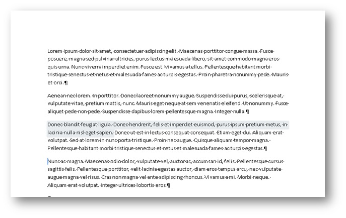
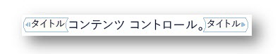
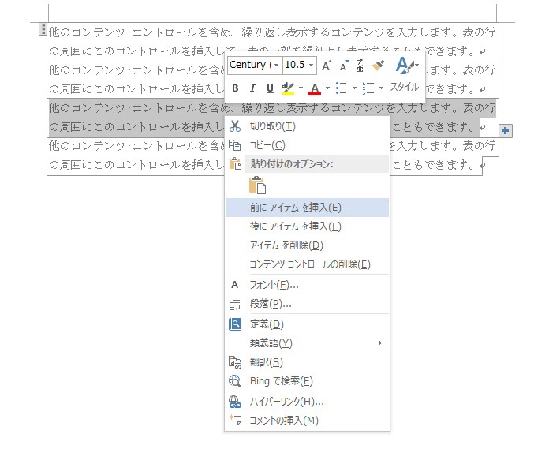
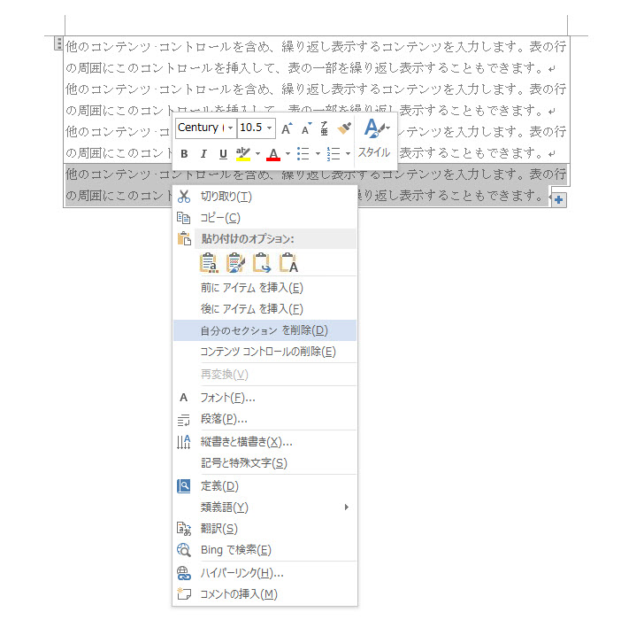
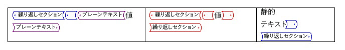
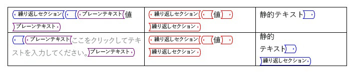

# <a name="content-controls-in-word"></a>Word におけるコンテンツ コントロール

Microsoft Word 2013 のコンテンツ コントロールが文書の構造化されたシナリオのより広い範囲を有効にする方法について説明します。

このトピックでは、Microsoft Word 2013 とそれらの変更を有効にするドキュメントのシナリオ内のコンテンツ コントロールへの変更に関する情報を提供します。
  
### <a name="structured-documents"></a>構造化文書
<a name="WordCC_StructuredDocs"> </a>

構造化文書とは、文書上でコンテンツを配置できる場所や、文書に含めることのできるコンテンツの種類、コンテンツを編集できるかどうかを管理できる文書のことです。
  
Microsoft Word での構造化コンテンツの一般的なシナリオを以下に示します。
  
- 法律事務所で、ユーザーが変更してはならない法律用語が含まれている文書を作成する。
    
- 企業で、タイトル、作成者、日付だけをユーザーが入力する提案書の表紙を作成する。
    
- 企業で、事前に定義された場所に顧客データが入った請求書を作成する。
    
### <a name="using-content-controls-to-structure-a-document"></a>コンテンツ コントロールを使用して文書を構造化する
<a name="WordCC_StructuredDocs"> </a>

コンテンツ コントロールは、文書内の特定のコンテンツのコンテナーとして機能する Microsoft Word のエンティティです。 個別のコンテンツ コントロールは、日付、リスト、書式設定されたテキストなどのコンテンツを格納できます。 コンテンツは、ヘルプ コンテンツのブロックの構造し、構造化ドキュメントを作成する、ドキュメントに明確に定義されたブロックを挿入するためのテンプレートで使用するために設計されていますが豊富で、作成することを制御します。
  
コンテンツ コントロールは、コンテンツの位置を固定したり、コンテンツの種類を指定したり (日付、画像、テキストなど)、編集を許可または禁止したり、コンテンツにセマンティックな意味を付与したりするため、構造化文書の作成に最適です。
  
### <a name="content-controls-in-word-2010"></a>Word 2010 でコンテンツ コントロール
<a name="WordCC_StructuredDocs"> </a>

以下のコンテンツ コントロールは、Word 2010 で使用できます。
  
- リッチ テキスト
    
- プレーン テキスト
    
- 画像
    
- 文書パーツ ギャラリー
    
- コンボ ボックス
    
- ドロップダウン リスト
    
- 日付
    
- チェックボックス
    
- グループ
    
コンテンツ コントロールを Word 2010 は、さまざまな潜在的な構造化ドキュメント ソリューションを有効にするが、Word 2013 では、コンテンツ コントロールよりさまざまなシナリオを有効にします。
  
## <a name="content-control-improvements-in-word-2013"></a>Word 2013 のコンテンツ コントロールの機能強化
<a name="WordCC_WhatsNew"> </a>

2013 年 Word のコンテンツ コントロールは、次の 3 つの大きな進歩を提供: ビジュアル化、リッチ テキスト コンテンツ コントロールの XML マッピングのサポートと繰り返されるコンテンツについての新しいコンテンツ コントロールを改善します。
  
### <a name="improved-visualization"></a>視覚化の改善

Word 2013 では、個々 のコンテンツ コントロールに 3 つの状態のいずれかで表示されることができます。
  
- 境界ボックス
    
- 開始/終了タグ
    
- なし
    
> [!NOTE]
> 場合は明記されません、文書が**デザイン モード**で表示されていないときにこのセクションでコンテンツ コントロールのビジュアル化について説明します。コンテンツ コントロールの表示モードを設定するには、**コンテンツ コントロールのプロパティ**] ダイアログ ボックスでドロップ ダウン リスト**として表示する**コントロールを使用します。 
  
**図 1 です。コンテンツ コントロールのプロパティ] ダイアログ ボックス**

![コンテンツ コントロールのプロパティ] ダイアログ ボックス](media/DK2_WordCC_Fig01.jpg "コンテンツ コントロールのプロパティ] ダイアログ ボックス")
  
( [Word 2013 の新しいコンテンツ コントロールのオブジェクト モデルのメンバー](#WordCC_NewOM)に後で説明します)、Word 2013 のオブジェクト モデルを使用してコンテンツ コントロールの表示モードを設定することもできます。
  
### <a name="bounding-box"></a>境界ボックス
<a name="WordCC_DefaultRendering"> </a>

Word 2007 および Word 2010 で表示されるコンテンツ コントロールの外観を保持するのには、Word 2013 のコンテンツ コントロールの既定のレンダリング外接するボックスをオンします。 **バウンディング ボックスで**、次のユーザーの操作に応じて表示の変更を表示するコンテンツ コントロールを設定するとします。
  
- コンテンツ コントロールにフォーカスがないときには視覚化されません
    
- マウスを置くと、コンテンツ コントロールは影付きの四角形として表示されます
    
**図 2 になります。マウス ポインターを上のコンテンツ コントロール**


  
- コンテンツ コントロールにフォーカスがある場合 (ユーザーがコンテンツ コントロールを選択した場合)、コントロールが「境界ボックス」として表示されます （コンテンツで線で囲まれ、タイトルを設定した場合にはそのタイトルが表示されます）
    
**図 3 です。フォーカスを持つコントロールのコンテンツ**


  
### <a name="startend-tags"></a>開始/終了タグ
<a name="WordCC_StartEndTags"> </a>

**開始/終了タグ**で表示するコンテンツ コントロールを設定すると、タグがユーザーの操作に関係なく表示され、タイトルは表示されません。ですが、上でマウスのボタン、**ドロップダウン リスト**ボタンなどが表示されます。 
  
**図 4 です。コンテンツ コントロールの開始/終了タグを表示する設定**


  
### <a name="none"></a>なし
<a name="WordCC_Invisible"> </a>

**[なし]** として表示するコンテンツ コントロールを設定すると、コンテンツ コントロールは表示されません。
  
### <a name="content-control-colorization"></a>コンテンツ コントロールの色
<a name="WordCC_CCColorization"> </a>

、別の種類のコンテンツ コントロールの表示を有効にするだけでなく Word 2013 も、個々 のコンテンツ コントロールの色を設定できます。 コンテンツ コントロールの色を設定するには、**コンテンツ コントロールのプロパティ**] ダイアログ ボックスで [**色**] ボタンを使用します。 
  
( [Word 2013 の新しいコンテンツ コントロールのオブジェクト モデルのメンバー](#WordCC_NewOM)に後で説明します)、Word 2013 のオブジェクト モデルを使用してコンテンツ コントロールの色を設定することもできます。
  
**図 5。コンテンツ コントロールのプロパティ] ダイアログ ボックス**

![コンテンツ コントロールのプロパティ] ダイアログ ボックス](media/DK2_WordCC_Fig05.jpg "コンテンツ コントロールのプロパティ] ダイアログ ボックス")
  
### <a name="support-for-xml-mapping-for-rich-text-content-controls"></a>リッチ テキスト コンテンツ コントロールの XML マッピングのサポート
<a name="WordCC_XMLMapping"> </a>

Word 2013 では、リッチ テキスト コンテンツ コントロール、文書パーツ コンテンツ コントロールの内容を XML データ ストアにマップすることができます。 これを行うには、コンテンツ コントロールの*XML マッピング*を設定します。 オブジェクト モデルでは、既存の**XMLMapping.SetMapping**メソッドを使用してこのプロパティを設定することができます。 フラットの Open XML マークアップ文字列に変換 (を使用して、標準の XML エンコーディング)、ようにすると、カスタム XML パーツ内でカスタム XML が格納されるカスタム XML 部分内のテキスト ノードとして格納できます。 ただし、マッピングは引き続き、リーフ ノードまたは属性にマップにのみ正常にできる制限があります。 
  
> [!NOTE]
> リッチ テキスト コンテンツ コントロールに他のリッチ テキスト コンテンツ コントロールを含めることはできません。(ファイル形式の操作やコピーと貼り付けなどによって) リッチ コンテキスト コンテンツ コントロールが別のリッチ コンテキスト コントロールの中に入ると、それはマップされたリッチ テキスト コントロールの中に含まれなくなるまでリンク解除されます。 
  
XML マッピングを設定する方法の詳細については、このトピックの後半のセクション[Word 2013 の新しいコンテンツ コントロールのオブジェクト モデルのメンバー](#WordCC_NewOM)を参照してください。 
  
### <a name="supporting-repeating-content"></a>繰り返しコンテンツのサポート
<a name="WordCC_SupportingRepeating"> </a>

視覚化機能の強化およびリッチ テキスト コンテンツ コントロールに XML マッピングのサポートに加え、Word 2013 は、新しいコンテンツ コントロールを使用すると、コンテンツを繰り返しているを追加します。 繰り返しセクションのコンテンツ コントロールには、他のコンテンツ コントロールを含む、内に含まれる内容が繰り返されます。
  
段落全体や表の行の周囲に繰り返しセクション コンテンツ コントロールを挿入します。あるセクションをこのコントロールで囲むと、中に含まれているセクションの上または下にそのセクションのコピーを挿入できます。
  
**図 6 です。繰り返しセクションのコンテンツ コントロールのコンテキスト メニュー**


  
繰り返して、[挿入] セクション (プラス記号 () 付きのボタンとして表示されます)、コンテンツ コントロールの最後に、どちらのコントロールを使用するか、[コンテキスト] メニューのコマンドを選択することによって図 6 に示すように。 繰り返し出現するコンテンツは、**コンテンツ コントロールのプロパティ**] ダイアログ ボックスを使用してタイトルを割り当てることができますコントロールの個別のセクションになります。 
  
**図 7 です。コンテンツ コントロールのプロパティ] ダイアログ ボックスで、セクションのタイトルを割り当てる**

![コンテンツ コントロールのプロパティ] ダイアログ ボックス](media/DK2_WordCC_Fig07.jpg "コンテンツ コントロールのプロパティ] ダイアログ ボックス")
  
指定するセクション、タイトル、**コンテンツ コントロールのプロパティ**] ダイアログ ボックスで**ユーザーを追加し、セクションの削除を許可する**を選択した場合、ユーザーを追加したり、名前でセクションを削除できます。 
  
**図 8 です。繰り返しセクションのコンテンツ コントロールのコンテキスト メニューを使用して、セクションを削除するのには**


  
繰り返しセクション コンテンツ コントロールで他のコンテンツ コントロールを囲むと、中に含まれたコンテンツ コントロールは新しいアイテムごとに繰り返されます。ただし、そのようなコンテンツ コントロールのコンテンツはプレースホルダー テキストにリセットされます。以下の 2 つの例外の場合には子コントロール コンテンツが保持されます。 
  
- 子コントロールが繰り返しセクション コントロールの場合。
    
- 子コントロールが、繰り返しセクション コンテンツ コントロール外のノードに XML マッピングされている場合。
    
**図 9 です。反復する前に子コントロールを含むセクションのコンテンツ コントロールを繰り返し**


  
**図 10 です。繰り返しの後に子コントロールを含むセクションのコンテンツ コントロールを繰り返し**


  
### <a name="repeating-section-content-controls-around-xml-mapped-controls"></a>XML マッピング コントロールを囲む繰り返しセクション コンテンツ コントロール
<a name="WordCC_RepeatingSectionCCs"> </a>

繰り返しセクションに含まれる XML マッピングでは、Word 2013 マップに次のようにします。
  
マッピングは、親チェーンの一部として設定されるノード内のアイテムと交差しない、バインディングは「絶対バインディング」と、すべての繰り返しセクション項目に同じ内容を示しています。
  
マッピングは、親チェーンの一部として設定されるノード内のアイテムに交差すると、バインドが「相対バインド"、次のように再マップされます。
  
- ノードの絶対バインディングが判別されます (クエリ式はすべて平坦化されます) - これは最初のマッピングで生じます。
    
- ノード セットと重なるバインディングの軸が削除されます。
    
- 残りの XPath が、繰り返しセクション コンテンツ アイテムの XPath に基づいて相対評価されます。
    
たとえば、次のマッピングが生じるとします。
  
- 繰り返しセクションが \root\next\path にマップされます。
    
- サンプル アイテム内のコントロールが \root\next\path[2]\baz にマップされます。
    
- Word が \root\next\path[2] をノード セット内のアイテムに対応付けます。
    
結果としてバインディングは .\baz として評価されます。この場合、繰り返しコンテンツ アイテムのノードが基準となります。
  
繰り返しコンテンツ コントロールを処理する際、データの損失を避けて障害を防止するには以下の提案が役立ちます。
  
### <a name="working-with-repeating-section-content-controls-that-are-mapped-to-xml-data"></a>XML データにマップされる繰り返しセクション コンテンツ コントロールを扱う
<a name="WordCC_RepeatingSectionCCs"> </a>

たびに、ユーザーには、ドキュメントが開かれた XML データにマップされている繰り返しセクションでコンテンツ コントロールを挿入すると、Word は、データ ストア内の情報に基づいて、繰り返しセクション項目を再作成されます。 文書を保存する場合でも、ユーザーは、繰り返しセクション内のアイテムに、ドキュメント データ ストアにマップされていないも、すべての変更は失われます。
  
この事態が生じないようにするには、繰り返しセクション コンテンツ コントロールをロックし、同じように XML にマップされる、ロックされていない子コンテンツ コントロールでのみユーザーが編集を行えるようにします。
  
### <a name="binding-a-repeating-section-content-control-to-a-table"></a>繰り返しセクション コンテンツ コントロールを表にバインドする
<a name="WordCC_RepeatingSectionCCs"> </a>

テーブルに繰り返しセクションのコンテンツ コントロールをバインドする場合は、テーブル*し*挿入の繰り返しセクションでコンテンツ コントロールとその他の方法ではありません周囲を挿入します。 (それ以外の場合、ことはできませんテーブルのみを選択する)。 
  
### <a name="nesting-repeating-section-content-controls-within-a-table"></a>繰り返しセクション コンテンツ コントロールを表の中に入れ子にする
<a name="WordCC_RepeatingSectionCCs"> </a>

繰り返しセクション コンテンツ コントロールを表の中に隣接して入れ子にする場合 (たとえば、親の繰り返しセクション コンテンツ コントロールの最後と子繰り返しセクション コンテンツ コントロールが同じセル内にある場合)、内部セクションでアイテムを追加したり削除したりすると、外部繰り返しセクションが削除されます。
  
発生している間と次の 1 つの繰り返しセクションでコンテンツ コントロールの最後の段落記号を追加することによって、これを防ぐことができます。 段落記号を非表示には、リボンの [**ホーム**] タブの**表示/非表示**オプションをオフにします。 
  
### <a name="open-xml-file-format-schema-additions"></a>Open XML ファイル形式スキーマにおける追加内容
<a name="WordCC"> </a>

WordprocessingML Open XML ファイル形式スキーマに以下の要素が追加されました。
  
**表 1 です。コンテンツ コントロールの Open XML ファイルの形式の WordprocessingML スキーマに新しい要素**

|**要素**|**説明**|
|:-----|:-----|
|\<w:appearance\>  <br/> |\<w:appearance\>の子要素は、 \<w:sdtPr\>。  <br/> val 属性には以下の値が有効です。  <br/> \<w:appearance val = boundingBox|タグの前に追加されるマークアップ|非表示にします。  <br/> 既定値は boundingBox です。  <br/> |
|\<w:color\>  <br/> |\<w:color\>の子要素は、 \<w:sdtPr\>。  <br/> このコンテンツ モデルは、既存の CT_Color 複合型と一致します。既定値は Word 2010 で使用されている色です。  <br/> |
   
## <a name="new-word-2013-content-control-object-model-members"></a>新しい Word 2013 のコンテンツ コントロール オブジェクト モデルのメンバー
<a name="WordCC_NewOM"> </a>

新しい拡張機能と Word 2013 のコンテンツ コントロールに追加された機能では、新しい機能セットをプログラムで操作できるように、Word のオブジェクト モデルが更新されました。 さらに、また行ったワード プロセッシング ドキュメントの Open XML ファイルの基になる形式にします。
  
以下のセクションでは、各コンテンツ コントロール機能拡張に関連する特有のオブジェクト モデルの変更内容について詳しく取り上げます。
  
### <a name="visualization-enhancements"></a>視覚化の機能拡張
<a name="WordCC_VisEnhancements"> </a>

コンテンツ コントロールのビジュアル化の拡張機能のいくつかのオブジェクト モデルの追加は Word 2013 で含まれます。 次の表は、 **ContentControl**オブジェクトのビジュアル化の新しいメンバーを一覧表示します。 
  
**表 2 になります。新しい ContentControl オブジェクトのメンバー**

|**メンバー**|**説明**|
|:-----|:-----|
|. **WdContentControlAppearance**と**外観** <br/> |コンテンツ コントロールの視覚化を取得または設定します。  <br/> |
|. **Wdcolor クラス**として**の色** <br/> |コンテンツ コントロールの色を取得または設定します。  <br/> |
   
新しい**WdContentControlAppearance**列挙体の定数を次の表に一覧します。 
  
**表 3。新しい WdContentControlAppearance 列挙型定数**

|**定数**|**説明**|
|:-----|:-----|
|**wdContentControlBoundingBox** <br/> |影付きの四角形/境界ボックスとして表示されるコンテンツ コントロールを表します (オプションとしてタイトルが表示されます)。  <br/> |
|**wdContentControlTags** <br/> |開始/終了マーカーとして表示されるコンテンツ コントロールを表します。  <br/> |
|**wdContentControlHidden** <br/> |コンテンツ コントロールが表示されないことを表します。  <br/> |
   
### <a name="code-sample"></a>コード サンプル
<a name="WordCC_VisEnhancements"> </a>

以下のコード サンプルは、プログラムを使用して、リッチ テキスト コンテンツ コントロールの作成と、視覚化の設定を行う方法を示しています。
  
```vb
Sub testVisualization()
   Dim objcc As ContentControl
   Dim objRange As Range
   
   ' Get the first paragraph as a range object.
   Set objRange = ActiveDocument.Paragraphs(1).Range
   ' Create a rich text content control around the first paragraph.
   Set objcc = ActiveDocument.ContentControls.Add(wdContentControlRichText, objRange)
   objcc.Title = "Default Bounding Box"
   ' Set visualization to the default.
   objcc.Appearance = wdContentControlBoundingBox
   
   ' Create a new paragraph.
   objRange.InsertParagraphAfter
   Set objRange = ActiveDocument.Paragraphs(2).Range
   ' Create a rich text content control around the second paragraph.
   Set objcc = ActiveDocument.ContentControls.Add(wdContentControlRichText, objRange)
   objcc.Title = "Non Bounding"
   ' Set visualization to invisible.
   objcc.Appearance = wdContentControlHidden
   
   ' Create a new paragraph.
   objRange.InsertParagraphAfter
   Set objRange = ActiveDocument.Paragraphs(3).Range
   ' Create a rich text content control around the third paragraph.
   Set objcc = ActiveDocument.ContentControls.Add(wdContentControlRichText, objRange)
   objcc.Title = "Tags Only with Pink color"
   ' Set visualization to Start/End tags with pink color.
   objcc.Appearance = wdContentControlTags
   objcc.Color = wdColorPink
End Sub
```

### <a name="xml-mapping"></a>XML マッピング
<a name="WordCC_XMLMappingOM"> </a>

文書のデータ ストア内の XML ノードをリッチ テキストのマッピングに対応する Word 2013 のオブジェクト モデルに追加機能を加えていません。 代わりに、リッチ テキスト コンテンツ コントロールを文書のデータ ストア内の XML ノードにマップするのに既存のオブジェクト モデルを使用します。 さらに、XML の対応付けを具体的には新たに付属のリッチ テキスト コンテンツ コントロールのサポートの一環として開いた XML ファイル形式の WordprocessingML スキーマに変更を加えてないです。
  
#### <a name="code-sample"></a>コード サンプル

以下のコード サンプルは、プログラムを使用して XML ノードにリッチ テキスト コンテンツ コントロールをマップする方法を示しています。
  
```vb
Sub testRichBinding()
   Dim objRange As Range
   Dim objcc As ContentControl
   Dim objCustomPart As CustomXMLPart
   Dim blnMap As Boolean
   
   ' Add a custom XML part to the data store.
   Set objCustomPart = ActiveDocument.CustomXMLParts.Add
   ' Load XML fragment into the custom XML part.
   objCustomPart.LoadXML ("<x>Rich Text Databinding</x>")
   ' Get the first paragraph as a range object.
   Set objRange = ActiveDocument.Paragraphs(1).Range
   ' Create a rich text content control around the first paragraph.
   Set objcc = ActiveDocument.ContentControls.Add(wdContentControlRichText, objRange)
   ' Bind the XML node to the rich text content control.
   blnMap = objcc.XMLMapping.SetMapping("/x")
   ' Return whether mapping worked.
   MsgBox objcc.XMLMapping.IsMapped
End Sub
```

### <a name="repeating-section-content-controls-represented-in-the-object-model"></a>オブジェクト モデルで表される繰り返しセクション コンテンツ コントロール
<a name="WordCC_RepeatingSection"> </a>

繰り返しセクションのコンテンツ コントロールは、 **ContentControl**オブジェクトを新しい**RepeatingSectionItem**オブジェクトと**RepeatingSectionItemColl**オブジェクトは、以下の追加を使用してオブジェクト モデルで使用できます。 表 4 には、繰り返しセクションのコンテンツ コントロールの**ContentControl**オブジェクトの最も重要な新しいメンバーが一覧表示されます。 
  
**表 4 です。ContentControl オブジェクトのメンバー**

|**メンバー**|**説明**|
|:-----|:-----|
|**ブール値**として**AllowInsertDeleteSection** <br/> |取得またはユーザーを追加したり、UI を使用してコンテンツ コントロールからセクションを削除するかどうかを設定します。 次のエラー メッセージが繰り返しセクションの種類ではありませんが、コンテンツ コントロールのこのプロパティを呼び出すと、呼び出しに失敗した:「このプロパティのみ使用できます繰り返しセクションのコンテンツ コントロールに」。  <br/> |
|**文字列**として**RepeatingSectionItemTitle** <br/> |取得または繰り返しセクションの項目のコンテキスト メニューで使用される名前を設定します。 繰り返しセクションの種類ではありませんが、コンテンツ コントロールのこのプロパティを呼び出すと、呼び出しに失敗した:「このプロパティのみ使用できます繰り返しセクションのコンテンツ コントロールに」。  <br/> |
|**ContentControl**として**InsertRepeatingSectionItemBefore** <br/> |現在の項目の前に繰り返しセクション項目を追加し、新しい繰り返しセクション項目を返します。 繰り返しセクションの項目の種類ではありませんが、コンテンツ コントロールのこのメソッドを呼び出すと、呼び出しに失敗した:「このプロパティのみ使用できます繰り返しセクションの項目のコンテンツ コントロールに」。  <br/> |
|**ContentControl**として**InsertRepeatingSectionItemAfter** <br/> |現在の項目の後に繰り返しセクション項目を追加し、繰り返しセクションの [新しい項目を返します。 繰り返しセクションの項目の種類ではありませんが、コンテンツ コントロールのこのメソッドを呼び出すと、呼び出しに失敗した:「このプロパティのみ使用できます繰り返しセクションの項目のコンテンツ コントロールに」。  <br/> |
   
表 5 には、 **RepeatingSectionItem**オブジェクトの最も重要なメンバーが一覧表示されます。 
  
**表 5 です。RepeatingSectionItem オブジェクトのメンバー**

|**メンバー**|**説明**|
|:-----|:-----|
|**範囲**と**範囲** <br/> |指定した繰り返しセクション項目を開始タグと終了タグを除外の範囲を返します。  <br/> |
|**Delete** <br/> |指定の繰り返しセクションアイテムを削除します。  <br/> |
|**RepeatingSectionItem**と**InsertItemAfter** <br/> |指定のアイテムの後に繰り返しセクション アイテムを追加し、新しいアイテムを返します。  <br/> |
|**RepeatingSectionItem**と**InsertItemBefore** <br/> |指定のアイテムの前に繰り返しセクション アイテムを追加し、新しいアイテムを返します。  <br/> |
   
表 6 には、 **RepeatingSectionItemColl**オブジェクトの最も重要なメンバーが一覧表示されます。 
  
**表 6 です。RepeatingSectionItemColl オブジェクトのメンバー**

|**メンバー**|**説明**|
|:-----|:-----|
|**項目** **RepeatingSectionItem**として <br/> |個々の繰り返しセクション アイテムを返します。  <br/> |
   
表 7 は、繰り返しセクションのコンテンツ コントロールの**WdContentControlType**列挙型の新しいメンバーを示しています。 
  
**表 7。WdContentControlType 列挙型の加算**

|**定数**|**説明**|
|:-----|:-----|
|**wdContentControlRepeatingSection** <br/> |1 つの繰り返しセクションに 1 つのアイテムが含まれるコンテンツ コントロールを表します。  <br/> |
   
### <a name="code-sample"></a>コード サンプル
<a name="WordCC_RepeatingSection"> </a>

以下のコード サンプルは、繰り返しセクション コンテンツ コントロールをプログラムによって使用する方法を示しています。
  
```vb
Sub testRepeatingSectionControl()
   Dim objRange As Range
   Dim objTable As Table
   Dim objCustomPart As CustomXMLPart
   Dim objCC As ContentControl
   Dim objCustomNode As CustomXMLNode
   
   Set objCustomPart = ActiveDocument.CustomXMLParts.Add
   objCustomPart.LoadXML ("<books>" & _
       "<book><title>Everyday Italian</title>" & _
       "<author>Giada De Laurentiis</author></book>" & _
       "<book><title>Harry Potter</title>" & _
       "<author>J K. Rowling</author></book>" & _
       "<book><title>Learning XML</title>" & _
       "<author>Erik T. Ray</author></book></books>")
   
   Set objRange = ActiveDocument.Paragraphs(1).Range
   Set objTable = ActiveDocument.Tables.Add(objRange, 2, 2)
   With objTable.Borders
       .InsideLineStyle = wdLineStyleSingle
       .OutsideLineStyle = wdLineStyleDouble
   End With
   Set objRange = objTable.Cell(1, 1).Range
   Set objCustomNode = objCustomPart.SelectSingleNode("/books[1]/book[1]/title[1]")
   Set objCC = ActiveDocument.ContentControls.Add(wdContentControlText, objRange)
   objCC.XMLMapping.SetMappingByNode objCustomNode
   Set objRange = objTable.Cell(1, 2).Range
   Set objCustomNode = objCustomPart.SelectSingleNode("/books[1]/book[1]/author[1]")
   Set objCC = ActiveDocument.ContentControls.Add(wdContentControlText, objRange)
   objCC.XMLMapping.SetMappingByNode objCustomNode
   Set objRange = objTable.Rows(1).Range
   Set objCC = ActiveDocument.ContentControls.Add(wdContentControlRepeatingSection, objRange)
   objCC.XMLMapping.SetMapping ("/books[1]/book")
End Sub
```

### <a name="open-xml-file-format-changes-for-repeating-section-content-controls"></a>繰り返しセクション コンテンツ コントロールにおける Open XML ファイル形式の変更点
<a name="WordCC_RepeatingSection"> </a>

繰り返しセクションのコンテンツ コントロールのファイル形式の表現一般にである、同じ要素の名前、値というように既存の XML のマークアップです。ただし、 \<sdt\>以前のバージョンの Word との互換性を確保するのには Word 2013 の名前空間に繰り返しセクションの外側のコンテナーを表す要素が存在します。
  
繰り返しセクション コンテンツ コントロールによって囲まれた、内側の個々の繰り返しアイテムは、既存の WordprocessingML 表記を使用してリッチ テキスト コンテンツ コントロールとして保存されます。表 8 に、繰り返しセクション コンテンツ コントロール用 WordprocessingML スキーマの新しい要素をまとめます。
  
**表 8。繰り返しセクションの WordprocessingML スキーマに新しい要素のコンテンツ コントロール**

|**要素**|**説明**|
|:-----|:-----|
|\<w15:repeatingSection\>  <br/> |繰り返しセクション コンテンツ コントロールを指定します。この要素は、他のすべてのコントロール タイプと互いに排他的で、子要素も子属性もありません。  <br/> |
|\<w15:repeatingSectionItem\>  <br/> |繰り返しセクション アイテム コンテンツ コントロールを指定します。この要素は他のコントロール タイプすべてと互いに排他的で、子要素も子属性もありません。  <br/> |
|\<w15:doNotAllowInsertDeleteSection\>  <br/> |ユーザーが追加または Word 2013 でユーザー インターフェイスを使用してセクションを削除できないを指定します。  <br/> |
|\<w15:sectionTitle\>  <br/> |繰り返しセクション アイテムの名前を指定します (コントロールが選択されるときにコンテキスト メニューで使用されます)。  <br/> |
   

  

